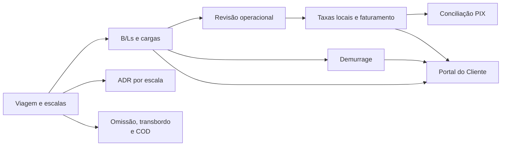

# Vela

O **Vela** é a plataforma operacional da **Transhipping Agenciamento Marítimo Ltda.** para acompanhar a operação marítima desde o cadastro da viagem até a entrega das informações e documentos ao cliente.

O sistema está em produção e combina uma aplicação interna, voltada às equipes da agência, com um Portal do Cliente no mesmo produto.

## O produto em uma visão

O centro da operação é a **Viagem**: navio, rota e escalas brasileiras formam a base sobre a qual o sistema organiza cargas, documentos e acontecimentos operacionais.



A plataforma mantém a separação entre o que é **operacional** e o que é **financeiro**, registra decisões relevantes e usa as mesmas fontes de dados nos módulos que dependem delas. A operação começa na Viagem e evolui por B/L, carga, escalas e eventos; a revisão organiza pendências e autorizações antes que os dados elegíveis avancem para taxas locais e faturamento. O resultado financeiro pode ser acompanhado no ciclo de invoices e confirmado pela Conciliação PIX.

O ADR, por exemplo, é uma visão consolidada da escala, não um cadastro paralelo: os dados de carga, veículos, vazios, Granito e overtime nascem nos módulos de origem; no relatório ficam as observações, resoluções e sign-offs departamentais. Da mesma forma, o Portal apresenta ao cliente os dados operacionais e financeiros liberados pela operação interna, respeitando uma sessão e um escopo de acesso próprios.

## Capacidades atuais

- **Viagens e escalas:** cadastro e acompanhamento de rotas, previsões e datas reais, publicação de programação no Portal e Line Up TV.
- **Manifestos e documentos:** importação e tratamento de B/Ls CNTR, carga solta e mistos, veículos, CE Mercante e Baplie EDI.
- **Operação de carga:** containers, vazios de importação, embarque de vazios, depots e Granito.
- **Exceções operacionais:** omissão de escala, transbordo global da viagem e decisão individual de COD por B/L.
- **Revisão e rastreabilidade:** cockpit operacional do B/L, reconciliação de cliente, histórico, pendências e gates antes do faturamento.
- **Agency Departure Report:** um relatório por terminal da escala brasileira, com dados consolidados, resolução por seção, sign-off por departamento e prazo de conclusão.
- **Comercial e financeiro:** clientes, tabelas e overrides de taxas locais, invoices, demurrage, Conciliação PIX e relatórios.
- **Portal do Cliente:** visão geral, B/Ls, containers, faturas, demurrage, notificações, disputas, perfil e recuperação de senha.
- **Administração e suporte:** usuários internos, alertas, relatórios, programação de chegadas e saídas e display do Line Up.

O catálogo de módulos e o mapa de rotas estão em [`docs/README.md`](docs/README.md). O glossário que define a linguagem do negócio está em [`CONTEXT.md`](CONTEXT.md).

## Como o sistema é construído

O frontend é composto por duas SPAs React/TypeScript carregadas sob demanda a partir da mesma base de código: o build interno do Vela e o build do Portal Fwlog. Cada superfície tem sua própria entrada HTML, roteador, sessão de autenticação e projeto Vercel; serviços, tipos, dados e componentes neutros continuam compartilhados. O Supabase fornece PostgreSQL, Auth e Edge Functions.

- **Frontend:** React 19, TypeScript, Vite, React Router, TanStack Query, Tailwind CSS e Zod.
- **Dados e segurança:** PostgreSQL no Supabase, RLS, grants e RPCs auditadas. A autorização real está no banco; proteção de rota e visibilidade de controles são apenas UX.
- **Sessões:** aplicação interna e Portal usam clientes Supabase separados, podendo coexistir no mesmo navegador.
- **Integrações:** Resend para email transacional do Portal e Comunicados ao Cliente, Banco Central para PTAX e Sentry para observabilidade.
- **PIX:** BR Code estático e conciliação por extrato; integração direta com a API Itaú continua como spec futura em `docs/spec/2026-08-25-integracao-itau-pix.md`.
- **Entrega:** GitHub Actions valida pull requests e pushes em `main`; a integração GitHub/Vercel cria Preview Deployments para PRs e Production Deployments a partir de `main`. Migrations e Edge Functions têm ciclo de deploy próprio no Supabase.

O mapa técnico completo, as fronteiras de autenticação e as fontes de dados por módulo estão em [`docs/ARCHITECTURE.md`](docs/ARCHITECTURE.md).

## Rodar localmente

Pré-requisitos: Node.js 24.x e um projeto Supabase compatível com as migrations do repositório.

```bash
npm ci --legacy-peer-deps
cp .env.example .env
npm run dev
```

Para o app subir, o `.env` precisa conter `VITE_SUPABASE_URL` e `VITE_SUPABASE_ANON_KEY`. O fluxo completo — banco, usuário interno, Edge Functions e limites do ambiente local — está em [`docs/setup/development.md`](docs/setup/development.md).

## Comandos essenciais

```bash
npm run dev                 # desenvolvimento local
npm run docs:check          # links e consistência da documentação
npm run lint                # ESLint
npm test                    # testes unitários
npm run build               # verificação de tipos e build de produção
npm run test:integration    # integração opt-in com Supabase controlado
```

Testes de integração não devem apontar para produção. Os critérios e o escopo da suíte estão em [`docs/setup/testing.md`](docs/setup/testing.md).

## Segurança e operação

- O Portal não usa cadastro público nem sessão legada por senha armazenada em tabela; o provisionamento é controlado internamente.
- RLS e RPCs definem o escopo de dados e as permissões de cada perfil.
- Migrations devem ser aplicadas de forma controlada no Supabase e não são executadas pelo deploy da SPA.
- O reset operacional amplo está suspenso; quando necessário, siga [`docs/operations/reset-ambiente.md`](docs/operations/reset-ambiente.md).
- Antes de alterar schema, autenticação, rotas, integrações ou regras de negócio, consulte [`AGENTS.md`](AGENTS.md) e as fontes de verdade listadas nele.

## Onde encontrar cada coisa

| Necessidade | Documento |
|---|---|
| Entender arquitetura, camadas e rotas | [`docs/ARCHITECTURE.md`](docs/ARCHITECTURE.md) |
| Consultar termos e invariantes do negócio | [`CONTEXT.md`](CONTEXT.md) |
| Desenvolver localmente | [`docs/setup/development.md`](docs/setup/development.md) |
| Testar e validar | [`docs/setup/testing.md`](docs/setup/testing.md) |
| Fazer deploy | [`docs/setup/deploy.md`](docs/setup/deploy.md) |
| Rastrear uma rota, ação, serviço ou RPC | [`docs/RASTREABILIDADE.md`](docs/RASTREABILIDADE.md) |
| Ler regras de negócio e segurança | [`docs/operations/`](docs/operations/) |
| Entender decisões arquiteturais | [`docs/adr/`](docs/adr/) |
| Ver documentação viva e histórico | [`docs/README.md`](docs/README.md) |

## Estrutura do repositório

| Caminho | Conteúdo |
|---|---|
| [`src/`](src/) | Aplicação React, páginas, componentes, hooks, serviços e testes |
| [`public/`](public/) | Assets estáticos e templates públicos de importação |
| [`supabase/`](supabase/) | Migrations e Edge Functions |
| [`docs/`](docs/) | Arquitetura, módulos, operações, ADRs e arquivo histórico |
| [`scripts/`](scripts/) | Ferramentas de documentação, banco, performance e manutenção |
| [`.github/`](.github/) | Workflows de CI/CD |
| [`test-fixtures/`](test-fixtures/) | Fixtures técnicas para testes de importação |

As diretrizes para desenvolvimento assistido por IA estão em [`AGENTS.md`](AGENTS.md), fonte canônica de regras, salvaguardas e gates.
