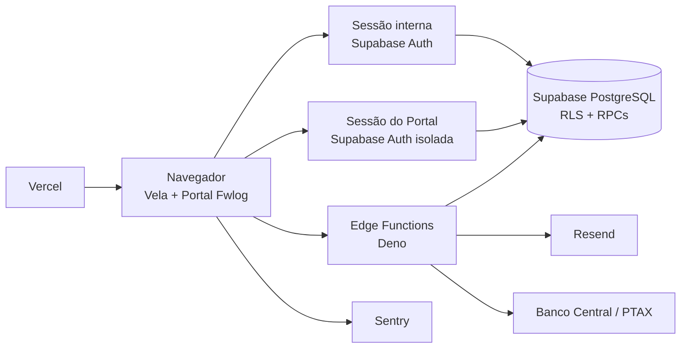
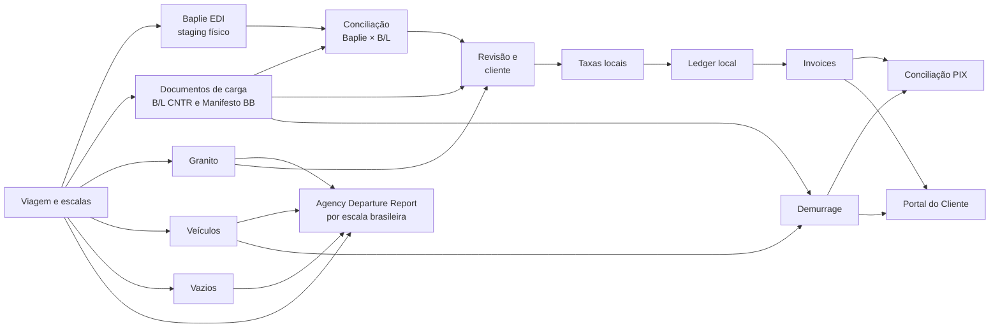

# Arquitetura do Vela e do Portal Fwlog

Verificado contra o código, a configuração e as migrations em 2026-09-07.

Este é o mapa canônico da arquitetura atual. Termos de negócio vivem em
[`CONTEXT.md`](../CONTEXT.md); decisões e supersessões vivem no
[índice de ADRs](./adr/README.md).

## Visão geral



O frontend entrega duas SPAs estáticas, com entradas e roteadores separados. A segurança real não depende do roteador: tabelas,
views e funções do Supabase aplicam escopo e autorização por RLS, grants e
validações dentro das RPCs.

### Estado da remediação #654–#660

As migrations `022`–`026` adicionam inbox durável para eventos de email,
consumidores server-only de efeitos pós-commit e snapshots append-only para o
cálculo autoritativo de Demurrage. O webhook só recebe/persiste; runners fazem
claim, retry e transições com service role. O runner de efeitos é agendado, mas
permanece fail-closed até `IMPORT_EFFECTS_RUNNER_ENABLED=true`; o recálculo PTAX
continua nominalmente inativo até validação de Preview, gateway e Vault. Esta é
uma integração parcial do plano, não uma declaração de rollout remoto.

### Comunicados ao Cliente e Caixas de Comunicação

A migration `372_comunicados_fundacao.sql` criou a trilha de Comunicados sem
histórico retroativo: `customer_communications`, seus vínculos B/L e tentativas,
e as supressões específicas do canal. As âncoras do comunicado são snapshots
e não têm FK para escala, atracação ou invoice. A chave global vive no
singleton `app_settings`, nasce desligada e só é alterada pela RPC
`set_communications_enabled(boolean)`, que exige o perfil Administrativo e
registra a mudança em `audit_logs`. A linha singleton `id=1` é obrigatória para
as leituras da aplicação; a migration `044_restore_app_settings_singleton.sql`
reconverge o banco quando houver drift e não sobrescreve valores já existentes.

A migration `008_portal_contact_boxes.sql` (ADR 0064) substituiu o modelo
legado de quatro naturezas operacionais pelas **Caixas de Comunicação**
(`customer_communication_boxes`, `customer_communication_box_kinds`,
`customer_contact_box_links`):
- `documentacao_operacao`: CE e Taxas, NOA, NOR e NOB;
- `financeiro`: CE e Taxas e Cobranças de Demurrage;
- `demurrage`: Cobranças de Demurrage e futuros comunicados de Demurrage.

O salvamento de contatos é atômico via `_apply_customer_contact_configuration`
(com `FOR UPDATE` pessimista do cliente), garantindo exatamente um contato
principal ativo, unicidade de e-mail e desativação lógica (`deactivated_at`).
A edição das caixas na Ficha do Cliente exige a permissão
`customer_communications` no frontend (`CadastroContatosTab`) e no banco
(`internal_save_customer_contact_configuration` valida o papel
administrativo/documentação/equipamentos); demais papéis recebem fallback
somente leitura. Toda alteração gera registro append-only em `customer_contact_change_events`
(com `action_id`, `source`, snapshots e diff estruturado). Capturas automáticas
por B/L passam por `ensure_customer_contact_email` sem sobrescrever dados
cadastrais, e caixas esvaziadas por bounce permanente ou desativação são
reparadas por `repair_customer_contact_box_fallbacks`.

A rota interna `/clientes/comunicacao`, protegida por `customer_communications`,
faz a conferência por público/caixa (`audience`), valida snapshots de destinatários
no pré-disparo e registra simulações; a Edge Function `send-customer-communication`
só chama o Resend quando a chave global estiver ligada.

`portal-email-webhook` resolve o `provider_message_id` tanto em
`portal_email_attempts` quanto em `customer_communication_attempts` e aponta
`portal_email_events` para uma única trilha. Complaint do canal novo fica local;
bounce permanente entra em `portal_suppressed_emails` e pode acionar a cascata
de notificação ao contato alternativo ou o alerta
`cliente_contato_bounced_sem_alternativa`. A notificação da cascata usa uma
natureza própria e não reabre a própria cascata quando sofre bounce.

Comunicados financeiros não usam o evento genérico de emissão como gatilho:
`customer_local_charges_communication_readiness()` calcula, por cliente e
viagem, se todos os B/Ls ativos têm CE Mercante, revisão limpa e situação
financeira concluída. Depois do vínculo do CE, a automação de faturamento
disponibiliza a invoice no Portal e dispara em background o resumo
`ce_mercante_taxas` quando a prontidão está completa. A tabela de Taxas Locais
exibe o bloqueio, o último envio e o reenvio assistido sem quebrar a
idempotência da trilha.

`cobranca_demurrage` é produzido pela Edge Function `demurrage-dunning` em
cadência horária. A régua ancora o primeiro envio em `first_billed_at`, usa o
intervalo de `app_settings`, não tem teto de tentativas e pausa durante disputa
aberta, bounce sem contato alternativo ou ausência de contato válido. O valor
em USD permanece o da cobrança; o BRL exibido no comunicado leva ROE e data de
referência e informa que será recalculado no pagamento.

O hosting usa dois projetos Vercel sobre o mesmo repositório e a mesma base de
código: o projeto interno publica `index.html` em `https://vela.app.br`, e o
projeto do Portal publica `portal.html` em `https://portalfwlog.com.br`.
Cada projeto cria seus próprios Previews para pull requests; a integração de
branching do Supabase mantém as credenciais de Preview alinhadas à branch Git
correspondente. O branch `main` gera os dois Production Deployments e ambos
usam o projeto Supabase de produção. O Portal continua sendo Fwlog, enquanto
Vela identifica somente a superfície interna. O hosting Firebase não faz mais
parte da arquitetura.

Depois de um CI verde, o workflow confiável
`.github/workflows/provision-preview-admin.yml` aguarda o check da branch
Supabase e provisiona `qa-admin@example.test` pela Auth Admin API da própria
Preview, com perfil interno `administrativo`. A senha existe somente como secret do
GitHub Actions; ela não participa do bundle Vite nem do projeto de produção.

### Alertas e notificações internas

Alertas internos têm um agregado histórico em `alerts` e uma projeção de
pendências em `alert_items`. O catálogo `alert_type_catalog` concentra tipo,
severidade, departamento, audiência e destino. `alert_item_events` e
`alert_item_dismissals` preservam o histórico; a dispensa é temporária e exige
motivo, autor e revisão futura. Não há acknowledge nem fechamento manual para
itens novos: os produtores resolvem a origem por RPC.

`internal_notifications` é fan-out por usuário e evento, com RLS que limita a
leitura ao destinatário e permite somente marcar `read_at`. A notificação guarda
a mesma chave surrogate de `alert_items` (`entity_type` + `entity_id`); tanto a
fila de `/alertas` quanto o sino resolvem o rótulo humano por uma consulta em
lote separada (`fetchAlertEntityLabels`) e caem no id quando a tradução não
volta. Alertas críticos
sem audiência ativa tentam Administrativo/Admin e registram a falha em
`alert_notification_failures` quando o fallback também não encontra ninguém.
A audiência efetiva é a união de `alert_type_catalog.audience_departments` com
o departamento gravado no item pelo produtor — no ADR, um item por departamento
(Operações, Documentação e Equipamentos); cada notificação preserva o
`recipient_department` real. Um tipo sem produtor ativo é marcado
`active = false` no catálogo: `invoice_payment_invalid` e
`invoice_cancel_blocked` saíram do roteamento na migration `327` e foram
desativados na `347`; um tipo inativo não é listado em `/alertas/regras` —
`ALERT_RULES` documenta somente os tipos vivos, para a tela não prometer um
alerta que nunca chega. `TYPE_LABELS` mantém o rótulo dos tipos aposentados
porque itens históricos continuam legíveis na fila. O destino de itens ativos é derivado
por `alertEntityLink`, sem uma segunda cópia em PL/pgSQL. A identidade pública
de terminal é `voyage::porto::depots.code`; UUID fica somente no metadata.
A leitura das notificações usa `is_active_read_user()`, portanto inclui o papel
`equipamentos`, que é audiência válida de Dispute e PIX. Linhas antigas de
`alerts` continuam na fila pela RPC `list_alert_queue` até que seus produtores
sejam migrados; a projeção mantém limite global de 200 linhas. Enquanto isso,
o bridge acompanha inserts, fechamentos e reaberturas de carriers concretos:
fecha o item correspondente e emite nova ocorrência/notificação quando a mesma
pendência retorna. O backfill não dispara notificações históricas no deploy.
Transições autoritativas resolvem pagamento/cancelamento de invoice,
convite e falha de envio do Portal, email de recuperação saudável e Dispute de
Demurrage; a emissão automática resolve sua falha anterior ao concluir com
sucesso. Abuso investigável de login continua dependendo da análise do bloco
Portal, como definido na spec #521.

Os detectores server-side são executados pela Edge Function
`alerts-detector`, protegida por `ALERTS_DETECTOR_SECRET`, a cada 15 minutos
por `pg_cron` + `pg_net`. O browser não dispara detectores nem cria
notificações internas. Triggers em audit logs, no estado terminalizado e nas
origens da divergência Baplie/B/L (`baplie_containers`, `bls`, `bl_containers`,
statement-level, migrations `361`/`362`) também reconciliam a origem imediatamente; o
cron é a rede de segurança. O job dispara por
`ops.dispatch_edge_job('alerts-detector', 'ALERTS_DETECTOR_SECRET')`, que lê a
base da API e o segredo do Supabase Vault; o comando agendado cita nomes, nunca
valores (ADR 0063). A pendência
de exportação pós-ATD fica no nível `(viagem, escala)` enquanto os manifests
não possuírem vínculo de terminal. A agenda é instalada quando as extensões estão
disponíveis; enquanto `SUPABASE_URL` ou `ALERTS_DETECTOR_SECRET` faltarem no
cofre, o job continua visível e inerte, registrando `WARNING` a cada execução
até a configuração ser cadastrada
([`operations/segredos-cron.md`](operations/segredos-cron.md)).

## Fronteiras de autenticação

O projeto cria dois clientes em `src/services/supabase.ts`:

- `supabase`: sessão dos usuários internos;
- `supabasePortal`: sessão do cliente, com `storageKey` próprio.

As duas sessões podem coexistir no navegador sem que um logout derrube a outra.

### Acesso interno

O usuário autentica pelo Supabase Auth e precisa de perfil ativo em
`user_profiles`. A interface usa o perfil para navegação e UX; RLS e RPCs
continuam responsáveis pela autorização.

Em Preview, o usuário fixo de teste é criado ou reparado automaticamente pelo
workflow de provisionamento após a branch Supabase estar saudável. Isso é um
procedimento de ambiente, não um usuário ou uma migration de produção.

### Portal do Cliente

O Portal usa exclusivamente sessão do Supabase Auth. O login visível aceita
somente CNPJ e senha; a Edge Function `portal-login` resolve a identidade
técnica no servidor e devolve apenas a sessão. `portal_resolve_login(text)` não
é executável por `anon`/`authenticated`.

A [ADR 0013](./adr/0013-portal-auth-identificador-resolvido-e-excecao-anon.md)
tratou essa resolução como exceção pré-autenticação para `anon`, limitada por
tentativas e erro genérico. **Essa exceção não existe mais:** a migration `182`
revogou `anon` de `portal_resolve_login(text)` quando o login passou a ser
resolvido pela Edge Function com `service_role`. O wrapper `portalResolveLogin`
em `src/services/portalBilling.ts` é código morto, sem chamador de produção. RPCs
de dados do Portal exigem sessão autenticada e resolvem o cliente por
`auth.uid()`.

O cliente do Portal recebe o **mesmo role `authenticated`** do usuário interno.
O role, portanto, não separa os dois: quem separa é o perfil. `user_profiles`
identifica o usuário interno (`is_active_read_user()`, `is_admin()`,
`_portal_actor_role()`) e `customer_portal_accounts` identifica o cliente
(`current_portal_customer_id()`); uma conta de Portal nunca satisfaz a primeira
condição. Daí a regra: nenhuma policy ou função pode autorizar por "estar
autenticado". Policy de leitura com `USING (true)` e função `SECURITY DEFINER`
sem guarda explícita são vazamentos para o Portal — foi essa a causa das
migrations `192` e `257`.

O `PortalAuthProvider` também assina `supabasePortal.auth.onAuthStateChange`.
Eventos `SIGNED_OUT` limpam o overview local e removem todos os caches TanStack
Query com chave iniciada por `portal-`, cobrindo logout em outra aba e falha de
refresh de token. Eventos `SIGNED_IN` e `TOKEN_REFRESHED` reidratam o overview
quando necessário, sem compartilhar estado com a sessão interna.

O provisionamento operacional mantém decisão e situação da conta em eixos
separados em `customer_portal_accounts`. Convites, tentativas/eventos de email,
supressões e histórico append-only vivem respectivamente em
`portal_invites`, `portal_email_attempts`, `portal_email_events`,
`portal_suppressed_emails` e `portal_provisioning_events`. RPCs internos
autorizam transições, pré-voo/backfill e expiração idempotente; nenhum token ou
senha em claro é persistido.

## Camadas do frontend

```text
src/AppInterno.tsx + src/AppPortal.tsx
  -> páginas lazy em src/pages/ (com compartilhamento neutro entre builds)
     -> hooks de estado remoto e mutations em src/hooks/
     -> serviços, parsers e regras em src/services/
     -> componentes compartilhados em src/components/
```

Essa separação é uma direção arquitetural, não uma afirmação de pureza absoluta
do código legado. Páginas ainda executam alguns comandos de serviço e operações
de importação/exportação diretamente. Novas mudanças devem reutilizar o menor
dono existente da operação, sem criar uma segunda implementação.

As páginas são carregadas sob demanda (`React.lazy`) e bibliotecas pesadas como
`@e965/xlsx` entram por `await import(...)`, fora do grafo estático da rota. Cada
rota tem um orçamento de **50 ms** de parse/compile de JS, verificável por
`scripts/perf/measure-page-load.mjs` — ver [setup/testing.md](./setup/testing.md#orçamento-de-carga-das-rotas-performance).

### Responsabilidades

- `src/pages/`: composição de rotas, estado visual e fluxos de tela;
- `src/hooks/`: queries e mutations reutilizáveis com TanStack Query;
- `src/services/`: acesso ao Supabase, parsers, importadores e domínio;
- `src/services/cacheEffects.ts`: seam de invalidação de cache por eventos de domínio (`afterViagemAlterada`, `afterEscalaAlterada`, `afterRotaAlterada`, `afterBaplieImportado`, `afterBlRevisado`, `afterManifestoImportado`); os adapters históricos permanecem atrás dele;
- `src/services/importCore.ts`: leitor único de planilhas por `readSheet` e casamento de cabeçalhos por `HeaderSpec`/`matchHeaders`;
- `src/components/ui/`: primitivas visuais;
- `src/components/shared/`: componentes reutilizados por módulos;
- `src/lib/`: utilitários puros, datas, status, PIX e telemetria;
- `src/lib/errors.ts`: `extractErrorText` e `classifyDbError` (`permissao`, `sessao_expirada`, `conflito`, `limite`, `validacao`, `nao_encontrado`, `desconhecido`); `portalErrorMessage.ts` é seu adapter do Portal;
- `src/types/database.ts`: tipos gerados e complementos tipados do banco.

### Celular e toque

O Vela e o Portal usam o mesmo shell responsivo. Abaixo de 1100px o botão
**Menu** fica no cabeçalho e abre a navegação por cima da página
(`useMobileNav`, em `src/components/layout/`: trava a rolagem, Escape fecha o
grupo aberto e depois o menu). As regras transversais vivem na seção
"Celular e toque" de `src/index.css`, fora de `@layer`, para vencer as
utilitárias do Tailwind sem `!important`:

- `[role='tablist']` vira uma linha única com rolagem lateral abaixo de 768px;
  `TabButton` traz a aba ativa para a vista (`src/lib/tabStrip.ts`);
- `Modal` vira folha ancorada no rodapé abaixo de 640px; o rodapé fixo
  `.app-modal__actions` acompanha o recuo `--app-modal-pad` do corpo;
- com ponteiro de toque (`pointer: coarse`), campos usam fonte de 16px (evita o
  zoom automático do Safari no iPhone), checkboxes têm 20px e botões só com
  ícone e `aria-label`/`title` têm área mínima de 40px.

Tela nova: use `TabButton`/`role="tablist"`, `Modal` e as classes do design
system em vez de overlays próprios; grades com três ou mais colunas devem
começar em uma coluna (`grid sm:grid-cols-3`), e tabelas largas ficam dentro de
`.app-table-scroll`.

### Como rastrear uma interação

Use [`docs/RASTREABILIDADE.md`](./RASTREABILIDADE.md) para partir de uma rota ou
ação e localizar o componente, hook/serviço, contrato Supabase, efeitos de cache,
testes e evidência de runtime. A explicação completa permanece no documento vivo
do módulo proprietário.

## Fluxo operacional e financeiro



### Importações

- Baplie entra em staging por viagem e pode alimentar Vazios de Importação.
- O B/L é a entidade unificada de conhecimento de embarque (`cargo_mode IN ('container', 'carga_solta', 'misto')`), acessado pela rota canônica `/bls` (substituindo em definitivo as antigas telas e rotas separadas `/manifestos` e `/carga-solta`). B/Ls com presença simultânea de contêineres e carga solta assumem automaticamente o modo `misto` via trigger no banco (`trg_sync_bl_cargo_mode_statement` (migration `060`)).
- Arquivos de B/L alimentam os B/Ls e cargas de container; Manifestos BB mantêm seu fluxo próprio. A importação de Manifesto CNTR e a geração local de EDI Mercante foram removidas conforme a ADR 0025.
- Carga solta tem duas portas de ingestão que convivem: o Manifesto BB (planilha) e o B/L avulso do armador em `.pdf`/`.docx`. As duas terminam na mesma RPC transacional (`import_breakbulk_manifest_transactional`); o B/L avulso é lido no cliente (`blDocumentParser.ts`) e convertido em um manifesto de uma linha.
- Manifestos aduaneiros são entidades de lançamento oficial na tabela `manifestos_mercante`, extinguindo a antiga nomenclatura "CE Master". A tabela suporta N manifestos por rota da viagem e indicação explícita de contêineres vazios (`is_empty`). Cada B/L aponta para seu manifesto via `bls.manifesto_mercante_id`. Em manobras de COD (Change of Destination), o CE Mercante (`bls.ce_mercante`) é preservado e o vínculo do manifesto é limpo (`NULL`), gerando pendência operacional.
- Terminal do B/L: `bls.terminal_id` é a exceção auditada; nulo herda de `voyage_escala_operation_fronts` via `resolve_bl_terminal_id`. B/L misto exige convergência das duas frentes ou exceção válida. Terminal não participa da chave tarifária (ADR 0068).
- Granito mantém tabelas próprias, integradas downstream.
- Veículos são importados por planilha e vinculados a B/L/container.
- CE Mercante e datas operacionais têm importadores específicos.
- Arquivos de planilha usam `@e965/xlsx` e devem passar pelo limite de upload antes do parsing. B/L em PDF usa `pdfjs-dist` (import dinâmico, chunk próprio) e B/L em `.docx` é descompactado por `src/lib/zipEntry.ts`, sem dependência de zip no bundle.

### Revisão e auto-faturamento

Revisão resolve pendências operacionais e de cliente. O banco calcula o gate por
estado real: cliente vinculado, e-mail cadastrado e peso BB quando aplicável. A
prontidão do Portal **não** integra o gate desde a migration `188`
(desacoplamento financeiro do Portal): a fatura é emitida mesmo sem conta ativa
e o caso vira alerta crítico por fatura, não bloqueio. `save_bl_review` é o único autor do
status e de sua auditoria; importação, promoção para `ready_for_billing` e
invoice recalculam o mesmo contrato. Ao zerar as pendências, o sistema tenta
recalcular cobranças e emitir a invoice. A migration `072` faz backfill
idempotente apenas dos B/Ls pendentes sem linhas e não reabre B/Ls históricos já
faturados.

### Taxas locais e ledger

Taxas locais geram recebíveis por B/L. `bl_receivables`,
`invoice_receivable_links`, `ledger_settlements` e eventos de ciclo de vida são
a fonte de saldo, reemissão e consolidação.

### Demurrage

Demurrage depende de descarga, devolução, free time e tarifa por equipamento.
Permanece em tabelas próprias, mas aparece nas mesmas superfícies de faturamento,
Portal e conciliação.

### Documentos imprimíveis

Invoices são componentes React preparados para impressão. Cabeçalho, título,
cliente e rodapé compartilhados vivem em
`src/components/shared/InvoiceDocumentKit.tsx`; a paleta e os estilos de tabela
(navy `#1A2744` no cabeçalho, zebra clara, barra de total âmbar `#F59E0B`,
faixa clara de agrupamento) vivem em `src/components/shared/invoiceFormat.ts`;
regras de impressão vivem em `src/index.css`. A geração do arquivo é feita pelo
diálogo de impressão do navegador via `window.print()`.

A fatura de taxas locais é o modelo visual dos documentos imprimíveis: a
fatura/recibo de Demurrage e o impresso do Agency Departure Report
(`src/components/voyages/AgencyReportDocument.tsx`) consomem os mesmos tokens —
Arial 13px sobre branco, mesmos cabeçalhos, barras e rodapé. Documento novo
reusa o kit em vez de criar CSS próprio.

## Programação de navios

`/chegadas-saidas` cria ou anexa a própria `voyage` operacional e marca
`voyages.show_on_portal` para publicar a programação no Dashboard do Portal. O
widget não lê mais `vessel_schedules`; ele chama a RPC allowlisted
`portal_ship_schedule`, que projeta viagens ativas e visíveis sobre a constante
única de portos-vitrine. As tabelas legadas `vessel_schedules` e
`ended_vessels` permanecem no histórico de schema, mas não são fonte do fluxo
atual.

A migration `257` fechou a leitura dessas duas tabelas: eram as únicas policies
de `SELECT` com `USING (true)` do schema e, como o cliente do Portal autentica
no mesmo role `authenticated` do usuário interno, davam a ele leitura integral —
contornando o portão `voyages.show_on_portal`. Agora exigem
`is_active_read_user()`. O serviço e o hook que liam `vessel_schedules` pela
sessão do Portal eram código morto e foram removidos na mesma mudança.

## Projeção de escalas

A escala operacional é projetada por `src/services/voyageRouteSchedules.ts` a
partir de três portadores existentes: `voyage_pod_schedule` (audit logs com o
ciclo de chegada da escala), `voyage_pol_schedule` (registro documental do POL,
incluindo ETD/ATD do Laden on Board) e `voyage_export_schedules` (linha de
exportação por `(voyage_id, pol)`). A projeção normaliza os portos por
`normalizePortCode`, restringe a lista a portos brasileiros (`BR*`) e entrega
uma linha por `(viagem, porto)`, com marcadores de importação, exportação,
granito, containers e movimentos. ETA/ATA são próprias da Escala; ETB, ATB,
ETD, ATD e Restow pertencem às Atracações de
`voyage_escala_terminal_state`. O ATD da Escala é somente uma projeção derivada,
preenchida quando todas as Atracações têm ATD. A ordenação compartilhada usa
`COALESCE(ATB, ETB)` e o código do terminal.

A migration `306_escala_multiplos_terminais.sql`, estendida pela `341`, mantém
o registro terminalizado e `voyage_escala_operation_fronts`; a
`342_atracacao_alertas.sql` atualiza status, alertas de datas e o relógio do ADR.
`src/services/escalaTerminalAllocation.ts` é o domínio de leitura/mutação,
usando a RPC transacional e a revisão da escala. `voyage_pod_schedule` continua
como portador histórico/auditável da Escala, enquanto
`voyage_pol_schedule` permanece documental do POL; ETD/ATD do POL não são
fundidos de volta à Escala.

O ADR segue o mesmo contrato transversal desde a migration `323`: cada
combinação `(agency_departure_report, voyage::port[::terminal])` tem dois itens
independentes — `agency_report_department_pending` (normal) e
`agency_report_deadline_missed` (crítico) — um por Operações, Documentação e
Equipamentos. O terminalizado lê `terminal_atd` de
`voyage_escala_terminal_state`; o legado conserva `voyage::port`. A
reconciliação server-side é acionada pelos audit logs de escala, pelas mudanças
de sign-off e pelo cron de 15 minutos. Reabrir uma seção invalida
atomicamente o sign-off departamental dono e reabre apenas as condições
correspondentes. `Alertas.tsx` e futuras notificações usam o mesmo deep-link
`/viagens/:voyageId?tab=adr&escala=...`, com `terminal` e `report` quando
disponíveis; o browser não executa detectores.

Consumidores principais:

- `/viagens` e `/viagens/:voyageId`: `useViagemSchedulesAndStats`,
  `VoyageCard` e `VoyageVisaoTab` usam a projeção para Próxima Escala, rail,
  tabela de planejamento e seletor do ADR.
- Line-Up: `src/services/lineup.ts` deriva o snapshot da mesma projeção,
  preservando importação e exportação quando o porto é misto; o terminal é uma
  coluna da linha e `TBC` é apenas apresentação.
- ADR: `VoyageAgencyReportTab` seleciona ADR novo por `report_id`/terminal e
  mantém o caminho legado por `(voyage_id, port)`; o modal da escala atribui
  frentes, datas e terminais.
- ADR e alertas: a aba ADR segue ancorada em `(voyage_id, port)` para legado,
  enquanto ADRs novos usam `(voyage_id, port, terminal_id)`; a fila usa um
  agregado por ADR terminalizado, dois itens independentes por departamento,
  o `terminal_atd` da Atracação como ATD autoritativo e reconciliação imediata
  mais cron de 15 minutos.
- A RPC transacional `save_voyage_escala_terminal_state_v2` recebe a Escala, as
  frentes e as Atracações no mesmo save; os audit rows de ETA/ATA, CE, vínculo e
  número de escala entram na mesma transação. A expectativa de vazios faz
  backfill somente pela heurística legada de quantidades e depois permanece
  explícita.
- `depots.port_id` é obrigatório para novos terminais portuários. A trigger
  `validate_depot_terminal_port` mantém terminais legados sem mapeamento
  editáveis por SQL, enquanto o preflight e o Cadastro orientam o mapeamento;
  a lista de opções da escala filtra pelo porto brasileiro.
- Timeline: `src/services/voyageSummaries.ts` humaniza atribuição, remoção,
  datas, expectativa de exportação e criação/preservação de ADR terminalizado.
- Acompanhamento: `src/components/lineup/LineUpTable.tsx`,
  `src/pages/Painel.tsx` e `src/pages/LineUpTVDisplay.tsx` exibem o terminal
  por sentido sem criar eixo adicional de linhas.

## Supabase

### Migrations

A cadeia ativa está em `supabase/migrations/`: `001` consolida o schema,
`002` funções/policies/triggers, e `003` em diante aplicam os refinamentos.
A sequência atual chega a `072`, com a lacuna histórica `014` preservada
(71 arquivos). O histórico anterior à consolidação fica em
`supabase/migrations_archive/`, conforme ADR 0062. Referências antigas como
208–214 (fundação do ADR), 249–251 (snapshot/escala) e 291/295 (permissões)
identificam essa origem arquivada, não arquivos a reaplicar.

A fonte vigente de cada função é sua última definição por assinatura na cadeia
ativa. A existência de uma migration no checkout não prova aplicação remota.
O inventário de declarações e contratos está na
[auditoria documental](archive/audits/2026-09-19-overhaul-documental.md).

O Agency Departure Report usa fontes operacionais compartilhadas e um relatório
por terminal da escala: `agencyDepartureReport.ts` resolve a carga e
`voyage_escala_terminal_state` fornece ATB/ATD/Restow. O legado por porto pode
continuar presente; não se deve impor unicidade só por `(viagem, porto)` ao
modelo atual. Sign-offs, observações e snapshots são próprios do relatório;
seu fechamento não reescreve a carga de origem.

Leitura interna global exige perfil ativo; escrita usa as permissões/RPCs
atuais, sem assumir que todo papel pode toda mutação. Administração,
provisionamento, configurações e exclusões mantêm restrições específicas.

As migrations `053`–`058` introduzem o modelo de domínio unificado de B/Ls e manifestos aduaneiros:
`053` cria a tabela `manifestos_mercante` por rota da viagem com suporte a N manifestos e vazios;
`054` institui `cargo_mode = 'misto'` e trigger de sincronização automática entre contêineres e carga solta;
`055` implementa herança das Frentes de Operação e exceção em `bls.terminal_id`;
`056` reformula a resolução tarifária (`calculate_bl_local_charges` e `recalculate_bl_charges`) para buscar tabelas de contêiner e de carga solta para o mesmo B/L;
`057` ajusta o tratamento de COD desvinculando o manifesto (`manifesto_mercante_id = NULL`) e mantendo o CE Mercante;
e `058` atualiza `operational_list_voyage_summaries` para que B/Ls mistos componham tanto contagens de contêineres quanto de carga solta da escala sem duplicar B/Ls únicos.

As migrations `059`–`063` refinam esses contratos: triggers de modalidade
por statement; COD limpa a exceção de terminal; recebível manual sincroniza
uma vez por B/L; os pesos container (`total_weight_kg`) e carga solta
(`bb_weight_ton`) são disjuntos e aditivos. `062` restringe exclusão de
Manifesto Mercante a admin e consolida a produtora automática de Comunicados;
`063` limita a métrica BB ao peso de carga solta, sem somar container.
`064` separa a cubagem em `total_cbm` (contêiner) e `bb_cbm` (carga solta),
e inclui máquinas/cubagem BB nos sinais de modalidade. `blTotalCbm` soma os
componentes; import e revisão preservam o componente da outra modalidade.
`072` desacopla `sync_local_charge_receivable` da exigência de cliente vinculado
(retornando NULL se `customer_id IS NULL`), permitindo cálculo tarifário de B/Ls novos;
recalcula B/Ls pendentes ao aprovar ou relinkar o cliente, sincronizando o recebível;
adiciona a RPC `calculate_bl_local_charges_batch` limitada a 100 IDs por chamada;
dispara o cálculo inicial na própria importação via `import_bl_freight_with_metadata`,
informa falhas ao operador e mantém `provisional_charges` apenas como recuperação.

### Segurança

- RLS protege tabelas expostas;
- helpers como `is_active_user()`, `is_active_read_user()` e `is_admin()`
  sustentam policies — leitura de dado interno usa `is_active_read_user()`
  (inclui Equipamentos), nunca `is_active_user()` (211);
- operações financeiras e destrutivas usam RPCs ou policies restritas;
- funções privilegiadas têm `search_path` controlado e grants explícitos;
- `anon` segue default-deny **por construção**: desde a migration `297`, o
  `ALTER DEFAULT PRIVILEGES` de `public` revoga `EXECUTE` de `PUBLIC`, `anon` e
  `authenticated`, então função nova nasce fechada e o acesso é concedido caso a
  caso na própria migration (ADR 0047). Há **uma** exceção pré-autenticação viva:
  `portal_ship_schedule()`, cuja programação de navios é vitrine pública por
  decisão — nenhum campo de cliente, fatura, B/L, container ou contato pode entrar
  nela sem revisar esta exceção. A exceção `anon` da ADR 0013
  (`portal_resolve_login`) foi encerrada pela migration `182`;
- Edge Functions com service role validam chamador, origem ou segredo.

### Edge Functions

- `portal-login`: resolve CNPJ para a identidade técnica e devolve a sessão;
- `portal-invite-send` e `portal-invite-activate`: enviam o convite de uso
  único e criam a identidade técnica Auth somente na ativação;
- `portal-password-recovery` e `portal-password-reset`: recuperação de senha
  por link de uso único;
- `portal-recovery-email-change`: troca do email de recuperação com
  confirmação;
- `portal-account-suspend`: suspensão/reativação de conta do Portal;
- `portal-email-webhook`: eventos de entrega do Resend para Portal e
  Comunicados, supressões por canal e cascata de bounce permanente;
- `send-customer-communication`: confere contato, natureza, preferências e
  supressões; grava o Comunicado e a tentativa atomicamente e envia ou registra
  simulação;
- `demurrage-dunning`: acionada pelo cron com segredo próprio, reivindica as
  cobranças vencidas sem colisão, respeita disputas, contatos e supressões e
  delega o envio ao canal compartilhado de Comunicados;
- `customer-communication-auto-runner`: acionada pelo cron a cada 15 minutos
  com segredo server-side, avalia marcos de NOA e NOR, identifica cobranças
  CE Mercante prontas, reivindica alvos via claims transacionais recuperáveis e
  despacha os avisos operacionais e financeiros;
- `portal-daily-digest`: resumo diário interno;
- `portal-email-events-runner`: consome a inbox de eventos do provedor com
  retries e ordenação server-side;
- `import-effects-runner`: consome efeitos pós-commit com lease e bloqueio
  investigável, inicialmente fail-closed;
- `recalc-demurrage-ptax`: recálculo diário do BRL das invoices de demurrage,
  com alerta persistente em falha e job nominal inativo até validação externa;

O Portal participa dos gates manuais de emissão e da emissão pelo cliente
(ADR 0054, `047`). A migration `051` abre uma exceção interna controlada para
automação pela transição do CE Mercante: emitir não depende do provisionamento
nesse contexto. A liberação documental para leitura no Portal permanece
separada. Não generalizar a exceção para chamadas do navegador.

## Integrações externas

- **Resend:** email transacional do Portal e fundação do canal de Comunicados
  passam por `supabase/functions/_shared/email.ts`; o envio global de
  Comunicados continua desligado em `app_settings` até decisão operacional;
  comunicados financeiros também passam por essa chave e pela trilha de
  idempotência/supressão;
- **Banco Central:** cotação PTAX;
- **Sentry:** erros do frontend em produção;
- **Vercel:** distribuição da SPA e Preview/Production Deployments;
- **PIX:** BR Code estático persistido e QR renderizado; conciliação por extrato. API Itaú dinâmica/webhook permanece proposta em `docs/spec/2026-08-25-integracao-itau-pix.md`.

### Telemetria do Portal

Erros globais de queries e mutations TanStack Query são reportados ao Sentry via
`reportCaughtException`, com `context=TanStack Query` e a `queryKey` ou
`mutationKey` serializada em `extra`. O `PortalAuthProvider` define
`Sentry.setUser({ id: customer_id })` e a tag `area=portal` quando o overview do
cliente é carregado; no logout ou `SIGNED_OUT`, limpa o usuário com
`Sentry.setUser(null)`. O projeto mantém `sendDefaultPii: false` e não envia
email, nome, documento ou contato do cliente como identidade Sentry.

Domínios usados pelo navegador precisam permanecer compatíveis com a CSP de
`vercel.json`.

## Mapa de rotas

Redirecionamentos ativos: `/vazios → /embarquevazios`, `/demurrage/invoices → /demurrage`, `/demurrage/reconciliacao → /reconciliacao`.

### Públicas e autenticação

| Rota | Destino |
|---|---|
| `/login` | Login interno |
| `/portal/login` | Login do Portal |
| `/portal/esqueci-senha` | Solicitação de recuperação |
| `/portal/recuperar-senha` | Definição de nova senha |
| `/portal/ativar` | Ativação de convite sem login automático |
| `/portal/confirmar-email` | Confirmação do novo Email de Recuperação por token, sem login |

### Portal autenticado

| Rota | Destino |
|---|---|
| `/portal` | Dashboard do cliente |
| `/portal/billing` | Faturas de taxas locais e demurrage |
| `/portal/operacao` | B/Ls e containers |
| `/portal/perfil` | Contatos e perfil |

### Aplicação interna

| Rota | Destino |
|---|---|
| `/painel` | Dashboard operacional |
| `/viagens` | Lista e seleção de viagens |
| `/viagens/:voyageId` | Detalhe master-detail deep-linkável, incluindo a aba ADR por escala brasileira |
| `/baplie` | Importação e conciliação Baplie |
| `/bls` | Painel unificado de B/Ls (contêiner, carga solta e misto); importação documental e CE Mercante |
| `/bls/:blId` | Detalhe do B/L |
| `/carga-solta` | Redirect legado para `/bls` |
| `/carga-solta/:blId` | Redirect legado para `/bls/:blId` |
| `/manifestos` | Redirect legado para `/bls` |
| `/containers` | Containers |
| `/veiculos` | Veículos RoRo |
| `/vazios-importacao` | Vazios de importação |
| `/embarquevazios` | Embarques de Vazios por escala, unidades importadas e linhas de serviço manuais |
| `/embarquevazios/depots` | Cadastro de Terminais (depots/terminais portuários) e catálogo de valores sugeridos |
| `/granito` | Operação de Granito |
| `/granito/taxas` | Tarifas de Granito |
| `/revisao` | Revisão operacional |
| `/clientes` | Clientes |
| `/clientes/portal` | Console interno de provisionamento sob `ProtectedRoute` |
| `/clientes/comunicacao` | Conferência, simulação/envio e histórico de Comunicados ao Cliente |
| `/clientes/:cnpj` | Ficha do cliente (hub em abas via `?tab=`) |
| `/clientes/portal/inspecao/:customerId/*` | Inspeção interna somente leitura do Portal, fora do `AppLayout`, sob `ProtectedRoute` |
| `/clientes/portal/inspecao/:customerId/billing` | Faturas do Cliente em Modo Inspeção |
| `/clientes/portal/inspecao/:customerId/operacao` | BLs e containers do Cliente em Modo Inspeção |
| `/clientes/portal/inspecao/:customerId/perfil` | Perfil do Cliente em Modo Inspeção |
| `billing` | Subrota de faturas dentro da Inspeção do Portal |
| `operacao` | Subrota operacional dentro da Inspeção do Portal |
| `perfil` | Subrota de perfil dentro da Inspeção do Portal |
| `/taxas-locais` | Validação, invoices e ledger de Taxas Locais |
| `/taxas-locais/tabelas` | Cadastro de tabelas e overrides de Taxas Locais |
| `/faturamento` | Redirect legado para `/taxas-locais`, preservando a query string; `tab=demurrage` vai para `/demurrage` |
| `/demurrage` | Operação e invoices de demurrage |
| `/demurrage/taxas` | Tarifas de demurrage |
| `/reconciliacao` | Conciliação PIX |
| `/alertas` | Fila de alertas internos |
| `/alertas/regras` | Manual somente leitura das regras de alertas, com setores notificados, filtros e links para as telas de resolução |
| `/relatorios` | Relatórios e exportações |
| `/line-up-tv` | Sem rota própria: cai no catch-all interno, que responde com a tela "Página não encontrada" |
| `/line-up-tv/display` | Display protegido para TV |
| `/chegadas-saidas` | Programação exibida no Portal |
| `/admin` | Administração: abre a tela completa na aba padrão (Usuários) |
| `/admin/:tab` | Uma sub-rota por aba (`usuarios`, `falhas`, `logs`, `metricas`, `prazo-adr`): o endereço é compartilhável e sobrevive ao refresh. Aba inexistente responde "Página não encontrada" em vez de cair na aba padrão |
| `/perfil` | Perfil do usuário interno: nome, e-mail e troca da própria senha |

`/revisao` trabalha visualmente por grupo de cliente, embora o gate canônico
continue sendo calculado por B/L. O onboarding do grupo usa uma RPC transacional
para resolver/criar cliente, contato e vínculos; CNPJs conflitantes ficam
segregados e evidências brutas do consignatário/carga permanecem disponíveis.
O convite do Portal é opcional, enviado para o mesmo e-mail informado após o
commit, e seu ciclo de vida continua pertencendo ao Console de Provisionamento.

`/clientes/portal/inspecao/:customerId/*` é uma rota interna protegida, no nível
de `/line-up-tv/display`, fora do `AppLayout` para não aninhar dois shells. Ela
renderiza o mesmo `PortalLayout` do cliente real em modo inspeção, com faixa
persistente, `PortalScope`, base path próprio e bloqueio de escritas. O Portal
tem dois hosts (cliente e inspeção) e dois modos (client e inspect), mas uma
única composição visual e um núcleo de leitura compartilhado.

### Redirecionamentos de compatibilidade

| Rota | Redireciona para |
|---|---|
| `/vazios` | `/embarquevazios` |
| `/demurrage/invoices` | `/demurrage` |
| `/demurrage/reconciliacao` | `/reconciliacao` |

A rota índice interna `/` redireciona para `/painel`. O catch-all interno `*`
mostra `NaoEncontrado` sob `ProtectedRoute`; no Portal, `*` redireciona para
`/portal`, onde o guard exige sessão.

As rotas internas exigem sessão e perfil; `/admin` e `/admin/:tab` exigem
`adminOnly`. `/clientes/comunicacao` exige `customer_communications`.
As quatro rotas autenticadas do Portal usam `PortalProtectedRoute`,
`PortalScopeProvider` e `PortalLayout`. A inspeção é interna e somente leitura.
Esses guards são UX; grants, RLS e RPCs continuam sendo a autorização real.

Emails transacionais passam pela mecânica comum de
`supabase/functions/_shared/email.ts`; `portalEmail.ts` adapta essa mecânica às
tentativas e supressões do Portal. Ambos preservam idempotência, retries de
falhas transitórias e dry-run sem `RESEND_API_KEY`. `portal-email-webhook` usa
`RESEND_WEBHOOK_SECRET`, enquanto o envio real usa `PORTAL_FROM_EMAIL` e
`PORTAL_REPLY_TO`; domínio próprio verificado continua sendo gate para envio
real. Complaint de Comunicado não suprime o Portal, mas bounce permanente é
compartilhado.

### Console de provisionamento pré-piloto

`/clientes/portal` é uma fila dedicada, alimentada por `portal_list_provisioning_console` (migrations `196`, `197` e `198`) e com gestão inline reutilizada na ficha de Cliente. A RPC projeta dados completos para Administrativo, Documentação, Financeiro e Equipamentos; Operações recebe situação resumida e os booleanos `has_open_invoice`/`has_active_process`. Equipamentos consulta o histórico sem disparar o self-heal gravável.

## Fontes relacionadas

- [`docs/README.md`](./README.md): mapa e autoridade documental;
- [`WORKFLOW.md`](../WORKFLOW.md): execução, desenvolvimento, testes e deploy;
- [`docs/ROADMAP.md`](./ROADMAP.md): baseline, evolução e riscos;
- [`docs/operations/validacao.md`](./operations/validacao.md): provas funcionais e técnicas;
- [`docs/adr/README.md`](./adr/README.md): decisões arquiteturais.

### Entradas índice e fallback

| Rota | Superfície / origem | Contrato | Evidência |
|---|---|---|---|
| `/` | Índice de `AppInterno`, sob `ProtectedRoute` | `Navigate` para `/painel`; sem hook/service/persistência própria | **Código:** `src/AppInterno.tsx` |
| `*` | `AppInterno` e `AppPortal` | Interno mostra `NaoEncontrado` sob sessão; Portal redireciona para `/portal` | **Código:** os dois roteadores |

O índice da inspeção `/clientes/portal/inspecao/:customerId` monta
`PortalDashboard`, compartilhando os hooks e RPCs de leitura da inspeção.
