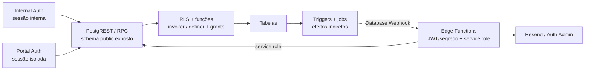

# Rastreabilidade Técnica

Verificado contra o repositório em 2026-09-16.

Este índice liga cada rota e ação relevante aos chamadores do frontend, aos
contratos executáveis do Supabase e ao documento do módulo proprietário. Ele é
um mapa de navegação; regras completas continuam nos módulos e ADRs. A definição
vigente é a última definição aplicável por assinatura e ordem de migration;
snapshots e planos datados servem apenas como histórico.
Nesta etapa foram inventariados 130 nomes literais de RPC, 60 tabelas acessadas
diretamente pelo frontend e 2 buckets de Storage usados pelos serviços, além
dos diretórios de `supabase/functions` (hoje 17 Edge Functions além de
`_shared`). O índice cobre a superfície navegável, não a
totalidade: o replay local atual expõe 219 funções SQL de aplicação a
`authenticated`/`anon`; 168 nomes chamados pela produção resolvem no catálogo
executado e as funções auxiliares restantes são acompanhadas por família abaixo,
sem fingir que um helper interno é uma rota. O par cliente/inspeção deriva do mapa literal
`src/services/portalRpcContracts.ts` (dispatcher em `src/services/portalScope.ts`,
teste de completude e índice), então os nomes `portal_inspect_*` têm fonte única
no código. Levantamento e lacunas detalhadas na
[auditoria consolidada das PRs #654–#660](archive/audits/2026-09-06-auditoria-consolidada-prs-654-660.md).

## Evidência

- **Código**: caminho confirmado por leitura do código executável.
- **Teste**: comportamento sustentado por uma asserção automatizada identificada.
- **Runtime**: comportamento observado em navegador/API/banco controlado.
- **Suspeita**: divergência plausível que ainda exige confirmação adicional.

## Cubagem, formato numérico e linha expansível de B/Ls — 2026-09-18

Remediação dos achados da auditoria de 2026-09-18
(`docs/archive/audits/2026-09-18-auditoria-unificacao-bls-eixos-1-4.md`).

**Cubagem com dono único (migration 064).** `bls.total_cbm` passou a medir
SOMENTE carga conteinerizada e `bls.bb_cbm` (coluna nova) SOMENTE carga solta —
a mesma cirurgia que a `061` fez no peso, aplicada à coluna que ficou de fora.
Antes, `breakbulkImport` gravava a cubagem do manifesto e `blFreightImport`
gravava a soma dos contêineres na MESMA coluna, uma sobrescrevendo a outra em
B/L misto, e a ficha exibia o resultado sob o título "Resumo da carga solta".
Quem precisa da cubagem do documento inteiro usa `blTotalCbm()`, nunca uma das
colunas. `operational_list_bl_summary` devolve `breakbulkCbm` (só carga solta) e
`totalCbm` (soma aditiva). A cubagem de carga solta também entrou no
`ON CONFLICT` do importador: era a única métrica BB que uma reimportação não
atualizava.

**Sinal de carga solta completo (migration 064).** `bb_machine_qty` e `bb_cbm`
passaram a contar como sinal de carga solta em `_recalculate_bl_cargo_mode` e
`trg_sync_bl_weight_cargo_mode`, e o trigger observa as duas colunas no
`UPDATE OF`. Um B/L declarado só com máquinas e cubagem sobrevivia ao INSERT mas
era reclassificado como `container` em silêncio no primeiro UPDATE de
`bb_weight_ton`/`bb_packages_qty`.

**Formato numérico dos imports BB.** O manifesto de carga solta não fixa mais
pt-BR, e também não adivinha. Três camadas, nesta ordem:

1. **Declaração do operador** — o modal de importação tem um seletor
   `Detectar pelo arquivo` / `Vírgula decimal (pt-BR)` / `Ponto decimal (en-US)`
   (`ParseBreakbulkOptions.numberFormat`). Trocar o formato relê os arquivos já
   escolhidos (`FileImportModal.reparseKey`). Formato declarado que o arquivo
   contradiz é **recusado**, não corrigido em silêncio.
2. **Evidência do arquivo** — `inferSeparatorFormat` (`src/lib/importNumber.ts`)
   decide pelo que o próprio arquivo mostra: célula com os dois separadores, ou
   com um separador seguido de um número de dígitos diferente de 3.
3. **Ambiguidade residual** — `isThousandsGroupShape` marca a célula que sobrou
   na forma `259.312` (separador de milhar seguido de exatamente três dígitos).
   Sem declaração do operador ela é **erro bloqueante**; com declaração, aviso
   de conferência, e a mensagem mostra as DUAS leituras possíveis.

`normalizeNumericText` é a normalização única: a mesma leitura vale para a
evidência, para a detecção de ambiguidade e para o parse. Antes, a ambiguidade
era testada no valor cru e o número parseado no valor sem a unidade, então
`"259.312 TON"` escapava das duas checagens e entrava como 259 312 toneladas, na
taxa local de base `weight_ton`. `NUMERIC_CEILINGS` acrescenta um teto de
absurdo por coluna, que não depende de heurística nenhuma. O layout do armador
usa a mesma resolução — lia peso sem formato e cubagem em `en-US` fixo.

`ParsedBreakbulkManifest.rowErrors` ganhou `severity`, e
`rowErrorsToImportIssues` a respeita: só divergência bloqueante impede a
importação.

**Linha expansível em `/bls`.** Cada linha expande contêineres (com tara e data
de descarga) e carga solta (resumo e itens) em `BlRowDetail`, sem query nova — a
RPC `operational_list_bls` já projeta `bl_containers` e `bl_breakbulk_items`
inteiros. O toggle é um botão próprio com `aria-expanded`/`aria-controls`, então
a seleção em massa não é afetada.

**Export e tabela com um filtro só.** `fetchAllBls` pagina a mesma RPC da
tabela. Reimplementava os filtros contra `bls` com busca textual mais estreita,
então buscar por nome de cliente exibia linhas e exportava zero. O teto de
`p_page_size` de `operational_list_bls` subiu de 100 para 1.000 na mesma
migration 064: com 100, exportar uma viagem de 5.000 B/Ls custava 50 idas ao
banco em série, cada uma projetando os filhos inteiros do B/L.

**Fila de reconciliação por modalidade.** `ReviewDrawer` edita
`total_weight_kg`/`total_cbm` para B/L de contêiner e `bb_weight_ton`/`bb_cbm`
para carga solta, pelos mesmos predicados do resto do sistema; um B/L misto
mostra os dois pares. Oferecia só o par de contêiner, então um B/L de carga
solta aparecia na fila com os dois campos vazios — e quem preenchesse criava uma
segunda cubagem, que `blTotalCbm()` somava à que já existia.

**KPIs de `/bls`.** Máquinas, Total de volumes, CBM carga solta e **CBM total**
(a soma aditiva que a 064 criou) são renderizados. Os quatro vinham da RPC,
tipados e mapeados, e eram descartados sem chegar à tela.

**Ficha do B/L.** `Carga` virou aba própria (`?tab=carga`), entre Visão Geral e
Detalhes; era uma seção no fim do formulário de edição. A modalidade aparece
como badge no topo, com rótulo único (`cargoModeLabel`).

## Atualização do detalhe do B/L — trilho Documental — 2026-09-14

`/bls/:blId` mantém o trilho Operacional e agora apresenta o antigo
Financeiro como **Documental**. `BlRailsPipeline` recebe quatro cards centrais
(`Cliente`, `Taxas Locais`, `CE Mercante`, `Fatura`), calcula o contador somente
com os bloqueios desses cards e aponta a próxima ação para o primeiro deles.
Demurrage permanece auxiliar e não altera a emissão da fatura comum.

`listInvoiceLinksByBls` lê `invoice_bls` e `invoice_receivable_links`, preserva
`invoice_type` e a origem do vínculo, e permite que a ficha identifique uma
fatura `Individual` ou `Consolidada`. O CE Mercante é obrigatório para
container e carga solta: `047_bl_documental_gates.sql` protege a prontidão do
B/L, os vínculos de emissão individual/consolidada e a transição da invoice
para `issued`. A disponibilidade do Portal continua sob
`bl_has_portal_release`, que já usa CE como gate universal.

**Evidência:** `BlRailsPipeline.test.tsx`, `blRails.test.ts`,
`billing.test.ts`, `reviewBillingAutomation.test.ts` e
`blDocumentalGatesMigration.test.ts`.

## Atualização da PR #670 — 2026-09-10

O recorte de `009`–`030` foi conferido no replay PostgreSQL local e agora tem
linha de rastreabilidade para as funções que não apareciam no índice anterior.
As funções com prefixo `_` são núcleos privados; os demais nomes são wrappers,
leitores ou workers. **Evidência:** 17 suítes de integração local, 64 testes,
`npm run rpc:check` com 168 nomes chamados e `npm run docs:check` com 428
Markdown/49 rotas. O smoke autenticado do Preview também confirmou importação
de datas, emissão/baixa de Demurrage com desconto e paridade Portal/Inspeção.
Isso não afirma deploy de produção, execução dos jobs, Vault preenchido, BCB ou
Resend reais.

| Família / funções introduzidas ou redefinidas nesta PR | Migração / evidência executável |
|---|---|
| `apply_baplie_physical_flags_atomic`, `apply_container_dates_atomic` | `015_import_dates_and_flags_atomic.sql`; `importAtomicity.local-pg.test.ts`, `baplieParserS03.test.ts` |
| `apply_customer_base_row_atomic`, `import_bl_freight_with_metadata` | `016_import_metadata_and_omission_conflicts.sql` + `048_customer_base_primary_contact.sql`; testes de importação/customer base e contrato da migration 048 |
| `claim_import_effects`, `complete_import_effect`, `enqueue_import_effect`, `list_import_effects`, `retry_import_effect`, `prevent_import_effect_attempt_mutation` | `017_import_effects_outbox.sql`, `025_import_effect_worker.sql`; `importEffects.local-pg.test.ts` |
| `create_customer_dunning_group_atomic`, `demurrage_dunning_candidate_sendable`, `release_demurrage_dunning_claim` | `010_contact_routing_and_dunning_eligibility.sql`, `011_dunning_group_membership.sql`; contratos de dunning |
| `apply_demurrage_discount`, `cancel_demurrage_invoice`, `confirm_demurrage_pix_matches`, `register_demurrage_payment`, `reopen_demurrage_invoice`, `_demurrage_mutation_request` | `012_demurrage_mutation_guards.sql`, `027_demurrage_money_fixes.sql`; `demurrageMoney.local-pg.test.ts` |
| `create_demurrage_invoice_authoritative`, `create_demurrage_invoice_with_items`, `capture_demurrage_calculation_snapshot`, `prevent_demurrage_calculation_snapshot_mutation`, `_calculate_demurrage_invoice_authoritative` | `018_exchange_rate_provenance.sql`, `023_demurrage_calculation_snapshot.sql`, `027_demurrage_money_fixes.sql`; `demurrageAuthority.local-pg.test.ts` |
| `capture_demurrage_calculation_snapshot` (correção da coluna histórica de PTAX) | `030_fix_demurrage_snapshot_ptax_column.sql`; `demurrageAuthorityMigration.test.ts`, smoke autenticado no Preview |
| `recalculate_demurrage_invoices`, `recalculate_demurrage_invoices_manual`, `save_exchange_rate_reference`, `save_exchange_rate_reference_v2`, `_demurrage_roe_from_ptax`, `_demurrage_spread_version` | `018_exchange_rate_provenance.sql`; `exchangeRateIntegrity.local-pg.test.ts` |
| `operational_list_bl_summary`, `operational_list_bls`, `operational_list_containers` | `020_operational_read_pages.sql`; `operationalLists.local-pg.test.ts` |
| `operational_list_voyage_summaries` | `035_operational_voyage_summaries.sql`; `voyageReadModels.test.ts`, `operationalLists.local-pg.test.ts` |
| `operational_list_voyage_summaries` (status nullable) | `037_operational_voyage_summary_null_status.sql`; `voyageReadModels.test.ts`, `operationalLists.local-pg.test.ts` |
| `operational_list_bl_summary` (métricas BB) | `036_operational_breakbulk_summary_metrics.sql`; `voyageReadModels.test.ts`, `operationalLists.local-pg.test.ts` |
| `operational_list_bl_summary` (tolerância a drift de `charge_status`) | `040_operational_breakbulk_drift_tolerance.sql`; `operationalBreakbulkDriftToleranceMigration.test.ts` |
| `portal_list_disputes`, `_portal_list_disputes_core` | `013_portal_disputes_inspection.sql`; `portalInspectionParity.local-pg.test.ts` |
| `portal_list_demurrage_invoices_page`, `portal_list_invoices_page`, `_portal_list_demurrage_invoices_page_core`, `_portal_list_invoices_page_core` | `021_portal_billing_pages.sql`; `portalInspectionParity.local-pg.test.ts` |
| `customer_billing_access_ready` | `019_local_billing_integrity.sql`; `localBillingIntegrity.local-pg.test.ts` |
| `current_portal_customer_id`, `save_voyage_escala_terminal_state_v2` | `009_rpc_entry_security.sql` + `049_terminalized_schedule_persistence.sql`; `auditSecurityBoundaries.local-pg.test.ts`, `terminalizedSchedulePersistenceMigration.test.ts` |
| `portal_list_provisioning_console` (candidatos ativos do cadastro canônico) | `050_portal_provisioning_active_contact_candidates.sql`; `portalProvisioningCandidatesMigration.test.ts` |
| `portal_email_event_attempts_append_only` | `022_email_inbox_and_dispatch_state.sql`; `emailInbox.local-pg.test.ts` |
| `refresh_customer_communication_status`, `mark_customer_communication_dispatch_blocked` | `032_customer_communication_partial_status.sql`, `038_customer_communication_status_recipient_latest.sql`, `039_customer_communication_status_identity.sql`; `customerCommunicationPartialStatusMigration.test.ts`, `customerCommunicationRecipientLatestMigration.test.ts`, `customerCommunicationStatusIdentityMigration.test.ts` |
| `claim_demurrage_dunning_candidates` (recuperação terminal de `parcial`) | `041_dunning_partial_claim_recovery.sql`; `demurrageDunningMigration.test.ts` |

## Atualização da PR #695 — revisão adversarial e bateria financeira — 2026-09-16

A revisão adversarial foi incorporada também nos caminhos não bloqueantes. O CE
Mercante dispara faturamento somente para o B/L que originou a transição; os
demais B/Ls do mesmo container/viagem seguem apenas o cálculo aplicável. A fila
preserva bloqueios operacionais como resultados recuperáveis. O Portal em modo
de inspeção compartilha um predicado de somente leitura, o ledger impede
alocações acima do recebível e o motivo de cancelamento é obrigatório em todas
as camadas. Mensagens de erro exibidas ao usuário passam por classificação sem
expor detalhes crus do banco.

| Família / funções introduzidas ou redefinidas | Migração / evidência executável |
|---|---|
| `auto_bill_bl_after_ce_mercante`, `trg_auto_bill_bl_after_ce_mercante`, `suppress_duplicate_ce_auto_billing_effect`, `_run_import_effect_local_charges`, `_compute_bl_review_pendencies`, `compute_bl_review_pendencies` | `051_ce_mercante_auto_billing.sql`; `ceMercanteAutoBillingMigration.test.ts`, `ceMercanteAutoBilling.local-pg.test.ts` |
| `guard_ledger_settlement_allocation`, `assert_ledger_invoice_payment_allocation`, `register_ledger_invoice_payment` | `052_financial_battery_guards.sql`; `ledgerSettlementGuardsMigration.test.ts`, `financialBattery.local-pg.test.ts` |
| `block521_upsert_alert`, `alert_actor_is_authorized` | `052_financial_battery_guards.sql`; Portal de disputa autenticado e grants do Portal |
| `apply_customer_base_row_atomic` (reativação e backfill de caixas) | `048_customer_base_primary_contact.sql`; `customerBasePrimaryMigration.test.ts` |
| `save_voyage_escala_terminal_state_v2` (renomeação idempotente) | `049_terminalized_schedule_persistence.sql`; `terminalizedSchedulePersistenceMigration.test.ts` |

### Atualização da entrega S12 — read-model de viagens e Line Up

`operational_list_voyage_summaries` (`035_operational_voyage_summaries.sql`)
separa o rail resumido da viagem do detalhe selecionado. A RPC pagina viagens
visíveis e agrega rotas, B/Ls por modalidade, cobertura de CE, containers e
Baplie sob `SECURITY INVOKER`; `useVoyages` consome apenas esse envelope e
`useVoyageDetail` carrega manifests, bookings e B/Ls somente para a viagem
aberta. `Baplie` reutiliza o rail e deixa a leitura completa limitada ao
staging da viagem selecionada.

`lineup.ts` passou a projetar `bl_containers` junto com os B/Ls, eliminando o
waterfall B/L → containers no refresh. `listVoyageRoutePorts` é o read-model
pequeno comum de POL/POD usado por EmbarqueVazios e pelo relatório de agência;
essas mudanças preservam os contratos fechados e os filtros por viagem. A
integração PostgreSQL local cobre os agregados e os testes de comportamento
cobrem a separação resumo/detalhe. **Residual explícito:** Preview autenticado
e roteiro manual de UX continuam provas operacionais pendentes; exportações
explícitas ainda materializam o conjunto solicitado sob demanda e não são
tratadas como leitura de rail.

### Atualização complementar S12/S13 — PR #683, benchmark e contraste

O caminho normal de `useBls`, `useContainers`, `useBlSummary` e `useVoyages`
agora chama diretamente os wrappers/RPCs paginados; os antigos full-scans ficam
restritos a exportações explícitas sob demanda. `CargaSolta` usa os campos
adicionais de `operational_list_bl_summary` (`036`) para máquinas, volumes, peso
e CBM, sem reconstruir métricas no cliente.

O detalhe do Baplie também passou a ficar atrás de `baplieReadModel.ts`: a página
usa `listBaplieStaging` com projeção explícita, paginação por viagem e
`hasBlsForVoyage` para a checagem de existência. O contrato é coberto por
`baplieReadModel.test.ts`; a exportação continua materializando apenas o conjunto
explicitamente solicitado pelo operador.

O harness `scripts/perf/measure-operational-read-model.mjs` executado em
PostgreSQL local vazio, com cinco rodadas, `ANALYZE` das tabelas sintéticas
dentro da transação e rollback por cenário, registrou:

| B/Ls | resumo p95 / bytes | baseline pesado p95 / bytes |
|---:|---:|---:|
| 100 | 3,846 ms / 3.023 B | 7,534 ms / 205.971 B |
| 1.000 | 4,827 ms / 3.085 B | 76,544 ms / 2.055.752 B |
| 10.000 | 16,225 ms / 3.147 B | 614,319 ms / 20.589.687 B |

O `EXPLAIN (ANALYZE, BUFFERS)` do cenário de 10.000 B/Ls mediu 15,462 ms
(`summary`) contra 560,075 ms (baseline). “Requests” no relatório significa
uma instrução SQL local por leitura, não uma contagem HTTP do PostgREST. O
artefato detalhado fica em `artifacts/perf/`, fora do versionamento; os dados
sintéticos não são persistidos.

`npm run a11y:contrast` passou nos temas light e dark para texto normal, texto
suave, links, status e cabeçalho de tabela (20 pares, todos >= 4,5:1). O gate
ajustou os tokens claros de `muted-soft` e `green`, e o token escuro de
`muted-soft`; a verificação manual de componentes, hover/disabled, teclado,
leitor de tela e foco no Preview continua pendente.

Os contratos financeiros passaram a persistir `demurrage_invoice_items.subtotal_brl`
com resíduo determinístico e o documento lê o valor persistido; valores históricos
sem snapshot não são inventados. `src/types/database.ts` foi regenerado pelo
gerador oficial contra o Preview depois do smoke autenticado, preservando os
aliases de domínio do frontend e uma camada separada de compatibilidade para
`null` explícito em inputs/RPCs. A coluna `subtotal_brl`, os campos de procedência
do ROE e a família de `exchange_rate_reference_history` foram conferidos no
schema remoto e no replay PostgreSQL local.

### Inventário S14 — legado e colunas nullable

No replay local de 2026-09-09, as 14 candidatas do plano (`portal_*_legacy`,
`close_legacy_agency_report_alerts_for_scale` e
`reconcile_bl_review_alerts_item`) resolveram para assinaturas existentes, todas
sem dependente em `pg_depend`, sem referência no corpo de outra função e sem job
local cujo comando as chame. As funções `*_legacy` também estão sem `EXECUTE`
para `anon` e `authenticated`. Isso é evidência de não-uso interno, não prova de
ausência de consumidor externo; por isso nenhuma foi removida nesta PR e os sete
elos de import que formam a cadeia `_legacy_205/284/322/357`, `_legacy_165`,
`_legacy_136` e `save_granite_bl_review_legacy_148` continuam preservados.

As colunas `alerts.notified_at`, `bls.consignee_address`,
`charge_calculations.reviewed_at` e `customer_portal_sessions.last_seen_at`
existem e são nullable; no banco descartável todas estavam nulas. Não houve
caller ativo em `src`/Edge Functions para as quatro; `charges_reviewed_at` e
outros campos homônimos usados pela projeção de Taxas Locais não são a coluna
legada `charge_calculations.reviewed_at`. Sem contagem do ambiente real,
telemetria externa e decisão documental, a remoção fica deliberadamente
pendente; qualquer contração futura deve usar migration nova e `DROP ... RESTRICT`.

Testes que apenas inspecionam texto ou regex de migrations são classificados
como **Teste de contrato SQL**. Eles detectam drift no SQL versionado, mas não
provam migration aplicada, grants remotos, RLS em execução ou atomicidade real.

## Atualização da remediação das auditorias #654–#660 — 2026-09-07

Esta revisão focal integra o baseline da PR #669 e acrescenta as migrations
`022`–`026`. A fronteira de email agora é: webhook autenticado recebe e
persiste a inbox; `portal-email-events-runner` faz claim, retry e transições
server-only. Efeitos de importação usam `import_pending_effects` com lease,
histórico de tentativas e `import-effects-runner`, que permanece fail-closed até
ativação explícita no ambiente correto. A emissão de Demurrage recebe IDs e
data opcional no RPC autoritativo, calcula no banco e registra snapshots
append-only; a falha persistente do recálculo PTAX abre o alerta
`demurrage_ptax_recalc_failed`.

**Código/Teste:** migrations `022_email_inbox_and_dispatch_state.sql`,
`023_demurrage_calculation_snapshot.sql`,
`024_demurrage_ptax_alert.sql`, `025_import_effect_worker.sql` e
`026_import_effect_alert.sql`, integrações locais opt-in e testes focados.
Esse bloco não afirma deploy remoto, grants efetivos no Postgres gerenciado,
Vault preenchido, cron executado, Resend/BCB real ou conclusão integral do plano;
os itens pendentes continuam classificados na matriz do plano.

## Atualização da PR 550

O fluxo terminalizado da PR 550 acrescenta `report_id` e `terminalCode` aos
deep-links do ADR, filtra o conteúdo exibido pelas frentes atribuídas, usa as
chaves reais de `useAgencyReport` (`agency-report-terminal-state` incluída) e
registra datas do POD na mesma RPC transacional da escala. O Cadastro de
Terminais consulta `preflight_depots_terminal_port_mapping`; novos terminais
exigem `depots.port_id`, enquanto o legado sem mapeamento permanece preservado.
As evidências desta revisão são os testes de comportamento, o contrato SQL da
migration 306 e a aplicação da migration em Postgres local descartável.

No ADR terminalizado, as escritas por `report_id` usam as RPCs
`set_agency_report_signoff_by_report_id`,
`set_agency_report_department_signoff_by_report_id`,
`set_agency_report_section_observation_by_report_id`,
`close_agency_departure_report_by_report_id` e
`reopen_agency_departure_report_by_report_id`. O snapshot fechado também
congela `header.terminalScope`, distinguindo uma seção sem frente atribuída ao
terminal de uma seção atribuída que recebeu a resolução “Nada a declarar”.

### Fundação de Comunicados ao Cliente — Bloco 1

A migration `372_comunicados_fundacao.sql` criou a fundação sem histórico
retroativo: `customer_communications`, vínculos com B/L, tentativas, catálogo
explícito de `kind`/`nature`, quatro preferências por contato, supressões do
canal e o singleton `app_settings`. As âncoras do comunicado são valores
congelados, sem FK para escala, atracação ou invoice. A chave global nasce
desligada e a RPC `set_communications_enabled(boolean)` exige Administrativo e
registra alterações em `audit_logs`.

`CadastroContatosTab` expõe as quatro naturezas sem alterar
`customer_contacts.purpose`; a gravação usa `source='interno'` e o guard
de permissão `customer_communications` exclui Operações, Financeiro e os
demais papéis não autorizados na tela. O mapeamento e as preferências são
cobertos por testes de
comportamento e de contrato SQL; a aplicação da migration foi reproduzida em
PostgreSQL local descartável. Não há runtime remoto nem envio real afirmado
nesta etapa.

O webhook do Resend procura a tentativa no Portal e, como fallback, em
`customer_communication_attempts`, vinculando cada evento a apenas uma delas.
Complaint de Comunicado grava somente `customer_communication_suppressions`;
`bounce_permanente` usa a supressão compartilhada, escala uma linha de
`complaint` sem rebaixamento posterior e resolve a notificação ao contato
alternativo ou o alerta `cliente_contato_bounced_sem_alternativa`. **Código**;
**Teste:** `portalEmailWebhook.test.ts`, `portalBounceCascade.test.ts` e
`portalEdgeFunctionsOrder.test.ts`.

### Bloco 2 — Disparo manual e alertas de Comunicados

`/clientes/comunicacao` é a superfície protegida pela permissão
`customer_communications`: o modo carga exige filtro operacional e agrupa B/Ls
por cliente; o modo institucional usa Cliente Comunicável, com ETA a partir de
doze meses atrás e sem teto futuro. A aba Disparo é um formulário de três passos
(o que enviar, para quem, mensagem) em que o modo deriva do modelo
(`getCustomerCommunicationDispatchMode`), a lista de modelos vem filtrada pelo
modo (`MANUAL_CUSTOMER_COMMUNICATION_KINDS_BY_MODE`), o público segue
`getCustomerCommunicationAudienceRule` e o editor de assunto/mensagem aparece nos
modelos escritos pelo operador (`isUserWrittenCustomerCommunicationKind`) —
inclusive no livre, que continua no modo carga. A conferência mostra elegíveis,
exclusões, bloqueios, preview e confirmação explícita de reenvio para os modelos
ancorados em carga (`requiresResendConfirmation`); institucional e livre trocam a
trava por informação, porque cada lote tem `dispatch_id` próprio. **Código**;
**Teste:** `customerCommunications.test.ts`, `ClientesComunicacao.test.tsx` e
`customerCommunicationTemplates.test.ts`.

A produtora `evaluate_and_dispatch_automatic_communications` (cron de 15 em 15
minutos via `customer-communication-auto-runner`) resolve destinatários por
`customer_contact_box_links`, não mais pelo modelo legado de
`customer_contact_preferences`, e produz NOA, NOR, **NOB** e `ce_mercante_taxas`.
O NOB é por Atracação (`voyage_escala_terminal_state.id` como
`anchor_atracacao_id`) e restrito à carga cuja Frente de Operação está atribuída
àquele terminal em `voyage_escala_operation_fronts`. A migration `045` corrige o
roteamento — a `008` havia aplicado a correção de caixas em
`find_due_customer_communication_automations`, que não tem chamador. **Código**;
**Teste:** `comunicadosCaixasNobAutomaticoMigration.test.ts`,
`escalaOperationFrontKind.test.ts`, `customerCommunicationAutoRunner.test.ts`;
**Teste de contrato SQL:** `scripts/check-comunicados-caixas-nob.sql`, executado
no CI contra o Postgres real após o replay das migrations.

`customerCommunicationDispatches.ts` chama `send-customer-communication`, que
confere contato, preferência, complaint/bounce e natureza, registra a operação
por RPC atômica e mantém o dry-run quando
`app_settings.communications_enabled=false`. A migration
`373_comunicados_anexos.sql` cria templates e bucket privado; a migration
`375_comunicados_bloco2_correcoes.sql` fecha a escrita direta do Storage e cria
modelos institucionais reutilizáveis; anexos são
limitados a três arquivos e 10 MB e não são aceitos em cobrança local ou
demurrage. Em erro HTTP da Edge Function, o service lê o corpo JSON retornado
(`error`/`message`) antes de repassar a falha à tela, preservando a causa para
diagnóstico (BUG-10). **Código**; **Teste de contrato SQL:**
`comunicadosAnexosMigration.test.ts` e
`sendCustomerCommunicationFunction.test.ts`.

O status parcial usa `recipient_key` como SHA-256 do e-mail normalizado, sem
agrupar destinatários pela máscara visual; tentativas anteriores à coluna são
marcadas como `legado` até uma nova execução confirmar o modo real ou simulado.
Um bloqueio de prontidão depois da criação passa por
`mark_customer_communication_dispatch_blocked`, que grava `falha` ou `parcial`
e preserva o resultado por destinatário. No dunning, a migration
`041_dunning_partial_claim_recovery.sql` trata `parcial` como terminal para o
scanner de claims órfãos e a Edge reutiliza a chave histórica da tentativa.
**Código**; **Teste de contrato SQL:**
`customerCommunicationStatusIdentityMigration.test.ts` e integração local de
`customerCommunicationPartial.local-pg.test.ts`.

O Histórico de Comunicados aparece na própria rota, na Ficha do Cliente e no
Histórico do B/L vinculado. A migration `374_comunicados_alertas.sql` cataloga
NOA/NOR/NOB pendentes e bounce sem alternativa no runner server-only; somente
`status='enviado'` resolve os avisos operacionais. **Código**;
**Teste de contrato SQL:** `comunicadosAlertasMigration.test.ts`.

## Índice por rota e ação

### Entrega PR 579 — Escala e Atracação por terminal (2026-08-24)

Esta entrega separa os donos das datas sem criar uma tabela `port_calls`:

- `/viagens` e `/viagens/:voyageId`: `VoyageScheduleModals.tsx`,
  `VoyageVisaoTab.tsx`, `VoyageCreateModal.tsx`, `Viagens.tsx`,
  `voyageRouteSchedules.ts`, `escalaTerminalAllocation.ts`, `voyageForm.ts` e
  `voyageFromSchedule.ts` projetam e gravam ETA/ATA na Escala e ETB/ATB/ETD/
  ATD/Restow nas Atracações, inclusive a linha TBC.
  `listVoyageTerminalScaleStatesByVoyageIds` resolve `terminal_id` em
  `depots.code`: o código é o rótulo da Atracação no planejamento e o critério
  de desempate da ordem derivada.
- `/painel` e `/line-up-tv/display`: `lineup.ts` e `escalaState.ts` consomem a
  mesma ordenação `COALESCE(ATB, ETB)` por terminal e derivam as datas do
  primeiro terminal de cada sentido. O ATD da linha é o das Atracações daquele
  sentido — só existe quando todas desatracaram — e recai no ATD derivado da
  Escala quando o sentido não tem terminal atribuído.
- `/viagens/:voyageId?tab=adr&escala=...`: `agencyDepartureReport.ts`,
  `VoyageAgencyReportTab.tsx`, `AgencyReportDocument.tsx` e
  `AgencyReportTimeline.tsx` usam ATB/ATD/Restow da Atracação escolhida, com
  ATA da Escala; os alertas passam a usar esse ATD como T0.
- Banco: `341_atracacao_datas_por_terminal.sql` adiciona as colunas,
  unicidade TBC e a RPC v2; `342_atracacao_alertas.sql` atualiza status,
  alertas de datas, alertas do ADR e encerra produtores legados. Evidência:
  `atracacaoMigration.test.ts`, testes focados de projeção/modal/formulário e
  typecheck; runtime Supabase não foi executado nesta sessão.

Este índice é o ponto de entrada curto. A explicação completa, as invariantes e
as divergências permanecem no documento vivo do módulo indicado.

| Rota / superfície | Ação | Origem | Hook / serviço | RPC / tabela / integração | Efeito e cache | Evidência | Módulo |
|---|---|---|---|---|---|---|---|
| `/login` | Autenticar usuário interno | `src/pages/Login.tsx` | `useAuth` / cliente `supabase` | Supabase Auth + `user_profiles` | Estabelece sessão interna e redireciona para `/painel` | **Código**; runtime bloqueado sem configuração | [Operação e suporte](modules/operacao-suporte.md#anatomia-das-telas) |
| `/portal/login` | Entrar por CNPJ e senha | `src/pages/PortalLogin.tsx` | `usePortalAuth` / Edge Function `portal-login` | `portal_resolve_login` no servidor + Supabase Auth isolado | Hidrata overview e libera `PortalProtectedRoute` | **Código**, **Teste**, **Teste de contrato SQL** | [Portal do Cliente](modules/portal-cliente.md#catálogo-de-ações) |
| `/portal/confirmar-email` | Confirmar o novo Email de Recuperação por token | `src/pages/PortalConfirmarEmail.tsx`, `PortalProtectedRoute` (redireciona o link antigo) | Edge Function `portal-recovery-email-change` (`action: 'confirm'`) | Convite de confirmação de email por token de uso único | Troca o Email de Recuperação e encerra as sessões; rota pública | **Código**, **Teste** | [Portal do Cliente](modules/portal-cliente.md#catálogo-de-ações) |
| `/portal/esqueci-senha` | Solicitar recuperação sem enumerar conta | `src/pages/PortalForgotPassword.tsx` | Edge Function `portal-password-recovery` | Convite de recuperação por token de uso único | Envia recuperação quando elegível; resposta permanece genérica e a confirmação afirma o envio sem condicionar a existência de conta | **Código**, **Teste** | [Portal do Cliente](modules/portal-cliente.md#catálogo-de-ações) |
| `/portal/recuperar-senha` | Consumir token e trocar senha | `src/pages/PortalResetPassword.tsx` | Edge Function `portal-password-reset` | Token de uso único validado no servidor; senha trocada via Auth Admin | Atualiza credencial e volta ao login sem sessão automática | **Código**, **Teste** | [Portal do Cliente](modules/portal-cliente.md#catálogo-de-ações) |
| `/portal/ativar` | Inspecionar e ativar convite | `src/pages/PortalAtivacao.tsx` | Edge Function `portal-invite-activate` | `portal_invites` por hash de token; Supabase Auth criado na ativação | Consome token atomicamente e retorna ao login sem sessão automática | **Código**; runtime não executado | [Portal do Cliente](modules/portal-cliente.md#catálogo-de-ações) |
| `/clientes/portal` | Fila e revisão individual do provisionamento | `src/pages/ClientesPortal.tsx`, `PortalReviewPanel` | `usePortalProvisioning`, `portalProvisioning.ts` | `customer_portal_accounts`, convites, contatos e alertas | Filtro inicial aguardando análise; ações individuais; deep-link por cliente | **Código**, **Teste** | [Portal do Cliente](modules/portal-cliente.md#catálogo-de-ações) |
| `/clientes/comunicacao` | Conferir, simular/enviar e consultar histórico de Comunicados | `src/pages/ClientesComunicacao.tsx` | `useCustomerCommunications`, `customerCommunications.ts`, `customerCommunicationDispatches.ts` | `customer_communications`, `customer_communication_bls`, `customer_communication_attempts`; Edge `send-customer-communication`; migrations `373`/`374`/`032`/`033` | Cache de conferência/histórico invalidado após dispatch; banner permanente quando a chave global está desligada; histórico chega à Ficha e aos B/Ls vinculados; CE Mercante revalida prontidão na criação, claim e dispatch | **Código**, **Teste**, **Teste de contrato SQL** | [Clientes](modules/clientes.md#anatomia-das-telas) |
| `/clientes/portal/inspecao/:customerId/*` | Inspecionar o Portal de um Cliente em modo somente leitura | `PortalReviewPanel`, `PortalLayout`, páginas do Portal | `PortalScope`, `callPortalRpc`, hooks de billing/operação/perfil/notificações | `portal_open_inspection`; núcleos `_portal_*_core`; invólucros `portal_inspect_*`; `portal_inspection_events` | Base path e caches incluem o Cliente; escritas bloqueadas; saída retorna à origem | Usuário interno inativo, Cliente inválido, RPC negada ou falha de overview | **Código:** ADR 0045; **Teste de contrato SQL:** paridade/grants; **Teste:** bloqueio e contenção |
| `/clientes/portal/inspecao/:customerId/billing` | Consultar faturas e disputas em Modo Inspeção | `PortalBilling` | `usePortalBilling` / `usePortalDisputes` / `PortalScope` | `portal_inspect_list_invoices_page`, `portal_inspect_list_demurrage_invoices_page`, `portal_inspect_list_disputes`, `portal_inspect_*` | Cache inclui `customerId`; mutações desabilitadas; listas de billing são paginadas no servidor | **Código**, **Teste local de contrato SQL** | [Portal do Cliente](modules/portal-cliente.md#catálogo-de-ações) |
| `/clientes/portal/inspecao/:customerId/operacao` | Consultar BLs e containers em Modo Inspeção | `PortalOperacao` | `usePortalOperation` / `PortalScope` | `portal_inspect_list_operation_bls` | Leitura compartilhada; nenhuma escrita | **Código**, **Teste de contrato SQL** | [Portal do Cliente](modules/portal-cliente.md#catálogo-de-ações) |
| `/clientes/portal/inspecao/:customerId/perfil` | Consultar perfil em Modo Inspeção | `PortalProfile` | `usePortalProfile` / `PortalScope` | `portal_inspect_get_profile` | Campos e ações permanecem visíveis; gravações bloqueadas | **Código**, **Teste de contrato SQL** | [Portal do Cliente](modules/portal-cliente.md#catálogo-de-ações) |
| `billing` | Subrota de faturas da Inspeção | `PortalBilling` | `PortalScope` | `portal_inspect_*` | Mantém o cliente na inspeção | **Código** | [Portal do Cliente](modules/portal-cliente.md#catálogo-de-ações) |
| `operacao` | Subrota operacional da Inspeção | `PortalOperacao` | `PortalScope` | `portal_inspect_list_operation_bls` | Somente leitura | **Código** | [Portal do Cliente](modules/portal-cliente.md#catálogo-de-ações) |
| `perfil` | Subrota de perfil da Inspeção | `PortalProfile` | `PortalScope` | `portal_inspect_get_profile` | Escritas bloqueadas | **Código** | [Portal do Cliente](modules/portal-cliente.md#catálogo-de-ações) |
| `/portal` | Carregar KPIs e programação de navios | `src/pages/PortalDashboard.tsx` | `usePortalAuth`, `usePortalScheduleVoyages` | `portal_get_session_overview_v2`, RPC `portal_ship_schedule` | Cache do Portal removido em logout/`SIGNED_OUT`; programação projetada de viagens visíveis distingue `OMIT` de `X` e recebe invalidação por omissão/reversão | **Código**, **Teste**, **Teste de contrato SQL** | [Portal do Cliente](modules/portal-cliente.md#catálogo-de-ações) |
| `/portal/billing` | Listar e abrir cobranças locais e demurrage | `src/pages/PortalBilling.tsx` | `usePortalBilling` / `portalBilling.ts` | RPCs `portal_list_invoices_page`, `portal_list_demurrage_invoices_page`, `portal_get_*` | Filtros e contagem são resolvidos no servidor; cada aba transfere uma página de até 25 linhas | **Código**, **Teste**, **Teste local de contrato SQL** | [Portal do Cliente](modules/portal-cliente.md#catálogo-de-ações) |
| `/portal/billing` | Criar ou tornar obsoleta consolidação | `src/components/portal/PortalConsolidatedModal.tsx` | `usePortalBilling` | `portal_create_consolidation`, `portal_obsolete_consolidation` | Invalida listas, overview e recebíveis consolidáveis | **Código**, **Teste de contrato SQL** | [Portal do Cliente](modules/portal-cliente.md#catálogo-de-ações) |
| `/portal/operacao` | Consultar B/Ls, containers e Informações de Transbordo | `src/pages/PortalOperacao.tsx` | `usePortalOperation` / `portalOperation.ts` | `portal_list_operation_bls`; projeção de `bl_transshipments` + `voyage_omissions` | Expansão do B/L mostra o card global vigente; COD é distinto e não publica justificativa, navio ou datas internas | **Código**, **Teste**, **Teste de contrato SQL** | [Portal do Cliente](modules/portal-cliente.md#catálogo-de-ações) |
| `/portal/perfil` | Atualizar perfil e contatos permitidos | `src/pages/PortalProfile.tsx` | `usePortalAuth` | `portal_update_profile` | Atualiza somente campos autorizados e recarrega overview | **Código**; runtime não executado | [Portal do Cliente](modules/portal-cliente.md#catálogo-de-ações) |
| `/line-up-tv/display` | Exibir e atualizar o Line-Up protegido | `src/pages/LineUpTVDisplay.tsx` | `fetchLineUpSnapshot`, `listVoyageEscalaSchedulesByVoyageIds`, `arrivalDisplay`, `deriveEscalaState` | projeção unificada de escalas + tabelas operacionais agregadas pelo serviço | Cache `['lineup-tv-display-v2']`; ATA precede ETA; escala atracada fica verde; viagens só de exportação entram pelo porto da escala unificada; borda do ciclo acompanha a primeira linha no desktop/mobile | **Código**, **Teste**; runtime visual não executado | [Operação e suporte](modules/operacao-suporte.md#catálogo-de-ações) |
| `/painel` | Carregar e filtrar snapshot do Line-Up | `src/pages/Painel.tsx` / `lineupFilters.ts` | queries da página / `filterLineUpRows` / `lineup.ts` / `listVoyageEscalaSchedulesByVoyageIds` / `arrivalDisplay` / `deriveEscalaState` | projeção unificada de escalas, `bls`, `containers`, `voyages`, `count_distinct_containers` | Inclui status retidos; ATA precede ETA; ATB sem ATD destaca a escala; importação e exportação do mesmo porto permanecem em uma escala; filtros locais e XLSX usam o snapshot limitado a 60 viagens | **Código**, **Teste** | [Operação e suporte](modules/operacao-suporte.md#catálogo-de-ações) |
| `/viagens` | Buscar, filtrar, ordenar, criar e selecionar viagem | `src/pages/Viagens.tsx` | `useVoyages`/`useVoyageDetail`, `operationalLists.ts`, `useViagemSchedulesAndStats`, `listVoyageEscalaSchedulesByVoyageIds`, `voyages.ts`, `voyageForm.ts`, `cacheEffects.ts` | `operational_list_voyage_summaries` (`035`) para o rail; detalhe selecionado lê `voyages` e módulos vinculados | `useVoyages` traz somente o envelope resumido paginado, com rotas/contagens/CE/Baplie; `useVoyageDetail` carrega manifests, bookings e B/Ls somente para a viagem aberta; a barra de comando mantém a busca visível e exibe filtros aplicados como chips removíveis; o rail expõe `Canceladas`, estado de conciliação com ponto e rótulo e rodapé `B/L · CNTR · CE`; Próxima Escala e contagem de escalas usam a projeção unificada `(viagem, porto brasileiro)`; invalida via `cacheEffects` (`afterViagemAlterada`/`afterEscalaAlterada`/`afterRotaAlterada`); seleção sincroniza URL | **Código**, **Teste**, **Teste local de contrato SQL** | [Viagens](modules/viagens.md#catálogo-de-ações) |
| `/viagens/:voyageId` | Editar agendas, Nº de Manifesto Mercante, consultar exportação por terminal, listar rotas de B/L e abrir módulos vinculados | `src/pages/Viagens.tsx` | `voyageRouteSchedules.ts`, `voyageExportSchedules.ts`, `voyageSummaries.ts`, serviços de schedule/timeline/reconciliation | audit logs de `voyage_pod_schedule`/`voyage_pol_schedule` + `voyage_export_schedules` por `(voyage_id, pol)`; leitura de `granite_manifests`, `vazios_manifests`, `vazios_bookings`, `vazios_export_operations` e `depots` | Atualiza cards, timeline e reconciliação da viagem; planejamento exibe uma linha por escala brasileira, com colunas `Escala`, `Opera`, `Chegada` (`ETA · previsto` e `ATA · real`), `ATD`, `BLs e CEs`, `Nº Escala`, `Vinculada` e `Ações`; atracações aparecem, quando existentes, em painel recolhível com cabeçalho e tabela próprios (`Terminal`, `ETB`, `ATB`, `ETD`, `ATD`, `Restow`), e suas ações `Adicionar atracação`/lápis reutilizam o `EscalaModal` já posicionado na seção ou terminal; a aba Importação organiza Containers/Carga solta e as faixas de Veículos/Vazios IMP por POD, mantendo estados vazios explícitos; a Exportação organiza Granito e Vazios EXP por `embark_port`, repartindo Vazios EXP por depot; a barra de exportação separa Manifesto Granito, CE Mercante (Granito) e Novo embarque de vazios, que abre `/embarquevazios?voyage=<id>` com a viagem travada; a barra de importação usa separadores e ações distintas para B/L container e B/L carga solta, com CE Mercante único para ambos; um único botão "Adicionar escala" e um único modal (`EscalaModal`) cobrem importação e exportação da mesma escala, incluindo os portos de descarga do embarque; o cabeçalho mostra uma linha de rota por perna (importação e exportação), com `Origem/Destino a definir` quando o lado é desconhecido | **Código**, **Teste** | [Viagens](modules/viagens.md#catálogo-de-ações) |
| `/viagens/:voyageId` | Editar agendas, Nº de Manifesto Mercante, consultar exportação por terminal, listar Rotas e Manifestos e abrir módulos vinculados | `src/pages/Viagens.tsx` | `voyageRouteSchedules.ts`, `voyageExportSchedules.ts`, `voyageSummaries.ts`, serviços de schedule/timeline/reconciliation | audit logs de `voyage_pod_schedule`/`voyage_pol_schedule` + `voyage_export_schedules` por `(voyage_id, pol)`; leitura de `granite_manifests`, `vazios_manifests`, `vazios_bookings`, `vazios_export_operations` e `depots` | Atualiza cards, timeline e reconciliação da viagem; o cabeçalho mantém o rail e o card de detalhe, os KPIs usam um número dominante em `Syne` com até três apoios e as cinco abas usam `.app-tab`; Rotas e Manifestos exibe uma linha por rota POL/POD, faixa de totais, grupo `Mercante` com `CE Mercante · cobertura` e `Nº de manifesto Mercante`, chip `Informar` para número ausente e edição por linha; planejamento exibe uma linha por escala brasileira, com colunas `Escala`, `Opera`, `Chegada` (`ETA · previsto` e `ATA · real`), `ATD`, `BLs e CEs`, `Nº Escala`, `Vinculada` e `Ações`; atracações aparecem, quando existentes, em painel recolhível com cabeçalho e tabela próprios (`Terminal`, `ETB`, `ATB`, `ETD`, `ATD`, `Restow`), e suas ações `Adicionar atracação`/lápis reutilizam o `EscalaModal` já posicionado na seção ou terminal; a aba Importação organiza Containers/Carga solta e as faixas de Veículos/Vazios IMP por POD, mantendo estados vazios explícitos; a Exportação organiza Granito e Vazios EXP por `embark_port`, repartindo Vazios EXP por depot; a barra de exportação separa Manifesto Granito, CE Mercante (Granito) e Novo embarque de vazios, que abre `/embarquevazios?voyage=<id>` com a viagem travada; a barra de importação usa separadores e ações distintas para B/L container e B/L carga solta, com CE Mercante único para ambos; um único botão "Adicionar escala" e um único modal (`EscalaModal`) cobrem importação e exportação da mesma escala, incluindo os portos de descarga do embarque; o cabeçalho mostra uma linha de rota por perna (importação e exportação), com `Origem/Destino a definir` quando o lado é desconhecido | **Código**, **Teste** | [Viagens](modules/viagens.md#catálogo-de-ações) |
| `/viagens/:voyageId` | Omitir escala e complementar transbordo global; listar B/Ls afetados | `OmitEscalaModal`, `TransshipmentInfoCard`, `VoyageVisaoTab` | `useTransshipments`, `transshipments.ts`, `voyageRouteSchedules.ts`, `voyageTimeline.ts`, `voyageSummaries.ts` | RPCs `omit_voyage_escala`, `update_voyage_omission`, `revert_voyage_omission`; `voyage_omissions`, `bl_transshipments`; migrations `308`–`316` | Registro global é herdado pelos B/Ls; a disposição individual é somente leitura com link para a ficha do B/L; omissão/reversão invalidam programação, Line-Up e Portal | **Código**, **Teste**, **Teste de contrato SQL** | [Viagens](modules/viagens.md#catálogo-de-ações) |
| `/viagens/:voyageId?tab=adr&escala=:port` | Consultar o Agency Departure Report derivado (6 seções — Escala abre a aba fora das fases, depois Importação → Exportação; Embarque de vazios reúne as subseções Containers embarcados e Operação de pátio numa resolução só, ADR 0036), registrar terminal, Observação opcional por seção (edição livre, só pelo dono; exibida só quando há texto, senão o dono vê "Adicionar observação") e sign-off departamental (com confirmação/justificativa e histórico auditável); fechar (3/3 departamentos), imprimir ou reabrir sem resetar seções/assinaturas (ADR 0030). Cada escala brasileira da projeção unificada gera um ADR, com ou sem importação. Carga descarregada conta somente cheios pelos B/Ls (documental, ADR 0025) — incluindo carga em transbordo (`bl_transshipments`/`voyage_omissions`), contada no ADR do porto de descarga real e separada do destino final. Vazios descarregados ficam em seção própria: o Baplie informa a presença física e o módulo de Vazios de Importação fornece a classificação; a divergência entre as fontes permanece visível. A matriz de carga distingue `carga_geral`, `IMO` e `OOG`, com `OOG` vencendo `IMO` quando ambos estão declarados e o merge por container preservando os dois flags, com avisos de divergência (`dischargeDivergence`, `vaziosDivergence`) e de dado órfão (granito/vazios embarcados fora das escalas da viagem, `orphanData`); escala omitida com ADR já fechado antes da omissão continua acessível/imprimível (chip "Omitida"); aba e impresso exibem Listagem do operado (sem matriz de zeros); impresso (`AgencyReportDocument`) usa a linguagem visual da fatura de taxas locais (kit `InvoiceDocumentKit` + tokens de `invoiceFormat.ts`: Arial sobre branco, cabeçalho de tabela navy, zebra, barra de total âmbar) e traz resolução (estado + assinante + data) por seção e bloco final de Assinaturas departamentais (`departmentSignoffs`), com nomes resolvidos ao vivo mesmo fechado (ADR 0035); Linha do Tempo do ADR (ADR 0039): marcos de ATD da escala unificada (POD canônico, POL preenche o que falta — `getVoyageUnifiedAtd`) com o momento do seu registro, Prazo de Conclusão (3 dias úteis, seg-sex, feriados contam, dia do ATD não conta — `agencyReportDeadline.ts`), as 3 assinaturas departamentais com reaberturas e justificativa (lidas de `audit_logs`), e o Fechamento sem prazo/veredito próprio; "sem prazo" (ATD ausente ou escala omitida) exibido sem cor; no fechamento, os marcos (ATD unificado, seu registro, prazo, reaberturas por departamento) são congelados dentro de `closed_snapshot.header`/`closed_snapshot.departmentSignoffs[].reopenings` (chaves de topo do snapshot inalteradas); o impresso mostra só as datas de assinatura e as reaberturas com justificativa — nunca o veredito de prazo, cor ou contagem de dias | `VoyageAgencyReportTab`, `SignoffControl`, `DepartmentSignoffControl`, `AgencyReportDocument`, `AgencyReportTimeline` | `useAgencyReport` / `agencyDepartureReport.ts` (as escritas do ADR terminalizado passam por `callReportIdAwareRpc`, que chama `supabase.rpc` **pelo objeto**: guardar a função numa variável desliga o receptor e o supabase-js lança `TypeError` lendo `this.rest` antes de a requisição sair) / `agencyReportDeadline.ts` (função pura de prazo, compartilhada com o alerta de vencimento e o agregado de SLA; aceita ATD em ISO com hora porque no ADR por terminal o T0 é o `terminal_atd` da Atracação, `TIMESTAMPTZ`, e não mais a string `YYYY-MM-DD` da trilha da Escala) | `agency_departure_reports`, sign-offs de seção (coluna `observation`, nullable; seções `ocorrencias` e `operacao_patio` removidas do CHECK — Operações com 1 seção, `datas`; Documentação com 3, `carga_descarregada`, `vazios_descarregados` e `veiculos`; Equipamentos com 2, `carga_carregada` (Granito) e `vazios_embarcados`), sign-offs departamentais (`agency_departure_report_department_signoffs`); `agency_departure_report_occurrences`/`add_agency_report_occurrence` seguem existindo mas sem uso pela aba desde a ADR 0030 (dado histórico, fora da aba); histórico em `audit_logs` (`entity_type='agency_departure_report_signoff'` e `'agency_departure_report_department_signoff'`); RPCs `set_agency_report_signoff`, `set_agency_report_department_signoff`, `set_agency_report_section_observation`, `set_agency_report_terminal`, `close_agency_departure_report`, `reopen_agency_departure_report`, `get_agency_report_closer_name`, `get_agency_report_actor_names`; migrations `213`/`214`/`217`/`218`/`220`/`221`/`222`/`223`/`224`/`225`/`226`/`227`/`228`/`249`/`251`/`253`/`258`/`261` | Queries `['agency-report', voyageId, port]`, `['agency-report-own', voyageId, port]`, `['agency-report-signoff-events', voyageId, port]` e `['agency-report-department-signoff-events', voyageId, port]`; fechado lê `closed_snapshot`; sign-off invalida também `['agency-report-signoff-events']`; fechamento/reabertura invalidam `['agency-report']`, `['agency-report-signoff-events']`, `['agency-report-department-signoff-events']`, `['alerts']`, `['op-count']`, `['header-alert']`, `['dashboard']` | **Código**, **Teste**, **Teste de contrato SQL:** `agencyReportMigration.test.ts`, `agencyReportPendingAlertsMigration.test.ts`, `agencyReportCloserNameMigration.test.ts`, `agencyReportReopenRbacMigration.test.ts`, `agencyReportSignoffHistoryMigration.test.ts`, `agencyReportOperacaoPatioSectionMigration.test.ts`, `agencyReportDepartmentSignoffMigration.test.ts`, `agencyReportCloseByDepartmentMigration.test.ts`, `agencyReportDepartmentAlertsMigration.test.ts`, `agencyReportOccurrenceAnyDepartmentMigration.test.ts`, `agencyReportReopenPreserveStateMigration.test.ts`, `agencyReportSectionObservationMigration.test.ts`, `agencyReportSnapshotValidationMigration.test.ts`, `agencyReportEmbarqueVaziosSecaoUnicaMigration.test.ts`, `agencyReportGraniteOwnershipMigration.test.ts`, `escalaUnificadaMigration.test.ts`, `agencyReportDeadlineMissedMigration.test.ts` | [Viagens](modules/viagens.md#catálogo-de-ações) |
| `/bls/:blId` | Operar disposição Transbordo/COD | `BlTransshipmentCard` | `useSetBlDisposition`, `transshipments.ts` | RPCs `set_bl_transshipment`, `set_bl_cod`; `bl_transshipments`, `bls`, `audit_logs` | Invalida cockpit, detalhe, B/Ls e viagens; ação única de escrita na ficha | **Código**, **Teste**, **Teste de contrato SQL** | [Manifestos e EDI](modules/manifesto-edi.md#catálogo-de-ações) |
| `/bls/:blId` | Consultar cockpit, Portal e divergências Baplie | `BlVisaoGeralTab`, `BlRailsPipeline`, `BlPortalCard` | `useBlCockpit`, `blRails.ts`, `blPortalStatus.ts`, `useVoyageReconciliation` | `get_bl_portal_status` (migration 206/047); `customer_portal_access_ready`; `voyage_*_schedules`, `portal_notifications.bl_id`, `demurrage_invoices`, `baplie_containers` | Leitura escopada ao B/L; RPC do Portal valida usuário ativo, devolve `portal_access_ready` pelo predicado canônico e contorna o RLS com superfície mínima | **Código**, **Teste**, **Teste de contrato SQL** | [Manifestos e EDI](modules/manifesto-edi.md#catálogo-de-ações) |
| `/bls` | Listar/exportar B/Ls (CNTR, carga solta e misto), importar CE Mercante e importar B/L | `src/pages/Bls.tsx`, `src/components/shared/CeMercanteImportModal.tsx`, `src/components/shared/BlImportModal.tsx` | `useBls`, `ceMercanteImport.ts`, `blParser.ts`, `blFreightImport.ts` | Leitura de B/Ls; `apply_ce_mercante_update`/`apply_ce_mercante_manifest`; `import_bl_freight_transactional` | O arquivo de B/L é a fonte documental vigente da carga; manifestos mercante editáveis por rota e B/Ls de carga solta e mista unificados | **Código**, **Teste:** `Bls.test.tsx`, `VoyageImportActions.behavior.test.tsx`, `voyageCardHelpers.test.tsx` | [Manifestos e EDI](modules/manifesto-edi.md#catálogo-de-ações) |
| `/bls` | Importar B/L | `src/pages/Bls.tsx`, `src/components/shared/BlImportModal.tsx` | `blParser.ts`, `blFreightImport.ts`, `ladenOnBoardAtd.ts` | `import_bl_freight_transactional`, `bl_freight_lines`; após confirmação chama `applyLadenOnBoardAtd`; `164` guarda container ISO | Exige viagem declarada pelo operador, bloqueia divergência navio/viagem no preview, normaliza POL/POD/destino para UN/LOCODE, aceita somente containers ISO `AAAA9999999`, preserva IMO/OOG existente ao reimportar o mesmo container, vincula o cliente pelo documento/nome do consignatário, grava reconciliação, aplica review gate/fila e, após confirmar, usa Laden on Board para aplicar o menor ATD por Viagem+POL e invalidar `voyage-pol-schedules` e `voyage-timeline`; o diff cobre todos os campos gravados pela RPC (blocos de partes, `notify_cnpj_cpf`, e-mail, veículos, viagem, modo de carga) com rótulo de operação; rota/viagem de B/L faturado exigem override auditado (migration `357`); troca de consignatário é alertada com as faturas e recebíveis que a acompanham (linha bloqueada não anuncia troca) e só é aplicada com aceite explícito (`relink_bl_customer`), preservando valores, e a recusa devolvida pelo servidor (`customer_relinks`) aparece para o operador em vez de virar sucesso; não dispara faturamento automático, cujo gatilho é o cadastro do CE Mercante conforme `manifesto-edi.md` | **Código**, **Teste**, **Teste de contrato SQL** | [Manifestos e EDI](modules/manifesto-edi.md#catálogo-de-ações) |
| `/bls` | Importar B/L — campos documentais | `src/components/shared/BlImportModal.tsx` | `blFreightImport.ts` | Migration 205 + `import_bl_freight_transactional` | `place_of_receipt`, `movement_from`, `movement_to` e `issue_place` são persistidos apenas em novos imports/reimports | **Código**, **Teste de contrato SQL** | [Manifestos e EDI](modules/manifesto-edi.md#catálogo-de-ações) |
| `/bls` | Importar CE Mercante por linha ou manifesto | `src/components/shared/CeMercanteImportModal.tsx` | `ceMercanteEdiParser.ts`, `ceMercanteImport.ts` | `apply_ce_mercante_update`, `apply_ce_mercante_manifest` | Audita alterações e invalida B/Ls/detalhe | **Código**, **Teste** | [Manifestos e EDI](modules/manifesto-edi.md#catálogo-de-ações) |
| `/granito` | Importar CE Mercante e disparar faturamento do Granito | `src/pages/Granite.tsx`, `src/components/shared/CeMercanteImportModal.tsx` | `ceMercanteImport.ts`, `reviewBillingAutomation.ts`, `graniteBillingWorkflow.ts` | Resolve `bl_number` para UUID na viagem selecionada; `apply_granite_ce_mercante_update` audita `granite_bls.ce_mercante`; invoice via `calculateAndIssueGraniteInvoice` | CE preenchido é único por B/L; cliente vinculado dispara recálculo, `ready_for_billing` interno e emissão; sem CE entra em Aguardando CE Mercante; falha restaura status | **Código**, **Teste**, **Teste de contrato SQL** | [Faturamento](modules/faturamento.md) |
| `/containers` | Filtrar containers e importar datas de descarga/devolução | `src/pages/Containers.tsx` | `containerDatesImport.ts` | `bl_containers` e efeitos de demurrage | Descarga é obrigatória, devolução opcional; datas afetam demurrage. IMO/OOG tem o Baplie EDI como fonte física única, mantendo a resolução de divergências | **Código**, **Teste** | [Manifestos e EDI](modules/manifesto-edi.md#catálogo-de-ações) |
| `/bls` | Pré-visualizar e importar breakbulk | `src/pages/Bls.tsx`, `FileImportModal` | `breakbulkImport.ts`, `importCore.ts`, `cacheEffects.ts` | RPC transacional de importação breakbulk | Escolhe a Viagem antes do arquivo; preview/confirmação são compartilhados; invalida o manifesto e filtros relacionados | **Código**, **Teste** | [Manifestos e EDI](modules/manifesto-edi.md#catálogo-de-ações) |
| `/bls` | Pré-visualizar e importar B/L avulso (.pdf/.docx) | `src/pages/Bls.tsx`, `src/components/shared/BlDocumentImportModal.tsx`, `FileImportModal` | `blDocumentParser.ts`, `blDocumentPdf.ts`, `blDocumentDocx.ts`, `blDocumentFields.ts`, `blDocumentImport.ts`, `breakbulkImport.ts`, `src/lib/zipEntry.ts`, `cacheEffects.ts` | Mesma RPC transacional de importação breakbulk | Escolhe a Viagem antes dos arquivos; um arquivo por B/L, vários por vez; divergência de navio/viagem bloqueia o arquivo; avisos de leitura vão para os erros do lote | **Código**, **Teste** | [Manifestos e EDI](modules/manifesto-edi.md#catálogo-de-ações) |
| `/veiculos` | Importar ou excluir veículos de forma controlada | `src/pages/Veiculos.tsx` | `vehicleImport.ts`, `vehicles.ts` | RPCs transacionais + `cancel_invoice` quando necessário | Recalcula cobranças e atualiza B/L/container/invoice | **Código**, **Teste** | [Manifestos e EDI](modules/manifesto-edi.md#catálogo-de-ações) |
| `/bls/:blId` | Editar detalhes e dados documentais do B/L | `src/pages/BlDetalhe.tsx`, `BlDetalhesTab.tsx` | `useBlEditForm` | `save_bl_review` | Lock otimista, auditoria, gate e invalidation do detalhe; inclui Place of Receipt, Movement From/To, Issue Place, Place of Delivery, emissão e **NCM** (`ncm_codes`, migration `358`) | **Código**, **Teste** | [Manifestos e EDI](modules/manifesto-edi.md#catálogo-de-ações) |
| `/bls/:blId` | Consultar Visão Geral e trilhos Operacional/Documental | `BlVisaoGeralTab`, `BlRailsPipeline` | `useBlCockpit`, `blRails.ts`, `listInvoiceLinksByBls` | Leitura de schedules, B/L, containers, invoices individuais/consolidadas e demurrage | Queries `bl-cockpit`, invoice-links (diretos e `invoice_receivable_links`) e demurrage por B/L; o Documental conta apenas os quatro cards centrais e o CE bloqueia emissão/Portal para container e carga solta (`047_bl_documental_gates.sql`) | Dados ainda não cadastrados aparecem como pendentes; próxima ação aponta para a ficha ou faturamento; o card Fatura identifica `Individual`/`Consolidada` sem vencimento | **Código**, **Teste**, **Teste de contrato SQL** | [Manifestos e EDI](modules/manifesto-edi.md#catálogo-de-ações) |
| `/bls/:blId` | Importar B/L na ficha | `src/pages/BlDetalhe.tsx`, `src/components/shared/BlImportModal.tsx` | `blParser.ts`, `blFreightImport.ts`, `ladenOnBoardAtd.ts` | `import_bl_freight_transactional`, `bl_freight_lines`; após confirmação chama `applyLadenOnBoardAtd` | Restringe ao B/L aberto, exige viagem declarada, aplica os mesmos bloqueios de divergência/faturamento, normaliza POL/POD/destino para UN/LOCODE, vincula o cliente pelo documento/nome do consignatário, aplica review gate/fila e, após confirmar, usa Laden on Board para aplicar o menor ATD por Viagem+POL e invalidar `voyage-pol-schedules` e `voyage-timeline`; alerta a troca de consignatário com as faturas e recebíveis que a acompanham, só a aplica com aceite explícito (`relink_bl_customer`) e mostra a recusa devolvida pelo servidor; não dispara faturamento automático, cujo gatilho é o cadastro do CE Mercante conforme `manifesto-edi.md` | **Código**, **Teste**, **Teste de contrato SQL** | [Manifestos e EDI](modules/manifesto-edi.md#catálogo-de-ações) |
| `/bls/:blId` | Gerir cliente, taxas, demurrage e fatura | `BlFaturamentoTab.tsx` | `useLocalCharges`, `BlDemurrageSection` | charges RPCs, `save_bl_review`, `bl_containers`, invoices | Consolida efeitos financeiros e atualiza timeline/cache; links de fatura do trilho são lidos das relações individuais e consolidadas | **Código**, **Teste** | [Manifestos e EDI](modules/manifesto-edi.md#catálogo-de-ações) |
| `/bls/:blId` | Paginar Histórico humanizado | `BlHistoricoTab.tsx` | `useBlTimeline` / `blTimeline.ts` | `bl_timeline` | Páginas de 50 eventos; Auditoria é o subconjunto justificado | **Código**, **Teste**, **Teste de contrato SQL** | [Manifestos e EDI](modules/manifesto-edi.md#catálogo-de-ações) |
| `/revisao` | Agrupar por cliente, cadastrar/vincular cliente e corrigir exceções | `src/pages/Revisao.tsx`, `ReviewGroupBlock`, `ReviewCustomerOnboarding`, `ReviewDocumentEvidence`, `ReviewDrawer` | `useReviewQueue`, `useReviewCustomerGroup`, `reviewCustomerGroup.ts`; onboarding chama `complete_review_customer_group`; convite opcional chama `portal-invite-send` com o mesmo e-mail | `customers`, `customer_contacts`, `bls`, fila de reconciliação e `audit_logs`; exceções individuais continuam em `save_bl_review` | Invalida `review-queue`, `customers`, `customer-lookup`, `bls`, `local-charge-pendencies` e `portal-provisioning` | CNPJs conflitantes não permitem vínculo; `PT409` recarrega a fila; falha de convite não desfaz onboarding | **Código**, **Teste**, **Teste de contrato SQL** | [Operação e suporte](modules/operacao-suporte.md#catálogo-de-ações) |
| `/revisao` | Tentar cálculo e faturamento após zerar pendências | `reviewBillingAutomation.ts`, `operationalEvents.ts` | charge/billing services | `calculate_bl_local_charges`, `mark_bl_ready_and_create_invoice`, `audit_logs` | Só tenta emissão com lista canônica vazia; falha inesperada gera evento operacional `bl_auto_billing_failed`, e reimport de B/L já faturado gera `ce_reimport_already_invoiced` | **Código**, **Teste** | [Operação e suporte](modules/operacao-suporte.md#fluxos-e-invariantes) |
| `/clientes` | Filtrar, criar, importar, exportar e excluir clientes | `src/pages/Clientes.tsx`; `src/components/customers/CustomerTable.tsx`; `src/components/customers/CreateCustomerModal.tsx`; `src/components/customers/ImportBaseModal.tsx` | `useCustomers`, customer services | `customers`, contacts e RPCs de dependência/delete | Atualiza base, vínculos retroativos e caches de clientes | **Código**, **Teste** | [Clientes](modules/clientes.md#catálogo-de-ações) |
| `/clientes/:cnpj` | Consultar hub em abas, editar cadastro/contatos e gerir conta do Portal | `src/pages/ClienteFicha.tsx`; `src/components/clientes/FichaTabs.tsx`; `src/components/clientes/VisaoGeralTab.tsx`; `src/components/clientes/CadastroContatosTab.tsx`; `src/components/clientes/OperacionalTab.tsx`; `src/components/clientes/FinanceiroTab.tsx`; `src/components/clientes/HistoricoTab.tsx` | `useCustomers`, `useCustomerFicha`, `customerFicha.ts`, `customers.ts`, `usePortalProvisioning` | tabelas de cliente, invoices, demurrage, ledger, pagamentos, tarifas e Edge Functions `portal-invite-send`/`portal-account-suspend` | Saldo consolidado é leitura; ações financeiras e operacionais seguem nos módulos de origem via deep links | **Código**, **Teste** | [Clientes](modules/clientes.md#catálogo-de-ações) |
| `/taxas-locais/tabelas` | Consultar e gerir tabelas/overrides (todo perfil ativo) | `src/pages/TaxasLocaisTabelas.tsx`; `src/components/taxasLocais/ChargeTablesTab.tsx`; `src/components/taxasLocais/ChargeOverridesTab.tsx` | charge table/rate services | tabelas de taxas e overrides | Invalida famílias `queryKeys.charges.*`; `canEdit` continua decidindo apenas escrita | **Código**, **Teste** | [Taxas locais](modules/taxas-locais.md#catálogo-de-ações) |
| `/taxas-locais` | Derivar fila de bloqueios, recalcular e emitir invoice individual/consolidada | `src/pages/TaxasLocais.tsx`; `src/components/billing/ValidacaoTab.tsx`, `src/components/billing/ValidacaoControls.tsx`, `src/components/billing/ValidacaoOperationsTable.tsx` | `useLocalCharges`, reconciliação, `issueOperationalInvoice` | charges RPCs, invoice RPCs, `alerts` para falhas de emissão | A fila deriva Sem cliente, Cálculo incompleto e Aguardando CE; faturados/isentos só entram com filtro de resolvidos | **Código**, **Teste**, **Teste de contrato SQL** | [Faturamento](modules/faturamento.md#catálogo-de-ações) |
| `/faturamento` | Redirect legado com query string preservada; `tab=demurrage` segue para `/demurrage` | `src/AppInterno.tsx`, `src/lib/routeRedirects.ts` | `resolveLegacyFaturamentoRedirect` | Nenhuma | `replace` mantém deep links antigos sem montar uma tela errada | **Código**, **Teste** | [Faturamento](modules/faturamento.md#catálogo-de-ações) |
| `/carga-solta` | Redirect legado para `/bls?tipo=carga_solta` com query string preservada | `src/AppInterno.tsx` | `Navigate` | Nenhuma | `replace` preserva deep links legados de carga solta | **Código**, **Teste** | [Manifestos e EDI](modules/manifesto-edi.md#catálogo-de-ações) |
| `/carga-solta/:blId` | Redirect legado para `/bls/:blId` | `src/AppInterno.tsx` | `LegacyCargaSoltaRedirect` | Nenhuma | `replace` redireciona para a tela unificada de detalhe de B/L | **Código**, **Teste** | [Manifestos e EDI](modules/manifesto-edi.md#catálogo-de-ações) |
| `/manifestos` | Redirect legado para `/viagens` | `src/AppInterno.tsx` | `Navigate` | Nenhuma | `replace` preserva deep links legados de manifestos | **Código**, **Teste** | [Viagens](modules/viagens.md#catálogo-de-ações) |
| `/alertas` | Consultar a fila, filtrar ativos/dispensados e dispensar temporariamente um item | `src/pages/Alertas.tsx` | `alerts.ts` | `list_alert_queue`; `dismiss_alert_item`; `alerts`, `alert_items`, `alert_item_dismissals`, `alert_item_events`, `alert_type_catalog`, `run_alert_detectors` | A página não executa detectores, não reconhece e não fecha manualmente; a coluna Entidade traduz a chave surrogate para o rótulo humano (navio/viagem, número da fatura, nome do cliente, `doc_number` do Demurrage, `bl_number` do Granito, txid do PIX) por uma consulta em lote separada da fila, caindo no id quando a tradução falha; mostra severidade/departamento/destino do catálogo e exige motivo + revisão futura para dispensa. Alertas históricos sem `alert_items` continuam consultáveis. Detectores server-side de operação, revisão e viagem reconciliam B/L esperado, Baplie ausente/cobertura, CE Mercante, datas de escala/terminal e pendências de revisão (agrupadas por cliente pela migration 364). | **Código**, **Teste de contrato SQL:** `alertsFoundationMigration.test.ts`, `reviewBlAlertsLifecycleMigration.test.ts`, `reviewBlCustomerAlertsMigration.test.ts`, `voyageOperationAlertsMigration.test.ts`, `unifiedAlertsRunnerMigration.test.ts`; **Teste:** `Alertas.behavior.test.tsx` | [Operação e suporte](modules/operacao-suporte.md#catálogo-de-ações) |
| `/alertas/regras` | Consultar o manual dos 26 tipos ativos do catálogo, filtrar por busca/setor notificado/domínio/gravidade e abrir o destino de tratamento | `src/pages/AlertasRegras.tsx`; `src/services/alertRulesCatalog.ts` | Catálogo TypeScript educativo; setores notificados espelham `fanout_alert_item_for_department`; rotas de destino reutilizam os links atuais de `alerts.ts` | Nenhuma; somente leitura | Seleção e filtros são preservados em `?regra=`, `?q=`, `?setor=`, `?dominio=` e `?gravidade=`; não executa RPC nem altera a fila | Regra inexistente (inclusive tipo aposentado) ou filtro sem resultado retorna ao primeiro item válido ou mostra estado vazio | **Código**, **Teste:** `AlertasRegrasCatalog.test.tsx`; **Teste de contrato SQL:** catálogo de migrations `317`, `325` e `347` lido por `src/services/__tests__/alertCatalogSql.ts` | [Operação e suporte](modules/operacao-suporte.md#catálogo-de-ações) |
| `/relatorios` | Consultar e exportar relatórios XLSX | `src/pages/Relatorios.tsx` | `reports.ts`, `exports.ts`, `demurrage/demurrageInvoices.ts` | leituras de B/Ls, invoices, clientes e demurrage | Caches por aba/filtro; as quatro visões exportam xlsx; operacional e financeiro exportam sem o teto de 2.000 linhas | **Código**, **Teste** | [Operação e suporte](modules/operacao-suporte.md#catálogo-de-ações) |
| `/line-up-tv` | Cair no catch-all interno | `src/pages/NaoEncontrado.tsx` | catch-all `<Route path="*">` de `src/AppInterno.tsx`, dentro de `ProtectedRoute`/`AppLayout` | nenhuma leitura | Não há rota nem página dedicada a `/line-up-tv`. O catch-all deixou de redirecionar para `/painel` com `replace` (realocação silenciosa, sem histórico recuperável) e passou a renderizar a tela "Página não encontrada", que mostra o endereço solicitado e o caminho de volta. Visitante sem sessão continua caindo em `/login`, porque o catch-all vive dentro do `ProtectedRoute` | **Código**, **Teste** (`src/pages/__tests__/rotasDesconhecidas.test.tsx`) | [Operação e suporte](modules/operacao-suporte.md#anatomia-das-telas) |
| `/demurrage` | Acompanhar containers e gerir invoices | `src/pages/Demurrage.tsx` (composição/estado); `src/components/demurrage/DemurrageContainersTab.tsx`, `DemurrageInvoicesTab.tsx`, `DemurrageCustomersTab.tsx` e modais do módulo | demurrage services / `demurragePresentation.ts` / exchange rates | tabelas de demurrage, `demurrage_invoice_history` e RPCs `recalculate_demurrage_invoices(_manual)`/PIX/reversal | Cálculo por datas/tarifas; recálculo diário da PTAX (ADR 0014) com banner de staleness e botão Informar PTAX | **Código**, **Teste** | [Demurrage](modules/demurrage.md#catálogo-de-ações) |
| `/demurrage/invoices` | Redirecionar rota legada | `src/AppInterno.tsx` | `Navigate` | destino `/demurrage` | Navegação com `replace` | **Código** | [Demurrage](modules/demurrage.md#anatomia-das-telas) |
| `/demurrage/reconciliacao` | Redirecionar reconciliação legada | `src/AppInterno.tsx` | `Navigate` | destino `/reconciliacao` | Navegação com `replace` | **Código** | [Conciliação PIX](modules/reconciliacao-pix.md#anatomia-das-telas) |
| `/reconciliacao` | Importar extrato, persistir exceções, classificar e confirmar PIX (Administrativo/Admin) | `src/pages/Reconciliacao.tsx` | `reconciliacao.ts`, `pix.ts` | `upsert_pix_reconciliation_exceptions`, `confirm_unified_pix_matches` | Pendências sem match seguro não ficam efêmeras; propaga pagamento e invalida domínios local/demurrage | **Código**, **Teste**, **Teste de contrato SQL** (`338_alerts_review_hardening.sql`) | [Conciliação PIX](modules/reconciliacao-pix.md#catálogo-de-ações) |
| `/reconciliacao` | Consultar histórico e reverter pagamento | `ReconciliationHistoryTable.tsx` | billing/demurrage services | RPCs de reversão com justificativa | Reconstitui estados e limpa efeitos PIX quando aplicável | **Código**, **Teste de contrato SQL** | [Conciliação PIX](modules/reconciliacao-pix.md#catálogo-de-ações) |
| `/granito` | Importar COSCO, calcular e faturar Granito | `src/pages/Granite.tsx` | `graniteImport.ts`, `graniteCharges.ts`, `billing.ts` | `granite_bls`, `granite_bl_charges`, `invoice_granite_bls` | Mantém persistência própria e integra invoice downstream | **Código**; testes específicos ausentes | [Granito](modules/granito.md#catálogo-de-ações) |
| `/granito/taxas` | Gerir tarifas de Granito | `src/pages/GraniteRates.tsx` | serviços de Granite | tabelas de rates do módulo | CRUD/ativação afeta cálculos futuros | **Código**; runtime não executado | [Granito](modules/granito.md#catálogo-de-ações) |
| `/demurrage/taxas` | Gerir tarifas de demurrage | `src/pages/DemurrageRates.tsx` | `demurrageRates.ts` | `demurrage_rates` | CRUD/ativação atualiza cálculo futuro | **Código** | [Demurrage](modules/demurrage.md#catálogo-de-ações) |
| `/embarquevazios` | Criar um Embarque por escala, substituir/incluir unidades e lançar linhas de serviço | `src/pages/EmbarqueVazios.tsx` | `vaziosImport.ts`, `vaziosExportOperations.ts`, `vaziosCusto.ts` | `vazios_export_operations`, `vazios_bookings`, `vazios_export_service_lines`; migrations `238`–`246`, `276` | Unidades são fato de sete colunas; duplicidade recusa o lote inteiro, inclusão/exclusão manual são atômicas e as regras de local/datas retornam validação exibível; "Porto de embarque" é uma seleção (não texto livre) entre as escalas brasileiras da viagem (`fetchVoyageEscalaPorts`, `ponytail:` até a escala unificada POL/POD), persistido via `normalizePortCode`; linhas de serviço aceitam observação editável na origem e o ADR exibe esse texto; ADR deriva contagem, linhas (via `totalLinha`) e anexo de armazenagem | **Código**, **Teste**, **Teste de contrato SQL** | [Manifestos e EDI](modules/manifesto-edi.md#catálogo-de-ações) |
| `/embarquevazios/depots` | Cadastrar locais e catálogo sugerido por natureza/discriminantes | `src/pages/DepotCadastro.tsx` | `src/services/depots.ts`, `src/hooks/useDepots.ts` | `depots`, `depot_services`; migrations `239`–`240` | Depot possui dois free times; terminal portuário não gera armazenagem; `valorSugerido` escolhe a combinação mais específica e não altera a linha lançada | **Código**, **Teste**, **Teste de contrato SQL** | [Manifestos e EDI](modules/manifesto-edi.md#catálogo-de-ações) |
| `/vazios` | Redirecionar rota de compatibilidade | `src/AppInterno.tsx` | `Navigate` | destino `/embarquevazios` | Navegação com `replace` | **Código** | [Manifestos e EDI](modules/manifesto-edi.md#anatomia-das-telas) |
| `/vazios-importacao` | Importar planilha/Baplie, atribuir natureza (cama/cover plate) individualmente ou em lote e remover manifesto | `src/pages/VaziosImportacao.tsx`, `FileImportModal`, `BulkActionsBar` | `vaziosImportacaoImport.ts`, `vaziosNatureza.ts`, `cacheEffects.ts` | RPCs/tabelas de vazios; delete por viagem | Escolhe a Viagem antes do arquivo; preview/confirmação são compartilhados; reimportação respeita manifesto e origem; seleção por checkboxes e ações em massa para natureza | **Código**, **Teste** | [Manifestos e EDI](modules/manifesto-edi.md#catálogo-de-ações) |
| `/baplie` | Importar staging e resolver divergências | `src/pages/Baplie.tsx` | `useVoyages`, `baplieReadModel.ts`, Baplie parser/import/reconciliation | `operational_list_voyage_summaries` (`035`) para o rail; `baplieReadModel` lista staging da viagem com projeção/paginação e consulta a existência de B/L; `164` guarda container ISO | Substitui staging da viagem sem sobrescrever campos comerciais; parser e reconciliação deduplicam container por número ISO; o rail e a página não fazem full-scan global; exportação é explicitamente sob demanda | **Código**, **Teste** (`baplieReadModel.test.ts`), **Teste local de contrato SQL** | [Manifestos e EDI](modules/manifesto-edi.md#catálogo-de-ações) |
| `/embarquevazios` (projeção de escala) | Resolver porto de embarque | `src/pages/EmbarqueVazios.tsx` | `listVoyageRoutePorts` em `operationalLists.ts` | `bls(pol,pod)` filtrado por `voyage_id` e paginado | Compartilhado com `agencyDepartureReport`; não carrega o B/L completo | **Código**, **Teste** | [Manifestos e EDI](modules/manifesto-edi.md#catálogo-de-ações) |
| `/chegadas-saidas` | Criar/anexar viagem, publicar no Portal e importar programação | `src/pages/ChegadasSaidas.tsx` | `voyageFromSchedule.ts`, `portalScheduleVoyages.ts`, `portalScheduleBulkImport.ts` | `voyages.show_on_portal`, `audit_logs` POL/POD, RPC `portal_ship_schedule` | Invalida `['portal-schedule-voyages']` e `['voyages']`; remoção desliga a flag sem excluir viagem; escala omitida aparece como `OMIT`, distinta de `X` | **Código**, **Teste**, **Teste de contrato SQL** | [Chegadas e saídas](modules/chegadas-saidas.md#catálogo-de-ações) |
| `/perfil` | Consultar e atualizar os próprios dados de acesso: nome, e-mail e troca de senha com reautenticação | `src/pages/Profile.tsx`, `AlterarMinhaSenhaModal` | `useAuth` / cliente `supabase` | `user_profiles.full_name`; `supabase.auth.updateUser` para e-mail e senha, com `signInWithPassword` validando a senha atual | Recarrega o perfil da sessão (`refreshProfile`); troca de e-mail só se confirma pela mensagem enviada; departamento é somente leitura | **Código**; runtime não executado | [Operação e suporte](modules/operacao-suporte.md#catálogo-de-ações) |
| `/admin` e `/admin/:tab` | Criar usuário, editar credenciais (e-mail/senha), alterar role/ativo desativando com encerramento de sessão, e consultar auditoria/métricas | `src/pages/Admin.tsx` + `src/pages/adminTabs.ts` | `adminUsers.ts` + Edge Function `admin-users` + RPC `admin_list_users` | perfis, `auth.users` (via RPC/Edge Function) e audit logs, sob `ProtectedRoute adminOnly` | Invalida usuários, auditoria e métricas | **Código**; runtime não executado | [Operação e suporte](modules/operacao-suporte.md#catálogo-de-ações) |
| `/admin/prazo-adr` (aba "Prazo do ADR") | Agregado de calibração do Prazo de Conclusão do ADR (ADR 0039): uma linha por (viagem, porto) de ADR fechado, com ATD unificado, prazo, assinatura/dias úteis/veredito por departamento e tempo total decorrido até o Fechamento; taxa de cumprimento somada por departamento, nunca por pessoa; exclui escalas omitidas (checadas ao vivo via `listVoyageEscalaSchedulesByVoyageIds`) e ADRs fechados antes da feature existir (snapshot legado sem `header.unifiedAtd`/`deadlineDate`, usado como sinal de vigência em vez de ler `agency_report_pending_baselines`, que é server-only); aba lazy (só consulta quando ativa) | `Admin.tsx` | `useAgencyReportSla` / `agencyReportSla.ts` | `agency_departure_reports` (`status='closed'`, `closed_snapshot`), sem tabela nova | Consulta cross-viagem sob demanda (`enabled: tab === 'prazo-adr'`) | **Código**, **Teste** | [Operação e suporte](modules/operacao-suporte.md#catálogo-de-ações) |
| `/perfil` | Atualizar nome/e-mail do usuário interno e trocar senha | `src/pages/Profile.tsx` | `useAuth`, `AlterarMinhaSenhaModal` | `user_profiles`, `auth.updateUser` | Recarrega perfil via `refreshProfile` após salvar | **Código**; runtime não executado | [Operação e suporte](modules/operacao-suporte.md#catálogo-de-ações) |
| `*` (Portal) | Redirecionar rota desconhecida do Portal | `src/AppPortal.tsx` | `Navigate` | destino `/portal` | Navegação com `replace`; mantém a superfície do Portal | **Código** | [Portal do Cliente](modules/portal-cliente.md#anatomia-das-telas) |
| `*` (Interno) | Tratar rota não encontrada | `src/AppInterno.tsx` | `withSuspense(<NaoEncontrado />)` | tela 404 dentro do layout protegido | Protegida por `ProtectedRoute`; visitante sem sessão vai a `/login` | **Código**; runtime bloqueado | [Operação e suporte](modules/operacao-suporte.md#anatomia-das-telas) |

## Contratos Supabase

### Fronteira de execução

`SECURITY INVOKER` continua sujeito a grants e RLS do chamador.
`SECURITY DEFINER` atravessa RLS e, por isso, depende de `search_path`, checagem
interna de identidade/papel e ACL explícita. A ADR 0011 estabelece default-deny
para `anon`; a ADR 0013 permite como exceção pré-auth apenas
`portal_resolve_login(text)`.

Todos os `SECURITY DEFINER` chamados pelo cliente têm `search_path` controlado
como `public, pg_temp`, exceto `delete_baplie_manifest_for_voyage`, que usa
`search_path=''`. Definições anteriores
a `20260609225321` herdam a revogação abrangente de `PUBLIC`/`anon`; definições
posteriores são avaliadas pela ACL no próprio arquivo e as reaberturas de
`anon` do Portal estão marcadas como **Suspeita**.

### RPCs e funções chamadas pelo cliente

#### Atualização das migrações 294 e 295

As tabelas internas passaram a ter escrita para qualquer usuário ativo, salvo as
exceções documentadas na ADR 0046. A auditoria genérica registra cadastros,
financeiro e lotes no grão humano; tabelas de linhas de lote registram apenas
`UPDATE`/`DELETE`, pois o `INSERT` já é representado pelo lote. Exclusões de
registro continuam administrativas. `audit_logs.actor_role` e
`import_batches.route_summary` são valores congelados no evento. A RPC
`import_baplie_staging_transactional` continua exigindo usuário ativo e
administrador, e registra o evento `baplie_import`.

O escopo inclui `customers`, `customer_contacts`, `carriers`, `vessels`, `ports`,
`voyages`, `voyage_export_schedules`, `vessel_schedules`, `voyage_omissions`,
`voyage_route_ce_master`, `bl_transshipments`, `ended_vessels`, `depots`,
`depot_services`, `charge_tables`, `charge_table_items`,
`customer_rate_overrides`, `customer_demurrage_agreements`, `demurrage_rates`, `granite_rates`,
`vazios_reorg_rates`, `vazios_reorg_services`, `exchange_rate_reference`,
`invoices`, `invoice_items`, `payments`, `invoice_refunds`, `invoice_bls`,
`bl_receivables`, `invoice_receivable_links`, `ledger_settlements`,
`demurrage_invoices`, `demurrage_invoice_items`, `import_batches`,
`granite_manifests`, `vazios_manifests`, `vazios_importacao_manifests` e
`vehicles`; e, com o grão de linha, `bls`, `bl_containers`,
`bl_breakbulk_items`, `bl_freight_lines`, `granite_bls`, `granite_bl_charges`,
`vazios_bookings`, `vazios_importacao_containers`, `baplie_containers`,
`charge_calculations`, `vazios_export_operations` e
`vazios_export_service_lines`.

| Contrato | Chamadores TypeScript | Definição vigente | Autorização | Escritas / efeitos | Módulo | Evidência |
|---|---|---|---|---|---|---|
| `add_manual_bl_charge` | `src/services/charges/chargeOperationsService.ts` | `108_guard_manual_charges_and_clear_pix_on_reversal.sql`: `(text,bigint,numeric,text,uuid) → jsonb`, `SECURITY DEFINER`, `search_path=public,pg_temp` | `auth.uid()` + `is_active_user()`; `PUBLIC` revogado; `authenticated` concedido | Insere `charge_calculations`, ajusta `bls`, audita; bloqueia B/L já faturado. Hooks invalidam linhas/detalhe/lista/pendências/viagens. | Taxas Locais | **Código:** service + migration; **Teste de contrato SQL:** `guardManualChargesMigration.test.ts` |
| `add_manual_invoice_charge` | `src/services/billing.ts` | `108_guard_manual_charges_and_clear_pix_on_reversal.sql`: `(bigint,text,numeric,numeric,text,uuid) → jsonb`, `SECURITY INVOKER` | `auth.uid()` + ativo + admin; `PUBLIC`/`anon` revogados, `authenticated` | Insere `invoice_items`, recalcula invoice, limpa/regera efeito PIX conforme estado e audita. | Faturamento | **Código:** service + migration; **Teste de contrato SQL:** `guardManualChargesMigration.test.ts` |
| `apply_bl_review_gate_after_import` | `src/services/breakbulkImport.ts` | `129_review_gate_hardening.sql`: `(text[],uuid) → integer`, `SECURITY DEFINER` | Ativo; `p_changed_by=auth.uid()`; `PUBLIC`/`anon` revogados; `authenticated` | Recalcula pendências somente dos B/Ls do lote, atualiza `bls`, `audit_logs` e fila de reconciliação; não reabre históricos faturados. A `371` acrescenta a captura do contato do manifesto (`capture_manifest_financial_contact`) **antes** do laço de pendências, porque o B/L auto-vinculado por CNPJ sai do laço e nunca passa pela Revisão. | Revisão / Importação | **Código:** service + migration; **Teste de contrato SQL:** `reviewGateHardeningMigration.test.ts` |
| `apply_ce_mercante_manifest` | `src/services/ceMercanteImport.ts` | `087_apply_ce_mercante_manifest.sql`: `(jsonb,uuid) → jsonb`, `SECURITY INVOKER` | RLS do chamador; `PUBLIC` e `anon` revogados; `authenticated` | Atualização em lote de `bls.ce_mercante` com auditoria. Chamador invalida B/Ls/detalhe e agenda cálculo+emissão automática para B/L container reconciliado por documento (ADR 0020); `reviewBillingAutomation.ts` registra falhas inesperadas e reimports já faturados via `src/services/operationalEvents.ts`. | Manifestos / CE Mercante | **Código:** service + migrations `20260608191844`/`20260608192000`; `reviewBillingAutomation.test.ts`; `ceMercanteImport.test.ts` |
| `apply_ce_mercante_update` | `src/services/ceMercanteImport.ts` | `012_transactional_rpcs.sql`: `(text,text,uuid) → text`, `SECURITY INVOKER` | RLS de `bls`/`audit_logs`; `PUBLIC` revogado; `authenticated` | Atualiza CE de um B/L e audita; retorna `unchanged` quando não há mudança. Chamador agenda cálculo+emissão automática para B/L container reconciliado por documento (ADR 0020). | Manifestos / CE Mercante | **Código:** service + migration; **Teste:** `ceMercanteImport.test.ts`; **Integração não executada:** suite Supabase cobre `unchanged` |
| `apply_granite_ce_mercante_update` | `src/services/ceMercanteImport.ts` | `281_granite_ce_mercante_audit_rpc.sql`: `(uuid,text,uuid) → text`, `SECURITY INVOKER` | RLS de `granite_bls`/`audit_logs`; `PUBLIC` revogado; `authenticated` | Atualiza CE de Granito, audita e retorna `inserted|overwritten|unchanged`; o chamador agenda o workflow protegido de cálculo+emissão | Granito / CE Mercante | **Código:** service + migration; **Teste de contrato SQL:** `graniteCeMercanteMigration.test.ts` |
| `approve_customer_reconciliation` | Sem consumidor no cliente desde a issue #639 (ADR 0061) | `025_billing_orchestration_portal.sql`: `(bigint,bigint,text,uuid) → jsonb`, `SECURITY DEFINER`; `370` troca o INSERT de contato pela função única `capture_manifest_financial_contact` | Ativo e autenticado; `PUBLIC` revogado; `authenticated` | Aprova fila, vincula/atualiza B/L e contato, audita. A Validação deixou de decidir a conciliação: o wrapper saiu com os botões, e a RPC permanece no banco como registro e caminho do histórico. | Revisão / Clientes | **Código:** migration |
| `bl_timeline` | `src/services/blTimeline.ts` | Somente `130_bl_timeline_rpc.sql`: `(p_bl_id text,p_limit int=50,p_offset int=0) → table`, `STABLE SECURITY DEFINER`, `search_path=public,pg_temp` | `is_active_user()`; revoga `PUBLIC` e `anon`; concede somente `authenticated` | Somente leitura. Inclui `bl`, `bl_container`, `charge_calculation`, invoices via `invoice_bls` e `system_event` cujo `entity_id` é o B/L; exclui eventos globais e não relacionados. `Histórico` é o conjunto completo; linhas com justificativa formam o subconjunto `Auditoria`. | Manifestos / B/L | **Código:** migration, service, `CONTEXT.md`; PR `#258` alinhou versão local/remota, sem SQL novo |
| `calculate_bl_local_charges` | `src/services/charges/chargeOperationsService.ts`, `ValidacaoTab.tsx` (lote), `Revisao.tsx` (individual), `blFreightImport.ts` (provisório) | `151_guard_definer_rpcs_active_user.sql` + `262_lock_recalc_invoiced_bl.sql` + `264_stop_and_flag_uncalculable_charges.sql` + `265_vehicle_exemption_requires_lcl_movement.sql` + `266_rate_reference_date_from_pod_eta.sql` + `267_customer_rate_overrides_no_overlap.sql` + `268_local_charges_usd_conversion_at_emission.sql` + `269_rateio_rounding_last_share_absorbs_diff.sql` + `270_fix_review_501_faturamento.sql` + `274_charge_table_validity_is_informational.sql`: `(text,uuid,boolean) → jsonb`, `SECURITY DEFINER` | Exige `auth.uid()` e `is_active_user()`; `PUBLIC`/`anon` revogados, `authenticated` | Recria linhas automáticas, aplica tabela/override, atualiza status e hold do B/L. **Etapa 2 do ADR 0038 (achado 6):** recusa recalcular B/L com `financial_status IN ('invoiced','partially_paid','paid')` na própria RPC (migration 262), cobrindo chamada direta fora do app; trava equivalente também vive no service (`chargeOperationsService.ts`, checagem prévia via `bls.financial_status`), único ponto de entrada do app para esta RPC. Lote da Validação pula esses B/Ls e reporta quantos pulou em vez de contar como erro; ficha do B/L (`BlCobrancasTab`) esconde as ações de edição/recálculo e mostra o motivo quando faturado. **Etapa 7 do ADR 0038 (achado 1, migration 264):** três situações que antes pulavam item em silêncio (`CONTINUE`) agora gravam `charge_calculations` com `status='review_required'` — `application_basis` sem implementação no motor (ex.: `teu`, cuja opção foi removida do cadastro em `ChargeTableItemFormCard.tsx`), item THD cadastrado com `cargo_profile='any'`, e B/L de container sem nenhum container cadastrado (sinalizado uma vez por B/L). **Etapa 8 do ADR 0038 (achados 8 e 10, migration 265):** a isenção de veículo deixou de se auto-conceder — antes o motor escrevia `container_load_type='LCL'` sempre que havia veículo no B/L e lia esse mesmo valor recém-gravado na checagem seguinte, isentando 100% dos B/Ls com veículo. Agora exige `movement_to` indicando `LCL`/`CFS` (prova positiva); ausência ou notação irreconhecível cobra normalmente. O motor parou de ler/escrever `container_load_type`. Motivo da isenção passa a citar o `movement_to` lido, visível na coluna "Por que nao fatura?" da Validação (`getBillingBlockReason`) e no filtro `chargeStatus=exempt`. **Etapa 9 do ADR 0038 (decisão 3, achado 4, migration 266) — supersedida pela ADR 0040 (migration `274`):** a etapa 9 tinha trocado a data de referência de `uploaded_at`/`created_at` do lote para a ETA da escala do POD e transformado ETA ausente em `review_required` (`review:no_eta`), sem fallback — o que segurava a resolução da tabela e o item loop inteiro. O gap registrado na época (a taxa real de preenchimento da ETA por escala nunca foi conferida contra produção) se confirmou como impedimento operacional. **Migration `274` (ADR 0040):** a vigência da tabela deixa de participar do cálculo — `resolve_local_charge_table_id` resolve por `cargo_mode` + POD + `active`, desempatando entre ativas por `valid_from DESC, id DESC` — e a ETA deixa de ser pré-requisito: `review:no_eta` não é mais gravado e a trava `IF v_ref_date IS NOT NULL` foi removida. A data de referência sobrevive apenas para resolver a Condição de Cliente, com precedência ETA da escala → `voyages.eta` (migration `270`) → `CURRENT_DATE`; o último degrau garante que nunca falte data. A migration também apaga as pendências `review:no_eta` e o `billing_hold_reason` correspondente de B/L ainda não faturado (B/L faturado não é tocado, ADR 0038 decisão 2); esses B/Ls precisam de um recálculo para ganhar linhas. A ficha do B/L e a planilha de conferência ainda não mostram qual tabela foi aplicada (a informação existe em `charge_calculations.charge_table_id` por linha, mas não há UI para ela). **Etapa 10 do ADR 0038 (decisão 5, achado 5, migration 267):** o desempate `ORDER BY cro.created_at DESC` na busca de Condição de Cliente foi removido — a restrição de exclusão `customer_rate_overrides_no_overlap` (GiST, `customer_id`+`charge_item_id`+`daterange`) agora garante no máximo uma linha elegível, então o desempate não tinha mais função. `LIMIT 1` ficou como rede de segurança defensiva. **Etapa 11 do ADR 0038 (decisão 6, achado 7, migration 268):** o hold `billing_hold_reason = 'Linhas em USD exigem ajuste manual antes do faturamento.'` foi removido — linhas em USD deixam de bloquear o faturamento porque `create_invoice_from_bls_core`/`create_local_consolidated_invoice_core` agora convertem para BRL pelo ROE vigente na emissão (ver linhas correspondentes abaixo). **Etapa 13 do ADR 0038 (achado 9, migration 269):** itens `application_basis='container_distinct_voyage'` deixaram de calcular o total como `ROUND(quantidade_agregada * tarifa, 2)` — que perdia centavo quando o container era dividido em partes não exatas (ex.: R$ 100 entre 3 B/Ls dava R$ 33,33 em cada um, somando R$ 99,99). Agora soma por container (`v_container_shares`, capturado junto das quantidades agregadas de `v_qty_std`/`imo`/`oog`/`total`), e o último B/L do grupo por `bl_id` (ordem estável e determinística) absorve a diferença de arredondamento, em BRL e em USD. `quantity` continua a fração informativa (`1/share_count` somado); só o total em dinheiro mudou de fórmula. | Taxas Locais | **Código:** service + migration; **Teste:** `localCharges.test.ts`, `validacaoFunnel.test.ts`, `lockRecalcInvoicedBlMigration.test.ts`, `stopAndFlagUncalculableChargesMigration.test.ts`, `vehicleExemptionRequiresLclMovementMigration.test.ts`, `rateReferenceDateFromPodEtaMigration.test.ts`, `chargeTableValidityInformationalMigration.test.ts`, `customerRateOverridesNoOverlapMigration.test.ts`, `localChargesUsdConversionMigration.test.ts`, `rateioRoundingLastShareMigration.test.ts`, `src/lib/__tests__/proRataRounding.test.ts` |
| `cancel_invoice` | `src/services/billing.ts`; `src/services/vehicleImport.ts` | `064_fix_granite_invoice_cancel_reissue.sql` + `142_secure_cancel_invoice_wrapper.sql` + `052_financial_battery_guards.sql`: `(bigint,text,uuid) → jsonb`, `SECURITY DEFINER`, `search_path=public,pg_temp` | Autenticado, ativo e admin | Cancela invoice sem pagamento, exige justificativa não vazia também no banco, atualiza batch, estado financeiro de B/L/Granito e auditoria; o fluxo de veículos usa para liberar B/L isento. | Faturamento / Veículos | **Código:** callers + migrations; **Integração executada:** create/cancel/reissue/payment em PostgreSQL descartável |
| `confirm_unified_pix_matches` | `src/services/reconciliacao.ts` | `103_confirm_unified_pix_matches.sql`: `(jsonb) → jsonb`, `SECURITY INVOKER` | `authenticated`; delega local para RPC com guard admin e demurrage para função protegida | Concilia local por TXID/valor e demurrage em lote numa transação; erro aborta todo o lote. Chamador invalida invoices, demurrage, B/Ls, clientes e histórico. | Conciliação PIX | **Código:** service + migration |
| `count_distinct_containers` | `src/pages/Painel.tsx` | `045_count_distinct_containers_fn.sql`: `() → bigint`, `STABLE SECURITY INVOKER` | RLS do chamador; `PUBLIC` revogado; `authenticated` | Somente leitura agregada para dashboard. | Painel | **Código:** page + migration |
| `create_invoice_from_bls_with_ledger` | `src/services/billing.ts` | `100_create_invoice_from_bls_with_ledger.sql` + `141_secure_billing_core_wrappers.sql` + `268_local_charges_usd_conversion_at_emission.sql` (core) | Autenticado, ativo e admin | Valida o chamador, executa o core revogado e `link_invoice_to_ledger`; frontend persiste PIX como fallback. Hooks invalidam invoices, B/Ls e clientes. **Etapa 11 do ADR 0038 (decisão 6, achado 7, migration 268):** `create_invoice_from_bls_core` deixou de recusar B/Ls com linha em USD (`RAISE EXCEPTION 'Existem linhas em USD...'`) — converte para BRL pelo ROE vigente em `exchange_rate_reference`, congelado no `snapshot_payload` do item junto com a data de vigência do câmbio; o filtro que montava `invoice_items` também parou de excluir silenciosamente linhas USD-only (`total_value_brl > 0` virou `total_value_brl > 0 OR total_value_usd > 0`). Se o ROE não estiver configurado, a emissão falha com mensagem explícita em vez de congelar valor zerado. | Faturamento / Ledger | **Código:** service + migrations; **Integração:** create/cancel/reissue/payment em PostgreSQL descartável |
| `create_invoice_from_granite_bls` | `src/services/billing.ts` | `064_fix_granite_invoice_cancel_reissue.sql`: overload `(uuid[],bigint,date,text,uuid) → jsonb`, `SECURITY DEFINER` | Autenticado, ativo e admin; grants de overloads a `authenticated` | Cria invoice/itens/vínculos de Granito, atualiza `granite_bls` e audita; evita invoice ativa duplicada. | Granito / Faturamento | **Código:** service + migration |
| `calculateAndIssueGraniteInvoice` | `src/services/graniteBillingWorkflow.ts` | Workflow de aplicação: guarda de `charge_status`/`invoice_granite_bls`, cálculo, `ready_for_billing` e `create_invoice_from_granite_bls`; restaura status anterior em falha | Chamadores internos; a RPC de invoice mantém os gates de ativo/admin | Protege B/L já faturado como no-op auditado (`granite_reimport_already_invoiced`) e evita estado parcial após falha de emissão | Granito / Faturamento | **Código:** service; **Teste:** `graniteBillingWorkflow.test.ts` |
| `create_local_consolidated_invoice` | `src/services/billingLedger.ts` | `083_portal_ledger_alignment.sql` + `261_freeze_consolidated_invoice_items.sql` + `268_local_charges_usd_conversion_at_emission.sql`: `(bigint,bigint[],date,text,uuid) → jsonb`, `SECURITY DEFINER` | Autenticado, ativo e admin; wrapper chama core privado | Cria consolidada, links e evento de lifecycle; hooks invalidam ledger, invoices, B/Ls, clientes, alertas. **Etapa 1 do ADR 0038 (achado 3):** o core (`create_local_consolidated_invoice_core`) agora também congela `invoice_items` no momento da consolidação (linha por item quando reconcilia com o saldo do B/L, senão linha agregada), mesma lógica que antes só existia ao vivo em `get_consolidated_invoice_item_breakdown`/`portal_invoice_details`. Backfill cobre consolidadas já emitidas, marcando `snapshot_payload.backfilled=true`. **Etapa 11 do ADR 0038 (decisão 6, achado 7, migration 268):** o filtro `total_value_brl > 0` do detalhamento excluía silenciosamente linhas USD-only; agora inclui linhas em BRL ou USD e converte USD pelo ROE vigente na consolidação (`exchange_rate_reference`), gravando `roe`/`roe_effective_date` no `snapshot_payload` do item. | Faturamento / Ledger | **Código:** service + migrations `20260529110000`/`20260603115147`/`261`/`268` |
| `delete_baplie_manifest_for_voyage` | `src/services/vaziosImportacaoImport.ts` | `097_vazios_importacao_delete_admin_only.sql` + `004_vazios_delete_baplie_grant.sql`: `(bigint) → integer`, `SECURITY DEFINER`, `search_path=''` | `is_active_user()`; revoga `PUBLIC`/`anon`; `GRANT EXECUTE` explícito a `authenticated` e `service_role` concedido na migration 004 pós-squash. | Apaga somente manifesto `source='baplie'` da viagem; containers caem por cascade. | Baplie / Vazios de Importação | **Código:** service + migrations |
| `delete_manual_bl_charge` | `src/services/charges/chargeOperationsService.ts` | `108_guard_manual_charges_and_clear_pix_on_reversal.sql`: `(bigint,uuid) → jsonb`, `SECURITY DEFINER` | Autenticado e ativo; `authenticated` | Exclui somente linha manual elegível e audita; bloqueia B/L protegido por invoice. | Taxas Locais | **Código:** service + migration; **Teste de contrato SQL:** `guardManualChargesMigration.test.ts` |
| `delete_manual_invoice_charge` | `src/services/billing.ts` | `108_guard_manual_charges_and_clear_pix_on_reversal.sql`: `(bigint,uuid) → jsonb`, `SECURITY INVOKER` | Autenticado, ativo e admin | Exclui item manual de invoice aberta, recalcula total e audita. | Faturamento | **Código:** service + migration; **Teste de contrato SQL:** `guardManualChargesMigration.test.ts` |
| `get_consolidated_invoice_item_breakdown` | `src/services/billing.ts` | `090_restrict_consolidated_invoice_breakdown.sql` + `295_internal_writes_global.sql`: `(bigint) → table`, `SECURITY DEFINER`, `search_path=public,pg_temp` | Autenticado e usuário interno ativo; `PUBLIC` revogado | Leitura de cálculos protegidos para uma invoice consolidada; fallback agregado se shape/soma não reconciliar. | Faturamento / Ledger | **Código:** service + migrations; **Teste de contrato SQL:** `consolidatedInvoiceBreakdownMigration.test.ts` |
| `get_customer_portal_account` | `src/services/customers.ts` | `129_review_gate_hardening.sql` + `295_internal_writes_global.sql`: `(bigint) → jsonb`, `STABLE SECURITY DEFINER` | Autenticado e usuário interno ativo; revoga `PUBLIC`/`anon` | Lê conta de Portal e estado Auth para administração/revisão. | Clientes / Portal | **Código:** service + migrations |
| `import_baplie_staging_transactional` | `src/services/baplieImport.ts` | `109_fix_anon_executable_import_rpcs.sql` + `294_audit_trail_actor_and_triggers.sql`: `(bigint,jsonb) → integer`, `SECURITY DEFINER` | Autenticado, usuário interno ativo e administrador; `PUBLIC`/`anon` revogados | Substitui atomicamente staging Baplie da viagem e registra `baplie_import` em `audit_logs`. Chamadores invalidam staging, reconciliação, viagens e Line Up. | Baplie | **Código:** service + migrations |
| `import_bl_freight_transactional` | `src/services/blFreightImport.ts` | `171_bl_import_edi_fields.sql` + `284` + `322` + `357` + `358_bl_ncm_codes.sql`: `(jsonb,uuid) → jsonb`, `SECURITY DEFINER`, `search_path=public,pg_temp` | Autenticado e ativo; `p_changed_by=auth.uid()`; `PUBLIC`/`anon` revogados; `authenticated` | Upsert de campos comerciais do B/L, `bl_emission_date`, `cargo_description`, `total_packages`, `packages_unit`, `consignee_phone`, `bl_freight_lines` e reconciliação de cliente; preserva campos omitidos, adota cliente quando o B/L existente estava sem vínculo, aplica review gate/fila, audita, não escreve faturamento e bloqueia mudanças físicas quando há `charge_calculations` ou `invoice_bls`. **Migration `357`:** o wrapper reaplica `voyage_id`/`pol`/`pod`/`cargo_mode` em B/L faturado quando o payload traz `override_billing` (a `205` os descartava em silêncio, sem override possível) e delega a `relink_bl_customer` quando o payload traz `relink_customer`. **Migration `358`:** grava `ncm_codes` quando o documento declara NCM e preserva o cadastro manual quando não declara (ADR 0057). **Migration `360`:** corrige a camada `..._legacy_357` (sem tocar no ponto de entrada, que é a camada do NCM): grava `manifest_customer_cnpj_cpf`/`_name` também quando o CNPJ novo aponta para o cliente já vinculado (`unchanged`) e re-sincroniza a fila de reconciliação depois de gravá-los. `ponytail`: quarta camada de wrapper (205 → 284 → 322 → 357 → 358, com a 357 corrigida pela 360); colapsar numa definição única ao tocar no import de novo. | Manifestos | **Código:** service + migration; **Teste:** `blParser.test.ts`, `blFreightImport.test.ts`; **Teste de contrato SQL:** `blFreightLinesMigration.test.ts`, `blImportCustomerReviewGateMigration.test.ts`, `blReimportCustomerRelinkMigration.test.ts`, `blReimportRelinkFixMigration.test.ts`, `blNcmCodesMigration.test.ts`, `blNcmExtractorFixMigration.test.ts` |
| `relink_bl_customer` | `import_bl_freight_transactional` (migration `357`, corrigida pela `360`); sem chamador direto no app | `357_bl_reimport_customer_relink.sql` + `360_fix_bl_reimport_customer_relink.sql`: `(text,bigint,uuid,text) → jsonb`, `SECURITY DEFINER`, `search_path=public,pg_temp` | `PUBLIC`/`anon`/`authenticated` revogados; só executa dentro da RPC de importação | Troca o dono do B/L após correção do consignatário: atualiza `bls.customer_id` e a reconciliação, e move `invoices`, `bl_receivables` e `demurrage_invoices` vivos para o novo cliente **sem alterar valores**. Recusa e devolve o motivo quando a fatura é consolidada com outros B/Ls, já tem pagamento registrado, o recebível do razão já tem baixa (migration `360`), ou o novo consignatário não é cliente cadastrado e há cobrança. Recebível `void` fica com o cliente anterior. Audita `bl`/`invoice` com justificativa e re-sincroniza fila de reconciliação e review gate. | Manifestos / Faturamento | **Código:** migration; **Teste de contrato SQL:** `blReimportCustomerRelinkMigration.test.ts`, `blReimportRelinkFixMigration.test.ts` |
| `import_vehicle_rows_transactional` | `src/services/vehicleImport.ts` | `109_fix_anon_executable_import_rpcs.sql`: `(jsonb) → integer`, `SECURITY DEFINER` | Autenticado e ativo; `PUBLIC`/`anon` revogados | Insere veículos atomicamente; relacionamentos são validados por trigger. | Veículos | **Código:** service + migration |
| `list_bl_local_charge_lines` | `src/services/charges/chargeOperationsService.ts` | `016_local_charges_stage_a.sql`: `(text) → table`, `SECURITY DEFINER`; guard de usuário ativo na `151`; `369` recria com `charge_table_name`, `charge_table_pod` e `application_basis` para a conferência de cálculo | `PUBLIC` revogado; `authenticated`, sem checagem interna | Leitura das linhas e itens de taxa por B/L. **Suspeita:** definer permite leitura a usuário autenticado inativo. | Taxas Locais | **Código:** service + migration; **Suspeita:** guard interno ausente |
| `list_consolidatable_receivables` | `src/services/billingLedger.ts` | `066_local_billing_ledger_phase1.sql`: `(bigint,bigint,text) → table`, `SECURITY DEFINER` | Autenticado e ativo | Lê saldos/elegibilidade e vínculos abertos para consolidação. | Faturamento / Ledger | **Código:** service + migration; **Integração não executada:** backfill/listagem |
| `list_customer_reconciliation_queue` | `src/services/charges/chargeReconciliationService.ts` | `025_billing_orchestration_portal.sql`: `(text,int) → table`, `SECURITY DEFINER` | `PUBLIC` revogado; `authenticated`, sem checagem interna | Lê fila de reconciliação. **Suspeita:** sessão autenticada inativa pode contornar a policy de leitura via definer. | Revisão / Clientes | **Código:** service + migration; **Suspeita:** guard interno ausente |
| `list_invoice_details` | `src/services/billing.ts` | `020_billing_hybrid_workflow.sql` + `295_internal_writes_global.sql`: `(bigint) → jsonb`, `SECURITY INVOKER` | Autenticado, usuário interno ativo | Lê invoice, B/Ls, itens e pagamentos; cliente complementa consolidada e faz backfill PIX best-effort. | Faturamento | **Código:** service + migration |
| `list_invoice_refunds` | `src/services/billingLedger.ts` | `112_settle_invoice_refunds.sql`: `(bigint) → table`, `STABLE SECURITY INVOKER` | RLS de `invoice_refunds`: SELECT `is_active_read_user()` desde `291` (era admin-only); `authenticated` | Somente leitura de restituições pendentes/baixadas. | Faturamento / Ledger | **Código:** service + migrations `112`/`291`; **Teste de contrato SQL:** `settleInvoiceRefundsMigration.test.ts` |
| `list_manual_charge_items_for_bl` | `src/services/charges/chargeOperationsService.ts` | `019_local_charges_manual_and_status_workflow.sql`: `(text) → table`, `SECURITY DEFINER` | `PUBLIC` revogado; `authenticated`, sem checagem interna | Lê itens manuais elegíveis e overrides. **Suspeita:** definer sem `is_active_user()`. | Taxas Locais | **Código:** service + migration; **Suspeita:** guard interno ausente |
| `mark_bl_charges_reviewed` | `src/services/charges/chargeOperationsService.ts` | `019_local_charges_manual_and_status_workflow.sql`: `(text,uuid) → jsonb`, `SECURITY DEFINER` | Autenticado e ativo | Muda cálculos/B/L para `reviewed` e audita; hooks invalidam linhas, B/Ls e pendências. | Taxas Locais | **Código:** service + migration |
| `mark_bl_ready_and_create_invoice` | `src/services/billing.ts` | `102_mark_ready_and_invoice_atomic.sql`: `(text[],bigint,text,uuid) → jsonb`, `SECURITY INVOKER` | Autenticado, ativo e admin | Marca pronto e cria invoice+ledger atomicamente; qualquer falha reverte ambos. A ação da ficha do B/L preserva e exibe a razão operacional retornada pelo Postgres/Supabase, inclusive quando ela vem em `details`/`hint` (BUG-09). | Taxas Locais / Faturamento | **Código:** service + migration; **Teste:** `BlCobrancasTab.behavior.test.tsx` |
| `mark_bl_ready_for_billing` | `src/services/charges/chargeOperationsService.ts` | `129_review_gate_hardening.sql` + `268_local_charges_usd_conversion_at_emission.sql` + `275_ready_gate_without_table_validity.sql`: `(text,uuid) → jsonb`, `SECURITY DEFINER` | Autenticado e ativo; `PUBLIC`/`anon` revogados | Revalida gate canônico, cliente, linhas pendentes, valor faturável (BRL ou USD) e existência de tabela **ativa** no escopo; atualiza cálculos/B/L e audita. **Etapa 11 do ADR 0038 (decisão 6, achado 7, migration 268):** linhas em USD deixaram de bloquear o `ready_for_billing` (a conversão acontece na emissão, não aqui). Passa a chamar `sync_local_charge_receivable` diretamente no lugar do trigger removido (ver `trg_emit_invoice_on_bl_ready` abaixo), mantendo o ledger atualizado sem emitir fatura. **ADR 0040 (migration `275`, achado da review da PR 506):** o gate de tabela deixou de exigir vigência em `CURRENT_DATE` e passou a usar o mesmo critério de `resolve_local_charge_table_id` — escopo (POD normalizado + modo de carga) + `active`. Sem isso a trava só mudava de lugar: com a única tabela ativa vencida, o B/L calculava e depois não conseguia ir para `ready_for_billing`. | Taxas Locais / Faturamento | **Código:** service + migration; **Teste de contrato SQL:** `guardInvoiceableReadyStateMigration.test.ts`, `reviewGateHardeningMigration.test.ts`, `localChargesUsdConversionMigration.test.ts`, `readyGateWithoutTableValidityMigration.test.ts` |
| `portal_create_consolidation` | `src/services/portalBilling.ts` | `123_portal_ce_mercante_gate.sql`: `(bigint[]) → jsonb`, `SECURITY DEFINER` | `current_portal_customer_id()`, posse, CE e rate limit 3/10 min; `PUBLIC`/`anon` revogados; `authenticated` | Cria consolidada pelo core, insere alerta e notificação; hooks invalidam recebíveis/invoices e atualizam overview. | Portal / Faturamento | **Código:** service + migration; **Teste de contrato SQL:** `portalCreateConsolidationJsonbMigration.test.ts`, `portalCeMercanteGateMigration.test.ts` |
| `portal_get_demurrage_invoice_detail` | `src/services/portalBilling.ts` | `123_portal_ce_mercante_gate.sql`: `(bigint) → jsonb`, `STABLE SECURITY DEFINER` | Escopo por `current_portal_customer_id()`, status e CE; migration concede `authenticated, anon` | Somente leitura de invoice/itens próprios. **Suspeita:** grant `anon` contradiz a allowlist da ADR 0013, embora o helper rejeite `auth.uid()` nulo. | Portal / Demurrage | **Código:** service + migration; **Suspeita:** ACL final |
| `portal_get_profile` | `src/services/portalBilling.ts` | `116_portal_fase2_notifications_disputes_profile.sql`: `() → jsonb`, `STABLE SECURITY DEFINER` | Escopo por `current_portal_customer_id()`; `PUBLIC`/`anon` revogados; `authenticated` | Lê conta, cadastro do cliente e contato de faturamento. | Portal / Perfil | **Código:** service + migration |
| `portal_get_session_overview_v2` | `src/hooks/usePortalAuth.tsx` | `115_portal_fase1_login_cnpj.sql` + `009_rpc_entry_security.sql`: `() → jsonb`, `SECURITY DEFINER` | Valida identidade/revogação via `current_portal_customer_id()` (iat, `revoked_before`, tolerância 5 s) antes de atualizar `last_login_at`; `PUBLIC`/`anon` revogados; `authenticated` | Lê overview e atualiza `last_login_at` da conta; token revogado recebe `28000` genérico sem deixar rastro de login. | Portal / Auth | **Código:** hook + migration; **Teste:** `auditSecurityBoundaries.local-pg.test.ts` |
| `portal_invoice_details` | `src/services/portalBilling.ts` | `123_portal_ce_mercante_gate.sql` + `261_freeze_consolidated_invoice_items.sql`: `(bigint) → jsonb`, `STABLE SECURITY DEFINER` | Cliente resolvido, invoice própria e CE em todos os B/Ls; grant `authenticated, anon` | Lê invoice, links, breakdown, containers e pagamentos. A montagem dos B/Ls (de `invoice_receivable_links`, quando `invoice_bls` está vazio) foi desacoplada da montagem dos itens (de `invoice_items`, quando congelado pela migration 261; senão reconstrói ao vivo) — antes as duas dependiam do mesmo `IF v_items vazio`, o que faria a lista de B/Ls sumir assim que os itens passassem a vir congelados. **Suspeita:** `anon` reaberto após default-deny. | Portal / Faturamento | **Código:** service + migration; **Teste de contrato SQL:** `portalInvoiceConsolidatedBreakdownMigration.test.ts`, `portalCeMercanteGateMigration.test.ts`; **Suspeita:** ACL |
| `portal_list_consolidatable_receivables` | `src/services/portalBilling.ts` | `123_portal_ce_mercante_gate.sql`: `() → table`, `STABLE SECURITY DEFINER` | Cliente resolvido e CE por B/L; grant `authenticated, anon` | Somente leitura de recebíveis próprios elegíveis. **Suspeita:** grant `anon` diverge da ADR 0013. | Portal / Faturamento | **Código:** service + migration; **Teste de contrato SQL:** `portalCeMercanteGateMigration.test.ts`; **Suspeita:** ACL |
| `portal_list_demurrage_invoices` | `src/services/portalBilling.ts` | `123_portal_ce_mercante_gate.sql`: `() → jsonb`, `STABLE SECURITY DEFINER` | Cliente resolvido, status permitido e CE; grant `authenticated, anon` | Somente leitura das invoices próprias de demurrage. **Suspeita:** grant `anon`. | Portal / Demurrage | **Código:** service + migration; **Teste de contrato SQL:** `portalCeMercanteGateMigration.test.ts`; **Suspeita:** ACL |
| `portal_list_invoices` | `src/services/portalBilling.ts` (Dashboard/exportação legada) | `123_portal_ce_mercante_gate.sql`: `() → table`, `STABLE SECURITY DEFINER` | Cliente resolvido, invoice própria e CE; grant `authenticated, anon` | Leitura legada de invoices e saldo ledger; a aba de billing usa o contrato paginado novo | Portal / Faturamento | **Código:** service + migration; **Teste de contrato SQL:** `portalInvoiceHistoryLinksMigration.test.ts`, `portalCeMercanteGateMigration.test.ts`; **Teste local:** `portalInspectionParity.local-pg.test.ts` |
| `portal_list_invoices_page` / `portal_list_demurrage_invoices_page` | `src/services/portalBilling.ts`, `src/hooks/usePortalBilling.ts` | `021_portal_billing_pages.sql`: `(limit,offset,status,vessel,bl,pod,date_from,date_to) → jsonb`, `STABLE SECURITY DEFINER`; wrappers `portal_inspect_*_page` usam `_portal_inspect_guard` | Cliente resolvido e gate de CE preservados pelo núcleo legado; página limitada a 100 e ordenação total | Retorna `rows`, `total_count`, opções de filtro e não expõe tabelas diretamente | Portal / Faturamento / Inspeção | **Código:** service + hooks; **Teste local:** `portalInspectionParity.local-pg.test.ts`; **Catálogo executado:** `scripts/check-rpc-catalog.mjs` |
| `portal_list_notifications` | `src/services/portalBilling.ts` | `119_portal_fixes_post_pr227.sql`: `(int=20) → jsonb`, `STABLE SECURITY DEFINER` | Cliente resolvido; `PUBLIC`/`anon` revogados; `authenticated` | Somente leitura; query é cacheada e atualizada por polling/refetch. | Portal / Notificações | **Código:** service + migration |
| `portal_list_operation_bls` | `src/services/portalOperation.ts` | `123_portal_ce_mercante_gate.sql`: `() → jsonb`, `STABLE SECURITY DEFINER` | Cliente resolvido e CE; grant `authenticated, anon` | Lê B/Ls/containers próprios e deriva free time/demurrage. **Suspeita:** grant `anon` contradiz ADR, apesar do guard interno. | Portal / Operação | **Código:** service + migration; **Teste:** `portalOperation.test.ts`; **Teste de contrato SQL:** `portalOperationMigration.test.ts`, `portalCeMercanteGateMigration.test.ts`; **Suspeita:** ACL |
| `portal_mark_all_notifications_read` | `src/services/portalBilling.ts` | `116_portal_fase2_notifications_disputes_profile.sql`: `() → void`, `SECURITY DEFINER` | Cliente resolvido; `PUBLIC`/`anon` revogados; `authenticated` | Atualiza `portal_notifications.read_at` do cliente; invalida lista e contador. | Portal / Notificações | **Código:** service + migration |
| `portal_mark_notification_read` | `src/services/portalBilling.ts` | `116_portal_fase2_notifications_disputes_profile.sql`: `(bigint) → void`, `SECURITY DEFINER` | Cliente resolvido e filtro pelo `customer_id`; `PUBLIC`/`anon` revogados | Marca uma notificação própria; invalida lista e contador. | Portal / Notificações | **Código:** service + migration |
| `portal_notification_unread_count` | `src/services/portalBilling.ts` | `116_portal_fase2_notifications_disputes_profile.sql`: `() → int`, `STABLE SECURITY DEFINER` | Cliente resolvido; `PUBLIC`/`anon` revogados | Somente contagem de não lidas; polling de 30 s no Portal. | Portal / Notificações | **Código:** service + migration |
| `portal_obsolete_consolidation` | `src/services/portalBilling.ts` | `119_portal_fixes_post_pr227.sql`: `(bigint) → jsonb`, `SECURITY DEFINER` | Cliente resolvido; posse/status/sem pagamentos; rate limit 3/15 min; `PUBLIC`/`anon` revogados | Torna consolidada obsoleta, obsoleta links, registra lifecycle, alerta e notificação. | Portal / Faturamento | **Código:** service + migration |
| `portal_open_demurrage_dispute` | `src/services/portalBilling.ts` | `117_portal_fase3_rate_limiting.sql`: `(bigint,text) → jsonb`, `SECURITY DEFINER` | Cliente resolvido; invoice própria; motivo; rate limit 3/30 min; `PUBLIC`/`anon` revogados | Atualiza disputa, insere notificação e alerta interno; invalida lista do Portal. | Portal / Demurrage | **Código:** service + migration |
| `portal_resolve_login` | `src/services/portalBilling.ts` | `122_harden_portal_resolve_login.sql`: `(text) → text`, `SECURITY DEFINER` | Exceção pré-auth da ADR 0013; `PUBLIC` revogado; `anon` e `authenticated`; hash, janela de tentativas e erro genérico | Registra tentativa por hash e resolve documento para email técnico; não cria sessão. | Portal / Auth | **Código:** service + migration + ADR 0013; **Teste de contrato SQL:** `portalResolveLoginHardeningMigration.test.ts` |
| `portal_update_profile` | `src/services/portalBilling.ts` | `119_portal_fixes_post_pr227.sql`: 6 textos opcionais `→ jsonb`, `SECURITY DEFINER` | Cliente resolvido; `PUBLIC`/`anon` revogados; `authenticated` | Atualiza email da conta, endereço do cliente e telefone de contato; overview é recarregado. | Portal / Perfil | **Código:** service + migration |
| `reconcile_invoice_payment_by_txid` | `src/services/billingLedger.ts` | `067_local_billing_ledger_phase2.sql`: `(text,numeric,timestamptz) → jsonb`, `SECURITY DEFINER` | Autenticado, ativo e admin | Faz match estrito por TXID, registra pagamento/liquidação e atualiza invoice/recebíveis. | Conciliação PIX / Ledger | **Código:** service + migration; **Integração não executada:** TXID ausente/vazio |
| `register_invoice_payment` | `src/services/billing.ts` | `020_billing_hybrid_workflow.sql`: `(bigint,numeric,text,timestamptz,text,uuid) → jsonb`, `SECURITY INVOKER` | Autenticado, ativo e admin | Insere pagamento, atualiza saldo/status de invoice e B/Ls, audita. | Faturamento | **Código:** service + migration; **Integração não executada:** parcial e total |
| `register_ledger_invoice_payment` | `src/services/billingLedger.ts` | `111_pix_exact_and_manual_overpayment_refunds.sql`: 8 argumentos `→ jsonb`, `SECURITY DEFINER` | Autenticado, ativo e admin | Aloca no ledger, atualiza recebíveis/links/invoice/B/Ls, cria lifecycle e restituição para excedente manual. | Faturamento / Ledger | **Código:** service + migration; **Teste de contrato SQL:** `ledgerPartialPaymentsMigration.test.ts`, `pixExactAndRefundsMigration.test.ts` |
| `reject_customer_reconciliation` | Sem consumidor no cliente desde a issue #639 (ADR 0061) | `025_billing_orchestration_portal.sql`: `(bigint,text,uuid) → jsonb`, `SECURITY DEFINER` | Autenticado e ativo | Rejeita fila, atualiza B/L e audita. Permanece no banco como registro; nenhuma tela a chama. | Revisão / Clientes | **Código:** migration |
| `reverse_demurrage_payment` | `src/services/reconciliacao.ts` | `113_require_justification_on_payment_reversal.sql`: `(bigint,text,uuid) → jsonb`, `SECURITY DEFINER` | Autenticado, ativo e admin; justificativa obrigatória; `PUBLIC`/`anon` revogados | Remove baixa de demurrage, volta status e audita justificativa. | Conciliação PIX / Demurrage | **Código:** service + migration; **Teste de contrato SQL:** `reversalJustificationMigration.test.ts` |
| `reverse_invoice_payment` | `src/services/reconciliacao.ts` | `118_fix_bls_financial_status_on_reversal.sql`: `(bigint,text,uuid) → jsonb`, `SECURITY DEFINER` | Autenticado, ativo e admin; justificativa obrigatória; `PUBLIC`/`anon` revogados | Reverte settlement/pagamento, reabre recebíveis/links, corrige invoice e `bls.financial_status`, audita. | Conciliação PIX / Ledger | **Código:** service + migrations; **Teste de contrato SQL:** `reversalJustificationMigration.test.ts`, `reversalBlsFinancialStatusMigration.test.ts` |
| `complete_review_customer_group` | `src/services/reviewCustomerGroup.ts`, `src/hooks/useReviewCustomerGroup.ts` | `322_review_customer_group_onboarding.sql`: `(text[],bigint,text,text,text,text,uuid) → jsonb`, `SECURITY DEFINER` | Usuário interno ativo; CNPJ/nome/e-mail válidos; locks dos B/Ls; `PT409` para concorrência ou conflito | Cria/resolve cliente, contato idempotente, vínculo, auditoria, fila e gate por B/L em uma transação | Invalida revisão, clientes, lookup, B/Ls, charges, pendências locais e Portal | Convite é posterior e não participa do rollback | **Código:** service + migration; **Teste de contrato SQL:** `reviewCustomerGroupMigration.test.ts` |
| `ensure_customer_contact_email` | `322_review_customer_group_onboarding.sql` | `(bigint,text,text,text) → boolean`, `SECURITY DEFINER` interno | `PUBLIC`, `anon` e `authenticated` revogados | Insere contato normalizado somente se ainda não existir | Recalcula gate pelo chamador | E-mail inválido retorna `22023`; repetição é idempotente | **Código:** migration; **Teste de contrato SQL:** `reviewCustomerGroupMigration.test.ts` |
| `save_bl_review` | `src/components/bl/BlClienteSection.tsx`; `src/components/bl/BlDemurrageSection.tsx`; `src/hooks/useBlEditForm.ts`; `src/services/review.ts` | `129_review_gate_hardening.sql`: `(text,timestamptz,jsonb,jsonb,uuid) → jsonb`, `SECURITY DEFINER` | Autenticado e ativo; `p_changed_by=auth.uid()`; `PUBLIC`/`anon` revogados | Lock otimista `PT409`, atualiza campos, recomputa gate/notes, audita estado real e sincroniza fila. Ao vincular cliente, a `370` captura o e-mail do manifesto como contato financeiro (`capture_manifest_financial_contact`) e grava `approved_by` na fila — efeito completo da conciliação (ADR 0061). Invalida detalhe, histórico, B/Ls, viagens e revisão conforme caller. | B/L / Revisão / Demurrage | **Código:** todos os callers + migration; **Teste de contrato SQL:** `reviewGateCanonicalMigration.test.ts`, `reviewGateHardeningMigration.test.ts`; **Integração não executada:** stale timestamp |
| `set_customer_portal_account_active` | `src/services/customers.ts` | `129_review_gate_hardening.sql`: `(bigint,boolean,uuid) → jsonb`, `SECURITY DEFINER` | Autenticado, ativo e admin; não ativa sem `auth_user_id`/email | Alterna conta do Portal e bloqueia falso “ativo” sem usuário Auth. | Clientes / Portal | **Código:** service + migration |
| `settle_invoice_refund` | `src/services/billingLedger.ts` | `112_settle_invoice_refunds.sql`: `(bigint,uuid) → jsonb`, `SECURITY DEFINER` | Autenticado, ativo e admin | Muda restituição `pending → settled` e audita; hooks invalidam ledger/invoice/alertas. | Faturamento / Ledger | **Código:** service + migration; **Teste de contrato SQL:** `settleInvoiceRefundsMigration.test.ts` |
| `update_manual_bl_charge` | `src/services/charges/chargeOperationsService.ts` | `108_guard_manual_charges_and_clear_pix_on_reversal.sql`: `(bigint,numeric,text,uuid) → jsonb`, `SECURITY DEFINER` | Autenticado e ativo | Atualiza somente linha manual elegível, recalcula e audita; bloqueia B/L faturado. | Taxas Locais | **Código:** service + migration; **Teste de contrato SQL:** `guardManualChargesMigration.test.ts` |
| `upsert_customer_portal_account` | `src/services/customers.ts` | `129_review_gate_hardening.sql`: `(bigint,text,text,boolean,uuid,text) → jsonb`, `SECURITY DEFINER` | Autenticado, ativo e admin | Cria/atualiza conta inicialmente inativa; provisionamento continua na Edge Function e só depois ativa. | Clientes / Portal | **Código:** service + migration |

### Tabelas acessadas diretamente pelo cliente

As policies dinâmicas de `010_rls_by_role.sql` e
`042_rls_module_hardening.sql` foram resolvidas pelo conjunto de tabelas dos
loops, não apenas por regex de `CREATE POLICY`.

| Tabela | Operações do cliente | Chamadores | RLS / policy vigente | Efeitos relacionados | Módulo | Evidência |
|---|---|---|---|---|---|---|
| `alerts` | `SELECT` legado; ciclo novo por RPC | `src/services/alerts.ts`; `src/hooks/useOperationalCounts.ts`; `src/pages/Painel.tsx` | Linhas antigas seguem RLS histórica; escritas diretas revogadas na migration 341; novas escritas passam por `upsert_alert_item`/`resolve_alert_item`; `alert_items` e notificações têm RLS própria | Agregado histórico por entidade; a fila inclui alertas legados sem item até o produtor ser migrado. | Alertas / Painel | **Código:** callers; **Código SQL:** migrations `010`, `317`–`320`, `341`; **Teste de contrato SQL:** `alertsFoundationMigration.test.ts`, `alertsRlsHardeningMigration.test.ts` |
| `alert_type_catalog`, `alert_items`, `alert_item_events`, `alert_item_dismissals`, `alert_notification_failures` | `SELECT` via RPC/RLS | `src/services/alerts.ts`; `src/pages/Alertas.tsx` | Usuário interno ativo lê; escritas de ciclo de vida são protegidas por RPC `SECURITY DEFINER`; dispensa exige autor e revisão futura | Catálogo central, pendência por agregado, histórico append-only, dispensa temporária e falhas de roteamento. | Alertas | **Código:** service/page; **Código SQL:** migrations `317`–`320`; **Teste de contrato SQL:** `alertsFoundationMigration.test.ts` |
| `internal_notifications` | `SELECT` próprio; `UPDATE read_at` próprio | `src/services/alerts.ts`; `src/hooks/useInternalNotifications.ts`; `src/components/layout/InternalNotificationBell.tsx` | Fan-out server-side; RLS limita ao `recipient_id`; cliente não insere nem altera conteúdo | Uma cópia por usuário e evento; fallback crítico para Administrativo/Admin; leitura individual. O sino traduz a chave surrogate da entidade pelo rótulo humano com `useInternalNotificationEntityLabels` (consulta em lote sob o prefixo `internal-notifications`, invalidada junto com a lista), caindo no id quando a tradução não volta. | Notificações internas | **Código:** service; **Código SQL:** migration `318`; **Teste de contrato SQL:** `alertsFoundationMigration.test.ts`; **Teste:** `InternalNotificationBell.test.tsx` |
| `audit_logs` | `SELECT`, `INSERT` | `src/components/bl/BlDemurrageSection.tsx`; `src/hooks/useBls.ts`; `src/pages/Admin.tsx`; `src/services/baplieReconciliation.ts`; `src/services/charges/chargeOperationsService.ts`; `src/services/customers.ts`; `src/services/deleteAudit.ts`; `src/services/demurrage/demurrageContainers.ts`; `src/services/lineup.ts`; `src/services/operationalEvents.ts`; `src/services/review.ts`; `src/services/voyageRouteSchedules.ts`; `src/services/voyages.ts`; `src/services/voyageTimeline.ts`; `supabase/functions/admin-users/index.ts` | `014`: ativo lê; insert exige ativo e `changed_by=auth.uid()`; update/delete admin; `259`: trigger `trg_audit_user_profile_changes` registra troca de `role`/`active` em `user_profiles` | Alimenta timelines; insert de schedule dispara snapshot de viagem. | Auditoria transversal | **Código:** callers; **Código SQL:** `014_lock_down_financial_reads_and_audit_writes.sql`, `259_admin_usuarios_gestao.sql` |
| `baplie_containers` | `SELECT` | `src/pages/Baplie.tsx`; `src/services/baplieReconciliation.ts`; `src/services/vaziosImportacaoImport.ts`; `src/services/voyageTimeline.ts` | `20260609134000` + `294`: usuário interno ativo lê/insere/atualiza; admin deleta; trigger de auditoria só em `UPDATE`/`DELETE`; `164` adiciona constraint ISO `NOT VALID` para novas gravações | Staging é substituído pela RPC de importação, que exige administrador; parser/reconciliação deduplicam por número ISO. | Baplie | **Código:** callers; **Teste de contrato SQL:** `rlsHardeningMigration.test.ts`, `containerNumberGuardMigration.test.ts` |
| `baplie_reconciliation_resolutions` | `SELECT`, `UPSERT` | `src/services/baplieReconciliation.ts`; `src/services/voyageTimeline.ts` | `20260609134000`: ativo lê/insere/atualiza; admin deleta | Resoluções entram na timeline da viagem. | Baplie / Reconciliação | **Código:** callers; **Teste de contrato SQL:** `rlsHardeningMigration.test.ts` |
| `billing_batches` | `SELECT` | `src/services/customers.ts` | `041`: ativo lê; admin insere/atualiza/deleta | Cancelamento de invoice pode atualizar lote. | Faturamento | **Código:** caller + `041_rls_missing_tables.sql` |
| `bl_breakbulk_items` | `DELETE`, `INSERT` | `src/services/breakbulkImport.ts` | Estado final de `010`: ativo lê/insere/atualiza; admin deleta | Trigger valida que o pai é B/L `carga_solta`. | Manifestos BB | **Código:** caller + migrations `006`/`010` |
| `bl_containers` | `SELECT`, `UPDATE`, `DELETE` | `src/hooks/useBls.ts`; `src/hooks/useOperationalAlerts.ts`; `src/services/baplieReconciliation.ts`; `src/services/containerDatesImport.ts`; `src/services/containers.ts`; `src/services/demurrage/demurrageContainers.ts`; `src/services/demurrage/demurrageInvoices.ts`; `src/services/demurrage/demurrageKpis.ts`; `src/services/lineup.ts`; `src/services/vehicleImport.ts` | Estado final de `010`: ativo lê/insere/atualiza; admin deleta; `164` normaliza/remove inválidos livres e adiciona constraint ISO `NOT VALID` | Trigger preenche descarga; mudanças podem ser auditadas; delete é bloqueado por dependências no serviço; `container_number` físico deve ser `AAAA9999999`. | Containers / Demurrage | **Código:** callers + migrations `010`/`028`/`164`; **Teste de contrato SQL:** `containerNumberGuardMigration.test.ts` |
| `bl_freight_lines` | `SELECT`, `INSERT`, `UPDATE`, `DELETE` | `src/hooks/useBls.ts`; `src/services/blFreightImport.ts` | `162`: ativo lê/insere/atualiza; admin deleta; importador escreve pela RPC transacional | Guarda Frete & Despesas documentais do B/L; não participa de Taxas Locais e cai por cascade com o B/L. | Manifestos | **Código:** callers + migration; **Teste:** `blFreightImport.test.ts`; **Teste de contrato SQL:** `blFreightLinesMigration.test.ts` |
| `bl_receivables` | `SELECT` | `src/services/bls.ts`; `src/services/customers.ts`; ficha do cliente lê via RPC `get_customer_receivables` (`src/services/customerFicha.ts`), não a tabela direto | `20260529100000` + `291`: SELECT `is_active_read_user()` (todo perfil ativo); INSERT/UPDATE/DELETE admin | Mantido por funções de ledger; vínculos/settlements definem saldo. A migration `216_customer_receivables_read_rpc.sql` já tinha contornado o `is_admin()`-only original com uma RPC `SECURITY DEFINER` liberando leitura ativa — mesmo achado desta rastreabilidade, resolvido ali só para esta tabela via RPC. A `291` corrige a RLS diretamente; a RPC continua funcionando, agora redundante com o `SELECT` direto. | Ledger | **Código:** callers + migrations `216`/`291`; **Teste de contrato SQL:** `customerReceivablesReadRpcMigration.test.ts` |
| `bl_terminal_exceptions` | `SELECT`, `UPSERT`, `DELETE` | `src/services/charges/chargeOperationsService.ts` | `055`: usuário ativo lê/insere/atualiza/deleta | Exceção de terminal portuário por B/L individual; precede a herança da escala da viagem na resolução de taxas locais. | Taxas Locais / B/L | **Código:** caller; **Código SQL:** migration `055_terminal_bl_heranca_excecao.sql`; **Teste de contrato SQL:** `terminalBlHerancaExcecaoMigration.test.ts` |
| `bls` | `SELECT`, `UPDATE`, `UPSERT`, `DELETE` | `src/components/bl/BlDemurrageSection.tsx`; `src/hooks/useBls.ts`; `src/hooks/useOperationalCounts.ts`; `src/hooks/useReview.ts`; `src/pages/Baplie.tsx`; `src/pages/Painel.tsx`; `src/services/baplieReconciliation.ts`; `src/services/billing.ts`; `src/services/blFreightImport.ts`; `src/services/bls.ts`; `src/services/breakbulkImport.ts`; `src/services/ceMercanteImport.ts`; `src/services/charges/chargeOperationsService.ts`; `src/services/containerDatesImport.ts`; `src/services/customerBase.ts`; `src/services/customers.ts`; `src/services/demurrage/demurrageInvoices.ts`; `src/services/lineup.ts`; `src/services/reports.ts`; `src/services/vehicleImport.ts`; `src/services/voyages.ts` | Estado final de `010`: ativo lê/insere/atualiza; admin deleta | `updated_at`, gate de revisão, promoção, auto-emissão e guards de faturamento e container. | B/L transversal | **Código:** callers + migrations `003`/`010`/`20260619130000`/`162` |
| `carriers` | `SELECT`, `INSERT` | `src/services/voyages.ts` | Estado final de `010`: ativo lê/insere/atualiza; admin deleta | Referência de viagens. | Viagens | **Código:** caller + `010_rls_by_role.sql` |
| `charge_calculations` | `SELECT` | `src/services/charges/chargeOperationsService.ts`; `src/services/containers.ts` | `291`: SELECT `is_active_read_user()` (todo perfil ativo); INSERT/UPDATE ativo herdados de `010`; DELETE admin | Trigger preenche metadados; estados alimentam gate, ledger e timeline. | Taxas Locais | **Código:** callers + migrations `010`/`014`/`025`/`291` |
| `charge_table_items` | CRUD | `src/services/charges/chargeRateService.ts`; `src/services/charges/chargeTableService.ts` | `291` + `295`: leitura e escrita para usuário interno ativo; `audit_row_changes()` registra a ação | Define linhas de cálculo/other charges; hooks invalidam tabelas, itens elegíveis e overrides. | Taxas Locais | **Código:** callers + migrations `010`/`014`/`291`/`294`/`295` |
| `charge_tables` | `SELECT`, `INSERT`, `UPDATE` | `src/pages/Painel.tsx`; `src/services/charges/chargeTableService.ts` | `291` + `295`: usuário interno ativo lê/escreve; admin deleta | Vigência é gate para `ready_for_billing`; leitura sempre visível em `/taxas-locais`, edição só com `charge_tables`/`charge_overrides`. | Taxas Locais | **Código:** callers + migrations `010`/`014`/`291`/`295` |
| `customer_contacts` | CRUD | `src/services/customerBase.ts`; `src/services/customers.ts` | `010` + `295`: usuário interno ativo lê/escreve; admin deleta | Email participa do gate; Edge de email lê contatos via service role. | Clientes | **Código:** callers + migrations `003`/`010`/`215`/`295` |
| `customer_rate_overrides` | CRUD | `src/services/charges/chargeRateService.ts`; `src/services/customers.ts` | `010` + `014` + `267_customer_rate_overrides_no_overlap.sql` (restrição de exclusão GiST) + `291`: SELECT `is_active_read_user()`; INSERT/UPDATE/DELETE `can_edit_local_charges()` | Afeta cálculo e itens manuais; delete controlado no fluxo de cliente. Duas condições do mesmo `customer_id`+`charge_item_id` não podem ter `daterange(valid_from,valid_to,'[]')` sobreposto (etapa 10 do plano de faturamento, ADR 0038 decisão 5); checagem amigável no app antes de gravar, restrição no banco como autoridade final. | Taxas Locais / Clientes | **Código:** callers + migrations `010`/`014`/`267`/`291` |
| `customers` | CRUD/`UPSERT` | `src/components/bl/BlClienteSection.tsx`; `src/hooks/useCustomers.ts`; `src/pages/Clientes.tsx`; `src/pages/Revisao.tsx`; `src/services/billing.ts`; `src/services/charges/chargeRateService.ts`; `src/services/customerBase.ts`; `src/services/customerReconciliation.ts`; `src/services/customers.ts` | `010` + `295`: usuário interno ativo lê/escreve; admin deleta | `updated_at`; cascades/SET NULL; Portal profile escreve via RPC. | Clientes | **Código:** callers + migrations `003`/`010`/`215`/`295` |
| `demurrage_invoice_history` | `SELECT` | `src/services/reconciliacao.ts`; `src/services/demurrage/demurrageKpis.ts` | Estado final de `160`: ativo lê (`is_active_user()`); escrita só via RPCs SECURITY DEFINER (auditoria) | Foto diária do valor recalculado (ADR 0014/0015). **Correção:** `153` criara o SELECT permissivo (`USING (true)`) que expunha o histórico financeiro de todos os clientes a sessões do Portal (`authenticated`); `160` alinha à tabela-pai. | Demurrage | **Código:** callers; **Teste de contrato SQL:** `demurrageInvoiceHistoryRlsMigration.test.ts` |
| `demurrage_invoice_items` | `SELECT`, `INSERT` | `src/services/containers.ts`; `src/services/demurrage/demurrageInvoices.ts` | Estado final de `050`: ativo lê/insere/atualiza; admin deleta | Linhas congeladas da invoice; cascade ao apagar invoice. | Demurrage | **Código:** callers + migrations `042`/`050` |
| `demurrage_invoices` | `SELECT`, `INSERT`, `UPDATE` | `src/services/bls.ts`; `src/services/customers.ts`; `src/services/demurrage/demurrageInvoices.ts`; `src/services/demurrage/demurrageKpis.ts`; `src/services/reconciliacao.ts` | Estado final de `050`: ativo lê/insere/atualiza; admin deleta | `updated_at`, notificações, disputa e cron overdue. | Demurrage | **Código:** callers + migrations `028`/`042`/`050` |
| `demurrage_rates` | CRUD/`UPSERT` | `src/pages/DemurrageRates.tsx`; `src/services/demurrage/demurrageRates.ts` | SELECT ativo; INSERT/UPDATE/DELETE exigem ativo+admin | `updated_at`; RPC do Portal escolhe tarifa ativa/vigente. | Demurrage | **Código:** callers + migrations `048`/`20260610094629` |
| `ended_vessels` | `SELECT`, `INSERT` | `src/pages/ChegadasSaidas.tsx` | SELECT exige `is_active_read_user()`; INSERT ativo; DELETE admin; sem UPDATE policy | Recebe snapshot ao encerrar escala. Suspeita encerrada: a leitura era `USING (true)` e alcançava o cliente do Portal (mesmo role `authenticated`); fechada na migration `257`. | Chegadas/Saídas | **Código:** page + `124_vessel_schedules.sql`, `257_portal_authenticated_boundary_hardening.sql` |
| `granite_bl_charges` | `SELECT`, `INSERT`, `DELETE` | `src/services/charges/chargeOperationsService.ts`; `src/services/graniteCharges.ts` | Estado final de `042`: ativo lê/insere/atualiza; admin deleta | Soma alimenta invoice de Granito. | Granito | **Código:** callers + `042_rls_module_hardening.sql` |
| `granite_bls` | `SELECT`, `UPDATE`, `UPSERT` | `src/hooks/useOperationalAlerts.ts`; `src/hooks/useReview.ts`; `src/services/charges/chargeOperationsService.ts`; `src/services/graniteCharges.ts`; `src/services/graniteImport.ts`; `src/services/review.ts` | Estado final de `042`: ativo lê/insere/atualiza; admin deleta | Status participa de invoice/guard de vínculo ativo. | Granito | **Código:** callers + `042_rls_module_hardening.sql` |
| `granite_manifests` | `SELECT`, `INSERT` | `src/services/graniteCharges.ts`; `src/services/graniteImport.ts`; `src/services/voyages.ts` | Estado final de `042`: ativo lê/insere/atualiza; admin deleta | Dependência de viagem e import. | Granito | **Código:** callers + `042_rls_module_hardening.sql` |
| `granite_rates` | `SELECT`, `UPSERT`, `DELETE` | `src/services/graniteCharges.ts` | Estado final de `042`: ativo lê/insere/atualiza; admin deleta | Define cobrança de Granito. | Granito | **Código:** caller + `042_rls_module_hardening.sql` |
| `import_batches` | `SELECT`, `INSERT`, `UPDATE` | `src/services/breakbulkImport.ts`; `src/services/manifestImport.ts`; `src/services/voyages.ts` | Estado final de `010` + `295`: usuário interno ativo lê/escreve; admin deleta | Vincula erros/B/Ls e billing run; `route_summary` congela a rota do lote concluído/parcial. | Importações | **Código:** callers + `010_rls_by_role.sql`, `294_audit_trail_actor_and_triggers.sql`, `295_internal_writes_global.sql` |
| `import_errors` | `INSERT` | `src/services/breakbulkImport.ts` | Estado final de `010`: ativo lê/insere/atualiza; admin deleta | Registra erros do lote. | Importações | **Código:** caller + `010_rls_by_role.sql` |
| `manifestos_mercante` | `SELECT`, `INSERT`, `UPDATE`, `DELETE` | `src/services/manifestosMercanteService.ts`; `src/components/voyages/VoyageManifestosTab.tsx`; `src/hooks/useManifestosMercante.ts` | `053` + `062`: usuário autenticado ativo lê/escreve; DELETE restrito a admin (`is_admin()`); trigger de auditoria `audit_row_changes('id')` e `updated_at` | Lançamento oficial de Manifestos Mercante por rota da escala da viagem; suporta N manifestos por rota e segregação por natureza de carga (`natureza IN ('carga', 'vazio')`). Convive com `voyage_route_ce_master`. | Manifestos Mercante / Viagens | **Código:** caller + migrations `053`/`057`/`062`; **Teste:** `manifestosMercanteService.test.ts`, `VoyageManifestosTab.test.tsx`, `voyageCardHelpers.test.tsx`, `manifestosMercanteNaming.test.tsx`, `pr698AuditRemediationsMigration.test.ts` |
| `invoice_bls` | `SELECT` | `src/services/billing.ts`; `src/services/bls.ts`; `src/services/vehicleImport.ts` | `020` + `291` + `295`: SELECT `is_active_read_user()`; INSERT/UPDATE/DELETE admin | Trigger impede vínculo ativo duplicado; base da timeline e ledger legado. | Faturamento | **Código:** callers + migrations `020`/`20260528134131`/`291`/`295` |
| `invoice_receivable_links` | `SELECT` | `src/services/billing.ts`; `src/services/bls.ts`; `src/services/reports.ts` | `20260529100000` + `291`: SELECT `is_active_read_user()` (todo perfil ativo); INSERT/UPDATE/DELETE admin | Triggers obsoletam/reencadeiam consolidadas; fonte do saldo e histórico. | Ledger | **Código:** callers + migrations de ledger + `291` |
| `invoices` | `SELECT`, `UPDATE` | `src/hooks/useCustomers.ts`; `src/pages/Admin.tsx`; `src/pages/Painel.tsx`; `src/services/billing.ts`; `src/services/bls.ts`; `src/services/customers.ts`; `src/services/reconciliacao.ts`; `src/services/reports.ts`; `src/services/vehicleImport.ts` | `010` + `014` + `291` + `295`: SELECT `is_active_read_user()`; INSERT/UPDATE/DELETE admin | Número, `updated_at`, PIX, lifecycle, notificações e webhook de email. O guard de vencimento saiu na migration `348` (ADR 0055): taxa local não tem `due_date` nem `overdue`. | Faturamento | **Código:** callers + migrations `003`/`014`/`291`/ledger/Portal/295 |
| `payments` | `SELECT` | `src/services/billing.ts` | `010` + `014` + `291`: SELECT `is_active_read_user()` (todo perfil ativo); INSERT/UPDATE/DELETE admin | Baixas/reversões atualizam invoice, ledger e B/Ls. | Faturamento / Conciliação | **Código:** caller + migrations `010`/`014`/`291` |
| `user_profiles` | `SELECT`, `INSERT`, `UPDATE` | `src/hooks/useAuth.tsx`; `src/pages/Admin.tsx`; `src/services/adminUsers.ts`; `src/services/voyageTimeline.ts`; `supabase/functions/admin-users/index.ts` | Self/admin SELECT; update próprio apenas se ativo, admin altera qualquer; INSERT/DELETE admin; trigger bloqueia autoelevação; `259`: RPC `admin_list_users` (`SECURITY DEFINER`) junta `auth.users` para a listagem administrativa, e trigger `trg_audit_user_profile_changes` audita `role`/`active`; `260`: hardening — revoga `EXECUTE` de `anon` em `admin_list_users` (grant nomeado sobrevivia a `REVOKE ... FROM PUBLIC`) | Sustenta `is_active_user()`/`is_admin()` e nomes de atores. | Administração / Auth | **Código:** callers + migrations `010`/`20260530102906`/`20260610094629`/`259`/`260` |
| `agency_departure_reports`, `agency_departure_report_signoffs`, `agency_departure_report_department_signoffs`, `agency_departure_report_occurrences` | `SELECT`; escrita pelas RPCs do agregado | `src/services/agencyDepartureReport.ts` | `213`: leitura para usuário interno ativo; escrita controlada por RPC, ocorrências append-only; `217`: RPC `SECURITY DEFINER` `get_agency_report_closer_name` devolve somente o nome do `closed_by`, espelhando o mesmo gate de leitura do ADR, sem abrir consulta arbitrária de `user_profiles`; `218`: reabertura direta exige `is_admin()`, fechamento valida a forma do snapshot congelado; `220`: `get_agency_report_actor_names` generaliza a resolução de nomes; `221`: sign-off passa a exigir justificativa ao alterar uma decisão já registrada (não na primeira saída de `pending`) e grava a transição em `audit_logs` (`entity_type='agency_departure_report_signoff'`, sem tabela nova); `220` estendida para resolver também autores do histórico; `222` (ADR 0029): oitava seção `operacao_patio`, sob Equipamentos; `223`: nova tabela `agency_departure_report_department_signoffs` e RPC `set_agency_report_department_signoff` — assinar exige todas as seções do departamento resolvidas, reabrir exige justificativa auditada (`entity_type='agency_departure_report_department_signoff'`); `224`: fechamento passa a exigir 3/3 departamentos assinados (não 7/8 seções), reabertura do ADR limpa também os sign-offs departamentais; `225`: `detect_agency_report_pending` migra para alerta por departamento (`agency_report_department_pending`), fechado pelo sign-off departamental; `226`: coluna `section` (nullable) em ocorrências e `add_agency_report_occurrence` aberta aos 3 departamentos; `227` (ADR 0030): `reopen_agency_departure_report` para de resetar `agency_departure_report_signoffs`/`agency_departure_report_department_signoffs` — só destrava a edição (status/`closed_at`/`closed_by`/`closed_snapshot`); `228` (ADR 0030): remove linhas de resolução da seção `ocorrencias` (sem conteúdo para migrar) e estreita o CHECK de `section` para as 7 seções remanescentes; `agency_report_section_owner` deixa de mapear `ocorrencias`; nova RPC `set_agency_report_section_observation` (coluna `observation` em `agency_departure_report_signoffs`, escrita só pelo dono da seção, sem justificativa/`audit_logs`); `set_agency_report_department_signoff`/`detect_agency_report_pending` deixam de considerar `ocorrencias` (Operações com 1 seção); `251`: `detect_agency_report_pending` passa a considerar ATD vigente de `voyage_pod_schedule` e `voyage_pol_schedule` para portos `BR*`, preservando o corte de POD da 214 e capturando baseline novo para POL em `agency_report_pending_baselines`; `253` (ADR 0036): funde as resoluções de `operacao_patio` em `vazios_embarcados` (pendente vence; observações concatenadas) e estreita o CHECK para as 6 seções vivas — `agency_report_section_owner` deixa de mapear `operacao_patio`, fechando a RPC para cliente desatualizado; `agency_report_section_label` renomeia `datas` para "Escala" e `vazios_embarcados` para "Embarque de vazios", mantendo `operacao_patio`/`ocorrencias` resolvíveis para `audit_logs` e snapshots fechados; `set_agency_report_department_signoff`/`detect_agency_report_pending` passam a varrer 6 seções, e o alerta de departamento nomeia o dono em pt-BR via `agency_report_department_label`; `261` (ADR 0039): nova RPC `detect_agency_report_deadline_missed` (alerta por departamento vencido sem assinatura, ver linha de `/alertas` acima) e nova função `agency_report_deadline_date` (dia útil em SQL); `close_agency_departure_report` passa a fechar também os alertas `agency_report_deadline_missed` no Fechamento, além dos legados `agency_report_section_pending`; `closed_snapshot` congela, dentro das chaves já permitidas (`header`, `departmentSignoffs` — nenhuma chave de topo nova), o ATD unificado e seu registro, o prazo calculado no fechamento, e as reaberturas de sign-off departamental com justificativa | Agregado por `(voyage_id, port)`; cada escala brasileira da projeção unificada pode gerar um ADR, com ou sem importação; sign-offs por seção e snapshot fechado preservam a leitura estável do ADR; histórico de sign-off vive em `audit_logs`, não numa tabela própria (ADR 0028); sign-off departamental (ADR 0029) é ato distinto da resolução de seção, habilitado só com todas as seções do departamento resolvidas; Observação por seção (ADR 0030) é edição livre, não um dado formal do ADR; Embarque de Vazios é um agregado só (ADR 0036) — unidades embarcadas e linhas de serviço compartilham uma resolução; Prazo de Conclusão do ADR (ADR 0039) é medida interna por departamento, nunca por pessoa, e não move o veredito do impresso. | Viagens / ADR | **Código:** service + migrations `213`/`214`/`217`/`218`/`220`/`221`/`222`/`223`/`224`/`225`/`226`/`227`/`228`/`251`/`253`/`261`; **Teste de contrato SQL:** `agencyReportMigration.test.ts`, `agencyReportPendingAlertsMigration.test.ts`, `agencyReportCloserNameMigration.test.ts`, `agencyReportReopenRbacMigration.test.ts`, `agencyReportActorNamesMigration.test.ts`, `agencyReportSignoffHistoryMigration.test.ts`, `agencyReportOperacaoPatioSectionMigration.test.ts`, `agencyReportDepartmentSignoffMigration.test.ts`, `agencyReportCloseByDepartmentMigration.test.ts`, `agencyReportDepartmentAlertsMigration.test.ts`, `agencyReportOccurrenceAnyDepartmentMigration.test.ts`, `agencyReportReopenPreserveStateMigration.test.ts`, `agencyReportSectionObservationMigration.test.ts`, `agencyReportEmbarqueVaziosSecaoUnicaMigration.test.ts`, `escalaUnificadaMigration.test.ts`, `agencyReportDeadlineMissedMigration.test.ts`; **Teste local-pg:** `agencyReportCloserName.local-pg.test.ts` |
| `vazios_bookings` | `SELECT`, `INSERT`, `UPDATE` | `src/services/vaziosImport.ts`, `src/services/vaziosExportOperations.ts` | Migration `238` mantém RLS e troca o modelo por sete colunas operacionais; RPC substitui a lista inteira em transação | Lista de Unidades Embarcadas; local obrigatório e condição `vazio`/`material`. | Embarque de Vazios | **Código:** callers + migration `238`; **Teste de contrato SQL:** `embarqueVaziosSchemaMigration.test.ts` |
| `vazios_export_service_lines` | `SELECT`, `INSERT`, `UPDATE`, `DELETE` | `src/services/vaziosExportOperations.ts`, `src/services/vaziosCusto.ts` | RLS Equipamentos/Administrativo; FK para operação, serviço e locais; percentual 50/100 | Linha manual de serviço, com valor efetivo, sugestão opcional e quantidade calculada/manual para armazenagem. | Embarque de Vazios | **Código:** callers + migration `239`; **Teste de contrato SQL:** `embarqueVaziosSchemaMigration.test.ts` |
| `vazios_importacao_containers` | `SELECT`, `UPSERT` | `src/hooks/useVaziosImportacaoStats.ts`; `src/services/lineup.ts`; `src/services/vaziosImportacaoImport.ts` | Estado final de `042` + correção `20260610163251`: ativo lê/insere/atualiza; admin deleta | Cascade do manifesto; alimenta Line Up e estatísticas. | Vazios de Importação | **Código:** callers + migrations `042`/`20260610163251` |
| `vazios_importacao_manifests` | `SELECT`, `INSERT` | `src/hooks/useVaziosImportacaoStats.ts`; `src/services/lineup.ts`; `src/services/vaziosImportacaoImport.ts` | Estado final de `042` + remoção das policies permissivas antigas: ativo lê/insere/atualiza; admin deleta | Reimport Baplie de operador deleta por RPC escopada. | Vazios de Importação | **Código:** callers + migrations `042`/`20260610163251` |
| `vazios_manifests` | `SELECT`, `INSERT` | `src/services/vaziosImport.ts`; `src/services/voyages.ts` | Estado final de `042`: ativo lê/insere/atualiza; admin deleta | Dependência de viagem e bookings. | Embarque de Vazios | **Código:** callers + `042_rls_module_hardening.sql` |
| `vehicles` | `SELECT`, `DELETE` | `src/hooks/useVehicles.ts`; `src/services/bls.ts`; `src/services/containers.ts`; `src/services/lineup.ts`; `src/services/vehicleImport.ts`; `src/services/vehicles.ts` | Estado final de `010`: ativo lê/insere/atualiza; admin deleta | Trigger valida viagem/B/L/container; import principal usa RPC transacional. | Veículos | **Código:** callers + migrations `004`/`010` |
| `vessel_schedules` | Legado sem caller atual | — | SELECT exige `is_active_read_user()`; INSERT/UPDATE ativo; DELETE admin | Tabela histórica substituída pela projeção de `voyages.show_on_portal` via `portal_ship_schedule`. A leitura era `USING (true)` e contornava esse portão para o cliente do Portal; fechada na migration `257`, que também removeu o serviço/hook mortos que a liam pela sessão do Portal. | Chegadas/Saídas | **Código SQL:** `124_vessel_schedules.sql`, `257_portal_authenticated_boundary_hardening.sql` |
| `vessels` | `SELECT`, `INSERT` | `src/services/voyages.ts` | Estado final de `010`: ativo lê/insere/atualiza; admin deleta | Referência de viagens e relatórios. | Viagens | **Código:** caller + `010_rls_by_role.sql` |
| `voyage_export_schedules` | `SELECT`, `UPSERT`, `DELETE` | `src/services/voyageExportSchedules.ts` | `20260609134000`: ativo lê/insere/atualiza; admin deleta; `250`: backfill de `pol` e troca de unicidade para `(voyage_id, pol)`; `252`: `pol` vira `NOT NULL`, `eta`/`etb` saem (as datas são da escala) e entra `tem_exportacao`; `254`: entra `discharge_ports` (destino da carga embarcada, digitado no cadastro da escala) | Linha EXP por escala de exportação; alimenta a projeção unificada, programação e Line Up; mutations invalidam caches de viagem/TV. | Viagens / Line Up | **Código:** caller; **Teste de contrato SQL:** `rlsHardeningMigration.test.ts`, `escalaUnificadaMigration.test.ts` |
| `voyage_route_ce_master` | `SELECT` (legado) | `src/services/voyageRouteSchedules.ts` | `167`: RLS `authenticated`; sucedido pelo modelo oficial em `manifestos_mercante` (migration `053`) | Antigo registro de CE Master por rota (POL/POD); substituído por `manifestos_mercante`. | Viagens | **Código:** caller; **Teste de contrato SQL:** `voyageRouteCeMasterMigration.test.ts` |
| `voyage_omissions` | `SELECT` via serviço; escrita via RPCs `omit_voyage_escala`, `update_voyage_omission` e `revert_voyage_omission` | `src/services/transshipments.ts` | Migrations `308`–`316`: RLS `is_active_user()` para leitura; RPCs `SECURITY DEFINER` exigem `auth.uid()`, usuário ativo e `changed_by=auth.uid()` | Registro global da omissão: porto, motivo, navio, armador, viagem, ETD e ETA; complementações auditam somente mudanças; reversão é explícita, justificada e auditada. | Viagens / Portal | **Código:** caller; **Teste de contrato SQL:** `voyageOmissionsMigration.test.ts`, `voyageOmissionGlobalMigration.test.ts`, `revertVoyageOmissionMigration.test.ts` |
| `bl_transshipments` | `SELECT` via serviço, ordenado pela omissão mais recente; escrita via RPCs `set_bl_transshipment` e `set_bl_cod` | `src/services/transshipments.ts` | Estado final em `316`: somente a disposição por B/L permanece na tabela; os dados `onward_*` são globais em `voyage_omissions`; RPCs `SECURITY DEFINER` exigem usuário ativo e `changed_by=auth.uid()` | Conserva a disposição individual por B/L (`transshipment` ou `cod`); um B/L com mais de uma omissão no histórico usa `omitted_at DESC, id DESC` para escolher a vigente, igual ao Portal. COD dispara `cod_adjustments` pela RPC de efeito financeiro. | Viagens / Portal | **Código:** caller; **Teste de contrato SQL:** `voyageOmissionsMigration.test.ts`, `portalTransshipmentMigration.test.ts`, `rbacVoyagesCustomersWritesMigration.test.ts`; **Teste:** `transshipments.test.ts` |
| `cod_adjustments` | `SELECT` via fila; escrita/settlement via RPC | `src/components/billing/CodAdjustmentsPanel.tsx`, `src/hooks/useBillingLedger.ts`, `src/services/billingLedger.ts` | `312` cria o grão B/L × omissão; `313` adiciona settlement por Financeiro/Admin/Administrativo e integra `invoice_refunds` | Registra diferença de Taxa Local por COD, abatimento contra saldo antes de restituição, fatura complementar/restituição pendente e ação manual do Financeiro | Faturamento / Manifestos | **Código:** caller; **Teste de contrato SQL:** `codAdjustmentsMigration.test.ts`, `codRepricingMigration.test.ts` |
| `voyages` | CRUD | `src/hooks/useBls.ts`; `src/hooks/useVehicles.ts`; `src/pages/Admin.tsx`; `src/services/billing.ts`; `src/services/breakbulkImport.ts`; `src/services/graniteImport.ts`; `src/services/lineup.ts`; `src/services/vaziosImport.ts`; `src/services/vaziosImportacaoImport.ts`; `src/services/voyageRouteSchedules.ts`; `src/services/voyages.ts` | Estado final de `010`: ativo lê/insere/atualiza; admin deleta | Snapshots POD/POL são atualizados por trigger sobre `audit_logs`; delete tem guard de dependências. | Viagens | **Código:** callers + migrations `010`/`046`/`052` |

### Triggers e jobs com efeitos indiretos

| Trigger/job | Evento | Função | Efeito indireto | Definição vigente | Módulo | Evidência |
|---|---|---|---|---|---|---|
| `assign_invoice_number` | `BEFORE INSERT` em `invoices` | `assign_invoice_number()` | Incrementa contador anual e preenche número da invoice. | `003_functions.sql` | Faturamento | **Código SQL:** migration |
| `set_bls_updated_at`; `set_customers_updated_at`; `set_invoices_updated_at`; `set_customer_reconciliation_queue_updated_at`; `set_customer_portal_accounts_updated_at`; `set_billing_batches_updated_at`; `set_demurrage_rates_updated_at`; `trg_demurrage_invoice_updated_at`; `update_vessel_schedules_updated_at` | `BEFORE UPDATE` nas tabelas correspondentes | `set_updated_at()`, `touch_demurrage_invoice_updated_at()` ou `update_updated_at_column()` | Mantém timestamps de concorrência, cache e exibição. | `003`, `020`, `025`, `028`, `048`, `20260616000000` | Transversal | **Código SQL:** migrations citadas |
| `validate_vehicle_relationships` | `BEFORE INSERT OR UPDATE` em `vehicles` | `validate_vehicle_relationships()` | Normaliza campos e rejeita viagem/B/L/container incoerentes. | `004_vehicles.sql`; `search_path` fixado por `20260530102908` | Veículos | **Código SQL:** migrations |
| `validate_bl_breakbulk_item_parent` | `BEFORE INSERT OR UPDATE` em `bl_breakbulk_items` | `validate_bl_breakbulk_item_parent()` | Rejeita item cujo B/L não é `carga_solta`. | `006_breakbulk_module.sql`; `search_path` fixado por `20260530102908` | Manifestos BB | **Código SQL:** migrations |
| `populate_charge_calculation_billing_metadata` | `BEFORE INSERT OR UPDATE` em `charge_calculations` | `populate_charge_calculation_billing_metadata()` | Preenche manifest e versão de regra comercial. | `025_billing_orchestration_portal.sql` | Taxas / Billing | **Código SQL:** migration |
| `trg_container_discharge_date` | `BEFORE INSERT` em `bl_containers` sem descarga | `set_container_discharge_date()` | Copia `voyages.ata` para `discharge_date`. | `028_demurrage_module.sql`; `search_path` fixado em `20260530102908` | Demurrage | **Código SQL:** migrations |
| `cleanup-portal-sessions` | `pg_cron`, diário `03:00 UTC` | SQL direto | Remove sessões legadas expiradas há mais de um dia. | `041_rls_missing_tables.sql` | Portal legado | **Código SQL:** migration; **Runtime:** não inspecionado |
| `trg_voyage_schedule_snapshot` | `AFTER INSERT` em `audit_logs` para eventos POD/POL | `trg_voyage_schedule_snapshot()` | Atualiza JSONB snapshot em `voyages`, preservando `null` JSON sem violar `NOT NULL`. | Função vigente em `052_fix_voyage_snapshot_null_new_value.sql`; trigger criado em `046` | Viagens / Line Up | **Código SQL:** migrations `046`/`052` |
| `cleanup-provision-rate-limit` | `pg_cron`, diário `03:30 UTC` | SQL direto | Remove logs de rate limit da Edge Function com mais de 2 dias. | `053_security_hardening.sql` | Clientes / Portal | **Código SQL:** migration; **Runtime:** não inspecionado |
| `trg_prevent_duplicate_active_invoice_bl_link` | `BEFORE INSERT OR UPDATE` em `invoice_bls` | `prevent_duplicate_active_invoice_bl_link()` | Rejeita segundo vínculo ativo/pago do mesmo B/L (`23505`/PT409). | `064_fix_granite_invoice_cancel_reissue.sql` | Faturamento | **Código SQL:** migration |
| `trg_prevent_duplicate_active_invoice_granite_bl_link` | `BEFORE INSERT OR UPDATE` em `invoice_granite_bls` | `prevent_duplicate_active_invoice_granite_bl_link()` | Mesmo guard para B/L Granito. | `064_fix_granite_invoice_cancel_reissue.sql` | Granito / Faturamento | **Código SQL:** migration |
| `trg_guard_container_bl_without_containers` | `AFTER INSERT OR UPDATE` em `bls` | `guard_container_bl_without_containers()` | Cria pendência sintética e impede B/L container vazio de permanecer calculado/pronto. | `064_fix_granite_invoice_cancel_reissue.sql` | Taxas / Revisão | **Código SQL:** migration |
| `trg_ensure_container_bl_charge_status_default` | `BEFORE INSERT OR UPDATE` em `bls` | `ensure_container_bl_charge_status_default()` | Converte `charge_status NULL` de CNTR para `not_calculated`. | `065_fix_null_charge_status_cntr.sql` | Taxas | **Código SQL:** migration |
| `trg_auto_bill_bl_after_ce_mercante` | `AFTER UPDATE` de `ce_mercante`, cliente ou reconciliação em `bls` | `trg_auto_bill_bl_after_ce_mercante()` | Calcula e emite somente o B/L que sofreu a transição elegível; falha operacional gera efeito `local_billing`; com ator válido é recuperável e, sem `auth.uid()`, fica `actor_source=system` e bloqueado de forma auditável sem inventar autor. | `051_ce_mercante_auto_billing.sql` | CE Mercante / Faturamento | **Código SQL:** migration; **Teste local:** `ceMercanteAutoBilling.local-pg.test.ts` |
| `trg_suppress_duplicate_ce_auto_billing_effect` | `BEFORE INSERT` em `import_pending_effects` | `suppress_duplicate_ce_auto_billing_effect()` | Absorve a linha legada duplicada quando a emissão imediata já criou ou concluiu o trabalho. | `051_ce_mercante_auto_billing.sql` | Importação / Faturamento | **Código SQL:** migration; **Teste local:** `ceMercanteAutoBilling.local-pg.test.ts` |
| `trg_guard_ledger_settlement_allocation` | `BEFORE INSERT OR UPDATE` em `ledger_settlements` | `guard_ledger_settlement_allocation()` | Impede alocação acima do valor original e mantém uma única linha sem pagamento por recebível. | `052_financial_battery_guards.sql` | Ledger / Faturamento | **Código SQL:** migration; **Teste:** `ledgerSettlementGuardsMigration.test.ts` |
| ~~`trg_emit_invoice_on_bl_ready`~~ | — | — | **Removido pela migration `268`** (etapa 11 do ADR 0038, achado da review da PR 501): o trigger emitia fatura automaticamente sempre que um B/L virava `ready_for_billing`, por **qualquer** caminho — inclusive o botão manual "Pronto para faturar" (`mark_bl_ready_for_billing`), sem checar CE Mercante (a checagem só existe em `reviewBillingAutomation.ts`, no fluxo automático). Quando `mark_bl_ready_and_create_invoice` chamava `mark_bl_ready_for_billing` como primeiro passo, o trigger já tinha emitido a fatura; o segundo passo (`create_invoice_from_bls_with_ledger`) então falhava com "Existe B/L ja faturado", reportado como bloqueio inesperado em toda tentativa de emissão automática via CE Mercante (`bl_auto_billing_failed`). `emit_invoice_on_bl_ready()` e `create_local_individual_invoice_from_receivable()` (só usada pelo trigger) também foram removidas; `sync_local_charge_receivable` — o único efeito colateral legítimo do trigger — passou a ser chamado direto de `mark_bl_ready_for_billing`. | Função/trigger vigentes em `070_ledger_individual_invoice_rpc.sql` (histórico) → `268_local_charges_usd_conversion_at_emission.sql` (remoção) | Ledger / Faturamento | **Código SQL:** migration; **Teste de contrato SQL:** `ledgerIndividualRpcMigration.test.ts` (histórico), `localChargesUsdConversionMigration.test.ts` |
| `trg_mark_obsolete_consolidated_links` | `AFTER UPDATE OF status` em `invoices` | `mark_obsolete_consolidated_links()` | Marca todos os links ativos como obsoletos. | `073_ledger_obsolete_consolidated_links.sql` | Ledger | **Código SQL:** migration; **Teste de contrato SQL:** `ledgerObsoleteConsolidatedLinksMigration.test.ts` |
| `trg_populate_local_invoice_pix_payload` | `BEFORE INSERT OR UPDATE` em `invoices` | `populate_local_invoice_pix_payload()` | Gera payload PIX para invoice local individual/consolidada. O builder corrigido mantém o txid em `62-05`, limita-o a 25 caracteres e rejeita valor que exceda `54`. | origem histórica `074_ledger_invoice_pix_payload.sql`; correção ativa `034_pix_static_payload_normative_fixes.sql` | Faturamento / PIX | **Código SQL:** migrations; **Teste de contrato SQL:** `ledgerPixPayloadMigration.test.ts`, `pixBrCodeMigration.test.ts`, `pixBrCode.local-pg.test.ts` |
| `trg_keep_single_pix_txid_settlement_row` | `BEFORE INSERT` em `ledger_settlements` | `keep_single_pix_txid_settlement_row()` | Guarda TXID somente na primeira linha do pagamento consolidado. | `075_ledger_pix_txid_single_settlement_row.sql` | Ledger / PIX | **Código SQL:** migration; **Teste de contrato SQL:** `ledgerPixSettlementTxidMigration.test.ts` |
| `trg_mark_replaced_obsolete_consolidated_invoice` | `AFTER INSERT` de link ativo | `mark_replaced_obsolete_consolidated_invoice()` | Encadeia invoice obsoleta à nova consolidada substituta. | `076_ledger_consolidated_reissue_links.sql` | Ledger | **Código SQL:** migration; **Teste de contrato SQL:** `ledgerConsolidatedReissueMigration.test.ts` |
| `trg_prevent_user_profile_privilege_escalation` | `BEFORE UPDATE` em `user_profiles` | `prevent_user_profile_privilege_escalation()` | Bloqueia autoalteração de `role`/`active`; service role continua permitida. | `077_fix_user_profile_privilege_escalation.sql` | Administração / Auth | **Código SQL:** migration |
| `trg_notify_invoice_issued` | `AFTER INSERT OR UPDATE OF status` em `invoices` | `notify_invoice_issued()` | Insere notificação in-app quando invoice entra em `issued`. | `116_portal_fase2_notifications_disputes_profile.sql` | Portal / Notificações | **Código SQL:** migration |
| `trg_notify_demurrage_issued` | Mesmo evento em `demurrage_invoices` | `notify_demurrage_issued()` | Insere notificação in-app de demurrage emitida. | `116_portal_fase2_notifications_disputes_profile.sql` | Portal / Notificações | **Código SQL:** migration |
| `trg_notify_dispute_responded` | `AFTER UPDATE OF dispute_status` | `notify_dispute_responded()` | Notifica cliente quando disputa vira `resolvido`. | `116_portal_fase2_notifications_disputes_profile.sql` | Portal / Notificações | **Código SQL:** migration |
| ~~`trg_promote_calculated_bl_ready`~~ | — | — | **Removido pela migration `263`** (etapa 3 do ADR 0038, decisão 8): promovia qualquer B/L calculado direto para `ready_for_billing` sem confirmação explícita sempre que o cliente já estivesse reconciliado, fazendo os dois estados coincidirem na prática. `ready_for_billing` agora só nasce de `mark_bl_ready_for_billing` (botão "Pronto para faturar") ou `mark_bl_ready_and_create_invoice` (caminho do CE Mercante via `reviewBillingAutomation.ts`) — nenhum dos dois dependia do trigger. | `129_review_gate_hardening.sql` (criação) → `263_drop_auto_promote_bl_ready_trigger.sql` (remoção) | Revisão / Billing gate | **Código SQL:** migration; **Teste de contrato SQL:** `reviewGateHardeningMigration.test.ts` (histórico), `dropAutoPromoteBlReadyTriggerMigration.test.ts` |
| `prevent_pending_review_invoice` | `BEFORE INSERT OR UPDATE OF financial_status` em `bls` | `prevent_pending_review_invoice()` | Impede `invoiced` quando review ou pendências canônicas continuam abertas. | `129_review_gate_hardening.sql`; função de trigger não executável pelo cliente | Revisão / Billing gate | **Código SQL:** migration; **Teste de contrato SQL:** `reviewGateHardeningMigration.test.ts` |

### Edge Functions

| Função | Chamador | Autenticação própria | Recursos privilegiados | Efeitos externos | Evidência |
|---|---|---|---|---|---|
| `alerts-detector` | `pg_cron` via `pg_net`, job `alerts-foundation-detectors` a cada 15 minutos | `POST` + Bearer comparado em tempo constante com `ALERTS_DETECTOR_SECRET`; `verify_jwt=false` | Cliente Supabase `service_role` chama `run_alert_detectors`, que executa os detectores históricos com contexto interno | Recalcula pendências ADR, revisão B/L, Portal, PIX e operação de viagem; não é chamado pelo browser. O detector de faturas vencidas saiu do runner na migration `348` (ADR 0055) | **Código:** `supabase/functions/alerts-detector/index.ts`; migrations `319`, `332`; **Teste de contrato SQL:** `alertsFoundationMigration.test.ts`, `unifiedAlertsRunnerMigration.test.ts` |
| `send-customer-communication` | Frontend interno autorizado ou automação financeira server-side | `verify_jwt=false`; valida Bearer por Supabase Auth e perfil interno ativo para o fluxo interativo; CORS compartilhado | Cliente Supabase `service_role`; RPCs `create_customer_communication_atomic`, `customer_local_charges_communication_dispatch_ready` e `refresh_customer_communication_status` | Confere contato, natureza, preferência e supressões; grava Comunicado/tentativa; em chave desligada registra `simulado` sem chamar Resend; revalida CE Mercante imediatamente antes do dispatch; quando ligada envia via `_shared/email.ts` | **Código:** `supabase/functions/send-customer-communication/index.ts`, `src/services/customerCommunicationDispatches.ts`; migrations `032`/`033`/`039`; **Teste de contrato SQL:** `sendCustomerCommunicationFunction.test.ts`, `customerCommunicationReadinessGuardsMigration.test.ts` |
| `demurrage-dunning` | `pg_cron` via `pg_net`, job horário | `verify_jwt=false`; Bearer de `DEMURRAGE_DUNNING_SECRET` comparado em tempo constante | Cliente Supabase `service_role`; RPC `claim_demurrage_dunning_candidates` em lotes; release server-only; escrita atômica da trilha de Comunicado | Reivindica a próxima cobrança por `first_billed_at`, pausa por disputa/bounce/ausência de contato válido, libera claims que não chegaram a envio concluído, trata `parcial` como terminal na recuperação de órfãos, não aplica teto e envia `cobranca_demurrage` respeitando a chave global; ao reencontrar tentativa legada, reutiliza sua chave de idempotência persistida | **Código:** `supabase/functions/demurrage-dunning/index.ts`, `supabase/functions/_shared/email.ts`, `src/services/demurrageDunning.ts`; migrations `039`, `041`, `378` e `379`; **Teste:** `demurrageDunningFunction.test.ts`, `demurrageDunningMigration.test.ts`, `emailShared.test.ts` |
| `customer-communication-auto-runner` | `pg_cron` via `pg_net`, job a cada 15 minutos | `verify_jwt=false`; header `X-Communication-Automation-Secret` comparado em tempo constante | Cliente Supabase `service_role`; RPC `evaluate_and_dispatch_automatic_communications` com lease; release server-only | Avalia NOA (ETA − 5 dias até o ETA), NOR (ATA nos últimos 30 dias), NOB (por Atracação, ATB nos últimos 30 dias) e `ce_mercante_taxas` após prontidão financeira, reivindica alvos por claims transacionais idempotentes, não adquire claims sem readiness válida e trata `parcial` da chamada atual como resolvido antes de liberar retries | **Código:** `supabase/functions/customer-communication-auto-runner/index.ts`; migrations `032`/`033`/`039` e `381`–`384`; **Teste:** `customerCommunicationAutoRunner.test.ts`, `customerCommunicationAutomationMigration.test.ts`, `customerCommunicationReadinessGuardsMigration.test.ts` |
| `portal-email-events-runner` | `pg_cron` via `pg_net`, job a cada minuto | `verify_jwt=false`; Bearer de `PORTAL_EMAIL_EVENTS_CRON_SECRET` comparado em tempo constante | Cliente Supabase `service_role`; RPCs `claim_portal_email_events`, `process_portal_email_event` e `complete_portal_email_event` | Processa a inbox durável do webhook, respeita ordenação, retry, bounce/complaint, fallback e alerta de investigação; não reenvia evento legado sem payload | **Código:** `supabase/functions/portal-email-events-runner/index.ts`, `_shared/portalEmailEventProcessor.ts`; migration `022`; **Teste:** `portalEmailInboxMigration.test.ts`, `emailInbox.local-pg.test.ts` |
| `import-effects-runner` | `pg_cron` via `pg_net`, job a cada 5 minutos | `verify_jwt=false`; Bearer de `IMPORT_EFFECTS_CRON_SECRET`; consumidor adicionalmente exige `IMPORT_EFFECTS_RUNNER_ENABLED=true` | Cliente Supabase `service_role`; claim e `process_import_effect` server-only | Executa efeitos pós-commit com lease, idempotência, retry transitório e bloqueio investigável; tipos sem consumidor completo permanecem bloqueados | **Código:** `supabase/functions/import-effects-runner/index.ts`; migration `025`; **Teste:** `importEffectsRunner.test.ts`, `importEffects.local-pg.test.ts` |
| `recalc-demurrage-ptax` | `pg_cron`, agenda nominal em dias úteis, deliberadamente inativa | `verify_jwt=false`; Bearer de `RECALC_CRON_SECRET` comparado em tempo constante | Cliente Supabase `service_role`; RPC server-side de recálculo | Consulta PTAX com retry/backoff, preserva procedência e abre/resolve alerta persistente; ativação depende de validação de gateway, Vault e Preview | **Código:** `supabase/functions/recalc-demurrage-ptax/index.ts`; migrations `018` e `024`; **Teste:** `recalcDemurragePtax.test.ts`, `exchangeRateIntegrity.local-pg.test.ts` |

### RPCs da integração dos Blocos 1–5

As RPCs abaixo fazem parte da integração transversal da PR #576. Detectores e
reconciliadores são server-only; o browser usa somente RPCs tipadas de domínio.

| RPC | Origem autorizada | Persistência / efeito | Evidência |
|---|---|---|---|
| `detect_bl_review_pendencies`, `detect_granite_bl_review_pendencies` | `run_alert_detectors` com `service_role` | Reconciliam Revisão Manual por Cliente/B/L/Granito | **Código:** migrations `324`, `364`; **Teste de contrato SQL:** `reviewBlAlertsLifecycleMigration.test.ts`, `reviewBlCustomerAlertsMigration.test.ts` |
| `detect_voyage_operation_alerts` | `run_alert_detectors` com `service_role` | Reconciliam B/L esperado, Baplie, cobertura, CE e datas de operação | **Código:** migration `326`; **Teste de contrato SQL:** `voyageOperationAlertsMigration.test.ts` |
| `reconcile_client_portal_alerts` | `run_alert_detectors` com `service_role` | Recalcula pendências do Portal e gates por cliente/B/L | **Código:** migration `325`; **Teste de contrato SQL:** `block521Migration.test.ts` |
| `resolve_pix_reconciliation_exception` | usuário interno autorizado, com autoridade financeira | Persiste resolução PIX e conserva a autoridade da origem | **Código:** migrations `328`, `331`; **Teste de contrato SQL:** `pixUnreconciledMigration.test.ts` |
| `add_demurrage_dispute_message` | Equipamentos, com estado `next_responder = equipamentos` | Acrescenta mensagem imutável, avança ou encerra a Dispute e sincroniza alertas | **Código:** migrations `325`, `334`; **Teste de contrato SQL:** `alertsDisputeHardeningMigration.test.ts` |
| `customer_local_charges_communication_readiness` / `customer_local_charges_communication_dispatch_ready` | `send-customer-communication`/frontend interno pela camada de serviço e triggers server-only de criação/claim | `SECURITY DEFINER`, `search_path` fixo; leitura aceita usuário interno ativo, revalidação aceita somente `service_role` | Lê B/Ls ativos, `compute_bl_review_pendencies` e o estado financeiro necessário para a comunicação; a RPC de dispatch serializa por advisory lock e trava os B/Ls da unidade | Retorna JSONB estável por cliente/viagem; a guarda de dispatch falha fechado para CE ausente, revisão pendente ou financeiro inconcluso sem transformar o gate de emissão do Portal em pré-condição | **Código:** migration `376_customer_local_charges_communication_readiness.sql`, `033_customer_communication_readiness_guards.sql`, `src/services/customerCommunicationReadiness.ts`; **Teste de contrato SQL:** `customerCommunicationReadinessMigration.test.ts`, `customerCommunicationReadinessGuardsMigration.test.ts` |
| `portal_excecao_critica_fatura` | Trigger de emissão/atualização de invoice | Audiência catalogada para `documentacao` e `administrativo`; leitura segue a fila interna | `upsert_portal_invoice_exception()` e catálogo `alert_type_catalog`; EXECUTE revogado de `PUBLIC`/`anon`/`authenticated` (`009`), só triggers a alcançam | Mantém visível a exceção de invoice sem Portal ativo, independente do envio do Comunicado financeiro | **Código:** migration `377_portal_invoice_exception_audience.sql`, `src/services/alertRulesCatalog.ts`; **Teste:** `portalInvoiceExceptionAudienceMigration.test.ts`; **Teste:** `auditSecurityBoundaries.local-pg.test.ts` |
| Família `portal-*` | `portal-login`, `portal-invite-activate`, `portal-invite-send`, `portal-password-recovery`, `portal-password-reset`, `portal-recovery-email-change`, `portal-account-suspend`, `portal-email-webhook` e `portal-daily-digest`; chamadores em `src/hooks/usePortalAuth.tsx`, `src/hooks/usePortalProvisioning.ts` e páginas do Portal | `verify_jwt=false` com validação própria (token de convite, assinatura Svix, segredo interno) conforme `supabase/config.toml` | Service role para Auth Admin, convites e emails | Login, convite/ativação, recuperação e troca de email, suspensão, entrega de email e digest diário; detalhamento por função em [Portal do Cliente](modules/portal-cliente.md) | **Código:** `supabase/functions/*`, `supabase/config.toml`; a Edge Function legada `provision-portal-user` foi aposentada pelo fluxo de convite |

### Histórico supersedido relevante

| Contrato | Definição antiga | Definição vigente | Mudança segurança/comportamento |
|---|---|---|---|
| RLS base | `002_rls.sql`: CRUD para qualquer `authenticated` por `auth.role()` | `010_rls_by_role.sql` + `014_lock_down_financial_reads_and_audit_writes.sql` | Introduz `is_active_user()`/`is_admin()`, restringe deletes/financeiro e torna auditoria append-oriented. |
| RLS Demurrage/Granito/Vazios | `028`, `034`–`036`: policies `true` ou apenas `auth.role()` | `042_rls_module_hardening.sql`, `050_alignment_granite_portal_demurrage.sql`, `20260610163251` | Alinha a ativo/admin e remove policies antigas de Vazios que sobreviveram por nome incorreto. |
| RLS Baplie/export | Policies permissivas ou ausentes | `091_harden_remaining_permissive_rls.sql` | Ativo para leitura/escrita operacional; delete admin. |
| RLS `demurrage_invoice_history` | `153_demurrage_invoice_history.sql`: SELECT `TO authenticated USING (true)` (mais permissivo que a tabela-pai) | `160_demurrage_invoice_history_rls_active.sql` | Restringe leitura a `is_active_user()`; fecha exposição do histórico financeiro a sessões do Portal (Broken Access Control, OWASP A01). |
| `anon` em definers | Grants históricos amplos, inclusive Portal e funções internas | `20260530102907` e `20260609225321` revogam `PUBLIC`/`anon` de todos os definers; migrations novas devem revogar no mesmo arquivo | Default-deny da ADR 0011; trigger functions também perdem execute de `authenticated`. |
| RPCs de dados do Portal | Fluxo legado por `p_session_token`, grants `anon` | Funções sem token usam `current_portal_customer_id()` desde `20260603130350` | Sessão passa a ser exclusivamente Supabase Auth. Migrations `20260615220000` voltam a conceder `anon` a seis leituras: **Suspeita** de drift documental/ACL, ainda que `auth.uid()` nulo seja rejeitado. |
| `portal_resolve_login` | `20260615000002`: resolver autenticado; `20260615145427`: grant `anon` sem hardening final | `122_harden_portal_resolve_login.sql` | Exceção ADR 0013 com hash, rate limit, erro genérico e tabela sem grants públicos. |
| Imports Baplie/veículos | `20260612153000`: novos `SECURITY DEFINER` sem guard interno e com grant default a `anon` | `109_fix_anon_executable_import_rpcs.sql` | Adiciona ativo/admin conforme operação e revoga `PUBLIC`/`anon`. |
| Reversões de pagamento | Definições iniciais sem revogação explícita de `anon`; motivo opcional | `20260614140808`, `20260614180000`, `20260615010000` | Revoga `anon`, exige admin/justificativa e corrige status financeiro do B/L. |
| Breakdown consolidado | `20260608174131`: ativo podia ler | `090_restrict_consolidated_invoice_breakdown.sql` | Restringe a admin ativo e controla `search_path`. |
| `save_bl_review` / gate | Retornava timestamp e aceitava `review_status` do payload | `20260619120000` + `20260619130000` | Retorna JSONB, recomputa pendências, preserva lock, audita estado real, sincroniza fila e endurece definer/ACL. |
| Promoção para billing | Regras distribuídas e trigger anterior sem gate canônico completo | `20260618163840` + `20260619130000` | Exige linha BRL positiva, cliente/portal/email/peso BB e bloqueia faturamento com pendências. |
| Manual charges e reversão PIX | Permitiram mutação de taxa após faturamento e PIX podia permanecer após reversão | `108_guard_manual_charges_and_clear_pix_on_reversal.sql` | Guards de invoice ativa e limpeza de estado PIX. |
| Ledger e lifecycle | Invoice/B/L e pagamentos sem fonte única de saldo | Migrations `20260529100000`–`20260614170000` | Introduz recebíveis, links, settlements, lifecycle, parciais, TXID único, reemissão e restituições. |
| Snapshot de schedule | `046`: `to_jsonb(NULL)` podia transformar snapshot em SQL `NULL` | `052_fix_voyage_snapshot_null_new_value.sql` | Persiste JSON `null` sem violar `NOT NULL`. |
| `bl_timeline` | O filename supersedido `20260619190023_bl_timeline_rpc.sql` não existe no checkout atual | Somente `130_bl_timeline_rpc.sql` | PR `#258` alinhou a versão da migration local à já aplicada remotamente; não alterou assinatura, SQL ou segurança do PR `#257`. |

### Evidência automatizada de banco

Os arquivos `src/services/__tests__/*Migration.test.ts` são classificados como
**Testes de contrato SQL** e fazem parte da suíte `npm test -- --run`; os testes
que dependem de um Postgres descartável também são executados pela bateria de
integração local. Eles cobrem:

- RLS remanescente, breakdown consolidado e gate de review/billing:
  `rlsHardeningMigration`, `consolidatedInvoiceBreakdownMigration`,
  `guardInvoiceableReadyStateMigration`, `reviewGateCanonicalMigration` e
  `reviewGateHardeningMigration`;
- guards de cobranças, reversões e restituições:
  `guardManualChargesMigration`, `reversalJustificationMigration`,
  `reversalBlsFinancialStatusMigration`, `pixExactAndRefundsMigration` e
  `settleInvoiceRefundsMigration`;
- ledger, lifecycle, parciais, PIX e reemissão:
  `ledgerBackfillExceptionReportMigration`,
  `ledgerConsolidatedReissueMigration`, `ledgerIndividualRpcMigration`,
  `ledgerObsoleteConsolidatedLinksMigration`,
  `ledgerPartialPaymentsMigration`, `ledgerPhase4dMigration`,
  `ledgerPixPayloadMigration`, `ledgerPixSettlementTxidMigration` e
  `ledgerSettlementGuardsMigration`;
- import/review e Portal:
  `blFreightLinesMigration`, `blImportCustomerReviewGateMigration`,
  `manifestImportBillingReasonMigration`, `portalCeMercanteGateMigration`,
  `portalCreateConsolidationJsonbMigration`,
  `portalInvoiceConsolidatedBreakdownMigration`,
  `portalInvoiceHistoryLinksMigration`, `portalOperationMigration`,
  `portalResolveLoginHardeningMigration`, `blDocumentFieldsMigration` e
  `portalNotificationsBlIdMigration`.

`src/integration/supabase.integration.test.ts` cobre, quando habilitada contra
ambiente controlado:

- `import_manifest_transactional`: hash duplicado `23505` e rate limit `P0429`;
- `save_bl_review`: lock otimista `PT409`;
- `apply_ce_mercante_update`: retorno `unchanged`;
- RLS de `invoices`: leitura negada a operador;
- fluxo de billing com writes de fixture em `bls`/`charge_calculations`,
  `create_invoice_from_bls`, `cancel_invoice`, `register_invoice_payment` parcial
  e total, e estados de invoice/B/L;
- `sync_local_charge_receivable`, `backfill_invoice_receivable_links`,
  `list_consolidatable_receivables`;
- `reconcile_invoice_payment_by_txid` sem match e com TXID vazio;
- `link_invoice_to_ledger` e leitura de `invoice_receivable_links`.

### Verificação local em runtime (2026-06-26)

Executada contra um Postgres descartável com todas as migrations aplicadas, via
um emulador parcial de PostgREST/GoTrue (`scripts/design-audit/sb-shim.cjs`) com
`SUPABASE_RUN_INTEGRATION=1`:

- **Runtime (local):** o *hardening gate* passou — `import_manifest_transactional`
  rejeita hash duplicado (`23505`) e aciona rate limit (`P0429`); `save_bl_review`
  retorna `PT409` em timestamp stale; `apply_ce_mercante_update` retorna
  `unchanged`; e o operador (não-admin) **lê** `invoices` mas é bloqueado
  (`42501`) ao chamar `cancel_invoice`. Os testes de fluxo de ledger/billing
  permaneceram *gated* (fixtures), mas esse fluxo tem evidência **Runtime (local)**
  pela UV de browser (emitir consolidada → pagar → reverter; emitir demurrage).
- **Suspeitas reavaliadas:** os `SECURITY DEFINER` marcados como "guard interno
  ausente" (`list_bl_local_charge_lines`, `list_customer_reconciliation_queue`,
  `calculate_bl_local_charges`) **bloqueiam usuário
  autenticado inativo** com `42501`; as leituras do Portal com grant `anon` são
  inócuas porque rejeitam `auth.uid()` nulo (`28000`). No schema aplicado, essas
  Suspeitas **não se reproduzem**.

**Limite da evidência:** o emulador é parcial e o Postgres é local. Isto valida o
**contrato definido pelas migrations**, não o projeto **remoto**. Grants/RLS/jobs
de produção, webhook de email, deploy das Edge Functions e alinhamento remoto da
migration `20260619190144` permanecem para inspeção controlada (ADR 0011/0013).
# Provisionamento do Portal

O gate pré-piloto adiciona a entrada no cabeçalho de Clientes, a expansão inline e o deep link `?cliente={id}`. A fila usa `portal_list_provisioning_console` (migrations `196`, `197` e `198`); a `198` executa `portal_repair_missing_accounts()` antes da leitura. Eventos usam RPC dedicada e a planilha é produzida por `exportPortalProvisioningWorkbook`.

| Rota/ação | Serviço/hook | Contrato de dados | Teste/evidência |
|---|---|---|---|
| Fila de provisionamento | `listPortalProvisioningQueue`, `usePortalProvisioning` | `customer_portal_accounts`, `portal_invites` | `src/services/__tests__/portalProvisioning.test.ts` |
| Pendência geral/exceção crítica do Portal | triggers `portal_refresh_general_pendencies`, `portal_invoice_exception_on_issue/close` | `alerts`, `bls`, `invoices`, `customer_portal_accounts` | migrations 188–190; `reviewGatePortalDecouplingMigration.test.ts` |
| Exceção e retorno à análise | `useSetProvisioningException`, `useReturnToAnalysis` | `portal_set_exception`, `portal_return_to_analysis` | migrations `179`/`180` |
| Expiração | job SQL | `portal_mark_expired_invites`, `alerts` | migration `181` |

O recorte RBAC usa `roleHasPermission`/`can()` em `ClienteFicha`, `Clientes` e
`Revisao`, com `customers_edit` e `portal_provisioning`. Usos de `isAdmin` fora
dessas telas permanecem deliberadamente fora deste plano e devem ser tratados
na auditoria global.

A migration `215_rbac_voyages_customers_writes.sql` fechou a lacuna encontrada
na auditoria pós-merge dos PRs #405/#406: até então o guard de `voyages_edit`
(COD/transbordo em `BlDetalhe`) e de `customers_edit` (escrita de
clientes/contatos) só existia no frontend — as RPCs `set_bl_cod`/
`set_bl_transshipment`/`update_customer_with_audit` e as policies RLS de
`customers`/`customer_contacts` aceitavam qualquer usuário ativo. A migration
adiciona `public.can_edit_voyages()`/`public.can_edit_customers()` (espelhando
`roleHasPermission`, com o mapeamento legado `admin=administrativo`,
`operator=documentacao`) e reforça ambas as camadas. Outros usos de `isAdmin`
sem correspondente no banco continuam fora deste recorte.

Email transacional: `supabase/functions/_shared/email.ts` é dono da mecânica
comum de idempotência e retry; `sendPortalEmail` adapta tentativas e supressão
do Portal; `portal-email-webhook` autentica o provedor e grava a inbox, enquanto
`portal-email-events-runner` atualiza entrega, deduplica eventos e processa as
duas trilhas; e `portal-daily-digest` consolida a atividade diária.
A fundação de Comunicados está em `372_comunicados_fundacao.sql` e nasce com o
envio global desligado. Evidência: **Código** e **Teste de contrato SQL**;
runtime remoto ainda requer secrets e domínio verificado.

## Vínculo de cliente por documento

| Fluxo | Código/RPC | Contrato | Evidência |
|---|---|---|---|
| Importar container e carga solta | `customerReconciliation`, `blFreightImport`, `breakbulkImport` | Documento exato vincula; nome grava sugestão | testes de importação |
| Importar Granito | `graniteImport`, `import_granite_manifest_transactional` | `client_id` só por documento; nome em `suggested_client_id` | testes de parser e migration 286 |
| Revisão humana | `useReviewQueue`, `ReviewDrawer`, `saveGraniteBlReview` | Sugestão visível; confirmação explícita cria o vínculo | `Revisao.test.tsx` |
| Faturamento e legado | gates existentes; migration 287 | Só IDs legítimos faturam; backfill preserva faturados/decisões | `backfillNameLinkedCustomersMigration.test.ts` |

## Caixas de Comunicação e Auditoria de Contatos (Issue 609 / ADR 0064)

| Fluxo | Código/RPC | Contrato | Evidência |
|---|---|---|---|
| Schema de caixas e vínculos | `008_portal_contact_boxes.sql` | 3 caixas (`documentacao_operacao`, `financeiro`, `demurrage`), matriz de kinds e links M:N | **Teste de contrato SQL:** `issue609ContactBoxesMigration.test.ts` |
| Salvamento atômico | `_apply_customer_contact_configuration` | Snapshot transacional com lock `FOR UPDATE`, 1 contato principal ativo obrigatório, desativação lógica (`deactivated_at`) | **Teste:** `customerContactConfiguration.test.ts`; **Teste:** `PortalContactConfiguration.test.tsx` |
| Auditoria agrupada | `customer_contact_change_events` | Append-only com `action_id`, autor, `source`, `before_snapshot`, `after_snapshot` e `change_summary` | **Teste:** `customerFicha.test.ts`, timeline da Ficha |
| Auto-captura de B/L | `ensure_customer_contact_email` | Sem reativação: ignora e-mail existente (ativo ou inativo), insere com caixas e não sobrescreve nome/telefone | **Teste:** `customerBase.test.ts` |
| Fallback e reparo | `repair_customer_contact_box_fallbacks` | Vincula contato principal ativo a caixas sem cobertura após bounce ou desativação | **Teste de contrato SQL:** `issue609ContactBoxesMigration.test.ts`; webhook do Resend |
| Roteamento de comunicados | `resolveCustomerCommunicationRecipientsByBoxes`, `customer_communication_recipient_allowed` | Destinatários elegíveis por caixa e deduplicação determinística por e-mail | **Teste:** `customerCommunicationBoxes.test.ts`, `ClientesComunicacao.test.tsx` |
