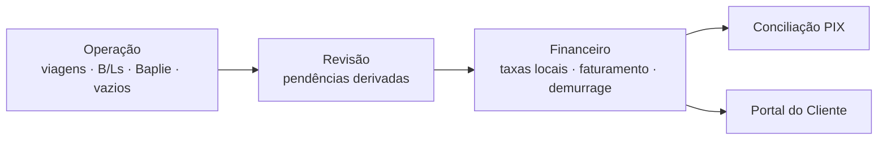

# Documentação do Vela e do Portal Fwlog

Índice documental revisado em 2026-09-19. Diretrizes canônicas em [AGENTS.md](../AGENTS.md).

## Por onde começar

| Você quer… | Vá para |
|---|---|
| Entender o sistema de cima | [ARCHITECTURE.md](ARCHITECTURE.md) + [CONTEXT.md](../CONTEXT.md) |
| Rastrear uma tela, botão, hook, serviço ou RPC | [RASTREABILIDADE.md](RASTREABILIDADE.md) |
| Mexer num módulo específico | [modules/](#módulos) abaixo |
| Rodar localmente | [setup/development.md](setup/development.md) |
| Fazer deploy | [setup/deploy.md](setup/deploy.md) |
| Rodar/entender os testes | [setup/testing.md](setup/testing.md) |
| Entender uma regra de negócio não óbvia | [operations/regras-de-negocio.md](operations/regras-de-negocio.md) |
| Entender segurança (RLS, auth, CSP) | [operations/seguranca.md](operations/seguranca.md) |
| Validar um fluxo manualmente | [operations/validacao.md](operations/validacao.md) |
| Saber por que algo foi decidido | [adr/](adr/) |

## Visão geral

Ciclo completo: **Operação** (viagens, B/Ls CNTR, carga solta e mistos, manifestos de granito, containers, veículos, Baplie EDI, vazios) → **Revisão** (resolução de pendências derivadas antes da emissão elegível) → **Comercial** (clientes, taxas locais, overrides) → **Financeiro** (faturamento, demurrage, conciliação PIX) → **Portal do Cliente** (consulta de faturas, pagamento, disputas).

O fluxo canônico detalhado está em [ARCHITECTURE.md](ARCHITECTURE.md#fluxo-operacional-e-financeiro).

## Módulos

| Módulo | Doc | Rotas |
|---|---|---|
| Viagens | [modules/viagens.md](modules/viagens.md) | `/viagens`, `/viagens/:voyageId` |
| BLs & EDI (import) | [modules/manifesto-edi.md](modules/manifesto-edi.md) | `/bls`, `/bls/:blId`, `/containers`, `/veiculos`, `/baplie`, `/vazios-importacao`, `/embarquevazios` |
| Granito | [modules/granito.md](modules/granito.md) | `/granito`, `/granito/taxas` |
| Chegadas/Saídas | [modules/chegadas-saidas.md](modules/chegadas-saidas.md) | `/chegadas-saidas` |
| Clientes | [modules/clientes.md](modules/clientes.md) | `/clientes`, `/clientes/:cnpj` |
| Taxas Locais | [modules/taxas-locais.md](modules/taxas-locais.md) | `/taxas-locais`, `/taxas-locais/tabelas` |
| Faturamento | [modules/faturamento.md](modules/faturamento.md) | operação em `/taxas-locais`; `/faturamento` é redirect legado |
| Demurrage | [modules/demurrage.md](modules/demurrage.md) | `/demurrage`, `/demurrage/taxas` |
| Conciliação PIX | [modules/reconciliacao-pix.md](modules/reconciliacao-pix.md) | `/reconciliacao` |
| Portal do Cliente | [modules/portal-cliente.md](modules/portal-cliente.md) | `/portal/*` |
| Operação & Suporte | [modules/operacao-suporte.md](modules/operacao-suporte.md) | `/painel`, `/revisao`, `/alertas`, `/alertas/regras`, `/relatorios`, `/line-up-tv/display`, `/admin` |

## Referência transversal

- [ARCHITECTURE.md](ARCHITECTURE.md) — stack, camadas, modelo de dados, mapa de rotas.
- [CONTEXT.md](../CONTEXT.md) — termos de domínio (B/L, Baplie, CE Mercante, demurrage…).
- [ROADMAP.md](ROADMAP.md) — estado atual, backlog e riscos.
- [CHANGELOG.md](CHANGELOG.md) — histórico de entregas relevantes.
- [adr/](adr/) — decisões arquiteturais numeradas.
- [operations/](operations/regras-de-negocio.md) — regras de negócio, segurança, validação, reset, [rate limit do Portal](operations/portal-rate-limit.md), [segredos dos jobs `pg_cron`](operations/segredos-cron.md).
- [setup/](setup/development.md) — desenvolvimento, deploy, testes.
- [plans/](plans/README.md) — planos de implementação vivos (ainda não executados).
- [spec/](spec/README.md) — specs funcionais ainda sem implementação concluída.
- [archive/](archive/README.md) — histórico: planos executados, specs concluídas, auditorias, QA e relatórios.

O ciclo de vida plano/spec → archive está definido em
[CONVENCOES.md](CONVENCOES.md#ciclo-de-vida-de-planos-e-specs).

## Auditoria documental

A [revisão de 2026-09-19](archive/audits/2026-09-19-overhaul-documental.md)
registra os contratos encontrados, as 69 decisões revisadas, o inventário da
cadeia ativa e os limites de evidência. É um snapshot, não substitui os módulos.

A [auditoria forense do núcleo de Operação Marítima de 2026-09-19](archive/audits/2026-09-19-auditoria-forense-nucleo-operacao-maritima.md)
registra riscos encontrados em Viagens, Escalas, Atracações, Line-Up, omissões,
transbordo e COD, além de dois conflitos contratuais pendentes de decisão.

A [auditoria de sistemas críticos marítimos de 2026-09-19](archive/audits/2026-09-19-auditoria-sistemas-criticos-maritimos.md)
registra riscos encontrados em Demurrage, faturamento local, rateio de
containers, importação, ADR e invalidação de cache. Em conjunto, as duas
auditorias registram 3 achados P0, 9 P1, 2 P2 e 1 P3.

## Convenções da documentação

Ver [`CONVENCOES.md`](CONVENCOES.md) — formato, estrutura dos módulos,
labels de evidência, catálogo de ações e regras de histórico vs arquivo.
