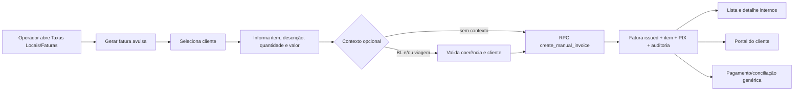

# Fatura avulsa flexível

**Estado:** desenho aprovado em conversa, aguardando plano e implementação  
**Data:** 2026-09-26  
**Módulo dono:** Faturamento  
**Escopo:** Vela, Portal Fwlog, banco, RPCs e conciliação PIX

## Efeito pretendido

O operador poderá emitir uma fatura contra um cliente para uma cobrança que
não pertença a uma tabela de taxas locais nem ao cálculo de demurrage. A
fatura continuará usando o documento, a numeração, o PIX, o pagamento, o
cancelamento, a auditoria e a visualização no Portal que já existem no modelo
de faturas.

BL e navio/viagem serão referências opcionais. O operador poderá informar o
nome do item, uma descrição da cobrança, a quantidade e o valor unitário em
BRL. A emissão será atômica e a fatura nascerá como emitida, como acontece no
fluxo operacional atual.

## Problema e limites atuais

Hoje o caminho de emissão está dividido entre:

- faturas individuais ou consolidadas de taxas locais, dependentes do ledger
  de recebíveis, do cálculo de cobranças e das travas de emissão;
- faturas de demurrage, com sua própria tabela e fluxo.

O tipo `individual` não deve ser reutilizado para uma cobrança arbitrária. Ele
é interpretado por consultas, conciliação e RPCs como uma fatura ligada ao
ledger local. A solução precisa distinguir a nova modalidade sem duplicar o
documento financeiro.

Fora do escopo desta spec:

- alterar as regras de emissão de taxas locais ou demurrage;
- criar uma nova tabela de faturas paralela;
- criar cobrança recorrente, parcelamento ou contrato de cobrança;
- suportar várias linhas independentes no primeiro formulário de emissão;
- mudar a matriz de papéis financeiros existente.

## Decisões de desenho

### Novo tipo de fatura

Adicionar o valor `manual` ao domínio de `invoices.invoice_type`. Na
interface, o rótulo será **Avulsa**. O tipo não participa do ledger de taxas
locais e não deve ser tratado como `individual` por inferência.

O tipo será reconhecido explicitamente por:

- filtros, tabelas, exportações e relatórios;
- cálculo de saldo e escolha do caminho de pagamento;
- criação do payload PIX e conciliação por TXID;
- listagem, detalhe e impressão no Portal;
- funções que hoje aplicam travas específicas de B/L local.

Os tipos existentes (`individual`, `consolidated` e `granite`) mantêm o
comportamento atual.

### Reutilização do modelo financeiro

Uma fatura avulsa reutilizará:

- `invoices` para cliente, número, estado, valor total, saldo, PIX, notas e
  auditoria;
- `invoice_items` para a linha da cobrança;
- a geração de número pelo trigger existente;
- `register_invoice_payment` para pagamentos não pertencentes ao ledger;
- cancelamento, impressão e consulta de pagamentos já existentes.

Não serão criados `bl_receivables`, `invoice_bls` ou
`invoice_receivable_links` para representar a cobrança avulsa. O vínculo
opcional ao contexto operacional ficará diretamente na fatura e não fará a
fatura parecer uma cobrança local calculada.

### Contexto operacional opcional

Usar o `invoices.bl_id` já existente para uma referência opcional a um B/L e
adicionar uma referência opcional `invoices.voyage_id` para a viagem.

Regras:

1. Sem BL e sem viagem, a fatura continua válida.
2. Com viagem e sem BL, a fatura exibe a viagem e o navio derivado dela.
3. Com BL e sem viagem, a viagem será derivada do BL quando existir.
4. Com BL e viagem informados, o RPC valida que a viagem pertence ao BL.
5. O BL informado precisa existir e pertencer ao cliente selecionado.
6. A referência de contexto não cria recebível local, não altera o status
   financeiro do BL e não torna a emissão dependente de CE Mercante ou de
   liberação do Portal.

O navio não será armazenado como uma terceira referência: será obtido da
viagem já existente. O detalhe deve mostrar somente os contextos realmente
informados.

### Item e descrição

A primeira emissão terá uma linha de cobrança:

- nome do item: `invoice_items.description`;
- descrição detalhada: `invoices.notes`;
- quantidade: positiva;
- valor unitário: positivo, em BRL;
- total: quantidade multiplicada pelo valor unitário, calculada no servidor;
- origem: `manual`.

O nome do item é obrigatório. A descrição detalhada é opcional, mas, quando
informada, deve aparecer no detalhe, na impressão e no Portal. O formulário
não terá um campo de total editável.

O mecanismo existente de inclusão de cobranças manuais no detalhe poderá
continuar sendo usado depois da emissão, respeitando suas regras atuais de
fatura aberta, sem pagamentos e não consolidada.

### Autorização e emissão

A nova RPC seguirá a fronteira de autorização já usada para emissão
financeira: somente os papéis atualmente autorizados poderão emitir. A
identidade será obtida de `auth.uid()` no banco; o cliente não poderá escolher
um ator arbitrário.

A RPC deverá validar, dentro da mesma transação:

- cliente válido e acessível ao operador;
- nome do item não vazio;
- quantidade e valor unitário positivos;
- BL e viagem existentes quando informados;
- coerência entre cliente, BL e viagem;
- valor total calculado no servidor.

Ela criará a fatura como `issued`, o item correspondente, o evento de ciclo
de vida e o registro de auditoria. O número da fatura continuará sendo
atribuído pelo mecanismo existente, nunca pelo formulário.

As travas CE Mercante, liberação do Portal, cálculo local e guardas de
container deverão ignorar explicitamente o tipo `manual`. Isso não altera as
travas de tipos locais existentes.

### PIX, pagamento e conciliação

O trigger de PIX deverá gerar payload para faturas `manual` com o mesmo
contrato usado para as demais faturas não demurrage.

O fluxo de pagamento será o caminho não pertencente ao ledger. As funções de
conciliação por TXID e de candidatos PIX deverão:

- incluir `manual` na seleção de faturas elegíveis;
- atualizar a fatura e registrar o pagamento pelo caminho genérico;
- não criar nem atualizar recebível de taxas locais.

Uma fatura avulsa cancelada não poderá ser escolhida como candidata de
conciliação, seguindo o comportamento corrente para faturas canceladas.

### Portal do Cliente

Uma fatura avulsa será visível no Portal quando o cliente tiver acesso ao
Portal conforme as regras existentes de autenticação e escopo do cliente.
Sua emissão não dependerá de uma liberação de faturamento local.

As funções seguras de listagem e detalhe do Portal deverão aceitar faturas
`manual`, inclusive aquelas sem BL. Para uma fatura com contexto, o Portal
mostrará o BL e/ou a viagem; sem contexto, mostrará a fatura sem inventar um
BL. O cliente verá:

- o tipo **Avulsa**;
- o item e a descrição;
- valor, saldo, estado, PIX e pagamentos;
- o contexto operacional somente quando existir.

O escopo será sempre derivado do cliente autenticado no Portal. Nenhum campo
de cliente, BL ou viagem enviado pelo navegador poderá ampliar esse escopo.

## Fluxo proposto

## Contratos de persistência e serviço

### Banco e RPCs

A implementação deverá ser feita em uma migration nova, sem editar as
migrations históricas ou o arquivo gerado de tipos manualmente. A migration
deverá:

- adicionar a coluna opcional `invoices.voyage_id` com FK para `voyages`;
- aceitar `manual` no contrato de `invoice_type` e nos checks aplicáveis;
- criar a RPC segura de emissão avulsa;
- ajustar as funções de PIX, conciliação e Portal explicitamente;
- revisar grants, políticas e contratos RPC conforme o procedimento de
  `WORKFLOW.md`;
- incluir comentário de rollback e declarar qualquer dependência de dados
  descartáveis somente se houver reescrita ou remoção de dados.

Os nomes finais das funções auxiliares podem seguir as convenções atuais, mas
o contrato público deverá deixar claro que a operação é de uma fatura avulsa.
O cliente web deve encapsular a chamada em `src/services/billing.ts` e no hook
de faturamento, sem espalhar chamadas RPC pelas páginas.

### Interface interna

Em `/taxas-locais`, na aba de faturas:

1. incluir a ação **Gerar fatura avulsa**;
2. abrir modal com cliente, item, descrição, quantidade, valor e contexto
   opcional;
3. usar os componentes existentes de cliente, B/L e viagem quando aplicável;
4. exibir confirmação antes da emissão;
5. após sucesso, invalidar a família de consultas de faturas e mostrar o
   resultado na lista;
6. permitir abrir o detalhe e imprimir o documento.

A lista e os filtros deverão distinguir **Avulsa**, **Único BL** e
**Consolidada**. A coluna de B/L continuará suportando o estado **Sem B/L**.

O documento interno deverá:

- usar o título **FATURA AVULSA**;
- mostrar o item e a descrição sem classificá-los artificialmente como taxa
  de container, carga solta ou documental;
- mostrar BL, navio e viagem somente quando presentes;
- manter valor, PIX, pagamentos e demais informações comuns.

### Interface do Portal

O Portal deverá reutilizar o detalhe e a impressão já existentes, com rótulo
**Avulsa**, uma seção de descrição e contexto opcional. O fluxo de reemissão
e pagamento deve continuar sendo o mesmo quando a fatura estiver elegível.

## Cache, exportações e superfícies derivadas

Após a emissão, o hook deverá invalidar a família de invoices e os detalhes
relacionados usando `queryKeys` e `cacheEffects` existentes. A criação não
deve depender de atualização manual da página.

As superfícies que hoje transformam qualquer tipo diferente de consolidada em
“Individual” deverão reconhecer `manual` como **Avulsa**, em particular:

- tabela e filtros de faturamento;
- exportações;
- reconciliação PIX e histórico;
- trilhas de B/L e relatórios que exibem o tipo da fatura;
- Portal.

Consultas de comunicação específicas de taxas locais não devem passar a
enviar uma cobrança avulsa como se fosse um cálculo local sem uma decisão
explícita do domínio.

## Critérios de aceitação

1. Um operador autorizado emite uma fatura avulsa para um cliente sem BL,
   sem viagem, com item, descrição e valor válidos.
2. A fatura recebe número, estado `issued`, saldo correto, item e payload PIX
   em uma única operação transacional.
3. Uma fatura pode ser emitida com viagem sem BL e exibe navio/viagem no
   detalhe e no Portal.
4. Uma fatura pode ser emitida com BL, valida o cliente e exibe o contexto;
   uma combinação BL/viagem incoerente é rejeitada sem fatura parcial.
5. A emissão avulsa não cria recebível local nem exige tabela de taxas,
   cálculo local, CE Mercante ou liberação local do Portal.
6. O cliente com acesso ao Portal visualiza a fatura avulsa, inclusive sem
   BL, com item, descrição, saldo e PIX.
7. Um pagamento manual ou uma conciliação PIX atualiza a fatura avulsa sem
   criar movimento no ledger de taxas locais.
8. A lista, o detalhe, a impressão, as exportações e os relatórios mostram
   **Avulsa**, e não **Individual**.
9. Faturas locais e de demurrage existentes mantêm as mesmas travas e o mesmo
   comportamento.
10. Um usuário sem a autorização financeira atual não consegue emitir pela
    RPC, mesmo que consiga acessar a tela.

## Evidências previstas

Durante a implementação, a afirmação de conclusão deverá ser sustentada por:

- **Teste de contrato SQL:** `npm run migrations:check` e `npm run rpc:check`;
- **Teste:** regressões do RPC/serviço e dos componentes no harness existente;
- **Teste:** `npm test`, incluindo criação sem contexto, contexto opcional,
  pagamento genérico e preservação dos fluxos locais;
- **Código:** revisão das funções de Portal, PIX, conciliação, exportação e
  impressão para cada tratamento explícito de `manual`;
- **Runtime:** se houver ambiente local Supabase controlado disponível,
  execução da migration e teste de RLS com identidades distintas;
- **Gates:** `npm run docs:check`, `npm run typecheck`, `npm run lint` e
  `npm run build`.

O teste local não provará sozinho a implantação remota nem a autorização em
produção; essas limitações deverão ser registradas no relatório de entrega.

## Alternativas consideradas

### Reutilizar `individual` sem ledger

Seria a menor alteração de schema, mas manteria uma ambiguidade perigosa:
consultas, conciliação, gates e relatórios tratariam a cobrança arbitrária
como taxa local. Foi rejeitado.

### Criar tabelas de fatura genérica separadas

Isolaria regras locais, mas duplicaria numeração, itens, PIX, pagamentos,
cancelamento, Portal e impressão. Também contrariaria o requisito de usar o
mesmo modelo de fatura. Foi rejeitado.

### Reutilizar `invoices` com o tipo explícito `manual`

Mantém um único documento financeiro e torna as exceções auditáveis por tipo.
Exige revisar todos os pontos que hoje assumem que apenas `individual` e
`consolidated` são faturas locais, mas é a alternativa escolhida.

## Assunções para o plano

- A autorização permanece igual à emissão financeira existente; ampliar de
  administrador para todo operador ativo é outra decisão.
- A descrição detalhada é uma nota da fatura e pode ser vazia; o nome do item
  continua obrigatório.
- A primeira emissão cria uma linha, sem impedir linhas manuais adicionais no
  detalhe depois.
- Não haverá backfill: faturas existentes não mudam de tipo.

