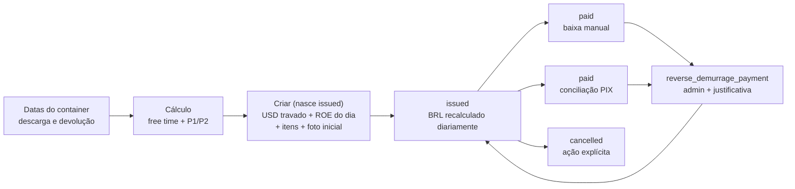

# Demurrage

> **Status:** ativo · **Atualizado:** 2026-10-08 · **Rotas:** `/demurrage`, `/demurrage/taxas`

## Propósito e escopo

Para o procedimento do usuário e as diferenças em relação a taxas locais,
consulte o [manual financeiro](../operations/manual-financeiro.md). A
[revisão financeira](../archive/audits/2026-10-04-revisao-fluxo-financeiro.md)
documenta a bateria local de pagamento, desconto e janela cambial.

Demurrage acompanha descarga e devolução de containers, resolve free time e
tarifas P1/P2, calcula a sobreestadia em USD e mantém invoices próprias cujo
total BRL **acompanha a PTAX até o pagamento** (USD travado na
emissão; ROE/BRL congelam só no pagamento — ver
[ADR 0014](../adr/0014-demurrage-recalculo-diario-substitui-roe-congelado.md) e
[ADR 0015](../adr/0015-demurrage-conciliacao-janela-duas-ptax-data-pagamento.md)).
As rotas internas ficam sob
`ProtectedRoute` em [`src/AppInterno.tsx`](../../src/AppInterno.tsx); a interface de tarifas
expõe mutações apenas para admin, enquanto as policies e RPCs continuam sendo a
fronteira efetiva de autorização.

O domínio não pertence ao ledger de taxas locais. Datas vivem em
`bl_containers`; configuração por B/L, em `bls`; tarifas, em
`demurrage_rates`; documentos e itens, em `demurrage_invoices` e
`demurrage_invoice_items`. A operação vive em `/demurrage`, com consultas em
`/reconciliacao` e `/portal/billing`, mas a persistência continua separada,
conforme a [ADR 0008](../adr/0008-demurrage-integrado-sem-unificar-persistencia.md).

Fontes executáveis principais:

- [`src/pages/Demurrage.tsx`](../../src/pages/Demurrage.tsx), composição da
  rota, queries, mutations e estado de tela, e
  [`src/pages/DemurrageRates.tsx`](../../src/pages/DemurrageRates.tsx);
- abas da rota em
  [`DemurrageContainersTab.tsx`](../../src/components/demurrage/DemurrageContainersTab.tsx),
  [`DemurrageInvoicesTab.tsx`](../../src/components/demurrage/DemurrageInvoicesTab.tsx)
  e [`DemurrageCustomersTab.tsx`](../../src/components/demurrage/DemurrageCustomersTab.tsx);
- fluxos modais em
  [`PtaxModal.tsx`](../../src/components/demurrage/PtaxModal.tsx),
  [`PaymentModal.tsx`](../../src/components/demurrage/PaymentModal.tsx),
  [`DiscountModal.tsx`](../../src/components/demurrage/DiscountModal.tsx),
  [`DisputeModal.tsx`](../../src/components/demurrage/DisputeModal.tsx) e
  [`CustomerReportModal.tsx`](../../src/components/demurrage/CustomerReportModal.tsx);
- [`src/services/demurrage/demurragePresentation.ts`](../../src/services/demurrage/demurragePresentation.ts)
  concentra formatação e cálculo operacional apresentado na tela principal;
- [`src/components/bl/BlDemurrageSection.tsx`](../../src/components/bl/BlDemurrageSection.tsx)
  na aba `faturamento` do B/L;
- serviços em [`src/services/demurrage/`](../../src/services/demurrage/);
- [`src/services/demurrageDunning.ts`](../../src/services/demurrageDunning.ts),
  [`DemurrageDunningStatus.tsx`](../../src/components/demurrage/DemurrageDunningStatus.tsx)
  e a Edge Function [`demurrage-dunning`](../../supabase/functions/demurrage-dunning/index.ts),
  que exibem e executam a Régua de Cobrança;
- importação de datas em
  [`src/services/containerDatesImport.ts`](../../src/services/containerDatesImport.ts);
- documento imprimível em
  [`src/components/demurrage/InvoiceDocument.tsx`](../../src/components/demurrage/InvoiceDocument.tsx).

## Anatomia das telas

### `/demurrage`

[`src/pages/Demurrage.tsx`](../../src/pages/Demurrage.tsx) mantém a aba ativa,
filtros, seleção de modais, queries e mutations. As três superfícies de dados
são renderizadas por `DemurrageContainersTab`, `DemurrageInvoicesTab` e
`DemurrageCustomersTab`, nas abas Containers, Faturas, Pagas, Canceladas e Por
Cliente (`src/services/demurrage/demurrageInvoiceTabs.ts`); os fluxos de PTAX, pagamento, desconto, disputa e
relatório são renderizados pelos modais homônimos. Sob recálculo diário (ADR
0014) não há `draft` nem `overdue`: a fatura nasce `issued`.

Container SOC (do cliente; ver SOC / COC no [CONTEXT](../../CONTEXT.md)) não
volta ao estoque e fica fora da Demurrage (migration `121`): o banco nunca o
deixa `overdue` (`trg_soc_container_never_overdue`), recusa item de fatura de
Demurrage para ele (`trg_guard_demurrage_item_not_soc`) e o exclui do conjunto
"todos os containers devolvidos" que `assert_demurrage_invoice_complete` exige.
A aba `Containers` e a emissão (`createInvoiceForBL`) também o deixam de fora, salvo container já
congelado numa fatura ativa. Desde a migration `178`, o SOC também não conta
como devolução pendente na planilha de datas nem na emissão automática.

Migration `178` (ADR 0078, itens 19 e 20):

- `demurrage_status` tem uma semântica: `returned` quando há devolução
  (`trg_container_demurrage_status_semantics`); sem devolução,
  `within_free_time` ou `overdue`.
- A descarga é só a informada: a ATA não preenche mais a descarga na inserção
  do container (saiu `trg_container_discharge_date`).
- Datas mudam pela planilha (`apply_container_dates_atomic`) ou pela edição do
  container (`set_container_dates`, que exige motivo para remover uma data); as
  duas aplicam a data a todos os B/Ls ativos que dividem o container na Viagem.
- **Grupo de Demurrage:** B/Ls do mesmo Cliente ligados por container
  compartilhado na Viagem (`demurrage_group_bl_ids`) recebem uma única Invoice,
  pelo B/L de menor número (`demurrage_group_anchor`), com cada caixa uma vez,
  quando todos os containers não-SOC do grupo voltaram
  (`issue_demurrage_invoice_for_bl`). Container no free time entra com valor
  zero; grupo sem sobreestadia não fatura. A Invoice aparece só na linha do
  B/L-âncora.
- **Datas alteradas depois da emissão** (`_reconcile_demurrage_after_dates`):
  sem pagamento, a Invoice é cancelada e reemitida (ou só cancelada, se o valor
  novo for zero); com pagamento, fica `dunning_suspended_reason` (a Régua não a
  cobra) e a diferença é tratada à mão pela restituição de Demurrage ou por
  avulsa. Nos dois casos abre o Alerta `demurrage_invoice_dates_changed`.

- A aba `Containers` é **monitoramento operacional** (ADR 0014): mostra containers
  ainda fora (`overdue`, demurrage correndo até hoje) **e** devolvidos com
  demurrage > 0. Os devolvidos dentro do free time são excluídos no frontend.
  Aceita `?busca=`, agrupa por B/L e deriva free time, dias excedidos, P1/P2 e
  total USD com `calculateDemurrage` (devolução ou hoje, quando ainda fora).
- A barra de KPIs combina contagem de containers em atraso, total USD da lista
  filtrada e total BRL aguardando pagamento.
- `Importar Datas` abre
  [`src/components/shared/ContainerDatesImportModal.tsx`](../../src/components/shared/ContainerDatesImportModal.tsx):
  parseia planilha, mostra preview e erros, exibe progresso/cancelamento da
  leitura e grava as datas por B/L em `apply_container_dates_atomic` (cada B/L
  é atômico; um B/L recusado não desfaz os outros). Quando todos os containers
  do B/L foram devolvidos, a RPC enfileira o efeito `demurrage_billing`; a
  emissão depende do `import-effects-runner`, hoje pausado, e não há emissão
  no navegador (`createInvoiceForReturnedBL`, que não tinha chamador, saiu na
  Etapa 12 do plano de correção das importações).
- O modal `Editar datas do container` altera descarga e devolução, validando
  formato e ordem antes da escrita.
- As abas de invoice consultam um status exato por vez (`issued`, `paid` ou
  `cancelled`). Cada linha abre breakdown, desconto e disputa; em `issued` há
  `Registrar Pgto`, `Fatura` e `Cancelar` (ação explícita e auditada).
- O visualizador de fatura/recibo usa
  [`src/components/demurrage/InvoiceDocument.tsx`](../../src/components/demurrage/InvoiceDocument.tsx)
  e o kit compartilhado
  [`src/components/shared/InvoiceDocumentKit.tsx`](../../src/components/shared/InvoiceDocumentKit.tsx);
  `Imprimir` chama `window.print()`.

### `/bls/:blId` → aba `faturamento`

[`src/components/bl/BlFaturamentoTab.tsx`](../../src/components/bl/BlFaturamentoTab.tsx)
inclui [`BlDemurrageSection`](../../src/components/bl/BlDemurrageSection.tsx)
como segunda entrada operacional. A seção permite:

- editar `free_time_override` e overrides P1/P2 do B/L;
- definir ou limpar `return_date` por container;
- visualizar descarga e cálculo derivado antes de salvar;
- voltar à tarifa padrão deixando os campos de override vazios.

### `/demurrage/taxas`

### Acordo de Demurrage do cliente

`customer_demurrage_agreements` (migration `366`) guarda free time e tarifas
P1/P2 negociados por cliente, com vigência (`valid_from`/`valid_to`). Duas
regras de leitura, ambas com uma armadilha já corrigida:

- **A escolha é por data de descarga, não por cliente.** Um cliente pode ter
  mais de um acordo ativo (o vencido e o vigente). Guardar "o acordo do cliente"
  antes de olhar a data fazia o vencido mascarar o vigente e a cobrança cair na
  tabela padrão. A escolha vive em `selectAgreementForDischargeDate`, usada pela
  ficha do B/L e pelo import de datas de container, com a lista ordenada por
  vigência decrescente para que o mais recente vença em sobreposição.
- **Sem cliente vinculado não há acordo.** `listCustomerDemurrageAgreements` só
  filtra por cliente quando recebe um id — "sem `customerId`" significa "todos",
  porque a aba de acordos lista tudo de propósito. Por isso quem pergunta pelos
  acordos **de um** cliente passa `enabled` ao hook: sem esse guard, um B/L sem
  cliente recebia todos os acordos ativos e aplicava, pela data, o acordo
  negociado de outro cliente.

O free time do acordo move o **início** da cobrança; a faixa P1 continua sendo o
intervalo de dias do grupo em `demurrage_rates`. Free time negociado além do fim
da faixa P1 significa, por definição, que não há dias em P1 — a cobrança começa
direto em P2, sem que dias livres virem P2
([`calculateDemurrage.test.ts`](../../src/services/demurrage/__tests__/calculateDemurrage.test.ts)
cobre os dois casos).

[`src/pages/DemurrageRates.tsx`](../../src/pages/DemurrageRates.tsx) lista
`demurrage_rates` por tipo de equipamento, free days, faixas P1/P2, vigência e
estado ativo. Usuários ativos podem ler; a UI e a policy
`admin_gerencia_demurrage_rates` reservam criar, editar, ativar/desativar e
excluir para admin, conforme
[`supabase/migrations_archive/048_demurrage_rates_table.sql`](../../supabase/migrations_archive/048_demurrage_rates_table.sql).

## Catálogo de ações

| Tela / ação | Pré-condições | Origem | Orquestração | Persistência | Efeitos e cache | Falhas | Evidência |
|---|---|---|---|---|---|---|---|
| `/demurrage` · monitorar containers em demurrage | Sessão interna; aba `Containers` | `Demurrage` (estado/queries); `DemurrageContainersTab`; `groupByBl`; `effectiveDemurrage`; filtro local | `listDemurrageContainers` (`demurrage_status IN ('overdue','returned')`); `ensureDemurrageRatesLoaded`; `calculateDemurrage` | SELECT em `bl_containers`, `bls`, `customers`, `voyages`, `vessels`; SELECT em `demurrage_rates` | Query `['demurrage-containers']`, `staleTime=60s`; devolvidos no free time excluídos no cliente; colunas free time / dias excedidos / P1·P2 / USD | Erro de query mostra `InlineError`; falha de tarifas sem cache válido do banco rejeita o cálculo com mensagem explícita | **Código:** [`Demurrage.tsx`](../../src/pages/Demurrage.tsx), [`DemurrageContainersTab.tsx`](../../src/components/demurrage/DemurrageContainersTab.tsx), [`demurragePresentation.ts`](../../src/services/demurrage/demurragePresentation.ts), [`demurrageContainers.ts`](../../src/services/demurrage/demurrageContainers.ts), [`demurrageRates.ts`](../../src/services/demurrage/demurrageRates.ts) |
| `/demurrage` · carregar KPIs | Sessão interna | Query montada pela página | `fetchDemurrageKPIs` executa três consultas paralelas | `bl_containers` e `demurrage_invoices` | Query `['demurrage-kpis']`, `staleTime=60s` | Qualquer consulta com erro rejeita o conjunto; a página mantém placeholders | **Código:** [`Demurrage.tsx`](../../src/pages/Demurrage.tsx), [`demurrageKpis.ts`](../../src/services/demurrage/demurrageKpis.ts) |
| `/demurrage` · importar datas | Arquivo com B/L, container e descarga; devolução opcional; várias Viagens por arquivo | `ContainerDatesImportModal.handleFile/handleImport` | `readContainerDatesFile` (prévia "antes → depois"; mesmo container com datas diferentes na Viagem recusa as linhas) → `importContainerDates` → RPC `apply_container_dates_atomic` por B/L (migration `178`: devolução vazia mantém a gravada; a data vale para todos os B/Ls ativos que dividem o container na Viagem; SOC não conta como devolução pendente); quando o grupo de Demurrage volta, enfileira `demurrage_billing` no B/L-âncora (emitido pelo `import-effects-runner`, hoje pausado) e reconcilia Invoice emitida com datas alteradas | UPDATE em `bl_containers`, um evento `container_dates_import` em `audit_logs` e o efeito em `import_pending_effects`, na mesma transação do B/L | Invalida `['demurrage-containers']`, `['demurrage-invoices']`, `['bl-detail']`; reporta atualizados, inalterados e ausentes | Colunas/datas inválidas ficam no preview; a falha de um B/L vira erro nas linhas dele e não desfaz os B/Ls já gravados | **Código:** [`ContainerDatesImportModal.tsx`](../../src/components/shared/ContainerDatesImportModal.tsx), [`containerDatesImport.ts`](../../src/services/containerDatesImport.ts) |
| `/demurrage` · editar descarga e devolução | Descarga obrigatória; devolução vazia ou não anterior | `openEditContainer`; `containerDatesMutation` | `demurrageDatesSchema` → `updateContainerDates` → cálculo de status | UPDATE direto em `bl_containers` | Invalida `['demurrage-containers']`; fecha modal | Validação local bloqueia formato/ordem; constraint do banco rejeita ordem inválida | **Código/Teste:** [`Demurrage.tsx`](../../src/pages/Demurrage.tsx), [`demurrageContainers.ts`](../../src/services/demurrage/demurrageContainers.ts), [`financialValidation.test.ts`](../../src/services/__tests__/financialValidation.test.ts) |
| B/L · definir ou remover devolução | Container do B/L; data opcional; motivo para remover a devolução gravada | `BlDemurrageSection.handleSaveReturnDate` (Remover pede motivo) | `updateContainerReturnDate` → RPC `set_container_dates` (migration `178`) | UPDATE em `bl_containers` do container e dos mesmos números nos B/Ls ativos da Viagem; `audit_logs` `container_dates` com o motivo; efeito `demurrage_billing` quando o grupo volta; reconciliação de Invoice emitida | Invalida `bl-detail`, `bls` e `['demurrage-containers']` | Recusa do banco (sem motivo, devolução antes da descarga) mostra toast e não grava nada | **Código/Teste:** [`BlDemurrageSection.tsx`](../../src/components/bl/BlDemurrageSection.tsx), [`demurrageContainers.ts`](../../src/services/demurrage/demurrageContainers.ts), [`updateContainerReturnDate.rpc.test.ts`](../../src/services/demurrage/__tests__/updateContainerReturnDate.rpc.test.ts) |
| B/L · salvar free time e P1/P2 | Usuário ativo; B/L carregado com `updated_at` esperado; valores vazios ou numéricos | `BlDemurrageSection` → `saveBlDemurrageConfig` | RPC `save_bl_demurrage_config` grava os três campos com optimistic lock e uma linha de auditoria por campo, na mesma transação | UPDATE de `bls.free_time_override`, `bls.demurrage_rate_override_p1_usd`, `bls.demurrage_rate_override_p2_usd`; INSERT em `audit_logs` | Invalida `queryKeys.bls.detail(bl.id)`, `queryKeys.bls.all()` e `['demurrage-containers']` | Conflito concorrente (`B/L foi alterado por outro usuario`) recarrega o detalhe; valor não numérico é bloqueado antes da chamada | **Código:** [`BlDemurrageSection.tsx`](../../src/components/bl/BlDemurrageSection.tsx), [`blDemurrageConfig.ts`](../../src/services/blDemurrageConfig.ts), `save_bl_demurrage_config` em [`002_business_logic_and_security.sql`](../../supabase/migrations/002_business_logic_and_security.sql) |
| Derivar free time, P1/P2 e status | Tipo, descarga e devolução válidos; tarifas do banco carregadas | Tracking, aba do B/L, import e criação de invoice | `ensureDemurrageRatesLoaded` carrega `demurrage_rates`; `calculateDemurrage` resolve tarifa e calcula dias inclusivos de P1/P2 | Sem escrita; lê cache em memória de tarifas vindas do banco | Resultado `within_free_time` ou `overdue`; usado para UI e persistência subsequente; falha de refresh preserva o último cache válido do banco | String vazia/data inválida, devolução anterior, tipo sem tarifa cadastrada ou ausência de tarifa vigente do banco lança erro | **Código/Teste:** [`demurrageRates.ts`](../../src/services/demurrage/demurrageRates.ts), [`calculateDemurrage.test.ts`](../../src/services/demurrage/__tests__/calculateDemurrage.test.ts) |
| `/demurrage` · criar invoice para B/L (nasce `issued`) | Cliente vinculado; todos os containers não-SOC do grupo devolvidos; sobreestadia no grupo; sem fatura ativa no grupo | Botão `Gerar Fatura` (B/L em atraso ou devolvido com sobreestadia); `generateMutation` | `createInvoiceForBL` → RPC `issue_demurrage_invoice_for_bl` (migration `178`): grupo de B/Ls do mesmo Cliente que dividem container na Viagem, uma caixa por número, emissão pelo B/L-âncora em `create_demurrage_invoice_authoritative`; container no free time entra com valor zero | RPC: INSERT em `demurrage_invoices` (`status='issued'`, `current_roe`/`current_total_brl`/`pix_payload`), itens e a foto inicial em `demurrage_invoice_history` | Invalida containers, invoices e KPIs | B/L já com fatura ativa lança erro (não duplica); PTAX indisponível sem cache rejeita | **Código:** [`Demurrage.tsx`](../../src/pages/Demurrage.tsx), [`demurrageInvoices.ts`](../../src/services/demurrage/demurrageInvoices.ts), [`156_demurrage_create_invoice_issued.sql`](../../supabase/migrations_archive/156_demurrage_create_invoice_issued.sql) |
| `/demurrage` · listar invoices e acompanhar Régua | Aba `Faturas` (`issued`), `Pagas` ou `Canceladas` | Query da página; `DemurrageInvoicesTab` | `listDemurrageInvoices({status})` + `fetchDemurrageDunningStatuses` → `getDemurrageDunningDisplay` | SELECT em `demurrage_invoices`, `customers`, `bls`, `voyages`, `vessels`, claims da régua, contatos, preferências e supressões | Queries `['demurrage-invoices', status]` e `['demurrage-invoices', 'dunning', invoiceIds]`; mostra tentativa seguinte, data, último envio ou pausa | Erro da invoice mostra `InlineError`; falha da régua mostra `Régua indisponível` | **Código:** [`Demurrage.tsx`](../../src/pages/Demurrage.tsx), [`DemurrageInvoicesTab.tsx`](../../src/components/demurrage/DemurrageInvoicesTab.tsx), [`demurrageInvoices.ts`](../../src/services/demurrage/demurrageInvoices.ts), [`demurrageDunning.ts`](../../src/services/demurrageDunning.ts) · **Teste:** `DemurrageDunningStatus.test.tsx` |
| `/demurrage` · abrir detalhe/breakdown | Invoice selecionada | Botão `Detalhes` ou visualizador | `getInvoiceDetail` carrega cabeçalho e itens em paralelo | SELECT em `demurrage_invoices` e `demurrage_invoice_items` | Query `['demurrage-invoice-detail', id]` | Erro da invoice ou dos itens rejeita a leitura | **Código:** [`Demurrage.tsx`](../../src/pages/Demurrage.tsx), [`demurrageInvoices.ts`](../../src/services/demurrage/demurrageInvoices.ts) |
| `/demurrage` · marcar pago manualmente | Financeiro/Administrativo; invoice `issued`; data informada | `PaymentModal`; `payMutation` | `markInvoicePaid` → `register_demurrage_payment`, com request UUID | RPC valida e bloqueia invoice, congela valores e registra histórico | Invalida invoices e KPIs | Estado/valor/data incompatíveis rejeitam; não é UPDATE direto do navegador | **Código/Teste:** [`demurrageInvoices.ts`](../../src/services/demurrage/demurrageInvoices.ts), `demurrageMoney.local-pg.test.ts` |
| `/demurrage` · desmarcar pagamento | Administrativo; UI oferece para `paid`; confirmação aceita | `handleUnmarkInvoicePaid`; `unpayMutation` | `unmarkInvoicePaid` → `reopen_demurrage_invoice`, com request UUID e motivo padrão | RPC reabre documento e audita | Invalida invoices e KPIs | Permissão/estado inválidos rejeitam; cancelar baixa não devolve dinheiro | **Código:** [`demurrageInvoices.ts`](../../src/services/demurrage/demurrageInvoices.ts), `012_demurrage_mutation_guards.sql` |
| `/demurrage` · cancelar invoice | Administrativo; documento não pago; confirmação aceita | `handleCancelInvoice`; `cancelMutation` | `cancelDemurrageInvoice` → `cancel_demurrage_invoice`, com request UUID e motivo padrão | RPC cancela e audita; fatura paga é recusada | Invalida invoices e KPIs | Estado/permissão incompatíveis rejeitam | **Código:** [`demurrageInvoices.ts`](../../src/services/demurrage/demurrageInvoices.ts), `012_demurrage_mutation_guards.sql` |
| `/demurrage` · aplicar ou remover desconto (USD) | Financeiro/Administrativo; invoice elegível; percentual 0–100 ou valor fixo permitido | `DiscountModal`; `discountMutation` | `applyDemurrageDiscount` → `apply_demurrage_discount`, com request UUID, justificativa e aprovador | RPC calcula desconto em USD antes da conversão, atualiza total/QR e histórico | Invalida invoices e KPIs | Desconto acima da base/estado incompatível é recusado | **Código/Teste:** [`demurrageInvoices.ts`](../../src/services/demurrage/demurrageInvoices.ts), `demurrageMoney.local-pg.test.ts` |
| `/demurrage` · atualizar assunto, motivo e notas da disputa | Invoice visível | `DisputeModal`; `disputeMutation` | `updateDemurrageInvoice` | UPDATE direto só de assunto, motivo e notas; o estado da Dispute (`dispute_open`/`dispute_status`) muda apenas pela conversa de Disputes (RPCs `add_demurrage_dispute_message`/`reopen_demurrage_dispute`), porque a migration `106` revogou o UPDATE dessas colunas | Invalida invoices e KPIs | Não há schema local específico; erro do banco mostra toast | **Código:** [`Demurrage.tsx`](../../src/pages/Demurrage.tsx), [`DisputeModal.tsx`](../../src/components/demurrage/DisputeModal.tsx), [`demurrageInvoices.ts`](../../src/services/demurrage/demurrageInvoices.ts) |
| `/demurrage` · imprimir fatura/recibo | Invoice detail carregado; `issued` ou `paid` na UI | Visualizador e botão `Imprimir` | Render React → `window.print()` | Sem escrita | Abre diálogo nativo; abaixo do título, "Valores calculados em DD/MM/AAAA com PTAX de R$ x,xxxx (fonte: BCB / BCB (cache) / Informada manualmente)"; fatura usa QR PIX e recibo usa carimbo `PAGO` | Popup/print dependem do navegador; não há geração de PDF no servidor | **Código:** [`Demurrage.tsx`](../../src/pages/Demurrage.tsx), [`InvoiceDocument.tsx`](../../src/components/demurrage/InvoiceDocument.tsx), [`InvoiceDocumentKit.tsx`](../../src/components/shared/InvoiceDocumentKit.tsx) |
| `/reconciliacao` · confirmar PIX | Match por TXID sem ambiguidade; data válida; valor na janela das duas PTAX | `Reconciliacao.confirmMutation` | `confirmUnifiedPixReconciliation` → RPC `confirm_unified_pix_matches` → lote `confirm_demurrage_pix_matches` | UPDATE em lote de `demurrage_invoices` para `paid` (congela valor casado, `paid_at`, `pix_txid`, `conciliated_by_extract`) + foto `source='payment'` no histórico | Invalida invoices locais/demurrage, KPIs, B/Ls, clientes e histórico | Wrapper rejeita data, origem, valor fora da janela e contagem parcial | **Código/Teste:** [`reconciliacao.ts`](../../src/services/reconciliacao.ts), [`158_demurrage_pix_window_conciliation.sql`](../../supabase/migrations_archive/158_demurrage_pix_window_conciliation.sql), [`reconciliacao.test.ts`](../../src/services/__tests__/reconciliacao.test.ts) |
| `/reconciliacao` · reverter baixa | Admin ativo; invoice `paid`; justificativa não vazia | `demurrageReversalMutation` | `reverseDemurragePayment` → RPC `reverse_demurrage_payment` | UPDATE para `issued`, limpa `paid_at`/`pix_txid`; INSERT em `audit_logs` | Invalida invoices de demurrage e histórico | `42501`, invoice ausente, status diferente de `paid` ou justificativa vazia | **Código/Teste:** [`Reconciliacao.tsx`](../../src/pages/Reconciliacao.tsx), [`reconciliacao.ts`](../../src/services/reconciliacao.ts), [`113_require_justification_on_payment_reversal.sql`](../../supabase/migrations_archive/113_require_justification_on_payment_reversal.sql), [`reversalJustificationMigration.test.ts`](../../src/services/__tests__/reversalJustificationMigration.test.ts) |
| `/demurrage` · visão por consignatário | Aba `Por Cliente` | `DemurrageCustomersTab` + `fetchCustomerDemurrageSummary`/`fetchCustomerDemurrageDetail` | Agrega faturas `issued` não pagas por cliente (USD estável + BRL do último recálculo) | SELECT em `demurrage_invoices` + `customers` | Queries `['demurrage-customer-summary']` e `['demurrage-customer-detail', id]` | Erro rejeita a leitura; vazio mostra `EmptyState` | **Código:** [`Demurrage.tsx`](../../src/pages/Demurrage.tsx), [`DemurrageCustomersTab.tsx`](../../src/components/demurrage/DemurrageCustomersTab.tsx), [`demurrageKpis.ts`](../../src/services/demurrage/demurrageKpis.ts), [`CustomerSummaryReport.tsx`](../../src/components/demurrage/CustomerSummaryReport.tsx) |
| `/demurrage` · imprimir relatório por cliente | Aba `Por Cliente` com dados | Botão `Imprimir` → `CustomerReportModal` | Render React → `window.print()` | Sem escrita | Relatório imprimível com totais USD/BRL por consignatário | Popup/print dependem do navegador | **Código:** [`CustomerReportModal.tsx`](../../src/components/demurrage/CustomerReportModal.tsx), [`CustomerSummaryReport.tsx`](../../src/components/demurrage/CustomerSummaryReport.tsx) |
| `/demurrage/taxas` · listar | Usuário interno ativo | Query da página | `listDemurrageRates` | SELECT em `demurrage_rates` | Query `['demurrage-rates']` | Erro mostra `InlineError` | **Código:** [`DemurrageRates.tsx`](../../src/pages/DemurrageRates.tsx) |
| `/demurrage/taxas` · criar/editar | Admin; tipo de container preenchido | `handleSave` | `upsertDemurrageRate` | UPSERT em `demurrage_rates` | Limpa cache em memória e invalida `['demurrage-rates']` | Validação mínima na UI; policy bloqueia não-admin | **Código:** [`DemurrageRates.tsx`](../../src/pages/DemurrageRates.tsx), [`demurrageRates.ts`](../../src/services/demurrage/demurrageRates.ts) |
| `/demurrage/taxas` · ativar/desativar | Admin | `handleToggleActive` | `toggleDemurrageRateActive` | UPDATE de `active` | Limpa cache em memória e invalida `['demurrage-rates']` | Erro mostra toast | **Código:** [`DemurrageRates.tsx`](../../src/pages/DemurrageRates.tsx) |
| `/demurrage/taxas` · excluir | Admin; confirmação destrutiva aceita | `handleDelete` | `deleteDemurrageRate` | DELETE em `demurrage_rates` | Limpa cache em memória e invalida `['demurrage-rates']` | Erro mostra toast; cancelar a confirmação não escreve | **Código:** [`DemurrageRates.tsx`](../../src/pages/DemurrageRates.tsx) |

## Estado e dados

- **Queries principais:** `['demurrage-containers']`, `['demurrage-kpis']`,
  `['demurrage-invoices', status]`, `['demurrage-invoice-detail', id]` e
  `['demurrage-rates']`. A aba do B/L também invalida `['bl-detail', blId]` e
  `['bls']`.
- **Estado local da página:** aba, busca, B/L em geração, modais de data,
  detalhe, desconto, disputa, pagamento, documento e aviso de ROE offline.
- **Tarifa efetiva:** precedência
  `override do B/L > demurrage_rates vigente`. A tarifa do banco é a única
  fonte de verdade; não existe fallback estático. `ensureDemurrageRatesLoaded`
  mantém cache em memória por cinco minutos e, se um refresh falhar depois de
  um carregamento válido, preserva o último cache vindo do banco. Sem cache
  válido ou sem linha vigente para o tipo de container, o cálculo falha com
  mensagem explícita ao operador.
- **Aliases ISO:** o catálogo pode manter somente as linhas canônicas de
  `main`; `demurrageRates` resolve os aliases históricos (`22G1`, `42G1`,
  `45G1`, `20FT`, `40FT`, `45R1` e equivalentes) para a tarifa canônica, sem
  duplicar essas linhas no banco.
- **Datas:** `bl_containers.discharge_date` e `return_date` são a fonte
  operacional. `demurrage_invoice_items` copia datas, dias, tarifas e subtotal
  no momento de criação da invoice.
- **ROE e recálculo diário:** `fetchROE` consulta a PTAX dos últimos dez dias,
  aplica o markup canônico `DEMURRAGE_ROE_MARKUP` (`1,065`, ADR 0014) e usa
  primeiro a referência persistida em `exchange_rate_reference` e depois
  `localStorage['demurrage_roe_cache']` como fallback. A referência do banco
  precisa ter origem `bcb_live`/`cached`, PTAX e ROE positivas e compatíveis
  com o markup; taxa manual não é apresentada como PTAX. O cache preserva
  `updated_at` do banco como data de obtenção. Uma falha do BCB só é reportada
  quando nenhum fallback está disponível. Sob recálculo diário, o
  valor em BRL não é congelado na emissão: a RPC `recalculate_demurrage_invoices`
  (`service_role`) reprecifica toda fatura `issued` e não paga quando a PTAX muda,
  grava `current_roe`/`current_total_brl`/`roe_source`, regenera o `pix_payload` e
  insere a foto em `demurrage_invoice_history`. A Edge Function agendada
  [`recalc-demurrage-ptax`](../../supabase/functions/recalc-demurrage-ptax/index.ts)
  busca a PTAX (política do `demurrage-manager`: `CotacaoDolarPeriodo`, ~10 dias,
  `top 1` desc) e chama a RPC em dias úteis. Quando o BCB está fora, o operador usa
  o botão **Informar PTAX** em `/demurrage` →
  `recalculate_demurrage_invoices_manual`, restrita a Financeiro,
  Administrativo e Equipamentos (migrations `109` e `110`; o botão só aparece
  para eles). Um banner de staleness
  aparece quando há faturas aguardando pagamento e o último recálculo é anterior ao
  último dia útil.
- **Régua de cobrança:** as migrations `378_demurrage_dunning_communication.sql`,
  `379_demurrage_dunning_claim_recovery.sql` e a correção `041_dunning_partial_claim_recovery.sql`
  agenda `demurrage-dunning` de hora em hora (no minuto 7 desde a migration
  `165`, fora da rajada dos minutos cheios). O primeiro envio usa
  `first_billed_at` e cada tentativa seguinte soma o intervalo configurado em
  `app_settings.demurrage_dunning_interval_days` (padrão de 7 dias), sem teto;
  cada execução reivindica um lote limitado e libera a posição quando a
  cobrança não chega a envio concluído, exceto quando a tentativa termina em
  `parcial`, que é terminal para o scanner de claims órfãos. O handler procura
  tentativas anteriores pela chave nova, pela identidade do destinatário e pela
  chave legada do contato; quando encontra uma tentativa histórica, reutiliza
  a `idempotency_key` persistida em vez de reescrevê-la. A UI lê o contador pela
  RPC `list_demurrage_dunning_claim_statuses`.
  Disputa aberta, bounce sem alternativa ou ausência de contato válido pausam a
  régua; a regularização retoma no próximo discriminador. O comunicado mostra
  USD, BRL informativo com ROE/data e o link do Portal, sem PIX ou anexo.
- **Câmbio de display:** o header interno usa
  [`src/hooks/useRoeHeaderRate.ts`](../../src/hooks/useRoeHeaderRate.ts) e o
  `fetchROE` compartilhado para apresentar PTAX Venda, a fórmula
  `PTAX × 1,065 = ROE`, a data efetiva e uma ação de atualização. Não há CNY nem
  contrato cambial paralelo; a entrada manual permanece exclusiva de
  `/demurrage`.
- **PIX:** o payload é montado por
  [`src/lib/pix.ts`](../../src/lib/pix.ts) com valor BRL e `doc_number` como
  TXID. A baixa de demurrage não cria `bl_receivables`,
  `invoice_receivable_links` nem `ledger_settlements`. Com
  `app_settings.pix_provider = 'itau'` (migration 151, ativa em produção desde 2026-10-07),
  o gatilho `zz_itau_pix_demurrage_payload` substitui o QR estático gravado
  pelas RPCs por uma cobrança Itaú. Nova PTAX altera a mesma cobrança, com o
  mesmo TXID e validade até 14h30 do próximo dia útil de Vitória (migration
  153, `itau_pix_cutoff`). Vencida e não paga, a cobrança é substituída por
  outra com novo TXID. Às 14h de dia útil, fatura sem a PTAX do dia abre
  `demurrage_ptax_recalc_failed` (entidade `itau-pix-14h`). O recálculo de PTAX
  (`recalc-demurrage-ptax`) está agendado às 14h de Brasília, de segunda a sexta,
  desde 07/10. Runtime em produção: a Demurrage de teste DEM-TEST-ITAU-20261007
  (R$ 0,16) foi baixada pelo cron em cerca de 40 s, com câmbio congelado no
  pagamento. Baixa pelo extrato continua disponível em `/reconciliacao`.
  Detalhes no [plano Itaú](../archive/plans/2026-10-06-integracao-itau-pix.md).
- **Portal (push/armazenado):** [`src/services/portalBilling.ts`](../../src/services/portalBilling.ts)
  chama `portal_list_demurrage_invoices()` e
  `portal_get_demurrage_invoice_detail(bigint)`. O cliente resolve pela sessão,
  limita a invoices `issued|overdue|paid` e exige liberação do B/L. Sob recálculo
  diário (ADR 0014) o portal **não** recalcula on-demand: exibe o **último
  recálculo armazenado** — USD fixo (`total_usd`) + BRL dinâmico
  (`current_total_brl`) com data/fonte de referência (`updated_at`, `roe_source`,
  via [`159_portal_demurrage_reference.sql`](../../supabase/migrations_archive/159_portal_demurrage_reference.sql)).
  Assim o valor exibido == valor do QR == histórico. Sem notificação a cada
  recálculo.

## Fluxos e invariantes

```mermaid
flowchart LR
    Dates["Datas do container<br/>descarga e devolução"] --> Calc["Cálculo<br/>free time + P1/P2"]
    Calc --> Create["Criar (nasce issued)<br/>USD travado + ROE do dia<br/>+ itens + foto inicial"]
    Create --> Issued["issued<br/>BRL recalculado diariamente"]
    Issued --> Manual["paid<br/>baixa manual"]
    Issued --> Pix["paid<br/>conciliação PIX"]
    Issued --> Cancelled["cancelled<br/>ação explícita"]
    Manual --> Reverse["reverse_demurrage_payment<br/>admin + justificativa"]
    Pix --> Reverse
    Reverse --> Issued
```

- `calculateDemurrage` rejeita devolução anterior à descarga; o modal repete a
  validação e
  [`089_demurrage_date_order_constraints.sql`](../../supabase/migrations_archive/089_demurrage_date_order_constraints.sql)
  aplica constraints `NOT VALID` a novas escritas/updates. `total_days` não pode
  ser negativo nos itens.
- O free time override desloca as faixas P1/P2 pelo delta; overrides P1/P2
  substituem apenas o valor diário.
- A criação da invoice recalcula e persiste um snapshot. Alterações posteriores
  de datas ou tarifas não reescrevem os itens existentes.
- Sob recálculo diário, a emissão **não** congela o ROE/BRL: ela trava o USD e
  fixa o `current_total_brl` do dia. O congelamento real ocorre no pagamento
  (`source='payment'` no histórico), quando o recálculo daquela fatura cessa. O
  câmbio do header é apenas informativo.
- Descontos são sempre expressos e aplicados em **USD**, antes da conversão para
  BRL: percentual sobre o total USD; valor fixo em USD subtraído do total USD. A
  RPC de recálculo grava `discount_usd` no histórico; `recomputeDiscountedBrl`
  reflete o desconto no BRL/QR imediatamente após a edição.
- `localStorage` permite continuidade quando o BCB está indisponível, mas não
  impõe expiração máxima ao cache de ROE. A UI avisa a data do cache quando o
  caminho explícito de emissão recebe `offline=true`.
- `mark_overdue_invoices()` foi reduzida em
  [`157_demurrage_drop_overdue.sql`](../../supabase/migrations_archive/157_demurrage_drop_overdue.sql)
  para tratar **apenas** faturas de taxas locais (`public.invoices`). Demurrage não
  tem vencimento sob recálculo diário (ADR 0014); faturas `overdue` legadas foram
  migradas de volta a `issued`.
- `set_container_discharge_date` em
  [`supabase/migrations_archive/028_demurrage_module.sql`](../../supabase/migrations_archive/028_demurrage_module.sql)
  é um trigger `BEFORE INSERT`: copia `voyages.ata` somente quando o container
  nasce sem descarga. Alterar a ATA depois não propaga a data.
- A maior parte do ciclo interno usa writes diretos em tabelas por
  [`demurrageInvoices.ts`](../../src/services/demurrage/demurrageInvoices.ts).
  Conciliação e reversão são as fronteiras RPC: lote base
  `confirm_demurrage_pix_matches`, wrapper transacional
  `confirm_unified_pix_matches` e reversão auditada
  `reverse_demurrage_payment`.
- O wrapper unificado identifica a fatura por `txid = doc_number` e valida o valor
  pago pela **janela das duas PTAX mais recentes** (`get_demurrage_recent_values`,
  ADR 0015) com `event_date <= data do pagamento`, tolerância `0,01` (fallback ao
  `current_total_brl` sem histórico). No pagamento congela o valor casado, grava a
  foto `source='payment'` no histórico e encerra o recálculo (`paid_at`).

## Testes e validação

- [`src/services/demurrage/__tests__/calculateDemurrage.test.ts`](../../src/services/demurrage/__tests__/calculateDemurrage.test.ts)
  cobre free time, P1/P2, tarifas carregadas do banco, falha sem cache válido,
  tipo sem tarifa cadastrada, overrides e ordem de datas.
- [`src/services/demurrage/__tests__/updateContainerReturnDate.rpc.test.ts`](../../src/services/demurrage/__tests__/updateContainerReturnDate.rpc.test.ts)
  cobre auditoria ao definir e limpar a devolução.
- [`src/services/__tests__/financialValidation.test.ts`](../../src/services/__tests__/financialValidation.test.ts)
  cobre validação de desconto e ordem descarga/devolução.
- [`src/services/__tests__/reconciliacao.test.ts`](../../src/services/__tests__/reconciliacao.test.ts)
  cobre chamada única ao wrapper, data ausente, erro de valor e divergência de
  contagem; testes de migration cobrem a exigência de admin e justificativa na
  reversão.
- [`src/services/__tests__/demurrageKpis.test.ts`](../../src/services/__tests__/demurrageKpis.test.ts)
  testa parsing de datas do extrato PIX, não `fetchDemurrageKPIs`; portanto os
  KPIs permanecem evidência de **Código**, não de teste específico.
- Por instrução desta execução, nenhum Vitest nem cenário de navegador foi
  rodado. Não há selo **Runtime** nesta cartografia.

## Notas e divergências

- **Correções implementadas — Código/Teste local.** O detalhe ganhou autorização de restituição excepcional pelo Administrativo e confirmação pelo Financeiro, com comprovante, favorecido e data. Cancelamento integral preserva recebimento/câmbio e cancela após devolver; o recibo mostra bruto, devolvido, pendente e líquido. A migration 136 foi incluída após autorização explícita; ver [decisões implementadas](../archive/specs/2026-10-04-controles-financeiros-design.md) e [manual](../operations/manual-financeiro.md). A janela cambial e o contrato de quitação de Demurrage continuam específicos desse domínio.

- O recálculo automático depende da ativação e configuração do job remoto; o código da Edge Function e seus testes não demonstram execução diária em produção (ADR 0065).

- **Corrigido (2026-06-25) — P2 não conta dias livres do override:** quando o
  `free_time_override` do B/L é maior que o fim da faixa P1 do grupo, a cobrança
  começa em `override+1` (direto em P2), mas
  [`calculateDemurrage`](../../src/services/demurrage/demurrageRates.ts) contava
  P2 a partir do dia fixo da faixa do grupo, incluindo indevidamente os dias
  ainda livres pelo override (sobrecobrança). O início de P2 passou a ser
  `max(p2_day_from, freeUntil+1)`, alinhado ao glossário (P1 começa em
  `override+1`, sem deslocar as faixas; ver `CONTEXT.md`). Caso normal
  (override ≤ fim de P1) permanece inalterado.
- **Suspeita — RPC base de PIX:** a função
  `confirm_demurrage_pix_matches(jsonb)` em
  [`095_confirm_demurrage_pix_matches_batch.sql`](../../supabase/migrations_archive/095_confirm_demurrage_pix_matches_batch.sql)
  atualiza IDs recebidos sem validar valor, status ou TXID. O caminho suportado
  da UI usa `confirm_unified_pix_matches`, que faz a validação. O risco de
  chamada direta permanece **Suspeita** até teste autorizado contra o banco ou
  endurecimento explícito do contrato base.
- **Código — duas reversões diferentes:** `Desmarcar` em `/demurrage` chama
  `unmarkInvoicePaid` por UPDATE direto, sem justificativa/admin; a reversão em
  `/reconciliacao` chama `reverse_demurrage_payment`, exige admin, justificativa
  e auditoria.
- **Código — auditoria desigual de datas:** a devolução editada pela aba do B/L
  grava `audit_logs` best-effort; o modal geral `updateContainerDates` não grava
  auditoria equivalente para descarga/devolução.
- **Código — trigger de descarga limitado ao insert:** o trigger não reage a
  mudanças posteriores de `voyages.ata`; correções exigem import ou edição
  explícita das datas.

### Próximo responsável da conversa

A resposta de Equipamentos deve manter a próxima ação escolhida na conversa.
A migration `159_dispute_preserve_next_responder.sql` impede que o trigger
legado da Invoice sobrescreva essa decisão quando `dispute_open` e
`dispute_status` não mudaram. Mudanças reais de lifecycle seguem sincronizadas.
Reprodução e correção validadas em PostgreSQL local; migration aplicada em
produção com autorização do dono em 2026-10-06. Repetição pela interface
com Equipamentos confirmou próxima ação Cliente, tanto na tela quanto no banco.
