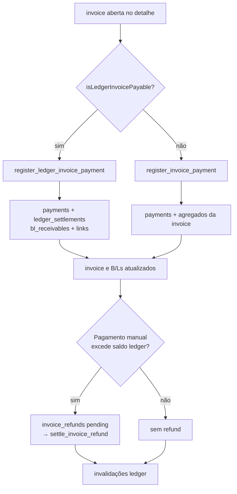

# Faturamento

> **Status:** ativo · **Atualizado:** 2026-09-16 · **Rotas:** operação em `/taxas-locais`; `/faturamento` é redirect legado; detalhe e estorno de pagamentos também são abertos por `/reconciliacao`

## Propósito e escopo

Faturamento é o processo compartilhado de invoices que transforma B/Ls elegíveis em documentos financeiros, mantém a
lista e o detalhe de invoices, cria consolidadas, registra pagamentos,
cancelamentos e restituições. Demurrage tem operação própria em `/demurrage`.
Para taxas locais, o saldo canônico é o ledger por recebível; a tabela
`invoices` continua sendo o documento emitido.

- `/taxas-locais` é a rota interna definida em `src/AppInterno.tsx` e composta por
  `src/pages/TaxasLocais.tsx`; `/faturamento` apenas preserva links legados.
- Alterações financeiras exigem usuário ativo/admin nas RPCs. A capacidade
  `faturamento_edit` existe em `src/hooks/useAuth.tsx`, mas
  `src/pages/TaxasLocais.tsx` não a usa como gate da rota ou das abas.
- [Taxas Locais](taxas-locais.md) é dona do cálculo e do estado
  `ready_for_billing`.
- Para B/Ls de container, carga solta e misto, emissão automática de taxas
  locais nasce na transição do CE Mercante (ADRs 0020 e 0042): o gatilho
  server-side calcula as taxas, promove o B/L e emite a invoice/recebível na
  mesma transação quando os dados do cliente, a reconciliação e os demais
  critérios financeiros estão prontos. Sem CE, qualquer desses modos fica em
  “Aguardando CE Mercante” na Validação; a exceção manual é a emissão
  individual “Emitir”, que mantém os mesmos gates. Granito é apoio operacional
  e não emite invoice (nota de 2026-09-23 na ADR 0042). Embarque de Vazios não emite CE nem possui faturamento de
  cliente.
- A emissão automática respeita o gate do Portal (ADR 0070, migration `083`):
  `trg_auto_bill_bl_after_ce_mercante`, criado pela migration `051`, é a fonte
  de verdade da transição CE → cálculo → fatura. Sem Portal pronto nem
  Liberação de faturamento sem Portal vigente, o CE calcula e **retém** a
  fatura (`billing_hold_reason = 'Acesso ao portal nao provisionado'`, resultado
  `held`), sem acionar a fila. Conceder a Liberação ou ativar o Portal
  reprocessa o Cliente e emite as retidas pelo mesmo caminho. Se houver falha operacional,
  um efeito `local_billing` é enfileirado; com ator válido ele é recuperável e,
  sem `auth.uid()`, fica registrado como `actor_source=system` e bloqueado de
  forma auditável, sem fabricar um usuário. A repetição é idempotente.
- A comunicação financeira é posterior à emissão/disponibilização no Portal:
  `customer_local_charges_communication_readiness()` exige CE, revisão limpa e
  faturamento concluído em todos os B/Ls ativos do cliente na viagem. Quando
  pronta, a automação dispara `ce_mercante_taxas` em background; o reenvio é
  manual e assistido na coluna da Taxas Locais. Essa trilha não altera o gate de
  faturamento.
- Demurrage mantém sua persistência separada, e a Régua de Cobrança
  `cobranca_demurrage` usa `first_billed_at`, intervalo de sete dias configurável
  e pausas por disputa ou falta de contato válido.
- [Reconciliação PIX](reconciliacao-pix.md) é dona do upload, matching,
  confirmação por TXID e estorno a partir do histórico.
- Demurrage permanece em sua própria experiência em `/demurrage` e em
  `demurrage_invoices`, sem entrar no ledger local.

## Anatomia das telas

### Detalhe do B/L: trilhos Operacional e Documental

`src/pages/BlDetalhe.tsx` monta dois trilhos independentes em
`BlRailsPipeline`. O trilho **Operacional** permanece com os marcos
`Saída do POL → Chegada ao POD → Descarga → Devolução` para B/Ls de container
(e os marcos de escala para carga solta).

O trilho antes chamado Financeiro agora é **Documental**. Seus quatro cards
centrais, sempre nesta ordem, são:

- **Cliente:** vínculo, reconciliação e pendências do cadastro/Portal;
- **Taxas Locais:** `Não calculado`, `Calculado`, `Isento` ou `Bloqueado · <causa>`;
- **CE Mercante:** `Cadastrado` ou `Pendente · bloqueia emissão e Portal`, para
  container e carga solta;
- **Fatura:** `Não emitida`, `Rascunho`, `Emitida`, `Parcialmente paga`, `Paga`,
  `Coberta`, `Cancelada` ou `Obsoleta`, com `Individual`/`Consolidada` quando
  houver vínculo.

O cabeçalho mostra apenas pendências dos quatro cards centrais e a próxima ação
aponta para o primeiro bloqueio. Demurrage é um indicador auxiliar opcional e
não bloqueia a fatura comum. A fatura do detalhe é lida tanto de
`invoice_bls` quanto de `invoice_receivable_links`, permitindo identificar uma
consolidada mesmo quando o B/L não tem vínculo individual. Não há vencimento ou
estado `Vencida` nesse trilho: essa regra não existe para taxas locais.

No backend, `047_bl_documental_gates.sql` exige CE Mercante antes de marcar o
B/L como pronto e nas fronteiras de emissão individual e consolidada. A
migration `051_ce_mercante_auto_billing.sql` leva a emissão para a transição
do CE; desde a `083` ela obedece ao mesmo gate do Portal que a emissão manual,
e contato com e-mail só é exigido de quem fatura sem Portal (`084`). A leitura de
Portal do detalhe também devolve `portal_access_ready`, calculado pela função
canônica `customer_portal_access_ready`; a entrega continua usando
`bl_has_portal_release`, que aplica a exigência documental aos dois modos de
carga.

### Lista de invoices

`src/pages/TaxasLocais.tsx` abre por padrão a aba **Faturas**. A lista usa:

- `src/components/billing/InvoiceFiltersBar.tsx` para B/L, invoice, cliente,
  navio/viagem, POD, tipo, status, emissão, pagamento e tamanho de página;
- `src/components/billing/InvoicesTable.tsx` para paginação, totais, B/Ls
  diretos ou de receivables e abertura do detalhe;
- métricas da página atual e exportação completa dos filtros;
- query string `invoice`, `customer`, `customerName`, `bl` e `tab`;
- loading, erro e vazio derivados de `useInvoices`.

A página não marca faturas vencidas ao montar: **taxa local não tem vencimento
praticado** (ADR 0055, migration `348`), e o detector `detect_overdue_invoices`
foi removido junto com a coluna `invoices.due_date`.

### Validação

- `src/components/billing/ValidacaoTab.tsx` orquestra consultas, mutações,
  invalidações e estado da fila operacional de taxas locais e Granito.
  `src/components/billing/ValidacaoControls.tsx` contém filtros, pipeline e
  ações em lote; `src/components/billing/ValidacaoOperationsTable.tsx` renderiza
  seleção, detalhes, conciliação e emissão individual.
- **Ajustes de COD (ADR 0051):** `src/components/billing/CodAdjustmentsPanel.tsx`
  lê a fila de `cod_adjustments` com status `pending` e só monta o painel quando
  há ao menos uma pendência. Uma resposta bem-sucedida sem pendências omite o
  painel inteiro; carregamento e erro continuam visíveis para não esconder uma
  consulta inconclusiva.
- **Bloqueio por Portal não provisionado (ADR 0054, issue 638):** o gate
  server-side é o produtor canônico `compute_bl_review_pendencies` — a migration
  `337` devolveu a pendência `Acesso ao portal nao provisionado` e a `367`
  endureceu o critério para o texto da ADR (conta ativa, `account_situation =
  'ativo'`, vinculada ao usuário de autenticação, com e-mail de recuperação
  presente, com `recovery_email_status = 'ok'` e fora de
  `portal_suppressed_emails`). A migration `368` fechou o resto: o critério
  virou a função única `customer_portal_access_ready`, consumida também pelo
  alerta consolidado `reconcile_customer_bl_review_alerts`; `recompute_bl_review_status` recalcula
  `review_status`/`notes` de um B/L e passou a ser chamada pelos triggers de
  `customer_portal_accounts`/`customer_contacts` — é assim que provisionar o
  portal atualiza os B/Ls do cliente sem intervenção manual — e pelo backfill
  que alinhou os B/Ls já existentes ao critério novo. B/L faturado não é
  recomputado. A emissão manual/consolidada recusa esse gate com exceção; a
  emissão automática do CE, desde a `083`, retém a fatura e grava o motivo em
  `billing_hold_reason`. A Validação lê as duas fontes: `notes`, escrito pela
  `save_bl_review`, e a retenção do CE. O cálculo não é afetado.
  Na Validação o
  motivo deixou de aparecer como “Cálculo incompleto”: `getBillingBlock` ganhou o
  código `portal_nao_provisionado`, atrás de cliente, cálculo e CE Mercante na
  precedência, porque é o único bloqueio que se resolve no cadastro do cliente e
  não no B/L. Ele só responde pelo B/L quando é a **única** pendência aberta.
- **Detalhe expandido da linha (issue 583):** o destaque no topo da expansão usa
  o código do bloqueio (`getBillingBlock`) para escolher título e tom
  (`src/components/billing/validacaoDetalhes.ts`): só quem impede a emissão
  (`sem_cliente`, `calculo_incompleto`, `aguardando_ce`) aparece em âmbar como
  “Por que não fatura?”; estados finais (`pronto`, `faturado`, `isento`) e
  Granito ficam neutros como “Situação da fatura”/“Escopo da operação”. O mesmo
  motivo deixa de repetir na coluna Motivo enquanto a linha está expandida. A
  expansão mostra ainda cliente vinculado com CNPJ formatado, CE Mercante,
  subtotal (BRL e USD quando houver), e o último evento auditado com o campo
  humanizado e data/hora (`describeLastEvent`); a conciliação pendente mantém os
  dados do manifesto, CNPJ, sugestão e detecção dentro do bloco "Detalhes", sem
  montar uma segunda caixa. O callout do bloqueio concentra o único link para
  onde se resolve: cliente para `/revisao?bl=<id>` — a
  Revisão lê `bl` junto de `cliente`/`busca`/`q`, filtrando a fila e abrindo o
  grupo daquele B/L (ADR 0061) —, CE
  Mercante para a ficha do B/L e portal para a ficha do cliente — este último
  visível a todos os perfis, já que conhecer o bloqueio não exige a permissão
  `portal_provisioning` que a tela de destino aplica.
- **Conferência de cálculo na expansão (issue 583):** a expansão do B/L mostra
  como se chegou ao valor, não só qual é. `list_bl_local_charge_lines` passou a
  devolver `charge_table_name`, `charge_table_pod` e `application_basis`
  (migration `369`, `DROP`+`CREATE` porque o `RETURNS TABLE` muda de forma):
  `charge_tables` e `charge_table_items` são admin-only sob RLS, então sem essas
  colunas a tela não teria como nomear a tabela usada. `ConferenciaCalculo`
  agrupa as linhas por origem (`src/components/billing/conferenciaCalculo.ts`):
  um grupo por tabela de cobrança, com o porto de descarga no subtítulo — é o
  POD que escolhe a tabela, Vitória cobra pela de Vitória e Salvador pela de
  Salvador —, mais os grupos **Lançamentos manuais** e **Sem tabela vinculada**,
  este último marcado como anomalia por ser linha automática sem tabela. Cada
  grupo soma seu subtotal e o cabeçalho soma o total, BRL e USD separados, sem
  converter moeda. A conferência nasce aberta: quem expande o B/L está ali para
  conferir. Granito não a exibe (não participa da emissão). Portos aparecem pelo
  alias e não pelo LOCODE: `formatPortDisplayName` cobre os códigos canônicos que
  `normalize_port_code` produz (migration `365`).

  Para **B/L faturado** a conferência continua lendo `charge_calculations`, que é
  o cálculo e está congelado na prática — `calculate_bl_local_charges` recusa
  recálculo (`22023`) em `invoiced`/`partially_paid`/`paid`. Mas o que a fatura
  registrou pode divergir desse total num caso concreto: desde a migration `261`
  o detalhamento é **congelado** em `invoice_items` na emissão (não mais
  reconstruído em leitura, que virou rede de segurança), e na consolidação, quando
  a soma dos itens não fecha com o saldo do B/L, o que se congela é **uma linha
  agregada** por B/L. Nesse caso a tela mostraria um número diferente do cobrado.
  Por isso a conferência compara seu total com o subtotal congelado do B/L
  (`invoice_bls`, ou `invoice_receivable_links` nas consolidadas — esta sem coluna
  em USD, daí o `null` significar "não sei" e não "zero") e **avisa quando
  diverge**, dizendo que o que vale para o cliente é o valor da fatura. A
  tolerância é de um centavo, porque os dois lados são `NUMERIC(14,2)` somados em
  pontos diferentes.
- **Etapa 12 do plano de faturamento (ADR 0038):** a aba Pendências foi
  removida — era subconjunto literal da Validação (mesma fonte
  `useLocalChargeOperations`, mesmo limite 1200, só `chargeStatus=review_required`
  fixo, sem seleção múltipla nem emissão individual). `?tab=pendencias` agora
  cai na Validação com esse filtro pré-aplicado (`ValidacaoTab`'s
  `initialChargeStatus`). O botão "Recalcular todas em revisão" no passo 2 do
  funil (`ValidacaoControls.tsx`) cobre o único recurso que a aba antiga tinha
  de exclusivo — recalcular sem selecionar manualmente.

### Modal de invoice consolidada

`src/components/billing/ConsolidatedInvoiceModal.tsx` seleciona cliente,
viagem e B/L, consulta receivables, desabilita linhas não elegíveis e resume
quantidade/valor. A seleção só aceita `eligibility_status = eligible`, regra
isolada em `src/components/billing/consolidatedInvoiceSelection.ts`.

### Detalhe, pagamento, restituição e cancelamento

`src/components/billing/InvoiceDetailModal.tsx` apresenta:

- métricas, cliente, B/Ls, itens e pagamentos;
- breakdown reconstruído de consolidadas;
- formulário de pagamento com decisão ledger versus legado;
- inclusão/exclusão de other charges em invoice individual elegível;
- lista de `invoice_refunds` e ação “Marcar estornado”;
- cancelamento de invoice sem pagamentos;
- cancelamento de baixa quando aberto pelo histórico de `/reconciliacao`;
- abertura do documento imprimível.

### Demurrage

**Etapa 12 do plano de faturamento (ADR 0038; nota editorial em
[ADR 0008](../adr/0008-demurrage-integrado-sem-unificar-persistencia.md)):** a
aba Demurrage (lista, modal de detalhe e impressão) foi removida por duplicar
`/demurrage` sem os filtros e a impressão de lá. A faixa agregada de Demurrage
também foi removida; `/demurrage` é a única superfície
das métricas e da gestão desse processo. `?tab=demurrage` redireciona para
`/demurrage`, consumindo `tab` e preservando os demais parâmetros (chamado só
depois de todos os hooks do componente para não violar as Regras dos Hooks entre
a renderização normal e a que redireciona). **Gap conhecido:** o plano pedia confirmar com a
operação que ninguém imprime Demurrage a partir de `/faturamento` antes de
remover esse caminho — essa confirmação não foi feita nesta sessão (sem
acesso à operação); se alguém dependia da impressão a partir daqui, o caminho
agora é abrir `/demurrage` diretamente.

### Histórico de reconciliação

`src/components/billing/ReconciliationHistoryTable.tsx` pertence à pasta de
billing, mas não é montado em `TaxasLocais.tsx`; a superfície executável está em
`src/pages/Reconciliacao.tsx`. Ela combina pagamentos locais e Demurrage,
filtra, ordena, pagina, exporta e abre o detalhe para estorno.

### Documento imprimível

`src/components/billing/InvoiceDocumentLocal.tsx` usa
`src/components/shared/InvoiceDocumentKit.tsx` e
`src/components/shared/invoiceFormat.ts`. `InvoiceDetailModal` abre uma área de
impressão e chama `window.print()`; o nome sugerido é calculado por
`buildInvoiceFileBaseName`. Não existe geração de PDF por biblioteca.

## Catálogo de ações

| Tela / ação | Pré-condições | Origem | Orquestração | Persistência | Efeitos e cache | Falhas | Evidência |
|---|---|---|---|---|---|---|---|
| `/taxas-locais` · filtrar/listar invoices | Sessão interna; filtros opcionais | `TaxasLocais` → `InvoiceFiltersBar` / `InvoicesTable` | `useInvoices` → `listInvoices` | `SELECT invoices`, `invoice_bls`, `invoice_receivable_links`, `payments`; filtros auxiliares consultam B/Ls/viagens | Query `queryKeys.invoices.list(filters)`; paginação remota da lista principal | Erro principal vira `InlineError`; filtros sem IDs retornam vazio sem consultar invoices | **Código:** `src/pages/TaxasLocais.tsx`, `src/services/billing.ts` · **Teste:** `src/services/__tests__/billing.test.ts` |
| `/taxas-locais` · exportar lista | Mesmos filtros; ao menos uma invoice | `TaxasLocais.handleExport` | `listInvoicesForExport` → `exportInvoicesWorkbook` | Leituras paginadas de 1000; arquivo XLSX local | Não altera cache | Sem linhas gera aviso; leitura/geração propaga erro | **Código:** `src/pages/TaxasLocais.tsx`, `src/services/billing.ts`, `src/services/exports.ts` · **Teste:** `src/services/__tests__/billingHelpers.test.ts` |
| `/taxas-locais` · abrir invoice | ID selecionado pela tabela ou query string | `InvoicesTable.onSelectInvoice` | `useInvoiceDetail` → `listInvoiceDetails` | RPC `list_invoice_details` lê documento, links diretos, itens e pagamentos | Query `queryKeys.invoices.detail(id)` | ID ausente desabilita query; erro mostra falha no modal | **Código:** `src/components/billing/InvoicesTable.tsx`, `src/components/billing/InvoiceDetailModal.tsx`, `src/services/billing.ts` · **Teste:** `src/pages/__tests__/TaxasLocais.behavior.test.tsx` |
| Detalhe · carregar breakdown consolidado | Invoice sem itens diretos e com `invoice_receivable_links` | `listInvoiceDetails` após RPC base | Lê links/snapshots; RPC `get_consolidated_invoice_item_breakdown`; valida com Zod | `invoice_receivable_links`, `voyages`, leitura protegida de `charge_calculations` | Reusa `invoice-detail`; usa linha agregada por B/L se breakdown não reconciliar com subtotal | Erro/shape inválido do breakdown é best-effort e cai no agregado | **Código:** `src/services/billing.ts`, `supabase/migrations_archive/086_consolidated_invoice_item_breakdown.sql`, `supabase/migrations_archive/090_restrict_consolidated_invoice_breakdown.sql` |
| Validação · recalcular selecionados | Seleção não vazia | `ValidacaoTab.runBatchOperation('recalculate')` | Hooks de Taxas Locais; Granito usa `runGraniteBatch` canônico | Uma operação por B/L | Invalida operações, invoices, B/Ls e resumo após o lote | Resultado parcial agrega erros sem interromper os demais B/Ls | **Código:** `src/components/billing/ValidacaoTab.tsx`, `src/hooks/useLocalCharges.ts`, `src/services/graniteBillingWorkflow.ts` · **Teste:** `src/services/__tests__/localCharges.test.ts`, `src/services/__tests__/graniteBillingWorkflow.test.ts` |
| Validação · apoio operacional de Granito | Não aplicável a Granito; a fila oferece apenas recálculo | `runBatchOperation('recalculate')` | `runGraniteBatch` chama exclusivamente `calculateGraniteBlCharges` | Snapshot quantitativo operacional | Invalida operações, B/Ls e resumo | Falhas são isoladas por B/L; nenhum estado financeiro é promovido | **Código:** `src/components/billing/ValidacaoTab.tsx`, `src/services/graniteBillingWorkflow.ts` · **Teste:** `src/services/__tests__/graniteBillingWorkflow.test.ts` |
| Validação · marcar pronto selecionados | Seleção; gates de cliente/taxas/CE Mercante | `runBatchOperation('ready')` | Agrupa locais por cliente e usa `markBlsReadyAndCreateInvoice` | RPC `mark_bls_ready_and_create_invoice` promove e emite atomicamente por grupo; `047_bl_documental_gates.sql` impede pronto/emissão sem CE em qualquer modo de carga | Invalida operações, invoices, B/Ls e resumo | Qualquer falha reverte promoção e emissão do grupo | **Código:** `src/components/billing/ValidacaoTab.tsx`, `src/services/localBatchBillingWorkflow.ts`, `src/services/billing.ts`, `supabase/migrations_archive/133_mark_bls_ready_and_create_invoice_atomic.sql`, `supabase/migrations/047_bl_documental_gates.sql` |
| Validação · emitir invoice individual | B/L local elegível, não faturado e com cliente | `handleIssueSingleInvoice` | `createInvoiceFromBls`; Granito é somente apoio operacional e não oferece emissão | RPC local para B/Ls financeiros; nenhum caminho financeiro novo para Granito | Invalida operações, invoices, B/Ls e resumo após emissão local | RPC revalida estado, cliente e vínculos; Granito não exibe o botão “Emitir” | **Código:** `src/components/billing/ValidacaoTab.tsx`, `src/components/billing/ValidacaoOperationsTable.tsx` · **Teste:** `src/components/billing/__tests__/ValidacaoOperationsTable.test.tsx` |
| B/L · marcar pronto e emitir atomicamente | Um B/L com cliente reconciliado, taxas elegíveis e CE Mercante | `BlCobrancasTab`, `reviewBillingAutomation` | `markBlReadyAndCreateInvoice` | RPC `mark_bl_ready_and_create_invoice` chama promoção + criação ledger na mesma transação; `047_bl_documental_gates.sql` reforça CE na prontidão e emissão | Chamadores invalidam seus domínios após sucesso | Qualquer falha aborta promoção e emissão juntas | **Código:** `src/components/bl/BlCobrancasTab.tsx`, `src/services/reviewBillingAutomation.ts`, `supabase/migrations_archive/102_mark_ready_and_invoice_atomic.sql`, `supabase/migrations/047_bl_documental_gates.sql` |
| Modal consolidada · listar elegíveis | Cliente selecionado; filtros opcionais | `ConsolidatedInvoiceModal` | `useConsolidatableReceivables` → `listConsolidatableReceivables` | RPC `list_consolidatable_receivables` lê ledger e links | Query `queryKeys.billingLedger.consolidatableReceivables(filters)` | Sem cliente não consulta; rows pagas/sem saldo/em consolidada aberta ficam desabilitadas | **Código:** `src/components/billing/ConsolidatedInvoiceModal.tsx`, `src/services/billingLedger.ts` · **Teste:** `src/components/billing/__tests__/ConsolidatedInvoiceSelection.test.ts` |
| Modal consolidada · emitir | Cliente, ao menos um receivable elegível e CE Mercante em cada B/L selecionado | `ConsolidatedInvoiceModal.submit` | `useCreateConsolidatedInvoice` → `createConsolidatedInvoice` | RPC `create_local_consolidated_invoice` cria invoice, links, evento e auditoria; `047_bl_documental_gates.sql` guarda links e transição para emissão | Invalidação ledger comum: ledger, invoices, B/Ls, clientes, detalhes, refunds, alertas e contagem | RPC trava receivables e rejeita cliente divergente, saldo inválido, consolidada aberta ou B/L sem CE | **Código:** `src/services/billingLedger.ts`, `supabase/migrations_archive/067_local_billing_ledger_phase2.sql`, `supabase/migrations/047_bl_documental_gates.sql` · **Teste:** `src/services/__tests__/billingLedger.test.ts`, `src/services/__tests__/blDocumentalGatesMigration.test.ts` |
| Detalhe · registrar pagamento ledger | `isLedgerInvoicePayable`: tipo individual/consolidated, status `issued`/`partially_paid`, saldo positivo | `InvoiceDetailModal.handleRegisterPayment` | `useRegisterLedgerInvoicePayment` → `registerLedgerInvoicePayment` | RPC `register_ledger_invoice_payment` → `payments`, `ledger_settlements`, receivables, invoice, B/Ls, eventos e possível refund | Invalidação ledger comum | Valor/data validados; RPC rejeita estado, ausência de links, TXID duplicado e regras de valor | **Código:** `src/pages/faturamentoLedgerPayment.ts`, `src/components/billing/InvoiceDetailModal.tsx`, `src/services/billingLedger.ts` · **Teste:** `src/services/__tests__/billingLedger.test.ts` |
| Detalhe · registrar pagamento legado | Invoice não classificada como ledger payable | Mesmo handler, ramo `else` | `useRegisterInvoicePayment` → `registerInvoicePayment` | RPC `register_invoice_payment` → `payments`, agregados de `invoices`, `bls.financial_status`, auditoria | Invalida invoices, detalhe, B/Ls e clientes | Bloqueia valor não positivo, acima do saldo, invoice paga/cancelada | **Código:** `src/hooks/useBilling.ts`, `supabase/migrations_archive/020_billing_hybrid_workflow.sql` · **Teste:** `src/services/__tests__/billing.test.ts` |
| Detalhe · adicionar other charge | Invoice não consolidada, status `draft`/`issued`, sem pagamentos | `handleAddCharge` | Zod `manualInvoiceChargeSchema` → `useAddManualInvoiceCharge` | RPC `add_manual_invoice_charge` → `invoice_items` e totais | Invalida invoices e detalhe | Validação de descrição/quantidade/valor; RPC guarda estado e pagamentos | **Código:** `src/components/billing/InvoiceDetailModal.tsx`, `src/services/financialValidation.ts`, `supabase/migrations_archive/108_guard_manual_charges_and_clear_pix_on_reversal.sql` |
| Detalhe · excluir other charge | Mesmas condições; item `source = manual` | `handleDeleteCharge` | `useDeleteManualInvoiceCharge` | RPC `delete_manual_invoice_charge` | Invalida invoices e detalhe | RPC rejeita item automático ou invoice protegida | **Código:** `src/services/billing.ts`, `src/hooks/useBilling.ts` · **Teste de contrato SQL:** `src/services/__tests__/guardManualChargesMigration.test.ts` |
| Detalhe · cancelar invoice | Admin; invoice sem pagamentos | `handleCancelInvoice` | `useCancelInvoice` → `cancelInvoice` | RPC protegida `cancel_invoice` (executa como `SECURITY DEFINER` após validar sessão ativa e papel admin) → invoice, batch, B/Ls e auditoria; implementação mais recente também preserva regras de Granito | Invalida invoices, detalhe, billing-ready, B/Ls e clientes | Pagamentos bloqueiam cancelamento; tabelas internas não são expostas diretamente; falha cria alerta/evento best-effort | **Código:** `src/components/billing/InvoiceDetailModal.tsx`, `src/services/billing.ts`, `supabase/migrations_archive/064_fix_granite_invoice_cancel_reissue.sql`, `supabase/migrations_archive/142_secure_cancel_invoice_wrapper.sql` |
| Detalhe · liquidar restituição | `invoice_refunds.status = pending`; admin | `handleSettleRefund` | `useSettleInvoiceRefund` → `settleInvoiceRefund` | RPC `settle_invoice_refund` atualiza refund e auditoria | Invalidação ledger comum | Refund ausente ou não pendente é rejeitado | **Código:** `src/services/billingLedger.ts`, `supabase/migrations_archive/112_settle_invoice_refunds.sql` · **Teste de contrato SQL:** `src/services/__tests__/settleInvoiceRefundsMigration.test.ts` |
| Detalhe · imprimir invoice | Detalhe carregado | `handlePrintInvoice` | Abre `InvoiceDocumentLocal`; `window.print()` | Sem persistência; documento usa snapshot/detalhe e `pix_payload` | Sem invalidação | Sem detalhe, ação não abre; falha de impressão é do navegador | **Código:** `src/components/billing/InvoiceDetailModal.tsx`, `src/components/billing/InvoiceDocumentLocal.tsx`, `src/index.css` · **Teste:** `src/components/billing/__tests__/InvoiceDetailPrint.test.tsx` |
| Histórico de reconciliação · filtrar/exportar/abrir detalhe | Superfície `/reconciliacao` | `ReconciliationHistoryTable` | `listReconciliationHistory`, `exportReconciliationHistoryExcel` | Leituras de invoices/payments/links e Demurrage; export XLSX local | Query `['reconciliation-history', filters]` | Erros de leitura aparecem na tabela; export reaplica filtros | **Código:** `src/components/billing/ReconciliationHistoryTable.tsx`, `src/services/reconciliacao.ts` · **Teste:** `src/components/billing/__tests__/ReconciliationHistoryTable.behavior.test.tsx` |

## Estado e dados

### Queries e invalidações

| Estado remoto | Query key | Dono |
|---|---|---|
| Lista de invoices | `queryKeys.invoices.list(filters)` | `useInvoices` |
| Detalhe | `queryKeys.invoices.detail(id)` | `useInvoiceDetail` |
| Links por B/L | `queryKeys.invoices.links(blIds)` | `useInvoiceLinks` |
| Clientes do seletor | `queryKeys.billingReady.customers(search)` | `useBillingCustomers` |
| Receivables consolidáveis | `queryKeys.billingLedger.consolidatableReceivables(filters)` | `useConsolidatableReceivables` |
| Refunds | `['invoice-refunds', invoiceId]` | `useInvoiceRefunds` |
| Alertas | `['financial-alerts']` | `TaxasLocais` |
| Histórico | `['reconciliation-history', filters]` | `ReconciliationHistoryTable` |

`useLedgerInvalidation` invalida `billingLedger.all()`, `invoices.all()`,
`bls.all()`, clientes, `['invoice-detail']`, `['invoice-refunds']`,
`['financial-alerts']` e `['op-count']`. O caminho legado usa invalidações
menores e específicas descritas no catálogo.

### Ownership financeiro

| Relação | O que possui | O que não possui |
|---|---|---|
| `invoices` | Documento, número, cliente, tipo, datas, total, agregados pagos/saldo, status, PIX e relações `covered`/`obsolete` | Não é a fonte final do saldo por B/L no caminho ledger |
| `invoice_bls` | Vínculo direto e snapshot financeiro de B/Ls para invoices individuais/Granito | Não representa a alocação contábil de consolidadas |
| `invoice_receivable_links` | Vínculo invoice ↔ receivable, subtotal/snapshot e estado `active`/`settled_by_this_invoice`/`settled_elsewhere`/`obsolete` | Não possui o saldo atual; aponta para `bl_receivables` |
| `bl_receivables` | `original_amount_brl`, `settled_amount_brl`, `balance_brl` e estado por B/L de taxas locais | Não é o documento apresentado ao cliente |
| `ledger_settlements` | Alocação de um pagamento a um receivable, método, origem e TXID | Não substitui o evento de pagamento em `payments` |
| `payments` | Evento de pagamento por invoice, valor, método, data, ator e observação | No ledger, não informa sozinho como o valor foi distribuído entre B/Ls |
| `invoice_refunds` | Excedente manual a devolver e estado `pending`/`settled`/`cancelled` | Não reabre saldo nem substitui o estorno do pagamento |
| `invoice_lifecycle_events` | Eventos `issued`, `paid`, `partially_paid`, `covered`, `obsolete`, `cancelled`, `reconciled_by_txid` e `backfilled` | Não é a fonte de saldo nem o log genérico de todas as alterações |

### Fronteiras atômicas

| RPC | Transição atômica | Chamador atual |
|---|---|---|
| `create_invoice_from_bls_with_ledger` | `create_invoice_from_bls_core` + `link_invoice_to_ledger` | `createInvoiceFromBls` em `src/services/billing.ts` |
| `mark_bl_ready_and_create_invoice` | trava B/L, promove para pronto e cria invoice ledger | `BlCobrancasTab` e `reviewBillingAutomation` |
| `create_local_consolidated_invoice` | trava receivables, cria invoice, links, evento e auditoria | `createConsolidatedInvoice` |
| `register_ledger_invoice_payment` | cria payment, distribui settlements, atualiza receivables/invoice/B/Ls, estados cruzados, eventos e refund | `registerLedgerInvoicePayment`; também chamado por reconciliação TXID |
| `reconcile_invoice_payment_by_txid` | resolve uma invoice local e delega a baixa ao ledger | `confirm_unified_pix_matches` em `/reconciliacao` |
| `register_invoice_payment` | pagamento e agregados do modelo legado | `registerInvoicePayment` |
| `cancel_invoice` | cancelamento, estado de B/Ls e auditoria | `cancelInvoice` |
| `add_manual_invoice_charge` / `delete_manual_invoice_charge` | item manual e totais protegidos por estado | `addManualInvoiceCharge` / `deleteManualInvoiceCharge` |
| `settle_invoice_refund` | `pending → settled` com auditoria | `settleInvoiceRefund` |

## Fluxos e invariantes

- `isLedgerInvoicePayable` exige tipo `individual` ou `consolidated`, estado
  pagável e `balance_brl > 0`; qualquer outro documento cai no RPC legado.
- No ledger, `bl_receivables.balance_brl` é a fonte da verdade. Totais e status
  em `invoices` e `bls.financial_status` são projeções atualizadas na mesma RPC.
- Pagamento ledger parcial produz `bl_receivables.status =
  partially_settled` e `invoices.status = partially_paid`. O valor é alocado em
  ordem de `receivable_id`.
- PIX exige quitação do saldo local, com margem técnica de `0,01`. Pagamento
  manual pode ser parcial; se exceder o saldo, aloca somente o aberto e cria
  `invoice_refunds`.
- `covered` significa que uma invoice individual foi quitada por uma
  consolidada ligada aos mesmos receivables. `covered_by_invoice_id` aponta para
  o documento que liquidou.
- `obsolete` significa que uma consolidada aberta perdeu validade porque uma
  invoice individual liquidou receivables que ela cobria. Seus links passam a
  `obsolete`.
- O estorno do pagamento local, documentado em
  [Reconciliação PIX](reconciliacao-pix.md), restaura receivables, links e
  estados `covered`/`obsolete` quando aplicável.
- O breakdown de consolidada é derivado em leitura. O subtotal de
  `invoice_receivable_links` prevalece: se a soma atual de
  `charge_calculations` não reconciliar em `0,01`, a UI mostra uma linha
  agregada.
- A UI agrupa sete status reais em três rótulos:
  `issued|partially_paid|draft → Emitida`,
  `paid|covered → Paga`, `cancelled|obsolete → Cancelada`.
  `overdue` saiu do domínio na migration `348` (ADR 0055).

## Testes e validação

Os testes não foram executados nesta cartografia, por instrução do coordenador.

### Testes de serviço, página e componente

- `src/pages/__tests__/TaxasLocais.test.ts`
- `src/pages/__tests__/TaxasLocais.behavior.test.tsx`
- `src/pages/__tests__/faturamentoInvoiceStatus.test.ts`
- `src/services/__tests__/billing.test.ts`
- `src/services/__tests__/billingHelpers.test.ts`
- `src/services/__tests__/billingLedger.test.ts`
- `src/components/billing/__tests__/ConsolidatedInvoiceModal.test.tsx`
- `src/components/billing/__tests__/ConsolidatedInvoiceSelection.test.ts`
- `src/components/billing/__tests__/ManualChargeFormFields.test.tsx`
- `src/components/billing/__tests__/ValidacaoOperationsTable.test.tsx`
- `src/components/billing/__tests__/validacaoFunnel.test.ts`
- `src/services/__tests__/portalGateCriterioMigration.test.ts`

Esses arquivos sustentam filtros, emissão, RPCs de pagamento/cancelamento,
seleção de consolidadas, helpers de status, paginação de exportação e estados
dos formulários.

### Teste de contrato SQL

Os testes abaixo leem texto de migrations; não provam o comportamento de um
banco aplicado:

- `src/services/__tests__/ledgerIndividualRpcMigration.test.ts`
- `src/services/__tests__/ledgerPartialPaymentsMigration.test.ts`
- `src/services/__tests__/ledgerSettlementGuardsMigration.test.ts`
- `src/services/__tests__/pixExactAndRefundsMigration.test.ts`
- `src/services/__tests__/settleInvoiceRefundsMigration.test.ts`
- `src/services/__tests__/guardInvoiceableReadyStateMigration.test.ts`
- `src/services/__tests__/guardManualChargesMigration.test.ts`

Não há evidência de Runtime registrada neste documento.

## Notas e divergências

- **Divergência de tipo legado — Código.** `InvoiceDocumentStatus` e `blRails.ts`
  ainda carregam o literal `overdue` e o traduzem para “Emitida”, embora o
  constraint atual de `invoices.status` não grave mais esse estado. É código
  legado sem caminho de persistência conhecido; a documentação de taxas locais
  continua descrevendo o contrato efetivo do banco, e esta nota evita tratar a
  divergência como conformidade completa.

- **Histórico fora de `/faturamento`.** Apesar do nome e diretório do componente,
  `ReconciliationHistoryTable` é montado somente em `/reconciliacao`.
- **Vencimento saiu do domínio (resolvido).** Os dois detectores que coexistiam
  (`detect_overdue_invoices` e o job diário `mark_overdue_invoices`) foram
  removidos pela migration `348`, junto com `invoices.due_date`, o status
  `overdue` e o gatilho que bloqueava emissão para cliente com fatura vencida.
  Taxa local não tem vencimento praticado — ver ADR 0055.
- **Emissão em lote não usa a fronteira pronta+invoice.** `ValidacaoTab` promove
  B/Ls e depois chama `create_invoice_from_bls_with_ledger` por cliente. Entre
  as duas etapas pode haver sucesso parcial; a RPC
  `mark_bl_ready_and_create_invoice` é usada no detalhe/revisão de um B/L.
- **Breakdown congelado na consolidação (migration `261`).** Desde a etapa 1 do
  plano de faturamento (ADR 0038, achado 3), `create_local_consolidated_invoice_core`
  grava o snapshot em `invoice_items` no momento da consolidação — linha por
  item quando a soma reconcilia com o saldo do B/L, senão uma linha agregada
  (mesma regra que antes só existia ao vivo). Consolidadas emitidas antes da
  migration foram backfilled (`snapshot_payload.backfilled=true`); a
  reconstrução ao vivo em `get_consolidated_invoice_item_breakdown` e no CTE de
  `portal_invoice_details` continua existindo só como rede de segurança.
- **Taxa local em USD converte na emissão (migration `268`).** Etapa 11 do
  plano de faturamento (ADR 0038, decisão 6, achado 7): linha em USD deixou
  de bloquear o faturamento. `create_invoice_from_bls_core` e
  `create_local_consolidated_invoice_core` convertem para BRL pelo ROE
  vigente em `exchange_rate_reference` no momento da emissão/consolidação,
  congelado no `snapshot_payload` do item (`roe`, `roe_effective_date`) e
  exibido como nota no documento impresso e no modal de detalhe. Sem ROE
  configurado, a emissão falha com mensagem explícita em vez de congelar
  valor zerado. A mesma migration removeu o trigger
  `trg_emit_invoice_on_bl_ready` (bug pré-existente: emitia fatura
  automaticamente em qualquer transição para `ready_for_billing`, inclusive
  pelo botão manual, sem checar CE Mercante) — `mark_bl_ready_for_billing`
  passou a chamar `sync_local_charge_receivable` diretamente para manter o
  ledger atualizado sem esse efeito colateral. A emissão automática voltou a
  existir apenas na transição explícita do CE Mercante, de forma idempotente,
  pela migration `051`.
- **Cálculo de taxas locais antes da conciliação de cliente (migration `072`):** `sync_local_charge_receivable` retorna `NULL` sem abortar quando `v_bl.customer_id` é nulo, permitindo cálculo inicial de taxas no B/L recém-importado; o registro financeiro em `bl_receivables` aguarda a conciliação do cliente na Revisão.
- **PIX tem dois autores.** A migration
  `074_ledger_invoice_pix_payload.sql` mantém payload por trigger para
  invoices locais. `createInvoiceFromBls` ainda executa `persistPixPayload`
  depois da RPC e trata falha de update como best-effort.
- **Suspeita — caminho legado amplo.** A decisão de pagamento é feita somente
  por tipo, status e saldo da invoice. Documento local com vínculos ledger
  incompletos pode cair no RPC legado; não houve validação em Runtime desse
  cenário.
