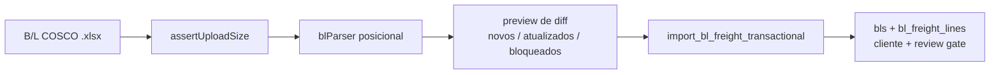

# Manifestos & EDI

> **Status:** ativo · **Atualizado:** 2026-09-11 · **Rotas:** `/manifestos`, `/manifestos/:blId`, `/carga-solta`, `/containers`, `/veiculos`, `/baplie`, `/vazios-importacao`, `/embarquevazios`

## Propósito e escopo

Pipeline de ingestão e revisão operacional do Vela. O módulo recebe planilhas e EDI/EDIFACT, limita o arquivo, faz parse e preview no cliente, persiste em tabelas de domínio e expõe as superfícies de B/L, containers, veículos, Baplie e vazios. A viagem é o eixo operacional; o arquivo de B/L é a fonte documental da carga de container e alimenta Frete & Despesas do BL e o ATD do POL; o Baplie é a fonte física de staging e conciliação. Conforme a ADR 0025, a importação de Manifesto CNTR e a geração local de EDI Mercante foram removidas.

Quando o importador de CE Mercante é iniciado no contexto de uma viagem, seu
escopo fica travado nessa viagem: o preview deve identificar e bloquear linhas
referentes a B/Ls de outra viagem. Os importadores contextuais de CE Mercante,
Manifesto BB e Veículos oferecem planilhas-modelo no próprio modal.

A fronteira de upload separa o tipo pelo conteúdo antes de escolher o parser:
XLSX/XLS são binários, CSV e EDI são texto, e conteúdo desconhecido ou ambíguo
é recusado. O UTF-8 é estrito por padrão; BOM é tratado explicitamente e
Windows-1252 só é aceito quando a origem autoriza o fallback. O preview informa
formato, encoding, BOM, tamanho e uma amostra textual limitada, sem enviar o
conteúdo à telemetria. Texto só é classificado como CSV de uma coluna quando
tem cabeçalho operacional plausível; a assinatura de EDI Mercante exige os
campos posicionais de um registro real, para que marcadores como `M3` em uma
planilha não desviem o parser.

Os erros de linha dos importadores que usam o modal compartilhado são
normalizados em `ImportIssue`: o painel mostra a lista completa, permite baixar
um CSV sanitizado e nunca inclui o payload bruto. O modal também mostra o
progresso por arquivo em leituras múltiplas e permite cancelar antes da etapa de
persistência; o cancelamento descarta prévias parciais. As superfícies
customizadas de Baplie, Granito, Veículos, Datas, CE Mercante e B/Ls usam o
mesmo hook de leitura cancelável e exibem o arquivo atual, progresso e o botão
de cancelamento; uma resposta tardia não publica prévia. A leitura comum de
planilhas descarta linhas realmente vazias sem renumerar os dados e anexa o
`rowNumber` físico 1-based. Erros de linha bloqueiam a confirmação por padrão;
as superfícies que permitem decisão manual passam `allowRowErrors` explicitamente,
enquanto erros documentais ou de viagem continuam bloqueantes.

As rotas são registradas em `src/AppInterno.tsx`. Os donos executáveis são as páginas em `src/pages/`, os parsers/importadores em `src/services/`, as RPCs e policies em `supabase/migrations/` e as chaves em `src/services/queryKeys.ts`. `docs/adr/0005-pipeline-importacao-viagem-staging-reconciliacao.md` define a separação entre fontes; `docs/adr/0009-hard-delete-controlado-bloqueios-fiscais-auditoria.md` define exclusões controladas.

Para o detalhe de B/L, o código dos PRs `#255`–`#258` é a fonte atual. A spec e os três planos arquivados em `docs/archive/` preservam intenção e sequência histórica, mas não prevalecem sobre `src/pages/BlDetalhe.tsx`, `src/components/bl/` e `supabase/migrations_archive/130_bl_timeline_rpc.sql`.

## Anatomia das telas

### `/manifestos`

- `src/pages/Manifestos.tsx` lista B/Ls de container com paginação, seleção em massa, resumo e filtros por texto, viagem, POL, POD, revisão, financeiro, taxas locais e perfil de carga. As ações disponíveis são Containers, Exportar, Importar CE Mercante e Importar B/L; não há importação de Manifesto CNTR nem geração local de EDI Mercante.
- Cada linha mostra CE Mercante, navio/viagem, consignatário/cliente, rota, containers distintos, perfil IMO/OOG, status de taxas, invoice e link para `/manifestos/:blId`.
- O modal de CE Mercante aceita planilha por B/L ou EDI de um único manifesto e
  exibe o encoding escolhido para o EDI no preview.
- O modal **Importar B/L** aceita Excel COSCO, exige a viagem declarada pelo operador, bloqueia divergência entre navio/viagem do arquivo e a viagem escolhida, mostra preview de novos/atualizados/bloqueados e confirma via RPC transacional (`import_bl_freight_transactional`). O parser aceita somente numeração ISO de container (`AAAA9999999`), ignorando cláusulas/textos do B/L que apareçam no bloco físico; o payload reaplica a mesma normalização antes da RPC. Também captura descrição, total de volumes, telefone do consignatário, DG Class e número ONU. Quando reimporta um B/L existente, o preview preserva `IMO/OOG`, classe IMO e número ONU dos containers cujo número já existia, para o B/L não apagar atributos físicos vindos de Baplie ou de dados históricos. O preview vincula cliente por documento ou nome do consignatário; a RPC grava o estado de reconciliação, aplica o review gate e mantém match por nome em validação manual. Conforme ADR 0020, import de B/L não dispara cálculo/emissão automática de taxas; o cadastro do CE Mercante é o gatilho único para B/Ls de container. Mudanças com impacto em faturamento (quantidade de containers, container compartilhado, IMO/OOG, lista de veículos por chassi, peso de carga solta, CNPJ faturado, POL/POD, viagem e modo de carga) são informadas e só são aplicadas com override do operador, auditado; sem override, os demais campos são aplicados e o B/L não é descartado. O diff cobre todos os campos que a RPC grava — inclusive os blocos completos de partes, `notify_cnpj_cpf`, e-mail do consignatário, veículos, viagem e modo de carga — e cada linha é rotulada na língua da operação. Quando o arquivo traz **outro consignatário**, o preview alerta a troca de cliente (de quem para quem, com CNPJ) e lista as faturas que a acompanham; com o aceite do operador, `relink_bl_customer` move o B/L, as faturas abertas de taxa local, o recebível do ledger e a demurrage viva para o novo cliente, **sem alterar valores**. Fatura consolidada com outros B/Ls, fatura com pagamento registrado, recebível do razão já baixado ou consignatário ainda não cadastrado (com qualquer cobrança viva, inclusive só recebível) impedem a troca automática — o motivo aparece no preview e os demais campos seguem sendo aplicados. A linha bloqueada (arquivo de outra viagem ou de outro B/L) não anuncia troca de consignatário, porque não importa nada; e quando o servidor recusa uma troca aceita no preview, a recusa (`customer_relinks`) é mostrada ao operador em vez de "importação concluída" (migration `360`). O CE Mercante não faz parte do payload do import e permanece como está. O **NCM** é campo próprio do B/L (`bls.ncm_codes`, ADR 0057): a importação grava o que o documento declara e preserva o cadastro manual quando o documento não declara nenhum, porque a descrição de container vem de uma célula só e a de carga solta descarta as linhas `NCM NUMBER`. A ação em lote fica na lista; a mesma entrada existe como ação rápida da viagem e como atalho filtrado na ficha do B/L.
- Para listagens e reconciliação por nome, o consignatário curto termina na natureza jurídica (`LTDA`, `S.A.`, `EIRELI`, `EI`, `MEI`, `SLU`, `EPP`, `ME`, incluindo combinações); sem marcador reconhecido, usa a primeira linha não vazia. O bloco completo permanece intacto como dado documental e para auditoria.
- Pela ADR 0025, `Laden on Board` persiste o ATD do POL. Entre B/Ls da mesma Viagem e POL prevalece automaticamente a data mais antiga. ETD e ATD permanecem distintos; telas sem coluna própria mostram ATD em verde na célula de ETD.
- Admin pode excluir B/Ls elegíveis, individualmente ou em lote, após pré-checagem fiscal.
- CE Master é agrupado por rota: com batch de manifesto vive em `import_batches.ce_master`; em viagem só-B/L vive em `voyage_route_ce_master`. A edição atual está na ficha `/viagens/:voyageId`, não nesta lista.

### `/manifestos/:blId`

- `src/pages/BlDetalhe.tsx` resolve o modo container/BB e monta as abas `visao-geral`, `detalhes`, `faturamento` e `historico`.
- A aba padrão `visao-geral` remove `tab` da query; `detalhes`, `faturamento` e `historico` sincronizam suas respectivas chaves. Chaves antigas, como `operacional`, não são aceitas.
- **Visão Geral:** consolida Viagem & Escala, Carga, Cliente e Financeiro; o pipeline abaixo da página mostra trilhos operacional/financeiro e a próxima ação pendente escopada ao B/L. A mesma aba exibe Transbordo/COD, divergências de existência do Baplie e o card de Portal (visibilidade, notificações vinculadas ao B/L e disputas abertas).
- A leitura interna do card de Portal usa `get_bl_portal_status` (migration 206), RPC `SECURITY DEFINER` que valida `is_active_user()` e faz a leitura mínima necessária por B/L, pois `portal_notifications` e `customer_portal_accounts` permanecem protegidas por RLS.
- **Detalhes do B/L:** `BlDetalhesTab` compõe `BlOperacionalTab` e `BlCargaTab`.
  - Formulário auditado: POL, POD, CE Mercante, shipper, consignee, `notify_party`, descrição, pesos/CBM, campos BB, pagamento, notas e justificativa.
  - NCM é somente leitura, derivado de `cargo_description` por `listBlNcms`/`extractNcmCodes` em `src/lib/ncm.ts`, deduplicado e sem ocorrências `UN NCM`.
- `notify_party` importado do B/L continua editável; B/Ls históricos preservam o valor já gravado.
  - O import também persiste, de forma forward-only, `place_of_receipt`, `movement_from`, `movement_to` e `issue_place`; registros históricos sem reimport permanecem nulos.
  - Composição física: containers/veículos ou resumo e itens legados de carga solta.
  - Atalho "Importar B/L" abre o modal compartilhado filtrado para o B/L da ficha, evitando aplicar arquivo de outro conhecimento.
- **Faturamento:** `BlFaturamentoTab` compõe `BlClienteSection`, `BlCobrancasSection`, `BlDemurrageSection` e o status/link da invoice ativa.
  - Cliente existente é vinculado/desvinculado por `save_bl_review`; cliente vindo do manifesto pode ser criado por `createCustomer` e então vinculado.
  - Vincular o cliente produz o efeito completo da conciliação (ADR 0061, migration `370`): além de fechar a fila,
    o e-mail do manifesto é capturado como contato **financeiro** do cliente — normalizado e sem duplicar contato
    já cadastrado — e `approved_by` registra o revisor que resolveu. É a mesma regra usada pelo Aprovar da
    Validação, agora em função única (`capture_manifest_financial_contact`).
  - Taxas locais podem ser calculadas, receber linhas manuais, ser revisadas e avançar para faturamento.
  - Demurrage reúne free time, P1/P2, descarga/devolução e cálculo por container; as regras canônicas continuam em [Demurrage](demurrage.md).
- **Histórico:** `BlHistoricoTab` usa paginação incremental de `bl_timeline`, badges por família e marca “Auditoria” somente quando há justificativa.

### `/carga-solta`

- `src/pages/CargaSolta.tsx` lista B/Ls BB, indicadores, filtros, exportação e acesso ao mesmo detalhe `/manifestos/:blId`.
- O importador de **Manifesto BB** aceita layout resumido, legado e formatos de carrier; faz preview, rejeita sobrescrita de B/L que já exista como container e registra erros no batch. Os modais de planilha mostram o formato/encoding detectados antes da prévia do domínio, exibem o relatório completo de erros aplicáveis e permitem exportá-lo sem `raw`.
- A confirmação do Manifesto BB pode aceitar explicitamente os erros de linha
  aplicáveis por `allowRowErrors`; isso não libera B/L incompatível com a viagem,
  documento inválido ou qualquer erro central da transação.
- O modal **Importar B/Ls (PDF/DOCX)** recebe o conhecimento avulso do armador — um arquivo por B/L, vários de uma vez. Exige a viagem declarada pelo operador e bloqueia o arquivo cujo navio/viagem divirja da viagem escolhida, no mesmo contrato da importação documental de B/L de container. O preview mostra partes, rota, volumes, peso, cubagem, marcas, NCM, frete e ressalvas do navio, além dos avisos de leitura.
- A tela também abre o modal compartilhado de CE Mercante.

### `/containers`

- `src/pages/Containers.tsx` lista containers consolidados com filtros, resumo distinto por tipo/IMO/OOG, exportação e navegação ao B/L.
- A ação aprovada se chama **Importar Datas de Descarga e Devolução**, tanto no botão quanto no título do modal. A descarga é obrigatória e a devolução é opcional; a operação pode emitir invoice de demurrage quando todos os containers do B/L retornaram.
- Não existe importador independente de IMO/OOG. O Baplie EDI é a fonte física única desses atributos; a resolução operacional de divergências do Baplie permanece disponível.
- Admin pode excluir containers sem cálculos de taxa nem itens de demurrage vinculados; veículos dependentes são removidos primeiro.

### `/veiculos`

- `src/pages/Veiculos.tsx` exige viagem para visualizar lista, estatísticas e filtros; o modal de importação possui seletor próprio de viagem.
- O parser suporta modelo do sistema, COSCO Daily Report e cabeçalhos chineses.
- A convenção numérica é escolhida pelos cabeçalhos da origem (pt-BR no modelo
  interno; en-US nos relatórios COSCO/terminais), sem aceitar expoente ou texto
  anexado como peso/cubagem. Container e tipo são canonizados em maiúsculas e
  um ISO inválido mantém-se apenas na prévia de erro, sem confirmação.
- O import valida chassi, B/L da viagem e match não ambíguo de container por número, tipo e lacre.
- A prévia exibe o relatório completo de erros de linha e permite exportá-lo sem
  arquivo bruto; no modal compartilhado, leituras múltiplas exibem progresso e
  podem ser canceladas antes da importação.
- O modal customizado também exibe o arquivo atual/progresso e permite cancelar
  a leitura antes de inserir veículos.
- Após inserir veículos, a isenção e o cancelamento de invoices ainda são
  efeitos pós-commit enfileirados na mesma transação pelo RPC. O consumidor
  server-only cancela invoices elegíveis e recalcula taxas por B/L; o worker
  continua pausado até prova de Preview e rollout autorizado.
- Admin pode excluir veículos individualmente ou em lote.

### `/baplie`

- `src/pages/Baplie.tsx` sincroniza a viagem em `?voyage=<id>` e trabalha em três estados: sem staging; staging sem manifesto; staging com manifesto.
- Importação/reimportação substitui o staging completo da viagem por `import_baplie_staging_transactional`; o parser valida que o conteúdo é EDI, respeita `UNA`/separadores/release character, isola segmentos por EQD, identifica o encoding escolhido e deduplica containers repetidos por numeração ISO antes de persistir.
- A conciliação considera containers `full`, divergência de existência e diferenças de `is_imo`, `imo_class` e `un_number`.
- O upload customizado mostra o progresso do parse e permite cancelar; o
  staging parcial nunca é publicado depois do cancelamento.
- O operador pode aplicar o valor físico do Baplie ou manter o manifesto, inclusive em lote.
- Containers `empty` podem gerar um manifesto de Vazios de Importação; se já existir um manifesto Baplie, o operador escolhe substituir ou manter.

### `/vazios-importacao`

- `src/pages/VaziosImportacao.tsx` lista e exporta containers vazios por texto, viagem e manifesto.
- O modal importa planilha com container, tipo e tara para uma viagem.
- O parser canoniza container/tipo e POL/POD, valida tara não negativa e aceita
  somente portos reconhecidos pelo catálogo operacional; uma linha inválida
  bloqueia a confirmação antes da RPC por padrão. O override explícito de
  `allowRowErrors` importa as linhas válidas, mantém os erros no resultado e
  nunca grava o texto cru de um porto não reconhecido. A prévia exibe e exporta
  a lista completa de erros sem `raw`; a leitura mostra progresso e pode ser
  cancelada antes da persistência.
- O fluxo alternativo vindo de Baplie é iniciado em `/baplie`, não por botão desta página.

### `/embarquevazios`

- `src/pages/EmbarqueVazios.tsx` reúne um Embarque por escala, com Unidades Embarcadas e Linhas de Serviço.
- A planilha aceita as sete colunas operacionais; container repetido, local/condição inválidos ou datas incompatíveis recusam o lote inteiro antes da substituição. Container e tipo são canonizados em maiúsculas, e os contratos ISO/data são validados antes da RPC. Inclusão manual cria manifesto e unidade na mesma RPC; regras de local e datas devolvem mensagem de validação segura para a tela.
- `/vazios` é apenas redirect de compatibilidade para esta rota.

## Contato do manifesto na importação

O e-mail do consignatário que vem no documento do B/L é capturado como contato
**financeiro** do cliente na própria importação, pela mesma função única que a
Revisão e o Aprovar da Validação usam (`capture_manifest_financial_contact`,
migration `370`). A captura acontece em `apply_bl_review_gate_after_import`
(migration `371`), que é o pós-processamento comum aos dois caminhos de
importação vivos — o de documento do B/L e o de carga solta.

Ela roda **antes** do laço de pendências, e não dentro dele: o laço faz
`CONTINUE` para B/L sem pendência, que é exatamente o caso do vínculo
automático por CNPJ (`matched_document`). Esse B/L nunca chega à Revisão, então
a importação é a única oportunidade de registrar o contato. Depois que o CE
Mercante é vinculado, o comunicado financeiro consulta a prontidão de todos os
B/Ls ativos do cliente na viagem; quando o conjunto está completo, o resumo de
CE e Taxas Locais é disparado em background pelo canal
`send-customer-communication`, sujeito à chave global e às supressões.

Duas notas de estado:

- **Carga solta não tem e-mail para capturar.** O layout de planilha aceito
  pelo parser de breakbulk não possui coluna de e-mail; `manifest_customer_email`
  vai nulo porque não há valor na origem, não por descarte. Se o layout ganhar a
  coluna, a captura passa a valer sem mudança no banco.
- **`import_manifest_with_postprocess_transactional` está sem chamador.** Era
  ela quem capturava o contato (via `p_contact_emails`) antes de a importação
  migrar para o caminho do documento do B/L; segue no banco, sem consumidor no
  aplicativo. A regressão que isso causou é o que a `371` corrige.

## Catálogo de ações

| Tela / ação | Pré-condições | Origem | Orquestração | Persistência | Efeitos e cache | Falhas | Evidência |
|---|---|---|---|---|---|---|---|
| `/manifestos` — filtrar, paginar, selecionar e abrir B/L | Sessão interna; dados legíveis por RLS | `Manifestos` | `useBls`, `useBlSummary`, `useInvoiceLinks`; seleção local por `useRowSelection` | Leitura de `bls`, relações e invoices | Queries `['bls', filters]`, `['bl-summary', filters]`, `['invoice-links', ...]`; navega para `/manifestos/:blId` | Filtros de `chargeStatus`/perfil podem carregar tudo e filtrar no cliente; erro de query mostra `InlineError` | `src/pages/Manifestos.tsx`; `src/hooks/useBls.ts`; `src/hooks/useBilling.ts` |
| `/manifestos` — importar B/L | Sessão interna exceto papel Equipamentos; arquivo COSCO `.xlsx/.xls`; viagem declarada pelo operador; B/L existente ou novo na viagem escolhida | `BlImportModal` | `parseBLFile` lê células posicionais, aceita apenas containers ISO, captura campos documentais e DG, `previewBlFreightImport` preserva atributos IMO/OOG existentes por container e calcula diff/gate contra a viagem selecionada, `confirmBlFreightImport` chama `import_bl_freight_transactional` | `bls.bl_emission_date`, `cargo_description`, `total_packages`, `packages_unit`, `consignee_phone`, `bl_freight_lines`, `bl_containers`/`vehicles` quando liberados, `bls.customer_id`/reconciliação, `audit_logs`; `164_guard_iso_container_numbers.sql` limpa livres inválidos e bloqueia novos inválidos | Invalida `['bls']`, `['bl-detail']`, `['voyages']`; review gate/fila são reaplicados no lote | CNPJ divergente, navio/viagem do arquivo diferente da viagem selecionada, match por nome pendente ou peso/containers bloqueados por cálculo/invoice deixam a linha em validação; texto contratual ou outra string fora de `AAAA9999999` não vira container; reimport do mesmo container não zera IMO/OOG; itens bloqueados não são enviados à RPC | `src/components/shared/BlImportModal.tsx`; `src/services/blParser.ts`; `src/services/blFreightImport.ts`; `supabase/migrations_archive/162_bl_freight_lines.sql`, `supabase/migrations_archive/163_bl_import_customer_review_gate.sql`, `supabase/migrations_archive/164_guard_iso_container_numbers.sql`, `supabase/migrations_archive/171_bl_import_edi_fields.sql`; testes `blParser.test.ts`, `blFreightImport.test.ts`, `containerNumberGuardMigration.test.ts`, `blImportCustomerReviewGateMigration.test.ts`, `BlImportModal.test.tsx` |
| Manifesto — editar CE Master | Batch/manifesto existente; usuário ativo | `PolScheduleModal` em `/viagens/:voyageId` | `setImportBatchCeMaster` chama RPC com lock, update e auditoria na mesma transação | `import_batches.ce_master` + `audit_logs` | Invalida `['voyages']` e timeline/schedules pela página Viagens | Não existe ação inline atual em `/manifestos`; batches agrupados ainda são enviados em chamadas independentes | `src/pages/Viagens.tsx`; `src/services/manifestImport.ts`; `supabase/migrations_archive/145_set_import_batch_ce_master_atomic.sql` |
| CE Mercante por linha | Planilha válida; B/L existente | `CeMercanteImportModal.handleSheetImport` | Parser valida cabeçalhos, BL único e CE de 15 dígitos; `importCeMercanteRows` chama `apply_ce_mercante_update` por linha; o trigger server-side calcula e emite imediatamente quando o B/L está elegível | `bls.ce_mercante`, auditoria, `charge_calculations`, invoice/recebível e efeito recuperável quando necessário | Invalida `['bls']`, `['bl-detail']` | Pode cruzar batches; erros são por linha e não revertem updates anteriores; bloqueio operacional fica como efeito `local_billing` reprocessável e a emissão repetida é idempotente | `src/components/shared/CeMercanteImportModal.tsx`; `src/services/ceMercanteImport.ts`; `supabase/migrations/016_import_metadata_and_omission_conflicts.sql`; `supabase/migrations/031_import_effect_consumers.sql`; `supabase/migrations/051_ce_mercante_auto_billing.sql` |
| CE Mercante por manifesto EDI | Registros C válidos e cobertura total de um único batch | `CeMercanteImportModal.handleEdiImport` | `parseCeMercanteEdiFile` + RPC `apply_ce_mercante_manifest` all-or-nothing; cada update dispara a transição server-side de cálculo/emissão, e a fila permanece como recuperação | `bls.ce_mercante`, `audit_logs`, `charge_calculations`, invoice/recebível e efeitos persistidos na origem | Invalida `['bls']`, `['bl-detail']` | BL/CE duplicado, CE fora de 15 dígitos, B/L inexistente, batches mistos ou cobertura incompleta retornam `ok=false`; nada é gravado; falha posterior fica no painel reabrível e é idempotente | `src/services/ceMercanteEdiParser.ts`; `src/services/ceMercanteImport.ts`; `supabase/migrations/016_import_metadata_and_omission_conflicts.sql`; `supabase/migrations/031_import_effect_consumers.sql`; `supabase/migrations/051_ce_mercante_auto_billing.sql` |
| Excluir B/L elegível | Admin; sem invoice, invoice consolidada, recebível, vínculo de recebível ou demurrage invoice | `runBlDelete` | `checkBlDependencies`; confirmação; `deleteBls` remove veículos e B/L | Hard delete de `vehicles` e `bls`; cascatas operacionais; auditoria de exclusão | Invalida `['bls']`, `['bl-summary']`, `['containers']`, `['vehicles']`, `['invoice-links']`, `['voyages']` | Bloqueadores fiscais geram exclusão parcial ou nenhuma; operação irreversível | `src/pages/Manifestos.tsx`; `src/services/bls.ts`; `docs/adr/0009-hard-delete-controlado-bloqueios-fiscais-auditoria.md` |
| B/L — sincronizar aba com URL | B/L válido | `BL_TABS` / `setSearchParams` | `visao-geral` remove `tab`; demais definem query | Nenhuma | Preserva componentes montados por prop `active` | Query desconhecida cai em `visao-geral` | `src/pages/BlDetalhe.tsx`; `src/pages/__tests__/blTabs.test.tsx` |
| B/L — editar revisão operacional e carga | Mudança detectada; justificativa; usuário; `updated_at` esperado | `BlOperacionalTab` / `useBlEditForm` | Normaliza campos, cria auditoria por campo e chama `save_bl_review`; BB sincroniza toneladas para kg | `bls`, `audit_logs`, fila de reconciliação; status recalculado pelo gate | Invalida `['bl-detail', blId]`, `['audit-logs','bl',blId]`, `['bls']`, `['voyages']` | Sem mudança/justificativa; número inválido; `PT409`/`40001` recarrega após conflito | `src/hooks/useBlEditForm.ts`; `supabase/migrations_archive/129_review_gate_hardening.sql` |
| B/L — importar B/L na ficha | B/L aberto; arquivo COSCO do mesmo B/L; viagem declarada | `BlDetalhe` → `BlImportModal` | Modal chama o mesmo parser/preview/importador com `onlyBlId` e viagem selecionada | `bls.bl_emission_date`, `bl_freight_lines`, vínculo/reconciliação de cliente e auditoria; dados físicos só se não houver bloqueio financeiro | Invalida `['bl-detail']`, `['bls']`, `['voyages']`; review gate/fila são reaplicados para o B/L | Arquivo de outro B/L ou de outra viagem é bloqueado no preview; bloqueios financeiros e match por nome aparecem linha a linha | `src/pages/BlDetalhe.tsx`; `src/components/shared/BlImportModal.tsx`; `src/services/blFreightImport.ts` |
| B/L — exibir NCM e Notify Party | Descrição/notify importados ou editados | `BlOperacionalTab` | `listBlNcms` deriva chips; import de B/L persiste o bloco notify | NCM não persiste em coluna própria; `notify_party` persiste em `bls` | Sem query própria | NCM ausente mostra vazio; dados históricos não recebem backfill | `src/lib/ncm.ts`; `src/services/blFreightImport.ts`; `src/hooks/useBlEditForm.ts` |
| B/L — vincular, criar ou desvincular cliente | Usuário; B/L carregado; dados de manifesto para criação | `BlClienteSection` | `save_bl_review` para vínculo; `createCustomer` e depois vínculo; fallback procura CNPJ já existente | `customers`, contatos e `bls.customer_id`/reconciliação | Invalida `queryKeys.bls.detail(bl.id)` | Conflitos/duplicidade de cliente; falha genérica na UI; vínculo exige estado atual do B/L | `src/components/bl/BlClienteSection.tsx`; `src/services/customers.ts` |
| B/L — calcular/revisar taxas e faturar | Usuário; linhas/tabela elegíveis; gate e cliente coerentes | `BlCobrancasSection` | Hooks de taxas; linhas manuais; `markBlReadyAndCreateInvoice` quando há cliente | `charge_calculations`, `bls`, recebíveis/invoices conforme serviços/RPCs | Invalida famílias de linhas, B/Ls, pendências, voyages e invoices; caminho de emissão também usa arrays literais | Pendência de revisão, ausência de cliente, USD ou tabela ausente bloqueiam; B/L faturado trava edição | `src/components/bl/BlCobrancasTab.tsx`; `src/hooks/useLocalCharges.ts`; `src/services/billing.ts` |
| B/L — configurar demurrage e datas de retorno | Usuário ativo; container/B/L carregado | `BlDemurrageSection` | `save_bl_demurrage_config` grava free time, P1/P2 e auditoria com optimistic lock; retorno usa `updateContainerReturnDate` | `bls`, `bl_containers`, `audit_logs` | Invalida `queryKeys.bls.detail(bl.id)`, `queryKeys.bls.all()`, `['demurrage-containers']` | Conflito concorrente recarrega o B/L; regras pertencem a Demurrage | `src/components/bl/BlDemurrageSection.tsx`; `src/services/blDemurrageConfig.ts`; `supabase/migrations_archive/147_save_bl_demurrage_config_atomic.sql` |
| B/L — abrir invoice ativa e carregar Histórico | B/L válido | `BlFaturamentoTab` / `BlHistoricoTab` | Link para `/faturamento?invoice=<id>`; `useInfiniteQuery` chama `bl_timeline` em páginas de 50 | Leitura de invoices e `audit_logs` resolvidos pela RPC | `queryKeys.invoices.links([blId])`; `queryKeys.bls.timeline(blId)` | Histórico sem evento mostra vazio; falha da RPC não tem estado de erro dedicado na aba | `src/components/bl/BlFaturamentoTab.tsx`; `src/hooks/useBlTimeline.ts`; `src/services/blTimeline.ts`; `supabase/migrations_archive/130_bl_timeline_rpc.sql` |
| `/carga-solta` — parse/preview/import de B/L avulso | Viagem, usuário e arquivo `.pdf`/`.docx` legível; navio/viagem do documento compatível com a viagem escolhida | `BlDocumentImportModal` | PDF com rótulos numerados é lido por âncora de rótulo; `.docx` (formulário escaneado com caixas de texto) e PDF sem rótulo são lidos por conteúdo; o B/L vira um manifesto BB de uma linha e segue por `importBreakbulkManifest` | Mesma RPC do manifesto BB: `import_manifest_transactional`, campos BB, `bl_breakbulk_items` e review gate na mesma transação | Invalida `['bls']`, `['voyages']`, `['port-options']` | Sem número de B/L o arquivo não importa; divergência de navio/viagem e erros documentais bloqueiam; avisos de leitura (CNPJ, peso, cubagem, volumes divergentes do total por extenso) entram como erros do lote e só passam com `allowRowErrors` explícito; CE Mercante ausente no documento não apaga o CE já gravado | `src/services/blDocumentParser.ts`; `src/services/blDocumentImport.ts`; `src/components/shared/BlDocumentImportModal.tsx`; `src/services/__tests__/blDocumentParser.test.ts` |
| `/carga-solta` — parse/preview/import BB | Papel diferente de Equipamentos; viagem, usuário e arquivo válido | Modal em `CargaSolta` ou `VoyageImportActions` | Parser suporta três layouts; service filtra B/Ls incompatíveis e envia lote, B/Ls, itens e erros para `import_breakbulk_manifest_transactional`, com `allowRowErrors` apenas quando o operador aceita a prévia; efeitos `local_billing` são gravados na mesma transação e processados pelo worker pausado | RPC compõe `import_manifest_transactional`, campos BB, `bl_breakbulk_items`, review gate e outbox em uma transação | Página invalida `['bls']`, `['voyages']`, `['port-options']`; o detalhe do B/L reabre o status do efeito | B/L existente como container, erro de documento/viagem ou qualquer falha central reverte batch, B/Ls, itens, erros e efeitos | `src/services/breakbulkImport.ts`; `supabase/migrations/031_import_effect_consumers.sql` |
| `/containers` — importar datas de descarga e devolução | Linhas com B/L, container e descarga; devolução opcional e, quando presente, ≥ descarga | `ContainerDatesImportModal` | Deduplica por B/L+container, atualiza datas/status e verifica todos retornados | `bl_containers`; possível `demurrage_invoices` e emissão | Invalida `['demurrage-containers']`, `['demurrage-invoices']`, `['bl-detail']` | Container ausente conta `missing`; falha de update/emissão interrompe; import em lote não grava auditoria própria | `src/components/shared/ContainerDatesImportModal.tsx`; `src/services/containerDatesImport.ts` |
| `/containers` — excluir | Admin; sem taxa local nem item de demurrage | `runContainerDelete` | Pré-checagem; remove veículos antes de containers | `vehicles`, `bl_containers`; cascatas; auditoria de delete | Invalida `['containers']`, `['bls']`, `['vehicles']`, `['bl-detail']` | Bloqueadores fiscais; hard delete irreversível | `src/pages/Containers.tsx`; `src/services/containers.ts` |
| `/veiculos` — parse/preview/import | Viagem; linhas válidas e match não ambíguo | Modal em `Veiculos` ou `VoyageImportActions` | Valida chassi/B/L/container; RPC insere lote e cria um `vehicle_followup` por B/L; consumidor server-only cancela invoices ativas e recalcula taxas | Insert em `vehicles` e efeitos pós-commit na origem; processamento permanece recuperável | Página invalida `['vehicles']`, `['vehicle-stats']`, `['voyage-vehicle-stats']`, `['bl-detail']`; o detalhe do B/L reabre o estado | Duplicidade, B/L fora da viagem, container/tipo/lacre divergente; falha financeira fica bloqueada/auditada sem desfazer veículos inseridos | `src/services/vehicleImport.ts`; `supabase/migrations/031_import_effect_consumers.sql` |
| `/veiculos` — excluir | Admin; confirmação | `runDelete` | `deleteVehicles` por IDs | `vehicles` + auditoria de exclusão | Mesmas quatro invalidações da página de veículos | RLS/DB; hard delete irreversível | `src/pages/Veiculos.tsx`; `src/services/vehicles.ts` |
| `/baplie` — importar ou substituir staging | Viagem, usuário; RPC atual exige admin | `BaplieUploadModal` / ação rápida | Parser EDIFACT deduplica por container ISO; filtro opcional de POD; RPC apaga staging da viagem e insere o novo lote na mesma transação | `baplie_containers`; `164_guard_iso_container_numbers.sql` bloqueia novos inválidos | Invalida `['baplie-staging', voyageId]`, `['baplie-reconciliation', voyageId]` | Sem containers selecionados; parse inválido; `42501` para não-admin | `src/pages/Baplie.tsx`; `src/services/baplieParser.ts`; `src/services/baplieImport.ts`; `supabase/migrations_archive/109_fix_anon_executable_import_rpcs.sql`; `supabase/migrations_archive/164_guard_iso_container_numbers.sql`; testes `baplieParser.test.ts`, `baplieReconciliation.test.ts` |
| `/baplie` — aplicar atributo físico | Divergência em `is_imo`, `imo_class` ou `un_number` | `ReconciliacaoSection` | `applyBaplieAttribute` atualiza um campo e grava auditoria | `bl_containers`, `audit_logs` | Página invalida apenas `['baplie-reconciliation', voyageId]` | Update ou auditoria pode falhar; ações em lote são sequenciais, não atômicas | `src/pages/Baplie.tsx`; `src/services/baplieReconciliation.ts` |
| `/baplie` — manter valor do manifesto | Divergência aberta | `ReconciliacaoSection` | Upsert de resolução pela combinação de viagem, container, campo e valores; audita decisão | `baplie_reconciliation_resolutions`, `audit_logs` | Invalida apenas `['baplie-reconciliation', voyageId]` | Mudança posterior de qualquer valor cria nova combinação e pode reabrir divergência | `src/services/baplieReconciliation.ts`; `src/services/__tests__/baplieReconciliation.test.ts` |
| `/baplie` — importar/substituir/manter vazios | Staging com `status='empty'`; usuário ativo; papel diferente de Equipamentos | `VaziosSection` | RPC lê staging, substitui opcionalmente e cria manifesto/containers na mesma transação; manter não escreve | `vazios_importacao_manifests`, `vazios_importacao_containers` | Invalida `['baplie-vazios-manifest', voyageId]`, staging, reconciliação, `['vazios-importacao']`, `['vazios-importacao-stats']` | Nenhum vazio ou manifesto duplicado sem confirmação de substituição | `src/pages/Baplie.tsx`; `src/services/vaziosImportacaoImport.ts`; `supabase/migrations_archive/146_import_vazios_transactional.sql` |
| `/vazios-importacao` — importar planilha | Papel diferente de Equipamentos; viagem, usuário e preview | Modal da página ou ação rápida | `importVaziosImportacao` cria manifesto e containers na mesma transação; `allowRowErrors` é passado somente pelo override explícito | `vazios_importacao_manifests`, `vazios_importacao_containers` | Página invalida containers/manifests, `['voyages']` e Line-Up; ação rápida invalida só voyages/Line-Up | Reimport comum cria novo manifesto; erro de linha bloqueia por padrão e porto desconhecido vira ausência, nunca texto cru | `src/pages/VaziosImportacao.tsx`; `src/services/vaziosImportacaoImport.ts`; `supabase/migrations_archive/146_import_vazios_transactional.sql`; `vaziosImportacaoImport.test.ts` |
| `/embarquevazios` — importar ou incluir Unidade Embarcada | Viagem/escala, usuário Equipamentos ou Administrativo e unidade válida | `EmbarqueVazios` | Parser e RPC recusam o lote por duplicidade/violação; inclusão e exclusão manual usam RPCs atômicas | `vazios_manifests`, `vazios_bookings`, `vazios_export_operations` | Refetch da operação e invalida `['agency-report', voyageId]` | Planilha inválida não substitui lista; inclusão/exclusão manual não deixa manifesto órfão; regra de local/datas retorna mensagem segura | `src/pages/EmbarqueVazios.tsx`; `src/services/vaziosImport.ts`; `src/services/vaziosExportOperations.ts`; migrations `243`–`246`; testes `vaziosImportAdrColumns`, `vaziosManualBookingRpc`, `vaziosManualBookingValidationMigration`, `vaziosManualBookingDeleteMigration` |

## Estado e dados

Os previews de importação usam a primitiva compartilhada `src/components/ui/PreviewBox.tsx`. Valores numéricos são apresentados com agrupamento `pt-BR` (por exemplo, `1234` como `1.234`), inclusive nos previews de B/L, CE Mercante, datas de container e Veículos; strings permanecem sem transformação. **Código:** `src/components/ui/PreviewBox.tsx`. **Teste:** `src/components/ui/PreviewBox.test.tsx`.

Principais famílias de cache:

| Superfície | Chaves atuais |
|---|---|
| Manifestos/B/Ls | `['bls', filters]`, `['bl-summary', filters]`, `queryKeys.bls.detail(blId)`, `queryKeys.bls.localChargeLines(blId)`, `queryKeys.bls.manualChargeItems(blId)`, `queryKeys.bls.timeline(blId)`; `useBls`/`useBlDetail` carregam `bl_freight_lines` para EDI e preview |
| Invoices do B/L | `queryKeys.invoices.links(blIds)` e famílias `queryKeys.invoices.*` |
| Containers | `['containers', filters]`, `['bl-detail', blId]`, `['demurrage-containers']`, `['demurrage-invoices']` |
| Veículos | `['vehicles', voyageId, filters]`, `['vehicle-stats', voyageId]`, `['voyage-vehicle-stats', voyageIds]` |
| Baplie | `['baplie-staging', voyageId]`, `['baplie-bls-exist', voyageId]`, `['baplie-vazios-manifest', voyageId]`, `['baplie-reconciliation', voyageId]` |
| Vazios de importação | `['vazios-importacao-containers', filters]`, `['vazios-importacao-manifests']`, `['vazios-importacao-stats', voyageIds]` |
| Vazios de exportação | `['vazios-bookings', filters]` |

As páginas e modais ainda usam várias arrays literais. A cartografia preserva essas formas: não as normaliza para `queryKeys` quando o código não o faz.

Dados e fronteiras:

- **Lote:** `import_batches` e `import_errors`.
- **B/L:** `bls`, `bl_containers`, `bl_breakbulk_items`, `bl_freight_lines`, `vehicles`.
- **Staging físico:** `baplie_containers`.
- **Decisões:** `baplie_reconciliation_resolutions`.
- **Vazios:** `vazios_importacao_manifests`/`vazios_importacao_containers` e `vazios_manifests`/`vazios_bookings`.
- **Financeiro derivado:** `charge_calculations`, `invoices`, `invoice_bls`, recebíveis e tabelas próprias de demurrage.
- **Histórico:** `audit_logs`, consultado por `bl_timeline`.

Campos físicos que a conciliação Baplie pode alterar: `bl_containers.is_imo`, `imo_class` e `un_number`. O parser também lê peso, OOG, slot, status e portos para staging, mas `applyBaplieAttribute` não oferece caminho para sobrescrever peso, consignatário, cliente, pricing, rota comercial ou cobrança. Esses dados permanecem sob autoridade da fonte documental — o arquivo de B/L para container (ADR 0025), o Manifesto BB para carga solta — e dos fluxos financeiros.

`bl_containers.container_number` e `baplie_containers.container_number` aceitam apenas numeração ISO (`AAAA9999999`). A migration `164_guard_iso_container_numbers.sql` normaliza espaços, remove linhas inválidas sem dependências fiscais/veículos e adiciona constraints `NOT VALID`, que bloqueiam novas gravações inválidas sem travar histórico dependente.

`bl_freight_lines` guarda Frete & Despesas do B/L por linha e não participa de Taxas Locais, invoices, recebíveis ou demurrage. A importação via B/L pode corrigir campos comerciais com auditoria, mas bloqueia peso e composição física quando já existe cálculo de taxa ou vínculo em invoice.

## Fluxos e invariantes

1. **O B/L é a fonte documental vigente da carga de container.** A superfície `/manifestos` oferece importação de B/L e CE Mercante; a migration 199 remove as assinaturas da RPC legada, enquanto migrations históricas permanecem preservadas.
2. **A ausência das ações é comportamento testado.** Testes de `/manifestos`, da aba de manifestos da viagem e das ações rápidas garantem que os atalhos removidos não reapareçam.
3. **Código pós-PR prevalece.** PR `#254` e seus planos descrevem a sequência; os merges `#255`–`#258` definem a tela atual.
4. **Três abas exatas.** `detalhes`, `faturamento`, `historico`. `BlFinanceiroTab` foi removido; cliente e demurrage foram consolidados em `BlFaturamentoTab`.
5. **Colunas preservadas, UI removida.** `place_of_delivery` e `incoterm` permanecem em `bls`/tipos e ainda são aceitas pela RPC histórica, mas não integram `editableFields` nem a UI atual.
6. **NCM derivado.** Não é salvo pelo formulário; `extractNcmCodes` é compartilhado com `breakbulkImport.ts`, elimina `UN NCM`, deduplica e formata apenas para exibição.
7. **Notify segue editável.** O import de B/L persiste `notify_party` e os blocos estruturados; B/Ls históricos preservam o valor existente e não recebem backfill.
8. **Histórico e Auditoria não são sinônimos.** Histórico é o ciclo completo. Auditoria é o subconjunto com justificativa deliberada; eventos sistêmicos podem pertencer ao Histórico sem serem Auditoria.
9. **Escopo da timeline.** `bl_timeline` inclui famílias `bl`, `bl_container`, `charge_calculation`, `invoice` e `system_event` cujo `entity_id` é o B/L. Eventos globais, como `entity_id='billing'`, ficam fora. Mudanças de `charge_status`/`financial_status` registradas como `entity_type='bl'` são classificadas pela RPC.
10. **Demurrage pertence ao módulo próprio.** Esta documentação cobre a entrada no B/L e efeitos de datas; cálculo, tarifas, invoice, disputa e ciclo de vida pertencem a [Demurrage](demurrage.md).
11. **Carga solta possui fronteira transacional.** Batch, B/Ls, campos BB,
    itens, erros e review gate são confirmados ou revertidos por
    `import_breakbulk_manifest_transactional`. O cálculo de taxas permanece
    pós-commit e best-effort. O upsert é permitido somente quando o B/L não
    existe como container.
12. **Baplie substitui por viagem.** A RPC apaga e reinsere o staging em uma transação. Containers `empty` não entram na conciliação de B/L; alimentam Vazios de Importação.
13. **Resolução “manter” é dependente dos valores.** O upsert inclui valores Baplie/manifesto; se a combinação mudar em reimport, a divergência pode reaparecer.
14. **Veículos têm fronteira dividida.** A inserção do lote é transacional; cancelamento de invoices e recálculo de taxas ocorrem depois, por B/L. Falha nessa fase não desfaz veículos já inseridos.
15. **Datas de container afetam demurrage.** Devolução anterior à descarga é rejeitada; todos retornados podem criar e emitir invoice de demurrage.
16. **Vazios são atômicos por manifesto.** Planilhas criam cabeçalho e itens na mesma RPC. Vazios vindos do Baplie substituem por viagem dentro da mesma transação; a opção “manter” não escreve.
17. **Importar B/L não dispara faturamento automático.** `import_bl_freight_transactional` persiste `bl_freight_lines`, `bl_emission_date`, campos documentais e reconciliação de cliente; aplica o review gate/fila do lote, mas não insere nem recalcula `charge_calculations`, invoices ou ledger na transação. Pelo ADR 0020, o cadastro do CE Mercante é o gatilho único de cálculo+emissão automática para B/Ls de container; a migration `051` materializa essa transição no banco, imediatamente quando elegível, com efeito de recuperação para falhas operacionais. Quando há cálculo/invoice, peso, containers, lista de veículos (chassis), rota (POL/POD), viagem e modo de carga ficam bloqueados por padrão e só são aplicados com override auditado (migration `357`); os campos comerciais e de frete seguem sempre corrigíveis. A troca de consignatário aceita no preview move também as faturas abertas do B/L para o novo cliente, preservando os valores (ADR 0017, nota de 2026-08-28).

## Testes e validação

O lote de 2026-06-23 executou a suíte completa: 148 arquivos passaram, 1 foi
ignorado, com 634 testes aprovados e 9 ignorados.

- Retirada do CNTR/EDI local: `src/pages/__tests__/Manifestos.behavior.test.tsx`, `src/components/shared/__tests__/VoyageImportActions.behavior.test.tsx` e `src/components/voyages/__tests__/voyageCardHelpers.test.tsx` cobrem a ausência das ações.
- CE Master preservado: `src/services/__tests__/manifestCeMasterAtomic.test.ts` cobre normalização, RPC e propagação de erro.
- CE Mercante: `src/services/__tests__/ceMercanteEdiParser.test.ts` e `ceMercanteImport.test.ts`.
- Baplie/scanner: `src/services/__tests__/baplieParser.test.ts` e `baplieParserS03.test.ts` cobrem dialetos, `UNA`, release character, EOF, grupos físicos, DGS/DIM, duplicatas e portos/peso.
- Formato/encoding: `src/services/__tests__/importText.test.ts`, `importCore.test.ts` e `src/components/shared/__tests__/FileImportModal.test.tsx` cobrem detecção binária/textual, BOM, UTF-8 estrito, fallback Windows-1252, rejeição de prosa/assinaturas EDI falsas e diagnóstico no preview.
- Importar B/L: `src/services/__tests__/blParser.test.ts`, `src/services/__tests__/blFreightImport.test.ts`, `src/services/__tests__/blFreightLinesMigration.test.ts`, `src/services/__tests__/blImportCustomerReviewGateMigration.test.ts`, `src/services/__tests__/blReimportCustomerRelinkMigration.test.ts` e `src/components/shared/__tests__/BlImportModal.test.tsx`.
- B/L pós-PRs: `src/lib/__tests__/ncm.test.ts`, `src/pages/__tests__/blTabs.test.tsx`, `src/components/bl/__tests__/blTimelinePresentation.test.ts`.
- Carga solta: `src/services/__tests__/breakbulkImport.test.ts` e `breakbulkFixtures.real.test.ts`.
- B/L avulso de carga solta: `src/services/__tests__/blDocumentParser.test.ts` (os dois modelos reais, reduzidos ao texto, em `fixtures/`), `blDocumentImport.test.ts` (bloqueio por navio/viagem) e `src/lib/__tests__/zipEntry.test.ts` (leitura do `.docx`).
- Atomicidade BB: `src/services/__tests__/breakbulkImportAtomicMigration.test.ts`;
  replay limpo de 144 migrations e cenário transacional com rollback em
  PostgreSQL 17 (`breakbulk-import-atomic`).
- Containers/veículos/Baplie/vazios: `containerDatesImport.test.ts`, `vehicleImport.test.ts`, `baplieReconciliation.test.ts`, `vaziosImportacaoImport.test.ts`, `vaziosImportsAtomic.test.ts`.
- `src/services/__tests__/uploadLimits.test.ts` comprova o guard antes da leitura para base de clientes e PIX; para os parsers deste módulo, a cobertura do guard foi confirmada estaticamente pelas chamadas a `assertUploadSize`.

O Supabase compartilhado permaneceu somente leitura. As escritas foram
executadas apenas no PostgreSQL descartável e revertidas ao final.

## Notas e divergências

- A migration `199_drop_import_manifest_cntr_rpc.sql` remove as assinaturas histórica de 13 argumentos e ativa de 14 argumentos de `import_manifest_with_postprocess_transactional`; `import_manifest_transactional` permanece disponível para os fluxos legítimos que ainda a compõem.
- CE Master é uma ação relacionada a manifestos, porém a UI executável atual está em `/viagens/:voyageId`; `/manifestos` não possui editor inline.
- O plano histórico de consolidação dizia que free time e P1/P2 passariam todos por `save_bl_review`. O código atual usa a RPC apenas para `free_time_override`; P1/P2 usam update direto em `bls` e auditoria best-effort em `BlDemurrageSection`.
- `useBlEditForm` ainda inclui `free_time_override`, embora o campo tenha sido removido de `BlOperacionalTab` e movido para `BlDemurrageSection`. O formulário principal não oferece controle para alterá-lo.
- A importação de datas em `src/services/containerDatesImport.ts` atualiza `bl_containers` sem inserir eventos `bl_container`; a edição individual em `updateContainerReturnDate` registra auditoria best-effort. Portanto, nem toda mudança de data em lote aparece garantidamente no Histórico do B/L.
- Ao aplicar/manter atributos no Baplie, a página invalida somente `['baplie-reconciliation', voyageId]`; não invalida explicitamente `['containers']`, `['bl-detail']`, `['voyages']` ou `queryKeys.bls.timeline(blId)`.
- A UI de Baplie exibe import/reimport para usuário autenticado, mas a RPC `import_baplie_staging_transactional` exige admin no banco; não-admin recebe `42501`.
- A navegação contextual de Viagens para `/carga-solta?voyage=<id>` não é consumida por `CargaSolta.tsx`. Já `/manifestos`, `/baplie` e `/embarquevazios` leem o contexto de viagem.
- O redirect `/vazios → /embarquevazios` usa destino fixo em `src/AppInterno.tsx`; não há código explícito preservando `?voyage=`.
- O pós-processamento financeiro que ocorre depois de alguns imports permanece fora da transação central e deve ser validado separadamente.
  financeiro de veículos. Para carga solta, a garantia cobre a persistência
  central; o cálculo posterior de taxas continua fora da transação.
