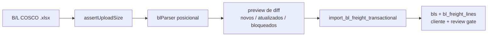

# Manifestos & EDI

> **Status:** ativo · **Atualizado:** 2026-10-08 · **Rotas:** `/bls`, `/bls/:blId`, `/containers`, `/veiculos`, `/baplie`, `/vazios-importacao`, `/embarquevazios`

## Propósito e escopo

Importações e correções de B/L, container, Baplie e CE atualizam o campo **BLs e
CEs** da Escala ao final da transação, pela migration `134`. As regras por tipo
de carga e a alteração manual com justificativa estão em
[BLs e CEs da Escala](../../CONTEXT.md#operação-marítima) e no
[módulo de Viagens](viagens.md#fluxos-e-invariantes).

A auditoria de escrita direta do status documental usa o instante da inserção imposto pelo servidor,
para que uma alteração manual posterior à automação mantenha a ordem correta.
O primeiro evento de um porto inicializa o objeto da agenda, garantindo que o
snapshot da viagem acompanhe o status registrado na auditoria.

Pipeline de ingestão e revisão operacional do Vela. O módulo recebe planilhas e EDI/EDIFACT, limita o arquivo, faz parse e preview no cliente, persiste em tabelas de domínio e expõe as superfícies de B/L, containers, veículos, Baplie e vazios. A viagem é o eixo operacional; o arquivo de B/L é a fonte documental da carga de container e alimenta Frete & Despesas do BL e o ATD do POL; o Baplie é a fonte física de staging e conciliação. Conforme a ADR 0025, a importação de Manifesto CNTR e a geração local de EDI Mercante foram removidas.

Quando o importador de CE Mercante é iniciado no contexto de uma viagem, seu
escopo fica travado nessa viagem: o preview deve identificar e bloquear linhas
referentes a B/Ls de outra viagem. Os importadores contextuais de CE Mercante,
Manifesto BB e Veículos oferecem planilhas-modelo no próprio modal.

A fronteira de upload separa o tipo pelo conteúdo antes de escolher o parser:
XLSX/XLS são binários, CSV e EDI são texto, e conteúdo desconhecido ou ambíguo
é recusado. O UTF-8 é estrito por padrão; BOM é tratado explicitamente e
Windows-1252 só é aceito quando a origem autoriza o fallback. O preview informa
formato, encoding, BOM, tamanho e uma amostra textual limitada, sem enviar o
conteúdo à telemetria. Texto só é classificado como CSV de uma coluna quando
tem cabeçalho operacional plausível; a assinatura de EDI Mercante exige os
campos posicionais de um registro real, para que marcadores como `M3` em uma
planilha não desviem o parser.

Os erros de linha dos importadores que usam o modal compartilhado são
normalizados em `ImportIssue`: o painel mostra a lista completa, permite baixar
um CSV sanitizado e nunca inclui o payload bruto. O modal também mostra o
progresso por arquivo em leituras múltiplas e permite cancelar antes da etapa de
persistência; o cancelamento descarta prévias parciais. As superfícies
customizadas de Baplie, Granito, Veículos, Datas, CE Mercante e B/Ls usam o
mesmo hook de leitura cancelável e exibem o arquivo atual, progresso e o botão
de cancelamento; uma resposta tardia não publica prévia. A leitura comum de
planilhas descarta linhas realmente vazias sem renumerar os dados e anexa o
`rowNumber` físico 1-based. Erros de linha bloqueiam a confirmação por padrão;
as superfícies que permitem decisão manual passam `allowRowErrors` explicitamente,
enquanto erros documentais ou de viagem continuam bloqueantes.

Os modais de importação seguem um percurso comum (`src/components/shared/ImportParts.tsx`):
destino (viagem, manifesto) → arquivo → leitura → prévia → confirmação → resultado.
A área de arquivo aceita clique ou arraste, informa formatos e o limite de 10 MB
do `assertUploadSize` e fica desativada, com o motivo, enquanto faltar a viagem
de destino; escolher de novo o mesmo arquivo relê o conteúdo. A leitura mostra
fases, não porcentagem: com vários arquivos a barra conta arquivos lidos. Falha
de leitura ou de gravação aparece no próprio modal, sem perder a prévia; o
rodapé diz se algo já foi gravado. A prévia resume o que entra, muda e fica de
fora, e o painel de problemas diferencia erro (impede ou exige aceite) de aviso.
Resultado parcial (troca de cliente recusada ou cálculo pendente no B/L, linhas
recusadas em datas de containers e veículos, clientes pendentes na base) fica
na tela com **Concluir**, sem oferecer reenviar o mesmo lote.

As rotas são registradas em `src/AppInterno.tsx`. Os donos executáveis são as páginas em `src/pages/`, os parsers/importadores em `src/services/`, as RPCs e policies em `supabase/migrations/` e as chaves em `src/services/queryKeys.ts`. `docs/adr/0005-pipeline-importacao-viagem-staging-reconciliacao.md` define a separação entre fontes; `docs/adr/0009-hard-delete-controlado-bloqueios-fiscais-auditoria.md` define exclusões controladas.

Para o detalhe de B/L, o checkout atual é a fonte executável. A spec e os três planos arquivados em `docs/archive/` preservam intenção e sequência histórica, mas não prevalecem sobre `src/pages/BlDetalhe.tsx`, `src/components/bl/` e `supabase/migrations_archive/130_bl_timeline_rpc.sql`.

## Anatomia das telas

### `/bls`

- O número do B/L é o link para a ficha. Cada linha tem uma ação secundária
  visível (expandir a carga) e o menu **⋮** com Copiar número e, para o
  Administrativo, Excluir; o primeiro item recebe foco, as ações podem ser
  percorridas por teclado e o menu é limitado ao viewport. A cópia só mostra
  sucesso após a confirmação da área de transferência.
- Filtros, lente de modalidade e página ficam na URL (`q`, `voyage`, `pol`,
  `pod`, `review`, `financial`, `charge`, `profile`, `cargoMode`, `page`,
  `pageSize`; `src/pages/blsListState.ts`). O link "BLs" do breadcrumb da ficha
  volta ao último recorte aberto na sessão.
- Três cards filtram a lista ao clique (Pendentes de revisão, Prontos para
  faturar, Sem faturamento); os volumes do recorte (B/Ls, CNTRs, toneladas de
  carga solta, máquinas, packages, m³, taxas pendentes e isentos) ficam numa
  faixa de resumo na barra da tabela, ao lado da lente Todos/Contêiner/Carga
  solta/Misto. Abaixo de 640 px a lista vira cartões.
- O parser de Frete & Despesas e a migration `073_purge_bogus_freight_lines.sql`
  compartilham a regra de rejeitar somente cabeçalhos/cláusulas documentais sem
  valor numérico. Descrições longas e cobranças legítimas que começam por
  palavras ou números continuam preservadas.
- `src/pages/Bls.tsx` lista B/Ls unificados (contêiner, carga solta e misto) com paginação, seleção em massa, **linha expansível** (`BlRowDetail`: contêineres com tara e descarga, resumo e itens de carga solta — sem query nova, a RPC já projeta os filhos), resumo e filtros por texto, viagem, POL, POD, revisão, financeiro, taxas locais, perfil de carga e modo de carga (`container`, `carga_solta`, `misto`). As ações do cabeçalho são **Importar** (menu com B/L de contêiner, B/L de carga solta .pdf/.docx, Manifesto de carga solta BB e CE Mercante) e **Exportar**; não há importação de Manifesto CNTR nem geração local de EDI Mercante. As antigas rotas segregadas `/manifestos` e `/carga-solta` foram unificadas nesta tela única.
- Cada linha mostra CE Mercante, navio/viagem, consignatário/cliente, rota, modo de carga, containers distintos, perfil IMO/OOG, status de taxas, invoice e link para `/bls/:blId`.
- O modal de CE Mercante aceita só planilha (o CE não entra por EDI; o EDI do sistema é o Baplie). Para B/Ls, cada importação é um manifesto: o operador informa antes o Nº de Manifesto Mercante, obrigatório, e todos os B/Ls da planilha precisam ser da mesma viagem e rota (POL → POD). A RPC `apply_ce_mercante_rows_atomic` (migration `164`) valida rota, viagem e manifesto, cria o manifesto de carga se ainda não existir, grava os CEs e vincula os B/Ls na mesma transação. Uma rota pode ter vários manifestos, importados em vezes separadas com números distintos; repetir um número já cadastrado junta os B/Ls a ele. Número já usado em outra viagem, rota ou natureza, ou B/L já vinculado a outro manifesto, recusa a planilha inteira.
- O modal **Importar Manifesto BB** (carga solta) exige a viagem de destino e o **formato numérico do arquivo**: `Detectar pelo arquivo` (padrão), `Vírgula decimal (pt-BR)` ou `Ponto decimal (en-US)`. Trocar o formato relê os arquivos já escolhidos. Em `Detectar`, o separador decimal é decidido pela evidência do próprio arquivo — célula com os dois separadores, ou com um separador seguido de um número de dígitos diferente de três — e **toda célula que restar na forma `259.312` (separador de milhar seguido de exatamente três dígitos) vira erro bloqueante**, porque ela pode valer 259 mil ou 259,312 e a diferença vira uma taxa por tonelada mil vezes maior. Declarar o formato transforma esse bloqueio em aviso de conferência, com as duas leituras na mensagem. Formato declarado que o arquivo contradiz é recusado em vez de corrigido em silêncio. Acima disso há um teto de absurdo por coluna (peso, cubagem, máquinas e volumes): o número que não descreve um B/L é recusado seja qual for o separador. O layout do armador (carrier) usa a mesma resolução — antes lia peso sem formato e cubagem em `en-US` fixo.
- O modal **Importar B/L** aceita Excel COSCO, exige a viagem declarada pelo operador, bloqueia divergência entre navio/viagem do arquivo e a viagem escolhida, mostra preview de novos/atualizados/bloqueados e confirma via RPC transacional (`import_bl_freight_transactional`). O parser aceita somente numeração ISO de container (`AAAA9999999`), ignorando cláusulas/textos do B/L que apareçam no bloco físico; o payload reaplica a mesma normalização antes da RPC. Também captura descrição, total de volumes, telefone do consignatário, DG Class e número ONU. Quando reimporta um B/L existente, o preview preserva `IMO/OOG`, classe IMO e número ONU dos containers cujo número já existia, para o B/L não apagar atributos físicos vindos de Baplie ou de dados históricos. O preview vincula cliente por documento ou nome do consignatário; a RPC grava o estado de reconciliação, aplica o review gate e mantém match por nome em validação manual. Com a viagem declarada, a confirmação passa por `import_bl_freight_with_metadata` (migration `072`), que calcula as taxas locais provisórias de cada B/L na mesma chamada; falha de cálculo fica em `audit_logs` e na fila de efeitos como recuperação. Emissão exige CE Mercante e os gates server-side. Mudanças com impacto em faturamento (quantidade de containers, container compartilhado, IMO/OOG, lista de veículos por chassi, peso de carga solta, CNPJ faturado, POL/POD, viagem e modo de carga) são informadas e só são aplicadas com override do operador, auditado; sem override, os demais campos são aplicados e o B/L não é descartado. O diff cobre todos os campos que a RPC grava — inclusive os blocos completos de partes, `notify_cnpj_cpf`, e-mail do consignatário, veículos, viagem e modo de carga — e cada linha é rotulada na língua da operação. Quando o arquivo traz **outro consignatário**, o preview alerta a troca de cliente (de quem para quem, com CNPJ) e lista as faturas que a acompanham; com o aceite do operador, `relink_bl_customer` move o B/L, as faturas abertas de taxa local, o recebível do ledger e a demurrage viva para o novo cliente, **sem alterar valores**. Fatura consolidada com outros B/Ls, fatura com pagamento registrado, recebível do razão já baixado ou consignatário ainda não cadastrado (com qualquer cobrança viva, inclusive só recebível) impedem a troca automática — o motivo aparece no preview e os demais campos seguem sendo aplicados. A linha bloqueada (arquivo de outra viagem ou de outro B/L) não anuncia troca de consignatário, porque não importa nada; e quando o servidor recusa uma troca aceita no preview, a recusa (`customer_relinks`) é mostrada ao operador em vez de "importação concluída" (migration `360`). O CE Mercante não faz parte do payload do import e permanece como está. O **NCM** é campo próprio do B/L (`bls.ncm_codes`, ADR 0057): a importação grava o que o documento declara e preserva o cadastro manual quando o documento não declara nenhum, porque a descrição de container vem de uma célula só e a de carga solta descarta as linhas `NCM NUMBER`. A ação em lote fica na lista; a mesma entrada existe como ação rápida da viagem e como atalho filtrado na ficha do B/L.
- O importador de **Manifesto BB** aceita layout resumido (sem coluna CE desde a migration `173`), legado e formatos de carrier; faz preview, confere os B/Ls já gravados (outra Viagem bloqueia; troca de Cliente e rota de B/L faturado pedem aceite), suporta B/L de carga solta ou transiciona B/L existente com contêineres para `misto`, e registra erros no batch. Os modais de planilha mostram o formato/encoding detectados antes da prévia do domínio, exibem o relatório completo de erros aplicáveis e permitem exportá-lo sem `raw`.
- A confirmação do Manifesto BB pode aceitar explicitamente os erros de linha aplicáveis por `allowRowErrors`; isso não libera B/L incompatível com a viagem, documento inválido ou qualquer erro central da transação.
- **Sequência para carga solta:** importe primeiro os B/Ls pelo Manifesto BB
  ou pelo B/L avulso. Depois, use **Importar CE Mercante** para os CEs e informe
  o **Nº de Manifesto Mercante** oficial no mesmo modal. Os B/Ls precisam
  existir antes da importação separada de CE. A planilha BB não grava CE
  (ADR 0078, item 1): uma coluna CE num arquivo antigo é ignorada com aviso na
  prévia. O número do manifesto é distinto do CE de cada B/L e não é extraído
  do nome do arquivo.
  Reimportar um B/L atualiza o cadastro e seu lote; os totais históricos do lote
  anterior não representam B/Ls adicionais na aba **Rotas e Manifestos**.
- O modal **Importar B/Ls (PDF/DOCX)** recebe o conhecimento avulso do armador — um arquivo por B/L, vários de uma vez. Exige a viagem declarada pelo operador e bloqueia o arquivo cujo navio/viagem divirja da viagem escolhida, no mesmo contrato da importação documental de B/L de container. O preview mostra partes, rota, volumes, peso, cubagem, marcas, NCM, frete e ressalvas do navio, além dos avisos de leitura.
- Para listagens e reconciliação por nome, o consignatário curto termina na natureza jurídica (`LTDA`, `S.A.`, `EIRELI`, `EI`, `MEI`, `SLU`, `EPP`, `ME`, incluindo combinações); sem marcador reconhecido, usa a primeira linha não vazia. O bloco completo permanece intacto como dado documental e para auditoria.
- Pela ADR 0025, `Laden on Board` persiste o ATD do POL. Entre B/Ls da mesma Viagem e POL prevalece automaticamente a data mais antiga. ETD e ATD permanecem distintos; telas sem coluna própria mostram ATD em verde na célula de ETD.
- Admin pode excluir B/Ls elegíveis, individualmente ou em lote, após pré-checagem fiscal.
- O Nº de Manifesto Mercante é gerenciado na tabela `manifestos_mercante`, associado a rotas e viagens, com suporte a múltiplos manifestos por escala e indicação de vazios (`is_empty`). A edição é realizada na aba de Manifestos de `/viagens/:voyageId`.

### Atualização após ações próprias

- Os efeitos financeiros reutilizam `INVOICE_BASIS_CACHE_KEYS`: alterações de
  carga, viagem, Baplie e cancelamento de B/L atualizam também restituições,
  ajustes de COD, histórico de conciliação e consultas de faturas do Portal.
  Essa lista preserva os consumidores das correções de faturamento da PR 839.
- Importar B/L container, B/L carga solta, Manifesto BB ou CE Mercante atualiza
  listas e cards de B/Ls, Containers, Veículos e Viagens, além da ficha da Viagem,
  conciliação do Baplie, filtros por porto/tipo, Revisão, Taxas Locais, ADR,
  Relatórios e fichas consumidoras. Importação rápida da Viagem usa o mesmo
  efeito de cache que o modal da lista.
- Exclusões de B/Ls, Containers e Veículos atualizam também os totalizadores e
  vínculos dependentes, incluindo veículos removidos junto com um Container.
  Edição manual e vínculo/desvínculo de Cliente atualizam as projeções do B/L.
- Importar/reimportar Baplie atualiza os cards mesmo sem alteração de flags
  físicas. As duas entradas de importação usam `afterBaplieImportado`; o upload
  da página aguarda a aplicação física e a atualização da viagem **escolhida no
  modal**, que pode diferir da viagem aberta. Cadastro/substituição de vazios
  atualiza as famílias reais de Vazios IMP e Rotas e Manifestos.
- Salvar Local de desova atualiza também seus cards em Veículos; o campo deixa
  de guardar uma cópia do valor salvo após a atualização. Datas de descarga e
  devolução (planilha, ficha do B/L ou Demurrage) atualizam os consumidores de
  Demurrage, incluindo cards, faturas e ficha do Cliente. O campo de devolução
  também libera o rascunho salvo para acompanhar importações seguintes. Desova
  e devolução confirmadas são refletidas no cache antes da releitura: se ela
  falhar, o campo mantém o valor salvo. A conclusão de uma gravação não apaga
  um rascunho mais recente editado durante a operação.
- A atualização ocorre após as próprias ações, sem recarregar a página.
  Consultas abertas são refeitas; telas fechadas consultam novamente ao abrir.
  Isso não implementa sincronização entre usuários nem antecipa efeitos ainda
  pendentes no worker de importação.
- **Teste:** `operationalCacheRefresh.test.ts` usa QueryClient/QueryObserver reais
  e fontes locais alteradas para verificar listas/cards abertos e reabertura.
  `Baplie.cacheRefresh.test.tsx` exercita o upload com outra viagem no seletor;
  `EquipmentPermissionGates.test.tsx` verifica desova salva seguida de novo dado.
  `Containers.cacheRefresh.test.tsx` exclui uma linha pela tela real e verifica
  o card de Containers e os resumos consumidores de B/Ls e Viagens sem remontar.
  Esses testes usam serviços simulados, sem provar execução de RPC/RLS no Supabase.

### `/bls/:blId`

- `src/pages/BlDetalhe.tsx` resolve o modo container/BB e monta as abas `visao-geral`, `carga`, `detalhes`, `faturamento` e `historico`.
- A aba padrão `visao-geral` remove `tab` da query; `carga`, `detalhes`, `faturamento` e `historico` sincronizam suas respectivas chaves. Chaves antigas, como `operacional`, não são aceitas.
- **Cabeçalho e situação:** o título é o número do B/L (com tipo e modalidade acima e Navio/Viagem, trecho, CE e Cliente abaixo); ações **Reimportar B/L** (contêiner) e **Mais ações** (Copiar número; Cancelar ou Reativar B/L para o Administrativo). B/L cancelado mostra data e motivo numa faixa própria. A seção Situação usa o `StepRail` comum para os trilhos Operacional e Documental e uma linha de próxima ação com o destino escrito no link (por exemplo "Resolver na Revisão"). B/L inexistente mostra "não encontrado" (`maybeSingle`), distinto de falha de consulta com Tentar novamente.
- **Visão geral:** uma superfície com seções Embarque (navio/viagem, trecho e terminal de descarga com a exceção aberta só sob demanda), Documento Mercante (CE Mercante do B/L e número do Manifesto Mercante vinculado), Carga (números por modalidade e situação do Baplie) e Cliente/Portal. Datas de POL/POD e situação de taxas/fatura ficam só no trilho. Quando há omissão, um bloco de Transbordo ou COD explica o porto omitido, onde a carga descarregou, os dados do seguimento e o efeito de Marcar COD (Taxa Local no novo destino, Ajuste de COD se já faturado, saída do Manifesto Mercante do porto omitido, CE inalterado).
  - **Cliente:** um único fluxo. Sem cliente, mostra o cliente declarado no manifesto com **Vincular** (usa o cadastro existente pelo CNPJ e só cadastra quando não existe, exigindo e-mail no manifesto) e a busca no cadastro, com **Vincular** por resultado. Com cliente, mostra nome (link para a ficha), CNPJ, saldo pendente e conciliação, com **Trocar** e **Desvincular**; avisa quando o manifesto declara outro CNPJ. Todo vínculo pede confirmação e grava por `save_bl_review`.
- A leitura interna do card de Portal usa `get_bl_portal_status` (migration 206), RPC `SECURITY DEFINER` que valida `is_active_user()` e faz a leitura mínima necessária por B/L, pois `portal_notifications` e `customer_portal_accounts` permanecem protegidas por RLS.
- **Carga:** `BlCargaTab` em aba própria (`?tab=carga`), governada pelos predicados `isContainerCargoMode`/`isBreakbulkCargoMode` — um B/L misto mostra as duas seções. Contêineres vinculados (com tara e data de descarga), resumo da carga solta, itens da carga solta e veículos vinculados. Era uma seção no fim da aba Detalhes, abaixo do formulário de edição.
- **Detalhes do B/L:** `BlDetalhesTab` compõe `BlOperacionalTab` (seções Partes, Rota, Documento, Carga e Notas, até três colunas; Notify 2 e telefone do consignatário como dado do documento; justificativa e salvar numa barra que fica fixa enquanto há alteração) e a seção de frete.
  - Formulário auditado: POL, POD, CE Mercante, shipper, consignee, `notify_party`, descrição, pagamento, notas e justificativa. Peso e cubagem aparecem por modalidade e são independentes: `Peso contêiner (kg)`/`CBM contêiner (m³)` só com contêiner, `Peso (t)`/`CBM carga solta (m³)` só com carga solta — num B/L misto os dois conjuntos aparecem e nenhum sobrescreve o outro.
  - NCM é editável em `bls.ncm_codes`; a extração de `cargo_description` é sugestão auxiliar, deduplicada e sem ocorrências `UN NCM`.
- `notify_party` importado do B/L continua editável; B/Ls históricos preservam o valor já gravado.
  - O import também persiste, de forma forward-only, `place_of_receipt`, `movement_from`, `movement_to` e `issue_place`; registros históricos sem reimport permanecem nulos.
  - Atalho "Reimportar B/L" abre o modal compartilhado filtrado para o B/L da ficha, evitando aplicar arquivo de outro conhecimento.
- **Faturamento:** `BlFaturamentoTab` compõe `BlCobrancasSection` (status, fatura ativa com número, situação, tipo, total e **Abrir no Faturamento**, faixa de totais, motivo visível quando a emissão está bloqueada, tabela de taxas com erro distinto de vazio e cobrança manual sob demanda) e `BlDemurrageSection` (só quando o B/L tem container: faturas de Demurrage do B/L, condições próprias e devolução por container com a Demurrage prevista, e **Abrir em Demurrage**). O vínculo de cliente fica na seção Cliente e Portal da Visão geral.
  - Vincular o cliente produz o efeito completo da conciliação (ADR 0061, migration `370`): além de fechar a fila,
    o e-mail do manifesto é capturado como contato **financeiro** do cliente — normalizado e sem duplicar contato
    já cadastrado — e `approved_by` registra o revisor que resolveu. É a mesma regra usada pelo Aprovar da
    Validação, agora em função única (`capture_manifest_financial_contact`).
  - Taxas locais podem ser calculadas, receber linhas manuais, ser revisadas e avançar para faturamento.
  - Demurrage reúne free time, P1/P2, descarga/devolução e cálculo por container; as regras canônicas continuam em [Demurrage](demurrage.md).
- **Cliente e Portal:** uma seção da Visão geral reúne identidade, conciliação, visibilidade, notificações e disputas. Para B/L pendente de revisão, reutiliza `ReviewCustomerOnboarding` e `complete_review_customer_group`, com razão social, CNPJ e e-mail editáveis e convite opcional para o mesmo e-mail. A operação afeta somente o B/L aberto; tenta faturamento automático apenas quando a correção o libera. Falha no convite preserva o cadastro e permite nova tentativa. B/Ls já revisados mantêm o vínculo/troca/desvínculo auditado, e cliente existente pode receber convite sem refazer o vínculo.
- Os painéis técnicos de efeitos pós-importação não aparecem na ficha: o processamento continua no servidor, e a tela mantém o resultado operacional/documental, taxas e conciliação do Baplie.
- **Histórico:** `BlHistoricoTab` usa paginação incremental de `bl_timeline`, intercala eventos e comunicados por data, mostra a família e "auditado" como texto de apoio (só o estado do comunicado é tag) e distingue carregando e falha de "nenhum evento". O que a importação grava na transação que cria o B/L não aparece como alteração; no lugar entra o evento “B/L criado” (migration `122`).

### `/containers`

- `src/pages/Containers.tsx` lista containers consolidados com filtros, resumo distinto por tipo/IMO/OOG (faixa de resumo na barra da tabela; erro de consulta aparece como "—", não zero), exportação e navegação ao B/L e à Viagem. Filtros e página ficam na URL (`src/pages/containersListState.ts`: `q`, `voyage`, `pol`, `pod`, `review`, `financial`, `charge`, `profile`, `type`, `vehicle_container`, `page`, `pageSize`; `search` continua aceito). Um endereço que a tela não escreveu (menu lateral ou outro link para `/containers` com a página aberta) substitui os filtros. A linha mostra lacre, descarga e devolução (SOC aparece como "Não se aplica"), e a origem do SOC/COC que vale (pelo B/L, pelo Baplie ou correção manual, de `bl_containers.ownership_source`). Abaixo de 640 px a lista vira cartões.
- A ação aprovada se chama **Importar Datas de Descarga e Devolução**, tanto no botão quanto no título do modal. A descarga é obrigatória e a devolução é opcional; a operação pode emitir invoice de demurrage quando todos os containers do B/L retornaram.
- Não existe importador independente de IMO/OOG. O Baplie EDI é a fonte física única desses atributos; a resolução operacional de divergências do Baplie permanece disponível.
- Admin pode excluir containers sem cálculos de taxa nem itens de demurrage vinculados; veículos dependentes são removidos primeiro.

### `/veiculos`

- `src/pages/Veiculos.tsx` exige viagem para visualizar lista, estatísticas e filtros; a viagem fica em `?voyage=` e a faixa de viagens usa o mesmo resumo de Viagens do Baplie. O modal de importação possui seletor próprio de viagem e, nesta página, linha com erro bloqueia o lote (a ação rápida da Viagem permite aceitar as divergências e gravar só as linhas válidas).
- A lista agrupa os veículos pelo container: o **Local de desova** é atributo do container (CONTEXT.md) e é editado uma vez, no cabeçalho do grupo, gravando ao sair do campo ou com Enter (Escape desfaz o rascunho); "Salvando…", "Salvo" ou a falha aparecem junto do campo. Quem edita veículos também seleciona linhas para definir o local em lote; excluir continua só para o Administrativo. O filtro "Sem local informado" lista os containers ainda sem local, e o resumo "veículos sem local de desova" conta os veículos desses containers (veículo sem container não entra: não há local a informar).
- O parser suporta modelo do sistema, COSCO Daily Report e cabeçalhos chineses.
- A convenção numérica é escolhida pelos cabeçalhos da origem (pt-BR no modelo
  interno; en-US nos relatórios COSCO/terminais), sem aceitar expoente ou texto
  anexado como peso/cubagem. Container e tipo são canonizados em maiúsculas e
  um ISO inválido mantém-se apenas na prévia de erro, sem confirmação.
- O import valida chassi, B/L da viagem e match não ambíguo de container por número, tipo e lacre.
- A prévia exibe o relatório completo de erros de linha e permite exportá-lo sem
  arquivo bruto; no modal compartilhado, leituras múltiplas exibem progresso e
  podem ser canceladas antes da importação.
- O modal customizado também exibe o arquivo atual/progresso e permite cancelar
  a leitura antes de inserir veículos.
- Após inserir veículos, a isenção e o cancelamento de invoices ainda são
  efeitos pós-commit enfileirados na mesma transação pelo RPC. O consumidor
  server-only cancela invoices elegíveis e recalcula taxas por B/L; o worker
  continua pausado até prova de Preview e rollout autorizado.
- Admin pode excluir veículos individualmente ou em lote.

### `/baplie`

- `src/pages/Baplie.tsx` sincroniza a viagem em `?voyage=<id>` e trabalha em três estados: sem staging; staging sem manifesto; staging com manifesto.
- A seção **Conciliação Baplie × B/L** diz a situação em texto e ícone (viagem sem B/L, aguardando B/L das rotas, conferindo, falha com Tentar novamente, divergências ou "Baplie e B/Ls conferem"), a cobertura documental ("Cheios com B/L: N de M", em que M exclui os cheios de rotas ainda sem B/L) e, para cada grupo de divergência, o significado e o que fazer. Cada container da lista recebe a situação na conciliação (Com B/L, Sem B/L, SOC/COC diverge, fora da conciliação), também filtrável. A tradução fica em `src/pages/bapliePresentation.ts`; a regra continua em `baplieReconciliation.ts`.
- Se o Baplie é gravado mas a aplicação de IMO/OOG aos B/Ls falha, o modal fica aberto com o aviso, tanto em `/baplie` quanto na ação rápida "Baplie EDI" da Viagem. A falha não é gravada: `/baplie` recalcula a pendência a cada leitura (`countPendingBapliePhysicalFlags`, mesma regra de `apply_baplie_physical_flags_atomic`: só `full`, número com `trim` + maiúsculas, IMO/OOG por OU, maior classe/ONU, casamento com exatamente um container de B/L e SOC/COC só quando a origem não é o B/L nem correção manual) e, enquanto houver pendência, mostra "IMO/OOG do Baplie ainda não aplicados a N containers de B/L" com **Aplicar IMO/OOG agora**. Só sem pendência a nota afirma que os dados estão aplicados. Importar o mesmo arquivo (aceito direto, sem diferença) também refaz a aplicação. Se o que falha é o recadastro dos vazios, o Baplie também fica gravado (`vaziosError`), mas importar o mesmo arquivo não refaz os vazios (sem diferença, eles não são tocados): o aviso oferece **Recadastrar vazios** (`retryBaplieVazios`), que refaz só essa parte.
- Importação/reimportação substitui o staging completo da viagem por `import_baplie_staging_transactional`; o parser valida que o conteúdo é EDI, respeita `UNA`/separadores/release character, isola segmentos por EQD, identifica o encoding escolhido e deduplica containers repetidos por numeração ISO antes de persistir.
- A conciliação considera containers `full` e aponta apenas divergência de **existência** (container no Baplie e em nenhum B/L, ou em B/L e ausente do Baplie). O Baplie é soberano sobre `is_imo`, `imo_class`, `un_number` e `is_oog`: essas flags físicas são aplicadas automaticamente aos `bl_containers` da viagem ao final de toda importação/reimportação, sem decisão do operador — não há mais uma divergência de atributo para resolver manualmente nem um "manter valor do manifesto" (decisão confirmada com o usuário em 2026-09-19; ver `src/services/baplieReconciliation.ts#applyBapliePhysicalFlags`). Quem aplica é `reimportBaplie` (`src/services/baplieImport.ts`), logo depois de gravar o staging e antes de recadastrar vazios, de modo que `/baplie` e a ação rápida da Viagem têm o mesmo efeito; a falha volta em `flagsError` e não desfaz o staging (até 2026-10-08 só a página aplicava, e a ação rápida deixava perfil e taxas dos B/Ls desatualizados). Vale em qualquer ordem: desde a migration `118`, importar B/L de frete numa viagem que já tem Baplie aplica as flags na mesma transação, antes do cálculo inicial das taxas locais (`import_bl_freight_with_metadata`), sem depender do `import-effects-runner`. Desde a migration `150`, essa aplicação na importação de B/L se limita aos containers do próprio lote (varrer a viagem inteira custava ~3 s por lote numa viagem de ~500 B/Ls); a varredura completa continua na importação do Baplie. `apply_baplie_physical_flags_atomic` também recalcula as taxas locais dos B/Ls cujos containers mudaram de perfil (B/L faturado recebe a flag, mas não é recalculado; falha de cálculo vira auditoria `local_charges_auto_calc_error` e efeito `provisional_charges`).
- **SOC/COC** (migration `121`): o Baplie traz a propriedade no EQD, elemento 4 (8077: `1` = SOC, `2` = COC), gravada em `baplie_containers.ownership` e exibida na coluna SOC/COC da tela. Aqui a regra inverte: o **B/L é soberano**. O import de B/L grava o valor declarado com `ownership_source = 'bl'`; `apply_baplie_physical_flags_atomic` só preenche containers sem valor ou já vindos do Baplie (`ownership_source` nulo ou `baplie`) e nunca sobrescreve `bl` nem `manual`. Quando o B/L e o Baplie informam valores diferentes, a conciliação aponta `ownership_mismatch` (seção "SOC/COC divergente entre B/L e Baplie") e a aba Carga do B/L mostra "Baplie diz …" ao lado do container; o valor do B/L continua valendo para taxas e Demurrage.
- O upload customizado mostra o progresso do parse e permite cancelar; o
  staging parcial nunca é publicado depois do cancelamento.
- Containers `empty` podem gerar um manifesto de Vazios de Importação; se já existir um manifesto Baplie, o operador escolhe substituir ou manter. Vazios vindos do Baplie **não pedem** o Nº do manifesto Mercante na importação, mas o número continua obrigatório: a rota aparece como "Informar" na aba Rotas e Manifestos e entra no alerta **CE Mercante pendente** (migration `119`) até ser preenchida (decisão de 2026-10-01).
- **Reimportar um Baplie** (`reimportBaplie` em `src/services/baplieImport.ts`, usado por `/baplie` e pela ação rápida da Viagem) compara o arquivo novo com o Baplie atual por container (status cheio/vazio, POL, POD, tipo, IMO, OOG; slot, peso e B/L ref. não contam). Sem diferença, aceita sem perguntar e mantém os vazios e o Nº do manifesto Mercante. Com diferença, o diálogo "Substituir o Baplie da viagem" lista cada container incluído, removido ou alterado; ao confirmar, se os vazios mudaram e a viagem já tinha manifesto de vazios do Baplie, os vazios são recadastrados na hora; se esse recadastro falhar, o Baplie continua gravado e a falha volta em `vaziosError`. O Nº do manifesto Mercante de vazios (`manifestos_mercante`) nunca é apagado pela reimportação (decisão de 2026-10-01).

### `/vazios-importacao`

- `src/pages/VaziosImportacao.tsx` lista e exporta containers vazios por texto, viagem e manifesto.
- O modal importa planilha para uma viagem e exige um **Nº do manifesto Mercante
  para cada porto de origem** dos vazios (decisão de 2026-10-01). Colunas
  obrigatórias: **Container**, **POL** e **POD**; opcionais: **Tipo** e **Tara (kg)**.
  O modelo está em `public/templates/vazios-importacao-modelo.xlsx` (e `.csv`),
  com link no modal. Depois de ler a planilha, o preview mostra um campo de número
  por rota POL → POD encontrada; a importação só libera com todos preenchidos e sem
  o mesmo número em dois portos. Cada número vira um registro de
  `manifestos_mercante` com `natureza='vazio'` e é o que a aba Rotas e Manifestos
  exibe na linha VAZIOS da rota (a linha de carga da mesma rota continua com o
  manifesto `natureza='carga'`). A regra é um número por rota: um mesmo POL com
  dois POD pede dois números (confirmado em 2026-10-01).
- **Reimportar por planilha** é permitido e soma os containers como um novo
  manifesto de vazios; só bloqueia quando algum número informado já está
  cadastrado (decisão de 2026-10-01).
- O parser canoniza container/tipo e POL/POD, valida tara não negativa e aceita
  somente portos reconhecidos pelo catálogo operacional; uma linha inválida
  bloqueia a confirmação antes da RPC por padrão. O override explícito de
  `allowRowErrors` importa as linhas válidas, mantém os erros no resultado e
  nunca grava o texto cru de um porto não reconhecido. A prévia exibe e exporta
  a lista completa de erros sem `raw`; a leitura mostra progresso e pode ser
  cancelada antes da persistência.
- O fluxo alternativo vindo de Baplie é iniciado em `/baplie`, não por botão desta página.

### `/embarquevazios`

- `src/pages/EmbarqueVazios.tsx` reúne um Embarque por escala, com Unidades Embarcadas e Linhas de Serviço.
- A planilha aceita as sete colunas operacionais; container repetido, local/condição inválidos ou datas incompatíveis recusam o lote inteiro antes da substituição. Container e tipo são canonizados em maiúsculas, e os contratos ISO/data são validados antes da RPC. Inclusão manual cria manifesto e unidade na mesma RPC; regras de local e datas devolvem mensagem de validação segura para a tela.
- `/vazios` é apenas redirect de compatibilidade para esta rota.

### Contato do manifesto na importação

O e-mail do consignatário que vem no documento do B/L é capturado como contato
**financeiro** do cliente na própria importação, pela mesma função única que a
Revisão e o Aprovar da Validação usam (`capture_manifest_financial_contact`,
migration `370`). A captura acontece em `apply_bl_review_gate_after_import`
(migration `371`), que é o pós-processamento comum aos dois caminhos de
importação vivos — o de documento do B/L e o de carga solta.

Ela roda **antes** do laço de pendências, e não dentro dele: o laço faz
`CONTINUE` para B/L sem pendência, que é exatamente o caso do vínculo
automático por CNPJ (`matched_document`). Esse B/L nunca chega à Revisão, então
a importação é a única oportunidade de registrar o contato. Depois que o CE
Mercante é vinculado, o comunicado financeiro consulta a prontidão de todos os
B/Ls ativos do cliente na viagem; quando o conjunto está completo, o resumo de
CE e Taxas Locais é disparado em background pelo canal
`send-customer-communication`, sujeito à chave global e às supressões.

Duas notas de estado:

- **Carga solta não tem e-mail para capturar.** O layout de planilha aceito
  pelo parser de breakbulk não possui coluna de e-mail; `manifest_customer_email`
  vai nulo porque não há valor na origem, não por descarte. Se o layout ganhar a
  coluna, a captura passa a valer sem mudança no banco.
- **`import_manifest_with_postprocess_transactional` está sem chamador.** Era
  ela quem capturava o contato (via `p_contact_emails`) antes de a importação
  migrar para o caminho do documento do B/L; segue no banco, sem consumidor no
  aplicativo. A regressão que isso causou é o que a `371` corrige.

## Catálogo de ações

| Tela / ação | Pré-condições | Origem | Orquestração | Persistência | Efeitos e cache | Falhas | Evidência |
|---|---|---|---|---|---|---|---|
| `/bls` — filtrar, paginar, selecionar e abrir B/L | Sessão interna; dados legíveis por RLS | `Bls` | `useBls`, `useBlSummary`, `useInvoiceLinks`; seleção local por `useRowSelection` | Leitura de `bls`, relações e invoices | Queries `['bls', filters]`, `['bl-summary', filters]`, `['invoice-links', ...]`; navega para `/bls/:blId` | Filtros de `chargeStatus`/perfil podem carregar tudo e filtrar no cliente; erro de query mostra `InlineError`; `?page=` além do total troca para a última página existente (`replace`) | `src/pages/Bls.tsx`; `src/hooks/useBls.ts`; `src/hooks/useBilling.ts` |
| `/bls` — importar B/L | Usuário interno ativo; arquivo COSCO `.xlsx/.xls`; viagem declarada pelo operador; B/L existente ou novo na viagem escolhida | `BlImportModal` | `parseBLFile` lê células posicionais, aceita apenas containers ISO, captura campos documentais e DG, `previewBlFreightImport` preserva atributos IMO/OOG existentes por container e calcula diff/gate contra a viagem selecionada, `confirmBlFreightImport` chama `import_bl_freight_with_metadata` (lote com viagem, com cálculo provisório das taxas; migration `072`) ou `import_bl_freight_transactional` (sem viagem), em chamadas de até 20 B/Ls e 300 contêineres para caber no limite de 8 s (`57014`); a busca por contêiner normalizado usa o índice da migration `163` | `bls.bl_emission_date`, `cargo_description`, `total_packages`, `packages_unit`, `consignee_phone`, `bl_freight_lines`, `bl_containers`/`vehicles` quando liberados, `bls.customer_id`/reconciliação, `audit_logs`; `164_guard_iso_container_numbers.sql` limpa livres inválidos e bloqueia novos inválidos | Invalida a lista centralizada de `afterManifestoImportado`: `bls`, `bl-summary`, `bl-detail`, `containers`, `vehicles`, `vehicle-stats`, `voyage-vehicle-stats`, `invoices`, `invoice-links`, `customers`, `voyages`, portos, vazios, Baplie, schedules, timeline e Line Up; review gate/fila são reaplicados no lote | CNPJ divergente, navio/viagem do arquivo diferente da viagem selecionada, match por nome pendente ou peso/containers bloqueados por cálculo/invoice deixam a linha em validação; texto contratual ou outra string fora de `AAAA9999999` não vira container; reimport do mesmo container não zera IMO/OOG; itens bloqueados não são enviados à RPC; se uma chamada falhar no meio, as anteriores ficam gravadas e reimportar conclui o restante | `src/components/shared/BlImportModal.tsx`; `src/services/blParser.ts`; `src/services/blFreightImport.ts`; `src/services/cacheEffects.ts`; `supabase/migrations_archive/162_bl_freight_lines.sql`, `supabase/migrations_archive/163_bl_import_customer_review_gate.sql`, `supabase/migrations_archive/164_guard_iso_container_numbers.sql`, `supabase/migrations_archive/171_bl_import_edi_fields.sql`, `supabase/migrations/163_bl_containers_indice_numero_normalizado.sql`; testes `blParser.test.ts`, `blFreightImport.test.ts`, `containerNumberGuardMigration.test.ts`, `blImportCustomerReviewGateMigration.test.ts`, `BlImportModal.test.tsx`, `cacheEffects.test.ts` |
| Manifesto Mercante — criar/vincular/excluir | Viagem e rota; número; exclusão admin | `VoyageManifestosTab` em `/viagens/:voyageId` | `useManifestosMercante` → `manifestosMercanteService.ts` | `manifestos_mercante`; vínculo em `bls.manifesto_mercante_id`; auditoria por trigger | Criação/exclusão invalidam manifestos da viagem e viagens; vínculo invalida B/Ls | Número duplicado, campos ausentes e RLS; erros propagados | **Código:** serviço/hook; **Teste de contrato SQL:** `pr698AuditRemediationsMigration.test.ts` |
| CE Mercante por planilha | Planilha válida, sem erro de estrutura na prévia; todos os B/Ls existentes; para B/L, Nº de Manifesto Mercante informado e todos os B/Ls da mesma viagem e rota | `CeMercanteImportModal.handleSheetImport` | Parser valida cabeçalhos, BL único e CE de 15 dígitos; erro de estrutura bloqueia a confirmação; `importCeMercanteRows` pré-valida existência (e, em Granito, resolve o número do B/L) e envia o lote inteiro a `apply_ce_mercante_rows_atomic` (migrations `082` e `164`), que valida rota/viagem/manifesto antes de gravar e chama `apply_ce_mercante_update` ou `apply_granite_ce_mercante_update` por linha dentro da mesma transação; o trigger server-side calcula e emite quando o B/L está elegível | `bls.ce_mercante` ou `granite_bls.ce_mercante`, `manifestos_mercante` e `bls.manifesto_mercante_id`, auditoria, `charge_calculations`, invoice/recebível e efeito `local_billing` quando necessário | Invalida `afterCargaAlterada` e `manifestosMercante` | "Tudo ou nada": sem número, rota mista, número de outra viagem/rota/natureza ou B/L já em outro manifesto recusam a planilha; qualquer B/L inexistente ou erro de linha no banco devolve `ok=false` com os erros de todas as linhas e nada é gravado, inclusive cálculo, fatura e Alertas disparados; com ator válido, o bloqueio operacional fica reprocessável; a emissão repetida é idempotente | `src/components/shared/CeMercanteImportModal.tsx`; `src/services/ceMercanteImport.ts`; `supabase/migrations/082_ce_mercante_planilha_tudo_ou_nada.sql`; `supabase/migrations/164_ce_mercante_planilha_com_manifesto.sql`; `supabase/migrations/051_ce_mercante_auto_billing.sql`; teste `alinhamentoPermissoes.local-pg.test.ts` |
| Excluir B/L elegível | Administrativo; o banco recusa B/L com qualquer vínculo que impeça a exclusão (fatura, recebível, Demurrage, ajuste de COD, comunicado etc.) | `runBlDelete` | `checkBlDependencies` pede a prévia ao banco; confirmação; `deleteBls` | RPC `delete_records('bl', …)` (migration `087`): veículos e B/L saem na mesma sub-transação, ou o B/L volta inteiro com o motivo; cascatas operacionais; linha `deleted` em `audit_logs` | Invalida `['bls']`, `['bl-summary']`, `['containers']`, `['vehicles']`, `['invoice-links']`, `['voyages']` | Bloqueadores fiscais geram exclusão parcial ou nenhuma; quando nenhum B/L pode sair, o aviso na lista nomeia cada B/L e o motivo, sem abrir a confirmação; operação irreversível | `src/pages/Bls.tsx`; `src/services/bls.ts`; `docs/adr/0009-hard-delete-controlado-bloqueios-fiscais-auditoria.md` |
| Cancelar B/L / Reativar B/L | Administrativo; B/L com CE Mercante; cancelar é recusado com fatura, recebível ou fatura de Demurrage em aberto; motivo obrigatório | Botões na ficha do B/L (`BlDetalhe`) | `cancelBl` (prévia e execução) e `reactivateBl` → RPCs `cancel_bl`/`reactivate_bl` (migration `089`) | `bls.cancelled_at`, `cancelled_by`, `cancel_reason`; `audit_logs` `cancelled`. B/L cancelado fica somente leitura e não entra em fatura (triggers em `bls`, `invoices`, `invoice_bls`) | `afterBlEstadoAlterado` | Recusa mostra o bloqueio; editar B/L cancelado é recusado | `src/pages/BlDetalhe.tsx`; `src/services/blState.ts`; `src/integration/blCancel.local-pg.test.ts` |
| B/L — sincronizar aba com URL | B/L válido | `BL_TABS` / `setSearchParams` | `visao-geral` remove `tab`; demais definem query | Nenhuma | Preserva componentes montados por prop `active` | Query desconhecida cai em `visao-geral` | `src/pages/BlDetalhe.tsx`; `src/pages/__tests__/blTabs.test.tsx` |
| B/L — editar revisão operacional e carga | Mudança detectada; justificativa; usuário; `updated_at` esperado | `BlOperacionalTab` / `useBlEditForm` | Normaliza campos, cria auditoria por campo e chama `save_bl_review`; mantém pesos e cubagens separados por modalidade | `bls`, `audit_logs`, fila de reconciliação; status recalculado pelo gate | Invalida `['bl-detail', blId]`, `['audit-logs','bl',blId]`, `['bls']`, `['voyages']` | Sem mudança/justificativa; número inválido; `PT409`/`40001` recarrega após conflito | `src/hooks/useBlEditForm.ts`; `supabase/migrations_archive/129_review_gate_hardening.sql` |
| B/L — importar B/L na ficha | B/L aberto; arquivo COSCO do mesmo B/L; viagem declarada | `BlDetalhe` → `BlImportModal` | Modal chama o mesmo parser/preview/importador com `onlyBlId` e viagem selecionada | `bls.bl_emission_date`, `bl_freight_lines`, vínculo/reconciliação de cliente e auditoria; dados físicos só se não houver bloqueio financeiro | Invalida `['bl-detail']`, `['bls']`, `['voyages']`; review gate/fila são reaplicados para o B/L | Arquivo de outro B/L ou de outra viagem é bloqueado no preview; bloqueios financeiros e match por nome aparecem linha a linha | `src/pages/BlDetalhe.tsx`; `src/components/shared/BlImportModal.tsx`; `src/services/blFreightImport.ts` |
| B/L — exibir NCM e Notify Party | Descrição/notify importados ou editados | `BlOperacionalTab` | `useBlEditForm` persiste NCM editado; `listBlNcms` sugere códigos da descrição; import persiste notify | `bls.ncm_codes` e `bls.notify_party` | Sem query própria | NCM ausente mostra vazio; dados históricos não recebem backfill | `src/lib/ncm.ts`; `src/services/blFreightImport.ts`; `src/hooks/useBlEditForm.ts` |
| B/L — vincular, criar ou desvincular cliente | Usuário; B/L carregado; dados de manifesto para criação | `BlClienteSection` | Pendente: `complete_review_customer_group` e convite opcional por `portal-invite-send`, como na Revisão Manual; já revisado: `save_bl_review` e cadastro com recuperação de CNPJ concorrente | `customers`, contatos e `bls.customer_id`/reconciliação | Estado do B/L, Revisão, clientes, taxas, faturas, provisionamento, status do Portal e Histórico do B/L | Confirmação antes de vincular/desvincular; cliente do manifesto sem cadastro e sem e-mail é recusado com orientação; erro do servidor exibido; vínculo exige estado atual do B/L | `src/components/bl/BlClienteSection.tsx`; `src/services/customers.ts` |
| B/L — calcular/revisar taxas e faturar | Usuário; linhas/tabela elegíveis; gate e cliente coerentes | `BlCobrancasSection` | Hooks de taxas; linhas manuais; `markBlReadyAndCreateInvoice` quando há cliente | `charge_calculations`, `bls`, recebíveis/invoices conforme serviços/RPCs | Invalida famílias de linhas, B/Ls, pendências, voyages e invoices; caminho de emissão também usa arrays literais | Pendência de revisão, ausência de cliente, USD ou tabela ausente bloqueiam; B/L faturado trava edição | `src/components/bl/BlCobrancasTab.tsx`; `src/hooks/useLocalCharges.ts`; `src/services/billing.ts` |
| B/L — configurar demurrage e datas de retorno | Usuário ativo; container/B/L carregado | `BlDemurrageSection` | `save_bl_demurrage_config` grava free time, P1/P2 e auditoria com optimistic lock; retorno usa `updateContainerReturnDate` | `bls`, `bl_containers`, `audit_logs` | Invalida `queryKeys.bls.detail(bl.id)`, `queryKeys.bls.all()`, `['demurrage-containers']` | Conflito concorrente recarrega o B/L; regras pertencem a Demurrage | `src/components/bl/BlDemurrageSection.tsx`; `src/services/blDemurrageConfig.ts`; `supabase/migrations_archive/147_save_bl_demurrage_config_atomic.sql` |
| B/L — abrir invoice ativa e carregar Histórico | B/L válido | `BlFaturamentoTab` / `BlHistoricoTab` | Link para `/faturamento?invoice=<id>`; `useInfiniteQuery` chama `bl_timeline` em páginas de 50 | Leitura de invoices e `audit_logs` resolvidos pela RPC | `queryKeys.invoices.links([blId])`; `queryKeys.bls.timeline(blId)` | Histórico sem evento mostra vazio; falha da RPC não tem estado de erro dedicado na aba | `src/components/bl/BlFaturamentoTab.tsx`; `src/hooks/useBlTimeline.ts`; `src/services/blTimeline.ts`; `supabase/migrations_archive/130_bl_timeline_rpc.sql` |
| `/bls` — parse/preview/import de B/L avulso | Viagem, usuário e arquivo `.pdf`/`.docx` legível; navio/viagem do documento compatível com a viagem escolhida | `BlDocumentImportModal` | PDF com rótulos numerados é lido por âncora de rótulo; `.docx` (formulário escaneado com caixas de texto) e PDF sem rótulo são lidos por conteúdo; o B/L vira um manifesto BB de uma linha e segue por `importBreakbulkManifest` | Mesma RPC do manifesto BB: `import_manifest_transactional`, campos BB, `bl_breakbulk_items` e review gate na mesma transação | Invalida `['bls']`, `['voyages']`, `['port-options']` | Sem número de B/L o arquivo não importa; divergência de navio/viagem e erros documentais bloqueiam; avisos de leitura (CNPJ, peso, cubagem, volumes divergentes do total por extenso) entram como erros do lote e só passam com `allowRowErrors` explícito. A prévia confere cada documento com o B/L já gravado (`checkBreakbulkReimport`): B/L de outra Viagem não entra, troca de Cliente pede aceite e rota de B/L faturado pede a confirmação de faturamento. A reimportação segue o contrato da carga solta da migration `173` (ver a linha do BB): corrige só o que o documento traz e nunca apaga CE, Cliente vinculado nem observações | `src/services/blDocumentParser.ts`; `src/services/blDocumentImport.ts`; `src/components/shared/BlDocumentImportModal.tsx`; `src/services/__tests__/blDocumentParser.test.ts` |
| `/bls` — parse/preview/import BB | Usuário interno ativo; viagem, usuário e arquivo válido | Modal em `Bls` ou `VoyageImportActions` | Parser suporta três layouts; o service envia lote, B/Ls, itens e erros para `import_breakbulk_manifest_transactional` com a conferência da prévia contra os B/Ls gravados, com `allowRowErrors` apenas quando o operador aceita a prévia; efeitos `local_billing` são gravados na mesma transação e processados pelo worker pausado | RPC compõe `import_manifest_transactional`, campos BB, `bl_breakbulk_items`, review gate e outbox em uma transação | Página invalida `['bls']`, `['voyages']`, `['port-options']`; o detalhe do B/L reabre o status do efeito | Erro de documento/viagem ou qualquer falha central reverte batch, B/Ls, itens, erros e efeitos. **Reimportação** (migration `173`, ADR 0078 itens 1 e 14): B/L existente só recebe os campos que o arquivo traz e valor vazio nunca apaga; o CE nunca é gravado (coluna CE ignorada com aviso, devolvida em `ce_ignored`); CNPJ de outro Cliente só troca com aceite (`relink_customer`, mesmo `relink_bl_customer` do B/L de container), senão volta em `customer_changes_ignored`; POL/POD de B/L faturado só mudam com a confirmação de faturamento (`override_billing`), senão voltam em `billing_locked`; B/L em COD mantém o POD (`cod_pod_kept`); POD alterado desvincula o Manifesto Mercante; B/L de outra Viagem recusa o lote (SQLSTATE `P0005`, a prévia já bloqueia); a Revisão é reavaliada só pelas pendências calculadas, preservando a nota humana; fatura com base alterada segue a ADR 0077 (`process_invoice_basis_changes`); cada B/L alterado ganha no Histórico uma linha `reimportacao_carga_solta` com Viagem, rota e campos. O resultado por B/L (novos, corrigidos, sem mudança e pendências) aparece no modal; B/L novo calcula as taxas e B/L corrigido recalcula | `src/services/breakbulkImport.ts`; `src/components/shared/BreakbulkReimportReview.tsx`; `supabase/migrations/173_reimportacao_carga_solta_preserva.sql`; `src/integration/auditoriaImportacaoCargaSolta.local-pg.test.ts` |
| `/containers` — importar datas de descarga e devolução | Linhas com B/L, container e descarga; devolução opcional e, quando presente, ≥ descarga | `ContainerDatesImportModal` | Deduplica por B/L+container e grava por B/L em `apply_container_dates_atomic`, que atualiza datas/status, audita o B/L num evento `container_dates_import` e, com o B/L pronto para faturar, enfileira `demurrage_billing` (runner pausado) | `bl_containers`, `audit_logs`, `import_pending_effects` | Invalida `['demurrage-containers']`, `['demurrage-invoices']`, `['bl-detail']` | Container ausente conta `missing`; cada B/L é atômico e a falha de um não desfaz os outros. Devolução vazia apaga a devolução gravada (defeito, M10 da [revisão de 2026-10-09](../archive/audits/2026-10-09-revisao-importacoes-ce-mercante.md)) | `src/components/shared/ContainerDatesImportModal.tsx`; `src/services/containerDatesImport.ts` |
| `/containers` — excluir | Administrativo; o banco recusa container com taxa local, item de Demurrage ou outro vínculo | `runContainerDelete` | Prévia pelo banco; confirmação | RPC `delete_records('container', …)` (`087`): veículos e container saem juntos ou o container volta inteiro com o motivo; cascatas; linha `deleted` em `audit_logs` | Invalida `['containers']`, `['bls']`, `['vehicles']`, `['bl-detail']` | Bloqueadores fiscais; hard delete irreversível | `src/pages/Containers.tsx`; `src/services/containers.ts` |
| `/veiculos` — parse/preview/import | Viagem; linhas válidas e match não ambíguo | Modal em `Veiculos` ou `VoyageImportActions` | Valida chassi/B/L/container; RPC insere lote e cria um `vehicle_followup` por B/L; consumidor server-only cancela invoices ativas e recalcula taxas | Insert em `vehicles` e efeitos pós-commit na origem; processamento permanece recuperável | Página invalida `['vehicles']`, `['vehicle-stats']`, `['voyage-vehicle-stats']`, `['bl-detail']`; o detalhe do B/L reabre o estado | Duplicidade, B/L fora da viagem, container/tipo/lacre divergente; falha financeira fica bloqueada/auditada sem desfazer veículos inseridos | `src/services/vehicleImport.ts`; `supabase/migrations/031_import_effect_consumers.sql` |
| `/veiculos` — excluir | Administrativo; confirmação | `runDelete` | `deleteVehicles` por IDs | RPC `delete_records('vehicle', …)` (`087`); toast conta só o que saiu; linha `deleted` em `audit_logs` | Mesmas quatro invalidações da página de veículos | RLS/DB; hard delete irreversível | `src/pages/Veiculos.tsx`; `src/services/vehicles.ts` |
| `/baplie` — importar ou substituir staging | Viagem e usuário interno ativo (migration `077`); substituir um Baplie existente pede confirmação | `BaplieUploadModal` / ação rápida | Parser EDIFACT deduplica por container ISO; filtro opcional de POD; RPC apaga staging da viagem e insere o novo lote na mesma transação | `baplie_containers`; `164_guard_iso_container_numbers.sql` bloqueia novos inválidos | Invalida `['baplie-staging', voyageId]`, `['baplie-reconciliation', voyageId]` | Sem containers selecionados; parse inválido; `42501` para sessão ausente ou inativa; cancelar a confirmação de substituição não escreve | `src/pages/Baplie.tsx`; `src/services/baplieParser.ts`; `src/services/baplieImport.ts`; `supabase/migrations_archive/109_fix_anon_executable_import_rpcs.sql`; `supabase/migrations_archive/164_guard_iso_container_numbers.sql`; testes `baplieParser.test.ts`, `baplieReconciliation.test.ts` |
| `/baplie` e ação rápida da Viagem — aplicar flags físicas do Baplie (automático) | Import/reimport concluído | `reimportBaplie`, depois do staging | `applyBapliePhysicalFlags` atualiza `is_imo`/`imo_class`/`un_number`/`is_oog` de todo `bl_container` cujo Baplie divirja, sem decisão do operador; idempotente | `bl_containers`, `audit_logs` | `afterBaplieImportado` (reconciliação, containers, viagens, ficha e Histórico do B/L, relatório da agência, taxas locais) | Falha na aplicação volta em `flagsError`: o modal mostra aviso e só Concluir, sem desfazer o staging já importado | `src/services/baplieImport.ts`; `src/services/baplieReconciliation.ts`; `src/pages/Baplie.tsx`; `src/components/shared/VoyageImportActions.tsx` |
| `/baplie` — importar/substituir/manter vazios | Staging com `status='empty'`; usuário interno ativo | `VaziosSection` | RPC lê staging, substitui opcionalmente e cria manifesto/containers na mesma transação; manter não escreve | `vazios_importacao_manifests`, `vazios_importacao_containers` | Invalida `['baplie-vazios-manifest', voyageId]`, staging, reconciliação, `['vazios-importacao']`, `['vazios-importacao-stats']` | Nenhum vazio ou manifesto duplicado sem confirmação de substituição | `src/pages/Baplie.tsx`; `src/services/vaziosImportacaoImport.ts`; `supabase/migrations_archive/146_import_vazios_transactional.sql` |
| `/vazios-importacao` — importar planilha | Usuário interno ativo; viagem, usuário e preview | Modal da página ou ação rápida | `importVaziosImportacaoManifest` chama a RPC que grava, na mesma transação, um manifesto Mercante `vazio` por porto de origem (`p_manifestos`), o manifesto de vazios e os containers; rota sem número, mesmo número em dois portos, número já cadastrado ou POL/POD ausente recusam sem gravar nada; `allowRowErrors` é passado somente pelo override explícito | `vazios_importacao_manifests`, `vazios_importacao_containers` | Página invalida containers/manifests, `['voyages']` e Line-Up; ação rápida invalida só voyages/Line-Up | Reimport comum cria novo manifesto (bloqueia só número já cadastrado); erro de linha bloqueia por padrão e porto desconhecido vira ausência, nunca texto cru | `src/pages/VaziosImportacao.tsx`; `src/services/vaziosImportacaoImport.ts`; `supabase/migrations_archive/146_import_vazios_transactional.sql`; `supabase/migrations/117_vazios_importacao_com_manifesto_mercante.sql`; `vaziosImportacaoImport.test.ts` |
| `/embarquevazios` — importar ou incluir Unidade Embarcada | Viagem/escala, usuário interno ativo e unidade válida | `EmbarqueVazios` | Parser e RPC recusam o lote por duplicidade/violação; inclusão e exclusão manual usam RPCs atômicas | `vazios_manifests`, `vazios_bookings`, `vazios_export_operations` | Refetch da operação e invalida `['agency-report', voyageId]` | Planilha inválida não substitui lista; inclusão/exclusão manual não deixa manifesto órfão; depot exige saída não posterior ao embarque (constraint `vazios_bookings_movement_after_hand_out`) | `src/pages/EmbarqueVazios.tsx`; `src/services/vaziosImport.ts`; `src/services/vaziosExportOperations.ts`; migrations `243`–`246`, `065`; testes `vaziosImportAdrColumns`, `vaziosManualBookingRpc`, `vaziosManualBookingValidationMigration`, `vaziosManualBookingDeleteMigration` |
| B/L — definir exceção de terminal | Terminal planejado no POD e justificativa | `BlTerminalOverrideCard` / `BlDetalhe` | mutation local → `setBlTerminalOverride` | RPC `set_bl_terminal_override`; `bls.terminal_id`, `pod_port_id`, `audit_logs` | Invalida detalhe do B/L e auditoria de B/L | RPC rejeita terminal/porto incompatível, falta de justificativa e sessão inválida | **Código:** `src/services/blTerminal.ts`; **Teste de contrato SQL:** `terminalBlMigration.test.ts`, `pr698ClaudeReviewFollowupMigration.test.ts` |
| B/L — alterar perfil do container (aba Carga, coluna **Perfil**) | Perfil atual vindo do EDI/Baplie (`is_imo`/`is_oog`), novo perfil e justificativa | `BlCargaTab` / `BlDetalhe` (pop-up `confirmWithReason`) | mutation local → `setContainerProfile` | RPC `set_bl_container_profile`; `bl_containers.is_imo`, `is_oog`, `imo_class`, `un_number`, `audit_logs`; recalcula as taxas locais via `calculate_bl_local_charges` na mesma transação | Invalida detalhe/listas do B/L, linhas de taxa local, operações e pendências de taxa, containers e auditoria do B/L | RPC rejeita perfil inválido, falta de justificativa, perfil igual ao atual, B/L faturado e sessão inválida; a tela esconde o seletor em B/L cancelado ou faturado. Reimportar o Baplie volta ao perfil do arquivo | **Código:** `src/services/vaziosNatureza.ts`; **Teste de banco local:** `src/integration/containerProfile.local-pg.test.ts` |
| B/L — alterar SOC/COC do container (aba Carga, coluna **SOC/COC**) | SOC/COC atual (B/L, Baplie ou correção), novo valor e justificativa | `BlCargaTab` / `BlDetalhe` (pop-up `confirmWithReason`) | mutation local → `setContainerOwnership` | RPC `set_bl_container_ownership`; `bl_containers.ownership`, `ownership_source = 'manual'`, `audit_logs` (`container_ownership`); recalcula as taxas locais via `calculate_bl_local_charges` na mesma transação | Invalida detalhe/listas do B/L, conciliação do Baplie, linhas de taxa local, operações e pendências de taxa, containers e auditoria do B/L | RPC rejeita valor inválido, falta de justificativa, valor igual ao atual, B/L faturado e sessão inválida; a tela esconde o seletor em B/L cancelado ou faturado. O Baplie não sobrescreve a correção; reimportar o B/L volta ao que o B/L declara ou, sem declaração, ao Baplie | **Código:** `src/services/vaziosNatureza.ts`; **Teste de banco local:** `src/integration/containerOwnership.local-pg.test.ts` |

## Estado e dados

Os previews de importação usam a primitiva compartilhada `src/components/ui/PreviewBox.tsx`. Valores numéricos são apresentados com agrupamento `pt-BR` (por exemplo, `1234` como `1.234`), inclusive nos previews de B/L, CE Mercante, datas de container e Veículos; strings permanecem sem transformação. **Código:** `src/components/ui/PreviewBox.tsx`. **Teste:** `src/components/ui/PreviewBox.test.tsx`.

Principais famílias de cache:

| Superfície | Chaves atuais |
|---|---|
| Manifestos/B/Ls | `['bls', filters]`, `['bl-summary', filters]`, `queryKeys.bls.detail(blId)`, `queryKeys.bls.localChargeLines(blId)`, `queryKeys.bls.manualChargeItems(blId)`, `queryKeys.bls.timeline(blId)`; `useBls`/`useBlDetail` carregam `bl_freight_lines` para EDI e preview |
| Invoices do B/L | `queryKeys.invoices.links(blIds)` e famílias `queryKeys.invoices.*` |
| Containers | `['containers', filters]`, `['bl-detail', blId]`, `['demurrage-containers']`, `['demurrage-invoices']` |
| Veículos | `['vehicles', voyageId, filters]`, `['vehicle-stats', voyageId]`, `['voyage-vehicle-stats', voyageIds]` |
| Baplie | `['baplie-staging', voyageId]`, `['baplie-bls-exist', voyageId]`, `['baplie-vazios-manifest', voyageId]`, `['baplie-reconciliation', voyageId]` |
| Vazios de importação | `['vazios-importacao-containers', filters]`, `['vazios-importacao-manifests']`, `['vazios-importacao-stats', voyageIds]` |
| Vazios de exportação | `['vazios-bookings', filters]` |

As páginas e modais ainda usam várias arrays literais. A cartografia preserva essas formas: não as normaliza para `queryKeys` quando o código não o faz.

Dados e fronteiras:

- **Lote:** `import_batches` e `import_errors`.
- **B/L:** `bls`, `bl_containers`, `bl_breakbulk_items`, `bl_freight_lines`, `vehicles`.
- **Staging físico:** `baplie_containers`.
- **Decisões:** `baplie_reconciliation_resolutions`.
- **Vazios:** `vazios_importacao_manifests`/`vazios_importacao_containers` e `vazios_manifests`/`vazios_bookings`.
- **Financeiro derivado:** `charge_calculations`, `invoices`, `invoice_bls`, recebíveis e tabelas próprias de demurrage.
- **Histórico:** `audit_logs`, consultado por `bl_timeline`.

Campos físicos que o Baplie aplica: `bl_containers.is_imo`, `imo_class`, `un_number` e `is_oog`, automaticamente e sem decisão do operador (`apply_baplie_physical_flags_atomic`). O parser também lê peso, slot, status e portos para staging, mas nenhum caminho do Baplie sobrescreve para sobrescrever peso, consignatário, cliente, pricing, rota comercial ou cobrança. Esses dados permanecem sob autoridade da fonte documental — o arquivo de B/L para container (ADR 0025), o Manifesto BB para carga solta — e dos fluxos financeiros.

`bl_containers.container_number` e `baplie_containers.container_number` aceitam apenas numeração ISO (`AAAA9999999`). A migration `164_guard_iso_container_numbers.sql` normaliza espaços, remove linhas inválidas sem dependências fiscais/veículos e adiciona constraints `NOT VALID`, que bloqueiam novas gravações inválidas sem travar histórico dependente.

`bl_freight_lines` guarda Frete & Despesas do B/L por linha e não participa de Taxas Locais, invoices, recebíveis ou demurrage. A importação via B/L pode corrigir campos comerciais com auditoria, mas bloqueia peso e composição física quando já existe cálculo de taxa ou vínculo em invoice.

## Fluxos e invariantes

### Correção de B/L após faturamento

Reimportação ou Baplie que altera o valor de B/L faturado (inclusive SOC/COC) reemite sozinha a fatura sem pagamento; com pagamento, abate o saldo e restitui o excedente, ou abre Fatura desatualizada para aumento (migration `128`). O preview identifica as faturas locais associadas. Reimportação idêntica, ou que não muda o valor, não reemite nem alerta. Ver [Faturamento](faturamento.md#correção-após-emissão-adr-0077).

```mermaid
flowchart LR
    BLFile["B/L COSCO .xlsx"] --> BLGuard["assertUploadSize"]
    BLGuard --> BLParser["blParser posicional"]
    BLParser --> BLDiff["preview de diff<br/>novos / atualizados / bloqueados"]
    BLDiff --> BLRPC["import_bl_freight_transactional"]
    BLRPC --> BLData["bls + bl_freight_lines<br/>cliente + review gate"]
```

1. **O B/L é a fonte documental vigente da carga de container.** A superfície `/bls` oferece importação de B/L e CE Mercante; a migration 199 remove as assinaturas da RPC legada, enquanto migrations históricas permanecem preservadas.
2. **A ausência das ações é comportamento testado.** Testes de `/bls`, da aba de manifestos da viagem e das ações rápidas garantem que os atalhos removidos não reapareçam.
3. **Código pós-PR prevalece.** PR `#254` e seus planos descrevem a sequência; os merges `#255`–`#258` definem a tela atual.
4. **Cinco abas.** `visao-geral` (padrão), `carga`, `detalhes`, `faturamento`, `historico`. `BlFinanceiroTab` foi removido; demurrage fica em `BlFaturamentoTab` e o vínculo de cliente na Visão Geral.
5. **Colunas preservadas, UI removida.** `place_of_delivery` e `incoterm` permanecem em `bls`/tipos e ainda são aceitas pela RPC histórica, mas não integram `editableFields` nem a UI atual.
6. **NCM persistido.** `bls.ncm_codes` é editado por `useBlEditForm` e salvo em `save_bl_review`; `extractNcmCodes` fornece sugestões e dados de importação, sem substituir o cadastro por mera ausência no documento (ADR 0057).
7. **Notify segue editável.** O import de B/L persiste `notify_party` e os blocos estruturados; B/Ls históricos preservam o valor existente e não recebem backfill.
8. **Histórico e Auditoria não são sinônimos.** Histórico é o ciclo completo. Auditoria é o subconjunto com justificativa deliberada; eventos sistêmicos podem pertencer ao Histórico sem serem Auditoria.
9. **Escopo da timeline.** `bl_timeline` inclui famílias `bl`, `bl_container` (inclusive a auditoria por coluna `bl_containers` dos campos de negócio, migration `079`), `charge_calculation`, `invoice` e `system_event` cujo `entity_id` é o B/L, mais um evento sintético “B/L criado” no instante da criação. Linhas `bl` gravadas na própria transação de criação (`changed_at = bls.created_at`) ficam fora (migration `122`). Eventos globais, como `entity_id='billing'`, ficam fora. Mudanças de `charge_status`/`financial_status` registradas como `entity_type='bl'` são classificadas pela RPC.
10. **Demurrage pertence ao módulo próprio.** Esta documentação cobre a entrada no B/L e efeitos de datas; cálculo, tarifas, invoice, disputa e ciclo de vida pertencem a [Demurrage](demurrage.md).
11. **Carga solta possui fronteira transacional.** Batch, B/Ls, campos BB,
    itens, erros e review gate são confirmados ou revertidos por
    `import_breakbulk_manifest_transactional`. O efeito de cálculo pós-commit é recuperável pela fila de efeitos.
    A migration `060` permite complementar um B/L com carga solta, preservando
    sua carga container e estado financeiro; os triggers recalculam a modalidade
    por statement. Não existe mais a proibição geral de cruzar modalidades.
    Desde a migration `173` a reimportação segue o contrato do B/L de
    container: B/L existente recebe só o que o arquivo traz, CE nunca é gravado
    por esta porta, troca de Cliente e rota de B/L faturado pedem aceite e B/L
    de outra Viagem recusa o lote (ADR 0078, itens 1 e 14).
12. **Baplie substitui por viagem.** A RPC apaga e reinsere o staging em uma transação. Containers `empty` não entram na conciliação de B/L; alimentam Vazios de Importação. O parser mantém o POD reconhecido de `LOC+11/12`; se estiver ausente ou inválido, usa o porto reconhecido de `LOC+83` da mesma unidade, preserva o destino final e mostra aviso para conferir a descarga real. Sem nenhum porto utilizável, o erro de POD permanece bloqueante.
13. **Baplie é soberano sobre os atributos físicos.** Não existe mais resolução “manter valor do B/L”: a cada importação ou reimportação, IMO, classe, ONU e OOG do Baplie são aplicados aos containers dos B/Ls da viagem. As resoluções que restam em `baplie_reconciliation_resolutions` tratam só divergência de existência.
14. **Veículos têm fronteira dividida.** A inserção do lote é transacional; cancelamento de invoices e recálculo de taxas ocorrem depois, por B/L. Falha nessa fase não desfaz veículos já inseridos.
15. **Datas de container afetam demurrage.** Devolução anterior à descarga é rejeitada; todos retornados podem criar e emitir invoice de demurrage.
16. **Vazios são atômicos por manifesto.** Planilhas criam cabeçalho e itens na mesma RPC. Vazios vindos do Baplie substituem por viagem dentro da mesma transação; a opção “manter” não escreve.
17. **Importar B/L calcula, mas não emite.** Com a viagem declarada, `import_bl_freight_with_metadata` persiste `bl_freight_lines`, `bl_emission_date`, campos documentais e reconciliação de cliente, aplica o review gate/fila do lote e calcula as taxas locais provisórias de cada B/L (migration `072`); sem cliente vinculado, o cálculo existe mas o recebível só nasce na conciliação. Invoice e ledger não são criados na importação: pelas ADRs 0038/0042, o CE confirma e dispara a emissão elegível; a migration `051` materializa essa transição no banco, imediatamente quando elegível, com efeito de recuperação para falhas operacionais. Quando há cálculo/invoice, peso, containers, lista de veículos (chassis), rota (POL/POD), viagem e modo de carga ficam bloqueados por padrão e só são aplicados com override auditado (migration `357`); os campos comerciais e de frete seguem sempre corrigíveis. A troca de consignatário aceita no preview move também as faturas abertas do B/L para o novo cliente, preservando os valores (ADR 0017, nota de 2026-08-28).

## Testes e validação

O lote de 2026-06-23 executou a suíte completa: 148 arquivos passaram, 1 foi
ignorado, com 634 testes aprovados e 9 ignorados.

- Retirada do CNTR/EDI local: `src/pages/__tests__/Bls.test.tsx`, `src/components/shared/__tests__/VoyageImportActions.behavior.test.tsx` e `src/components/voyages/__tests__/voyageCardHelpers.test.tsx` cobrem a ausência das ações.
- CE Master preservado: `src/services/__tests__/manifestCeMasterAtomic.test.ts` cobre normalização, RPC e propagação de erro.
- CE Mercante: `src/services/__tests__/ceMercanteImport.test.ts`, `CeMercanteImportModal.test.tsx` e o bloco `082`/`164` de `src/integration/alinhamentoPermissoes.local-pg.test.ts`.
- Baplie/scanner: `src/services/__tests__/baplieParser.test.ts` e `baplieParserS03.test.ts` cobrem dialetos, `UNA`, release character, EOF, grupos físicos, DGS/DIM, duplicatas e portos/peso.
- Formato/encoding: `src/services/__tests__/importText.test.ts`, `importCore.test.ts` e `src/components/shared/__tests__/FileImportModal.test.tsx` cobrem detecção binária/textual, BOM, UTF-8 estrito, fallback Windows-1252, rejeição de prosa/assinaturas EDI falsas e diagnóstico no preview.
- Importar B/L: `src/services/__tests__/blParser.test.ts`, `src/services/__tests__/blFreightImport.test.ts`, `src/services/__tests__/blFreightLinesMigration.test.ts`, `src/services/__tests__/blImportCustomerReviewGateMigration.test.ts`, `src/services/__tests__/blReimportCustomerRelinkMigration.test.ts` e `src/components/shared/__tests__/BlImportModal.test.tsx`.
- B/L pós-PRs: `src/lib/__tests__/ncm.test.ts`, `src/pages/__tests__/blTabs.test.tsx`, `src/components/bl/__tests__/blTimelinePresentation.test.ts`.
- Carga solta: `src/services/__tests__/breakbulkImport.test.ts` e `breakbulkFixtures.real.test.ts`.
- B/L avulso de carga solta: `src/services/__tests__/blDocumentParser.test.ts` (os dois modelos reais, reduzidos ao texto, em `fixtures/`), `blDocumentImport.test.ts` (bloqueio por navio/viagem) e `src/lib/__tests__/zipEntry.test.ts` (leitura do `.docx`).
- Atomicidade BB: `src/services/__tests__/breakbulkImportAtomicMigration.test.ts`;
  replay limpo de 144 migrations e cenário transacional com rollback em
  PostgreSQL 17 (`breakbulk-import-atomic`).
- Containers/veículos/Baplie/vazios: `containerDatesImport.test.ts`, `vehicleImport.test.ts`, `baplieReconciliation.test.ts`, `vaziosImportacaoImport.test.ts`, `vaziosImportsAtomic.test.ts`.
- `src/services/__tests__/uploadLimits.test.ts` comprova o guard antes da leitura para base de clientes e PIX; para os parsers deste módulo, a cobertura do guard foi confirmada estaticamente pelas chamadas a `assertUploadSize`.

O Supabase compartilhado permaneceu somente leitura. As escritas foram
executadas apenas no PostgreSQL descartável e revertidas ao final.

## Notas e divergências

Desde a migration `066_auditoria_maritima_remediations.sql`, o import transacional
persiste `bls.laden_on_board` e recalcula o menor ATD do POL dentro da mesma
transação. Linhas VIN sem marca, modelo, peso e cubagem positivos ficam
bloqueadas no preview; nenhum veículo é criado com valores zero artificiais.

- A migration `199_drop_import_manifest_cntr_rpc.sql` remove as assinaturas histórica de 13 argumentos e ativa de 14 argumentos de `import_manifest_with_postprocess_transactional`; `import_manifest_transactional` permanece disponível para os fluxos legítimos que ainda a compõem.
- CE Master é uma ação relacionada a manifestos, porém a UI executável atual está em `/viagens/:voyageId`; `/manifestos` não possui editor inline.
- Free time e P1/P2 do B/L são gravados juntos por `save_bl_demurrage_config`, com optimistic lock e auditoria por campo na mesma transação (`src/services/blDemurrageConfig.ts`).
- `useBlEditForm` ainda inclui `free_time_override`, embora o campo tenha sido removido de `BlOperacionalTab` e movido para `BlDemurrageSection`. O formulário principal não oferece controle para alterá-lo.
- A importação de datas em lote passa por `apply_container_dates_atomic` (migration `015`), que grava um evento `container_dates_import` no B/L e, pelo gatilho `audit_row_changes`, cada coluna alterada em `bl_containers`. Desde a migration `079`, `bl_timeline` também lê essa auditoria por coluna (`entity_type = 'bl_containers'`) para descarga, devolução, IMO, classe IMO, ONU e OOG, e o Histórico mostra "Container <número> · <campo>: antes → depois". Quando a mesma mudança já tem o evento semântico `bl_container` com justificativa (edição manual de datas por `update_container_demurrage_dates`, sincronização com a ATA), a linha por coluna não aparece: o Histórico mostra a mudança uma vez, com o motivo.
- A aplicação automática das flags físicas do Baplie (`applyBapliePhysicalFlags`, chamada por `reimportBaplie`) não invalida cache por conta própria: a tela que importou chama `afterBaplieImportado`, que invalida sempre a reconciliação, `['containers']`, `['voyages']`, `['bl-detail']`, `['bl-timeline']`, `['agency-report']`, `['local-charge-operations']` e `['bl-local-charge-lines']`, entre outras, mesmo quando nenhuma flag mudou. As mudanças de flag chegam ao Histórico do B/L pela auditoria por coluna (migration `079`). A pendência de flags em `/baplie` usa a chave `['baplie-reconciliation', voyageId, 'pending-flags']`, coberta pela invalidação de `['baplie-reconciliation']` em `afterBaplieImportado` e nos efeitos de carga; "Aplicar IMO/OOG agora" também chama `afterBaplieImportado`.
- Desde a migration `077`, `import_baplie_staging_transactional` aceita qualquer Departamento interno ativo (decisão de 2026-09-23). A tela `/baplie` e a ação rápida da Viagem mostram importar/reimportar a todos, e ambas comparam o arquivo com o Baplie atual (`reimportBaplie`): com diferença pedem confirmação mostrando a diferença; sem diferença aceitam direto (decisão de 2026-10-01). O autor vem da sessão (`imported_by = auth.uid()`, não do corpo enviado pela tela), e cada importação grava em `audit_logs` o evento `voyage/baplie_import` com a quantidade de containers antes e depois ("Baplie importado" ou "Baplie substituído").
- `/manifestos` e `/carga-solta` são redirects fixos para `/bls`, sem preservar query string; links novos devem apontar diretamente à rota canônica.
- O redirect `/vazios → /embarquevazios` usa destino fixo em `src/AppInterno.tsx`; não há código explícito preservando `?voyage=`.
- O pós-processamento financeiro que ocorre depois de alguns imports permanece fora da transação central e deve ser validado separadamente.
  financeiro de veículos. Para carga solta, a garantia cobre a persistência
  central; o cálculo posterior de taxas continua fora da transação.

### Desbloqueio de CE Mercante — 2026-10-04

O módulo de [Desbloqueio de CE](desbloqueio-ce.md) introduz pedidos no Portal,
gestão em Importação e condição VIP/documentos anuais na ficha do Cliente.
Implementado no checkout; publicação ainda não executada.
