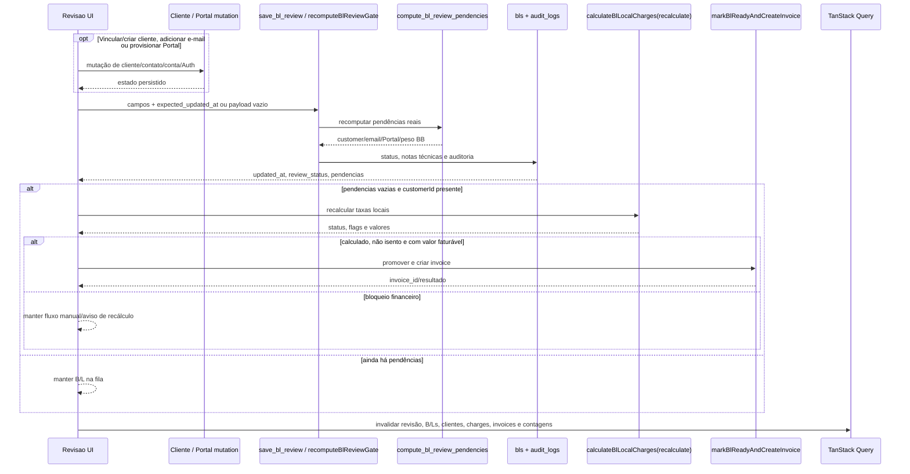

# Operação e Suporte

> **Status:** ativo · **Cartografia verificada:** 2026-08-26 · **Rotas:** `/painel`, `/revisao`, `/alertas`, `/alertas/regras`, `/relatorios`, `/line-up-tv`, `/line-up-tv/display`, `/admin`, `/admin/:tab`

## Propósito e escopo

Este documento cartografa as superfícies operacionais e de suporte que consolidam indicadores, revisão, alertas, relatórios, exibição do Line-Up e administração de usuários. O mapa parte do código executável atual: `src/AppInterno.tsx` é a fonte das rotas internas; páginas compõem a UI; hooks e services concentram queries e mutations; migrations, RLS e RPCs são a fronteira efetiva de autorização e consistência.

Escopo por rota:

- `/painel`: KPIs operacionais, snapshot do Line-Up, exportação e atalhos;
- `/revisao`: fila agrupada, correção individual ou por cliente, gate canônico e tentativa de faturamento automático;
- `/alertas`: fila, filtros e dispensa temporária de alertas internos;
- `/alertas/regras`: manual somente leitura das 26 regras ativas e das 2 aposentadas, com filtro por setor notificado e links para tratamento;
- `/relatorios`: abas operacional, financeira, por cliente e demurrage, com exportação XLSX onde implementada;
- `/line-up-tv`: sem rota nem página dedicada — cai no catch-all interno de `src/AppInterno.tsx`, que responde com a tela "Página não encontrada";
- `/line-up-tv/display`: quadro protegido, sem o shell do `AppLayout`, para monitor/TV;
- `/admin` (e `/admin/:tab`): perfis, papel, ativação, falhas de roteamento, log de ações, métricas e SLA do ADR — uma sub-rota por aba;
- guards e shell compartilhados: `ProtectedRoute`, `AppLayout`, `HeaderInfoBar` e navegação.

Rótulos usados na coluna **Evidência**:

- **Código**: comportamento demonstrado por TypeScript/TSX/SQL executável inspecionado;
- **Teste**: teste automatizado existente; não executado nesta cartografia;
- **Teste de contrato SQL**: teste que inspeciona o texto de uma migration, sem provar aplicação em ambiente;
- **Suspeita**: divergência ou risco que exige confirmação em schema/ambiente controlado;
- **Runtime**: afirmação verificada contra ambiente real. A cartografia original não executou nenhum fluxo; o rótulo aparece apenas nas notas que citam explicitamente a consulta feita ao banco.

Fontes de linguagem e arquitetura: `CONTEXT.md`, `docs/ARCHITECTURE.md`, `docs/adr/0006-revisao-operacional-reconciliacao-cliente-gate-faturamento.md`, `docs/operations/seguranca.md` e `WORKFLOW.md`.

## Anatomia das telas

### Guards, shell e navegação

`src/AppInterno.tsx` coloca todas as rotas deste módulo sob `ProtectedRoute`. `/admin` usa uma segunda árvore com `ProtectedRoute adminOnly`. `/line-up-tv/display` permanece protegido, mas fica deliberadamente fora de `AppLayout`; as demais rotas internas usam o shell com cabeçalho, barra de mercado, navegação, badges, logout e `ErrorBoundary`.

`src/components/layout/ProtectedRoute.tsx` trata loading, ausência de sessão, falta de perfil ativo e redirecionamento de não admin. `src/components/layout/AppLayout.tsx` monta badges com `useOperationalCounts`, mostra o menu Admin somente quando `isAdmin`, executa logout e navega para `/login`. `src/components/layout/HeaderInfoBar.tsx` repete o logout no menu do usuário, exibe role, câmbio e alertas resumidos de demurrage/Granite.

`HeaderInfoBar` usa `useRoeHeaderRate`, que delega a `fetchROE`, para exibir PTAX
Venda, a fórmula `PTAX × 1,065 = ROE`, o valor calculado, a data efetiva da
cotação e uma ação de atualização. O header é informativo, não permite entrada
manual e compartilha a referência cambial e o cache canônicos do recálculo de
demurrage. CNY e o antigo contrato `useExchangeRates` não integram mais a
aplicação; a entrada manual permanece no módulo Demurrage.

Esses filtros de UI são ergonomia e navegação. A autoridade continua em policies, triggers, grants, Edge Functions e RPCs; chamadas diretas à API não podem depender de menu oculto ou redirect. Evidências: `supabase/migrations_archive/040_portal_login_rate_limit.sql`, `supabase/migrations_archive/077_fix_user_profile_privilege_escalation.sql`, `supabase/migrations_archive/014_lock_down_financial_reads_and_audit_writes.sql` e as migrations específicas do gate.

### `/painel`

`src/pages/Painel.tsx` tem três áreas:

1. cabeçalho com última alteração do Line-Up, indicação stale após 10 minutos, refresh, atalho para `/chegadas-saidas` e abertura de `/line-up-tv/display`;
2. snapshot do Line-Up com `LineUpFilters`, `LineUpTable` e exportação XLSX;
3. grade de KPIs com links para os módulos responsáveis.

Os KPIs vêm de leituras diretas a `bls`, `invoices`, `alerts` e `charge_tables`, mais a RPC `count_distinct_containers`. A query `['dashboard']` não possui refetch periódico próprio. O snapshot usa `['lineup-tv-v3']`, `staleTime` de 60 segundos e `refetchInterval` de 90 segundos.

`src/services/lineup.ts` lê viagens ativas/concluídas/canceladas, B/Ls, containers, veículos, agendas por POD, agenda de exportação, vazios de importação e `audit_logs`. Containers são deduplicados por número, MTY é creditado apenas à primeira linha ordenada de cada viagem, CE é derivado como `approved | partial | missing` quando não há override da agenda, e a última alteração é o timestamp mais recente entre as fontes consultadas. `src/lib/lineupFilters.ts` aplica localmente busca por navio/viagem, status, período, CEs e filtros de presença com/sem (veículos, BB, Linked, MTY, RTW); exportações permanecem visíveis. O recorte permanece limitado às 60 viagens mais recentes, devendo ser paginado ou ampliado se o Painel precisar de histórico maior.

O estado visual aprovado para uma linha de escala é derivado das datas reais:
ATB sem ATD significa `Atracada` e deixa a fonte verde no Painel e no Line-Up
TV; CEs e Linked preservam seus badges e cores próprios. Com ATD, a escala passa
automaticamente a `Concluída` e perde o destaque de atracação. O snapshot
transporta ATB/ATD por escala e as duas superfícies aplicam essa regra.

Na coluna intitulada `ETA`, a apresentação aprovada usa ATA quando houver e,
na ausência dela, ETA. ATA é exibida em verde sem mudar o título da coluna; se
for removida por correção, a célula volta ao ETA. A mesma precedência `ATA → ETA`
vale para a data do indicador `Início do ciclo` no Line-Up TV. Esse verde da
data indica chegada efetiva e independe do verde da linha inteira, que exige
ATB sem ATD. Painel, exportação XLSX, cards mobile, quadro desktop e o indicador
de início do ciclo usam a mesma precedência.

### `/revisao`

`src/pages/Revisao.tsx` combina:

- busca por B/L, cliente, consignatário ou shipper;
- chips de motivo;
- grupos por CNPJ válido; quando ele não existe, o nome do consignatário serve apenas para visualização;
- segregação imediata quando as evidências apontam CNPJs diferentes;
- onboarding transacional por grupo com CNPJ, razão social e e-mail obrigatório;
- convite opcional do Portal para o mesmo e-mail informado, sem administrar o ciclo de vida do convite nesta tela;
- evidências brutas de `consignee_block` e `cargo_description` para localizar CNPJ extraído incorretamente;
- correções inline de CE Mercante legado e peso BB;
- drawer por item, com navegação por `id`, edição operacional e justificativa opcional; cadastro/vínculo de cliente é responsabilidade do grupo;
- avisos de recálculo para taxas locais e Granite.

`src/hooks/useReview.ts` carrega até 500 `bls` em `pending_review` e até 500 `granite_bls` sem `client_id`. O join de Granite tem fallback sem metadados de viagem; falha também no fallback torna a indisponibilidade visível. A UI não faz join direto com `customer_portal_accounts`: extrai apenas a linha técnica `Pendencias de importacao:` de `bls.notes`.

`src/pages/revisaoHelpers.ts` trata cliente e consignatário como a mesma entidade de agrupamento, mas só permite onboarding em grupo com CNPJ válido e sem conflito. `getReviewItemDocumentCandidates` também procura CNPJ rotulado nas evidências brutas.

O drawer salva B/L comum por `saveBlReview`, enviando `expected_updated_at`. A RPC `save_bl_review` aplica o lock otimista, atualiza os campos permitidos, recomputa o gate, decide `review_status`, preserva notas humanas, audita mudanças e retorna `{ updated_at, review_status, pendencias }`. Conflito concorrente usa SQLSTATE `PT409`, convertido em `ConcurrentEditError`; `40001` permanece aceito pelo cliente por retrocompatibilidade.

O onboarding chama `complete_review_customer_group`, que trava os B/Ls, cria/resolve o cliente, insere o contato de forma idempotente, vincula todos os B/Ls e recalcula o gate em uma transação. O convite do Portal é uma chamada posterior opcional para o mesmo e-mail; falha do convite não desfaz o cadastro. O tratamento de token, expiração, falha e ativação permanece no Console dedicado.

Granite é uma ramificação mais simples: `saveGraniteBlReview` atualiza `granite_bls.client_id` e tenta inserir auditoria. Não usa `save_bl_review`; se `charge_status` continuar fora de `ready_for_billing | invoiced`, a UI orienta recálculo no módulo Granite.

### `/alertas`

`src/pages/Alertas.tsx` mostra abas `all | active | dismissed`, tabela, deep-links por entidade e dispensa temporária por item. `src/services/alerts.ts` consulta a fila canônica; `list_alert_queue` limita a projeção global a 200 linhas, preservando carriers legados ainda não migrados.

Os alertas de revisão de B/L e Granito (`review_customer_unlinked`, `review_customer_email_missing`, `review_portal_not_ready`, `review_breakbulk_weight_missing` e `review_granite_customer_unlinked`) são reconciliados pelas migrations `324` e `337` em agregados por entidade `(bl, id)` e `(granite_bl, id)` com audiência do departamento de Documentação; todos são críticos, exceto `review_granite_customer_unlinked`, Normal desde a migration `078` porque Granito não fatura. Triggers em `public.bls`, `public.customer_portal_accounts` e `public.granite_bls`, mutações autoritativas (`save_bl_review`, `complete_review_customer_group`) e o cron server-side de 15 minutos (`run_alert_detectors`) mantêm a fila e os sinos sincronizados em tempo real.

Os dois produtores do ADR (`agency_report_department_pending` e `agency_report_deadline_missed`) são reconciliados pela migration `323` em um agregado por `(viagem, porto, terminal)` — ou `(viagem, porto)` no legado — com um item independente para cada um dos três departamentos. O ATD do ADR terminalizado vem de `voyage_escala_terminal_state.terminal_atd`; audit logs, sign-offs e o cron server-side de 15 minutos acionam a mesma reconciliação. Se uma seção confirmada volta a pendente, o sign-off departamental dono é invalidado com a justificativa da reabertura. O link para a viagem é produzido por `agencyReportAlertLink`, preservando `terminal` e `report_id` quando existirem.

Detectores server-side de operação e viagem (migrations `326` e `338`) reconciliam B/L esperado, Baplie ausente/cobertura, CE Mercante, datas de escala/terminal e exportação pós-ATD. A audiência usa a união declarada no catálogo; terminais usam `depots.code` na chave/deep-link; e audit logs/estado terminalizado acionam reconciliação imediata, com o cron como rede de segurança. Como os manifests de Granito/Vazios ainda só têm `voyage_id`, a pendência de exportação pós-ATD é agregada por escala, não por terminal.

Dispensar exige motivo e uma data futura e grava o histórico por ocorrência; a resolução acontece no produtor autoritativo. As mutations invalidam `['alerts']`, `['op-count']` e `['dashboard']`. O realtime de `alerts` usado por `useOperationalCounts` invalida especificamente `['op-count', 'open-alerts']`.

### `/alertas/regras`

`src/pages/AlertasRegras.tsx` apresenta o catálogo educativo dos 28 tipos de `alert_type_catalog` — 26 ativos e 2 aposentados —, alimentado por `src/services/alertRulesCatalog.ts`. A lista pode ser filtrada por busca, setor notificado, domínio, gravidade e situação; o painel detalha entidade, setor responsável, setores notificados, distribuição, gatilho, prazo, resolução, dispensa e destino. A seleção e os filtros ficam na query string para permitir retorno e compartilhamento. A tela é somente leitura: não executa detectores, não resolve itens e não altera configurações.

O verbete distingue **setor responsável** (o `alert_items.department` gravado pelo produtor, que agrupa a fila `/alertas`) de **setores notificados** (a união entre `alert_type_catalog.audience_departments` e o departamento do item, como faz `fanout_alert_item_for_department`). O filtro de setor usa os setores notificados, porque um mesmo alerta pode chegar a mais de um: `pix_unreconciled` é tratado pelo Administrativo, que é quem abre a Conciliação PIX, e alcança também Documentação e Equipamentos (migration `078`, que também passou a aceitar `administrativo` como setor da fila); `voyage_schedule_date_pending` e `voyage_terminal_date_pending` alcançam Operações e Documentação; e os dois tipos de ADR abrem um item por departamento — Operações (Escala), Equipamentos (Granito, Veículos, Embarque de vazios) e Documentação (Carga descarregada, Vazios descarregados) — com Documentação também na audiência fixa do catálogo. A opção *"Aplicável a todos os setores"* filtra exclusivamente essas regras que envolvem todos os setores simultaneamente.

As regras aposentadas ficam fora do filtro padrão e trazem o motivo no verbete. Um deep-link `?regra=` para uma regra aposentada abre o verbete sem exigir `?situacao=`.

### `/relatorios`

`src/pages/Relatorios.tsx` possui quatro abas:

- **Operacional**: período, POD e modalidade; KPIs de B/Ls, containers, viagens, peso e CBM;
- **Financeiro**: período e status; invoices, emitido, pago, saldo e canceladas;
- **Por Cliente**: período; B/Ls, peso, CBM, invoices, emitido e saldo por cliente;
- **Demurrage**: período e status; `doc_number`, B/L, cliente, USD, BRL e status.

As queries são `['report-operational', filters]`, `['report-financial', filters]`, `['report-customers', filters]` e `['demurrage-report', dateFrom, dateTo, statusFilter]`.

`src/services/reports.ts` define `REPORT_ROW_LIMIT = 2000` para as listas operacional e financeira em tela. As variantes de exportação operacional/financeira removem o limite e carregam o XLSX sob demanda. O relatório por cliente consulta até 4.000 B/Ls e 4.000 invoices (`REPORT_ROW_LIMIT * 2`) antes do agrupamento; portanto, a mensagem geral de “2.000 linhas por consulta” não descreve uniformemente todas as abas. Demurrage usa `listDemurrageInvoices` sem limite explícito no service.

Há exportação XLSX nas quatro abas: operacional, financeiro, clientes e demurrage. Cada export respeita o conjunto obtido por sua consulta.

### `/line-up-tv` e `/line-up-tv/display`

`/line-up-tv` não tem rota nem página própria: o catch-all `<Route path="*">` de `src/AppInterno.tsx` absorve o caminho, como faz com qualquer rota interna desconhecida. Ele renderiza `NaoEncontrado` (antes redirecionava para `/painel` com `replace`, realocando o usuário sem aviso e sem histórico recuperável) e fica dentro do `ProtectedRoute`, para que visitante sem sessão continue indo para `/login`.

`src/pages/LineUpTVDisplay.tsx` usa `['lineup-tv-display-v2']`, `staleTime` e auto-refresh de 30 segundos. Remove linhas com `atd`, tenta fullscreen na carga, mostra flash verde quando recebe novo snapshot e:

- em desktop, dimensiona oito linhas visíveis e anima um carrossel quando há mais de oito linhas;
- em touch/mobile, renderiza cards estáticos;
- mantém placeholders quando há menos de oito linhas.

No carrossel, a fronteira do ciclo deve permanecer visualmente presa à
identidade da primeira escala ordenada: uma borda horizontal destacada aparece
entre a última e a primeira escala, acompanhando ambas durante a animação. Ela
não pertence a uma posição fixa da tela. No mobile, a borda equivalente aparece
antes do card da primeira escala. A referência visual aprovada é a separação
mostrada entre `GREEN SANTOS / 16` e `ZYHY JIN QU / 39`, mantendo também o texto
`Início do ciclo` no cabeçalho.

O display compartilha `fetchLineUpSnapshot` com o Painel, mas não compartilha a mesma cache key. A classe `app-lineup-display-board__row--cycle-start` pertence à ocorrência renderizada da primeira escala, inclusive no track animado e no card mobile, portanto a borda acompanha o ciclo.

### `/admin`

`src/pages/Admin.tsx` contém abas:

- **Usuários**: nome, papel, ativo/inativo, criação e ações;
- **Log de Ações**: filtros por módulo (`entity_type`), autor (`changedBy`, disponível no estado/query), período e paginação de 50;
- **Métricas**: última viagem, última conciliação PIX e último faturamento.

As chaves são `['admin-users']`, `['admin-audit-logs', logFilters]` e `['admin-metrics']`. `src/services/adminUsers.ts` lista `user_profiles` e atualiza `role`/`active` diretamente. A tela gerencia `administrativo`, `financeiro`, `operacoes` e `documentacao`, normalizando papéis legados `admin` e `operator` apenas para exibição/seleção.

Não há lock otimista nessa atualização. A proteção efetiva para `role` e `active` é administrativa no banco, incluindo o trigger de `supabase/migrations_archive/077_fix_user_profile_privilege_escalation.sql`.

## Catálogo de ações

### `/painel`

| Tela / ação | Pré-condições | Origem | Orquestração | Persistência | Efeitos e cache | Falhas | Evidência |
|---|---|---|---|---|---|---|---|
| Carregar KPIs | Sessão interna e perfil ativo | Montagem de `Painel` | `useQuery(['dashboard'])` chama `fetchDashboard` e `fetchDistinctContainerCount` | Leitura de `bls`, `invoices`, `alerts`, `charge_tables`; RPC `count_distinct_containers` | Preenche cards e links; invoice negada vira “Restrito” | Primeiro erro não financeiro interrompe a query; `42501` de invoices é tratado como restrição | **Código:** `src/pages/Painel.tsx` |
| Carregar snapshot Line-Up | Sessão interna ativa | Montagem/intervalo/refresh manual | `useQuery(['lineup-tv-v3'])` → `fetchLineUpSnapshot` | Leituras de `voyages`, `bls`, `bl_containers`, `vehicles`, `vazios_importacao_*`, `audit_logs` e agendas | Cache stale 60 s, refetch 90 s; atualiza tabela, MTY e timestamp | Qualquer leitura obrigatória lança erro e exibe falha do Line-Up | **Código:** `src/pages/Painel.tsx`, `src/services/lineup.ts` |
| Filtrar/exportar Line-Up | Snapshot carregado; export exige linhas | `LineUpFilters` e botão Exportar | `filterLineUpRows` combina filtros locais; import dinâmico de `@e965/xlsx` | Nenhuma escrita no banco; arquivo `painel-lineup-AAAA-MM-DD.xlsx` | Exporta somente linhas filtradas; não altera cache | Falha de download mostra toast | **Código:** `src/pages/Painel.tsx`, `src/lib/lineupFilters.ts`; **Teste:** `src/lib/__tests__/lineupFilters.test.ts`, `src/pages/__tests__/Painel.behavior.test.tsx` |
| Abrir atalhos | Sessão interna ativa | Links no cabeçalho/KPIs | React Router ou nova aba | Nenhuma | Navega para `/chegadas-saidas`, `/line-up-tv/display` ou módulo do KPI | Guard pode redirecionar se a sessão deixar de ser válida | **Código:** `src/pages/Painel.tsx`, `src/AppInterno.tsx` |

### `/revisao`

| Tela / ação | Pré-condições | Origem | Orquestração | Persistência | Efeitos e cache | Falhas | Evidência |
|---|---|---|---|---|---|---|---|
| Carregar, filtrar e agrupar fila | Sessão/perfil ativo | Montagem, busca e chips | `useReviewQueue` carrega B/Ls/Granite; `groupReviewItems` agrupa por CNPJ/nome | Leitura de `bls`, `customers`, `customer_contacts`, `voyages`, `bl_containers`, `granite_bls` e `granite_manifests` | Cache `['review-queue']`; filtros e collapse são locais | B/L falha: query inteira falha; Granite usa fallback e sinaliza fila incompleta | **Código:** `src/hooks/useReview.ts`, `src/pages/Revisao.tsx`, `src/pages/revisaoHelpers.ts`; **Teste:** `src/pages/__tests__/revisaoHelpers.test.ts`, `src/pages/__tests__/Revisao.test.tsx` |
| Abrir/navegar drawer | Item presente no resultado filtrado | Botão “Corrigir”, anterior/próximo | Seleção por `id`; formulário é rebaseado quando o item muda | Nenhuma até salvar | Mantém posição usando `siblingIds`; item resolvido avança pelo próximo `id` calculado antes do refetch | Alteração do filtro pode remover o item selecionado | **Código:** `src/pages/Revisao.tsx`; **Teste:** `src/pages/__tests__/Revisao.test.tsx` |
| Cadastrar/vincular cliente no grupo | B/Ls pendentes, CNPJ válido, razão social e e-mail válidos; usuário ativo | `ReviewCustomerOnboarding` no grupo | `useReviewCustomerGroup` → `completeReviewCustomerGroup`; opcionalmente `sendPortalInvite` após commit | `customers`, `customer_contacts`, `bls`, fila de reconciliação e `audit_logs` na mesma transação | Invalida revisão, clientes, lookup, B/Ls, charges, pendências locais e Portal | CNPJ conflitante/missing, grupo alterado (`PT409`/`40001`) ou convite falho; convite falho preserva onboarding | **Código:** `ReviewCustomerOnboarding`, `reviewCustomerGroup.ts`, migration `317`; **Teste:** `Revisao.test.tsx`, `reviewCustomerGroup.test.ts`; **Teste de contrato SQL:** `reviewCustomerGroupMigration.test.ts` |
| Salvar revisão individual | Usuário ativo; item B/L; `expected_updated_at` corrente | “Marcar como revisado” | `saveBlReview` → RPC `save_bl_review` → `compute_bl_review_pendencies` → status; se resolvido, `tryAutoIssueInvoice` | Atualiza `bls`; insere `audit_logs`; sincroniza fila de reconciliação; pode gerar cobranças/invoice | Invalida `review-queue`, `bls`, `granite-bls`, detalhe, audit, customers e `op-count`; faturamento também altera caches por fluxos subsequentes | `PT409`/`40001` vira conflito concorrente; números inválidos falham antes da RPC; pendências mantêm item na fila | **Código:** `src/pages/Revisao.tsx`, `src/services/review.ts`; **Teste:** `src/services/__tests__/review.test.ts`, `src/pages/__tests__/Revisao.test.tsx`; **Teste de contrato SQL:** `src/services/__tests__/reviewGateCanonicalMigration.test.ts` |
| Exibir evidências e segregar conflito | Grupo sem CNPJ ou com candidatos distintos | `ReviewDocumentEvidence` | Lista candidatos, `consignee_block`, `cargo_description` e B/L de origem; não oferece vínculo em conflito | Nenhuma escrita | Estado local do grupo | Evidência ausente exige confirmação manual; CNPJs conflitantes não são agrupados | **Código:** `src/components/review/ReviewDocumentEvidence.tsx`, `revisaoHelpers.ts`; **Teste:** `ReviewDocumentEvidence.test.tsx`, `revisaoHelpers.test.ts` |
| Adicionar e-mail ao grupo | Grupo com cliente vinculado e pendência canônica de e-mail | Campo “E-mail de faturamento” | `addCustomerEmail` → `refreshGroupGate` → `recomputeBlReviewGate` por B/L → tentativa de invoice | Insere `customer_contacts`; RPC regrava status/notas do B/L | Invalida customers, revisão, B/Ls, charges, invoices e `op-count` | Validação da UI exige apenas conteúdo com `@`; falha em qualquer etapa gera toast | **Código:** `src/pages/Revisao.tsx`, `src/services/customers.ts`, `src/services/review.ts`; **Teste:** `src/pages/__tests__/Revisao.test.tsx` |
| Encaminhar provisionamento do Portal | Cliente vinculado; análise de email no Console | Link “Portal do Cliente” | `/clientes/portal` → convite com token → ativação pelo cliente | `portal_invites`, `customer_portal_accounts`, Supabase Auth | Fila permanece visível; nenhuma senha é exibida ao operador | Email suprimido, conta ativa, token expirado ou papel sem permissão | **Código:** `src/pages/ClientesPortal.tsx`, `src/components/portal/PortalReviewPanel.tsx`; **Teste:** `ClientesPortal.behavior.test.tsx` |
| Corrigir peso BB ou CE inline | Item B/L; valor válido; motivo aplicável | Editor inline | `applyInlineBlReviewFix` → `save_bl_review`; só tenta faturar se resultado estiver resolvido | `bls`, `audit_logs` e status canônico | Invalida revisão, B/Ls, detalhe, customers e `op-count` | Peso vazio/não positivo e CE vazio são rejeitados; conflito recarrega fila | **Código:** `src/pages/Revisao.tsx`, `src/services/review.ts`; **Teste:** `src/services/__tests__/review.test.ts`, `src/pages/__tests__/revisaoHelpers.test.ts` |
| Recomputar gate após mutação de cliente/Portal | B/L já vinculado; `updated_at` ainda corrente | Ação de e-mail ou onboarding | `complete_review_customer_group` calcula `compute_bl_review_pendencies` por B/L; convite não administra status do Portal | Atualiza `review_status` e fila técnica | B/L resolvido sai da fila; exceção específica permanece | Falha de convite não faz rollback; retry fica no Console do Portal | **Código:** migration `317`, `useReviewCustomerGroup.ts`; **Teste de contrato SQL:** `reviewCustomerGroupMigration.test.ts` |
| Calcular charges e tentar faturamento | Gate resolvido e `customerId` presente | Pós-save/pós-recompute | `calculateBlLocalCharges(recalculate=true)`; se não `review_required`, não isento e com valor, `markBlReadyAndCreateInvoice` | RPCs `calculate_bl_local_charges` e `mark_bl_ready_and_create_invoice`; ledger/invoice conforme contrato financeiro | Pode levar B/L a `invoiced`; falha/bloqueio cria aviso de recálculo e preserva fluxo manual | Revisão de taxa, isenção, valor zero, USD/bloqueios do banco ou erro de invoice impedem emissão | **Código:** `src/services/reviewBillingAutomation.ts`, `src/services/charges/chargeOperationsService.ts`, `src/services/billing.ts`; **Teste:** `src/services/__tests__/reviewBillingAutomation.test.ts`; **Teste de contrato SQL:** `src/services/__tests__/reviewGateHardeningMigration.test.ts` |
| Vincular cliente Granite | Cliente selecionado; item Granite sem `client_id` | Grupo ou drawer | `saveGraniteBlReview` atualiza cliente e tenta auditoria separada | `granite_bls.client_id`; `audit_logs` best effort sem tratamento do erro retornado | Invalida revisão/Granite; pode exibir aviso para abrir `/granito` | Update falha interrompe; falha de audit não é propagada; não há transação entre ambos | **Código:** `src/services/review.ts`, `src/pages/Revisao.tsx` |

### `/alertas`

| Tela / ação | Pré-condições | Origem | Orquestração | Persistência | Efeitos e cache | Falhas | Evidência |
|---|---|---|---|---|---|---|---|
| Filtrar/listar | Sessão interna ativa | Abas Todos/Ativos/Dispensados | `useQuery(['alerts', statusFilter])` → `listAlerts` | RPC `list_alert_queue`, com cap global de 200 e carriers legados sem item | Troca de filtro usa cache por status | Erro exibe `InlineError` | **Código:** `src/pages/Alertas.tsx`, `src/services/alerts.ts` |
| Dispensar | Item ativo; motivo e data futura | Botão “Dispensar” | `dismissAlert(item_id, reason, reviewAt)` → `dismiss_alert_item` | `alert_item_dismissals` por ocorrência | Invalida alerts/op-count/dashboard | Motivo ausente ou data passada é rejeitado | **Código:** `src/pages/Alertas.tsx`, `src/services/alerts.ts` |
| Resolver | Estado autoritativo alterado | Produtor do alerta | Triggers/RPCs chamam `resolve_alert_item`; ADR usa reconciliação por departamento; abuso de login exige análise humana | `alert_items.status = resolved` e evento de resolução | Agregado e contadores são atualizados | Falha da origem permanece visível na fila | **Código:** migrations `318`/`321`/`323`/`324`/`326`, produtores de faturamento/Portal/demurrage/ADR/viagens/revisão |
| Abrir entidade | `entity_type`/`entity_id` suportados | Link na linha | Mapeia invoice, container, B/L, Granito, ADR, viagem, escala ou terminal para a rota interna; ADR inclui terminal/report quando disponíveis | Nenhuma | Navega para faturamento, demurrage, manifesto, granito, Baplie ou viagens com parâmetros de escala/terminal | Tipos sem mapeamento não exibem link | **Código:** `src/pages/Alertas.tsx`, `src/services/alerts.ts` |

### `/relatorios`

| Tela / ação | Pré-condições | Origem | Orquestração | Persistência | Efeitos e cache | Falhas | Evidência |
|---|---|---|---|---|---|---|---|
| Consultar operacional | Sessão ativa | Aba/filtros | `fetchOperationalReport`, limite 2.000 | Leitura de `bls` com customers, voyages/vessels/carriers e containers | Cache `['report-operational', filters]`; calcula KPIs no cliente | Erro da query interrompe; limite atingido gera aviso | **Código:** `src/pages/Relatorios.tsx`, `src/services/reports.ts` |
| Consultar financeiro | Permissão de leitura financeira | Aba/filtros | `fetchFinancialReport`; reconstrói saldo local com receivables | `invoices`, `invoice_receivable_links`, `bl_receivables` | Cache `['report-financial', filters]`; limite 2.000 | `42501`/`PGRST301` retorna estado `accessDenied`, demais erros propagam | **Código:** `src/services/reports.ts`; **Teste:** `src/services/__tests__/reports.test.ts` |
| Consultar por cliente | Sessão ativa; financeiro pode ser restrito | Aba/período | Carrega B/Ls e invoices, agrega por `customer_id`, deduplica recebíveis | `bls`, `invoices`, `invoice_receivable_links`, `bl_receivables` | Cache `['report-customers', filters]`; até 4.000 linhas por fonte | Sem acesso a invoices, mantém métricas operacionais e zera componente financeiro | **Código:** `src/pages/Relatorios.tsx`, `src/services/reports.ts`; **Teste:** `src/services/__tests__/reports.test.ts` |
| Consultar demurrage | Sessão ativa | Aba/período/status | `listDemurrageInvoices` | `demurrage_invoices` com customers e B/L/viagem/navio | Cache `['demurrage-report', dateFrom, dateTo, statusFilter]` | Erro exibe `InlineError`; service não define limite explícito | **Código:** `src/pages/Relatorios.tsx`, `src/services/demurrage/demurrageInvoices.ts` |
| Exportar XLSX | Aba operacional/financeira/clientes com dados | Botão “Exportar xlsx” | Fetch de exportação e import dinâmico de `src/services/exports.ts` | Sem escrita; gera arquivo local | Não invalida cache | Operacional/financeiro podem buscar volume sem limite; falha gera toast | **Código:** `src/pages/Relatorios.tsx`, `src/services/reports.ts`, `src/services/exports.ts` |

### `/line-up-tv` e `/line-up-tv/display`

| Tela / ação | Pré-condições | Origem | Orquestração | Persistência | Efeitos e cache | Falhas | Evidência |
|---|---|---|---|---|---|---|---|
| Abrir `/line-up-tv` | Sessão interna ativa | Navegação/URL | Catch-all `<Route path="*">` com `NaoEncontrado` | Nenhuma | Renderiza a página de rota desconhecida, como qualquer caminho interno não mapeado | Guard pode redirecionar antes para login | **Código:** `src/AppInterno.tsx` |
| Exibir quadro TV | Sessão interna ativa; rota fora do `AppLayout` | URL/atalho do Painel | `useQuery(['lineup-tv-display-v2'])` → snapshot compartilhado | Mesmas leituras do Line-Up | Auto-refresh 30 s; filtra `atd`; carrossel desktop/cards mobile; tenta fullscreen | Fullscreen pode ser negado sem bloquear; erro de dados mostra mensagem | **Código:** `src/pages/LineUpTVDisplay.tsx`, `src/services/lineup.ts`, `src/AppInterno.tsx` |

### `/admin` e shell

| Tela / ação | Pré-condições | Origem | Orquestração | Persistência | Efeitos e cache | Falhas | Evidência |
|---|---|---|---|---|---|---|---|
| Listar usuários | `ProtectedRoute adminOnly` e RLS admin | Aba Usuários | `listAllUserProfiles` | Leitura de `user_profiles` | Cache `['admin-users']` | Erro exibe `InlineError` | **Código:** `src/pages/Admin.tsx`, `src/services/adminUsers.ts`, `src/components/layout/ProtectedRoute.tsx` |
| Alterar role/ativo | Admin; perfil alvo | Select ou Ativar/Desativar | `updateUserProfile(id, updates)` | Update direto em `user_profiles`; trigger impede alteração sensível por não admin | Invalida `['admin-users']` | Não há optimistic lock; concorrência usa last write wins; `42501` bloqueia autor indevido | **Código:** `src/services/adminUsers.ts`, `supabase/migrations_archive/077_fix_user_profile_privilege_escalation.sql` |
| Filtrar/paginar audit log | Admin na rota; aba Logs | Filtros de módulo, autor/período e paginação | Query direta com count e lookup dos autores | Leitura de `audit_logs` e `user_profiles` | Cache `['admin-audit-logs', logFilters]`; páginas de 50 | Falha da query lança; UI não renderiza `InlineError` específico para logs | **Código:** `src/pages/Admin.tsx`, `supabase/migrations_archive/014_lock_down_financial_reads_and_audit_writes.sql` |
| Carregar métricas | Aba Métricas | Troca de aba | Três leituras paralelas | `voyages`, `audit_logs` de `pix_reconciliation`, `invoices` | Cache `['admin-metrics']`, stale 60 s | Função não verifica erros individuais; ausência/falha pode aparecer como `-` | **Código:** `src/pages/Admin.tsx` |
| Navegar e sair | Sessão interna ativa | Menus, marca, Header e botão Sair | `AppLayout`/`HeaderInfoBar`; `signOut` → `/login` | Supabase Auth/storage de sessão | Limpa sessão conforme `useAuth`; badges vêm de `['op-count', ...]` | Falha de autorização real deve ser resolvida por RLS/RPC, não pelo menu | **Código:** `src/components/layout/AppLayout.tsx`, `src/components/layout/HeaderInfoBar.tsx`, `src/components/layout/appLayoutNav.ts`, `src/hooks/useOperationalCounts.ts`; **Teste:** `src/components/layout/__tests__/AppLayout.test.ts` |

## Estado e dados

### Mapa de caches

| Superfície | Query keys principais | Dono | Política observável |
|---|---|---|---|
| Painel | `['dashboard']`, `['lineup-tv-v3']` | `src/pages/Painel.tsx` | Dashboard sob demanda; Line-Up stale 60 s/refetch 90 s |
| Badges do shell | `['op-count', 'pending-review' \| 'charge-review-required' \| 'ready-for-billing' \| 'open-alerts' \| 'bls-without-customer']` | `src/hooks/useOperationalCounts.ts` | stale 60 s; realtime apenas para alertas abertos |
| Header | `['header-alert', 'demurrage-overdue' \| 'granite-pending']` | `src/hooks/useOperationalAlerts.ts` | stale 5 min |
| Revisão | `['review-queue']`, além de `['bls']`, `['granite-bls']`, `['bl-detail', id]`, `['customers']`, `['op-count']` | `src/hooks/useReview.ts`, `src/pages/Revisao.tsx` | Invalidação explícita após mutations |
| Alertas | `['alerts', statusFilter]` | `src/pages/Alertas.tsx` | Lista por filtro; mutations invalidam prefixo |
| Relatórios | famílias `report-*` e `demurrage-report` | `src/pages/Relatorios.tsx` | stale 30 s operacional/financeiro/clientes; 60 s demurrage |
| Display TV | `['lineup-tv-display-v2']` | `src/pages/LineUpTVDisplay.tsx` | stale/refetch 30 s |
| Admin | `['admin-users']`, `['admin-audit-logs', logFilters]`, `['admin-metrics']` | `src/pages/Admin.tsx` | logs 30 s; métricas 60 s |

### Gate canônico de revisão

O contrato vigente combina `compute_bl_review_pendencies` (`051`), seu
núcleo `_compute_bl_review_pendencies` (`059`) e os gates de prontidão/emissão
(`047`/`056`). Cliente ausente bloqueia; no caminho normal, contato ativo com
email e prontidão do Portal são exigidos. Peso BB é validado para carga solta
e misto. A exceção interna controlada da automação CE dispensa contato/Portal
nesse contexto, sem liberar os caminhos manuais.

CE Mercante tem guarda documental própria antes de promover/emitir, mesmo
quando não aparece no array de pendências de revisão. `save_bl_review` calcula
o status no servidor e protege identidade do ator e concorrência.

### Persistência relevante

- operação/Line-Up: `voyages`, `bls`, `bl_containers`, `vehicles`, `vazios_importacao_manifests`, `vazios_importacao_containers`, agendas de importação/exportação e `audit_logs`;
- revisão: `bls`, `customer_contacts`, `customer_portal_accounts`, `granite_bls`, `audit_logs`, `charge_calculations`, invoices e ledger;
- alertas: `alerts`;
- relatórios: `bls`, `customers`, `invoices`, `invoice_receivable_links`, `bl_receivables`, `demurrage_invoices`;
- administração: `user_profiles`, `audit_logs`, `voyages`, `invoices`.

## Fluxos e invariantes

### Revisão até faturamento

Invariantes:

- `save_bl_review` é o autor de `review_status` para o save manual: o status não é aceito do payload;
- `expected_updated_at` protege contra sobrescrita concorrente; conflito é `PT409`;
- faturamento automático só é tentado quando `pendencias` está vazio;
- CE Mercante é guarda documental de emissão, distinta do array de revisão;
- Portal usa `customer_portal_access_ready`; automação CE possui exceção interna controlada;
- nenhuma migration atual faz backfill top-level dos B/Ls históricos já faturados;
- importação aplica o gate antes de `run_billing_for_import_batch`;
- Granite compartilha a superfície de revisão, mas não a mesma RPC/status canônico de B/L comum.

### Alertas e shell

- reconhecer é `open → acknowledged`;
- fechar é `open|acknowledged → closed`;
- listas sempre excluem `closed`;
- contagens do menu são auxiliares e retornam zero em erro para não quebrar o shell;
- menu/role/redirect são UX; RLS, triggers, RPCs e Edge Functions mandam;
- `/line-up-tv/display` não herda cabeçalho/nav, porém continua atrás de `ProtectedRoute`.

### Line-Up

- viagens consideradas: `active`, `completed` e `cancelled`, até 60;
- containers são deduplicados por `container_number`, com fallback por id;
- MTY vem somente de Vazios de Importação e é creditado uma vez por viagem;
- display exclui linhas com `atd`;
- Painel e display compartilham o service, mas têm caches e intervalos distintos.

## Testes e validação

Testes existentes relevantes, não executados nesta cartografia por restrição de recursos compartilhados:

| Área | Cobertura existente | Calibração |
|---|---|---|
| Revisão UI | agrupamento, vínculo em lote, drawer, justificativa default, e-mail e provisionamento | **Teste:** `src/pages/__tests__/Revisao.test.tsx` |
| Helpers de revisão | grupos, e-mail, Portal, CE legado e peso BB | **Teste:** `src/pages/__tests__/revisaoHelpers.test.ts` |
| Service de revisão | parsing de retorno, `PT409`, payload e correção inline | **Teste:** `src/services/__tests__/review.test.ts` |
| Gate SQL | quatro travas, ausência de CE, status e lock | **Teste de contrato SQL:** `src/services/__tests__/reviewGateCanonicalMigration.test.ts`, `src/services/__tests__/reviewGateHardeningMigration.test.ts` |
| Auto-faturamento | recálculo, invoice, review_required, valor zero e erro | **Teste:** `src/services/__tests__/reviewBillingAutomation.test.ts` |
| Relatórios | saldos por receivables e deduplicação por cliente | **Teste:** `src/services/__tests__/reports.test.ts` |
| Navegação financeira | badge/alerta no menu | **Teste:** `src/components/layout/__tests__/AppLayout.test.ts` |
| Regras de Alertas | cobertura dos tipos do catálogo, espelho de gravidade/audiência, ADR por departamento, filtro por setor notificado e situação | **Teste:** `src/pages/__tests__/AlertasRegrasCatalog.test.tsx`; **Teste de contrato SQL:** `src/pages/__tests__/AlertasCatalogContract.test.ts` com `src/services/__tests__/alertCatalogSql.ts` |

Lacunas observadas:

- há cobertura local em `Painel.behavior.test.tsx`, `lineupSnapshot.test.ts`, `Alertas.behavior.test.tsx`, `LineUpTVDisplay.behavior.test.tsx` e `Admin.behavior.test.tsx`; esses testes não substituem runtime autenticado;
- os testes de contrato SQL provam texto esperado na migration, não schema aplicado, grants efetivos nem execução transacional;
- faltam cenários de integração para conflito real `PT409`, provisionamento Auth, RLS por papel, emissão completa de invoice e invalidation/realtime.

Validação runtime futura deve usar ambiente controlado e registrar: papel, B/L/cliente, estado inicial, mutation, retorno RPC, status final, invoice/cache e evidência. Nenhum desses cenários operacionais recebe rótulo Runtime nesta cartografia.

## Notas e divergências

- **Admin sem lock otimista — Código.** A documentação anterior atribuía lock por `updated_at` à edição de usuários, mas `src/services/adminUsers.ts` faz update por `id` sem versão. Segurança de papel/ativo existe no banco; concorrência continua last-write-wins.
- **Display não é público — Código.** `/line-up-tv/display` está fora do `AppLayout`, porém dentro de `ProtectedRoute` em `src/AppInterno.tsx`.
- **Relatórios e limite — Código.** A UI anuncia limite geral de 2.000; operacional/financeiro em tela usam 2.000, clientes usa até 4.000 por fonte, exportações operacional/financeira não aplicam limite e demurrage não define limite explícito.
- **Exportações — Código.** As quatro abas expõem XLSX; Demurrage usa `exportDemurrageReportWorkbook`. O export respeita os dados carregados e seus limites; não equivale a consulta ilimitada.
- **Filtro `changedBy` de auditoria — Código.** O estado e a query suportam autor, mas a UI atual não renderiza um controle para preenchê-lo; módulo e período estão visíveis.
- **CE Mercante — Código + Teste de contrato SQL.** O bloqueio de CE Mercante permanece na validação do faturamento; o predicado morto `needsCeMercante` foi removido da fila de revisão manual, que não trata esse motivo como pendência própria.
- **Auditoria Granite não atômica — Código.** O update de `granite_bls` e o insert em `audit_logs` são chamadas separadas; o erro do insert não é verificado.
- **Dois tipos de alerta aposentados — Código + Runtime.** `invoice_payment_invalid` e `invoice_cancel_blocked` continuam no catálogo, mas nenhum produtor os emite: a migration `327` retirou os dois do gatilho `route_catalog_alert_insert` e fechou os itens abertos, e `register_invoice_payment`/`cancel_invoice` apenas gravam a recusa em `audit_logs` e devolvem erro ao operador. A migration `347` marca os dois como inativos no catálogo, e `/alertas/regras` não os lista: o manual documenta somente os tipos ativos, e um tipo aposentado sai de `ALERT_RULES` na mesma mudança que o desativa no catálogo SQL. Só o rótulo (`TYPE_LABELS`) permanece, para itens históricos continuarem legíveis na fila. O rótulo Runtime cobre uma verificação pontual: em 2026-08-26, `pg_get_triggerdef` do gatilho `route_catalog_alert_insert` no projeto de produção confirmou os dois tipos na cláusula `WHEN` de exclusão.
- **Audiência do ADR inclui Documentação em todos os itens — Código.** `alert_type_catalog.audience_departments` do ADR é `{documentacao}`; como a audiência efetiva soma o departamento do item, Documentação recebe também as notificações dos itens de Operações e Equipamentos. O agrupamento da fila continua pelo departamento do item.
- **Evidência Runtime limitada.** Fora da nota dos tipos aposentados, esta cartografia não executou suíte, browser, Supabase, Edge Function, email, fullscreen ou faturamento real.
