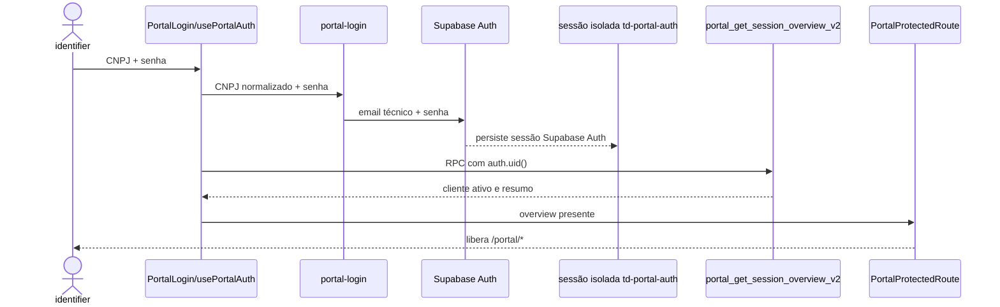

# Portal do Cliente

> **Rota interna:** `/clientes/portal/inspecao/:customerId/*` (Modo Inspeção)

> **Status:** ativo · **Atualizado:** 2026-08-14 · **Rotas:** `/portal/login`, `/portal/esqueci-senha`, `/portal/recuperar-senha`, `/portal/confirmar-email`, `/portal`, `/portal/billing`, `/portal/operacao`, `/portal/perfil`

## Propósito e escopo

O Portal é a superfície externa para autenticação, consulta financeira e operacional, consolidação de recebíveis, disputas de demurrage, notificações e atualização limitada de perfil. Não existe cadastro público nem sessão alternativa por token próprio: CNPJ e senha são os **dados visíveis de entrada**; a Edge Function `portal-login` resolve a identidade técnica no servidor e o Supabase Auth continua sendo o único **mecanismo de autenticação e sessão**.

São públicas as cinco rotas de login, recuperação, redefinição, ativação e confirmação de email. `/portal`, `/portal/billing`, `/portal/operacao` e `/portal/perfil` ficam sob `PortalProtectedRoute` e `PortalLayout` em `src/AppPortal.tsx`. O navegador usa `supabasePortal`, com `storageKey: 'td-portal-auth'` e `detectSessionInUrl:false`, separado da sessão interna (`src/services/supabase.ts`).

A interface e seus filtros não autorizam dados. RPCs de Portal resolvem o cliente pela identidade autenticada; RLS, grants e validações server-side continuam sendo a fronteira real, conforme [ADR 0004](../adr/0004-supabase-rls-rpc-fronteira-seguranca.md) e [ADR 0013](../adr/0013-portal-auth-identificador-resolvido-e-excecao-anon.md).

## Anatomia das telas

### `/portal/login`

`src/pages/PortalLogin.tsx` aceita CNPJ e senha. Se a sessão já foi hidratada, redireciona para `/portal`; durante submit chama `usePortalAuth.signIn`, que invoca `portal-login` e converte falhas em mensagem genérica de credenciais. Antes de chamar o servidor, a tela reprova CNPJ com menos de 14 caracteres (`isCompleteCnpjLogin`, `src/lib/portalCnpjLogin.ts`) com mensagem própria de digitação — o formato se confere offline, então avisar não revela nada sobre a base, e a tentativa não consome o rate limit de login.

### `/portal/esqueci-senha`

`src/pages/PortalForgotPassword.tsx` envia o CNPJ para a Edge Function
`portal-password-recovery`. A resposta é `{ accepted: true }` para todo caso
elegível (com conta ou sem, ativa ou não, email enviado ou não) e
`{ accepted: false, rate_limited: true }` apenas quando o rate limit por CNPJ
bloqueia; a tela mostra a mesma mensagem de sucesso nos dois primeiros casos e
uma mensagem de "tente mais tarde" só para o rate limit — não enumera conta
(achado 3.2 da auditoria `security-audit-portal-2026-08-12`).

A tela de confirmação **afirma** o envio ("Enviamos um link de redefinição para
o email cadastrado na conta"), sem a forma condicional "se houver uma conta para
este CNPJ": o condicional devolvia ao cliente o mesmo sinal de enumeração que o
backend deixou de dar. Dois casos ficam de fora dessa afirmação, e nenhum deles
depende de existir conta: CNPJ com menos de 14 caracteres é reprovado na tela,
sem chamar a Edge Function, e falha de rede/função mostra "não foi possível
concluir a solicitação agora" — prometer email numa requisição que não chegou ao
servidor faria o cliente esperar por uma mensagem que nunca sairia.

### `/portal/confirmar-email`

`src/pages/PortalConfirmarEmail.tsx` lê o token do link enviado ao endereço
novo e chama `portal-recovery-email-change` com `action: 'confirm'`. É rota
**pública**, como `/portal/ativar` e `/portal/recuperar-senha`.

A autorização da troca acontece no pedido, não aqui: `action: 'request'` exige
sessão ativa **e** a senha atual. O que a confirmação prova é posse da caixa
nova, e o token é essa prova — exigir sessão outra vez não acrescentava
barreira. Antes o link apontava para `/portal/perfil?confirm_email=`, rota
protegida: quem abrisse sem sessão era redirecionado ao login por
`PortalProtectedRoute`, que navega sem preservar a query string, e o token se
perdia em silêncio. Isso atingia justamente o leitor do Email de Recuperação,
em geral o contato financeiro, que não tem a senha do Portal.

O token sai da barra de endereços assim que lido (mesmo racional do achado
3.3). A página aceita `token` e também `confirm_email`, e `PortalProfile`
mantém o tratamento do parâmetro antigo: os convites já enviados para o caminho
anterior valem 48 horas, e os dois ramos podem sair depois que essa janela
expirar. Para o link antigo chegar até esse ramo sem sessão, o próprio
`PortalProtectedRoute` redireciona `/portal/perfil?confirm_email=` para a rota
pública preservando a query string — sem isso o guard continuaria descartando o
token. A publicação da Edge Function que passa a montar o link novo só pode
acontecer depois que a rota estiver servida em produção; antes disso a URL cai
no `path="*"` do `App`. Falha de rede na confirmação mostra mensagem própria de
"tente de novo", não "link inválido": `functions.invoke` devolve `{ error }`
tanto no 410 da função quanto no fetch que não saiu, e só o status decide.
Decisão registrada na
[ADR 0048](../adr/0048-confirmacao-de-email-do-portal-em-rota-publica.md).

### `/portal/recuperar-senha`

`src/pages/PortalResetPassword.tsx` lê o `token` de convite de recuperação da
query string, remove-o da URL logo após ler (`setSearchParams(..., {replace:
true})`, mantido em estado para o submit) e envia `{ token, password }` à
Edge Function `portal-password-reset`, que valida o hash do token, a validade
e o status antes de trocar a senha via Auth Admin e revogar as sessões do
Portal.

### `/portal`

`src/pages/PortalDashboard.tsx` deriva quatro KPIs das listas de invoices locais, invoices de demurrage e B/Ls operacionais. Cada card navega para billing/operação com aba e filtro na query string. `ShipScheduleWidget` lê a projeção de viagens publicada por `portal_ship_schedule`.

### `/portal/billing`

`src/pages/PortalBilling.tsx` orquestra abas Taxas Locais e Demurrage. As listas interativas usam `portal_list_invoices_page` e `portal_list_demurrage_invoices_page`, com filtros server-side de status, navio/viagem, B/L, POD e intervalo de emissão, contagem total, opções e páginas de 25 linhas. Os wrappers `portal_inspect_*_page` preservam o mesmo recorte no Modo Inspeção. As listas ficam em `PortalBillingTabs`; os detalhes ficam em `PortalInvoiceDetailModal` e `PortalDemurrageDetailModal`, com bloco PIX compartilhado. A aba local mostra breakdown, containers, PIX e impressão pelo navegador; também abre criação ou desfazimento de consolidada. A aba demurrage mostra detalhe, PIX e abertura de disputa. **Código:** `src/pages/PortalBilling.tsx`, `src/hooks/usePortalBilling.ts`, `src/services/portalBilling.ts`; **SQL:** migration `021_portal_billing_pages.sql`.

### `/portal/operacao`

`src/pages/PortalOperacao.tsx` alterna B/Ls e Containers, com filtros, paginacao local, tabelas desktop, cards mobile, expansao dos containers do B/L e exportacao XLSX. A ficha expandida mantém o card persistente `Informações de Transbordo`, alimentado pelo registro global vigente da omissão; a disposição COD não publica o motivo interno, navio ou datas do desvio. A aba Containers e derivada por `flattenContainers`; `tab` e o filtro inicial `devolucao` podem vir da URL.

### `/portal/perfil`

`src/pages/PortalProfile.tsx` carrega email de contato, telefone e endereço via RPC, mantém os campos em estado local e salva somente o conjunto permitido. `NotificationBell`, em `PortalLayout`, fica disponível em todas as rotas protegidas.

### Provisionamento operacional

#### Gate UX pré-piloto

O console interno usa `/clientes/portal`, filtro Todos, expansão inline acessível, deep links por cliente e exportação XLSX. A leitura usa o read model protegido pelas migrations `196`, `197` e `198`; antes da projeção, a migration `198` repara de forma idempotente Clientes sem `customer_portal_accounts` e registra evento de sistema. Financeiro consulta tudo, Operações recebe a situação resumida e os booleanos `has_open_invoice`/`has_active_process`, e somente Administrativo/Documentação executam ações.

O registro interno de Portal possui dois eixos independentes: `provisioning_decision`
(`aguardando_analise` ou `aprovado_para_provisionar`) e `account_situation` (`sem_conta`, convite,
falha, `ativo` ou `suspenso`). `recovery_email` é um contato operacional separado
da identidade técnica do Supabase Auth e pode ser compartilhado entre CNPJs após
análise humana.

A saúde do Email de Recuperação é um **terceiro eixo**, em coluna própria
(`recovery_email_status`, migration `299`): `ok`, `bounce_permanente` ou
`complaint`. Ela não rebaixa `account_situation` porque os dois fatos são
independentes — a conta continua `ativo` e o cliente continua entrando com a
senha; o que quebrou é o endereço para onde a recuperação seria enviada. O
webhook marca o sinal em bounce permanente ou complaint, o console mostra o
aviso junto do Cliente e a fila passa a pedir "Validar Email de Recuperação" em
vez de "Conta ativa". `account_situation` só é rebaixado para `falha_no_envio`
quando a conta ainda está em `convite_pendente`, como antes.

`portal_release_suppressed_email(customer_id, email, justificativa)` (migration
`302`) é a **saída** da lista de bloqueio: restrita a Administrativo e
Documentação, exige justificativa não vazia, remove o endereço de
`portal_suppressed_emails`, zera o sinal das contas que o usavam e grava quem
liberou e por quê em `portal_provisioning_events`. Sem ela, o operador que
quisesse resgatar um endereço bloqueado por engano só podia cadastrar um
endereço **diferente** — gravar um dado errado para contornar um sinalizador
errado. O bloqueio expirar sozinho após N dias foi descartado: o sistema não
tem como saber que a caixa voltou, só chutar um prazo e voltar a enviar para o
vazio; quem sabe é o operador, porque o cliente ligou.

O bloqueio é único **por endereço** e a permissão é **por Cliente**, e a RPC
amarra os dois: o endereço informado tem de ser o `recovery_email` (ou o
`pending_recovery_email`) daquele Cliente, senão a chamada é recusada — sem
isso, poder operar um Cliente qualquer valeria como poder desbloquear qualquer
endereço do sistema, com o rastro gravado no histórico de quem não pediu nada.
Quando a caixa é compartilhada entre CNPJs (o console conta isso em
`shared_email_count`), a liberação alcança todos por construção, e **cada
Cliente afetado recebe a linha no próprio histórico** — para ele o endereço
mudou de estado sem que ninguém o tivesse mencionado. "Afetado" cobre as duas
colunas, como na guarda de propriedade: quem tem o endereço só em
`pending_recovery_email` é justamente quem o bloqueio impedia de concluir a
confirmação.

`credentials_revoked_at` (migration `301`) guarda o instante da última
revogação de credencial, gravado por `portal_revoke_sessions`.
`current_portal_customer_id()` — o ponto único onde toda leitura do Portal
resolve o cliente — recusa token cujo `iat` seja anterior a esse marco, com
corte estrito e sem tolerância temporal. Sem isso, apagar `auth.sessions`
tirava o direito de **renovar** o token, mas não invalidava o access token já
emitido, e a sessão antiga sobrevivia à troca de senha ou de email pelo TTL do
JWT (1 hora). Se `iat` estiver ausente ou malformado durante uma revogação
ativa, o guard nega fechado com a mesma mensagem genérica. A migration
`069` remove a antiga folga de cinco segundos, que permitia a um JWT
emitido concorrentemente com a senha antiga sobreviver ao reset.

`portal_invites` armazena somente hash de token; `portal_email_attempts`,
`portal_email_events` e `portal_suppressed_emails` registram entrega e supressão;
`portal_provisioning_events` é histórico append-only. As transições passam por
`portal_set_exception`, `portal_return_to_analysis`, o pré-voo/backfill e o job
`portal_mark_expired_invites`. A leitura do serviço também converte convite
vencido em `convite_expirado` quando o job periódico está atrasado.

`portal_repair_missing_accounts()` é uma função interna da migration `198`:
cria apenas a linha inicial da fila para Clientes sem registro, sem Auth, convite,
Email de Recuperação ou email transacional. A função não possui execução direta
para `PUBLIC`, `anon` ou `authenticated`; o read model protegido a chama antes de
retornar a fila.

Ao inserir qualquer Cliente em `public.customers`, a migration `193` cria
automaticamente seu registro em `customer_portal_accounts` com
`active=false`, `provisioning_decision='aguardando_analise'`,
`account_situation='sem_conta'` e `login_cnpj` normalizado. A operação é
idempotente, registra evento de sistema e também repara Clientes existentes que
estavam sem registro. Isso coloca o Cliente na fila administrativa imediatamente;
não cria usuário Auth, senha, convite, email de recuperação ou email transacional.
Processo/B/L pode alterar prioridade e pendências operacionais, mas não é
pré-requisito para a existência da linha na fila.

Autorização das RPCs de provisionamento (migration `192`): o EXECUTE default do
`PUBLIC` foi revogado e as guardas passaram a ser NULL-safe
(`v_role IS DISTINCT FROM 'administrativo'` / `v_role IS NULL OR v_role NOT IN (...)`).
Antes, `REVOKE ... FROM anon` deixava o EXECUTE do `PUBLIC` e a comparação com
role NULL falhava em aberto, permitindo que `anon` ou um cliente do Portal
(também role `authenticated`) alcançasse `portal_admin_change_cnpj` e afins. O
teste de isolamento por CNPJ contra produção confirmou negação em todas as
camadas após a correção.

**Estado operacional (produção, 2026-07-14):** backfill executado — 309 registros
de Portal em `aguardando_analise`/`sem_conta`, sem identidade Auth, com evento de
auditoria por cliente. A migration `193` mantém essa fila sincronizada para
novos Clientes e reparou eventuais registros ausentes. A Edge Function legada
`provision-portal-user` (senha
definida pelo operador) foi aposentada; o fluxo vigente é convite de uso único.

No recorte RBAC do provisionamento, `administrativo` mantém todas as ações,
`documentacao` pode operar Clientes e Portal, `financeiro` permanece somente
leitura nesta frente e `operacoes` não recebe ações de Portal. As telas
`ClienteFicha`, `Clientes` e `Revisao` usam `can()` para esse recorte; as demais
ocorrências legadas de `isAdmin` pertencem à auditoria RBAC global futura.

#### Gate de faturamento e Dispute

A migration 324 consolida a pendência do Portal por Cliente e o bloqueio
final de emissão por B/L: a invoice só pode ficar issued quando a conta está
ativa, o acesso Auth está presente e o e-mail de recuperação é válido,
entregável e não suprimido, ou quando o Administrativo concedeu a Liberação de
faturamento sem Portal para o Cliente (ADR 0070, migration 083). O gate vale
também para a emissão automática pelo CE, que retém a fatura sem Portal. A
ativação e a concessão da Liberação chamam o mesmo reprocessamento idempotente
dos B/Ls com reconciliação matched_document ou reconciled, pelo caminho da
transição do CE; bloqueios funcionais e falhas técnicas permanecem projetados
no B/L. A Liberação aparece no painel do Cliente no Console do Portal.

Disputes de Demurrage são conversas append-only em demurrage_disputes e
demurrage_dispute_messages, com anexos privados por mensagem em Storage, RLS e
próximo responsável (cliente, equipamentos ou ninguem). O Portal pode responder
e solicitar reabertura; do lado interno, Equipamentos é o dono do caso e o
Administrativo responde e reabre como cobertura (migration 081), com a mensagem
gravando quem respondeu (`author_type` `equipamentos` ou `administrativo`). As rotas
/portal/billing e /demurrage projetam a mesma conversa e a pendência interna só
é mantida quando a próxima ação é de Equipamentos. **Código:** migration 324 e
os componentes PortalDisputeConversation e DemurrageDisputeConversation.
**Teste de contrato SQL:** src/services/__tests__/block521Migration.test.ts.

#### Email transacional

`_shared/portalEmail.ts` registra cada tentativa por chave idempotente, não
envia para endereços suprimidos e repete somente respostas transitórias do
Resend (máximo de três tentativas). `portal-email-webhook` valida assinatura
Svix, janela de cinco minutos e deduplicação por evento. `portal-daily-digest`
consolida atividade às 08:00 de Brasília. As variáveis
`RESEND_API_KEY`, `PORTAL_FROM_EMAIL`, `PORTAL_REPLY_TO` e
`RESEND_WEBHOOK_SECRET` ficam apenas nas Edge Functions; sem a chave de Resend o
ambiente opera em dry-run e nenhum email real é enviado.

#### Inspeção do Portal

`/clientes/portal/inspecao/:customerId/*` é uma visão interna somente leitura
do Portal de um Cliente. O acesso usa `is_active_read_user()` e registra a
abertura em `portal_inspection_events`; não usa login como cliente nem altera a
sessão de Portal. O botão é compartilhado por `PortalReviewPanel` no console
de provisionamento e na Ficha do Cliente. O console também é descobrível por
Equipamentos, que consulta o histórico sem disparar o self-heal gravável.

O `PortalLayout` é o mesmo no Portal real e na inspeção. Um `PortalScope` injeta
modo, `customerId`, overview e `basePath`; nav, cards, abas e links do sino usam
esse base path. A faixa de Modo Inspeção identifica Cliente, CNPJ e situação de
conta não ativa.

##### Catálogo de ações

| Tela / ação | Pré-condições | Origem | Orquestração | Persistência | Efeitos e cache | Falhas | Evidência |
|---|---|---|---|---|---|---|---|
| `/clientes/portal/inspecao/:customerId/*` — abrir | Usuário interno ativo e Cliente conhecido | `PortalReviewPanel` | `portal_open_inspection` → `PortalScope` → `PortalLayout` | `portal_inspection_events` append-only; overview sem `last_login_at` | Deduplicação de abertura; caches por Cliente no namespace `portal-*` | Gate `42501`, Cliente inválido ou overview indisponível | **Código:** ADR 0045; **Teste de contrato SQL:** guard, grants e abertura |
| Inspeção — consultar Portal | Escopo em modo `inspect` | Páginas e hooks do Portal | `callPortalRpc` escolhe `supabase` + `portal_inspect_*` | Somente leitura pelos núcleos compartilhados | Chaves incluem `customerId`; `basePath` preserva sub-rotas | Falha da superfície correspondente | **Código:** plano da PR 529; **Teste de contrato SQL:** paridade estrutural |
| Inspeção — navegar ou sair | Escopo em modo `inspect` | `PortalLayout`, dashboard e `NotificationBell` | Helper de `portalPath`; saída retorna à origem | Nenhuma; sino não marca leitura | Links não escapam para `/portal/*` | Destino inválido permanece no shell protegido | **Código:** ADR 0045; **Teste:** contenção da navegação |
| Inspeção — ação do cliente | Escopo em modo `inspect` | Disputa, perfil, consolidação e sino | UI desabilita; `callPortalRpc` recusa escrita | Nenhuma RPC de escrita de inspeção | Leitura e navegação continuam disponíveis | Tooltip de ação indisponível em Modo Inspeção | **Código:** ADR 0045; **Teste:** bloqueio de escrita |

##### Arquitetura núcleo + invólucro

As leituras escopadas por Cliente usam `_portal_<x>_core(customer_id, ...)`
como fonte única. A RPC do cliente mantém a assinatura e chama o núcleo com
`current_portal_customer_id()`; `portal_inspect_<x>(customer_id, ...)` chama o
mesmo núcleo após `_portal_inspect_guard`. O núcleo não é executável
externamente; os invólucros de inspeção revogam `PUBLIC`/`anon` e concedem
somente a `authenticated`. Isso evita assinaturas opcionais novas e o risco de
`ALTER DEFAULT PRIVILEGES` reabrir `EXECUTE` para `anon`. `portal_list_disputes`
segue o mesmo par desde `013_portal_disputes_inspection.sql`, e o par
cliente/inspeção deriva do mapa literal `src/services/portalRpcContracts.ts`
(usado pelo dispatcher, pelo teste de completude e pelo índice).

`portal_get_session_overview_v2` fica fora desse par porque grava
`last_login_at`; `portal_open_inspection` devolve seu overview sem essa escrita.
`portal_ship_schedule` é a única leitura chamada diretamente, pois não é
escopada por Cliente. Nenhuma escrita recebe invólucro de inspeção.

## Catálogo de ações

### Autenticação e sessão

| Tela / ação | Pré-condições | Origem | Orquestração | Persistência | Efeitos e cache | Falhas | Evidência |
|---|---|---|---|---|---|---|---|
| `/portal/login` — autenticar por CNPJ | CNPJ canônico de 14 posições e senha preenchidos; pontuação colada é removida imediatamente e letras são preservadas em maiúsculas; comprimento < 14 para na tela (`isCompleteCnpjLogin`) | `PortalLogin` → `usePortalAuth.signIn` | Edge Function `portal-login` → Auth técnico → `setSession` | `customer_portal_accounts.login_cnpj`; rate limit hash em `portal_login_attempts` | O navegador recebe somente tokens de sessão | CNPJ desconhecido, conta inativa, senha errada e bloqueio usam a mesma mensagem; no caminho bloqueado a consulta à conta e o alerta `portal_abuso_login` rodam em `EdgeRuntime.waitUntil`, então o 401 sai sem trabalho a mais; CNPJ incompleto tem mensagem de digitação, decidida sem consultar o servidor | **Teste:** `src/hooks/__tests__/usePortalAuth.test.tsx`, `src/pages/__tests__/PortalLogin.test.tsx`, `src/lib/__tests__/cnpj.test.ts` |
| Inicialização — hidratar sessão e overview | Aplicação montada; sessão Portal persistida opcional | `PortalAuthProvider` | `getSession()` → `fetchOverview()`; listener `onAuthStateChange` reidrata em `SIGNED_IN`/`TOKEN_REFRESHED` quando necessário | Supabase Auth; RPC `portal_get_session_overview_v2`; UPDATE de `last_login_at` | Define `overview`, `isAuthenticated=Boolean(overview)` e identidade Sentry `{ id: customer_id }` com tag `area=portal` | Sessão sem Conta de Portal ativa gera `28000` e limpa overview; outras falhas não são exibidas | **Teste:** `src/hooks/__tests__/usePortalAuth.test.tsx` |
| Layout — sair | Sessão/overview presente | Botão “Sair” em `PortalLayout` ou evento `SIGNED_OUT` do Supabase Auth | Limpa overview e caches `portal-*` antes de `signOutSupabaseClient`; chamadas concorrentes compartilham uma Promise; `isSigningOut` previne duplo clique | Supabase Auth `signOut` (com fallback de remoção local fail-closed se revogação global falhar) | Guard passa a considerar a sessão não autenticada e queries do Portal são removidas; usuário sai localmente mesmo com erro de rede | Se a revogação remota falhar, a sessão local é removida e o erro é exposto como aviso sem bloquear a saída | **Teste:** `src/hooks/__tests__/usePortalAuth.test.tsx`; `src/services/__tests__/supabaseAuth.test.ts` |
| `/portal/esqueci-senha` — solicitar recuperação | CNPJ de 14 posições numéricas ou alfanuméricas; pontuação colada é removida imediatamente; comprimento < 14 para na tela (`isCompleteCnpjLogin`) | `PortalForgotPassword.handleSubmit` | Edge Function `portal-password-recovery`; rate limit em `portal_recovery_check_rate_limit`/`_register_failure`; trabalho de busca, supressão, convite e envio roda em segundo plano via `EdgeRuntime.waitUntil` | `customer_portal_accounts.login_cnpj`; `portal_invites` (purpose `recuperacao`); email via `sendPortalEmail` | `{ accepted: true }` sai imediatamente após rate limit, eliminando canal lateral temporal (TTFB uniforme); `{ accepted: false, rate_limited: true }` no rate limit | Resposta não enumera conta (achado 3.2 e PAF-04); confirmação afirma o envio sem condicionar a existência de conta; rate limit mostra "tente mais tarde"; teto de envio de um email por hora por conta (validade do convite) | **Código:** `src/pages/PortalForgotPassword.tsx`, `supabase/functions/portal-password-recovery/index.ts`, [ADR 0049](../adr/0049-rate-limit-do-portal-chaveado-somente-por-cnpj.md); **Teste:** `src/pages/__tests__/PortalRecovery.behavior.test.tsx`, `src/services/__tests__/portalEdgeFunctionsOrder.test.ts` |
| `/portal/confirmar-email` — confirmar novo Email de Recuperação | Token de convite `confirmacao_email` válido na query string (`token` ou `confirm_email`); sem sessão | `PortalConfirmarEmail` | Edge Function `portal-recovery-email-change` (`action: 'confirm'`) valida hash/expiração/status, **lê a conta antes** de consumir o convite e só consome quando há `pending_recovery_email` | `portal_invites` (consumo condicional, ponto de serialização); `customer_portal_accounts.recovery_email` e `recovery_email_status='ok'`; `revokePortalSessions` | Rota pública; token removido da URL após leitura; encerra as sessões do Portal | Token ausente/expirado/inválido devolve 410 com mensagem única; pedido já resolvido por outro caminho devolve **409** com mensagem própria ("este pedido de troca já foi resolvido") e **não** queima o convite; autorização da troca ficou no `action: 'request'` | **Teste:** `src/pages/__tests__/PortalConfirmarEmail.test.tsx`, `src/services/__tests__/portalInvites.test.ts` |
| `/portal/perfil` — pedir troca do Email de Recuperação | Sessão do Portal ativa **e** senha atual; email novo válido e fora da lista de bloqueio | `PortalProfile.handleRecoveryEmailChange` | Edge Function `portal-recovery-email-change` (`action: 'request'`) consulta `portal_login_check_rate_limit` **antes** de `signInWithPassword`, registra falha/sucesso no contador do login e encerra a sessão de verificação | `portal_invites` (purpose `confirmacao_email`); `customer_portal_accounts.pending_recovery_email`; `portal_login_attempts` | Email de confirmação para o endereço novo e alerta para o anterior; o endereço atual segue valendo até a confirmação | Bloqueio devolve **429** com mensagem própria; a tela avisa que errar a senha aqui consome as tentativas do login do Portal (mesmo balde, ADR 0049) | **Código:** `src/pages/PortalProfile.tsx`, `supabase/functions/portal-recovery-email-change/index.ts`; **Teste:** `src/services/__tests__/portalLoginRateLimit.test.ts`, `src/services/__tests__/portalEdgeFunctionsOrder.test.ts` |
| `/portal/recuperar-senha` — atualizar senha | Token de convite de recuperação válido na query string; senha 8+; confirmação igual | `PortalResetPassword.handleSubmit` | Edge Function `portal-password-reset` valida hash/expiração/status e chama Auth Admin `updateUserById` | `portal_invites` (consumo condicional); `revokePortalSessions` | Remove `token` da URL após leitura (achado 3.3); encerra sessões do Portal e navega para `/portal/login` | Token ausente/expirado/inválido mostra mensagem única; validação local de senha | **Teste:** `src/pages/__tests__/PortalRecovery.behavior.test.tsx` |
| Rotas protegidas — redirecionar | `PortalAuthProvider` terminou loading | `PortalProtectedRoute` | Loading ocupa shell; ausência de overview retorna `<Navigate replace>` | Nenhuma chamada própria | Redireciona para `/portal/login` | O guard é UX, não autorização de dados | **Código:** `src/components/layout/PortalProtectedRoute.tsx` |

### Dashboard

| Tela / ação | Pré-condições | Origem | Orquestração | Persistência | Efeitos e cache | Falhas | Evidência |
|---|---|---|---|---|---|---|---|
| `/portal` — carregar KPIs e abrir destinos | Sessão autenticada | `PortalDashboard` | `usePortalInvoices`, `usePortalDemurrageInvoices`, `usePortalOperationBls`; cálculos em `useMemo` | RPCs `portal_list_invoices`, `portal_list_demurrage_invoices`, `portal_list_operation_bls` | Usa caches `portal-invoices`, `portal-demurrage-invoices`, `portal-operation-bls`; cards navegam com filtros | Tela só agrega loadings; falhas individuais dependem dos hooks e não têm erro dedicado no dashboard | **Teste:** `src/pages/__tests__/PortalDashboard.test.tsx` |
| `/portal` — cronograma projetado de viagens | Sessão do Portal; RPC allowlisted | `ShipScheduleWidget` | `usePortalScheduleVoyages` chama `portal_ship_schedule`, que projeta viagens ativas com `show_on_portal=true`; POD deletado é ocultado e POD omitido volta com `omitted=true`, renderizado como `OMIT` | RPC `portal_ship_schedule`; dados de `voyages` e `audit_logs`; sem acesso direto a `voyage_omissions`/`bl_transshipments` | Query `['portal-schedule-voyages']`, invalidada pelas mutações de omissão/reversão | Falha de RPC aparece como falha do cronograma; `OMIT` é distinto de `X` e não é data | **Código:** `src/components/portal/ShipScheduleWidget.tsx`, `src/services/portalScheduleVoyages.ts`; **Teste de contrato SQL:** `portalShipScheduleOmitted.test.ts` |

### Billing, consolidação e disputa

| Tela / ação | Pré-condições | Origem | Orquestração | Persistência | Efeitos e cache | Falhas | Evidência |
|---|---|---|---|---|---|---|---|
| `/portal/billing` — listar/filtrar invoices locais | Sessão autenticada | `PortalBilling`/`LocalFeesTab` | `usePortalInvoicesPage`; filtros server-side por status agrupado, navio/viagem, B/L, POD e data; página de 25 | RPC `portal_list_invoices_page`; núcleo escopado resolve invoices/links/recebíveis/B/Ls do cliente por `auth.uid()` | Query `['portal-invoices-page', mode, customerId, filters, page]`; mudança de filtro volta à primeira página; `tab` fica na URL | Erro da query mostra falha da aba; página vazia é distinta de falha de rede | **Código:** `src/pages/PortalBilling.tsx`, `src/hooks/usePortalBilling.ts`; **Teste:** `src/pages/__tests__/PortalBilling.test.tsx`; **Teste local:** `src/integration/portalInspectionParity.local-pg.test.ts` |
| `/portal/billing` - abrir detalhe local/imprimir | Invoice da lista selecionada | Botao "Detalhes"; `PortalInvoiceDetailModal` e botao "Imprimir PDF" | `usePortalInvoiceDetail` -> `portalInvoiceDetails`; `PortalPixPaymentBlock`; `InvoiceDocumentLocal`; `window.print()` | RPC `portal_invoice_details`; le invoice, B/Ls, itens, containers e pagamentos | Query `['portal-invoice-detail', id]`; impressao altera temporariamente `document.title` | Invoice fora do cliente/gate gera `P0002`; UI mostra falha generica | **Teste de contrato SQL:** `src/services/__tests__/portalInvoiceConsolidatedBreakdownMigration.test.ts`, `src/services/__tests__/portalCeMercanteGateMigration.test.ts`; **Runtime nao executado** |
| `/portal/billing` — listar/filtrar/detalhar demurrage | Sessão autenticada | `DemurrageTab` e `PortalDemurrageDetailModal` | `usePortalDemurrageInvoicesPage`/`usePortalDemurrageInvoiceDetail`; filtros server-side e página de 25 | RPCs `portal_list_demurrage_invoices_page` e `portal_get_demurrage_invoice_detail`; lê `demurrage_invoices/items` e B/L | Queries `portal-demurrage-invoices-page` e `portal-demurrage-invoice-detail`; wrappers de Inspeção preservam `customerId` | A lista final aceita somente `issued`, `overdue`, `paid`; detalhe negado gera `P0002`; filtros sem resultado são distintos de falha de RPC | **Código:** `src/pages/PortalBilling.tsx`, `src/services/portalBilling.ts`; **Teste:** `src/pages/__tests__/PortalBilling.test.tsx`, `src/integration/portalInspectionParity.local-pg.test.ts` |
| `/portal/billing` — exportar resultado | Aba ativa; filtros atuais | `handleExport` | Busca todas as páginas server-side com `portalList*ForExport`, depois chama `exportPortalLocalInvoicesWorkbook` ou `exportPortalDemurrageWorkbook` | Download XLSX local com `@e965/xlsx` | Exporta todos os resultados que correspondem aos filtros; leitura sob demanda não altera cache das abas | Falha mostra toast e preserva a tela | **Teste:** `src/pages/__tests__/PortalBilling.test.tsx`; **Código:** `src/services/portalBilling.ts`, `src/services/exports.ts` |
| `/portal/billing` — carregar recebíveis consolidáveis | Sessão autenticada | Métrica e `PortalConsolidatedModal` | `usePortalConsolidatableReceivables`; `isReceivableSelectable` | RPC `portal_list_consolidatable_receivables`; `bl_receivables`, links e invoices | Query `['portal-consolidatable-receivables']`; status `eligible`, `paid`, `no_balance`, `open_consolidated` | Itens inelegíveis ficam desabilitados; falha de query não tem erro dedicado no modal | **Teste de contrato SQL:** `src/services/__tests__/portalCeMercanteGateMigration.test.ts`; **Código:** `src/components/portal/PortalConsolidatedModal.tsx` |
| `/portal/billing` — criar consolidada | Ao menos um recebível selecionado e elegível; posse do cliente; CE em todos os B/Ls; rate limit | `PortalConsolidatedModal.submit` | `usePortalCreateConsolidation` → `portalCreateConsolidation` → core transacional | RPC `portal_create_consolidation`; core `create_local_consolidated_invoice_core`; INSERT `alerts` e `portal_notifications` | Invalida recebíveis e invoices; `refreshOverview`; abre detalhe retornado | 3 tentativas/10 min, outro cliente, sem CE, inelegibilidade/core ou transporte | **Teste de contrato SQL:** `src/services/__tests__/portalCreateConsolidationJsonbMigration.test.ts`, `src/services/__tests__/portalCeMercanteGateMigration.test.ts`; **Código:** componente/hook |
| `/portal/billing` — desfazer consolidada | Invoice `consolidated`, status `issued/partially_paid/overdue`, sem pagamentos; confirmação; rate limit | Detalhe local, `handleObsolete` | `usePortalObsoleteConsolidation` → `portalObsoleteConsolidation` | RPC `portal_obsolete_consolidation`; UPDATE invoice e links; INSERT lifecycle, alerta e notificação | Invalida recebíveis/invoices; `refreshOverview`; fecha detalhe | 3 tentativas/15 min, invoice alheia/não consolidada/paga/cancelada/obsoleta ou com pagamento | **Código:** `src/pages/PortalBilling.tsx`, `supabase/migrations_archive/119_portal_fixes_post_pr227.sql`; **Runtime não executado** |
| `/portal/billing` — abrir disputa de demurrage | Invoice não paga/cancelada e sem disputa na UI; motivo não vazio; rate limit | `DisputeModal` → `usePortalOpenDispute` | `portalOpenDemurrageDispute` | RPC `portal_open_demurrage_dispute`; UPDATE `demurrage_invoices`; INSERT `portal_notifications` e `alerts` | Invalida `['portal-demurrage-invoices']`; notificação aparece no polling/refetch próprio | 3 tentativas/30 min, motivo vazio, invoice alheia/inexistente ou disputa já aberta | **Código:** `src/components/portal/DisputeModal.tsx`, `src/hooks/usePortalDisputes.ts`; **Runtime não executado** |
| `/portal/billing` — anexar documento em disputa | Sessão Portal autenticada; mensagem de disputa pertencente ao cliente (`author_type='cliente'`); arquivo <= 10 MB (PDF, PNG, JPEG, TXT); cota <= 100 MB; limite diário <= 20 uploads | `portalUploadDisputeAttachment`, `portalCheckDisputeAttachmentEligibility` | Pré-validação via RPC `portal_check_dispute_attachment_eligibility`; Edge Function `portal-dispute-attachment` (valida sessão, arquivo, magic bytes, cota, taxa e mensagem); upload via `service_role` em `demurrage-disputes`; RPC `add_demurrage_dispute_attachment` vincula anexo | Storage bucket `demurrage-disputes`; `demurrage_dispute_attachments`; `demurrage_dispute_messages` | Atualiza lista de anexos da mensagem na disputa | Cota excedida, limite diário atingido, extensão inválida, arquivo corrompido, mensagem inexistente ou de outro cliente | **Código:** `supabase/functions/portal-dispute-attachment/index.ts`, `supabase/migrations/074_portal_dispute_attachments_security.sql`; **Teste:** `src/services/__tests__/portalDisputeAttachmentsService.test.ts`, `src/services/__tests__/portalDisputeAttachmentsSecurityMigration.test.ts`, `src/components/portal/__tests__/PortalDisputeConversation.test.tsx` |

### Operação

| Tela / ação | Pré-condições | Origem | Orquestração | Persistência | Efeitos e cache | Falhas | Evidência |
|---|---|---|---|---|---|---|---|
| `/portal/operacao` — carregar B/Ls e containers | Sessão autenticada | `usePortalOperationBls` | `portalListOperationBls` → `normalizePortalOperationRows` | RPC `portal_list_operation_bls`; B/Ls, viagens, navios, containers e tarifas de demurrage | Query `['portal-operation-bls']` | Erro propaga ao hook e vira `InlineError` | **Teste:** `src/services/__tests__/portalOperation.test.ts`; **Teste de contrato SQL:** `src/services/__tests__/portalCeMercanteGateMigration.test.ts` |
| `/portal/operacao` — consultar Informações de Transbordo | B/L liberado pelo gate de CE e vinculado a uma omissão | Expansão do B/L em `PortalOperacao` | `portal_list_operation_bls` acrescenta o último registro global e `normalizePortalOperationRows` normaliza o objeto; COD aparece como disposição distinta sem o motivo interno | Leitura indireta de `bl_transshipments` e `voyage_omissions` pela RPC; sem acesso direto do Portal | Card reflete complementações na próxima atualização da query; complementações não notificam | COD não publica navio, viagem, ETD/ETA ou justificativa interna; datas publicadas são formatadas em pt-BR | **Teste:** `src/pages/__tests__/PortalOperacao.test.tsx`, `src/services/__tests__/portalOperation.test.ts`; **Teste de contrato SQL:** `portalTransshipmentMigration.test.ts` |
| `/portal/operacao` - alternar, buscar, filtrar e paginar | Dados carregados | `PortalOperacao`, `BlsTab`, `ContainersTab` | Filtros locais; `flattenContainers`; paginas 10/25/50/100; tabelas desktop e cards mobile | Nenhuma nova leitura | `tab` na URL; `devolucao` so inicializa filtro de Containers; filtros resetam pagina | Sem resultado mostra vazio; filtros nao autorizam nem ampliam o escopo RPC | **Teste:** `src/pages/__tests__/PortalOperacao.test.tsx`, `src/lib/__tests__/portalOperationViews.test.ts` |
| `/portal/operacao` — derivar devolução/demurrage | Descarga, devolução, free time e tarifa disponíveis | SQL do RPC; helpers de view para filtros/KPIs | SQL calcula `usage_days`, `free_time_days`, `demurrage_days` e status; cliente deriva contagens/filtros | Somente leitura | Estados: `sem_descarga`, `dentro_free_time`, `em_demurrage`, `devolvido` | Ausência de descarga/free time produz nulos/status conservador; status desconhecido normaliza para `sem_descarga` | **Teste:** `src/services/__tests__/portalOperation.test.ts`, `src/lib/__tests__/portalOperationViews.test.ts` |
| `/portal/operacao` — exportar B/Ls/containers | Resultado filtrado não vazio | Botões “Exportar Excel” | `exportPortalBlsWorkbook`/`exportPortalContainersWorkbook` | Download XLSX local | Exporta todas as linhas filtradas, não só a página | Sem feedback dedicado de falha | **Código:** `src/pages/PortalOperacao.tsx`, `src/services/exports.ts` |

### Notificações e perfil

| Tela / ação | Pré-condições | Origem | Orquestração | Persistência | Efeitos e cache | Falhas | Evidência |
|---|---|---|---|---|---|---|---|
| Layout — contar/listar notificações | Overview autenticado; lista habilitada ao abrir sino | `NotificationBell` | `usePortalUnreadCount` e `usePortalNotifications(open)` | RPCs `portal_notification_unread_count`, `portal_list_notifications(20)`; tabela `portal_notifications` | Queries `portal-unread-count` e `portal-notifications`; polling de 30 s | Loading/vazio no popover; erros não têm UI dedicada | **Código:** `src/components/portal/NotificationBell.tsx`, `src/hooks/usePortalNotifications.ts` |
| Layout — marcar uma/todas como lidas | Notificação do cliente ou contagem > 0 | Clique na linha ou ação “Marcar todas” | `usePortalMarkRead`/`usePortalMarkAllRead` | RPCs atualizam `portal_notifications.read_at` escopado ao cliente | Invalida lista e contador | Mutation sem feedback de erro; clique não navega para `notification.link` | **Código:** hooks e `supabase/migrations_archive/116_portal_fase2_notifications_disputes_profile.sql` |
| `/portal/perfil` — carregar perfil | Sessão autenticada | `PortalProfile.useEffect` | `portalGetProfile` | RPC `portal_get_profile`; lê conta, cliente e primeiro contato `faturamento` | Preenche estado local; fallback do email vem do overview | Erro é silenciosamente ignorado e pode deixar formulário vazio | **Código:** `src/pages/PortalProfile.tsx`, `src/services/portalBilling.ts` |
| `/portal/perfil` — atualizar contato/endereço | Sessão autenticada; formulário submetido | `PortalProfile.handleSubmit` | `portalUpdateProfile` → `refreshOverview` | RPC `portal_update_profile`; UPDATE `customer_portal_accounts.contact_email`, campos de endereço em `customers` e telefone do contato `faturamento` (cria se ausente) | Atualiza overview; não há query de perfil em cache | Erro do RPC aparece inline; campos vazios de endereço não apagam valor existente | **Código:** `src/pages/PortalProfile.tsx`, `supabase/migrations_archive/119_portal_fixes_post_pr227.sql` |

## Estado e dados

| Query/estado | Fonte | Invalidação ou atualização |
|---|---|---|
| `overview` no `PortalAuthProvider` | `portal_get_session_overview_v2` | Login, hidratação, `refreshOverview`, `SIGNED_IN`/`TOKEN_REFRESHED`; limpo antes do logout, em `SIGNED_OUT` ou por erro de sessão. |
| Sentry `user`/tag do Portal | `overview.customer_id` | Setado quando o overview carrega; limpo no logout/`SIGNED_OUT`; sem PII além do id numérico. |
| `['portal-invoices-page', mode, customerId, filters, page]` | `portal_list_invoices_page` | Criação/desfazimento de consolidada invalidam as raízes `portal-invoices` e `portal-invoices-page`; mudança de filtro/página cria uma leitura limitada. |
| `['portal-invoice-detail', id]` | `portal_invoice_details` | Não é invalidada explicitamente; o modal fecha após desfazer. |
| `['portal-consolidatable-receivables']` | `portal_list_consolidatable_receivables` | Criação/desfazimento de consolidada. |
| `['portal-demurrage-invoices-page', mode, customerId, filters, page]` | `portal_list_demurrage_invoices_page` | Abertura de disputa invalida as raízes `portal-demurrage-invoices` e `portal-demurrage-invoices-page`; cada leitura traz somente a página solicitada. |
| `['portal-demurrage-invoice-detail', id]` | `portal_get_demurrage_invoice_detail` | Sem invalidação explícita. |
| `['portal-operation-bls']` | `portal_list_operation_bls` | Sem Realtime/refetch específico. |
| `['portal-schedule-voyages']` | RPC `portal_ship_schedule` (projeção de `voyages.show_on_portal` e omissões) | Invalidada por omissão/reversão e pelas mutações de `/chegadas-saidas`; o Portal reflete `OMIT` sem depender de Realtime. |
| `['portal-notifications']`, `['portal-unread-count']` | RPCs de notificação | Polling 30 s e invalidação após marcar lida. |
| Filtros, seleção e modais | Estado local de cada página | Não persistem, salvo `tab` e parte do filtro de operação na query string. |

Persistência principal: `customer_portal_accounts`, `portal_login_resolution_attempts`, `portal_rate_limits`, `portal_notifications`, `customers`, `customer_contacts`, `invoices`, `invoice_bls`, `invoice_receivable_links`, `bl_receivables`, `payments`, `demurrage_invoices`, `demurrage_invoice_items`, `bls`, `bl_containers`, `voyages` (projeção da programação), `alerts` e `invoice_lifecycle_events`.

A falta de Portal ou Email de Recuperação bloqueia a emissão, manual ou
automática, até o Portal ficar pronto ou até a Liberação de faturamento sem
Portal (ADR 0070). Ela gera `portal_pendencia_geral` para Documentação e o
Alerta `review_portal_not_ready` (Documentação trata, Administrativo avisado).
Uma fatura emitida sem Portal e sem Liberação, como as anteriores à migration
083, abre `portal_excecao_critica_fatura` vinculada à fatura. A exceção é fechada
quando a fatura é paga, coberta, cancelada ou obsoleta; a pendência geral só é
fechada por conta ativa ou exceção formal.

## Fluxos e invariantes

- **Identificador ≠ mecanismo:** a Edge Function traduz o CNPJ para a identidade técnica sem expor o email. A senha e a sessão são sempre verificadas pelo Supabase Auth.
- **Erros genéricos:** resolver desconhecido/vazio usa `28000` sem revelar existência; a UI de login esconde todos os erros exceto `P0429`. Recuperação também responde de forma não enumerável.
- **Escopo por identidade:** `current_portal_customer_id()` exige `auth.uid()`, localiza `customer_portal_accounts.auth_user_id` e exige `active=true`. Cada RPC de dados usa esse customer ID; filtros React nunca autorizam.
- **O role não separa cliente de interno:** ambos autenticam como `authenticated`. Quem separa é o perfil — `user_profiles` (`is_active_read_user()`, `is_admin()`, `_portal_actor_role()`) para o interno, `customer_portal_accounts` para o cliente. Nenhuma policy ou função pode autorizar por "estar autenticado": policy de leitura com `USING (true)` e função `SECURITY DEFINER` sem guarda são vazamentos para o Portal. Como o projeto concede `EXECUTE` a `anon` e `authenticated` por `ALTER DEFAULT PRIVILEGES`, toda função nova precisa de `REVOKE` explícito. Origem: migrations `192` e `257`, auditoria em `docs/archive/audits/security-audit-portal-2026-08-05.md`.
- **Sessões isoladas:** `supabase` e `supabasePortal` têm storages distintos. Logout do Portal não deve derrubar o usuário interno.
- **Ciclo de sessão do Portal:** `PortalAuthProvider` escuta `onAuthStateChange`; `SIGNED_OUT` limpa overview e remove queries `portal-*`, enquanto `SIGNED_IN`/`TOKEN_REFRESHED` reidratam o overview quando ele não está carregado.
- **Telemetria mínima:** queries e mutations globais reportam erro ao Sentry com `queryKey`/`mutationKey`; o Portal marca `area=portal` e usa apenas `customer_id` como identificador.
- **CE Mercante:** `bl_has_portal_release` exige `trim(coalesce(ce_mercante,'')) <> ''`. O gate vale para visibilidade e ações self-service no Portal; não define elegibilidade de cálculo/emissão no sistema interno.
- **Consolidação:** somente recebíveis do cliente e liberados por CE entram; o core decide elegibilidade financeira. Criação tem limite 3/10 min; desfazimento 3/15 min e exige consolidada aberta sem pagamento.
- **Disputa:** limite 3/30 min; atualiza a invoice de demurrage com prefixo `[Portal]`, cria confirmação em `portal_notifications` e alerta interno. O trigger `notify_dispute_responded` notifica quando o status muda para `resolvido`.
- **Notificações:** triggers criam `invoice_issued`, `demurrage_issued` e `dispute_responded`; ações do Portal também criam `dispute_opened` e `system`. O fluxo interno de omissão de escala/COD também cria `type='transshipment'`.
- **Perfil:** os únicos campos graváveis pelo RPC são email de contato, telefone, endereço, cidade, UF e CEP. Não altera email técnico de Auth, CNPJ/CPF, razão social, status da conta ou permissões.

## Testes e validação

Os testes foram lidos, mas não executados nesta frente. “Teste de contrato SQL” abaixo significa inspeção textual de migration, não execução contra PostgreSQL.

| Evidência | Tipo | O que sustenta | Limite |
|---|---|---|---|
| `src/hooks/__tests__/usePortalAuth.test.tsx` | **Teste** de hook | Normalização do erro do resolver e preservação de `P0429` | Não cobre login bem-sucedido, hidratação, overview ou recovery. |
| `src/services/__tests__/supabaseAuth.test.ts` | **Teste** unitário | Deduplicação de logout e tratamento do lock | Não usa Auth real. |
| `src/components/layout/__tests__/PortalLayout.test.tsx` | **Teste** de componente | Links de navegação do layout | Notificações são mockadas; não cobre guard/logout. |
| `src/pages/__tests__/PortalDashboard.test.tsx` | **Teste** de componente | Quatro KPIs derivados e links com filtros | Cronograma/Realtime são mockados. |
| `src/pages/__tests__/PortalBilling.test.tsx` | **Teste** de componente | Abas e exportação do conjunto filtrado | Modais de consolidação/disputa e detalhes são mockados. |
| `src/pages/__tests__/PortalOperacao.test.tsx` | **Teste** de componente | Abas, filtros, flatten e query param de demurrage | RPC/export são mockados. |
| `src/services/__tests__/portalOperation.test.ts` | **Teste** unitário | Normalização, chamada ao cliente Portal e propagação de erro | Não executa SQL. |
| `src/lib/__tests__/portalOperationViews.test.ts` | **Teste** unitário | Contagens e filtros de devolução/demurrage | Usa fixtures estáticas. |
| `src/services/__tests__/portalResolveLoginHardeningMigration.test.ts` | **Teste de contrato SQL** | Hash, rate limit, erro genérico e grant pré-auth do resolver | Não confirma migration aplicada nem resistência real a abuso. |
| `src/services/__tests__/portalCeMercanteGateMigration.test.ts` | **Teste de contrato SQL** | Helper de CE e presença do gate em operação, billing, consolidação e demurrage | Não prova dados, grants efetivos ou execução remota. |
| `src/services/__tests__/portalCreateConsolidationJsonbMigration.test.ts` | **Teste de contrato SQL** | Uso correto do retorno JSONB do core e rate limit | Não cria invoice real. |
| `src/services/__tests__/portalInvoiceConsolidatedBreakdownMigration.test.ts` | **Teste de contrato SQL** | Breakdown por B/L e fallback reconciliado | É contrato de uma migration redefinida depois pelo gate de CE. |
| `src/services/__tests__/portalInvoiceHistoryLinksMigration.test.ts` | **Teste de contrato SQL** histórico | Uso de links de histórico na migration de 2026-06-12 | A migration de CE posterior volta a filtrar links ativos em partes do contrato final. |
| `src/services/__tests__/portalDisputeAttachmentsSecurityMigration.test.ts` | **Teste de contrato SQL** | Guarda de storage restrita a usuário interno, validações de autoria/cota na RPC e grants seguros | Não executa contra PostgreSQL ativo. |
| `src/services/__tests__/portalDisputeAttachmentsService.test.ts` | **Teste** unitário | Validações no cliente (readonly, tamanho, tipos permitidos) e envio multipart | Mock de fetch para a Edge Function. |
| `src/services/__tests__/portalEdgeFunctionsOrder.test.ts` | **Teste** estático | Ordem lexical das verificações em Edge Functions (rate limit antes de busca) | Garante invariante no código-fonte Deno. |

Não há teste focado para `PortalLogin`, `PortalProtectedRoute`, `PortalConsolidatedModal`, `DisputeModal`, `NotificationBell` ou `PortalProfile`; nessas ações a evidência atual é **Código**. `PortalForgotPassword`, `PortalResetPassword` e `PortalAtivacao` têm cobertura de comportamento em `src/pages/__tests__/PortalRecovery.behavior.test.tsx` e `src/pages/__tests__/PortalAtivacao.test.tsx`.

**Runtime não executado.** Cenários necessários: login real por CNPJ, com e sem máscara, e senha; identificador desconhecido com erro genérico e rate limit; coexistência/logout das sessões interna e Portal; reload protegido; recovery completo e tokens expirados; KPIs e Realtime do cronograma; listas/detalhes/export/print local e demurrage; invisibilidade por CE ausente sem afetar o interno; consolidação e desfazimento com/sem pagamento, alertas e lifecycle; estados operacionais em datas controladas; abertura/resolução de disputa; triggers de invoice/demurrage; leitura individual/todas das notificações; perfil com atualização/criação única do contato `faturamento` e tentativa de alterar campos não permitidos.

## Notas e divergências

- **Suspeita — grants `anon` precisam de auditoria pelo estado final.** Migrations antigas concederam `anon`; `114_portal_fase1_indexes_and_cleanup.sql` revogou parte delas, mas `supabase/migrations_archive/123_portal_ce_mercante_gate.sql` redefiniu e voltou a conceder `authenticated, anon` a RPCs de leitura. Essas funções ainda chamam `current_portal_customer_id()`, que rejeita `auth.uid()` nulo, portanto o grant isolado não autoriza dados. Mesmo assim, o resultado aplicado deve ser verificado pelo Plano 07 contra a política default-deny da ADR 0013.
- **Teste de contrato SQL — ações críticas do Portal.** `portal_create_consolidation` grava `alerts` e `portal_notifications` em `supabase/migrations_archive/123_portal_ce_mercante_gate.sql`; `portal_open_demurrage_dispute` grava `portal_notifications` e `alerts` em `supabase/migrations_archive/117_portal_fase3_rate_limiting.sql`. `portal_update_profile`, na definição vigente de `supabase/migrations_archive/119_portal_fixes_post_pr227.sql`, não grava trilha server-side; criar auditoria para essa ação exige decisão/migration fora deste plano.
- **Código — links de notificação não navegam.** `portal_list_notifications` retorna `link`, mas `NotificationBell` apenas marca a linha como lida.
- **Código — falha de perfil é silenciosa na carga.** `PortalProfile` ignora erro de `portal_get_profile`, podendo exibir campos vazios como se fossem dados reais.
- **Código — falha do cronograma vira vazio.** `listVesselSchedules` registra no console e retorna `[]`, sem distinguir indisponibilidade de ausência de navios.
- `portal_list_disputes()` é consumida por `portalListDisputes` (`src/services/portalBilling.ts` via `usePortalDisputes`) e tem par de inspeção `portal_inspect_list_disputes` desde `013_portal_disputes_inspection.sql`.
- [ADR 0001](../adr/0001-portal-login-supabase-auth.md) continua válida para Supabase Auth e fim do token legado, mas foi parcialmente superada pela [ADR 0013](../adr/0013-portal-auth-identificador-resolvido-e-excecao-anon.md) quanto aos identificadores aceitos.
A operação interna do Portal está disponível em `/clientes/portal`, com fila
inicial em “Aguardando análise”, prioridade visual, candidatos de email e
painel individual. O backfill inicial já cumpriu sua finalidade. A antiga
funcionalidade administrativa foi retirada do menu, das rotas, do frontend e
dos tipos; a migration `201` revoga e remove as RPCs temporárias de pré-voo e
backfill. As migrations históricas permanecem preservadas e o mecanismo interno
vigente de criação/reparo de registros ausentes continua.
Não existem ações em lote de provisionamento.

O Portal não replica o header cambial interno. Somente na aba
`Faturas → Demurrage`, acima da listagem, apresenta o ROE vigente e sua data de
atualização, sem expor PTAX, fórmula ou botão de atualização. Exemplo:
`ROE vigente: R$ 5,4288 · atualizado em 16/07/2026`. O valor vem da mesma
referência autoritativa usada no recálculo global; o detalhe da invoice continua
mostrando o ROE efetivamente aplicado e preserva o valor congelado após pagamento.
