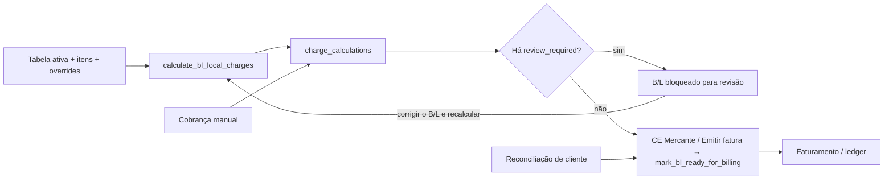

# Taxas Locais

> **Status:** ativo · **Atualizado:** 2026-10-09 · **Rotas:** operação em `/taxas-locais`; cadastro em `/taxas-locais/tabelas`; ações operacionais também partem de `/revisao` e `/bls/:blId`

## Propósito e escopo

Este módulo é o dono da configuração de tarifas locais e das operações que
transformam os dados de um B/L em linhas faturáveis. A rota
`/taxas-locais/tabelas` expõe as abas Tabelas e Condições de Cliente (overrides); a rota pai
`/taxas-locais` expõe a operação de validação e invoices. Cálculo, recálculo, revisão,
liberação para faturamento, cobranças manuais e reconciliação de cliente são
operações do mesmo domínio disparadas por outras telas.

- `src/AppInterno.tsx` monta `/taxas-locais` dentro da aplicação interna protegida.
- `src/pages/TaxasLocaisTabelas.tsx` libera leitura e edição de tabelas e
  condições negociadas a todo usuário interno ativo (ADR 0046, confirmado em
  2026-09-23). As policies de `charge_tables`, `charge_table_items` e
  `customer_rate_overrides` exigem `is_active_user()` para gravar e reservam a
  exclusão ao Administrativo; o gatilho `audit_row_changes` registra cada
  alteração com autor.
- `src/services/charges/chargeTableService.ts` e
  `src/services/charges/chargeRateService.ts` são donos do CRUD de configuração.
- `src/services/charges/chargeOperationsService.ts` é o dono das operações de
  cálculo e estado; `src/services/charges/chargeReconciliationService.ts` é o
  dono da fila de reconciliação de cliente.
- Imports disparam o cálculo inicial automático das taxas locais imediatamente (migration `072`),
  inclusive para B/Ls ainda sem cliente vinculado. CE Mercante confirma/recalcula e dispara emissão
  elegível (0042, migration `051`); revisão de cliente também reavalia a automação, respeitando o CE.
- [Faturamento](faturamento.md) consome B/Ls liberados e o ledger; este documento
  não redefine emissão, pagamento ou saldo de invoices.
- Granito aparece na fila operacional unificada, mas usa
  `src/services/graniteCharges.ts` e `granite_bls`; não compartilha o motor
  `calculate_bl_local_charges`.

### Fatura avulsa QA no Preview

No Preview autenticado da PR #797 (SHA `70f3933`), a fixture `QA S10 Financial
Battery` recebeu `INV-2026-0001` de R$ 1,00, sem B/L ou viagem. A tela mostrou
status emitida, pago R$ 0,00 e saldo aberto R$ 1,00. Esse smoke valida a leitura
do saldo da fatura avulsa no painel interno; não valida wrappers de faturamento,
Portal, comunicação ou impressão de PDF. O modal de detalhes exibiu um item QA
manual, total/saldo e zero pagamentos (seção 1.0.40 do plano); o botão de PDF
não foi acionado. Registro detalhado no plano de remediação, seção 1.0.39.

## Anatomia das telas

### Aba Tabelas em `/taxas-locais/tabelas`

Revisada na etapa 09 da revisão visual (2026-10-09). A página
(`src/pages/TaxasLocaisTabelas.tsx`) guarda o recorte na URL: `?tab=`
(`tabelas` ou `overrides`, nome mantido pelos links existentes), `?modo=`,
`?pod=` (POD normalizado), `?lente=` (Tabelas) e `?vigencia=`/`?cliente=`
(Condições de Cliente). As abas usam `TabList`.

`src/components/taxasLocais/ChargeTablesTab.tsx` lê todas as tabelas
(`useLocalChargeTables()` sem filtro) e recorta na tela, porque a situação no
cálculo de cada tabela depende de todas as tabelas do mesmo escopo, inclusive
de grafias diferentes do mesmo POD (BRVIX × BRVIT):

- filtros por modo de carga e POD (`ChargeScopeFilters`, POD escolhido entre
  os cadastrados, já na grafia do motor), lente `SegmentedControl` (Todas,
  Aplicadas, Com aviso, Inativas) e `SummaryStrip`;
- `src/components/taxasLocais/ChargeTablesList.tsx` agrupa as tabelas por
  escopo (modo de carga + POD normalizado) e diz em cada grupo qual tabela
  "vale no cálculo". `resolveChargeTableStates` (`src/pages/taxasLocaisHelpers.ts`)
  reproduz `resolve_local_charge_table_id` (migration `274`): Aplicada no
  cálculo, Não aplicada (com o nome da tabela que vence) ou Inativa. A
  vigência aparece como informativa (ADR 0040): vencida ou futura em tabela
  ativa vira aviso de que ela continua no cálculo, nunca exclusão. Tabela
  aplicada sem item automático avisa que o escopo não gera taxa;
- a linha da tabela tem uma ação visível (Editar) e o menu ⋮ (Adicionar item;
  Desativar/Reativar só para o Administrativo). Os itens abrem dentro da
  tabela, com valor, moeda e unidade (`por B/L`, `por container`,
  `por tonelada`), "Automático"/"Só manual" e perfil; abaixo de 640 px viram
  cartões;
- `src/components/taxasLocais/chargePresentation.ts` traduz o cadastro no que
  o motor faz (`resolve_bl_local_charge_items`, migration `129`): THD por
  container com perfil "Todos" vai para revisão; perfil em item que não é THD
  não separa containers; THD Padrão também é a base do container IMO e OOG
  (× 2,5); base TEU não é calculada. São avisos de leitura, não regra nova;
  se o motor mudar, o módulo precisa acompanhar;
- `src/components/taxasLocais/ChargeTableFormModal.tsx` e
  `src/components/taxasLocais/ChargeTableItemFormModal.tsx`: formulários em
  modal, com erro junto do campo e falha de gravação no próprio modal. O de
  tabela mostra antes de gravar o efeito no escopo (passa a ser a aplicada no
  lugar de outra, não será aplicada ou fica inativa) e, só no cadastro, a
  escolha "Ativa"/"Inativa" (preparar itens antes de entrar no cálculo). Na
  edição, as alterações aparecem campo a campo acima do botão (a conferência
  que antes era um segundo diálogo). Ativar e desativar saíram dos
  formulários: são do Administrativo e ficam no menu da linha;
- estados de carregamento (esqueleto), erro com Tentar novamente, vazio
  inicial e vazio do recorte com Limpar filtros.

Os tipos e defaults vivem em `src/components/taxasLocais/chargeForms.ts`;
validação e normalização vivem em `src/pages/taxasLocaisHelpers.ts` (o valor
aceita "1.420,50"; cada erro indica o campo).

### Aba Condições de Cliente (overrides) em `/taxas-locais/tabelas`

`src/components/taxasLocais/ChargeOverridesTab.tsx` contém:

- busca de Cliente por nome ou CNPJ (enviada à URL depois de uma pausa na
  digitação), filtros por modo de carga e POD e lente pela vigência de hoje
  (Vigentes hoje, Futuras, Encerradas ou desativadas);
- lista com Cliente, item e tabela de origem, vigência ("Vigente hoje",
  "Começa em", "Encerrada em", "Desativada"), valor negociado com unidade,
  valor da tabela e diferença. "Vigente hoje" é a leitura de hoje: o motor
  escolhe a condição pela data de referência do B/L (ETA da escala do POD);
- aviso quando a condição não muda a cobrança: tabela inativa ou não aplicada,
  ou item inativo;
- `src/components/taxasLocais/ChargeOverrideFormModal.tsx`: modal com Cliente
  e item por `Combobox` (Cliente por `useOverrideCustomerLookup`, mesma chave de
  `useOverrideCustomers`), valor da tabela ao lado do negociado, regra de
  vigência e conflito de sobreposição mostrado no modal. Na edição, Cliente e
  item ficam fixos;
- desativar, reativar e excluir pelo menu ⋮ do Administrativo, com
  confirmação; estados de carregamento, erro e vazio.

### Superfícies operacionais fora da rota

- `src/components/bl/BlCobrancasTab.tsx`, em `/bls/:blId`, lista linhas,
  calcula/recalcula um B/L, mantém cobranças manuais e promove os estados
  `reviewed` e `ready_for_billing`.
- `src/pages/Revisao.tsx` e
  `src/services/reviewBillingAutomation.ts` recalculam após a revisão.
- `src/components/billing/ValidacaoTab.tsx`, em `/taxas-locais`, lista a fila
  operacional, executa ações em lote, exibe o estado das reconciliações e aponta
  para a Revisão, além de emitir invoices.
  O passo "Em revisão" do funil conta todo B/L já conciliado que ainda não é
  faturável (`isPendingBillingReview` em `validacaoPipeline.ts`), incluindo os
  presos no gate de revisão (`review_status = pending_review`), e o motivo de
  bloqueio expõe a pendência canônica (ex.: peso BB ausente) via
  `extractReviewReasons`. Prontidão de Portal integra a guarda de toda emissão, manual e
  automática (ADR 0070, migration `083`); a retirada histórica na migration `188` foi
  revertida. A retenção do CE sem Portal aparece como *Portal não provisionado*. **Etapa 6 do plano de faturamento (ADR 0038, decisão 8):** o painel
  ganhou duas métricas antes do funil de revisão — "Provisório" (`charge_status
  = 'calculated'`, agora um estado real desde que a migration `263` desligou a
  promoção automática) e "Aguardando CE" (`isAwaitingCeMercante` em
  `validacaoPipeline.ts`: B/L faturável — container, carga solta ou misto —
  reconciliado e não faturado sem `ce_mercante`; até 2026-09-23 contava só
  container, embora o banco exija CE em todos os modos) — para a tela responder "o que está calculado e ainda não
  faturado, e por quê" como o plano pede. O nome da aba ("Validação") foi
  mantido: a etapa 12 do mesmo plano já dá a ela o papel de tela das duas
  fases, então o motivo original para renomear deixou de existir.
- **Etapa 12 do mesmo plano** removeu a aba Pendências (`PendenciasFaturamentoTab.tsx`)
  por ser subconjunto literal da Validação — mesma fonte, mesmo limite, só
  `chargeStatus=review_required` fixo. O botão "Recalcular todas em revisão"
  no passo 2 do funil (`ValidacaoControls.tsx`) cobre o mesmo recalculo em
  massa sem seleção manual que a aba antiga oferecia.
- Após a vinculação do CE Mercante, a automação avalia a prontidão de
  comunicação por cliente/viagem e dispara o resumo financeiro em background
  quando todos os B/Ls ativos estão prontos. A coluna de comunicação mostra o
  bloqueio, o último envio e o reenvio assistido em
  `src/components/billing/InvoiceCommunicationStatusCell.tsx`.

## Catálogo de ações

| Tela / ação | Pré-condições | Origem | Orquestração | Persistência | Efeitos e cache | Falhas | Evidência |
|---|---|---|---|---|---|---|---|
| `/taxas-locais/tabelas` · filtrar/listar tabelas | Capacidade `charge_tables`; filtros opcionais | `TaxasLocaisTabelas` → `ChargeTablesTab` → `ChargeTablesList` | `useLocalChargeTables` → `listLocalChargeTables` | `SELECT charge_tables` com `charge_table_items` | Query `queryKeys.charges.tables(filters)`; itens são ordenados por `sort_order` e nome | Erro Supabase vira estado de erro da lista | **Código:** `src/pages/TaxasLocaisTabelas.tsx`, `src/components/taxasLocais/ChargeTablesTab.tsx`, `src/components/taxasLocais/ChargeTablesList.tsx`, `src/services/charges/chargeTableService.ts` |
| `/taxas-locais/tabelas` · criar/editar tabela | Nome, POD e `valid_from`; vigência final não anterior à inicial (a vigência é informativa — ADR 0040 — e o formulário diz isso; o modal mostra o efeito no escopo antes de gravar; a lista sinaliza vigência vencida/futura e tabela ativa não aplicada por outra do mesmo escopo) | `ChargeTableFormModal` → `handleSaveTable` | `validateTableInput` → `useSaveChargeTable` → `saveChargeTable` | `INSERT` ou `UPDATE charge_tables` | Invalida `queryKeys.charges.tables()` | Erro de validação junto do campo; falha de gravação (constraint/RLS) no próprio modal, que fica aberto | **Código:** `src/components/taxasLocais/ChargeTableFormModal.tsx`, `src/components/taxasLocais/ChargeTablesTab.tsx`, `src/pages/taxasLocaisHelpers.ts`, `src/hooks/useLocalCharges.ts` · **Teste:** `src/pages/__tests__/taxasLocaisHelpers.test.ts` |
| `/taxas-locais/tabelas` · ativar/inativar tabela | Tabela existente | `ChargeTablesList` → `handleToggleTableActive` | `useSetChargeTableActive` → `setChargeTableActive` | `UPDATE charge_tables.active` | Invalida `queryKeys.charges.tables()` | Toast de falha; não recalcula B/Ls já existentes | **Código:** `src/components/taxasLocais/ChargeTablesList.tsx`, `src/components/taxasLocais/ChargeTablesTab.tsx`, `src/services/charges/chargeTableService.ts` |
| `/taxas-locais/tabelas` · adicionar/editar item | Tabela (vem da tabela aberta), nome, valor não negativo e `sort_order` inteiro não negativo | `ChargeTableItemFormModal` → `handleSaveItem` | `validateTableItemInput` → `useSaveChargeTableItem` → `saveChargeTableItem` | `INSERT` ou `UPDATE charge_table_items` | Invalida `charges.tables()`, `bls.manualChargeItems('')` e `charges.overrideItems()` | Falha no próprio modal; constraints de moeda/base/perfil podem rejeitar | **Código:** `src/components/taxasLocais/ChargeTableItemFormModal.tsx`, `src/components/taxasLocais/ChargeTablesTab.tsx`, `src/services/charges/chargeTableService.ts` · **Teste:** `src/pages/__tests__/taxasLocaisHelpers.test.ts` |
| `/taxas-locais/tabelas` · excluir item | Confirmação; item sem bloqueio referencial | `ChargeTablesList` → `handleDeleteTableItem` | `useDeleteChargeTableItem` → `deleteChargeTableItem` | `DELETE charge_table_items` | Mesmas invalidações do save de item | Mensagem informa possível vínculo com cálculos | **Código:** `src/components/taxasLocais/ChargeTablesList.tsx`, `src/components/taxasLocais/ChargeTablesTab.tsx`, `src/hooks/useLocalCharges.ts` |
| `/taxas-locais/tabelas` · filtrar/listar overrides | Capacidade `charge_overrides`; limite entre 20 e 500 | `ChargeOverridesTab` | `useCustomerRateOverrides` → `listCustomerRateOverrides` | `SELECT customer_rate_overrides` com `customers`, itens e tabelas | Query `queryKeys.charges.overrides(filters)`; Cliente e modo filtrados no serviço após a leitura completa; POD filtrado na tela pela grafia normalizada do motor; limite 500, com aviso para refinar | Erro Supabase vira erro da lista com Tentar novamente | **Código:** `src/components/taxasLocais/ChargeOverridesTab.tsx`, `src/services/charges/chargeRateService.ts` |
| `/taxas-locais/tabelas` · buscar cliente/item de override | Busca de cliente com pelo menos dois caracteres; itens ativos e não manuais, filtrados na tela por palavra | `Combobox` do `ChargeOverrideFormModal` | `useOverrideCustomerLookup` / `useOverrideChargeItems` | `SELECT customers`; `SELECT charge_table_items` + `charge_tables` | Queries `charges.overrideCustomers(search)` e `charges.overrideItems()` | Erro da query impede opções; a tela não cria opção livre | **Código:** `src/components/taxasLocais/ChargeOverridesTab.tsx`, `src/services/charges/chargeRateService.ts` |
| `/taxas-locais/tabelas` · criar/editar override | Cliente e item válidos; valor maior que zero; vigência coerente; **vigência não pode sobrepor outra condição do mesmo cliente+item** (etapa 10 do plano de faturamento, ADR 0038 decisão 5) | `handleSaveOverride` | `validateOverrideInput` → `useSaveCustomerRateOverride` → `saveCustomerRateOverride` → `findOverlappingCustomerRateOverride` | `INSERT` ou `UPDATE customer_rate_overrides`; restrição de exclusão `customer_rate_overrides_no_overlap` (migration `267`, GiST em `customer_id`/`charge_item_id`/`daterange(valid_from,valid_to,'[]')`) é a autoridade final | Invalida `charges.overrides()` e `bls.localChargeLines('')` | Toast de falha; erro de validação é exibido antes da chamada; conflito de vigência mostra qual condição existente colide e seu período (checagem no app antes de gravar; violação da restrição no banco — código `23P01`, corrida entre duas telas — cai no mesmo texto amigável) | **Código:** `src/components/taxasLocais/ChargeOverridesTab.tsx`, `src/pages/taxasLocaisHelpers.ts`, `src/services/charges/chargeRateService.ts` · **Teste:** `src/pages/__tests__/taxasLocaisHelpers.test.ts`, `src/services/charges/__tests__/chargeRateService.overlap.test.ts`, `src/services/__tests__/customerRateOverridesNoOverlapMigration.test.ts` |
| `/taxas-locais/tabelas` · excluir override | Confirmação | `handleDeleteOverride` | `useDeleteCustomerRateOverride` → `deleteCustomerRateOverride` | `DELETE customer_rate_overrides` | Mesmas invalidações do save de override | Toast de falha | **Código:** `src/components/taxasLocais/ChargeOverridesTab.tsx`, `src/hooks/useLocalCharges.ts` |
| B/L/revisão · calcular ou recalcular um B/L | B/L existente; usuário ativo; `recalculate` define limpeza/reuso; CE Mercante exigido para emitir (não mais para calcular) em `cargo_mode=container`; **B/L com `financial_status IN ('invoiced','partially_paid','paid')` é recusado** (etapa 2 do plano de faturamento, ADR 0038 achado 6) | `BlCobrancasTab`, `Revisao`, `reviewBillingAutomation`, `ceMercanteImport` | `useCalculateBlLocalCharges` ou chamada direta → `calculateBlLocalCharges`; `maybeAutoBillAfterCeMercante` tenta cálculo+emissão após CE para B/L container reconciliado por documento | RPC `calculate_bl_local_charges` → `charge_calculations`, estado e auditoria do B/L; automação pode emitir invoice | Invalida linhas do B/L, detalhe, lista de B/Ls, `charges.operations()`/`pendencies()` e viagens | RPC propaga ausência de tabela, dados inválidos e demais regras; automação sempre calcula (etapa 4, ADR 0038 achado 11) e só bloqueia a **emissão** enquanto o CE estiver vazio; UI mostra toast no cálculo manual. `calculateBlLocalCharges` consulta `bls.financial_status` antes de chamar a RPC e recusa localmente com mensagem clara se o B/L já foi faturado; a migration `262` replica a mesma trava dentro da própria RPC, cobrindo chamada direta fora do app. `charge_status` não é mais promovido automaticamente de `calculated` para `ready_for_billing` (migration `263` remove `trg_promote_calculated_bl_ready`, etapa 3, ADR 0038 decisão 8) — a promoção só acontece dentro da emissão (`mark_bl_ready_and_create_invoice`, pelo CE Mercante ou pelo botão **Emitir fatura**). Falha **inesperada** da automação pós-CE é registrada no Histórico do B/L (`bl_auto_billing_failed`) e, na edição da ficha, também num toast; reimport de CE de B/L já faturado é no-op benigno registrado como info (`ce_reimport_already_invoiced`). | **Código:** `src/components/bl/BlCobrancasTab.tsx`, `src/pages/Revisao.tsx`, `src/services/reviewBillingAutomation.ts`, `src/services/ceMercanteImport.ts`, `src/services/operationalEvents.ts`, `src/services/charges/chargeOperationsService.ts` · **Teste:** `src/services/__tests__/localCharges.test.ts`, `src/services/__tests__/reviewBillingAutomation.test.ts`, `src/services/__tests__/ceMercanteImport.test.ts` |
| B/L importado · cálculo inicial automático | Import confirmado; actor válido | RPC de importação | `import_bl_freight_with_metadata` dispara `calculate_bl_local_charges` síncrono no DB; só enfileira `provisional_charges` quando esse cálculo falha, como recuperação assíncrona idempotente | `calculate_bl_local_charges`; `charge_calculations` e estado do B/L; `sync_local_charge_receivable` retorna `NULL` se cliente pendente | Invalida `local-charge-operations`, `customer-reconciliation-queue`, `bl-local-charge-lines` e demais caches via `afterManifestoImportado` | B/L sem cliente calcula taxas normalmente pelas tabelas vigentes; recálculo automático com condições especiais ocorre na vinculação do cliente (`approve_customer_reconciliation` ou `relink_bl_customer`), gerando o recebível (`bl_receivables`); falhas ficam no retorno da RPC, em `audit_logs` e no toast da importação | **Código:** `src/components/shared/BlImportModal.tsx`, `src/services/blFreightImport.ts`, migration `072_local_charges_auto_calculation_on_import.sql`; **Teste:** `src/components/shared/__tests__/BlImportModal.test.tsx`, `src/services/__tests__/blFreightImport.test.ts`, `src/services/__tests__/localChargesAutoCalculationMigration.test.ts` |
| `/taxas-locais` · calcular/recalcular selecionados | Seleção não vazia; IDs locais separados de Granito | `ValidacaoTab.runBatchOperation` | `useBatchCalculateLocalCharges` → `calculateLocalChargesBatch`; Granito chama `calculateGraniteBlCharges` | RPC `calculate_bl_local_charges_batch` em chunks de até 100, com fallback sequencial por chunk; persistência própria para Granito | Invalida `charges.operations()`/`pendencies()`, B/Ls, `bls.detail('')` e viagens; a tela também invalida invoices e resumo de B/Ls | Lote continua após erro e toast reporta contagem e descrição do primeiro erro. B/Ls já faturados são retirados da seleção antes de chamar a RPC e reportados à parte ("X recalculado(s), Y ignorado(s) — já faturados"), em vez de contarem como erro (`isBlLockedForRecalc`/`isBlFinanciallyLocked`) | **Código:** `src/components/billing/ValidacaoTab.tsx`, `src/components/billing/validacaoPipeline.ts`, `src/lib/chargeStatus.ts`, `src/hooks/useLocalCharges.ts` · **Teste:** `src/components/billing/__tests__/validacaoFunnel.test.ts`, `src/services/charges/__tests__/chargeOperationsService.test.ts` |
| `/taxas-locais` (Validação) · exportar planilha de conferência | Filtro/seleção com ao menos um B/L com linha calculada | `ValidacaoControls` → `ValidacaoTab.handleExportConference` | `buildLocalChargeConferenceRows` → CSV via `exportLocalChargeConferenceCsv`/`downloadCsv` (`src/lib/csv.ts`) | `SELECT` em `bls`, `charge_calculations` (join `charge_table_items`) e `bl_containers` para os B/Ls do escopo | Nenhuma (leitura, download local) | Toast informa quando não há B/Ls/linhas no escopo; erro de query cai em toast genérico. **Etapa 5 do plano de faturamento** (docs/archive/plans/2026-08-06-faturamento-ajuste-completo.md): conferência do cálculo provisório por B/L e por item, com origem do preço (tabela padrão vs Condição de Cliente) e marcação de container compartilhado (`share_count`). **Gap conhecido:** o plano também pede o mesmo botão na tela de Viagem; `/viagens/:voyageId` não tem hoje uma aba financeira onde encaixar isso sem uma mudança de UI maior, então essa parte não foi entregue. | **Código:** `src/components/billing/ValidacaoTab.tsx`, `src/components/billing/ValidacaoControls.tsx`, `src/services/charges/chargeOperationsService.ts`, `src/services/exports.ts` · **Teste:** `src/services/__tests__/localChargeConference.test.ts` |
| B/L · adicionar cobrança manual | Item elegível, quantidade válida e B/L não faturado conforme RPC | `BlCobrancasTab` → `ManualChargeFormFields` | `useAddManualBlCharge` → `addManualBlCharge` | RPC `add_manual_bl_charge` → `charge_calculations` e auditoria | Invalida linhas/detalhe/lista do B/L, pendências e viagens | RPC/validação bloqueia item ou estado inválido | **Código:** `src/components/bl/BlCobrancasTab.tsx`, `src/services/charges/chargeOperationsService.ts` · **Teste:** `src/services/__tests__/localCharges.test.ts`, `src/components/billing/__tests__/ManualChargeFormFields.test.tsx` |
| B/L · editar cobrança manual | Linha manual existente e B/L elegível | `BlCobrancasTab` | `useUpdateManualBlCharge` → `updateManualBlCharge` | RPC `update_manual_bl_charge` | Invalida linhas/detalhe/lista do B/L e pendências | RPC rejeita linha automática, ausente ou invoice protegida | **Código:** `src/components/bl/BlCobrancasTab.tsx`, `src/hooks/useLocalCharges.ts`, `supabase/migrations_archive/108_guard_manual_charges_and_clear_pix_on_reversal.sql` |
| B/L · excluir cobrança manual | Linha manual existente e confirmação da tela | `BlCobrancasTab` | `useDeleteManualBlCharge` → `deleteManualBlCharge` | RPC `delete_manual_bl_charge` | Mesmas invalidações da edição | RPC rejeita linha automática, ausente ou invoice protegida | **Código:** `src/components/bl/BlCobrancasTab.tsx`, `src/services/charges/chargeOperationsService.ts`, `supabase/migrations_archive/108_guard_manual_charges_and_clear_pix_on_reversal.sql` |
| ~~B/L ou lote · marcar revisado~~ | — | — | — | Removido em 2026-10-01 (ADR 0077, migration `127`): a confirmação do cálculo é o CE Mercante; linha `review_required` se resolve corrigindo o B/L e recalculando. A RPC `mark_bl_charges_reviewed` não tem `EXECUTE` para a API; a ação em lote já não existia na Validação. | — | — | **Teste local-pg:** `invoiceReissue.local-pg.test.ts` |
| B/L · Emitir fatura (manual) | Administrativo; B/L com Cliente, CE Mercante, cálculo feito, sem linha `review_required` e ainda não faturado | `BlCobrancasTab` (botão **Emitir fatura**, com confirmação) e Validação (**Emitir fatura** por linha) | `markBlReadyAndCreateInvoice` / `createInvoiceFromBls` | RPC `mark_bl_ready_and_create_invoice` (promove com `mark_bl_ready_for_billing` e emite na mesma transação) | Invalida faturas, detalhe e lista de B/Ls, operações e fila de revisão | Banco aplica CE, Portal, Cliente e gate de revisão. O caminho normal é automático; o manual cobre Reemissão pendente com trava resolvida e falha da emissão automática. “Pronto para faturar” foi removido em 2026-10-01 (ADR 0077). | **Código:** `src/components/bl/BlCobrancasTab.tsx` · **Teste:** `src/components/bl/__tests__/BlCobrancasTab.behavior.test.tsx` |
| `/taxas-locais` · acompanhar e reenviar comunicado financeiro | Invoice local do cliente; prontidão completa para envio inicial ou comunicado anterior para reenvio | `InvoiceCommunicationStatusCell` | `useCustomerVoyageCommunicationStatus` → `fetchCustomerVoyageCommunicationStatus`; reenvio confirmado → `dispatchCeMercanteTaxasCommunication({ forceRetry: true })` | `customer_local_charges_communication_readiness()`; trilha `customer_communications`/tentativas | Mostra “Enviado automaticamente”, “Reenviado manualmente” ou motivo de bloqueio; invalida status após reenvio | Falha de leitura mostra status indisponível; confirmação pode ser cancelada; contato/supressão/chave global bloqueia ou simula | **Código:** `src/components/billing/InvoiceCommunicationStatusCell.tsx`, `src/services/customerFinanceCommunications.ts`, `supabase/migrations_archive/376_customer_local_charges_communication_readiness.sql` · **Teste:** `src/services/__tests__/customerFinanceCommunications.test.ts`, `src/components/billing/__tests__/InvoiceCommunicationStatusCell.test.tsx` |
| `/taxas-locais` · apontar a conciliação para a Revisão | B/L com conciliação pendente | `ValidacaoOperationsTable` (expansão) | Nenhuma mutação: a tela exibe cliente do manifesto, CNPJ, sugestão e detecção inline no bloco "Detalhes", sem caixa separada | O callout do bloqueio concentra o único link `/revisao?bl=` — a decisão é da Revisão (ADR 0061) | — | Sem item na fila, a expansão exibe a mensagem inline no bloco "Detalhes" | **Código:** `src/components/billing/ValidacaoOperationsTable.tsx`; **Teste:** `src/components/billing/__tests__/ValidacaoOperationsTable.test.tsx` |

## Estado e dados

### Famílias canônicas de query keys

Definidas em `src/services/queryKeys.ts`:

| Família | Forma exata | Conteúdo |
|---|---|---|
| `queryKeys.charges.tables(filters)` | `['local-charge-tables', filters]` | Tabelas e itens |
| `queryKeys.charges.operations(filters?)` | sem filtro: `['local-charge-operations']`; com filtro: `['local-charge-operations', filters]` | Fila operacional local + Granito |
| `queryKeys.charges.overrides(filters)` | `['local-charge-overrides', filters]` | Condições de Cliente (overrides) |
| `queryKeys.charges.overrideItems()` | `['local-charge-override-items']` | Itens automáticos ativos elegíveis |
| `queryKeys.charges.overrideCustomers(search)` | `['local-charge-override-customers', search]` | Clientes do seletor |
| `queryKeys.charges.pendencies()` | `['local-charge-pendencies']` | Pendências de cálculo |
| `queryKeys.bls.localChargeLines(blId)` | `['bl-local-charge-lines', blId]` | Linhas calculadas/manuais do B/L |
| `queryKeys.bls.manualChargeItems(blId)` | `['manual-charge-items', blId]` | Itens manuais disponíveis para o B/L |
| `queryKeys.billingRuns.list(limit)` | `['billing-runs', limit]` | Runs exibidos após reconciliação |
| `queryKeys.billingRuns.detail(id)` | `['billing-run-detail', id]` | Detalhe de run |
| `queryKeys.reconciliation.queue(status, limit)` | `['customer-reconciliation-queue', status, limit]` | Fila de reconciliação de cliente |

### Invalidações reais das mutations

| Mutation | Invalidações executadas |
|---|---|
| salvar/ativar tabela | `charges.tables()` |
| salvar/excluir item | `charges.tables()`, `bls.manualChargeItems('')`, `charges.overrideItems()` |
| salvar/excluir override | `charges.overrides()`, `bls.localChargeLines('')` |
| adicionar cobrança manual | `bls.localChargeLines(blId)`, `bls.detail(blId)`, `bls.all()`, `charges.pendencies()`, `voyages.all()` |
| editar/excluir cobrança manual | linhas, detalhe e lista do B/L; `charges.pendencies()` |
| revisar um B/L | linhas, detalhe e lista do B/L; pendências e viagens |
| liberar um B/L | linhas, detalhe e lista do B/L; pendências, viagens e `invoices.all()` |
| calcular um B/L | linhas, detalhe e lista do B/L; `charges.operations()`, pendências e viagens |
| calcular/revisar/liberar lote | `charges.operations()`, pendências, B/Ls e `bls.detail('')`; cálculo/liberação também invalidam viagens |
| aprovar/rejeitar reconciliação | `reconciliation.queue()`, `charges.operations()`, `billingRuns.list(50)`, B/Ls e `bls.detail('')` |

### Persistência e ownership

- `charge_tables` possui escopo, vigência e ativação da tabela. A vigência é
  informativa (ADR 0040): `resolve_local_charge_table_id` (migration `274`)
  resolve por `cargo_mode` + POD normalizado + `active`, e desempata entre
  ativas por `valid_from DESC, id DESC`. Desativar ("Desativar tabela") é a única forma de tirar
  uma tabela do cálculo.
- `charge_table_items` possui categoria, base de aplicação, perfil, moeda e
  valor unitário; `manual_only` separa itens automáticos dos adicionáveis.
  `applies_to_soc` (migration `121`, padrão `true`; opção "Cobra de container
  SOC" no item) com `false` faz `resolve_bl_local_charge_items` contar só os
  containers que não são SOC, com o mesmo rateio de container compartilhado e o
  mesmo filtro de perfil. A migration marcou `false` nos itens Drop Off Fee e
  Damage Protection Fee existentes; item novo com essa regra precisa da opção
  desligada no cadastro.
- `customer_rate_overrides` possui a substituição por cliente/item/vigência e,
  desde a migration `091`, `active`: override desativado não entra em cálculos
  novos nem disputa a vigência com um override novo.
- Tarifa usada só se desativa (ADR 0073; migration `091`): excluir tabela, item
  ou override referenciado por cálculo, item de fatura ou versão de regra de
  preço é recusado pelo trigger `trg_guard_used_tariff_delete`, com a mensagem
  "desative em vez de excluir". Desativar e reativar tabela, item e override são
  do Administrativo (`trg_guard_tariff_active_change`); a tela só mostra essas
  ações a ele.
- `charge_calculations` possui as linhas efetivamente calculadas ou manuais.
- `bls.charge_status`, timestamps e `billing_hold_reason` resumem o workflow,
  mas as linhas e seus motivos continuam em `charge_calculations`.
- `customer_reconciliation_queue` possui a decisão pendente; o B/L possui o
  estado resumido usado pelos gates.
- `audit_logs` registra transições e operações relevantes; a fila operacional
  lê o último evento quando a policy permite.

## Fluxos e invariantes

### THD de container IMO e OOG

O motor cobra o container IMO e OOG ao mesmo tempo pelo THD normal com 150% de majoração (× 2,5), numa linha própria (`auto:item:<THD standard>:imo_oog`) derivada do item standard da tabela ou da Condição do Cliente, com o mesmo rateio de container compartilhado e a mesma regra de SOC. Não pede revisão (migration `129`, decisão de 2026-10-02).

### Correção de B/L após faturamento

Após emissão, a cobrança fica congelada. Correção do B/L (reimportação, Baplie ou alteração direta) reemite sozinha a fatura sem pagamento; com pagamento, acréscimos usam avulsa e reduções abatem saldo antes de restituir, automaticamente. A avulsa pode selecionar itens manuais desta tabela, exigindo B/L e usando Condição do Cliente; USD converte por ROE na emissão. Ver [Faturamento](faturamento.md#correção-após-emissão-adr-0077).


B/L misto consome as tabelas container e carga solta através de
`resolve_bl_local_charge_table_ids` (`056`). A taxa com `application_basis = 'bl'`
incide só do lado container; falta parcial de tabela gera pendência específica.
`059` estende o mesmo resolvedor ao catálogo/lançamento manual e `062` corrige
quantidades BB. Terminal não seleciona preço. O catálogo de tabelas continua
com `container`, `carga_solta` e `granito`, sem cadastro separado de `misto`.



```mermaid
flowchart LR
    Config["Tabela ativa + itens + overrides"] --> Calc["calculate_bl_local_charges"]
    Calc --> Lines["charge_calculations"]
    Lines --> Review{"Há review_required?"}
    Review -->|sim| Hold["B/L bloqueado para revisão"]
    Hold -->|"corrigir o B/L e recalcular"| Calc
    Review -->|não| Ready["CE Mercante / Emitir fatura → mark_bl_ready_for_billing"]
    Ready --> Billing["Faturamento / ledger"]
    Manual["Cobrança manual"] --> Lines
    Reconcile["Reconciliação de cliente"] --> Ready
```

- A tabela aplicável é resolvida por modo, POD normalizado e data; overrides
  vigentes substituem o valor do item.
- `calculate_bl_local_charges` é a fronteira de cálculo. Recálculo preserva
  linhas manuais conforme o contrato SQL vigente.
- `mark_bl_ready_for_billing` é a fronteira de promoção: cliente precisa estar
  vinculado e em estado aceito, o gate canônico
  `compute_bl_review_pendencies` precisa estar vazio, não pode haver linha de
  taxa pendente e deve existir ao menos uma linha faturável (BRL ou USD) e uma
  tabela vigente. A definição vigente de `mark_bl_ready_for_billing` está em
  `supabase/migrations_archive/129_review_gate_hardening.sql` +
  `supabase/migrations_archive/268_local_charges_usd_conversion_at_emission.sql`; a de
  `compute_bl_review_pendencies` está nas migrations ativas `051` (assinaturas
  públicas) e `059` (núcleo `_compute_bl_review_pendencies`). A `188` havia
  reduzido o gate a cliente vinculado, e-mail cadastrado e peso BB; a `337`
  (ADR 0054) devolveu *Acesso ao portal nao provisionado*. Desde a `083`
  (ADR 0070), o Portal bloqueia também a emissão automática pela transição do
  CE: sem Portal pronto nem Liberação de faturamento sem Portal vigente, o CE
  calcula, retém a fatura e grava o motivo em `billing_hold_reason`. Ao abrir
  o gate (Liberação ou Portal ativo), a retida sai com esse cálculo do dia do
  CE, sem recalcular pela tabela vigente; a conversão de USD segue a regra da
  emissão (ROE vigente). Desde a `085`, *Cliente sem e-mail cadastrado* não é
  mais pendência, com ou sem Portal (ver **Gate de faturamento do Portal** em
  `CONTEXT.md`).
- **Taxa local em USD (ADR 0038 decisão 6, achado 7, migration 268):** linha
  em USD deixou de bloquear `mark_bl_ready_for_billing`. Converte para BRL na
  emissão da fatura (`create_invoice_from_bls_core` /
  `create_local_consolidated_invoice_core`), pelo ROE vigente em
  `exchange_rate_reference`, congelado com o resto da fatura — sem o
  Recálculo Diário que o Demurrage usa. A Condição de Cliente de item em
  dólar é valor em dólar e entra antes da conversão (migration `171`). `mark_bl_ready_for_billing` chama
  `sync_local_charge_receivable` diretamente para manter o saldo do ledger
  atualizado (inclusive convertendo linhas USD), no lugar do trigger
  `trg_emit_invoice_on_bl_ready` removido na mesma migration (ver
  `docs/RASTREABILIDADE.md` para o motivo da remoção).
- **Arredondamento do rateio (ADR 0038 achado 9, migration 269):** itens
  `application_basis='container_distinct_voyage'` (containers compartilhados
  por vários B/Ls) somavam `1/share_count` de cada container do B/L numa
  quantidade agregada e arredondavam o total independentemente por B/L — um
  item de R$ 100 dividido em 3 B/Ls dava R$ 33,33 em cada um, R$ 99,99 no
  total. Agora o cálculo soma por container, e o último B/L do grupo (maior
  `bl_id`) absorve a diferença de arredondamento, em BRL e em USD, então a
  soma das partes sempre fecha o valor cheio do item por container. A
  quantidade fracionária gravada em `charge_calculations.quantity` continua
  sendo a soma informativa de `1/share_count` — só o total em dinheiro mudou
  de fórmula, então o produto visual "unitário × quantidade" pode não bater
  exatamente com o total exibido para o B/L que absorveu o resto (a soma do
  grupo inteiro é que fecha, não cada linha isolada). A fatura impressa marca
  a quantidade como fração do container compartilhado para que `1/7` não seja
  lido como unidade inteira.
- **Cálculo inicial e vinculação posterior de cliente (migration `072`):** `sync_local_charge_receivable` não aborta com erro quando `v_bl.customer_id IS NULL`. Retorna `NULL`, permitindo o cálculo e armazenamento imediato de linhas e subtotais tarifários na importação de B/Ls com base nas tabelas vigentes. Assim que o cliente é vinculado ou alterado (`approve_customer_reconciliation` ou `relink_bl_customer`), o B/L pendente é recalculado automaticamente com as eventuais Condições de Cliente cadastradas e o recebível no ledger (`bl_receivables`) é gerado/sincronizado.
- O estado aceito na migration atual é `matched_document` ou `reconciled`;
  `ValidacaoTab` usa o mesmo helper canônico e mantém `matched_name` como
  pendente até aprovação manual.
- Operações em lote usam chunks de até 100 B/Ls; cada chunk pode concluir ou
  falhar independentemente, e o fallback sequencial fica restrito ao chunk que
  apresentou erro.
- `listLocalChargeOperationalRows` combina `bls` e `granite_bls`, mas os motores
  e transições de Granito permanecem separados.
- A UI de `/taxas-locais/tabelas` não exibe a fila operacional. Esse limite é
  sustentado por `src/pages/__tests__/TaxasLocaisTabelas.test.ts`.

## Testes e validação

O lote comportamental de 2026-06-23 executou 9 arquivos e 37 testes com sucesso.
Além dos contratos existentes, a rota e os componentes foram exercidos para
criação, edição, ativação/inativação, exclusão confirmada, seleção da primeira
aba autorizada e paginação completa antes dos filtros de overrides.

| Arquivo | Evidência coberta |
|---|---|
| `src/pages/__tests__/TaxasLocaisTabelas.test.ts` | Rota contém somente Tabelas e Condições de Cliente; `?tab=overrides` e `?cliente=` antigos |
| `src/pages/__tests__/taxasLocaisHelpers.test.ts` | Validação de tabela, item e override |
| `src/services/__tests__/localCharges.test.ts` | Cálculo, linhas, itens manuais, fila paginada e promoção para faturamento |
| `src/services/__tests__/financialValidation.test.ts` | Validações financeiras reutilizadas nas superfícies relacionadas |
| `src/components/billing/__tests__/ManualChargeFormFields.test.tsx` | Estados de criação/edição da cobrança manual |
| `src/services/__tests__/guardInvoiceableReadyStateMigration.test.ts` | **Teste de contrato SQL** do gate de valor BRL faturável |
| `src/services/__tests__/guardManualChargesMigration.test.ts` | **Teste de contrato SQL** dos bloqueios de cobranças manuais |
| `src/components/taxasLocais/__tests__/TaxasLocais.behavior.test.tsx` | Agrupamento por escopo, tabela aplicada/não aplicada, avisos de vigência e de item, modais com erro junto do campo e falha no modal, CRUD de tabelas, itens e condições, permissões |
| `src/components/taxasLocais/__tests__/chargePresentation.test.ts` | Notas do motor por item, leitura da tabela, prévia do escopo, condição sem efeito, vigência de hoje |
| `src/services/__tests__/chargeRateService.test.ts` | Pagina toda a fonte antes de filtrar e limitar overrides |

Comando focado:
`npm test -- --run src/components/taxasLocais/__tests__/TaxasLocais.behavior.test.tsx src/components/taxasLocais/__tests__/chargePresentation.test.ts src/pages/__tests__/TaxasLocaisTabelas.test.ts src/pages/__tests__/TaxasLocais.test.ts src/pages/__tests__/taxasLocaisHelpers.test.ts src/services/__tests__/chargeRateService.test.ts src/services/__tests__/localCharges.test.ts src/services/__tests__/queryKeysPrefix.test.ts src/components/billing/__tests__/ManualChargeFormFields.test.tsx src/services/__tests__/guardInvoiceableReadyStateMigration.test.ts src/services/__tests__/guardManualChargesMigration.test.ts`.

## Notas e divergências

- **Invalidação por prefixo validada.** As factories de tabelas, overrides,
  reconciliação e detalhes agora retornam uma chave-base real quando chamadas
  sem argumento. `src/services/__tests__/queryKeysPrefix.test.ts` protege esse
  contrato.
- **Gate de reconciliação alinhado.** A interface considera resolvidos somente
  `matched_document` e `reconciled`, os mesmos estados aceitos por
  `mark_bl_ready_for_billing`.
- **Overrides são filtrados no cliente após paginação completa.** A consulta
  percorre a fonte em páginas de 500 registros, aplica nome/documento, modo e
  POD e somente então limita a visão. Isso preserva correção sem depender da
  posição do override no histórico.
- **Granito é uma agregação visual, não um único domínio de cobrança.** Revisão
  em lote de Granito retorna sucesso sem escrita, e a liberação usa update
  direto de `granite_bls`.
- **Condição de Cliente vale na moeda do item (migration `171`, 2026-10-09).**
  Até a `129`, `resolve_bl_local_charge_items` aplicava `override_value` só ao
  valor em reais: item em USD saía pelo `unit_value_usd` da tabela e gravava
  `override_applied = true`. A `171` usa o valor negociado no lado USD quando o
  item é em dólar, inclusive na linha IMO+OOG (× 2,5), como já faziam o
  lançamento manual (`list_manual_charge_items_for_bl`) e a fatura avulsa.
  Cálculos já gravados mudam no próximo cálculo ou recálculo do B/L; B/L
  faturado não é recalculado. **Teste local-pg:**
  `src/integration/conditionUsd.local-pg.test.ts`.
- **Efeitos da `171` (migration `172`, 2026-10-09, decisões da revisão da PR
  923).** Item de Taxa com Condição de Cliente ativa não troca de moeda: o
  valor negociado guarda só o número, na moeda do item, e trocar a moeda o
  reinterpretaria (R$ 1.200 viraria US$ 1.200). O banco recusa (trigger
  `charge_table_items_currency_locked_by_condition`) e o modal de item trava a
  moeda dizendo quantas condições a usam; para cobrar em outra moeda,
  cadastra-se um item novo. A `172` também recalcula, uma vez, os B/Ls não
  faturados e não cancelados que ainda tinham linha automática em item USD com
  `override_applied = true` (a marca do erro da `129`). B/L faturado não muda;
  a lista dos que foram faturados acima do negociado sai da consulta abaixo e
  vai para o financeiro decidir a devolução pelas ferramentas existentes:

  ```sql
  SELECT b.id AS bl, c.name AS cliente, i.id AS fatura, cti.name AS item,
         cc.quantity, cc.unit_value_usd AS cobrado_usd, cro.override_value AS negociado_usd,
         cc.total_value_usd - ROUND(cc.quantity * cro.override_value, 2) AS diferenca_usd
  FROM charge_calculations cc
  JOIN charge_table_items cti ON cti.id = cc.charge_item_id AND cti.currency = 'USD'
  JOIN bls b ON b.id = cc.bl_id
  JOIN customers c ON c.id = b.customer_id
  JOIN customer_rate_overrides cro ON cro.customer_id = b.customer_id AND cro.charge_item_id = cti.id
  LEFT JOIN invoice_bls ib ON ib.bl_id = b.id
  LEFT JOIN invoices i ON i.id = ib.invoice_id
  WHERE COALESCE(cc.source, 'auto') = 'auto' AND cc.override_applied
    AND cc.unit_value_usd IS DISTINCT FROM cro.override_value
    AND b.financial_status IN ('invoiced', 'partially_paid', 'paid');
  ```

  Pela afirmação "Data status" do `AGENTS.md`, hoje produção só tem dados de
  teste; a consulta passa a importar quando houver dado real. **Teste
  local-pg:** `conditionUsd.local-pg.test.ts` (trava de moeda e recálculo).
- **Escopo da tabela na tela segue `normalize_port_code` do banco.** A tela
  agrupa as tabelas pela mesma lista exata de aliases da função do banco
  (SANTOS/SSZ → BRSSZ, BRVIT/VITORIA/VIX → BRVIX…), sem "contém"; o rótulo do
  escopo mostra o código canônico do banco.
- **Data de referência da avulsa diverge do cálculo (Código).** A cotação da
  fatura avulsa com item da tabela (`quote_manual_invoice_charge`, migration
  `123`) escolhe a condição pela data do lote/criação do B/L, não pela ETA da
  escala do POD (`CONTEXT.md`, Data de Referência da Tarifa). Registrado para a
  etapa 10 e o dono do Faturamento.
- `pricing_rule_versions` não participa deste caminho atual; cálculo e
  transições registram evidência principalmente em `audit_logs`.

### Segurança da correção automática — migration 130

O saldo pagável determina o QR local, sem alterar total/itens emitidos; versões
anteriores permanecem rastreáveis. Faturas pagas/canceladas não oferecem QR.
Restituição de correção usa os settlements do recebível e pode ser distribuída
entre individual e consolidada. Pagamento de outro B/L não financia essa
restituição. A baixa que sustenta uma restituição não pode ser estornada.

O evento COD criado na mesma operação é vinculado à correção automática e
marcado liquidado, sem repetir abatimento ou devolução. O alerta Fatura
desatualizada só fecha quando todos os recebíveis relacionados concordam com
Cliente e cálculo atuais. Alteração de participação em container compartilhado
também verifica os B/Ls vizinhos, preservando as travas de edição existentes.

Se o efeito financeiro falhar, `invoice_basis_pending_changes` conserva a
pendência; o Administrativo usa **Tentar aplicar correção** no histórico da
fatura. `retry_invoice_basis_changes` reexecuta o cálculo atual e mantém a
pendência se houver erro. Salvar B/L invalida também faturas, vínculos,
restituições, alertas, ledger e consultas do Portal.
