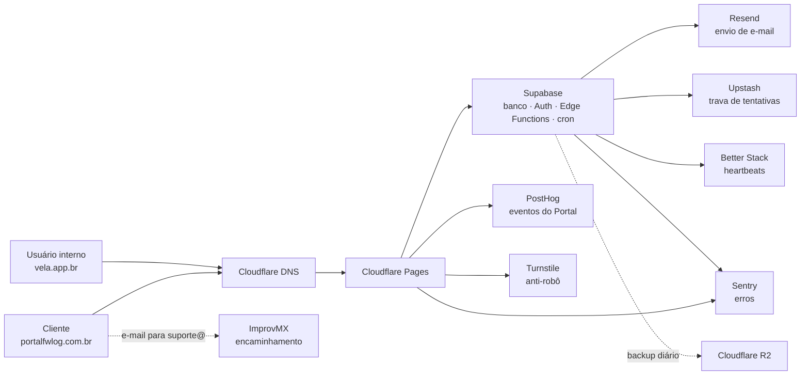

# Manual dos serviços externos

Inventário de **todas** as contas e plataformas de que o Vela e o Portal Fwlog
dependem: para que servem, como se entra, o que está configurado, onde moram os
segredos e o que quebra se cada uma parar. Escrito para quem assumir a operação
sem ter participado da configuração.

- **Estado em:** 2026-09-24, durante a migração da Vercel para o Cloudflare
  Pages ([roteiro](../plans/2026-09-24-configuracao-servicos-e-migracao-cloudflare.md)).
  Itens marcados **(transição)** mudam na Etapa 10 do roteiro.
- **Nunca** escreva valores de segredo aqui. Este documento lista **nomes** e
  **onde** o valor está guardado.
- Ao mudar qualquer configuração de serviço, atualize esta página na mesma PR.

## Mapa geral

## Quem é dono de quê

| Serviço | Conta / login | Plano |
|---|---|---|
| GitHub | repositório `luccafwlog/vela` | — |
| Supabase | login com GitHub; projeto de produção `fgmkhbzhaeebrsizwccx` | — |
| Cloudflare | `luccafwlog@gmail.com`; conta `b9f47a26b8f708444419dac863a54cd4`; time Zero Trust `icy-term-9505` | Free / Zero Trust Free |
| Vercel **(transição)** | time `luccafwlogs-projects`; projetos `vela` e `fwlog-portal` | Hobby (limite de 100 deploys/dia) |
| Registro.br | titular dos domínios `vela.app.br`, `portalfwlog.com.br`, `transhippingdesk.com.br` | — |
| Resend | conta que envia por `transhippingdesk.com.br` e `portalfwlog.com.br` | — |
| ImprovMX | domínios `transhippingdesk.com.br` e `portalfwlog.com.br` | — |
| Upstash | database `vela-rate-limit` (`sa-east-1`) | — |
| Sentry | organização com projetos `vela` e `portal` | — |
| PostHog | região **EU** (`eu.posthog.com`) | — |
| Better Stack | Uptime: 2 monitores e 4 heartbeats | Free (avisa a equipe inteira) |
| Computador do backup | usuário Windows `Lucca`, pasta `C:\Users\Lucca\Downloads\Vela` | — |

Ao transferir a responsabilidade, siga o [checklist de passagem](#passagem-de-responsabilidade).

## Onde os segredos estão guardados

| Lugar | O que guarda | Quem lê |
|---|---|---|
| Supabase → **Edge Functions → Secrets** | segredos das Edge Functions (lista na seção [Supabase](#supabase)) | Edge Functions; o painel mostra só um *digest*, nunca o valor |
| Supabase → **Vault** (`vault.secrets`) | segredos que os jobs `pg_cron` enviam às Functions | só o banco; ver [segredos-cron.md](segredos-cron.md) |
| GitHub → **Settings → Secrets and variables → Actions** | tokens de deploy e valores públicos de build | workflows |
| GitHub → environment **`cloudflare-production`** | as 7 variáveis `VITE_*` do build de produção do Pages | só o workflow de produção, só na branch `main` |
| Vercel → **Environment Variables** **(transição)** | `VITE_*` dos dois projetos | build da Vercel |
| Windows do computador do backup → **variáveis do usuário** | `SUPABASE_DB_URL`, `BACKUP_ENCRYPTION_KEY_HEX`, `R2_*`, `BACKUP_ALLOW_PRODUCTION` | tarefa agendada do backup |
| Windows → **Gerenciador de Credenciais** | `VelaBackup/R2AccessKeyId`, `VelaBackup/R2SecretAccessKey`, `VelaBackup/EncryptionKey` | o dono, para reconfigurar o backup |
| iCloud Senhas do dono | `vela-backup` (chave de cifragem), `supabase-db-vela` (senha do banco) | cópia fora do computador |

A chave de cifragem do backup existe **só** no Gerenciador de Credenciais e no
iCloud Senhas. Sem ela, nenhum backup do R2 pode ser aberto.

---

## Domínios e DNS

### Registro.br

Registro dos três domínios. A partir de 2026-09-24, `vela.app.br` e
`portalfwlog.com.br` delegam para a Cloudflare (`ariadne.ns.cloudflare.com`,
`pablo.ns.cloudflare.com`). `transhippingdesk.com.br` continua com o DNS do
próprio Registro.br.

- **DNSSEC:** ativo nos dois domínios desde 2026-09-24. A chave fica na
  Cloudflare (**DNS → Settings → DNSSEC**). O DS correspondente está no
  Registro.br (**Alterar servidores DNS → + DNSSEC**): keytag `2371` nos dois,
  com digests diferentes. Antes de trocar de novo os servidores DNS, **remova o
  DS** no Registro.br e espere cerca de 2 horas. Com um DS antigo publicado, o
  domínio deixa de resolver.
- **Renovação:** confira a data de expiração de cada domínio no painel do
  Registro.br; domínio expirado derruba site e e-mail.

### Cloudflare DNS

| Domínio | Registro | Valor | Para quê |
|---|---|---|---|
| `vela.app.br` | `CNAME @` | `vela-internal.pages.dev` (nuvem laranja) | site no Cloudflare Pages |
| | `TXT @` | `v=spf1 -all` | o domínio não envia e-mail |
| | `TXT _dmarc` | `v=DMARC1; p=reject;` | rejeitar e-mail falso em nome do Vela |
| | `A www` | `192.0.2.1` (nuvem laranja) | endereço fictício; só existe para a Redirect Rule do `www` |
| `portalfwlog.com.br` | `CNAME @` | `vela-portal.pages.dev` (nuvem laranja) | site no Cloudflare Pages |
| | `MX @` | `mx1.improvmx.com` (10), `mx2.improvmx.com` (20) | receber e-mail (ImprovMX) |
| | `TXT @` | `v=spf1 include:spf.improvmx.com ~all` | SPF do domínio raiz |
| | `TXT resend._domainkey` | chave pública DKIM mostrada pelo Resend | assinatura do envio |
| | `CNAME send`, `CNAME rsend` | alvos `*.forge.rmta.net` mostrados pelo Resend (nuvem cinza) | SPF/retorno do envio (Resend) |
| | `TXT _dmarc` | `v=DMARC1; p=none; rua=mailto:suporte@portalfwlog.com.br; fo=1` | política e relatórios DMARC |
| | `A www` | `192.0.2.1` (nuvem laranja) | endereço fictício; só existe para a Redirect Rule do `www` |

**Redirect Rules** (em cada zona: **Rules → Redirect Rules**). A regra
**"www para raiz"** vai de `https://www.<domínio>/*` para
`https://<domínio>/${1}`, com 301 e preservando a query string. Conferido em
2026-09-24: `https://www.<domínio>/teste?x=1` → 301 para
`https://<domínio>/teste?x=1` nos dois domínios. O `A www` precisa ficar com
proxy (laranja): sem proxy a regra não roda e o `www` não abre. Não aponte o
`www` para a Vercel nem para o Pages; o redirecionamento é da Cloudflare.

Regras:

- O `CNAME @` de cada domínio é criado e mantido pelo **Custom domain** do
  projeto Pages. Não o edite à mão; para trocar, remova o domínio no projeto.
- Registros do Resend ficam **DNS only** (nuvem cinza). O `CNAME @` do Pages e o
  `A www` ficam com proxy.
- **Volta para a Vercel (até 2026-10-01):** apague o `CNAME @` e crie
  `A @ 216.198.79.1` com nuvem **cinza** (proxy na frente da Vercel quebra o
  certificado); depois remova o custom domain do projeto Pages.
- `transhippingdesk.com.br` guarda o e-mail legado (ImprovMX e Resend); não é
  servido pela Cloudflare.

---

## Hospedagem do front-end

O repositório gera dois sites a partir do mesmo código: **Vela** (interno,
`index.html`) e **Portal** (cliente, `portal.html`).

### Cloudflare Pages (produção)

Serve os dois domínios desde 2026-09-24 (Etapa 10).

| Projeto | Endereço `pages.dev` | Domínio (Custom domain, Active) |
|---|---|---|
| `vela-internal` | `vela-internal.pages.dev` | `vela.app.br` |
| `vela-portal` | `vela-portal.pages.dev` | `portalfwlog.com.br` |

- **Upload direto**, sem integração Git. Não configure build pelo painel: o
  `npm run build` com `dist` publicaria o app interno no lugar do Portal.
- **Produção:** `.github/workflows/cloudflare-pages-production.yml`, a cada
  merge no `main`, ligado pela variável `CLOUDFLARE_PAGES_PRODUCTION_ENABLED=true`.
- **Previews:** `.github/workflows/cloudflare-pages-preview.yml` publica
  `pr-<n>.vela-internal.pages.dev` e `pr-<n>.vela-portal.pages.dev` contra o banco
  da branch de preview do Supabase; `cloudflare-pages-preview-cleanup.yml` apaga
  ao fechar a PR. Só publica com `CLOUDFLARE_PAGES_ACCESS_CONFIGURED=true`.
- **Cabeçalhos de segurança (CSP):** gerados por
  `scripts/cloudflare-pages-stage.mjs`; mudam junto com o `vercel.json`
  ([deploy.md](../setup/deploy.md#content-security-policy)).
- **Token:** GitHub secret `CLOUDFLARE_PAGES_API_TOKEN` (Pages: Edit).

### Cloudflare Access (proteção das previews)

Cloudflare One → **Access controls → Applications**:
`vela-internal - Cloudflare Pages` (`*.vela-internal.pages.dev`) e
`vela-portal - Cloudflare Pages` (`*.vela-portal.pages.dev`). Política
**Allow Members - Cloudflare Pages**: Include → Emails → `luccafwlog@gmail.com`;
o login é pela conta Cloudflare. O `*.` protege só as previews; os endereços de
produção `*.pages.dev` ficam abertos.

Ao passar a responsabilidade, troque o e-mail da política pelo do novo
responsável.

### Vercel (transição)

**Reserva até 2026-10-01.** Desde 2026-09-24 os domínios apontam para o Pages;
a Vercel não recebe mais tráfego e fica de pé só para a volta rápida (ver
[Cloudflare DNS](#cloudflare-dns)). Projetos `vela` e `fwlog-portal`, ligados
ao GitHub; cada PR e merge gera deploy. Plano Hobby: **100 deploys por dia**,
somados; ao estourar, os checks "Vercel – …" falham com *Deployment rate
limited* e o site continua na versão anterior. `vercel.json` define rotas e
CSP. Vercel Web Analytics e Speed Insights só carregam no build da Vercel
(`VITE_HOSTED_ON_VERCEL`). Sai na Etapa 10, depois de 7 dias sem problema no
Pages.

---

## Supabase

Banco PostgreSQL, Auth, Storage, Edge Functions e jobs agendados. Projeto de
produção `fgmkhbzhaeebrsizwccx`. Cada PR ganha uma **branch de preview** com
banco próprio (check "Supabase Preview").

- **Acesso administrativo:** painel pelo login com GitHub; CLI com
  `supabase login`. O CI usa `SUPABASE_ACCESS_TOKEN` e `SUPABASE_PROJECT_REF`.
- **Senha do banco:** só alfanumérica; guardada em `supabase-db-vela` (iCloud
  Senhas) e usada apenas pelo backup. Nada no repositório usa essa senha.
- **Usuário técnico do Auth:**
  `portal-login-dummy@portal-interno.transhippingdesk.invalid`
  (`91abc3b0-96ab-49b0-9a7d-750d5e7d9e84`). **Não apague**: sem ele o login do
  Portal devolve 500 para todos.

### Edge Functions

`admin-users`, `alerts-detector`, `customer-communication-auto-runner`,
`demurrage-dunning`, `import-effects-runner`, `portal-account-suspend`,
`portal-daily-digest`, `portal-dispute-attachment`, `portal-email-events-runner`,
`portal-email-webhook`, `portal-invite-activate`, `portal-invite-send`,
`portal-login`, `portal-password-recovery`, `portal-password-reset`,
`portal-recovery-email-change`, `recalc-demurrage-ptax`,
`send-customer-communication`.

Publicação manual: `supabase functions deploy <nome> --project-ref fgmkhbzhaeebrsizwccx`.
Um merge **não** publica Functions. Para conferir, baixe o código publicado com
`supabase functions download` e compare com o `main`.

### Secrets das Edge Functions

| Grupo | Nomes | Serviço de origem |
|---|---|---|
| Plataforma (automáticos) | `SUPABASE_URL`, `SUPABASE_ANON_KEY`, `SUPABASE_SERVICE_ROLE_KEY`, `SUPABASE_DB_URL`, `SUPABASE_JWKS`, `SUPABASE_PUBLISHABLE_KEYS`, `SUPABASE_SECRET_KEYS` | Supabase |
| Portal | `PORTAL_URL`, `PORTAL_TECH_EMAIL_DOMAIN`, `PORTAL_LOGIN_DUMMY_AUTH_USER_ID` | — |
| E-mail | `RESEND_API_KEY`, `RESEND_WEBHOOK_SECRET`, `PORTAL_FROM_EMAIL`, `PORTAL_REPLY_TO`, `PORTAL_SUPPORT_EMAIL`, `COMMUNICATIONS_REPLY_TO`, `DEMURRAGE_REPLY_TO` | Resend |
| Anti-robô | `TURNSTILE_SECRET_KEY` (e opcional `TURNSTILE_ALLOWED_HOSTNAMES`) | Cloudflare Turnstile |
| Trava de tentativas | `UPSTASH_REDIS_REST_URL`, `UPSTASH_REDIS_REST_TOKEN`, `PORTAL_RATE_LIMIT_HMAC_SECRET` (e opcionais `PORTAL_RATE_LIMIT_*`) | Upstash |
| Jobs | `ALERTS_DETECTOR_SECRET`, `CUSTOMER_COMMUNICATION_AUTOMATION_SECRET`, `DEMURRAGE_DUNNING_SECRET`, `PORTAL_DIGEST_SECRET` (par com o Vault) | — |
| Monitoramento | `BETTERSTACK_HEARTBEAT_*_URL` (4), `SENTRY_DSN`, `SENTRY_ENVIRONMENT` | Better Stack, Sentry |
| CORS legado | `VERCEL_PREVIEW_ORIGINS` **(transição)** | Vercel |

`PORTAL_EMAIL_EVENTS_CRON_SECRET`, `IMPORT_EFFECTS_CRON_SECRET` e
`RECALC_CRON_SECRET` existem no código, mas não estão cadastrados em produção:
os runners correspondentes não têm job agendado.

### Jobs agendados (`pg_cron`)

| Job | Frequência (UTC) | Heartbeat no Better Stack |
|---|---|---|
| `alerts-foundation-detectors` | a cada 15 min | `alerts-detector` |
| `customer-communication-auto-runner` | a cada 15 min | `customer-communication-auto-runner` |
| `demurrage-dunning` | de hora em hora | `demurrage-dunning` |
| `portal-daily-digest` | 11:00 (08:00 de Brasília) | `portal-daily-digest` |
| `portal-mark-expired-invites` | a cada 15 min | — |
| `portal-refresh-general-pendencies` | a cada 15 min | — |
| `cleanup-portal-sessions` | 03:00 | — |
| `cleanup-provision-rate-limit` | 03:30 | — |

Rotação de segredo de job: sempre o **par** Edge Function Secret + Vault
([segredos-cron.md](segredos-cron.md)).

---

## E-mail

### Resend (envio)

Envia convites, recuperação de senha, digest diário, Comunicados e cobrança de
Demurrage, sempre pelas Edge Functions (o navegador nunca chama o Resend).

| Uso | Remetente | Resposta vai para |
|---|---|---|
| Acesso ao Portal (convite, senha, digest) | `PORTAL_FROM_EMAIL` | `PORTAL_REPLY_TO` = `suporte@portalfwlog.com.br` |
| Comunicados | `PORTAL_FROM_EMAIL` | `COMMUNICATIONS_REPLY_TO` = `importacao@fwlog.com.br` |
| Cobrança de Demurrage (régua automática) | `PORTAL_FROM_EMAIL` | `DEMURRAGE_REPLY_TO` = `eqp@fwlog.com.br` |

- **Domínios:** `portalfwlog.com.br` (**Verified**, região São Paulo; é o
  remetente desde 2026-09-24) e `transhippingdesk.com.br` (verificado, legado;
  serve de reserva se o envio pelo domínio novo falhar).
- **Secrets atuais:** `PORTAL_FROM_EMAIL` = `Portal Fwlog <no-reply@portalfwlog.com.br>`;
  `PORTAL_REPLY_TO` e `PORTAL_SUPPORT_EMAIL` = `suporte@portalfwlog.com.br`.
  Conferido em 2026-09-24 por "Esqueci minha senha" no Portal: o e-mail saiu
  com esse remetente e esse endereço de resposta. Não troque o remetente para
  um domínio que não esteja **Verified** no Resend: os e-mails param de sair.
- **Webhook:** o Resend avisa entregas, bounces e reclamações em
  `portal-email-webhook`, assinado com `RESEND_WEBHOOK_SECRET`. Bounces e
  reclamações alimentam as listas de supressão.
- **Receiving** do Resend fica **desligado**: o recebimento é do ImprovMX.

### ImprovMX (recebimento)

Não há caixa de e-mail nos domínios do sistema; o ImprovMX só encaminha.

| Endereço | Encaminha para |
|---|---|
| `suporte@portalfwlog.com.br` | `importacao@fwlog.com.br`, `lucca.juliatti@fwlog.com.br` |
| endereços de `transhippingdesk.com.br` | legado; conferir no painel |

Encaminhamento conferido em 2026-09-24: um e-mail enviado de um endereço
externo chegou às duas caixas.

`suporte@portalfwlog.com.br` é o endereço impresso nos e-mails aos clientes
(`src/services/customerCommunicationTemplates.ts`) e o destino dos relatórios
DMARC. Ao trocar de responsável, troque também o destino pessoal do alias.

---

## Segurança do Portal

### Cloudflare Turnstile

Widget `Portal Fwlog` (modo Managed, sem pre-clearance), hostnames
`portalfwlog.com.br`, `vela-portal.pages.dev`, `localhost`. Protege
`/portal/login` e `/portal/esqueci-senha`.

- **Site Key** (pública): `VITE_TURNSTILE_SITE_KEY` na Vercel **(transição)** e
  no environment `cloudflare-production` do GitHub.
- **Secret Key:** `TURNSTILE_SECRET_KEY` no Supabase.
- **Ordem obrigatória:** Site Key no ar antes do secret; ao desligar, apague o
  secret primeiro. Na ordem errada, todo login e recuperação recebem 403.
- As previews não recebem Site Key e mostram o login sem widget.

### Upstash (segunda trava de tentativas)

Database Redis `vela-rate-limit` (`sa-east-1`), acessado só pelas Edge Functions
do Portal. Conta erros por IP+CNPJ (10 em 5 min) e só **acrescenta** bloqueio; a
trava que decide é a do Supabase (5 erros em 15 min por CNPJ, ADR 0049). Se o
Upstash cair, o login continua funcionando com a trava do Supabase.
Detalhes: [portal-rate-limit.md](portal-rate-limit.md).

---

## Observabilidade

### Sentry (erros)

| Projeto | Recebe | Onde está o DSN |
|---|---|---|
| `vela` | app interno e **todas** as Edge Functions | `VITE_SENTRY_DSN_INTERNAL` (build), `SENTRY_DSN` (Supabase) |
| `portal` | Portal do cliente | `VITE_SENTRY_DSN_PORTAL` (build) |

O ambiente vem de `VITE_SENTRY_ENVIRONMENT` (`production` no workflow de
produção do Pages, `preview` nas previews) e de `SENTRY_ENVIRONMENT` no Supabase.
Alertas: "Novo erro em produção — Vela e Portal" (novo issue ou regressão, e-mail
ao responsável) e os alertas automáticos de alta prioridade. O build da Vercel
usa o DSN antigo compartilhado; desde 2026-09-24 ele não serve mais os domínios.
Mais: [sentry-configuracao.md](sentry-configuracao.md), [observabilidade.md](observabilidade.md).

### PostHog (eventos de produto)

Região **EU**. Só o Portal envia eventos (`invoice_viewed`, `invoice_paid`,
`dispute_opened`, na tela de faturas), sem URL, CNPJ ou e-mail; captura
automática, gravação de sessão e cookies desligados (`src/lib/featureFlags.ts`).
No Pages, o Vela também carrega a chave, mas não envia eventos.
Variáveis: `VITE_POSTHOG_KEY`, `VITE_POSTHOG_HOST` = `https://eu.i.posthog.com`.

### Better Stack (site no ar e rotinas)

- **Monitores** a cada 3 min: `https://vela.app.br/` e
  `https://portalfwlog.com.br/portal/login`.
- **Heartbeats** (tabela dos [jobs](#jobs-agendados-pg_cron)): a rotina chama a
  URL a cada execução e acrescenta `/fail` quando falha. Heartbeat **Down** logo
  após cadastrar quase sempre é nome de secret errado.
- Sem escalation policy: no plano grátis o aviso vai à equipe inteira (e-mail do
  responsável).

---

## Backup

Backup lógico diário do schema `public`, cifrado (AES-256-GCM) antes de sair do
computador, no bucket R2 `vela-database-backups`, prefixo
`vela/database/production/fgmkhbzhaeebrsizwccx/`. Auth e Storage **não** entram;
para eles vale o backup do próprio Supabase.

- **Onde roda:** Agendador de Tarefas do Windows, tarefa
  `Backup Diario Vela R2`, diariamente às 09:00, programa
  `C:\Windows\System32\cmd.exe`, argumentos
  `/c node scripts\backup-r2.mjs --execute --allow-production --environment production --project-ref fgmkhbzhaeebrsizwccx`,
  iniciar em `C:\Users\Lucca\Downloads\Vela`. Se o computador estiver desligado,
  roda quando ligar. **Computador parado = sem backup.**
- **Programas:** Node 24, PostgreSQL 17 (só as ferramentas de linha de comando)
  e AWS CLI v2.
- **Retenção:** regra "Expire backups after 90 days" no bucket.
- **Token R2:** Account API Token `vela-backup-diario` (Access Key ID começa com `5b22`), Object Read & Write só nesse bucket, sem validade. Criado em 2026-09-24; os tokens antigos foram apagados.
- **Validar um backup:** `node scripts/backup-r2.mjs --verify <arquivo>.dump.enc`
  (trimestral). Procedimento completo: [backup-r2.md](backup-r2.md).
- **Mudar de computador:** instalar os programas, recriar as 7 variáveis do
  usuário (roteiro, Etapa 6) e a tarefa agendada.

---

## GitHub

- **Workflows:** `ci.yml` (testes, build, migrations), `cloudflare-pages-*.yml`
  (Pages), `provision-preview-admin.yml` (usuário admin na branch de preview).
- **Secrets:** `CLOUDFLARE_PAGES_API_TOKEN`, `SUPABASE_ACCESS_TOKEN`,
  `SUPABASE_PROJECT_REF`, `VITE_SUPABASE_URL`, `VITE_SUPABASE_ANON_KEY` (build do
  CI), `PREVIEW_ADMIN_PASSWORD` (admin das previews) e
  `FIREBASE_SERVICE_ACCOUNT_TRANSHIPPING_DESK` (legado, nenhum workflow usa;
  candidato a remoção).
- **Variables:** `CLOUDFLARE_ACCOUNT_ID`, `CLOUDFLARE_PAGES_ACCESS_CONFIGURED`,
  `CLOUDFLARE_PAGES_PRODUCTION_ENABLED`.
- **Regras:** o `main` exige revisão; merges sem revisor usam `--admin`, com
  autorização do dono a cada PR.

## Serviços públicos sem conta

- **Banco Central (PTAX):** `olinda.bcb.gov.br`, cotação usada no faturamento.
- **Google Fonts:** `fonts.googleapis.com`, `fonts.gstatic.com`.

---

## Passagem de responsabilidade

Ao entregar a operação para outra pessoa:

1. Convidar a pessoa como membro/administrador em cada serviço da tabela
   [Quem é dono de quê](#quem-é-dono-de-quê) e no GitHub.
2. Transferir ou compartilhar a titularidade dos domínios no Registro.br.
3. Trocar o e-mail da política do Cloudflare Access.
4. Trocar os destinos pessoais do ImprovMX (`lucca.juliatti@fwlog.com.br`).
5. Entregar a chave de cifragem do backup por canal seguro e, se o backup mudar
   de computador, reconfigurar a tarefa agendada.
6. Rotacionar os segredos que o responsável anterior conhecia: senha do banco,
   tokens do R2, do Pages e do Supabase, `RESEND_API_KEY`.
7. Confirmar que os alertas do Sentry e do Better Stack chegam ao novo
   responsável.
8. Remover o acesso do responsável anterior.
