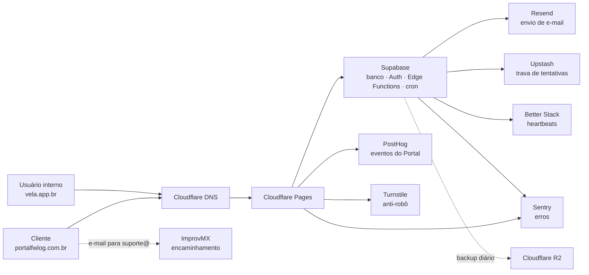

# Manual dos serviços externos

Inventário de **todas** as contas e plataformas de que o Vela e o Portal Fwlog
dependem: para que servem, como se entra, o que está configurado, onde moram os
segredos e o que quebra se cada uma parar. Escrito para quem assumir a operação
sem ter participado da configuração.

- **Estado em:** 2026-09-28, após a migração da Vercel para o Cloudflare
  Pages ([roteiro executado](../archive/plans/2026-09-24-configuracao-servicos-e-migracao-cloudflare.md)).
- **Nunca** escreva valores de segredo aqui. Este documento lista **nomes** e
  **onde** o valor está guardado.
- Ao mudar qualquer configuração de serviço, atualize esta página na mesma PR.

## Mapa geral


```mermaid
flowchart LR
    U["Usuário interno<br/>vela.app.br"] --> DNS["Cloudflare DNS"]
    C["Cliente<br/>portalfwlog.com.br"] --> DNS
    DNS --> HOST["Cloudflare Pages"]
    HOST --> SB["Supabase<br/>banco · Auth · Edge Functions · cron"]
    SB --> RS["Resend<br/>envio de e-mail"]
    SB --> UP["Upstash<br/>trava de tentativas"]
    SB --> BS["Better Stack<br/>heartbeats"]
    SB --> SE["Sentry<br/>erros"]
    HOST --> SE
    HOST --> PH["PostHog<br/>eventos do Portal"]
    HOST --> TS["Turnstile<br/>anti-robô"]
    C -. "e-mail para suporte@" .-> IM["ImprovMX<br/>encaminhamento"]
    SB -. "backup diário" .-> R2["Cloudflare R2"]
```

## Quem é dono de quê

| Serviço | Conta / login | Plano |
|---|---|---|
| GitHub | repositório `luccafwlog/vela` | — |
| Supabase | login com GitHub; projeto de produção `fgmkhbzhaeebrsizwccx` | — |
| Cloudflare | `luccafwlog@gmail.com`; conta `b9f47a26b8f708444419dac863a54cd4`; time Zero Trust `icy-term-9505` | Free / Zero Trust Free |
| Vercel (rollback manual) | time `luccafwlogs-projects`; projetos `vela` e `fwlog-portal`, Git desconectado | Hobby |
| Registro.br | titular dos domínios `vela.app.br`, `portalfwlog.com.br`, `transhippingdesk.com.br` | — |
| Resend | conta que envia por `transhippingdesk.com.br` e `portalfwlog.com.br` | — |
| ImprovMX | domínios `transhippingdesk.com.br` e `portalfwlog.com.br` | — |
| Upstash | database `vela-rate-limit` (`sa-east-1`) | — |
| Sentry | organização com projetos `vela` e `portal` | — |
| PostHog | região **EU** (`eu.posthog.com`) | — |
| Better Stack | Uptime: 2 monitores e 4 heartbeats | Free (avisa a equipe inteira) |
| Computador do backup | usuário Windows `Lucca`, pasta `C:\Users\Lucca\Downloads\Vela` | — |

Ao transferir a responsabilidade, siga o [checklist de passagem](#passagem-de-responsabilidade).

## Onde os segredos estão guardados

| Lugar | O que guarda | Quem lê |
|---|---|---|
| Supabase → **Edge Functions → Secrets** | segredos das Edge Functions (lista na seção [Supabase](#supabase)) | Edge Functions; o painel mostra só um *digest*, nunca o valor |
| Supabase → **Vault** (`vault.secrets`) | segredos que os jobs `pg_cron` enviam às Functions | só o banco; ver [segredos-cron.md](segredos-cron.md) |
| GitHub → **Settings → Secrets and variables → Actions** | tokens de deploy e valores públicos de build | workflows |
| GitHub → environment **`cloudflare-production`** | 7 variáveis `VITE_*` e secret `CLOUDFLARE_PAGES_API_TOKEN` (2026-10-07); deployment restrito à branch `main` | só o workflow de produção |
| GitHub → environment **`cloudflare-pages`** | secret `CLOUDFLARE_PAGES_API_TOKEN` (2026-10-07); sem restrição de branch | jobs `publish` da Preview, limpeza e provisionamento do Pages |
| GitHub → environment **`supabase-branches`** | secrets `SUPABASE_ACCESS_TOKEN` (PAT de 2026-10-08) e `PREVIEW_ADMIN_PASSWORD` (2026-10-07); sem restrição de branch | job `prepare` da Preview e `provision-preview-admin` |
| Windows do computador do backup → **variáveis do usuário** | `SUPABASE_DB_URL`, `BACKUP_ENCRYPTION_KEY_HEX`, `R2_*`, `BACKUP_ALLOW_PRODUCTION` | tarefa agendada do backup |
| Windows → **Gerenciador de Credenciais** | `VelaBackup/R2AccessKeyId`, `VelaBackup/R2SecretAccessKey`, `VelaBackup/EncryptionKey` | o dono, para reconfigurar o backup |
| iCloud Senhas do dono | `vela-backup` (chave de cifragem), `supabase-db-vela` (senha do banco) | cópia fora do computador |

A chave de cifragem do backup existe **só** no Gerenciador de Credenciais e no
iCloud Senhas. Sem ela, nenhum backup do R2 pode ser aberto.

---

## Domínios e DNS

### Registro.br

Registro dos três domínios. A partir de 2026-09-24, `vela.app.br` e
`portalfwlog.com.br` delegam para a Cloudflare (`ariadne.ns.cloudflare.com`,
`pablo.ns.cloudflare.com`). `transhippingdesk.com.br` continua com o DNS do
próprio Registro.br.

- **DNSSEC:** ativo nos dois domínios desde 2026-09-24. A chave fica na
  Cloudflare (**DNS → Settings → DNSSEC**). O DS correspondente está no
  Registro.br (**Alterar servidores DNS → + DNSSEC**): keytag `2371` nos dois,
  com digests diferentes. Antes de trocar de novo os servidores DNS, **remova o
  DS** no Registro.br e espere cerca de 2 horas. Com um DS antigo publicado, o
  domínio deixa de resolver.
- **Renovação:** confira a data de expiração de cada domínio no painel do
  Registro.br; domínio expirado derruba site e e-mail.

### Cloudflare DNS

| Domínio | Registro | Valor | Para quê |
|---|---|---|---|
| `vela.app.br` | `CNAME @` | `vela-internal.pages.dev` (nuvem laranja) | site no Cloudflare Pages |
| | `TXT @` | `v=spf1 -all` | o domínio não envia e-mail |
| | `TXT _dmarc` | `v=DMARC1; p=reject;` | rejeitar e-mail falso em nome do Vela |
| | `A www` | `192.0.2.1` (nuvem laranja) | endereço fictício; só existe para a Redirect Rule do `www` |
| `portalfwlog.com.br` | `CNAME @` | `vela-portal.pages.dev` (nuvem laranja) | site no Cloudflare Pages |
| | `MX @` | `mx1.improvmx.com` (10), `mx2.improvmx.com` (20) | receber e-mail (ImprovMX) |
| | `TXT @` | `v=spf1 include:spf.improvmx.com ~all` | SPF do domínio raiz |
| | `TXT resend._domainkey` | chave pública DKIM mostrada pelo Resend | assinatura do envio |
| | `CNAME send`, `CNAME rsend` | alvos `*.forge.rmta.net` mostrados pelo Resend (nuvem cinza) | SPF/retorno do envio (Resend) |
| | `TXT _dmarc` | `v=DMARC1; p=none; rua=mailto:suporte@portalfwlog.com.br; fo=1` | política e relatórios DMARC |
| | `A www` | `192.0.2.1` (nuvem laranja) | endereço fictício; só existe para a Redirect Rule do `www` |

**Redirect Rules** (em cada zona: **Rules → Redirect Rules**). A regra
**"www para raiz"** vai de `https://www.<domínio>/*` para
`https://<domínio>/${1}`, com 301 e preservando a query string. Conferido em
2026-09-24: `https://www.<domínio>/teste?x=1` → 301 para
`https://<domínio>/teste?x=1` nos dois domínios. O `A www` precisa ficar com
proxy (laranja): sem proxy a regra não roda e o `www` não abre. Não aponte o
`www` para a Vercel nem para o Pages; o redirecionamento é da Cloudflare.

Regras:

- O `CNAME @` de cada domínio é criado e mantido pelo **Custom domain** do
  projeto Pages. Não o edite à mão; para trocar, remova o domínio no projeto.
- Registros do Resend ficam **DNS only** (nuvem cinza). O `CNAME @` do Pages e o
  `A www` ficam com proxy.
- **Volta para a Vercel:** apague o `CNAME @` e crie
  `A @ 216.198.79.1` com nuvem **cinza** (proxy na frente da Vercel quebra o
  certificado); depois remova o custom domain do projeto Pages.
- `transhippingdesk.com.br` guarda o e-mail legado (ImprovMX e Resend); não é
  servido pela Cloudflare.

---

## Hospedagem do front-end

O repositório gera dois sites a partir do mesmo código: **Vela** (interno,
`index.html`) e **Portal** (cliente, `portal.html`).

### Cloudflare Pages (produção)

Serve os dois domínios desde 2026-09-24 (Etapa 10).

| Projeto | Endereço `pages.dev` | Domínio (Custom domain, Active) |
|---|---|---|
| `vela-internal` | `vela-internal.pages.dev` | `vela.app.br` |
| `vela-portal` | `vela-portal.pages.dev` | `portalfwlog.com.br` |

- **Upload direto**, sem integração Git. Não configure build pelo painel: o
  `npm run build` com `dist` publicaria o app interno no lugar do Portal.
- **Produção:** `.github/workflows/cloudflare-pages-production.yml`, a cada
  merge no `main`, ligado pela variável `CLOUDFLARE_PAGES_PRODUCTION_ENABLED=true`.
- **Previews:** `.github/workflows/cloudflare-pages-preview.yml` publica
  `pr-<n>.vela-internal.pages.dev` e `pr-<n>.vela-portal.pages.dev` contra o banco
  da branch de preview do Supabase; `cloudflare-pages-preview-cleanup.yml` apaga
  ao fechar a PR. Só publica com `CLOUDFLARE_PAGES_ACCESS_CONFIGURED=true`.
- **Cabeçalhos de segurança (CSP):** gerados por
  `scripts/cloudflare-pages-stage.mjs`; mudam junto com os workflows e o staging do Pages
  ([deploy.md](../setup/deploy.md#headers-rotas-e-cors)).
- **Pages Function `functions/assets/[[path]].ts`:** os dois projetos (`wrangler
  pages deploy` compila `functions/` do diretório de trabalho do workflow, que é a
  checkout confiável) recebem uma Function em `/assets/*`: arquivo inexistente →
  `404` com `Cache-Control: no-store`; asset real → `immutable` definido pela
  Function (`_headers` não vale para respostas de Functions). Cada requisição de
  `/assets/*` conta na cota de invocações de Functions do plano. O workflow de
  produção confere o 404 sem cache após publicar (incidente de 2026-10-07: HTML do
  fallback SPA cacheado como chunk JS, app em branco).
- **Token:** secret `CLOUDFLARE_PAGES_API_TOKEN` nos environments GitHub
  `cloudflare-pages` e `cloudflare-production`. O valor é o User API Token
  `GitHub Actions — Vela e Portal Fwlog Pages` (Cloudflare Pages: Edit, uma
  conta), criado em 2026-10-07. Em 2026-10-08 a cópia Repository-level foi
  apagada e o Account API Token anterior, `Vela Pages CI/CD` (Pages Write), foi
  revogado. Na conta ficam só `vela-backup-diario` (R2, backup) como Account API
  Token. Histórico: os runs `37608023373`, `37619183889`, `37626476950`, `37629073181`
  e `37630494893` receberam o secret e o ID de conta, mas `GET /pages/projects`
  falhou com HTTP 400 / código `80000024`; os dois últimos informaram
  `Invalid list options provided`, mesmo após `per_page` mudar de 25 para 20.
  A operação foi redesenhada para consultar cada projeto conhecido pela rota
  individual `GET /pages/projects/{project_name}` documentada pela
  [Cloudflare Pages API](https://developers.cloudflare.com/api/resources/pages/subresources/projects/methods/get/),
  e só criar quando a resposta for HTTP 404. O run `37631613061` em `main`
  concluiu com sucesso: os projetos `vela-internal` e `vela-portal` já existiam
  e foram deixados inalterados. Isso valida a credencial e a consulta individual
  no provisionador. Em 2026-10-08, Preview (run `37819195317`), limpeza (run
  `37820173005`, que removeu deployments antigos) e produção também passaram
  com o token dos environments.

### Cloudflare Access (proteção das previews)

Cloudflare One → **Access controls → Applications**:
`vela-internal - Cloudflare Pages` (`*.vela-internal.pages.dev`) e
`vela-portal - Cloudflare Pages` (`*.vela-portal.pages.dev`). Política
**Allow Members - Cloudflare Pages**: Include → Emails → `luccafwlog@gmail.com`;
o login é pela conta Cloudflare. O `*.` protege só as previews; os endereços de
produção `*.pages.dev` ficam abertos.

Ao passar a responsabilidade, troque o e-mail da política pelo do novo
responsável.

### Vercel (rollback manual, sem publicação automática)

Em 2026-09-28, os projetos `vela` e `fwlog-portal` ficaram sem conexão Git. Os domínios de produção e os domínios legados não estão associados a eles. Os projetos e deployments existentes permanecem na conta como opção de rollback manual; nenhum tráfego de produção depende deles. O build ativo e os headers são os do Cloudflare Pages.

Para retomar a Vercel, restaure a configuração de build do Vite, reconecte o Git, associe o domínio e faça o cutover DNS descrito em [Cloudflare DNS](#cloudflare-dns). Valide o site antes de remover o domínio do Pages.

---
## Supabase

Banco PostgreSQL, Auth, Storage, Edge Functions e jobs agendados. Projeto de
produção `fgmkhbzhaeebrsizwccx`. O projeto GitHub é `luccafwlog/vela`.
Automatic branching está **desligado** (conferido em 2026-10-07); portanto,
abrir uma PR não cria por si só uma branch Supabase nem garante o check
"Supabase Preview". A integração permite criar uma branch pontual e vinculá-la
a uma branch GitHub. O painel informa custo de US$ 0,01344 por hora enquanto a
branch existir, sem impostos; removê-la encerra essa cobrança. Branches novas
não copiam dados de produção por padrão.

Para uma Preview pontual sem ligar Automatic branching: em Supabase → projeto
Vela → Branching → Create branch, informe o nome da branch de Preview e a mesma
branch GitHub da PR em "Sync with Git branch". A integração publica commits
nessa branch. Manter a PR aberta até o check Supabase Preview e o workflow
Cloudflare Pages Preview concluírem; remover a branch após os testes para
encerrar o custo. Conferir a criação e a exclusão no painel. A página Branching
estava sem branches persistentes ou de Preview na conferência de 2026-10-08;
`codex/run2-manual-preview-probe` já tinha sido removida.

- **Acesso administrativo:** painel pelo login com GitHub; CLI com
  `supabase login`. O CI usa `SUPABASE_ACCESS_TOKEN` e `SUPABASE_PROJECT_REF`.
  O environment GitHub `supabase-branches` guarda, além de
  `PREVIEW_ADMIN_PASSWORD`, o PAT escopado ao projeto `fgmkhbzhaeebrsizwccx`,
  criado em 2026-10-08 e com três permissões, todas `Read`:
  - `API Keys`: o CLI obtém as chaves públicas da branch;
  - `Development Branches`: `branches list` e `branches get`;
  - `Connection Pooling` (`database_pooling_config_read`): sem ela, o
    `branches get` do CLI 2.113 responde 403 e as Previews falham.
  `API Key Secrets` e qualquer permissão de escrita ficam em `None`. O painel
  mostra o PAT (`GitHub Actions — Vela Preview branches v2`) sem expiração;
  revogue-o e gere outro se houver suspeita de exposição.
  Validação: em 2026-10-08, com esse PAT, os workflows Provision Preview Admin e
  Cloudflare Pages Preview da PR 903 concluíram com sucesso.
  Histórico: o PAT de 2026-10-07 (sem `Connection Pooling`) e o PAT exposto
  numa saída de acessibilidade já não existiam na conferência de 2026-10-08, e a
  cópia Repository-level de `SUPABASE_ACCESS_TOKEN` foi apagada nesse dia.
  Os outros tokens da conta são os `cli_*` do `supabase login` nos computadores
  do dono e `Muse all org` (bot do dono, acesso à organização inteira, vence em
  2026-10-10).
- **Team da organização:** só `luccafwlog@gmail.com` (Owner). O SMTP padrão do
  Auth só entrega a membros do Team; testes de e-mail do Auth precisam de
  endereço membro (em 2026-10-08 um alias entrou temporariamente e foi
  removido).
- **Senha do banco:** só alfanumérica; guardada em `supabase-db-vela` (iCloud
  Senhas) e usada apenas pelo backup. Nada no repositório usa essa senha.
- **Usuário técnico do Auth:**
  `portal-login-dummy@portal-interno.transhippingdesk.invalid`
  (`91abc3b0-96ab-49b0-9a7d-750d5e7d9e84`). **Não apague**: sem ele o login do
  Portal devolve 500 para todos.

### Edge Functions

`admin-users`, `alerts-detector`, `customer-communication-auto-runner`,
`demurrage-dunning`, `import-effects-runner`, `portal-account-suspend`,
`portal-daily-digest`, `portal-dispute-attachment`, `portal-email-events-runner`,
`portal-email-webhook`, `portal-invite-activate`, `portal-invite-send`,
`portal-login`, `portal-password-recovery`, `portal-password-reset`,
`portal-recovery-email-change`, `recalc-demurrage-ptax`,
`send-customer-communication`. Ainda não publicada: `itau-pix` (seção
[Itaú](#itaú--api-pix-recebimentos)).

Publicação manual: `supabase functions deploy <nome> --project-ref fgmkhbzhaeebrsizwccx`.
Um merge **não** publica Functions. Para conferir, baixe o código publicado com
`supabase functions download` e compare com o `main`.

Para publicar a proteção de recuperação da PR 841, aplique as migrations `131`
e `132` antes de publicar `portal-password-reset` e
`portal-recovery-email-change`. O procedimento de triagem de reset interrompido
está em [Segurança](seguranca.md#invariante-de-provisionamento-do-portal).

### Secrets das Edge Functions

| Grupo | Nomes | Serviço de origem |
|---|---|---|
| Plataforma (automáticos) | `SUPABASE_URL`, `SUPABASE_ANON_KEY`, `SUPABASE_SERVICE_ROLE_KEY`, `SUPABASE_DB_URL`, `SUPABASE_JWKS`, `SUPABASE_PUBLISHABLE_KEYS`, `SUPABASE_SECRET_KEYS` | Supabase |
| Portal | `PORTAL_URL`, `PORTAL_TECH_EMAIL_DOMAIN`, `PORTAL_LOGIN_DUMMY_AUTH_USER_ID`, `PORTAL_PASSWORD_PEPPER` | — |
| E-mail | `RESEND_API_KEY`, `RESEND_WEBHOOK_SECRET`, `PORTAL_FROM_EMAIL`, `PORTAL_REPLY_TO`, `PORTAL_SUPPORT_EMAIL`, `COMMUNICATIONS_REPLY_TO`, `DEMURRAGE_REPLY_TO` | Resend |
| Anti-robô | `TURNSTILE_SECRET_KEY` (e opcional `TURNSTILE_ALLOWED_HOSTNAMES`) | Cloudflare Turnstile |
| Trava de tentativas | `UPSTASH_REDIS_REST_URL`, `UPSTASH_REDIS_REST_TOKEN`, `PORTAL_RATE_LIMIT_HMAC_SECRET` (e opcionais `PORTAL_RATE_LIMIT_*`) | Upstash |
| Jobs | `ALERTS_DETECTOR_SECRET`, `CUSTOMER_COMMUNICATION_AUTOMATION_SECRET`, `DEMURRAGE_DUNNING_SECRET`, `PORTAL_DIGEST_SECRET`, `PORTAL_EMAIL_EVENTS_CRON_SECRET`, `IMPORT_EFFECTS_CRON_SECRET`, `RECALC_CRON_SECRET` (par com o Vault quando o job está habilitado) | — |
| Monitoramento | `BETTERSTACK_HEARTBEAT_*_URL` (4), `SENTRY_DSN`, `SENTRY_ENVIRONMENT` | Better Stack, Sentry |
| CORS de previews | `CLOUDFLARE_PAGES_PREVIEW_ORIGINS` (opcional) | Cloudflare Pages |

`PORTAL_PASSWORD_PEPPER` (≥ 32 caracteres aleatórios) é a chave do
`HMAC(pepper, senha)` que o GoTrue guarda para as contas do Portal (auditoria
run-2, #7). Precisa existir **antes** do deploy de `portal-login`,
`portal-invite-activate`, `portal-password-reset` e
`portal-recovery-email-change`; sem ele essas funções respondem erro. Trocar o
valor invalida a senha de todas as contas migradas (o cliente precisa usar a
recuperação), então não é um segredo de rotação rotineira.

`PORTAL_EMAIL_EVENTS_CRON_SECRET`, `IMPORT_EFFECTS_CRON_SECRET` e
`RECALC_CRON_SECRET` existem no código. **Conferência somente de leitura em
2026-10-07:** `PORTAL_EMAIL_EVENTS_CRON_SECRET` existe no Vault; o segredo
correspondente na Edge Function não foi conferido. `IMPORT_EFFECTS_CRON_SECRET`
e `RECALC_CRON_SECRET` não existiam no Vault nessa conferência. Nota de execução
posterior em 07/10: `RECALC_CRON_SECRET` provisionado em par, validado via
HTTP 200 e job agendado às 17h UTC de segunda a sexta. `IMPORT_EFFECTS_CRON_SECRET`
fica sem provisionar de propósito: o `import-effects-runner` está pausado
(`IMPORT_EFFECTS_RUNNER_ENABLED` desligado) e o segredo será criado em par
quando o runner for ativado (decisão do dono, 2026-10-08). **Condição para
ligar (ADR 0078, item 18):** o runner fica desligado até a Etapa 13 do
[plano de correção das importações](../plans/2026-10-09-correcao-importacoes-ce-mercante.md),
depois da correção das tarefas da fila (Etapas 4 e 7 em produção), do ensaio
em Preview e da aprovação do acumulado pela simulação; a ligação em produção é
ato do dono. O diagnóstico da fila em leitura está em
`supabase/scripts/diagnostico_importacoes_ce_somente_leitura.sql`. A migration `107` deixa
`portal-email-events-runner` e `import-effects-runner` agendados; para o
segundo, o dispatcher emite `WARNING` e não chama a Edge Function enquanto o
segredo do Vault estiver ausente. O job `recalc-demurrage-ptax` foi agendado manualmente em 07/10 (jobid 26). Um `succeeded` em `cron.job_run_details` só comprova que o
wrapper do `pg_cron` terminou; confirme também a chamada HTTP conforme
[segredos e cron](segredos-cron.md#verificação). **Rotação de 2026-10-08:**
`ALERTS_DETECTOR_SECRET`, `CUSTOMER_COMMUNICATION_AUTOMATION_SECRET`,
`DEMURRAGE_DUNNING_SECRET`, `PORTAL_DIGEST_SECRET` e
`PORTAL_EMAIL_EVENTS_CRON_SECRET` trocados em par por volta de 23:35 UTC, com
`200` confirmado nas cinco funções depois da janela da troca.

### Jobs agendados (`pg_cron`)

Horários em UTC; Brasília é UTC−3. "Chave global" é
`app_settings.communications_enabled`: desligada, o envio ao Cliente vira
`simulado`.

| Job | Frequência (UTC) | O que faz | Heartbeat no Better Stack |
|---|---|---|---|
| `portal-email-events-runner` | a cada minuto | processa eventos da Resend (entrega, bounce, reclamação), suprime endereços e abre Alertas | — |
| `itau-pix-queue` | a cada minuto (agendado manualmente em 07/10, jobid 25) | prazos das cobranças PIX, fila de COB na API Itaú e baixa automática | — |
| `ce-unlock-notify-email` | a cada 5 min (manual, 07/10, jobid 23) | avisos do Desbloqueio de CE ao Cliente (respeita a chave global) | — |
| `import-effects-runner` | a cada 5 min, em :03/:08/…/:58 (`3-59/5 * * * *`, migration `165`) | fila de efeitos de importação; pausado (`IMPORT_EFFECTS_RUNNER_ENABLED` desligado, segredo ausente) | — |
| `alerts-foundation-detectors` | a cada 15 min, em :02/:17/:32/:47 (`2-59/15 * * * *`, migration `165`) | abre/fecha Alertas do sino; remove até 100 anexos órfãos de Disputa | `alerts-detector` |
| `customer-communication-auto-runner` | a cada 15 min, em :04/:19/:34/:49 (`4-59/15 * * * *`, migration `165`) | Comunicados automáticos NOA/NOR/NOB e CE Mercante/Taxas (respeita a chave global) | `customer-communication-auto-runner` |
| `portal-mark-expired-invites` | a cada 15 min | expira convites do Portal vencidos e abre Alerta de reenvio | — |
| `portal-refresh-general-pendencies` | a cada 15 min | Alerta para Cliente com B/L ativo sem Portal ativo ou sem e-mail de recuperação | — |
| `demurrage-dunning` | de hora em hora, no minuto 7 (`7 * * * *`, migration `165`) | Régua de Cobrança de Demurrage (respeita a chave global) | `demurrage-dunning` |
| `cleanup-portal-sessions` | 03:00 | apaga sessões do Portal expiradas há mais de 1 dia | — |
| `cleanup-provision-rate-limit` | 03:30 | apaga registros de limite de provisionamento com mais de 2 dias | — |
| `ce-unlock-cleanup` | 06:00 (manual, 07/10, jobid 24) | expurga documentos vencidos do Desbloqueio de CE e expira rascunhos | — |
| `billing-release-expiry-review` | 03:13 (00:13 de Brasília; `13 3 * * *`, migration `168`) | `reevaluate_expired_billing_releases()`: devolve à Revisão os B/Ls não faturados de Cliente cuja Liberação de faturamento sem Portal venceu nos últimos 7 dias | — |
| `data-retention` | 06:30 (03:30 de Brasília) | `run_retention()` | — |
| `portal-daily-digest` | 11:00 (08:00 de Brasília) | resumo interno a Administrativo e Documentação | `portal-daily-digest` |
| `recalc-demurrage-ptax` | 17:00 de segunda a sexta (14:00 de Brasília; manual, 07/10, jobid 26) | PTAX do BCB, referência cambial e recálculo em BRL das faturas emitidas | — |

Até a migration `165`, nos minutos :00/:15/:30/:45 `net._http_response`
registrava chamadas sem resposta (`Timeout of 5000 ms`, em geral gastos em DNS)
e a rodada afetada só voltava no ciclo seguinte. Correção e verificação descritas
abaixo e em [segredos e cron](segredos-cron.md#horários-e-tempo-limite-dos-disparos).

`billing-release-expiry-review` é SQL puro, sem Vault nem Edge Function; o retorno (`customers`, `bls` reavaliados) fica em `cron.job_run_details`. Parado por mais de 7 dias, rode a função à mão com janela maior, por exemplo `SELECT public.reevaluate_expired_billing_releases(interval '30 days');`.

`data-retention` roda `public.run_retention()` (migration `094`, ADR 0074): apaga auditoria com mais de 5 anos, exceto as marcas de escala, e eventos e tentativas do Portal com mais de 1 ano. É SQL puro; não usa Vault nem Edge Function. O resultado da execução fica em `cron.job_run_details`.

Os jobs HTTP chamam a Edge Function por `ops.dispatch_edge_job`, que dá 30 s
ao `pg_net` (antes, o padrão de 5 s incluía DNS e perdia a rodada nos minutos
cheios). Os horários deslocados evitam que os jobs de 15 min/hora disparem no
mesmo minuto; ver [segredos e cron](segredos-cron.md#horários-e-tempo-limite-dos-disparos).

Rotação de segredo de job: sempre o **par** Edge Function Secret + Vault
([segredos-cron.md](segredos-cron.md)).

---

## E-mail

### Resend (envio)

Envia convites, recuperação de senha, digest diário, Comunicados e cobrança de
Demurrage, sempre pelas Edge Functions (o navegador nunca chama o Resend).

| Uso | Remetente | Resposta vai para |
|---|---|---|
| Acesso ao Portal (convite, senha, digest) | `PORTAL_FROM_EMAIL` | `PORTAL_REPLY_TO` = `suporte@portalfwlog.com.br` |
| Comunicados | `PORTAL_FROM_EMAIL` | `COMMUNICATIONS_REPLY_TO` = `importacao@fwlog.com.br` |
| Cobrança de Demurrage (régua automática) | `PORTAL_FROM_EMAIL` | `DEMURRAGE_REPLY_TO` = `eqp@fwlog.com.br` |

- **Domínios:** `portalfwlog.com.br` (**Verified**, região São Paulo; é o
  remetente desde 2026-09-24) e `transhippingdesk.com.br` (verificado, legado;
  serve de reserva se o envio pelo domínio novo falhar).
- **Secrets atuais:** `PORTAL_FROM_EMAIL` = `Portal Fwlog <no-reply@portalfwlog.com.br>`;
  `PORTAL_REPLY_TO` e `PORTAL_SUPPORT_EMAIL` = `suporte@portalfwlog.com.br`.
  Conferido em 2026-09-24 por "Esqueci minha senha" no Portal: o e-mail saiu
  com esse remetente e esse endereço de resposta; um convite real do Portal chegou
  na caixa de entrada, fora do spam. Não troque o remetente para
  um domínio que não esteja **Verified** no Resend: os e-mails param de sair.
- **Webhook:** o Resend avisa entregas, bounces e reclamações em
  `portal-email-webhook`, assinado com `RESEND_WEBHOOK_SECRET`. Bounces e
  reclamações alimentam as listas de supressão.
- **Receiving** do Resend fica **desligado**: o recebimento é do ImprovMX.
- **Chave de API:** uma só, `vela-supabase` (**Sending access**, restrita a
  `portalfwlog.com.br`), guardada apenas no secret `RESEND_API_KEY` do Supabase.
  Criada em 2026-09-25 no lugar de `transhippingdesk-portal` (Full access) e da
  `Vercel Integration` (sem uso), ambas apagadas. Nada mais usa o Resend: o GitHub
  não tem secret dele e o **Custom SMTP** do Auth do Supabase está desligado (os
  e-mails de login do Auth saem pelo serviço do próprio Supabase). Para trocar a
  chave: crie a nova, troque o secret, teste com "Esqueci minha senha" no Portal
  e só então apague a antiga.
- **Microsoft 365 da Fwlog (`fwlog.com.br`):** em 2026-09-28, o responsável
  confirmou que o problema de entrega de e-mails do Portal foi solucionado. O
  histórico anterior de mensagens marcadas **Delivered** no Resend sem entrega
  nas caixas foi encerrado; não há ação de TI pendente registrada.

### ImprovMX (recebimento)

Não há caixa de e-mail nos domínios do sistema; o ImprovMX só encaminha.

| Endereço | Encaminha para |
|---|---|
| `suporte@portalfwlog.com.br` | `importacao@fwlog.com.br`, `lucca.juliatti@fwlog.com.br` |
| endereços de `transhippingdesk.com.br` | legado; conferir no painel |

Encaminhamento conferido em 2026-09-24: um e-mail enviado de um endereço
externo chegou às duas caixas.

`suporte@portalfwlog.com.br` é o endereço impresso nos e-mails aos clientes
(`src/services/customerCommunicationTemplates.ts`) e o destino dos relatórios
DMARC. Ao trocar de responsável, troque também o destino pessoal do alias.

---

## Segurança do Portal

### Cloudflare Turnstile

Widget `Portal Fwlog` (modo Managed, sem pre-clearance), hostnames
`portalfwlog.com.br`, `vela-portal.pages.dev`, `localhost`. Protege
`/portal/login` e `/portal/esqueci-senha`.

- **Site Key** (pública): `VITE_TURNSTILE_SITE_KEY` no environment GitHub
  `cloudflare-production`.
- **Secret Key:** `TURNSTILE_SECRET_KEY` no Supabase.
- **Ordem obrigatória:** Site Key no ar antes do secret; ao desligar, apague o
  secret primeiro. Na ordem errada, todo login e recuperação recebem 403.
- As previews não recebem Site Key e mostram o login sem widget.

### Upstash (segunda trava de tentativas)

Database Redis `vela-rate-limit` (`sa-east-1`), acessado só pelas Edge Functions
do Portal. Conta erros por IP+CNPJ (10 em 5 min) e só **acrescenta** bloqueio; a
trava que decide é a do Supabase (5 erros em 15 min por CNPJ, ADR 0049). Se o
Upstash cair, o login continua funcionando com a trava do Supabase.
Detalhes: [portal-rate-limit.md](portal-rate-limit.md).

---

## Observabilidade

### Sentry (erros)

| Projeto | Recebe | Onde está o DSN |
|---|---|---|
| `vela` | app interno e **todas** as Edge Functions | `VITE_SENTRY_DSN_INTERNAL` (build), `SENTRY_DSN` (Supabase) |
| `portal` | Portal do cliente | `VITE_SENTRY_DSN_PORTAL` (build) |

O ambiente vem de `VITE_SENTRY_ENVIRONMENT` (`production` no workflow de
produção do Pages, `preview` nas previews) e de `SENTRY_ENVIRONMENT` no Supabase.
Alertas: "Novo erro em produção — Vela e Portal" (novo issue ou regressão, e-mail
ao responsável) e os alertas automáticos de alta prioridade. O build do Cloudflare
Pages usa os DSNs separados `VITE_SENTRY_DSN_INTERNAL` e
`VITE_SENTRY_DSN_PORTAL`; o projeto interno também recebe os erros de Edge
Functions via `SENTRY_DSN`.
No navegador, erros conhecidos de refresh token inválido são descartados.
Erros PostgREST recebem título legível; a normalização preserva as causas
encadeadas e a sanitização de PII. Falha de PTAX com fallback disponível não
gera evento de erro; falhas de persistência continuam observáveis.
Mais: [sentry-configuracao.md](sentry-configuracao.md), [observabilidade.md](observabilidade.md).

### PostHog (eventos de produto)

Região **EU**. Só o Portal envia eventos (`invoice_viewed`, `invoice_paid`,
`dispute_opened`, na tela de faturas), sem URL, CNPJ ou e-mail; captura
automática, gravação de sessão e cookies desligados (`src/lib/featureFlags.ts`).
No Pages, o Vela também carrega a chave, mas não envia eventos.
Variáveis: `VITE_POSTHOG_KEY`, `VITE_POSTHOG_HOST` = `https://eu.i.posthog.com`.

### Better Stack (site no ar e rotinas)

- **Monitores** a cada 3 min: `https://vela.app.br/` e
  `https://portalfwlog.com.br/portal/login`.
- **Heartbeats** (tabela dos [jobs](#jobs-agendados-pg_cron)): a rotina chama a
  URL a cada execução e acrescenta `/fail` quando falha. Heartbeat **Down** logo
  após cadastrar quase sempre é nome de secret errado.
- Sem escalation policy: no plano grátis o aviso vai à equipe inteira (e-mail do
  responsável).

---

## Backup

Backup lógico diário do schema `public`, cifrado (AES-256-GCM) antes de sair do
computador, no bucket R2 `vela-database-backups`, prefixo
`vela/database/production/fgmkhbzhaeebrsizwccx/`. Auth e Storage **não** entram;
para eles vale o backup do próprio Supabase.

- **Onde roda:** Agendador de Tarefas do Windows, tarefa
  `Backup Diario Vela R2`, diariamente às 09:00, programa
  `C:\Windows\System32\cmd.exe`, argumentos
  `/c node scripts\backup-r2.mjs --execute --allow-production --environment production --project-ref fgmkhbzhaeebrsizwccx`,
  iniciar em `C:\Users\Lucca\Downloads\Vela`. Se o computador estiver desligado,
  roda quando ligar. **Computador parado = sem backup.**
- **Programas:** Node 24, PostgreSQL 17 (só as ferramentas de linha de comando)
  e AWS CLI v2.
- **Retenção:** regra "Expire backups after 90 days" no bucket.
- **Token R2:** Account API Token `vela-backup-diario` (Access Key ID começa com `5b22`), Object Read & Write só nesse bucket, sem validade. Criado em 2026-09-24; os tokens antigos foram apagados.
- **Validar um backup:** `node scripts/backup-r2.mjs --verify <arquivo>.dump.enc`
  (trimestral). Procedimento completo: [backup-r2.md](backup-r2.md).
- **Conferência local — 2026-10-05:** tarefa encontrada e habilitada. A
  execução das 09:00:01 falhou (`LastTaskResult = 2`) pelo `EPIPE` de
  `pg_restore --list`, corrigido no script; a execução manual seguinte enviou
  o backup ao R2 e a restauração local foi testada
  ([backup-r2.md](backup-r2.md#estado-operacional-conferido-em-2026-10-05)).
  A tarefa usa a cópia local do repositório, que precisa conter a correção.
- **Conferência no R2 — 2026-10-08:** par `.dump.enc` + `.manifest.json` às
  12:00:01 UTC em 2026-10-06, 2026-10-07 e 2026-10-08 (12,9 MB), horário da
  tarefa agendada; sem arquivos de 2026-10-01 a 2026-10-04 (computador
  provavelmente desligado). `LastTaskResult` não consultado nesse dia.
- **Mudar de computador:** instalar os programas, recriar as 7 variáveis do
  usuário (roteiro, Etapa 6) e a tarefa agendada.

---

## GitHub

- **Workflows:** `ci.yml` (testes, build, migrations), `cloudflare-pages-*.yml`
  (Pages), `provision-preview-admin.yml` (usuário admin na branch de preview).
- **Repository secrets:** só `SUPABASE_PROJECT_REF` (Preview),
  `VITE_SUPABASE_URL` e `VITE_SUPABASE_ANON_KEY` (build de CI). Em 2026-10-08
  foram apagadas as cópias de `CLOUDFLARE_PAGES_API_TOKEN`,
  `SUPABASE_ACCESS_TOKEN` e `PREVIEW_ADMIN_PASSWORD`, que agora existem só nos
  environments, e o legado `FIREBASE_SERVICE_ACCOUNT_TRANSHIPPING_DESK`.
- **Environment secrets e variables:** os jobs referenciam explicitamente os
  três environments acima. Se um secret existir no escopo do environment e do
  repositório com o mesmo nome, o GitHub Actions usa o do environment. As 7
  variáveis `VITE_*` vivem em `cloudflare-production`; os environments antigos
  `Preview`, `Preview – fwlog-portal`, `Preview – vela`, `Production` e variantes
  estão vazios e não são referenciados pelos workflows atuais.
- **Variables:** `CLOUDFLARE_ACCOUNT_ID`, `CLOUDFLARE_PAGES_ACCESS_CONFIGURED`,
  `CLOUDFLARE_PAGES_PRODUCTION_ENABLED`.
- **Environments (auditoria run-2, #14):**
  **Conferência de 2026-10-07:** os três environments têm secrets nos locais
  esperados. `cloudflare-pages` e `supabase-branches` não têm restrição de
  branch; `cloudflare-production` mantém política para `main`. Os environments
  antigos `Preview`/`Production` e variantes estão vazios e sem uso nos
  workflows atuais. O dono recusou restringir os environments de Preview à
  branch `main` em 2026-10-06; manter essa decisão registrada.

  O repositório é privado; a API de rulesets informa que é necessário GitHub
  Pro ou tornar o repositório público. Não alterar o plano nem a visibilidade
  como atalho. A migração dos secrets para os environments foi concluída em
  2026-10-08; a proteção de workflows (ruleset) fica a cargo do dono, fora do
  plano run-2.

  O provisionamento passou a consultar cada projeto Pages pelo nome e foi
  validado no run `37631613061`; Preview, limpeza, admin da Preview e produção
  passaram com as credenciais dos environments em 2026-10-08. Com isso, as
  cópias antigas podem ser apagadas e as credenciais anteriores revogadas. As
  actions dos workflows com token estão fixadas por SHA.
- **Deploy keys:** nenhuma. `Codex workspace - Transhipping Desk`
  (`read/write`) foi removida em 2026-10-08.
- **Regras:** em 2026-10-06 a API informou `main.protected=false`. A exigência
  de revisão dos workflows da run-2 ainda não está aplicada; depende do plano
  GitHub e de revisor elegível. Não presumir proteção nem usar bypass como
  substituto de configuração.

## Serviços públicos sem conta

- **Banco Central (PTAX):** `olinda.bcb.gov.br`, cotação usada no faturamento.
- **Google Fonts:** `fonts.googleapis.com`, `fonts.gstatic.com`.

---

## Passagem de responsabilidade

Ao entregar a operação para outra pessoa:

1. Convidar a pessoa como membro/administrador em cada serviço da tabela
   [Quem é dono de quê](#quem-é-dono-de-quê) e no GitHub.
2. Transferir ou compartilhar a titularidade dos domínios no Registro.br.
3. Trocar o e-mail da política do Cloudflare Access.
4. Trocar os destinos pessoais do ImprovMX (`lucca.juliatti@fwlog.com.br`).
5. Entregar a chave de cifragem do backup por canal seguro e, se o backup mudar
   de computador, reconfigurar a tarefa agendada.
6. Rotacionar os segredos que o responsável anterior conhecia: senha do banco,
   tokens do R2, do Pages e do Supabase, `RESEND_API_KEY`.
7. Confirmar que os alertas do Sentry e do Better Stack chegam ao novo
   responsável.
8. Remover o acesso do responsável anterior.

## Desbloqueio de CE Mercante

**Implementação local, publicação pendente.** Publicar na ordem: migrations
`137`–`149`, `160` e `161`, Edge Functions, frontend Vela/Portal. Validar em Preview antes
de produção. As funções são `portal-ce-unlock-document`,
`ce-unlock-document-download`, `ce-unlock-export`, `ce-unlock-cleanup` e
`ce-unlock-notify-email`. As três primeiras autenticam a sessão com `auth.getUser()`; `verify_jwt=false`
permite CORS e não dispensa autenticação na função. O bucket privado
`ce-unlock-documents` recebe PDFs somente pelo servidor.

Cadastrar o PDF oficial em Importação → Desbloqueio de CE → Modelo do termo de devolução.
Não há modelo jurídico inventado/embutido no código. Homologar a planilha
`zpt-5-v2` com a ZPT: cabeçalhos `BL`, `Financeiro`, `Term. Devolucao`, `Procuracao`,
`BL Entrega`, nessa ordem, valores Sim/Não (o modelo de importação da aba "Planilha
desbloqueio" ainda não foi fornecido; o primeiro upload real é o teste). Não há API
externa automática. Exportar registra o envio no Vela; a conciliação importa o
"Exportar Tela" da ZPT.

A função `ce-unlock-notify-email` envia a fila de avisos ao cliente (recusa de documento e
documentação validada) pela Resend, para a caixa Documentação e Operação. Usa o mesmo
segredo `CE_UNLOCK_CLEANUP_SECRET` e `RESEND_API_KEY`, `PORTAL_FROM_EMAIL`, `PORTAL_REPLY_TO`;
Antes de enviar, reavalia a conclusão das solicitações abertas (`ce_unlock_refresh_open`);
sem a chave ou o remetente responde 503 e deixa a fila intacta. Cada envio registra tentativa
em `portal_email_attempts` (kind `ce_unlock_notificacao`), associada pelo webhook da Resend. Respeita a chave global
de Comunicados (desligada: descarta com motivo), supressão e bounce. Job `ce-unlock-notify-email`
agendado em produção em 2026-10-07 (`*/5 * * * *`, jobid 23); `CE_UNLOCK_CLEANUP_SECRET` está no
cofre (`vault.secrets`) e nas secrets das Edge Functions. Ver [segredos e cron](segredos-cron.md).

O job `ce-unlock-cleanup` foi **agendado em produção em 2026-10-07** (`0 6 * * *`, UTC, jobid 24;
ver [segredos e cron](segredos-cron.md)). Antes de agendar,
configurar `CE_UNLOCK_CLEANUP_SECRET` nas variáveis da Edge Function e no Vault
Supabase com exatamente esse nome/valor, por canal seguro. O cron chama
`ops.dispatch_edge_job` com esse segredo dedicado; a função compara o bearer
com o valor configurado e não aceita token de sessão/serviço em seu lugar.
Confirmar também a configuração existente de URL do dispatcher. Nunca colocar
valores de segredos em git, documentação ou comandos compartilhados.

Validar expurgo em Preview e somente então ativar pelo painel de Cron. Uploads
órfãos são elegíveis após um dia; documentos de rascunhos abandonados após
sete dias; arquivos encerrados/inativos após cinco anos, desde que sem vínculo
a pedido aberto. Remoção física usa Storage API, seguida de marcação auditável
e liberação de rascunhos expirados. Histórico de pedidos/lotes não é apagado.
Para interromper expurgo, desativar o job. Para reverter publicação funcional,
retirar as novas rotas do frontend e preservar tabelas/histórico, sem reset.

A correção da PR 847 exige a migration `143` antes de republicar
`portal-ce-unlock-document` e os frontends. Valide em Preview a compensação
de falhas de upload e a preservação de PDFs registrados após resposta perdida;
os testes locais do handler usam backend HTTP simulado e não comprovam Storage
gerenciado. Não há alteração de nomes de segredos ou do agendamento de expurgo.

## Itaú — API Pix Recebimentos

**Provedor Itaú ativado; prova de baixa nas faturas pendente.** Conta 0870/37293-5
(TRANSHIPPING AGENCIAMENTO MARITIMO LTDA, CNPJ 06.352.972/0001-21),
protocolo IT-000245617 com a Implantação Técnica do Itaú
(`implantacao_cash_varejo@itau-unibanco.com.br`; responder sempre no mesmo
assunto). Em 2026-10-06 o banco enviou CLIENT ID e token de ativação, mas o
CLIENT ID é o da credencial de julho, usada pelo sistema de terceiro: a troca
do CSR foi recusada (HTTP 409, `C700a`, certificado ainda válido). O dono
pediu no mesmo thread uma credencial nova, dedicada ao Vela, sem revogar a
atual. O token de 2026-10-06 não tem mais uso. Em 07/10 chegou CLIENT ID
diferente, confirmado por hash; certificado emitido, válido até 07/10/2027
16:11:50 UTC, e OAuth mTLS validado localmente e pela Edge. Prova de centavos,
alteração com validade de 30 dias e cancelamento confirmados em produção;
evidências e limites no "Contrato observado" do plano.

O token troca um CSR por certificado (365 dias) e client_secret em
`sts.itau.com.br`; o procedimento está na Fase 0 do
[plano da integração](../archive/plans/2026-10-06-integracao-itau-pix.md). Destino
dos segredos, em Supabase → Edge Functions → Secrets (**cadastrados pelo dono
em 07/10**): `ITAU_CLIENT_ID`, `ITAU_CLIENT_SECRET`, `ITAU_CERT_B64`,
`ITAU_KEY_B64`, `ITAU_PIX_KEY` e `ITAU_PIX_ADMIN_SECRET`. Backup PFX cifrado
validado; senha no iCloud Senhas; cópia do arquivo fora do computador feita
pelo dono (declarada em 08/10, destino escolhido iCloud Drive).
O item `ITAU_ONBOARDING_PRIVATE_KEY` do Vault não tem uso
(o Itaú não pediu chave pública); removido pelo dono e ausência conferida em 07/10.

A função `itau-pix` (Fase 1, diagnóstico e prova de centavos) existe no
código e **está publicada** (v8 ACTIVE com a correção de fuso e as travas de horário, conferida em 08/10). Ela exige `ITAU_PIX_ADMIN_SECRET`
(bearer próprio, ≥ 32 caracteres aleatórios, nunca `service_role`). Os
overrides opcionais `ITAU_PIX_BASE_URL`, `ITAU_TOKEN_URL` e
`ITAU_AUTH_HEADER` só existem para ajustar host e header se o Itaú divergir
do guia. Ela cria cobranças de teste de até R$ 1,00 com TXID `VELAT…` e só
altera ou cancela essas; consulta qualquer TXID `VELA`, então nunca toca
cobranças do sistema de terceiro nem muda a cobrança de uma fatura.

**Sandbox (só testes, desde 2026-10-06).** Aplicação de sandbox criada pelo
dono no [Itaú for Developers](https://devportal.itau.com.br), na conta dele.
A credencial (client_id e client_secret de sandbox) fica nessa aplicação do
portal, onde o secret pode ser regenerado; **não** está em nenhum segredo do
Supabase, no Vault nem no repositório. Endereços:
`https://sandbox.devportal.itau.com.br/api/oauth/jwt` (token, sem mTLS) e
`https://sandbox.devportal.itau.com.br/itau-ep9-api-regulatorio-pix-v2-externo/v2`.
As respostas são exemplos fixos; o que foi observado está na seção "Sandbox do
devportal" do [plano](../archive/plans/2026-10-06-integracao-itau-pix.md).

A fila de cobranças das faturas (migration `151`) só tem trabalho quando
`app_settings.pix_provider = 'itau'`; o padrão é `static`. A ordem completa
para ligar a integração, com quem faz cada passo e como conferir, está no
[Roteiro de ativação](../archive/plans/2026-10-06-integracao-itau-pix.md#roteiro-de-ativação-depois-do-merge-do-código)
do plano. Em resumo, nessa ordem: certificado e segredos (inclusive
`ITAU_PIX_ADMIN_SECRET`, bearer próprio, também no Vault com o mesmo nome);
publicar `itau-pix`; criar a conta Admin dedicada **"API Itaú"** e gravá-la em
`app_settings.itau_pix_settlement_actor` (migration `152`; decisão de
2026-10-06: não usar a conta de uma pessoa); fazer o teste de centavos;
agendar o job `itau-pix-queue` a cada minuto
(`select ops.dispatch_edge_job('itau-pix', 'ITAU_PIX_ADMIN_SECRET')`, ver
[segredos e cron](segredos-cron.md)); só então virar a chave. Certificado,
secrets Edge, publicação e diagnóstico validados; conta `API ITAÚ`
(Administrativo, ativa) vinculada em `itau_pix_settlement_actor` em 07/10,
com autorização do dono. `ITAU_PIX_ADMIN_SECRET` cadastrado também no Vault;
chamada de diagnóstico pelo banco confirmou HTTP 200, Bearer, 300 s em 07/10.
Job `itau-pix-queue` ativo a cada minuto (jobid 25), autorizado em 07/10;
primeiro ciclo confirmou cron `succeeded`, Edge HTTP 200 e avanço do checkpoint,
mantendo `static`, sem processar cobranças ou baixar faturas. Job de
PTAX agendado e validado em 07/10 (jobid 26, 14h Brasília de segunda a sexta,
HTTP 200, referência de hoje gravada). Consulta Itaú corrigida e publicada
na v6: janela vazia encerra pela lista vazia e total zero apesar de 100 páginas
informadas. Cron confirmado com HTTP 200 e checkpoint até o horário atual,
sem baixas durante a conferência em `static`. Virada autorizada em 07/10:
`pix_provider='itau'`, única fatura individual aberta com COB ATIVA e QR
confirmado no banco e gravado na fatura. Baixa/recibo individual ainda não validados. Diagnóstico de 07/10 confirmou desvio de fuso no Itaú: a janela
20:00–20:10 UTC não encontrou o Pix pago; a equivalente 17:00–17:10 com
`-03:00` encontrou. O banco também devolve criação/recebimento em Brasília
com sufixo `Z` indevido. Correção local envia consultas com `-03:00` e
normaliza as datas recebidas para UTC, preservando offsets explícitos;
publicada na v7 com autorização. Se o Itaú passar a mandar UTC verdadeiro, a
leitura soma 3 h: o cliente recusa horário mais de 5 min à frente do relógio
(erro "Horário do Itaú no futuro") e, na baixa, horário a mais de 1 h do minuto
UTC gravado no `endToEndId` (erro "Horário do Itaú diverge do endToEndId"),
sem baixa nem avanço do checkpoint, inclusive na recuperação de atraso; nesse
caso, remover a troca de `Z` em `_shared/itauPix.ts`.
GET autenticado confirmou o horário UTC
correto; recuperação por `itau_pix_settle` deixou INV-2026-0004 paga, saldo
zero, com um único pagamento da conta API ITAÚ. Cron seguinte respondeu
HTTP 200 e avançou o checkpoint, sem erros. Novo pagamento da avulsa INV-2026-0005, R$ 0,20, foi baixado pelo cron
em cerca de 58 s, sem reprocessamento manual: saldo zero, pagamento único
pela conta API ITAÚ, sem análise. Dono confirmou recibo da avulsa no Portal. Demurrage de teste
DEM-TEST-ITAU-20261007 (R$ 0,16) também baixada pelo cron em cerca de 40 s,
sem intervenção manual, com histórico de pagamento, PTAX 4,9935 e ROE
5,3181 congelados; dono confirmou recibo Demurrage no Portal. Criação e
expiração das duas COBs anteriores à v7 corrigidas com autorização em 07/10,
sem mudar valores, status ou pagamentos. Individual de teste INV-2026-0006
emitida por R$ 0,20; pagamento pendente. Timeout do pg_net de 5 s sem
alteração; evidências no plano. Chave de onboarding sem uso
removida e ausência conferida.

Na virada, todas as faturas já abertas passam para a cobrança Itaú (decisão
do dono em 2026-10-06; o sistema ainda não tem faturas reais). Os gatilhos só
agem quando a fatura muda, então, logo depois de virar a chave, limpe o QR das
abertas para que cada uma ganhe a sua cobrança:

```sql
UPDATE public.invoices SET pix_payload = NULL
WHERE invoice_type IN ('individual', 'consolidated', 'manual')
  AND status IN ('issued', 'partially_paid', 'overdue');
UPDATE public.demurrage_invoices SET pix_payload = NULL
WHERE status IN ('issued', 'overdue');
```

Voltar a chave para `static` não é procedimento operacional: o QR estático não
é contingência (ver o plano). Se o Itaú ficar fora do ar, as faturas mostram
"QR em preparação". Desligar a integração seria uma decisão do dono e exige
cancelar antes, no Itaú, as cobranças abertas, porque o modo `static` não
acompanha mais as cobranças que estiverem ativas no banco.

Manutenção anual: os prazos da Demurrage usam o calendário
`business_holidays` (migration `153`, anos 2026 e 2027). Cadastre os feriados
de Vitória/ES do ano seguinte antes de 1º/11; a partir dessa data o Alerta
`calendario_feriados_pendente` (Documentação) lembra e fecha sozinho quando o ano
é cadastrado. Ano sem cadastro não para a integração: só sábados e domingos
suspendem o prazo, então a cobrança pode vencer às 14h30 de um feriado. A Demurrage também depende do job
`recalc-demurrage-ptax` estar agendado ([segredos e cron](segredos-cron.md)).

Renovar o certificado 30 dias antes do vencimento. Documentação:
[Itaú for Developers](https://devportal.itau.com.br/nossas-apis/itau-ep9-api-regulatorio-pix-v2-externo).
Função e job Itaú publicados; webhook não cadastrado na conferência de 07/10.

### Correção de simulação de Comunicados — 2026-10-06

Publicadas com autorização do dono, a partir de `0889e478`, no Supabase
`fgmkhbzhaeebrsizwccx`: `send-customer-communication` v169 e
`demurrage-dunning` v166, via `supabase functions deploy` com `--use-api`.
Ambas ACTIVE, mantendo `verify_jwt=false` e autorização interna da Function.
A chave `app_settings.communications_enabled` permaneceu desligada.
Simulação institucional confirmada na tela e no banco (`id=2`, duas tentativas
aceitas sem ID do provedor); o runner Demurrage não foi executado. Detalhes no
[relatório da retomada](../archive/reports/2026-10-06-remediacao-run-2-retomada.md).

### Conferência Supabase Auth — 2026-10-06

No projeto `fgmkhbzhaeebrsizwccx`, captcha do Auth desligado. Organização Pro
não disponibiliza Password Verification Attempt Hook (Team/Enterprise);
Portal segue fallback aprovado de senha derivada com `PORTAL_PASSWORD_PEPPER`.
Site URL ainda apontava para `https://transhippingdesk.com.br` e Redirect URLs
continha oito entradas legadas da Vercel.

**URL Configuration — 2026-10-08:** Site URL `https://vela.app.br`; Redirect
URLs só `https://vela.app.br/**`. A troca de e-mail em Meu perfil não informa
`emailRedirectTo` e volta ao Site URL. Email provider com "Secure email change"
ligado (confirmação no e-mail antigo e no novo). O Portal não depende dessas
URLs: convite e senha usam links próprios das Edge Functions.
