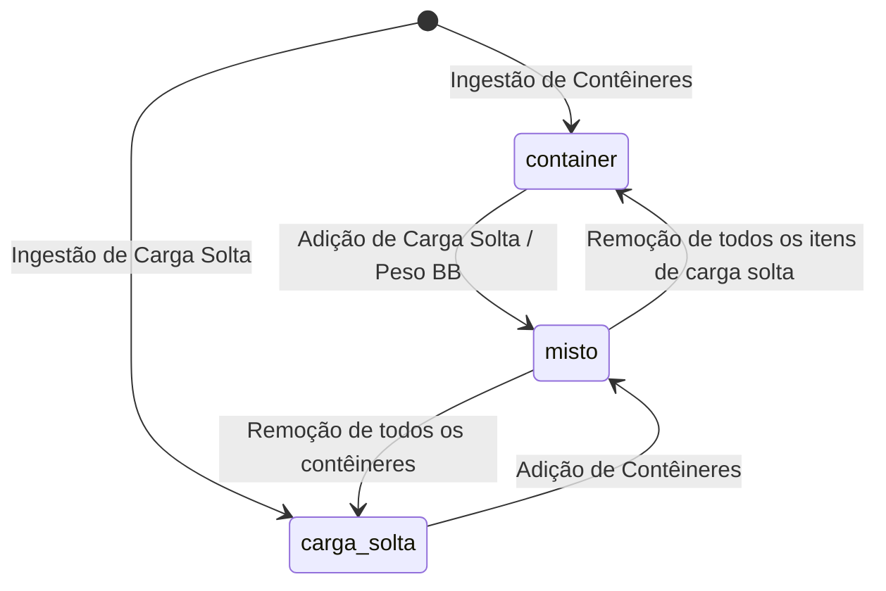
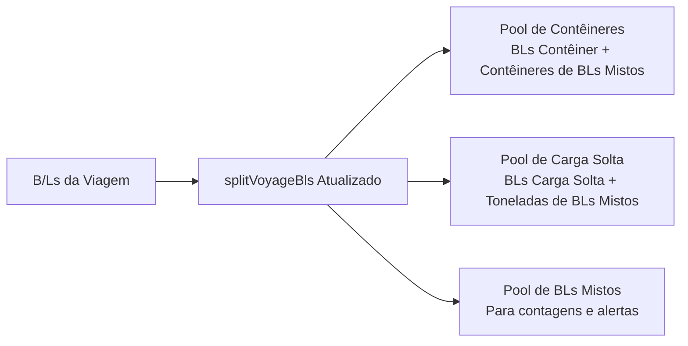

# Unificação de B/Ls e Tratamento de Carga Mista (Contêiner + Carga Solta)

## Decisão aprovada

Unificar o conceito, o cadastro e a visualização operacional sob a entidade e nomenclatura única **BLs**, eliminando a separação artificial entre "BLs CNTR" e "BLs Carga Solta". O sistema passa a tratar o B/L como entidade canônica e indivisível sob a rota canônica e exclusiva `/bls`.

Como o sistema Vela ainda **não está em operação real** (todos os dados existentes no ambiente são provenientes de testes), **não há necessidade de preservar rotas legadas, manter shims de compatibilidade retroativa ou criar mecanismos de transição defensiva para dados históricos**. As rotas `/manifestos` e `/carga-solta` e suas páginas redundantes são integralmente removidas e substituídas pela tela unificada `Bls.tsx`.

Reconhece-se nativamente a modalidade de carga **mista** (`cargo_mode = 'misto'`: contêineres e carga solta sob o mesmo B/L). A fatura de taxas locais passa por uma **remodelagem visual e estrutural** para discriminar as parcelas conteinerizadas, de carga solta e documentais. É instituída como **invariante de negócio rígida** que um B/L misto **não pode** ser descarregado em terminais diferentes — toda a sua carga descarrega obrigatoriamente no mesmo terminal portuário. O *nível* em que essa trava é aplicada depende de um ADR ainda não escrito, porque o schema atual não atribui terminal por B/L.

Define-se expressamente como as cargas e BLs são apresentados na tela de **Viagens (`/viagens`)** e em todas as suas abas operacionais (Visão Geral, Importação, Manifestos/Rotas e ADR), garantindo total coerência nas contagens e sem duplicidade de indicadores.

---

## Propósito e escopo

### Contexto e Premissa de Greenfield
O Vela encontra-se em fase pré-operacional; não existem faturas reais emitidas a clientes, integrações ativas em produção ou histórico que exija retrocompatibilidade. Essa premissa permite adotar uma abordagem limpa (*clean slate*): remover código morto e rotas obsoletas em vez de manter pontes de transição temporárias.

### Problema
1. O sistema bifurcou a ingestão e a visualização de B/Ls em dois modos excludentes (`cargo_mode = 'container'` e `cargo_mode = 'carga_solta'`), espelhados em duas rotas separadas (`/manifestos` e `/carga-solta`).
2. A importação de carga solta bloqueia o documento se o B/L já existir como contêiner (`breakbulkImport.ts`: *"BL ... ja existe como container e nao pode ser sobrescrito como BB"*).
3. O documento de fatura de taxas locais (`InvoiceDocumentLocal.tsx`) não foi desenhado para expor simultaneamente unidades de contêiner e peso métrico de carga solta, gerando dúvidas fiscais e falta de clareza contábil.
4. No modelo de planejamento portuário, não havia trava explícita impedindo a fragmentação da descarga de um B/L misto entre terminais concorrentes.
5. Na tela de `/viagens`, as funções de agregação (`splitVoyageBls`, `summarizeImportByPod`) bifurcavam B/Ls de forma mutuamente excludente, com risco de omitir a tonelagem de carga solta de B/Ls mistos nos KPIs da viagem.

### Escopo
- **Navegação e Rotas Limpas:** Adoção do nome **BLs** no menu. Substituição definitiva das rotas `/manifestos` e `/carga-solta` pela rota única `/bls`. As rotas antigas são removidas do roteador.
- **Consolidação de Frontend:** As telas `Manifestos.tsx` e `CargaSolta.tsx` são consolidadas na página definitiva `Bls.tsx`.
- **Modelo de Dados Direto:** Admissão formal de `'misto'` em **todos** os pontos que hoje enumeram as modalidades — não basta a constraint de `bls.cargo_mode`. Ver "Superfície de migração" abaixo.
- **Ingestão/Importação:** Suporte a enriquecimento incremental do B/L. Ao importar carga solta para um B/L que já possui contêineres (ou vice-versa), o sistema unifica no mesmo registro e define `cargo_mode = 'misto'`.
- **Motor de Taxas Locais:** Resolução **de duas tabelas** em `resolve_bl_local_charge_items` (a tabela de contêiner e a de carga solta do mesmo POD), com taxa de B/L incidindo exatamente 1 vez, THD sobre os contêineres e taxa por tonelada sobre `bb_weight_ton`. `charge_tables` **não** ganha a modalidade `'misto'`.
- **Remodelagem da Fatura (`InvoiceDocumentLocal.tsx`):** Nova estrutura visual do documento impresso/PDF, com seções dedicadas para itens conteinerizados, itens de carga solta e taxas documentais, além de explicitar no cabeçalho os contêineres e os pesos faturados.
- **Invariante de Terminal Único:** Trava no planejamento e na validação: um B/L misto descarrega 100% no mesmo terminal portuário. A **granularidade de aplicação** (frente do porto vs. atribuição por B/L) é decisão em aberto, dependente de ADR — ver "Onde o terminal realmente mora".
- **Projeção Completa na Tela `/viagens`:** Atualização dos agregadores de KPIs, da aba Visão Geral, da aba Importação (faixa de totais e blocos por POD), da aba Manifestos/Rotas e do relatório de agência ADR.
- **Portal do Cliente:** Exibição do B/L como documento único, contendo seus contêineres e o sumário de carga solta.

### Fora de escopo
- **Exportação de Granito:** Permanece segregada em sua própria aba/fluxo de exportação (`/granito`).
- **Gestão Física de Contêineres:** A tela `/containers` continua existindo exclusivamente para controle físico de pátio, devoluções, vistorias e demurrage de equipamentos.

---

## Modelo de domínio e banco de dados

### 1. Modalidade de Carga (`cargo_mode`)
A coluna `bls.cargo_mode` passa a ter a constraint de validação:
`CHECK (cargo_mode IN ('container', 'carga_solta', 'misto'))`

- `'container'`: B/L exclusivamente conteinerizado.
- `'carga_solta'`: B/L exclusivamente de carga solta (breakbulk / maquinário / volumes sem contêiner).
- `'misto'`: B/L que possui um ou mais contêineres físicos e itens/especificações de carga solta associados.



#### Regra de Consistência
Um B/L é classificado como `'misto'` quando:
- Possui registros vinculados em `bl_containers`; **E**
- Possui itens em `bl_breakbulk_items` **OU** `bb_weight_ton > 0` **OU** `bb_packages_qty > 0`.

#### Quem escreve `cargo_mode`
As transições do diagrama acima — inclusive as de volta (`misto → container`,
`misto → carga_solta`) — não são responsabilidade dos importadores. A regra de
consistência é aplicada por um **trigger único** que recalcula `bls.cargo_mode`
a partir do estado observado, em `AFTER INSERT OR UPDATE OR DELETE` sobre
`bl_containers` e `bl_breakbulk_items` e em `BEFORE UPDATE OF bb_weight_ton,
bb_packages_qty` sobre `bls`. Assim, remover o último contêiner de um B/L misto
o devolve a `'carga_solta'` sem que nenhum call site precise lembrar disso.
Corolário: os importadores **não** escrevem `cargo_mode` diretamente; eles
gravam contêineres e itens de carga solta, e a modalidade é derivada.

#### Superfície de migração
Ampliar apenas `bls_cargo_mode_check` deixa o sistema quebrado. A migração
correspondente precisa cobrir, no mínimo:

| Ponto | Estado atual | Ação |
|---|---|---|
| `bls_cargo_mode_check` (`001`) | `ARRAY['container','carga_solta']` | Admitir `'misto'` |
| `import_batches_cargo_mode_check` (`001`) | `ARRAY['container','carga_solta']` | Admitir `'misto'` |
| `IF v_cargo_mode NOT IN ('container','carga_solta')` (`016`, `031`) | Rejeita a modalidade na ingestão | Admitir `'misto'` |
| `ensure_container_bl_charge_status_default` | Só aplica o default quando `cargo_mode = 'container'`; um B/L misto ficaria com `charge_status` NULL | Tratar `'misto'` como contêiner para efeito do default |
| `charge_tables_cargo_mode_check` (`001`) | `ARRAY['container','carga_solta','granito']` | **Sem alteração** — não existe tabela de preços `'misto'` (ver Faturamento) |

### 2. Ingestão sem Bloqueio Cruzado
Em `src/services/breakbulkImport.ts` e `src/services/blFreightImport.ts`:
- O bloqueio fatal que impedia importar carga solta para um B/L com contêineres existentes é **removido**.
- A importação adiciona os itens de carga solta em `bl_breakbulk_items` (ou preenche `bb_weight_ton`, `bb_machine_qty`, `bb_packages_qty`), preserva os `bl_containers` existentes e atualiza `bls.cargo_mode = 'misto'`.
- De modo idêntico, a importação de arquivo com contêineres para um B/L previamente gravado como `carga_solta` associa os contêineres e atualiza o B/L para `misto`.

### 3. Invariante de Negócio: Terminal Único para B/L Misto
**Regra:** *Um B/L misto NÃO pode ter sua carga descarregada em diferentes terminais.*

- **Fundamento Operacional:** Toda a carga consignada no B/L misto (contêineres e volumes/máquinas soltos) é descarregada no mesmo berço e recebida no mesmo recinto alfandegado.

#### Onde o terminal realmente mora

O B/L **não** carrega terminal. `bls` não tem coluna `terminal_id`, e nenhuma
tabela liga B/L a terminal. O terminal é atributo da **Frente Operacional**:
`voyage_escala_operation_fronts (voyage_id, port, sentido, modalidade,
terminal_id)`, onde `modalidade ∈ ('carga_cheia','carga_solta','vazio',
'veiculo')` na importação. `CONTEXT.md` fixa que *uma frente pertence a um único
terminal*.

Consequência direta: **a granularidade disponível é a frente do porto, não o
B/L.** Contêineres e carga solta de um mesmo B/L pertencem a frentes
*diferentes* (`carga_cheia` e `carga_solta`) daquela escala. Logo, a única
formulação executável hoje da invariante é:

> Se algum B/L misto descarrega no porto P da viagem V, então a frente
> `carga_cheia` e a frente `carga_solta` de (V, P) devem apontar para o **mesmo**
> `terminal_id`.

**Isso amarra toda a escala, não só o B/L misto.** Um único B/L misto em P
proíbe que os demais B/Ls daquele porto distribuam carga cheia e carga solta
entre terminais concorrentes. É uma restrição de planejamento portuário com
efeito colateral sobre documentos que não têm relação com o B/L misto.

#### Decisão em aberto (requer ADR)

Esta spec **não** fecha a questão. As duas saídas são:

- **(a) Manter a granularidade de frente.** Custo zero de schema; aceita-se
  conscientemente o efeito porto-wide descrito acima.
- **(b) Introduzir atribuição de terminal por B/L.** Resolve o efeito colateral,
  mas cria uma segunda fonte de verdade de terminal ao lado da frente e exige
  reconciliação com o ADR, cuja identidade terminalizada é
  `(viagem, porto, terminal)`.

A escolha entre (a) e (b) é decisão de negócio com impacto em planejamento de
escala e no fechamento do ADR, e deve ser registrada em um **ADR próprio antes
da implementação**. O restante desta spec não depende dela.

#### Validação no Planejamento e na Revisão

Vale sob (a) ou (b), porque opera sobre o conflito observado, não sobre a origem
da atribuição:

- Se na escala a frente de carga cheia e a frente de carga solta apontarem para terminais conflitantes, o gate de validação registra a pendência de revisão:
  `review:mixed_bl_terminal_conflict`: *"B/L misto possui frentes atribuídas a terminais diferentes. Toda a carga do B/L deve descarregar no mesmo terminal."*
- Essa pendência bloqueia a prontidão de faturamento (`ready_for_billing`) até que o operador unifique o terminal da escala para aquele B/L.

---

## Faturamento e Taxas Locais

### 1. Resolução de Itens em B/L Misto (`resolve_bl_local_charge_items`)
O motor hoje é **mono-tabela**: `resolve_bl_local_charge_items` faz
`v_table_id := resolve_local_charge_table_id(v_bl.cargo_mode, p_pod, v_ref_date)`
e depois varre `charge_table_items WHERE charge_table_id = v_table_id`. Quatro
pontos desse motor precisam mudar para o B/L misto; **nenhum deles falha de
forma visível se for esquecido** — todos produzem fatura a menor em silêncio.

##### a) Resolução de duas tabelas (senão o B/L misto fatura zero)
Não existe — e não passa a existir — tabela de preços com `cargo_mode = 'misto'`
(`charge_tables_cargo_mode_check` permanece em `container|carga_solta|granito`).
Chamar `resolve_local_charge_table_id('misto', …)` retorna `NULL`, e o guard
`IF v_table_id IS NULL THEN RETURN;` faz o B/L misto **não gerar nenhuma
cobrança**. Para `cargo_mode = 'misto'` o motor resolve **duas** tabelas do
mesmo POD — `'container'` e `'carga_solta'` — e itera os itens das duas. O
`RETURNS TABLE` já expõe `charge_table_id` por linha, então a assinatura suporta
a união sem alteração de contrato.

##### b) Quantidade de contêiner (senão a THD some sem pendência)
O cálculo de `v_qty_total/std/imo/oog` está sob `IF v_bl.cargo_mode = 'container'`.
Para `'misto'` essas quantidades permaneceriam em zero, os itens de base
`container_distinct_voyage` cairiam no `IF COALESCE(v_qty,0) <= 0 THEN CONTINUE`
e desapareceriam **sem** `review_required`. O guard passa a ser
`v_bl.cargo_mode IN ('container','misto')`.

##### c) Rateio de contêiner compartilhado
A CTE `shares` conta os B/Ls que dividem o mesmo `container_number` na viagem
filtrando `COALESCE(b2.cargo_mode,'container') = 'container'`. Com B/Ls mistos no
sistema, um contêiner compartilhado entre um B/L contêiner e um B/L misto quebra
o rateio `1/n` dos dois lados. O filtro passa a ser
`IN ('container','misto')`, mantendo a semântica de que cada contêiner distinto
é cobrado uma vez por viagem, rateado entre os B/Ls que o declaram.

##### d) Peso faturável (senão a carga conteinerizada é cobrada por tonelada)
A base `weight_ton` hoje resolve
`COALESCE(bb_weight_ton, total_weight_kg/1000, 0)`. Num B/L misto,
`total_weight_kg` inclui o peso da carga conteinerizada; o fallback cobraria o
peso inteiro do B/L por tonelada **além** da THD. Para `'misto'` o fallback é
**proibido**: a base é estritamente `bb_weight_ton`, e sua ausência gera a
pendência já existente `review:weight_missing` em vez de um número inventado.

##### Taxa documental: incidência única, com predicado determinístico
A taxa de B/L incide **exatamente uma vez** por B/L, vinda da tabela de
contêiner. Com duas tabelas resolvidas, os itens de base `application_basis =
'bl'` aparecem nas duas; os da tabela de carga solta são suprimidos. A supressão
é feita **por `application_basis = 'bl'`**, nunca por nome do item — nome é dado
de cadastro e varia por porto.

Atenção ao que isso *não* é: `calculation_key` vale `'auto:item:<charge_item_id>'`
e a unicidade do INSERT é `ON CONFLICT (bl_id, calculation_key)`. Duas taxas
documentais vindas de tabelas distintas têm `charge_item_id` distintos, logo
chaves distintas, logo **ambas gravam sem conflito**. A incidência única é
invariante de negócio a ser garantida na resolução; a chave física não a
protege.

##### Demais regras
- **Taxas de Movimentação de Contêiner (THD Standard / IMO / OOG):** Calculadas a partir dos contêineres físicos vinculados em `bl_containers`, respeitado (b) e (c).
- **Taxas por Tonelada / Volume de Carga Solta:** Calculadas sobre `bb_weight_ton`, respeitado (d).
- **Base `teu`:** Continua não implementada pelo motor e cai no ramo de `review:unsupported_basis`. O B/L misto não altera isso.
- **Demurrage:** Aplicável estritamente aos contêineres físicos (`bl_containers`), respeitando o *free time* e as devoluções. Carga solta não gera demurrage de contêiner.

```mermaid
flowchart TD
    BL[B/L Misto a Calcular] --> TblDual[Resolve DUAS tabelas do POD<br/>container + carga_solta]
    TblDual --> CntrLines[Tabela de Contêiner<br/>• BL Fee (incide 1x)<br/>• THD Standard/IMO/OOG<br/>• Scanner/Despacho]
    TblDual --> BBLines[Tabela de Carga Solta<br/>• Taxa por tonelada/CBM<br/>• Itens application_basis='bl' SUPRIMIDOS]
    CntrLines --> Merge[União em charge_calculations]
    BBLines --> Merge
    Merge --> Ledger[bl_receivables Único]
```

### 2. Remodelagem da Fatura (`InvoiceDocumentLocal.tsx`)
A fatura de taxas locais impressa ou gerada em PDF é remodelada para dar clareza imediata sobre B/Ls mistos:

#### A. Cabeçalho e Metadados da Carga
O bloco de metadados ganha detalhamento específico quando houver B/L misto:
- **Contêineres:** Lista os contêineres faturados com seus tipos (ex.: `CSNU1234567 (40'HC), COSU9876543 (20'DC)`);
- **Carga Solta:** Exibe o peso faturado e volumes (ex.: `Peso BB: 15,400 ton | 4 volumes`).

#### B. Estrutura dos Itens de Fatura (Grid Remodelado)
Os itens da fatura de um B/L misto são divididos em três grupos visuais claros com subtotais dedicados:

```
┌────────────────────────────────────────────────────────────────────────┐
│ B/L COSU1234567890 — MISTO (CNTR + CARGA SOLTA)                        │
├────────────────────────────────────────────────────────────────────────┤
│ 1. CARGA CONTEINERIZADA                                                │
│    THD Standard - 40'HC (CSNU1234567)           1 un   R$ 1.150,00     │
│    THD Standard - 20'DC (COSU9876543)           1 un   R$   850,00     │
│    Subtotal Contêineres:                               R$ 2.000,00     │
├────────────────────────────────────────────────────────────────────────┤
│ 2. CARGA SOLTA (BREAKBULK)                                             │
│    Movimentação Portuária Carga Solta       15,400 ton R$ 1.232,00     │
│    (Tarifa: R$ 80,00 / ton s/ peso bruto)                              │
│    Subtotal Carga Solta:                               R$ 1.232,00     │
├────────────────────────────────────────────────────────────────────────┤
│ 3. TAXAS ADMINISTRATIVAS E DOCUMENTAIS                                 │
│    Taxa de Expedição de B/L (BL Fee)            1 un   R$   450,00     │
│    Subtotal Taxas Documentais:                         R$   450,00     │
├────────────────────────────────────────────────────────────────────────┤
│ TOTAL DO B/L COSU1234567890:                           R$ 3.682,00     │
└────────────────────────────────────────────────────────────────────────┘
```

Esta remodelagem garante que o cliente e a área fiscal compreendam exatamente cada rubrica, extinguindo contestações sobre a base de cálculo.

---

## Anatomia das telas e navegação

### 1. Menu de Navegação (`appLayoutNav.ts`)
A nomenclatura no menu lateral é simplificada e limpa:
- **Antes:**
  - `Baplie EDI`
  - `BLs CNTR` (`/manifestos`)
  - `BLs Carga Solta` (`/carga-solta`)
  - `Containers` (`/containers`)
- **Depois:**
  - `Baplie EDI` (`/baplie`)
  - **`BLs`** (`/bls`)
  - `Containers` (`/containers`)

As rotas antigas `/manifestos` e `/carga-solta` são **removidas**. Todos os links internos (breadcrumbs, botões de voltar em `BlDetalhe.tsx`, links de notificações) passam a apontar diretamente para `/bls`.

### 2. Listagem de BLs (`/bls`)
A tela de BLs oferece:
- **Filtro Rápido de Modalidade:** `[Todos]`, `[Contêiner]`, `[Carga Solta]`, `[Misto]`.
- **Badges de Modalidade:**
  - `Contêiner` (ex.: `2 CNTR`);
  - `Carga Solta` (ex.: `38 ton`);
  - `Misto` com badge composto (ex.: `1 CNTR + 12 ton`).
- **KPI Cards no Topo:**
  - Total de BLs únicos;
  - Total de Contêineres;
  - Total de Carga Solta (ton);
  - Status de Faturamento e Revisão.

### 3. Ficha do B/L (`BlDetalhe.tsx`)
- Para B/Ls com `cargo_mode = 'misto'`:
  - Badge no topo: `Misto (CNTR + Carga Solta)`.
  - Exibição de terminal de descarga unificado (com validação anti-conflito).
  - A aba **Carga** renderiza o painel de contêineres e o painel de carga solta em harmonia.
  - A aba **Faturamento** exibe as cobranças agrupadas conforme o novo padrão da fatura.
  - O botão de voltar aponta sempre para `/bls`.

---

## Demonstração na Tela de Viagens (`/viagens`) e suas Abas

A tela de viagens e seus componentes em `src/components/voyages/` passam a tratar B/Ls mistos de forma coesa e integrada, eliminando o particionamento excludente antigo:



### 1. Cabeçalho e Card da Viagem (`VoyageCard.tsx`)
- **Tile de KPI de Importação:**
  - Valor Principal: Total de CNTRs distintos da viagem (incluindo os contêineres de B/Ls mistos).
  - Métricas de Apoio:
    - **B/Ls:** Contagem documental exata e única (`voyage.bls.length`). Um B/L misto conta como 1 B/L.
    - **Carga solta:** Tonelagem total da viagem em toneladas, somando B/Ls puramente de carga solta e a tonelagem `bb_weight_ton` dos B/Ls mistos.
    - **Veículos:** Total de veículos vinculados.

### 2. Aba Visão Geral (`VoyageVisaoTab.tsx`)
- **Tabela de Escalas Portuárias:**
  - Na coluna **B/Ls / CEs**, a quantidade de B/Ls daquela escala reflete a soma documental dos B/Ls cujo POD corresponde àquele porto. Um B/L misto soma exatamente 1 na contagem daquela escala.
  - O percentual de cobertura de CE Mercante considera o B/L misto como uma única unidade documental a ser coberta.
- **Editor de Escala e Atribuição de Terminal (`EscalaModal`):**
  - Quando a escala possuir B/Ls mistos com descarga naquele porto, o modal valida que as frentes não divirjam para terminais distintos, garantindo a invariante de terminal único.

### 3. Aba Importação (`VoyageImportacaoTab.tsx`)
Esta é a aba central onde o operador confere toda a carga que descarrega no navio:
- **Faixa de Totais da Viagem (`TotalStrip` no topo):**
  - `B/Ls`: total documental único (ex.: `42`);
  - `CNTRs distintos`: todos os contêineres físicos da viagem (ex.: `120`);
  - `Carga solta`: tonelagem total agregada de B/Ls puros e mistos (ex.: `350 ton`);
  - `IMO`, `OOG`, `Veículos`.
- **Blocos de Carga por Escala (`PodBlock` por POD):**
  - **Cabeçalho da Escala:** Identifica o resumo: `X CNTRs · Y ton carga solta` e, quando houver B/Ls mistos naquela escala, exibe a tag informativa `(Z mistos)`.
  - **Painel de Containers:** Apresenta todos os contêineres físicos da escala (agrupando contêineres de B/Ls puros e de B/Ls mistos), detalhando carga geral, veículos, IMO, OOG e tipos (`20'DC`, `40'HC` etc.).
  - **Painel de Carga Solta:** Apresenta a tonelagem consolidada de carga solta daquela escala (`weightTon`), além do número de volumes, máquinas e CBM agregados.
    - O contador `breakbulk.bls` (hoje renderizado como `"N B/Ls carga solta"` no
      cabeçalho e como mini-stat `B/Ls` do painel) conta **apenas B/Ls puramente
      de carga solta**. B/Ls mistos ficam fora dele e são reportados
      separadamente pela tag `(Z mistos)`. Assim `breakbulk.bls` +
      B/Ls-contêiner + mistos fecha com o total documental da escala, sem
      dupla contagem, e o rótulo continua verdadeiro.
  - Se a escala tiver B/Ls mistos, um aviso contextual sutil é exibido no rodapé dos painéis:
    *"Esta escala possui B/Ls com contêiner e carga solta integrados descarregando no mesmo terminal."*

### 4. Aba Manifestos / Rotas (`VoyageManifestosTab.tsx`)
- **Linhas de Rotas (Par POL → POD):**
  - **Badge de Modalidade da Rota:**
    - `CNTR` quando houver apenas contêineres;
    - `BB` quando houver apenas carga solta;
    - `CNTR/BB` quando a rota tiver B/Ls mistos ou a coexistência de ambos os tipos de carga.
  - **Link de Ação da Rota:** Redireciona diretamente para a rota unificada filtrada:
    `/bls?voyage=${voyage.id}&pol=${row.pol}&pod=${row.pod}`
  - **Contagem de B/Ls da Rota:** Apresenta o número real de B/Ls únicos vinculados àquela rota comercial, sem duplicar B/Ls mistos.

### 5. Aba Relatório de Agência / ADR (`VoyageAgencyReportTab.tsx`)
- O Relatório de Agência e Desempenho (ADR) consolida as cargas por terminal e atracação:
  - Os contêineres cheios descarregados do B/L misto somam no ADR de contêineres do terminal atribuído;
  - A tonelagem de carga solta do B/L misto soma no bloco de breakbulk do **mesmo** terminal;
  - Como o B/L misto é restrito a um terminal único, os números do ADR fecham perfeitamente sem dispersão de frentes entre relatórios de terminais concorrentes.

---

## Portal do Cliente e Comunicações

### 1. Portal do Cliente (`PortalOperacao.tsx` e `PortalBilling.tsx`)
- **Documento Único:** O cliente visualiza o B/L uma única vez.
- **Rastreamento Operacional:** Na consulta de B/Ls, o importador com B/L misto visualiza seus contêineres (com prazos de devolução e demurrage) e, conjuntamente, a indicação do peso e volume da carga solta.
- **Fatura Transparente:** O download da fatura pelo portal renderiza o novo modelo remodelado com agrupamento das parcelas de contêiner, carga solta e BL Fee.

### 2. Comunicações (NOB / NOA / NOR)
- Como o B/L misto tem **terminal único obrigatório**, a notificação de atracação (NOB) é disparada exatamente para a atracação daquele terminal atribuído.
- Elimina-se qualquer ambiguidade de disparo duplicado para terminais concorrentes.

---

## Testes e Validação

### 1. Testes de Contrato SQL e Migrations
- Validar a admissão de `'misto'` em **cada** ponto da tabela "Superfície de
  migração": `bls_cargo_mode_check`, `import_batches_cargo_mode_check`, os gates
  de `016`/`031` e o default de `charge_status`. Um teste por ponto — a
  constraint de `bls` passar não diz nada sobre os demais.
- Validar que o trigger de `cargo_mode` cobre as transições de volta: remover o
  último contêiner de um B/L misto devolve `'carga_solta'`; remover toda a carga
  solta devolve `'container'`.
- Validar cálculo em `calculate_bl_local_charges` para B/L misto:
  - **Incidência única da taxa documental — assertiva semântica:** exatamente
    **1** linha resultante com `application_basis = 'bl'` para o B/L, e que ela
    veio da tabela de contêiner. **Não** basta asseverar ausência de chave
    duplicada: `calculation_key` é `'auto:item:<charge_item_id>'` e a unicidade é
    `(bl_id, calculation_key)`, de modo que duas taxas documentais de tabelas
    diferentes gravam sem colidir — o teste de chave passaria verde com o cliente
    cobrado em dobro.
  - THD cobrada para os contêineres do B/L misto com quantidade **maior que
    zero** (regressão direta do guard `IF v_bl.cargo_mode = 'container'`);
  - Cobrança por tonelada sobre `bb_weight_ton`, e **ausência** de fallback para
    `total_weight_kg` em B/L misto: sem `bb_weight_ton`, esperar
    `review:weight_missing` e nenhuma linha calculada por peso;
  - Rateio: contêiner compartilhado entre um B/L contêiner e um B/L misto na
    mesma viagem é cobrado **uma vez**, dividido entre os dois;
  - B/L misto **não** retorna vazio por falta de tabela de preços `'misto'`.
- Validar trava de terminal único: flag de pendência de revisão caso frentes do B/L misto apontem para terminais diferentes. O teste segue a formulação de frente descrita em "Onde o terminal realmente mora" e deve ser escrito depois do ADR que escolher entre (a) e (b).

### 2. Testes de Interface e Agregação de Viagens
- Testar `splitVoyageBls` e `summarizeImportByPod` com B/Ls mistos:
  - Garantir que `totalBls` não duplica o B/L;
  - Garantir que contêineres somam no pool de contêineres e `bb_weight_ton` soma no pool de carga solta;
  - Garantir que as faixas de totais em `VoyageImportacaoTab` exibem ambas as métricas corretamente.
- Testar rota e navegação em `VoyageManifestosTab` apontando para `/bls`.
- Testar componente de fatura (`InvoiceDocumentLocal.tsx`): conferir renderização dos blocos segregados (contêineres, carga solta, taxas documentais) e subtotais.
