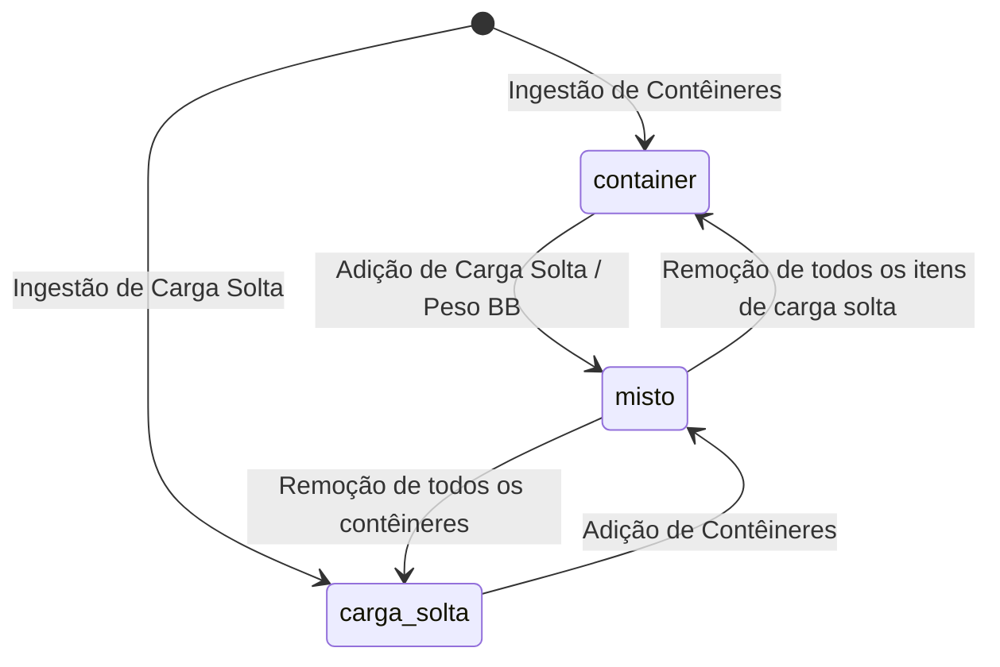

# Unificação de B/Ls e Tratamento de Carga Mista (Contêiner + Carga Solta)

## Decisão aprovada

Unificar o conceito, o cadastro e a visualização operacional sob a entidade e nomenclatura única **BLs**, eliminando a separação artificial entre "BLs CNTR" e "BLs Carga Solta". O sistema passa a tratar o B/L como entidade canônica e indivisível sob a rota canônica `/bls` (descontinuando `/manifestos`).

Reconhece-se nativamente a modalidade de carga **mista** (`cargo_mode = 'misto'`: contêineres e carga solta sob o mesmo B/L). A fatura de taxas locais passa por uma **remodelagem visual e estrutural** para discriminar as parcelas conteinerizadas, de carga solta e documentais. É instituída como **invariante de negócio rígida** que um B/L misto **não pode** ser descarregado em terminais diferentes — toda a sua carga descarrega obrigatoriamente no mesmo terminal portuário.

---

## Propósito e escopo

### Problema
Historicamente, o sistema bifurcou a ingestão e a visualização de B/Ls em dois modos excludentes (`cargo_mode = 'container'` e `cargo_mode = 'carga_solta'`), refletidos em dois itens de menu e rotas separadas (`/manifestos` e `/carga-solta`).

Quando um B/L marítimo da vida real traz itens conteinerizados e itens de carga solta/breakbulk:
1. A importação de carga solta bloqueia o documento se o B/L já existir como contêiner (`breakbulkImport.ts`: *"BL ... ja existe como container e nao pode ser sobrescrito como BB"*);
2. A existência de rotas separadas gerava o risco de duplicação do B/L no sistema, distorcendo os KPIs de contagem documental da viagem;
3. O documento de fatura de taxas locais (`InvoiceDocumentLocal.tsx`) não foi desenhado para expor simultaneamente unidades de contêiner e peso métrico de carga solta, gerando dúvidas fiscais e contestações de clientes;
4. No modelo de escala multiterminal, existia a brecha de tentar atribuir a frente de contêiner a um terminal e a frente de carga solta a outro para o mesmo B/L, o que é operacionalmente inviável e contratualmente vedado.

### Escopo
- **Nomenclatura e Navegação:** Adoção do nome padronizado **BLs** no menu e na aplicação. A rota oficial e canônica passa a ser `/bls`. As rotas `/manifestos` e `/carga-solta` são aposentadas como destinos diretos e passam a redirecionar para `/bls`.
- **Modelo de dados:** Extensão do domínio de `bls.cargo_mode` para admitir `'container'`, `'carga_solta'` e `'misto'`.
- **Ingestão/Importação:** Suporte a enriquecimento incremental do B/L. Ao importar carga solta para um B/L que já possui contêineres (ou vice-versa), o sistema unifica no mesmo registro e promove o modo para `'misto'`.
- **Motor de Taxas Locais:** Resolução híbrida em `calculate_bl_local_charges` e `resolve_bl_local_charge_items` (aplica taxa de B/L uma única vez + THD por contêiner + taxa por tonelada sobre o peso de carga solta).
- **Remodelagem da Fatura (`InvoiceDocumentLocal.tsx`):** Nova estrutura visual do documento impresso/PDF, com seções dedicadas para itens conteinerizados, itens de carga solta e taxas documentais, além de explicitar no cabeçalho os contêineres e os pesos faturados.
- **Invariante de Terminal Único:** Trava estrita no planejamento e na validação: um B/L misto deve descarregar 100% no mesmo terminal.
- **Portal do Cliente:** Exibição clara e não duplicada do B/L, apresentando os contêineres e o sumário de carga solta sob o mesmo número de B/L.

### Fora de escopo
- **Exportação de Granito:** Permanece segregada em sua própria aba/fluxo de exportação (`/granito`).
- **Gestão Física de Contêineres:** A tela `/containers` continua existindo exclusivamente para controle físico de pátio, devoluções, vistorias e demurrage de equipamentos.

---

## Modelo de domínio e banco de dados

### 1. Modalidade de Carga (`cargo_mode`)
A coluna `bls.cargo_mode` passa a admitir formalmente três estados:
- `'container'`: B/L exclusivamente conteinerizado.
- `'carga_solta'`: B/L exclusivamente de carga solta (breakbulk / maquinário / volumes sem contêiner).
- `'misto'`: B/L híbrido que possui um ou mais contêineres físicos e itens/especificações de carga solta associados.



#### Regra de Consistência
Um B/L é classificado como `'misto'` quando:
- Possui registros vinculados em `bl_containers`; **E**
- Possui itens em `bl_breakbulk_items` **OU** `bb_weight_ton > 0` **OU** `bb_packages_qty > 0`.

### 2. Ingestão sem Bloqueio Cruzado
Em `src/services/breakbulkImport.ts` e `src/services/blFreightImport.ts`:
- Quando um arquivo de carga solta contiver um B/L já existente com `cargo_mode = 'container'`, a importação **não gera erro fatal**.
- O sistema adiciona os itens de carga solta em `bl_breakbulk_items` (ou preenche `bb_weight_ton`, `bb_machine_qty`, `bb_packages_qty`), preserva os `bl_containers` existentes e atualiza `bls.cargo_mode = 'misto'`.
- De modo idêntico, a importação de arquivo com contêineres para um B/L previamente gravado como `carga_solta` associa os contêineres e promove o B/L a `misto`.

### 3. Invariante de Negócio: Terminal Único para B/L Misto
**Regra:** *Um B/L misto NÃO pode ter sua carga descarregada em diferentes terminais.*

- **Fundamento Operacional:** Toda a carga consignada no B/L misto (seus contêineres e seus volumes/máquinas soltos) é desembarcada no mesmo berço e entregue no mesmo recinto alfandegado de destino.
- **Validação no Planejamento e na Revisão:**
  - Se a escala portuária do POD atribuir terminais diferentes para a frente de carga cheia e para a frente de carga solta, o sistema **não permite** que o B/L misto seja fracionado entre eles.
  - O B/L misto herda um único `terminal_id`.
  - Se houver divergência ou tentativa de desdobro de terminais na escala, o gate de validação registra a pendência de revisão:
    `review:mixed_bl_terminal_conflict`: *"B/L misto possui frentes atribuídas a terminais diferentes. Toda a carga do B/L deve descarregar no mesmo terminal."*
  - Essa pendência bloqueia a prontidão de faturamento (`ready_for_billing`) até que o operador defina o terminal unificado de descarga.

---

## Faturamento e Taxas Locais

### 1. Resolução de Itens em B/L Misto (`resolve_bl_local_charge_items`)
O cálculo financeiro de taxas locais de um B/L misto deve respeitar:
1. **Taxa Documental de B/L (BL Fee / Expediente):** Incide **exatamente uma vez** por B/L (precedência: vinda da tabela de contêiner do porto).
2. **Taxas de Movimentação de Contêiner (THD Standard / IMO / OOG):** Calculadas normalmente a partir dos contêineres físicos vinculados em `bl_containers`.
3. **Taxas por Tonelada / Volume de Carga Solta:** Calculadas sobre `bb_weight_ton` da carga solta.
4. **Demurrage:** Aplicável estritamente aos contêineres físicos (`bl_containers`), respeitando o *free time* e as devoluções. Carga solta não gera demurrage de contêiner.

```mermaid
flowchart TD
    BL[B/L Misto a Calcular] --> TblDual[Resolução de Tabelas do Porto]
    TblDual --> CntrLines[Tabela de Contêiner<br/>• BL Fee (incide 1x)<br/>• THD Standard/IMO/OOG<br/>• Scanner/Despacho]
    TblDual --> BBLines[Tabela de Carga Solta<br/>• Taxa por tonelada/CBM<br/>• BL Fee da tabela BB é SUPRIMIDO]
    CntrLines --> Merge[União em charge_calculations]
    BBLines --> Merge
    Merge --> Ledger[bl_receivables Único]
```

### 2. Remodelagem da Fatura (`InvoiceDocumentLocal.tsx`)
A fatura de taxas locais impressa ou gerada em PDF é remodelada para dar clareza imediata sobre B/Ls mistos:

#### A. Cabeçalho e Metadados da Carga
O bloco de metadados ganha detalhamento específico quando houver B/L misto:
- **Contêineres:** Lista os contêineres faturados com seus tipos (ex.: `CSNU1234567 (40'HC), COSU9876543 (20'DC)`);
- **Carga Solta:** Exibe o peso faturado e volumes (ex.: `Peso BB: 15,400 ton | 4 volumes`).

#### B. Estrutura dos Itens de Fatura (Grid Remodelado)
Em vez de listar as cobranças misturadas, os itens da fatura do B/L misto são divididos em três grupos visuais claros:

```
┌────────────────────────────────────────────────────────────────────────┐
│ B/L COSU1234567890 — MISTO (CNTR + CARGA SOLTA)                        │
├────────────────────────────────────────────────────────────────────────┤
│ 1. CARGA CONTEINERIZADA                                                │
│    THD Standard - 40'HC (CSNU1234567)           1 un   R$ 1.150,00     │
│    THD Standard - 20'DC (COSU9876543)           1 un   R$   850,00     │
│    Subtotal Contêineres:                               R$ 2.000,00     │
├────────────────────────────────────────────────────────────────────────┤
│ 2. CARGA SOLTA (BREAKBULK)                                             │
│    Movimentação Portuária Carga Solta       15,400 ton R$ 1.232,00     │
│    (Tarifa: R$ 80,00 / ton s/ peso bruto)                              │
│    Subtotal Carga Solta:                               R$ 1.232,00     │
├────────────────────────────────────────────────────────────────────────┤
│ 3. TAXAS ADMINISTRATIVAS E DOCUMENTAIS                                 │
│    Taxa de Expedição de B/L (BL Fee)            1 un   R$   450,00     │
│    Subtotal Taxas Documentais:                         R$   450,00     │
├────────────────────────────────────────────────────────────────────────┤
│ TOTAL DO B/L COSU1234567890:                           R$ 3.682,00     │
└────────────────────────────────────────────────────────────────────────┘
```

Esta remodelagem garante que o cliente e a área fiscal compreendam exatamente cada rubrica, extinguindo contestações sobre a base de cálculo.

---

## Anatomia das telas e navegação

### 1. Menu de Navegação (`appLayoutNav.ts`)
A nomenclatura no menu lateral é atualizada:
- **Antes:**
  - `Baplie EDI`
  - `BLs CNTR` (`/manifestos`)
  - `BLs Carga Solta` (`/carga-solta`)
  - `Containers` (`/containers`)
- **Depois:**
  - `Baplie EDI` (`/baplie`)
  - **`BLs`** (`/bls`) — *nome limpo e direto, sem sufixos*
  - `Containers` (`/containers`) — *gestão física de equipamentos*

#### Política de Rotas e Redirecionamentos:
- A rota principal e canônica da listagem de B/Ls é **/bls**.
- A rota antiga `/manifestos` passa a redirecionar permanentemente para `/bls`.
- A rota antiga `/carga-solta` passa a redirecionar para `/bls?cargo_mode=carga_solta`.

### 2. Listagem de BLs (`/bls`)
A tela de BLs passa a oferecer:
- **Filtro Rápido de Modalidade:** `[Todos]`, `[Contêiner]`, `[Carga Solta]`, `[Misto]`.
- **Badges de Modalidade:**
  - `Contêiner` (ex.: `2 CNTR`);
  - `Carga Solta` (ex.: `38 ton`);
  - `Misto` com visual distinto em dois tons (ex.: `1 CNTR + 12 ton`).
- **KPI Cards no Topo:**
  - Total de BLs únicos;
  - Total de Contêineres;
  - Total de Carga Solta (ton);
  - Status de Faturamento e Revisão.

### 3. Ficha do B/L (`BlDetalhe.tsx`)
- Para B/Ls com `cargo_mode = 'misto'`:
  - Badge no topo: `Misto (CNTR + Carga Solta)`.
  - Exibição de terminal de descarga unificado (com validação anti-conflito).
  - A aba **Carga** renderiza o painel de contêineres e o painel de carga solta em harmonia.
  - A aba **Faturamento** exibe as cobranças agrupadas conforme o novo padrão da fatura.

---

## Portal do Cliente e Comunicações

### 1. Portal do Cliente (`PortalOperacao.tsx` e `PortalBilling.tsx`)
- **Documento Único:** O cliente visualiza o B/L uma única vez.
- **Rastreamento Operacional:** Na consulta de B/Ls, o importador com B/L misto visualiza seus contêineres (com prazos de devolução e demurrage) e, conjuntamente, a indicação do peso e volume da carga solta.
- **Fatura Transparente:** O download da fatura pelo portal renderiza o novo modelo remodelado com agrupamento das parcelas de contêiner, carga solta e BL Fee.

### 2. Comunicações (NOB / NOA / NOR)
- Como o B/L misto tem **terminal único obrigatório**, a notificação de atracação (NOB) é disparada exatamente para a atracação daquele terminal atribuído.
- Elimina-se qualquer ambiguidade de disparo duplicado para terminais concorrentes.

---

## Testes e Validação

### 1. Testes de Contrato SQL e Migrations
- Validar enum/check constraint de `bls.cargo_mode` aceitando `'container'`, `'carga_solta'` e `'misto'`.
- Validar cálculo em `calculate_bl_local_charges` para B/L misto:
  - Exatamente 1 taxa fixa de B/L;
  - Cobrança de THD para os contêineres;
  - Cobrança por tonelada para a carga solta;
  - Inexistência de duplicidade de chaves em `charge_calculations`.
- Validar trava de terminal único: rejeição ou flag de pendência de revisão caso frentes do B/L misto apontem para terminais diferentes.

### 2. Testes de Interface e Ingestão
- Testar importação sucessiva de contêiner e carga solta para o mesmo número de B/L, confirmando transição para `'misto'`.
- Testar navegação: acesso a `/bls`, redirecionamento de `/manifestos` para `/bls`, e redirecionamento de `/carga-solta` para `/bls?cargo_mode=carga_solta`.
- Testar componente de fatura (`InvoiceDocumentLocal.tsx`): conferir renderização dos blocos segregados (contêineres, carga solta, taxas documentais) e subtotais.
