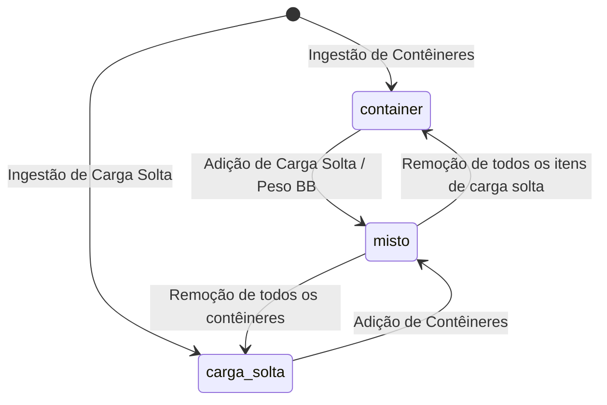
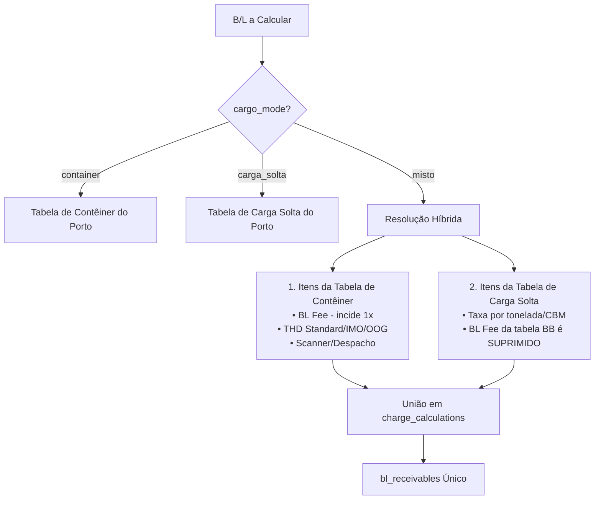

# Unificação de B/Ls e Tratamento de Carga Mista (Contêiner + Carga Solta)

## Decisão aprovada

Unificar o conceito e a visualização operacional de Conhecimentos de Embarque (**B/Ls**), eliminando a separação artificial de telas entre "BLs CNTR" e "BLs Carga Solta". O sistema passa a tratar o B/L como entidade canônica e indivisível, reconhecendo nativamente a modalidade de carga **mista** (`misto`: contêineres e carga solta sob o mesmo documento).

A rota operacional principal de B/Ls é consolidada, a importação passa a permitir a agregação de dados de carga solta a B/Ls que já possuam contêineres (e vice-versa), e o motor de faturamento de taxas locais é atualizado para tarifar os dois componentes de carga sem duplicar a taxa fixa documental de B/L.

---

## Propósito e escopo

### Problema
Historicamente, o sistema bifurcou a ingestão e a visualização de B/Ls em dois modos excludentes (`cargo_mode = 'container'` e `cargo_mode = 'carga_solta'`), refletidos em dois itens de menu separados (`/manifestos` e `/carga-solta`). 

Quando um B/L marítimo da vida real traz itens conteinerizados e itens de carga solta/breakbulk:
1. A importação de carga solta bloqueia o documento se o B/L já existir como contêiner (`breakbulkImport.ts`: *"BL ... ja existe como container e nao pode ser sobrescrito como BB"*);
2. Se o operador tentasse forçar lançamentos em ambas as portas (ex.: criando identificadores derivados), o B/L constaria duplicado nas listas, distorcendo os KPIs de contagem documental da viagem;
3. O faturamento de taxas locais (`calculate_bl_local_charges`) só sabe aplicar a tabela de contêiner ou a tabela de carga solta, não sabendo calcular THD de contêiner e taxa por tonelada simultaneamente;
4. No Portal do Cliente, a segregação ou duplicidade geraria confusão quanto à cobrança de frete/taxas e ao acompanhamento operacional.

### Escopo
- **Modelo de dados:** Extensão do domínio de `bls.cargo_mode` para admitir `'container'`, `'carga_solta'` e `'misto'`.
- **Ingestão/Importação:** Suporte a enriquecimento incremental do B/L. Se um manifesto ou B/L avulso traz contêineres e outro traz especificações de carga solta (ou volumes/peso), o sistema unifica no mesmo registro e promove o modo para `'misto'`.
- **Motor de Taxas Locais (`calculate_bl_local_charges` e `resolve_bl_local_charge_items`):** Resolução harmônica de cobrança para B/L misto (aplica taxa de B/L uma única vez + THD por contêiner + taxa por tonelada sobre o peso de carga solta).
- **Interface Interna e Navegação:** Unificação do menu em uma única entrada principal de B/Ls, com filtros rápidos por modalidade (`Todos`, `Contêiner`, `Carga Solta`, `Misto`) e badges de carga explícitos.
- **Ficha do B/L (`BlDetalhe.tsx`):** Renderização conjunta e proporcional de contêineres físicos e itens de carga solta.
- **Portal do Cliente:** Exibição clara e não duplicada do B/L, apresentando tanto os contêineres (com prazos de devolução e demurrage) quanto o sumário de carga solta.

### Fora de escopo
- **Exportação de Granito:** Permanece segregada em sua própria aba/fluxo de exportação (`/granito`), com tabelas e regras próprias.
- **Gestão Física de Contêineres:** A tela `/containers` continua existindo para controle físico de pátio, devoluções, vistorias e demurrage de equipamentos.

---

## Modelo de domínio e banco de dados

### 1. Modalidade de Carga (`cargo_mode`)
A coluna `bls.cargo_mode` passa a admitir formalmente três estados:
- `'container'`: B/L exclusivamente conteinerizado.
- `'carga_solta'`: B/L exclusivamente de carga solta (breakbulk / maquinário / volumes sem contêiner).
- `'misto'`: B/L híbrido que possui um ou mais contêineres físicos e itens/especificações de carga solta associados.

#### Regra de Derivação/Consistência
Um B/L é considerado `'misto'` quando:
- Possui registros vinculados em `bl_containers`; **E**
- Possui itens em `bl_breakbulk_items` **OU** `bb_weight_ton > 0` **OU** `bb_packages_qty > 0`.

### 2. Ingestão sem Bloqueio Cruzado
Em `src/services/breakbulkImport.ts` e `src/services/blFreightImport.ts`:
- Quando um arquivo de carga solta contiver um B/L já existente com `cargo_mode = 'container'`, a importação **não gera erro fatal**.
- O sistema adiciona os itens de carga solta em `bl_breakbulk_items` (ou preenche `bb_weight_ton`, `bb_machine_qty`, `bb_packages_qty`), preserva os `bl_containers` existentes e atualiza `bls.cargo_mode = 'misto'`.
- De modo idêntico, a importação de B/L que contenha contêineres para um B/L previamente gravado como `carga_solta` associa os contêineres e promove o B/L a `misto`.

---

## Faturamento e Taxas Locais

O cálculo financeiro de taxas locais de um B/L misto deve respeitar três premissas fundamentais do negócio:

1. **Taxa Documental de B/L (BL Fee / Expediente):** Incide **exatamente uma vez** por B/L. Não pode haver dupla cobrança de taxa fixa de B/L para o mesmo conhecimento.
2. **Taxas de Movimentação de Contêiner (THD Standard / IMO / OOG):** Calculadas normalmente a partir dos contêineres físicos vinculados em `bl_containers`.
3. **Taxas por Tonelada / Volume de Carga Solta:** Calculadas sobre `bb_weight_ton` da carga solta.
4. **Demurrage:** Aplicável estritamente aos contêineres físicos (`bl_containers`), respeitando o free time e as devoluções. A carga solta não interfere nem sofre cobrança de demurrage de contêiner.

### Resolução de Itens em B/L Misto (`resolve_bl_local_charge_items`)

#### Regra Algorítmica de Cobrança:
1. Se `v_bl.cargo_mode = 'misto'`:
   - O motor resolve a **Tabela de Contêiner** do porto e a **Tabela de Carga Solta** do porto para o POD da escala.
   - Aplica os itens da Tabela de Contêiner normalmente (incluindo o item com `application_basis = 'bl'`).
   - Aplica os itens da Tabela de Carga Solta com `application_basis = 'weight_ton'` sobre o peso `bb_weight_ton`.
   - **Trava anti-duplicidade:** Qualquer item com `application_basis = 'bl'` da Tabela de Carga Solta é desconsiderado se a Tabela de Contêiner já forneceu um item documental de B/L.
   - Gera um único registro de contas a receber em `bl_receivables` com o somatório correto de todas as linhas de cálculo.

---

## Anatomia das telas e navegação

### 1. Menu de Navegação (`appLayoutNav.ts`)
A navegação do módulo de importação é racionalizada:
- **Antes:**
  - `Baplie EDI`
  - `BLs CNTR` (`/manifestos`)
  - `BLs Carga Solta` (`/carga-solta`)
  - `Containers` (`/containers`)
  - `Veículos`, `Vazios IMP`, `Revisão`
- **Depois:**
  - `Baplie EDI` (`/baplie`)
  - `Conhecimentos (B/Ls)` (`/manifestos` mantida como rota canônica interna, renomeada na interface para clareza)
  - `Containers` (`/containers`)
  - `Veículos`, `Vazios IMP`, `Revisão`

O endpoint `/carga-solta` redireciona para `/manifestos?cargo_mode=carga_solta`, evitando quebras de links compartilhados ou favoritos de operadores.

### 2. Listagem Unificada de B/Ls
A tela principal de B/Ls ganha:
- **Filtro de Modalidade:** Seletor segmentado com opções `Todos`, `Contêiner`, `Carga Solta`, `Misto`.
- **Coluna Modalidade / Perfil de Carga:**
  - `Contêiner` com quantidade (ex.: `2 CNTR`);
  - `Carga Solta` com resumo (ex.: `38 ton`);
  - `Misto` com badge composto (ex.: `1 CNTR + 12 ton`).
- **Resumo de Indicadores (KPI Cards no topo):**
  - Mostra a contagem total de B/Ls documentais únicos;
  - Totalizadores segregados de contêineres e de toneladas de carga solta daquela viagem/filtro.

### 3. Ficha de Detalhes do B/L (`BlDetalhe.tsx`)
- Se o B/L for `misto`:
  - O cabeçalho exibe o badge `Misto`.
  - A aba de Carga renderiza:
    1. Painel de Contêineres vinculados (número, tipo, lacre, tara, peso bruto, IMO, OOG, datas operacionais de descarga e devolução);
    2. Painel de Carga Solta (volumes, máquinas, peso em toneladas, CBM e itens discriminados em `bl_breakbulk_items`).
  - A aba de Faturamento exibe as linhas de THD e as linhas de tonelada de carga solta sob o mesmo extrato financeiro.

---

## Portal do Cliente

No Portal do Cliente (`PortalOperacao.tsx` e `PortalBilling.tsx`):

1. **Visão sem duplicidade:** O cliente consulta suas cargas e vê o B/L exatamente uma vez, refletindo a realidade contratual do conhecimento de embarque.
2. **Detalhamento Operacional:** Na consulta de B/Ls, o cliente com B/L misto visualiza os contêineres sujeitos a devolução/demurrage e, no mesmo cartão/linha, a indicação clara do volume/peso de carga solta descarregada.
3. **Fatura Transparente:** As faturas de taxas locais disponibilizadas para download e pagamento via PIX trazem as linhas discriminadas (THD do contêiner + movimentação da carga solta + taxa de B/L unitária), sem qualquer risco de o cliente questionar duplicidade de cobrança.

---

## Comunicações e Notificações (NOB / NOA / NOR)

A função `bl_operation_front_modalidade(p_cargo_mode)` (migration `045`) é atualizada para tratar o modo `'misto'`:
- Um B/L misto pode ter seus contêineres descarregados em um terminal de contêineres e sua carga solta movimentada em um cais público/armazém convencional.
- O disparo de Avisos ao Cliente (como o Aviso de Chegada e o NOB - Notice of Berth) respeita a presença em ambas as frentes operacionais quando a viagem tiver terminais segregados por modalidade.

---

## Testes e Validação

### Testes de Contrato SQL e Migrations
1. **Migration de Enum/Check Constraint:** Validar que `cargo_mode` aceita `'misto'`, além de `'container'` e `'carga_solta'`.
2. **Cálculo de Taxas Locais Híbridas:**
   - Testar B/L misto com 2 contêineres e 10 toneladas de carga solta:
     - Deve gerar 1 linha de Taxa de B/L;
     - Deve gerar 2 linhas de THD (ou rateio equivalente);
     - Deve gerar 1 linha de taxa por tonelada (10 × tarifa por ton);
     - Não pode gerar duplicidade de chave em `charge_calculations`.
3. **RPC `operational_list_bls`:**
   - Validar que a filtragem por `p_cargo_mode = 'misto'` retorna apenas B/Ls mistos, e `p_cargo_mode IS NULL` retorna todos sem duplicidade.

### Testes de Interface e Ingestão
1. **Ingestão Cruzada:** Testar upload de B/L contêiner e posterior upload de manifesto BB com o mesmo número de B/L: deve promover o B/L para `misto` sem lançar erro de duplicidade.
2. **Navegação e Filtros:** Testar filtro de modalidade na tabela unificada de B/Ls e renderização da ficha `BlDetalhe`.
3. **Portal do Cliente:** Verificar que a RPC `_portal_list_operation_bls_core` retorna o B/L misto com seus contêineres corretos sem suprimir atributos.
