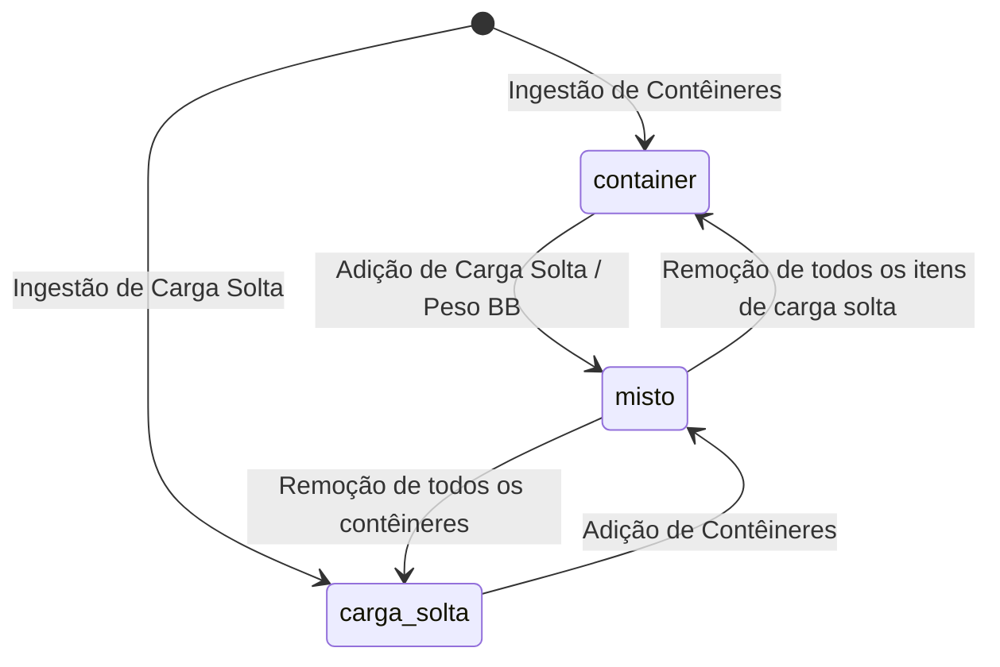
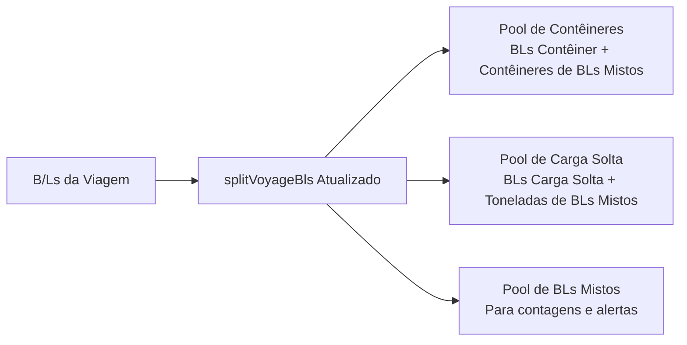

# Unificação de B/Ls e Tratamento de Carga Mista (Contêiner + Carga Solta)

## Decisão aprovada

Unificar o conceito, o cadastro e a visualização operacional sob a entidade e nomenclatura única **BLs**, eliminando a separação artificial entre "BLs CNTR" e "BLs Carga Solta". O sistema passa a tratar o B/L como entidade canônica e indivisível sob a rota canônica e exclusiva `/bls`.

Como o sistema Vela ainda **não está em operação real** (todos os dados existentes no ambiente são provenientes de testes), **não há necessidade de preservar rotas legadas, manter shims de compatibilidade retroativa ou criar mecanismos de transição defensiva para dados históricos**. As rotas `/manifestos` e `/carga-solta` e suas páginas redundantes são integralmente removidas e substituídas pela tela unificada `Bls.tsx`.

Reconhece-se nativamente a modalidade de carga **mista** (`cargo_mode = 'misto'`: contêineres e carga solta sob o mesmo B/L). A fatura de taxas locais passa por uma **remodelagem visual e estrutural** para discriminar as parcelas conteinerizadas, de carga solta e documentais. É instituída como **invariante de negócio rígida** que um B/L misto **não pode** ser descarregado em terminais diferentes — toda a sua carga descarrega obrigatoriamente no mesmo terminal portuário. Como o schema não atribui terminal por B/L, a trava é viabilizada pela [ADR 0068](../adr/0068-terminal-do-bl-herdado-da-frente-com-excecao-individual.md): o terminal é herdado da Frente de Operação e o B/L ganha uma exceção individual auditada.

Define-se expressamente como as cargas e BLs são apresentados na tela de **Viagens (`/viagens`)** e em todas as suas abas operacionais (Visão Geral, Importação, Manifestos/Rotas e ADR), garantindo total coerência nas contagens e sem duplicidade de indicadores.

---

## Propósito e escopo

### Contexto e Premissa de Greenfield
O Vela encontra-se em fase pré-operacional; não existem faturas reais emitidas a clientes, integrações ativas em produção ou histórico que exija retrocompatibilidade. Essa premissa permite adotar uma abordagem limpa (*clean slate*): remover código morto e rotas obsoletas em vez de manter pontes de transição temporárias.

### Problema
1. O sistema bifurcou a ingestão e a visualização de B/Ls em dois modos excludentes (`cargo_mode = 'container'` e `cargo_mode = 'carga_solta'`), espelhados em duas rotas separadas (`/manifestos` e `/carga-solta`).
2. A importação de carga solta bloqueia o documento se o B/L já existir como contêiner (`breakbulkImport.ts`: *"BL ... ja existe como container e nao pode ser sobrescrito como BB"*).
3. O documento de fatura de taxas locais (`InvoiceDocumentLocal.tsx`) não foi desenhado para expor simultaneamente unidades de contêiner e peso métrico de carga solta, gerando dúvidas fiscais e falta de clareza contábil.
4. No modelo de planejamento portuário, não havia trava explícita impedindo a fragmentação da descarga de um B/L misto entre terminais concorrentes.
5. Na tela de `/viagens`, as funções de agregação (`splitVoyageBls`, `summarizeImportByPod`) bifurcavam B/Ls de forma mutuamente excludente, com risco de omitir a tonelagem de carga solta de B/Ls mistos nos KPIs da viagem.

### Escopo
- **Navegação e Rotas Limpas:** Adoção do nome **BLs** no menu. Substituição definitiva das rotas `/manifestos` e `/carga-solta` pela rota única `/bls`. As rotas antigas são removidas do roteador.
- **Consolidação de Frontend:** As telas `Manifestos.tsx` e `CargaSolta.tsx` são consolidadas na página definitiva `Bls.tsx`.
- **Modelo de Dados Direto:** Admissão formal de `'misto'` em **todos** os pontos que hoje enumeram as modalidades — não basta a constraint de `bls.cargo_mode`. Ver "Superfície de migração" abaixo.
- **Ingestão/Importação:** Suporte a enriquecimento incremental do B/L. Ao importar carga solta para um B/L que já possui contêineres (ou vice-versa), o sistema unifica no mesmo registro e define `cargo_mode = 'misto'`.
- **Motor de Taxas Locais:** Resolução **de duas tabelas** (a de contêiner e a de carga solta do mesmo POD), com taxa de B/L incidindo exatamente 1 vez, THD sobre os contêineres e taxa por tonelada sobre `bb_weight_ton`. `charge_tables` **não** ganha a modalidade `'misto'`. A correção vale para `resolve_bl_local_charge_items` **e** para `calculate_bl_local_charges`, que hoje duplica a mesma lógica.
- **Remodelagem da Fatura (`InvoiceDocumentLocal.tsx`):** Nova estrutura visual do documento impresso/PDF, com seções dedicadas para itens conteinerizados, itens de carga solta e taxas documentais, além de explicitar no cabeçalho os contêineres e os pesos faturados.
- **Invariante de Terminal Único:** Um B/L misto descarrega 100% no mesmo terminal portuário, viabilizado pela exceção individual de terminal da **ADR 0068** (`bls.terminal_id` nulo = herança da frente). Inclui destravar o roteamento do NOB para `'misto'`.
- **Projeção Completa na Tela `/viagens`:** Atualização dos agregadores de KPIs, da aba Visão Geral, da aba Importação (faixa de totais e blocos por POD), da aba Manifestos/Rotas e do relatório de agência ADR.
- **Portal do Cliente:** Exibição do B/L como documento único, contendo seus contêineres e o sumário de carga solta.
- **Superfície de Impacto Sistêmica:** Filtros de `cargo_mode` nas RPCs de leitura, os 57 links internos para as rotas removidas, a classificação binária de modalidade no frontend e a documentação viva obrigatória — detalhados na seção "Superfície de impacto fora do motor e das telas de viagem".

### Fora de escopo
- **Exportação de Granito:** Permanece segregada em sua própria aba/fluxo de exportação (`/granito`).
- **Gestão Física de Contêineres:** A tela `/containers` continua existindo exclusivamente para controle físico de pátio, devoluções, vistorias e demurrage de equipamentos.

---

## Modelo de domínio e banco de dados

### 1. Modalidade de Carga (`cargo_mode`)
A coluna `bls.cargo_mode` passa a ter a constraint de validação:
`CHECK (cargo_mode IN ('container', 'carga_solta', 'misto'))`

- `'container'`: B/L exclusivamente conteinerizado.
- `'carga_solta'`: B/L exclusivamente de carga solta (breakbulk / maquinário / volumes sem contêiner).
- `'misto'`: B/L que possui um ou mais contêineres físicos e itens/especificações de carga solta associados.



#### Regra de Consistência
Um B/L é classificado como `'misto'` quando:
- Possui registros vinculados em `bl_containers`; **E**
- Possui itens em `bl_breakbulk_items` **OU** `bb_weight_ton > 0` **OU** `bb_packages_qty > 0`.

#### Quem escreve `cargo_mode`
As transições do diagrama acima — inclusive as de volta (`misto → container`,
`misto → carga_solta`) — não são responsabilidade dos importadores. A regra de
consistência é aplicada por um **trigger único** que recalcula `bls.cargo_mode`
a partir do estado observado, em `AFTER INSERT OR UPDATE OR DELETE` sobre
`bl_containers` e `bl_breakbulk_items` e em `BEFORE UPDATE OF bb_weight_ton,
bb_packages_qty` sobre `bls`. Assim, remover o último contêiner de um B/L misto
o devolve a `'carga_solta'` sem que nenhum call site precise lembrar disso.
Corolário: os importadores **não** escrevem `cargo_mode` diretamente; eles
gravam contêineres e itens de carga solta, e a modalidade é derivada.

Isso é mudança de comportamento, não descrição do atual: hoje o consumidor de
efeito de importação **grava** `'cargo_mode', 'carga_solta'` no payload
(`031:368`). Essa escrita sai junto com a criação do trigger, senão o importador
carimba `'carga_solta'` por cima de um B/L que o trigger acabou de derivar como
`'misto'`, e os dois passam a disputar a mesma coluna.

**A cascata precisa ser dimensionada.** Um trigger que escreve `bls.cargo_mode`
não escreve sozinho — dispara outros cinco em `bls`:
`trg_ensure_container_bl_charge_status_default` (BEFORE UPDATE OF `cargo_mode`),
`trg_guard_container_bl_without_containers` (AFTER, que **grava em**
`charge_calculations`), `trg_reconcile_bl_review_alerts` (AFTER, que reconcilia
alertas), `audit_bls` e a reconciliação baplie por statement. Dois deles
escrevem em outras tabelas. A entrega precisa de um teste que percorra a cascata
inteira numa transição, não só o valor final de `cargo_mode`.

#### Superfície de migração
Ampliar apenas `bls_cargo_mode_check` deixa o sistema quebrado. A migração
correspondente precisa cobrir, no mínimo:

| Ponto | Estado atual | Ação |
|---|---|---|
| `validate_bl_breakbulk_item_parent` (`002`, trigger em `bl_breakbulk_items`) | `RAISE EXCEPTION` quando o B/L pai não é `'carga_solta'` — **o banco proíbe carga solta em B/L misto** | Ver "O bloqueio cruzado também está no banco" |
| `bls_cargo_mode_check` (`001`) | `ARRAY['container','carga_solta']` | Admitir `'misto'` |
| `IF v_cargo_mode NOT IN ('container','carga_solta')` (`016`, `031:489`) | Rejeita a modalidade na ingestão | Admitir `'misto'` |
| `jsonb_build_object('cargo_mode','carga_solta')` (`031:368`) | O importador **grava** a modalidade no efeito pendente | **Remover a escrita** — a modalidade passa a ser derivada (ver "Quem escreve `cargo_mode`") |
| `import_batches_cargo_mode_check` (`001`) | `ARRAY['container','carga_solta']` | **Sem alteração** — ver nota abaixo |
| `ensure_container_bl_charge_status_default` (`002:6643`) | Só aplica o default quando `cargo_mode = 'container'`; um B/L misto ficaria com `charge_status` NULL | Tratar `'misto'` como contêiner para efeito do default |
| `guard_container_bl_without_containers` (`002:7647`) | Guarda só `'container'`; grava `review:no_container` e força `charge_status = 'review_required'` | Não precisa admitir `'misto'` (misto tem contêiner por definição), **mas** precisa limpar a pendência na transição `misto → carga_solta` |
| `charge_tables_cargo_mode_check` (`001`) | `ARRAY['container','carga_solta','granito']` | **Sem alteração** — não existe tabela de preços `'misto'` (ver Faturamento) |
| `bls.terminal_id` **+ âncora de porto** | Colunas inexistentes | **Criar com FK composta**, no padrão do schema — ADR 0068, "Por que a FK não pode ser de coluna única" |
| `operationFrontKindForCargoMode` / `bl_operation_front_modalidade` (`045`) | `'misto'` cai no fallback `ELSE 'carga_cheia'` em silêncio | Tratar `'misto'` explicitamente (ADR 0068, decisão 7) |
| `bl_receivables.cargo_mode` | Cópia desnormalizada, **sem CHECK** | Não quebra com `'misto'`, mas precisa ser ressincronizada na transição de modalidade |
| `voyage_route_ce_master` (UNIQUE `voyage_id,pol,pod,cargo_mode`) | Chave por modalidade | **Sem alteração** — o B/L misto consulta as duas chaves existentes (ver Superfície de impacto) |

**Por que `import_batches` não muda.** Um batch é um arquivo, e um arquivo é um
manifesto de contêiner **ou** um manifesto de carga solta — nunca os dois. A
modalidade mista é propriedade do **documento**, que nasce do cruzamento de dois
batches, não de um. Ampliar `import_batches_cargo_mode_check` admitiria um
estado que nenhum importador produz. Corolário: `voyageSummaries.ts:771,783`
compara `batch.cargo_mode`, não `bls.cargo_mode`, e **permanece binário**.

### 2. Ingestão sem Bloqueio Cruzado
Em `src/services/breakbulkImport.ts` e `src/services/blFreightImport.ts`:
- O bloqueio fatal que impedia importar carga solta para um B/L com contêineres existentes é **removido**.
- A importação adiciona os itens de carga solta em `bl_breakbulk_items` (ou preenche `bb_weight_ton`, `bb_machine_qty`, `bb_packages_qty`), preserva os `bl_containers` existentes e atualiza `bls.cargo_mode = 'misto'`.
- De modo idêntico, a importação de arquivo com contêineres para um B/L previamente gravado como `carga_solta` associa os contêineres e atualiza o B/L para `misto`.

#### O bloqueio cruzado também está no banco

Remover o bloqueio de `breakbulkImport.ts` **não basta**. O trigger
`validate_bl_breakbulk_item_parent` (`002`, BEFORE INSERT OR UPDATE em
`bl_breakbulk_items`) recusa qualquer item cujo B/L pai não seja
`'carga_solta'`:

```sql
IF parent_mode <> 'carga_solta' THEN
  RAISE EXCEPTION 'BL de item de carga solta precisa ter cargo_mode = carga_solta';
END IF;
```

Enquanto ele existir como está, **um B/L `'misto'` não consegue receber um único
`bl_breakbulk_items`**, e a Regra de Consistência acima — ter contêiner *e* ter
item — é insatisfazível. Nada mais desta spec é observável antes disso.

**E há uma inversão de ordem a resolver.** O guard exige que a modalidade já
esteja correta *antes* da inserção do item; o trigger derivado calcula a
modalidade *a partir* da existência do item. Apenas admitir `'misto'` no guard
não resolve: a primeira carga solta de um B/L contêiner continuaria rejeitada,
porque no instante da validação o pai ainda é `'container'`. A saída é o guard
**deixar de validar a modalidade do pai** — ela passa a ser consequência, não
pré-condição — e validar o que de fato lhe cabe: que o B/L pai existe. A
coerência entre carga e modalidade migra inteira para o trigger derivado, que é
quem tem o estado completo.

### 3. Invariante de Negócio: Terminal Único para B/L Misto
**Regra:** *Um B/L misto NÃO pode ter sua carga descarregada em diferentes terminais.*

- **Fundamento Operacional:** Toda a carga consignada no B/L misto (contêineres e volumes/máquinas soltos) é descarregada no mesmo berço e recebida no mesmo recinto alfandegado.

#### Onde o terminal realmente mora

O B/L **não** carrega terminal. `bls` não tem coluna `terminal_id`, e nenhuma
tabela liga B/L a terminal. O terminal é atributo da **Frente Operacional**:
`voyage_escala_operation_fronts (voyage_id, port, sentido, modalidade,
terminal_id)`, onde `modalidade ∈ ('carga_cheia','carga_solta','vazio',
'veiculo')` na importação. `CONTEXT.md` fixa que *uma frente pertence a um único
terminal*.

Consequência direta: **a granularidade disponível é a frente do porto, não o
B/L.** Contêineres e carga solta de um mesmo B/L pertencem a frentes
*diferentes* (`carga_cheia` e `carga_solta`) daquela escala. Logo, a única
formulação executável hoje da invariante é:

> Se algum B/L misto descarrega no porto P da viagem V, então a frente
> `carga_cheia` e a frente `carga_solta` de (V, P) devem apontar para o **mesmo**
> `terminal_id`.

**Isso amarra toda a escala, não só o B/L misto.** Um único B/L misto em P
proíbe que os demais B/Ls daquele porto distribuam carga cheia e carga solta
entre terminais concorrentes. É uma restrição de planejamento portuário com
efeito colateral sobre documentos que não têm relação com o B/L misto.

#### Decisão: herança da frente com exceção individual (ADR 0068)

A [ADR 0068](../adr/0068-terminal-do-bl-herdado-da-frente-com-excecao-individual.md)
resolve o impasse sem amarrar a escala, aplicando ao terminal o mesmo padrão que
Omissão de Escala já usa para COD/Transbordo — registro coletivo com exceção
individual operada na ficha do B/L:

- **Padrão (herança):** o terminal do B/L vem da Frente de Operação. Nada muda
  para B/L puramente conteinerizado ou puramente de carga solta.
- **Exceção:** `bls.terminal_id` (`uuid NULL`), com **FK composta** e âncora de
  porto — o padrão que o resto do schema usa para garantir que o terminal
  pertence ao porto e não é depósito (ADR 0068, "Por que a FK não pode ser de
  coluna única"). Nulo significa *herança*, não "sem terminal". Preenchido,
  **vence a frente em toda leitura** — ADR, NOB, painéis de escala e faturamento
  — resolvido por uma função única compartilhada entre SQL e TypeScript.
- **Auditoria:** preencher ou limpar a exceção exige autor, data e justificativa
  em `audit_logs`, como o COD (ADR 0051), porque a exceção muda em qual ADR a
  carga é contada.
- **Sem efeito no preço:** `charge_tables` é chaveada por `pod`, `carrier_id` e
  `cargo_mode`; terminal não participa de `resolve_local_charge_table_id`. A
  exceção é atribuição operacional pura e não gera ajuste financeiro. Premissa
  registrada na ADR 0068 para ser revisitada se a Taxa Local passar a variar por
  terminal.

**A invariante passa a ser estrutural.** Com a exceção preenchida, o B/L tem um
`terminal_id` e os seus contêineres e a sua carga solta seguem esse valor por
construção — não há estado que a viole.

#### Efeito colateral já existente: roteamento do NOB

`operationFrontKindForCargoMode` (`src/services/escalaTerminalAllocation.ts`) e
`public.bl_operation_front_modalidade` (migration `045`) mapeiam `cargo_mode`
para uma modalidade única e terminam em `ELSE 'carga_cheia'`. Um B/L
`'misto'` cai nesse fallback **em silêncio** e seria roteado no NOB da
[ADR 0067](../adr/0067-nob-automatico-ancorado-na-frente-de-operacao.md) como se
fosse exclusivamente conteinerizado — comunicado ao cliente endereçado pelo
terminal da frente de carga cheia, com a carga solta fora do roteamento.

As duas funções passam a tratar `'misto'` explicitamente, e a âncora de terminal
do NOB passa a ser o terminal resolvido do B/L (exceção ou herança), não a
modalidade inferida.

#### Validação no Planejamento e na Revisão

A herança de um B/L misto só é bem definida quando as duas frentes daquele porto
apontam para o mesmo terminal. Divergindo, e **não havendo exceção** no B/L:

- O gate registra a pendência `review:mixed_bl_terminal_conflict`: *"B/L misto
  possui frentes atribuídas a terminais diferentes. Defina o terminal deste B/L
  ou unifique as frentes da escala."*
- A pendência bloqueia `ready_for_billing`.
- **A remediação é definir o terminal daquele B/L**, não replanejar a escala: um
  clique na ficha resolve, e os demais B/Ls do porto seguem inalterados.

Frente `TBC` não anula a exceção: um B/L com terminal próprio conta no ADR desse
terminal independentemente do estado da frente (ADR 0068, decisão 8).

**Frente inexistente é caso distinto.** A exceção pode apontar para um terminal
que não tem frente nenhuma naquela escala — e então não há
`voyage_escala_terminal_state`, não há ATB, não há identidade
`(viagem, porto, terminal)` e o NOB fica sem âncora. A exceção atribui o
documento a um terminal que **precisa estar planejado**; ela não cria escala. O
gate registra `review:bl_terminal_sem_frente` e bloqueia `ready_for_billing`,
pelo mesmo motivo que a frente `TBC` bloqueia o fechamento: sem atracação não há
relatório onde a carga possa ser contada.

---

## Faturamento e Taxas Locais

### 1. Resolução de Itens em B/L Misto

O motor hoje é **mono-tabela**: resolve uma única `charge_tables` por
`cargo_mode` (`v_table_id := resolve_local_charge_table_id(...)`) e depois varre
`charge_table_items WHERE charge_table_id = v_table_id`. Quatro pontos precisam
mudar para o B/L misto; **nenhum deles falha de forma visível se for
esquecido** — todos produzem fatura a menor em silêncio.

#### A correção é em duas funções, não em uma

`calculate_bl_local_charges` **não delega** a resolução a
`resolve_bl_local_charge_items`: repete a lógica antes de iterar os itens
(`002:3117`). Três dos quatro defeitos existem em duas cópias:

| Defeito | `resolve_bl_local_charge_items` | `calculate_bl_local_charges` |
|---|---|---|
| Resolução mono-tabela | `002:17274` | `002:3020` |
| Guard `cargo_mode = 'container'` | `002:17280` | `002:3043` |
| CTE `shares` filtrada em `'container'` | `002:17291` | `002:3062` |

Corrigir só a função interna deixa a externa zerando
`v_qty_total/std/imo/oog` para o B/L misto — a THD some pelo mecanismo descrito
em (b), por outro caminho, e o teste que exercitar só a função interna passa
verde.

O `CLAUDE.md` manda corrigir na função compartilhada depois de verificar os
chamadores. Aqui **não existe função compartilhada**: a lógica está duplicada
entre chamador e chamado. A entrega escolhe explicitamente entre unificar as
duas — extraindo resolução de tabela, quantidades e rateio para um lugar só — ou
corrigir as duas cópias. **Unificar é a opção preferida**: duas cópias é como o
defeito nasceu, e mantê-las é garantir a próxima divergência.

**A resolução vira uma função única, consumida por todos.** A varredura
completa (secão "Superfície de impacto") encontrou mais três consumidores que
resolvem preço por igualdade estrita de modalidade — `mark_bl_ready_for_billing`,
`add_manual_bl_charge` e `list_manual_charge_items_for_bl`. O primeiro **levanta
`P0004`** e torna `ready_for_billing` inalcançável para o B/L misto. Portanto a
resolução de duas tabelas não pode viver dentro do motor: ela é uma função de
resolução própria — "quais tabelas de preço valem para este B/L neste POD nesta
data" — que o motor, o gate e as telas de cobrança manual consomem igualmente.
Replicá-la em cada consumidor é repetir o defeito que esta seção documenta.

Consequência para o COD: `apply_cod_financial_effect` chama
`resolve_bl_local_charge_items` em `002:1894` e `002:1909`, mas isso é a
**prévia** da reprecificação. O caminho que grava passa por
`calculate_bl_local_charges`. O COD só herda a correção inteira se as duas
cópias forem tratadas — a afirmação de herança automática vale para a função
interna, não para o motor todo.

##### a) Resolução de duas tabelas (senão o B/L misto fatura zero)
Não existe — e não passa a existir — tabela de preços com `cargo_mode = 'misto'`
(`charge_tables_cargo_mode_check` permanece em `container|carga_solta|granito`).
Chamar `resolve_local_charge_table_id('misto', …)` retorna `NULL`. Em
`resolve_bl_local_charge_items`, o guard `IF v_table_id IS NULL THEN RETURN;`
(`002:17276`) faz o B/L misto **não gerar nenhuma cobrança**; em
`calculate_bl_local_charges`, o mesmo `NULL` cai em `review:no_table`
(`002:3022`). Nenhum dos dois fatura o documento. Para `cargo_mode = 'misto'` o motor resolve **duas** tabelas do
mesmo POD — `'container'` e `'carga_solta'` — e itera os itens das duas. O
`RETURNS TABLE` já expõe `charge_table_id` por linha, então a assinatura suporta
a união sem alteração de contrato.

**Resolução parcial é pendência, nunca silêncio.** Resolver duas tabelas cria um
estado que hoje não existe: uma presente e a outra ausente. Um POD com tabela de
contêiner e sem tabela de carga solta faturaria os contêineres e deixaria a
tonelagem passar de graça — a mesma falha silenciosa que esta seção existe para
eliminar. Portanto, para `cargo_mode = 'misto'`:

| Tabelas do POD | Comportamento |
|---|---|
| Ambas presentes | Calcula normalmente, unindo os itens |
| Apenas uma presente | Calcula a parte coberta **e** emite `review:missing_charge_table:<cargo_mode>` para a parte descoberta, bloqueando `ready_for_billing` |
| Nenhuma presente | Mantém a pendência `review:no_table` que `calculate_bl_local_charges` já grava hoje (`002:3022`) |

**Cuidado com "como hoje": hoje são dois comportamentos.**
`calculate_bl_local_charges` grava `review:no_table` com
`status = 'review_required'` e liga a revisão automática (`002:3022`);
`resolve_bl_local_charge_items` faz `RETURN;` em silêncio (`002:17276`). O mesmo
`NULL` produz pendência ou nada, conforme o ponto de entrada. A entrega
uniformiza no comportamento que pendencia — o silêncio é o defeito, não o padrão
a preservar.

Isso vale também para o **COD**: `apply_cod_financial_effect` reprecifica
chamando `resolve_bl_local_charge_items` no POD novo, que pode não ter as duas
tabelas. Como a correção está na função compartilhada, o COD herda o
comportamento sem tratamento próprio.

##### b) Quantidade de contêiner (senão a THD some sem pendência)
O cálculo de `v_qty_total/std/imo/oog` está sob `IF v_bl.cargo_mode = 'container'`.
Para `'misto'` essas quantidades permaneceriam em zero, os itens de base
`container_distinct_voyage` cairiam no `IF COALESCE(v_qty,0) <= 0 THEN CONTINUE`
e desapareceriam **sem** `review_required`. O guard passa a ser
`v_bl.cargo_mode IN ('container','misto')`.

##### c) Rateio de contêiner compartilhado
A CTE `shares` conta os B/Ls que dividem o mesmo `container_number` na viagem
filtrando `COALESCE(b2.cargo_mode,'container') = 'container'`. Com B/Ls mistos no
sistema, um contêiner compartilhado entre um B/L contêiner e um B/L misto quebra
o rateio `1/n` dos dois lados. O filtro passa a ser
`IN ('container','misto')`, mantendo a semântica de que cada contêiner distinto
é cobrado uma vez por viagem, rateado entre os B/Ls que o declaram.

##### d) Peso faturável (senão a carga conteinerizada é cobrada por tonelada)
A base `weight_ton` hoje resolve
`COALESCE(bb_weight_ton, total_weight_kg/1000, 0)`. Num B/L misto,
`total_weight_kg` inclui o peso da carga conteinerizada; o fallback cobraria o
peso inteiro do B/L por tonelada **além** da THD. Para `'misto'` o fallback é
**proibido**: a base é estritamente `bb_weight_ton`, e sua ausência gera a
pendência já existente `review:weight_missing` em vez de um número inventado.

##### Taxa documental: incidência única, com predicado determinístico
A taxa de B/L incide **exatamente uma vez** por B/L, vinda da tabela de
contêiner. Com duas tabelas resolvidas, os itens de base `application_basis =
'bl'` aparecem nas duas; os da tabela de carga solta são suprimidos. A supressão
é feita **por `application_basis = 'bl'`**, nunca por nome do item — nome é dado
de cadastro e varia por porto.

Atenção ao que isso *não* é: `calculation_key` vale `'auto:item:<charge_item_id>'`
e a unicidade do INSERT é `ON CONFLICT (bl_id, calculation_key)`. Duas taxas
documentais vindas de tabelas distintas têm `charge_item_id` distintos, logo
chaves distintas, logo **ambas gravam sem conflito**. A incidência única é
invariante de negócio a ser garantida na resolução; a chave física não a
protege.

##### Transição de modalidade invalida o cálculo anterior
Não existe hoje, em nenhuma migration, invalidação de `charge_calculations`
quando `bl_containers` ou `bl_breakbulk_items` mudam — nenhum trigger nessas
tabelas toca em taxas. Isso fica latente enquanto a modalidade de um B/L é fixa
na ingestão.

Esta spec abre uma porta nova e frequente: `container → misto` por ingestão
incremental. Um B/L cujas taxas já foram calculadas como `'container'`, e que
depois recebe carga solta, fica com o cálculo anterior **intacto e a menor** —
falta exatamente a linha por tonelada. É a mesma classe de falha que esta seção
existe para eliminar, chegando pela porta que a spec abre.

Regra: **toda transição de `cargo_mode` invalida o cálculo do B/L.** O trigger
derivado, ao mudar a modalidade, rebaixa `charge_status` para `'not_calculated'`
e remove as linhas `source = 'auto'` de `charge_calculations` daquele B/L —
nunca as manuais, que são decisão de alguém. Isso também é o que limpa a
pendência `review:no_container` obsoleta na volta `misto → carga_solta`.

Um B/L já faturado (`financial_status IN ('invoiced','paid')`) **não** é
rebaixado em silêncio: a transição gera pendência de revisão, porque aí a
divergência não é entre cálculo e carga, mas entre a carga e um documento já
emitido ao cliente.

##### Demais regras
- **Taxas de Movimentação de Contêiner (THD Standard / IMO / OOG):** Calculadas a partir dos contêineres físicos vinculados em `bl_containers`, respeitado (b) e (c).
- **Taxas por Tonelada / Volume de Carga Solta:** Calculadas sobre `bb_weight_ton`, respeitado (d).
- **Base `teu`:** Continua não implementada pelo motor e cai no ramo de `review:unsupported_basis`. O B/L misto não altera isso.
- **Demurrage:** Aplicável estritamente aos contêineres físicos (`bl_containers`), respeitando o *free time* e as devoluções. Carga solta não gera demurrage de contêiner.

```mermaid
flowchart TD
    BL[B/L Misto a Calcular] --> TblDual[Resolve DUAS tabelas do POD<br/>container + carga_solta]
    TblDual --> CntrLines[Tabela de Contêiner<br/>• BL Fee (incide 1x)<br/>• THD Standard/IMO/OOG<br/>• Scanner/Despacho]
    TblDual --> BBLines[Tabela de Carga Solta<br/>• Taxa por tonelada/CBM<br/>• Itens application_basis='bl' SUPRIMIDOS]
    CntrLines --> Merge[União em charge_calculations]
    BBLines --> Merge
    Merge --> Ledger[bl_receivables Único]
```

### 2. Remodelagem da Fatura (`InvoiceDocumentLocal.tsx`)
A fatura de taxas locais impressa ou gerada em PDF é remodelada para dar clareza imediata sobre B/Ls mistos:

#### A. Cabeçalho e Metadados da Carga
O bloco de metadados ganha detalhamento específico quando houver B/L misto:
- **Contêineres:** Lista os contêineres faturados com seus tipos (ex.: `CSNU1234567 (40'HC), COSU9876543 (20'DC)`);
- **Carga Solta:** Exibe o peso faturado e volumes (ex.: `Peso BB: 15,400 ton | 4 volumes`).

#### B. Estrutura dos Itens de Fatura (Grid Remodelado)
Os itens da fatura de um B/L misto são divididos em três grupos visuais claros com subtotais dedicados:

```
┌────────────────────────────────────────────────────────────────────────┐
│ B/L COSU1234567890 — MISTO (CNTR + CARGA SOLTA)                        │
├────────────────────────────────────────────────────────────────────────┤
│ 1. CARGA CONTEINERIZADA                                                │
│    THD Standard - 40'HC (CSNU1234567)           1 un   R$ 1.150,00     │
│    THD Standard - 20'DC (COSU9876543)           1 un   R$   850,00     │
│    Subtotal Contêineres:                               R$ 2.000,00     │
├────────────────────────────────────────────────────────────────────────┤
│ 2. CARGA SOLTA (BREAKBULK)                                             │
│    Movimentação Portuária Carga Solta       15,400 ton R$ 1.232,00     │
│    (Tarifa: R$ 80,00 / ton s/ peso bruto)                              │
│    Subtotal Carga Solta:                               R$ 1.232,00     │
├────────────────────────────────────────────────────────────────────────┤
│ 3. TAXAS ADMINISTRATIVAS E DOCUMENTAIS                                 │
│    Taxa de Expedição de B/L (BL Fee)            1 un   R$   450,00     │
│    Subtotal Taxas Documentais:                         R$   450,00     │
├────────────────────────────────────────────────────────────────────────┤
│ TOTAL DO B/L COSU1234567890:                           R$ 3.682,00     │
└────────────────────────────────────────────────────────────────────────┘
```

Esta remodelagem garante que o cliente e a área fiscal compreendam exatamente cada rubrica, extinguindo contestações sobre a base de cálculo.

---

## Anatomia das telas e navegação

### 1. Menu de Navegação (`appLayoutNav.ts`)
A nomenclatura no menu lateral é simplificada e limpa:
- **Antes:**
  - `Baplie EDI`
  - `BLs CNTR` (`/manifestos`)
  - `BLs Carga Solta` (`/carga-solta`)
  - `Containers` (`/containers`)
- **Depois:**
  - `Baplie EDI` (`/baplie`)
  - **`BLs`** (`/bls`)
  - `Containers` (`/containers`)

As rotas antigas `/manifestos` e `/carga-solta` são **removidas**. Todos os links internos (breadcrumbs, botões de voltar em `BlDetalhe.tsx`, links de notificações) passam a apontar diretamente para `/bls`.

### 2. Listagem de BLs (`/bls`)
A tela de BLs oferece:
- **Filtro Rápido de Modalidade:** `[Todos]`, `[Contêiner]`, `[Carga Solta]`, `[Misto]`.
- **Badges de Modalidade:**
  - `Contêiner` (ex.: `2 CNTR`);
  - `Carga Solta` (ex.: `38 ton`);
  - `Misto` com badge composto (ex.: `1 CNTR + 12 ton`).
- **KPI Cards no Topo:**
  - Total de BLs únicos;
  - Total de Contêineres;
  - Total de Carga Solta (ton);
  - Status de Faturamento e Revisão.

### 3. Ficha do B/L (`BlDetalhe.tsx`)
- Para B/Ls com `cargo_mode = 'misto'`:
  - Badge no topo: `Misto (CNTR + Carga Solta)`.
  - Exibição de terminal de descarga unificado (com validação anti-conflito).
  - A aba **Carga** renderiza o painel de contêineres e o painel de carga solta em harmonia.
  - A aba **Faturamento** exibe as cobranças agrupadas conforme o novo padrão da fatura.
  - O botão de voltar aponta sempre para `/bls`.

---

## Demonstração na Tela de Viagens (`/viagens`) e suas Abas

A tela de viagens e seus componentes em `src/components/voyages/` passam a tratar B/Ls mistos de forma coesa e integrada, eliminando o particionamento excludente antigo:



### 1. Cabeçalho e Card da Viagem (`VoyageCard.tsx`)
- **Tile de KPI de Importação:**
  - Valor Principal: Total de CNTRs distintos da viagem (incluindo os contêineres de B/Ls mistos).
  - Métricas de Apoio:
    - **B/Ls:** Contagem documental exata e única (`voyage.bls.length`). Um B/L misto conta como 1 B/L.
    - **Carga solta:** Tonelagem total da viagem em toneladas, somando B/Ls puramente de carga solta e a tonelagem `bb_weight_ton` dos B/Ls mistos.
    - **Veículos:** Total de veículos vinculados.

### 2. Aba Visão Geral (`VoyageVisaoTab.tsx`)
- **Tabela de Escalas Portuárias:**
  - Na coluna **B/Ls / CEs**, a quantidade de B/Ls daquela escala reflete a soma documental dos B/Ls cujo POD corresponde àquele porto. Um B/L misto soma exatamente 1 na contagem daquela escala.
  - O percentual de cobertura de CE Mercante considera o B/L misto como uma única unidade documental a ser coberta.
- **Editor de Escala e Atribuição de Terminal (`EscalaModal`):**
  - Quando a escala possuir B/Ls mistos com descarga naquele porto, o modal sinaliza frentes divergentes e lista os B/Ls mistos sem exceção de terminal, oferecendo a definição individual na ficha em vez de exigir o replanejamento da escala.
  - O modal exibe, para consulta, quais B/Ls daquele porto têm terminal próprio (ADR 0068, decisão 3).

### 3. Aba Importação (`VoyageImportacaoTab.tsx`)
Esta é a aba central onde o operador confere toda a carga que descarrega no navio:
- **Faixa de Totais da Viagem (`TotalStrip` no topo):**
  - `B/Ls`: total documental único (ex.: `42`);
  - `CNTRs distintos`: todos os contêineres físicos da viagem (ex.: `120`);
  - `Carga solta`: tonelagem total agregada de B/Ls puros e mistos (ex.: `350 ton`);
  - `IMO`, `OOG`, `Veículos`.
- **Blocos de Carga por Escala (`PodBlock` por POD):**
  - **Cabeçalho da Escala:** Identifica o resumo: `X CNTRs · Y ton carga solta` e, quando houver B/Ls mistos naquela escala, exibe a tag informativa `(Z mistos)`.
  - **Painel de Containers:** Apresenta todos os contêineres físicos da escala (agrupando contêineres de B/Ls puros e de B/Ls mistos), detalhando carga geral, veículos, IMO, OOG e tipos (`20'DC`, `40'HC` etc.).
  - **Painel de Carga Solta:** Apresenta a tonelagem consolidada de carga solta daquela escala (`weightTon`), além do número de volumes, máquinas e CBM agregados.
    - O contador `breakbulk.bls` (hoje renderizado como `"N B/Ls carga solta"` no
      cabeçalho e como mini-stat `B/Ls` do painel) conta **apenas B/Ls puramente
      de carga solta**. B/Ls mistos ficam fora dele e são reportados
      separadamente pela tag `(Z mistos)`. Assim `breakbulk.bls` +
      B/Ls-contêiner + mistos fecha com o total documental da escala, sem
      dupla contagem, e o rótulo continua verdadeiro.
  - Se a escala tiver B/Ls mistos, um aviso contextual sutil é exibido no rodapé dos painéis:
    *"Esta escala possui B/Ls com contêiner e carga solta integrados descarregando no mesmo terminal."*

### 4. Aba Manifestos / Rotas (`VoyageManifestosTab.tsx`)
- **Linhas de Rotas (Par POL → POD):**
  - **Badge de Modalidade da Rota:**
    - `CNTR` quando houver apenas contêineres;
    - `BB` quando houver apenas carga solta;
    - `CNTR/BB` quando a rota tiver B/Ls mistos ou a coexistência de ambos os tipos de carga.
  - **Link de Ação da Rota:** Redireciona diretamente para a rota unificada filtrada:
    `/bls?voyage=${voyage.id}&pol=${row.pol}&pod=${row.pod}`
  - **Contagem de B/Ls da Rota:** Apresenta o número real de B/Ls únicos vinculados àquela rota comercial, sem duplicar B/Ls mistos.

### 5. Aba Relatório de Agência / ADR (`VoyageAgencyReportTab.tsx`)
- O Relatório de Agência e Desempenho (ADR) consolida as cargas por terminal e atracação:
  - Os contêineres cheios descarregados do B/L misto somam no ADR de contêineres do terminal atribuído;
  - A tonelagem de carga solta do B/L misto soma no bloco de breakbulk do **mesmo** terminal;
  - Como o B/L misto é restrito a um terminal único, os números do ADR fecham perfeitamente sem dispersão de frentes entre relatórios de terminais concorrentes.

---


## Superfície de impacto fora do motor e das telas de viagem

As seções anteriores cobrem o motor de taxas, a fatura e `/viagens`. Esta cobre
o resto do sistema, que a mudança atinge por três caminhos: leitura filtrada,
navegação e classificação binária. Todos os números abaixo foram levantados
contra o repositório em 2026-09-16, excluindo testes.

### 1. Filtros de `cargo_mode` nas RPCs de leitura

Cinco RPCs filtram por igualdade estrita:

```sql
AND (NULLIF(BTRIM(COALESCE(p_cargo_mode, '')), '') IS NULL OR b.cargo_mode = p_cargo_mode)
```

`020_operational_read_pages.sql` (três ocorrências),
`036_operational_breakbulk_summary_metrics.sql` e
`040_operational_breakbulk_drift_tolerance.sql`. Com a igualdade estrita, um B/L
misto **desaparece** tanto do filtro "Contêiner" quanto do filtro "Carga Solta".

**Decisão — o filtro é lente, não partição.** A semântica passa a ser
*"contém"*, não *"é exclusivamente"*:

| Filtro | Inclui |
|---|---|
| `container` | `'container'` **e** `'misto'` |
| `carga_solta` | `'carga_solta'` **e** `'misto'` |
| `misto` | somente `'misto'` |
| vazio/nulo | todos |

O operador que filtra "Contêiner" quer ver todo B/L com contêiner para
trabalhar; esconder dele um documento que tem contêineres é perder trabalho real.
A consequência aceita é que um B/L misto aparece em dois filtros — por isso a
soma das listas filtradas excede o total. As contagens documentais de KPI
continuam sendo por B/L distinto (um misto conta 1), independentes do filtro.

**A consequência não é só de lista.** `operational_list_bl_summary` (`036`)
devolve **métricas agregadas** do conjunto filtrado — máquinas, volumes, peso e
CBM. Sob a lente, filtrar "Contêiner" faz os totais de carga solta aparecerem
não-zerados naquela visão, e a mesma tonelagem é somada nos totais das duas
visões. Aceito pelo mesmo motivo: o operador está olhando um recorte, não uma
partição do universo. O que **não** pode acontecer é um KPI de viagem ou de
escala somar os dois recortes — esses continuam por B/L distinto.

O mesmo critério vale para os filtros equivalentes no frontend
(`chargeOperationsService.ts:226,275`, `reviewBillingAutomation.ts:353`,
`Relatorios.tsx:211`) e para a exportação de carga solta
(`exports.ts:80`, hoje `.filter(row => row.cargo_mode === 'carga_solta')`, que
omitiria a tonelagem dos B/Ls mistos do relatório).

### 2. Links internos para as rotas removidas

`/manifestos` e `/carga-solta` aparecem em **57 ocorrências (54 linhas), em 26
arquivos** de `src/` (fora testes) — bem além de "breadcrumbs, `BlDetalhe.tsx` e notificações".
Remover as rotas sem varrer esta lista deixa links mortos em produção:

```
AppInterno.tsx · components/layout/appLayoutNav.ts
components/billing/{CodAdjustmentsPanel,InvoiceDetailModal,InvoicesTable,ValidacaoOperationsTable}.tsx
components/bl/BlVisaoGeralTab.tsx · components/review/ReviewGroupBlock.tsx
components/clientes/{FinanceiroTab,OperacionalTab}.tsx
components/demurrage/DemurrageContainersTab.tsx · components/lineup/LineUpTable.tsx
components/voyages/VoyageManifestosTab.tsx
lib/{pageTitle,telemetry,telemetryContext}.ts
pages/{BlDetalhe,CargaSolta,Containers,Manifestos,Veiculos}.tsx
services/{alertRulesCatalog,alerts,blFreightImport,blRails,customerFicha}.ts
```

Atenção especial a `ValidacaoOperationsTable.tsx`, que tem duas
`<Link to={`/manifestos/${id}`}>` na tela de validação de faturamento, e a
`alerts.ts`/`alertRulesCatalog.ts`, cujos destinos alimentam alertas já
disparados. `pageTitle.ts` e `telemetryContext.ts` mapeiam rota → rótulo e
precisam da entrada de `/bls`.

A entrega fecha com **zero ocorrências das duas rotas** em `src/`.

#### A rota morre; a palavra "manifesto" não

A rota `/manifestos` ficou obsoleta porque o processo nasce do **B/L**, não do
manifesto. O conceito *Manifesto* continua inteiramente vigente e tem verbete
próprio no `CONTEXT.md`: manifesto Mercante, manifesto BB, vínculo de manifestos
à escala. Os números separam os dois mundos sem ambiguidade:

| | Ocorrências | Arquivos |
|---|---|---|
| Rota (`/manifestos`, `/carga-solta`) | 57 | 26 |
| Palavra (`manifest*`) | 215 | 91 |

São 65 arquivos com a palavra e **nenhuma** rota — entre eles
`manifestImport.ts`, `breakbulkManifestParser.ts`, `ceMercanteEdiParser.ts`,
`agencyDepartureReport.ts` e `baplieReconciliation.ts`. Substituição cega tocaria
91 arquivos e destruiria vocabulário de domínio.

O caso que prova o ponto está dentro de um arquivo só, `telemetryContext.ts`:

```
:59   tarefa: 'Conciliar Baplie com Manifesto'           ← fica
:472  { prefix: '/manifestos', …, tela: 'Manifestos' }   ← muda
```

Mesma palavra, tratamento oposto. Uma é o documento; a outra é o nome da tela
que deixa de existir. Daí as **três categorias**:

1. **String de rota** → `/bls`. São as 57 ocorrências acima.
2. **Rótulo de tela amarrado à rota removida** → `BLs`. Poucos e nominais:
   `appLayoutNav.ts:30` (`label: 'BLs CNTR'`), `pageTitle.ts:16-17` (o rótulo
   `'BLs CNTR'` e o padrão `/^\/manifestos\//`), `telemetryContext.ts:472`
   (`tela: 'Manifestos'`).
3. **Palavra de domínio** → **intocada**. Inclui `VoyageManifestosTab.tsx`, que
   mantém o nome do componente, o nome da aba e a coluna "Nº de manifesto
   Mercante"; ali muda **uma** linha, o `<Link>` de `:86`. A distinção que o
   próprio componente documenta em `:172` — CE Mercante é cobertura por B/L, nº
   de manifesto agrupa a rota, são coisas diferentes — permanece.

`Manifestos.tsx` e `CargaSolta.tsx` somem por consolidação em `Bls.tsx`, não por
renomeação de palavra.

### 3. Classificação binária de `cargo_mode` no frontend

Cerca de 26 comparações estritas tratam o mundo como contêiner-ou-carga-solta.
Duas delas (`voyageSummaries.ts:771,783`) são sobre `import_batches.cargo_mode` e
**permanecem binárias**, pelo motivo dado na Superfície de migração. As demais
são sobre `bls.cargo_mode`. Três padrões, com correções distintas:

**(a) Rótulo binário — o misto é exibido como "Container".**
`exports.ts:38,217,288`, `revisaoHelpers.ts:20`, `Relatorios.tsx:211`,
`ValidacaoOperationsTable.tsx:121`, `blDetalheHelpers.ts:7-8`. Todos derivam de
`x === 'carga_solta' ? 'Carga Solta' : 'Container'`. Passam a usar **um rotulador
único** que conhece as três modalidades, em vez de repetir o ternário.
`voyageSummaries.ts:771,783` tem a mesma forma, mas rotula **batch**, não B/L, e
fica como está.

**(b) Trilho de validação que não cobre o misto.** A regra "carga solta sem
`bb_weight_ton` é pendência" está escrita **cinco** vezes, não três. Em
TypeScript: `blRails.ts:67`, `revisaoHelpers.ts:208` e
`BlReviewContextPanel.tsx:19`. Em SQL, onde a pendência é de fato gravada:
`_compute_bl_review_pendencies` (`051:190`, `IF p_cargo_mode = 'carga_solta'`) e
`reconcile_customer_bl_review_alerts` (`002:14907` e `002:14965`,
`FILTER (WHERE cargo_mode = 'carga_solta' AND ...)`).

As cinco testam igualdade com `'carga_solta'`. Um B/L misto sem `bb_weight_ton`
não é sinalizado por nenhuma, e chega ao motor de taxas exatamente no estado que
a correção de peso faturável trata como pendência.

**Não existe "a função compartilhada" aqui** — são três cópias em TS e duas em
SQL, e a de SQL é a autoritativa: é dela que o trigger
`trg_reconcile_bl_review_alerts` se alimenta. A correção é uma função por
linguagem, presas à mesma tabela de casos por teste, como a ADR 0067 fez para
`cargo_mode → modalidade`. Corrigir só o lado TS deixa a pendência real
continuar sendo calculada errado no banco.

**(c) Comportamento por modo.** `blRails.ts:111` (`cargo_mode !== 'container'`),
`blFreightImport.ts:677` (`isBreakBulk`), `BlDetalhe.tsx:69`
(`isContainerMode`), `voyageRouteSchedules.ts:728`, `voyageTimeline.ts:139`,
`escalaTerminalAllocation.ts:385` e `voyageCardHelpers.tsx:186` (que reduz o
badge de modalidade da rota a `container`). Cada um decide se `'misto'` se
comporta como contêiner, como carga solta ou como ambos; nenhum pode continuar
caindo no `else` por omissão.

`VoyageScheduleModals.tsx:170,179` compara `cargoMode === 'vazios'` de
*schedule*, não de B/L, e está fora deste escopo.

### 4. Documentação viva obrigatória

O `CLAUDE.md` exige atualizar a documentação viva na mesma mudança que altera
rotas. A entrega inclui:

- **`docs/RASTREABILIDADE.md`** — 14 ocorrências das rotas removidas; a rota
  `/bls` passa a rastrear componentes, hooks, serviços, RPCs e testes.
- **`docs/spec/<data>-behavioral-spec.csv`** — a spec comportamental canônica
  tem uma linha por rota SPA e por `supabase.rpc(...)`. São **3 linhas** que
  citam as rotas removidas: `MAN-ROUTE-01` (`/manifestos`), `MAN-ROUTE-02`
  (`/manifestos/:blId`) e `MAN-ROUTE-03` (`/carga-solta`). O rótulo de área
  `Manifestos & EDI` **não muda** — é área funcional, não rota (ver "A rota
  morre; a palavra não"). Além dessas 3, mudam de comportamento as linhas das
  RPCs de taxas locais e de leitura operacional. O `.xlsx` é regerado por
  `node scripts/build-behavioral-spec.mjs`.
- **`docs/ARCHITECTURE.md`** — contrato de rotas.
- **`CONTEXT.md`** — verbetes de modalidade de carga e da exceção de terminal
  (ADR 0068), na entrega que implementar o comportamento.

**Isto é gate de CI, não recomendação.** `scripts/check-docs.mjs` extrai os
`<Route path="…">` de `AppInterno.tsx`/`AppPortal.tsx` e **falha** quando uma
rota não está documentada em `docs/ARCHITECTURE.md` *e* em
`docs/RASTREABILIDADE.md`. São três rotas removidas —
`/manifestos`, `/carga-solta` e `/manifestos/:blId` — e duas criadas — `/bls` e
`/bls/:blId`; a contagem vai de 50 para 49. Trocar as rotas sem tocar nos dois
documentos quebra o job `Docs + Lint` na primeira execução.

### 5. Varredura completa da superfície SQL

As seções acima nasceram de busca dirigida por identificador. Isso deixou pontos
de fora — três bloqueadores apareceram só quando a leitura passou a ser por
função inteira. Para fechar a lacuna, **as 35 funções SQL que referenciam
`cargo_mode` foram lidas uma a uma**. Doze pontos novos, além dos já tratados:

#### Mesma classe de defeito: preço resolvido por igualdade de modalidade

Como não existe `charge_tables` com `cargo_mode = 'misto'`, toda função que
resolve preço por igualdade estrita quebra para o B/L misto. Além das três já
tratadas, são mais três:

| Função | Ponto | Efeito no B/L misto |
|---|---|---|
| `mark_bl_ready_for_billing` | `002:10833`, `047:164` | `AND cargo_mode = v_bl.cargo_mode` não acha tabela e a função **levanta `P0004`**. O B/L misto **nunca alcança `ready_for_billing`** — o estado que esta spec repete que as pendências bloqueiam |
| `add_manual_bl_charge` | `002:1032` | `AND ct.cargo_mode = v_bl.cargo_mode` — impossível lançar cobrança manual em B/L misto |
| `list_manual_charge_items_for_bl` | `002:10546` | `AND ct.cargo_mode = bl_ctx.cargo_mode` — catálogo de itens manuais volta vazio |

`mark_bl_ready_for_billing` é o mais grave dos três e muda o desenho: **a
resolução de duas tabelas precisa estar em uma função de resolução única, usada
também pelo gate**, e não replicada dentro de cada consumidor. Sem isso, a spec
descreve um fluxo cujo estado final é inalcançável.

#### Filtro binário que faz o misto desaparecer

| Função | Ponto | Efeito |
|---|---|---|
| `_run_import_effect_local_charges` | `025:62`, `051:681` | `COALESCE(b.cargo_mode,'container') = 'container'` — o worker que dispara o cálculo de taxas após a importação **não enxerga o B/L misto**; ele nunca é faturado automaticamente, em silêncio |
| `operational_list_voyage_summaries` | `035:73-74`, `037:73-74` | `COUNT(*) FILTER (WHERE cargo_mode = 'container')` e `= 'carga_solta'` — o misto **não é contado em nenhum dos dois**, e o KPI de viagem do read model perde o documento |

`operational_list_voyage_summaries` é o gêmeo SQL de `splitVoyageBls`. A spec
corrigia o agregador TypeScript e deixava o do banco intacto.

#### Roteamento do NOB: onde a decisão 7 da ADR 0068 realmente cai

`evaluate_and_dispatch_automatic_communications` (`045:319`) junta o B/L à
frente por

```sql
AND f.modalidade = public.bl_operation_front_modalidade(b.cargo_mode)
```

É **este** o join que endereça o comunicado, e a spec nomeava apenas a função de
mapeamento. Tratar `'misto'` dentro de `bl_operation_front_modalidade` não
resolve: uma modalidade única não descreve um B/L que tem carga em duas, e o
join continuaria escolhendo uma frente só. O join passa a usar o **terminal
resolvido do B/L** (exceção ou herança), conforme a ADR 0068.

#### CE Mercante por rota é chaveado por modalidade

`voyage_route_ce_master` tem `UNIQUE (voyage_id, pol, pod, cargo_mode)`, e a
chave é montada assim de ponta a ponta: `set_voyage_route_ce_master`
(`002:20948`, default `'container'`, com sobrecarga que fixa `'container'`) e
`listVoyageRouteCeMasters` (`voyageRouteSchedules.ts`, que monta a chave com
`mode` e assume `'container'` quando nulo).

Um B/L misto procuraria a chave `…|misto`, que **ninguém grava** — a rota
apareceria sem CE Master, derrubando o percentual de cobertura que a aba Visão
Geral exibe.

**Decisão, por coerência com o filtro-lente:** o CE Master do B/L misto é
consultado nas **duas** chaves de modalidade da rota, não numa terceira. O
manifesto Mercante de contêiner e o de carga solta são arquivos distintos, e um
B/L misto consta nos dois; a cobertura só é completa quando as duas chaves
existirem. Nenhuma linha `cargo_mode = 'misto'` é criada em
`voyage_route_ce_master`, e a constraint de unicidade não muda. *Esta é a única
decisão nova desta varredura — vale confirmá-la com a operação antes do plano.*

#### Prontidão de comunicação e cópia desnormalizada

| Ponto | Efeito |
|---|---|
| `customer_local_charges_communication_readiness` (`019:1183`) | `CASE WHEN COALESCE(b.cargo_mode,'container') = 'carga_solta'` — o misto cai no ramo de contêiner e a prontidão é avaliada sem a parcela de carga solta |
| `bl_receivables.cargo_mode` | Cópia desnormalizada gravada por `sync_local_charge_receivable` e `link_invoice_to_ledger`. **Não tem CHECK**, então `'misto'` não quebra a inserção — mas a modalidade agora **muda ao longo da vida do B/L**, e a cópia fica velha. A invalidação por transição de modalidade (ver Faturamento) precisa ressincronizar o recebível, não só recalcular as taxas |

#### Verificado e **não** afetado

- `voyage_terminal_code` (`002:22906`) — apenas mapeia `terminal_id → depots.code`.
  Era o maior suspeito por contagem bruta; as 16 ocorrências eram dos call sites.
- `backfill_invoice_receivable_links`, `create_local_consolidated_invoice_core`,
  `run_billing_for_import_batch` — carregam `cargo_mode` em payload `jsonb`, sem
  ramificar por ele.
- `prevent_pending_review_invoice` — repassa `NEW.cargo_mode` a
  `compute_bl_review_pendencies`; herda a correção do trilho, sem ramo próprio.
- `import_manifest_transactional_legacy_165`,
  `import_bl_freight_transactional_legacy_205` e `_legacy_357` — superadas pelas
  versões vigentes e não chamadas pela aplicação (só aparecem em
  `src/types/database.ts`, gerado, e num teste que confere o texto da migration).
  Continuam no banco; **ficam fora do escopo desta entrega**.
- `charge_tables`, `import_batches` e `voyage_route_ce_master` mantêm suas
  constraints de `cargo_mode`; só `bls` admite `'misto'`.

### 6. O que foi verificado e **não** é afetado

- **COD e Transbordo:** `apply_cod_financial_effect` usa o mesmo
  `resolve_bl_local_charge_items` (`002:1894`, `002:1909`), então herda as
  correções daquela função — **mas só a prévia passa por ela**; o caminho que
  grava é `calculate_bl_local_charges`, que tem cópia própria dos defeitos (ver
  "A correção é em duas funções"). A herança é integral apenas se as duas cópias
  forem tratadas. Adição própria do COD: a resolução parcial de tabela no POD
  novo, já tratada acima.
- **NOA e NOR:** são por Escala (porto), não por Atracação; a exceção de
  terminal da ADR 0068 não os alcança. Só o NOB é por terminal.
- **Demurrage:** conta contêiner físico e não consulta `cargo_mode` nem
  terminal para resolver tarifa ou *free time*.
- **Granito:** modalidade de exportação, fora do escopo desta spec.

---

## Portal do Cliente e Comunicações

### 1. Portal do Cliente (`PortalOperacao.tsx` e `PortalBilling.tsx`)
- **Documento Único:** O cliente visualiza o B/L uma única vez.
- **Rastreamento Operacional:** Na consulta de B/Ls, o importador com B/L misto visualiza seus contêineres (com prazos de devolução e demurrage) e, conjuntamente, a indicação do peso e volume da carga solta.
- **Fatura Transparente:** O download da fatura pelo portal renderiza o novo modelo remodelado com agrupamento das parcelas de contêiner, carga solta e BL Fee.

### 2. Comunicações (NOB / NOA / NOR)
- Como o B/L misto tem **terminal único obrigatório**, a notificação de atracação (NOB) é disparada exatamente para a atracação daquele terminal atribuído.
- Elimina-se qualquer ambiguidade de disparo duplicado para terminais concorrentes.

---

## Testes e Validação

### 1. Testes de Contrato SQL e Migrations
- Validar a admissão de `'misto'` em **cada** ponto da tabela "Superfície de
  migração": `bls_cargo_mode_check`, `import_batches_cargo_mode_check`, os gates
  de `016`/`031` e o default de `charge_status`. Um teste por ponto — a
  constraint de `bls` passar não diz nada sobre os demais.
- Validar que um B/L `'misto'` **aceita** `bl_breakbulk_items`: regressão direta
  de `validate_bl_breakbulk_item_parent`. Sem ela nada mais desta spec é
  observável, porque o banco recusa a inserção.
- Validar que o trigger de `cargo_mode` cobre as transições de volta: remover o
  último contêiner de um B/L misto devolve `'carga_solta'`; remover toda a carga
  solta devolve `'container'`.
- Validar a **cascata** de uma transição, não só o valor final de `cargo_mode`:
  depois de `container → misto` e de `misto → carga_solta`, conferir
  `charge_status`, as linhas de `charge_calculations` e os alertas reconciliados.
  Em particular, que a pendência `review:no_container` não sobrevive à volta.
- Validar a **invalidação**: B/L contêiner com taxas já calculadas que recebe
  carga solta volta a `'not_calculated'` e não conserva linha `source = 'auto'`
  do cálculo antigo; linhas manuais sobrevivem; B/L já faturado gera pendência em
  vez de rebaixamento silencioso.
- Validar cálculo para B/L misto **pelos dois pontos de entrada** —
  `calculate_bl_local_charges` e `resolve_bl_local_charge_items`. Um teste que
  exercite só a função interna passa verde com a externa zerando as quantidades:
  - **Incidência única da taxa documental — assertiva semântica:** exatamente
    **1** linha resultante com `application_basis = 'bl'` para o B/L, e que ela
    veio da tabela de contêiner. **Não** basta asseverar ausência de chave
    duplicada: `calculation_key` é `'auto:item:<charge_item_id>'` e a unicidade é
    `(bl_id, calculation_key)`, de modo que duas taxas documentais de tabelas
    diferentes gravam sem colidir — o teste de chave passaria verde com o cliente
    cobrado em dobro.
  - THD cobrada para os contêineres do B/L misto com quantidade **maior que
    zero** (regressão direta do guard `IF v_bl.cargo_mode = 'container'`);
  - Cobrança por tonelada sobre `bb_weight_ton`, e **ausência** de fallback para
    `total_weight_kg` em B/L misto: sem `bb_weight_ton`, esperar
    `review:weight_missing` e nenhuma linha calculada por peso;
  - Rateio: contêiner compartilhado entre um B/L contêiner e um B/L misto na
    mesma viagem é cobrado **uma vez**, dividido entre os dois;
  - B/L misto **não** retorna vazio por falta de tabela de preços `'misto'`;
  - **Resolução parcial:** POD com tabela de contêiner e sem tabela de carga
    solta (e o inverso) → a parte coberta calcula e a descoberta emite
    `review:missing_charge_table:<cargo_mode>` bloqueando `ready_for_billing`;
    nunca silêncio;
  - COD de B/L misto para um POD que tem apenas uma das tabelas cai na mesma
    pendência, sem tratamento próprio em `apply_cod_financial_effect`.
- Validar que o B/L misto **alcança `ready_for_billing`**: regressão direta do
  `P0004` de `mark_bl_ready_for_billing`. Sem ela, todo o fluxo desta spec para
  antes do fim.
- Validar cobrança manual em B/L misto: `list_manual_charge_items_for_bl` devolve
  itens das duas tabelas e `add_manual_bl_charge` aceita o lançamento.
- Validar que o worker `_run_import_effect_local_charges` **enxerga** o B/L misto
  e dispara o cálculo — hoje o filtro `= 'container'` o omite em silêncio.
- Validar `operational_list_voyage_summaries`: o B/L misto entra na contagem da
  viagem; hoje não entra em `container_bl_count` nem em `breakbulk_bl_count`.
- Validar o trilho de peso **nos dois lados**: a mesma tabela de casos rodando em
  `_compute_bl_review_pendencies` (SQL) e no rotulador de TypeScript. O lado SQL
  é o que grava a pendência.
- Validar o roteamento do NOB pelo join real
  (`evaluate_and_dispatch_automatic_communications`), não só pela função de
  mapeamento: B/L misto ancora no terminal resolvido.
- Validar CE Mercante: a rota com B/L misto lê o CE Master das duas chaves de
  modalidade e a cobertura da escala não regride.
- Validar que a transição de modalidade **ressincroniza `bl_receivables`**, e não
  só `charge_calculations`.
- Validar a resolução de terminal do B/L (ADR 0068):
  - `terminal_id` nulo → herda o terminal da frente correspondente;
  - `terminal_id` preenchido → vence a frente em **todas** as leituras (ADR, NOB, escala, faturamento), inclusive com a frente em `TBC`;
  - B/L misto com frentes divergentes e **sem** exceção → pendência `review:mixed_bl_terminal_conflict` bloqueando `ready_for_billing`;
  - B/L misto **com** exceção → sem pendência, e contêineres e carga solta contados no mesmo terminal;
  - exceção apontando para terminal **sem frente** naquela escala → pendência
    `review:bl_terminal_sem_frente` bloqueando `ready_for_billing` (distinto de
    frente `TBC`, que a exceção supera);
  - a FK composta recusa terminal de outro porto e recusa `depot` no lugar de
    `terminal_portuario` (ADR 0068);
  - preencher ou limpar a exceção grava autor, data e justificativa em `audit_logs`;
  - mudar o terminal da frente **não** limpa a exceção.
- Validar que `operationFrontKindForCargoMode` e `bl_operation_front_modalidade` não mapeiam `'misto'` para `'carga_cheia'` por fallback (`escalaOperationFrontKind.test.ts`), e que o NOB de um B/L misto ancora no terminal resolvido.

### 2. Testes de Interface e Agregação de Viagens
- Testar `splitVoyageBls` e `summarizeImportByPod` com B/Ls mistos:
  - Garantir que `totalBls` não duplica o B/L;
  - Garantir que contêineres somam no pool de contêineres e `bb_weight_ton` soma no pool de carga solta;
  - Garantir que as faixas de totais em `VoyageImportacaoTab` exibem ambas as métricas corretamente.
- Testar rota e navegação em `VoyageManifestosTab` apontando para `/bls`.
- **Filtros de `cargo_mode` (lente, não partição):** um B/L misto aparece no
  filtro `container` **e** no filtro `carga_solta`, e apenas ele aparece em
  `misto`; a contagem documental de KPI permanece 1 por B/L. Cobrir as cinco
  RPCs (`020` ×3, `036`, `040`) e os filtros equivalentes do frontend.
- **Exportação de carga solta** (`exports.ts`) inclui a tonelagem dos B/Ls
  mistos.
- **Trilho de peso:** B/L misto sem `bb_weight_ton` é sinalizado como pendência
  — uma asserção sobre a função compartilhada, não três sobre `blRails.ts`,
  `revisaoHelpers.ts` e `BlReviewContextPanel.tsx`.
- **Rotulagem:** o rotulador único devolve "Misto" onde hoje o ternário devolve
  "Container" (`exports.ts`, `revisaoHelpers.ts`, `voyageSummaries.ts`,
  `Relatorios.tsx`, `ValidacaoOperationsTable.tsx`, `blDetalheHelpers.ts`).
- **Guarda de rota morta:** teste que falha se `/manifestos` ou `/carga-solta`
  aparecer em `src/` fora de testes — a varredura das 57 ocorrências precisa de
  uma trava, não de uma revisão manual. A guarda é **ancorada na barra**, nunca
  na palavra: varrer `manifestos` sem a barra falharia em 65 arquivos legítimos e
  viraria ruído que o time desliga. O comentário na guarda registra isso, para
  que ninguém a "melhore" depois.
- Testar componente de fatura (`InvoiceDocumentLocal.tsx`): conferir renderização dos blocos segregados (contêineres, carga solta, taxas documentais) e subtotais.
